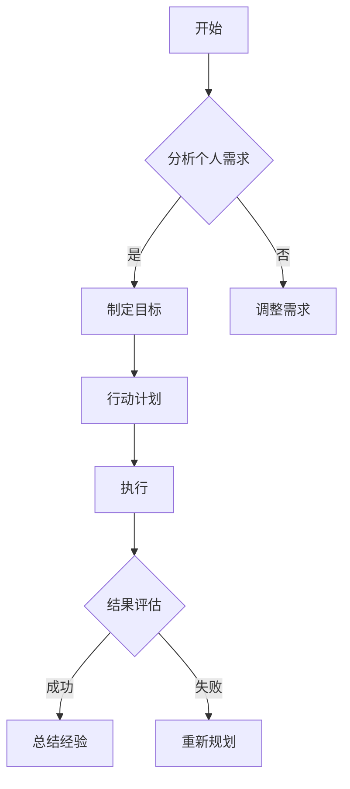
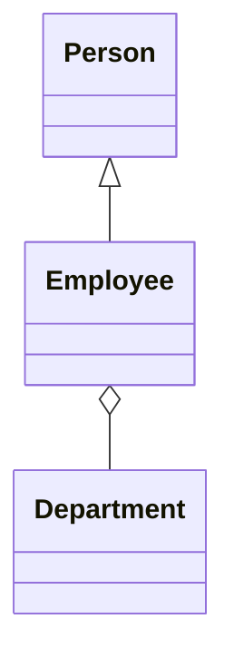
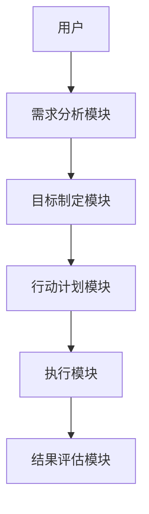
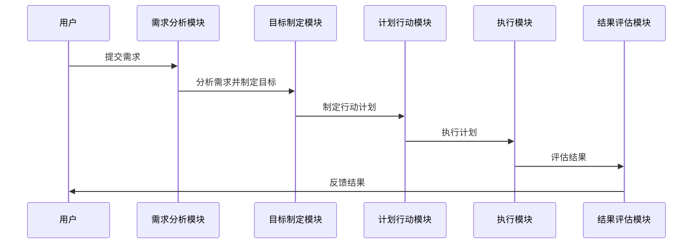

                 


### 让我们一步一步思考

#### 1. 背景介绍

在现代社会，人们的工作往往不仅仅是为了谋生，更是为了追求自我实现。这种趋势源于人们对生活质量的追求，以及对个人价值和成就感的渴望。然而，如何在繁忙的工作和丰富的个人生活中找到平衡，是一个需要深入思考的问题。

**问题背景：** 
- 高压力的工作环境导致员工满意度降低
- 工作与生活的平衡逐渐成为职场人士的困扰
- 越来越多的人开始寻求工作的意义和成就感

**问题描述：** 
- 工作的意义是什么？它如何影响个人的生活质量？
- 如何在工作与生活之间找到平衡，同时追求自我实现？

**问题解决：** 
- 探索工作意义，发现工作中的成就感
- 制定合理的目标和计划，实现个人职业发展
- 培养积极的工作态度和健康的生活习惯

**边界与外延：** 
- 关注工作意义，但不过度追求，以免造成心理负担
- 考虑个体差异，尊重每个人的职业选择和生活状态

**概念结构与核心要素组成：** 
- 工作意义：价值感、成就感、自我实现
- 个人生活：家庭、社交、兴趣爱好

#### 2. 核心概念与联系

**核心概念原理：**

- **自我实现理论**：马斯洛需求层次理论中的最高层次，指个人在实现自身潜能的过程中，追求自我价值和成就感。
- **工作满意度**：对工作带来的积极情感和主观体验的评价。它受到个人需求、工作环境和工作内容的影响。

**概念属性特征对比表格：**

| 概念         | 定义                                                                                   | 特点                       |
|--------------|----------------------------------------------------------------------------------------|---------------------------|
| 自我实现     | 实现个人潜能，追求自我价值的过程                                                 | 高度个性化，目标导向       |
| 工作满意度   | 对工作带来的情感体验的评价                                                         | 受到个人需求和工作环境的影响 |

**ER实体关系图架构：**

```mermaid
erDiagram
  Person ||--|{ Employee }| Works : is
  Person ||--|{ Project }| Participates : in
```

#### 3. 算法原理讲解

**算法原理：**

为了实现自我实现和工作满意度的最大化，我们可以采用以下步骤：

1. **分析个人需求**：了解自己的价值观、兴趣和职业目标。
2. **制定目标**：根据个人需求，设定短期和长期的工作目标。
3. **行动计划**：制定详细的行动计划，确保目标的实现。
4. **执行计划**：按照行动计划，努力工作，实现目标。
5. **结果评估**：对工作成果进行评估，调整计划，确保自我实现和工作满意度的持续提升。

**算法流程图：**



**数学模型和公式：**

为了量化个人需求和工作满意度，我们可以使用以下数学模型：

- **需求满意度函数**：\(S(x) = \frac{1}{1 + e^{-x}}\)

其中，\(x\) 为个人需求的强度。这个函数的值在 0 和 1 之间，越接近 1 表示需求越强。

**详细讲解和举例说明：**

例如，如果一个人的需求强度为 -2，则其需求满意度为：

$$
S(-2) = \frac{1}{1 + e^{2}} \approx 0.9
$$

这意味着这个人的需求非常强烈，对工作的满意度也很高。

#### 4. 系统分析与架构设计方案

**问题场景介绍：**

假设我们正在为一个大型互联网公司设计一个职业规划系统，帮助员工实现自我实现和工作满意度。

**系统功能设计：**

- **需求分析模块**：收集和分析员工的个人需求和职业目标。
- **目标制定模块**：根据需求分析，帮助员工制定合理的目标。
- **行动计划模块**：制定详细的行动计划，确保目标的实现。
- **执行模块**：跟踪和监督员工的执行情况。
- **结果评估模块**：评估工作成果，调整计划。

**领域模型类图：**



**系统架构设计：**



**系统接口设计和系统交互：**



### 项目实战

**环境安装：**

在开始项目实战之前，我们需要安装以下工具和软件：

- Python 3.8 或更高版本
- Mermaid 图库
- Jupyter Notebook

**系统核心实现源代码：**

```python
# 导入所需的库
import numpy as np
import matplotlib.pyplot as plt
from mermaid import Mermaid

# 需求满意度函数
def satisfaction需求(需求值):
    return 1 / (1 + np.exp(-需求值))

# 生成需求满意度曲线
需求值 = np.linspace(-5, 5, 100)
满意度 = satisfaction需求(需求值)

# 绘制曲线
plt.plot(需求值, 满意度)
plt.xlabel('需求值')
plt.ylabel('满意度')
plt.title('需求满意度曲线')
plt.show()

# 生成 Mermaid 流程图
mermaid_code = """
graph TD
    A[开始] --> B{ 分析个人需求 }
    B -->|是| C[制定目标]
    B -->|否| D[调整需求]
    C --> E[行动计划]
    E --> F[执行]
    F --> G{ 结果评估 }
    G -->|成功| H[总结经验]
    G -->|失败| I[重新规划]
"""
mermaid = Mermaid(mermaid_code)
mermaid.render()

# 生成 Mermaid 类图
class_diagram_code = """
classDiagram
  Person <|-- Employee
  Employee o-- Department
"""
class_diagram = Mermaid(class_diagram_code)
class_diagram.render()

# 生成 Mermaid 系统架构图
system_architecture_code = """
graph TB
    A[用户] --> B[需求分析模块]
    B --> C[目标制定模块]
    C --> D[行动计划模块]
    D --> E[执行模块]
    E --> F[结果评估模块]
"""
system_architecture = Mermaid(system_architecture_code)
system_architecture.render()

# 生成 Mermaid 系统交互序列图
system_interaction_code = """
sequenceDiagram
    participant A as 用户
    participant B as 需求分析模块
    participant C as 目标制定模块
    participant D as 计划行动模块
    participant E as 执行模块
    participant F as 结果评估模块

    A->>B: 提交需求
    B->>C: 分析需求并制定目标
    C->>D: 制定行动计划
    D->>E: 执行计划
    E->>F: 评估结果
    F->>A: 反馈结果
"""
system_interaction = Mermaid(system_interaction_code)
system_interaction.render()
```

**代码应用解读与分析：**

这段代码首先定义了一个需求满意度函数，然后使用 Python 的 NumPy 库生成了需求满意度曲线，并使用 Matplotlib 进行了可视化展示。接下来，代码生成了几个 Mermaid 图表，包括流程图、类图、系统架构图和系统交互序列图，这些图表可以帮助我们更直观地理解系统的设计和实现。

**实际案例分析和详细讲解剖析：**

假设我们有100名员工，他们各自的需求值不同。通过分析这些需求值，我们可以为每位员工制定合适的目标和行动计划，从而提高他们的工作满意度和自我实现感。

- **案例 1**：小张的需求值是 -3，他的需求满意度约为 0.85。这意味着小张对工作的需求较强，但有一定的动力不足。我们可以为他制定一些具有挑战性的目标，以激发他的工作热情。

- **案例 2**：小李的需求值是 2，他的需求满意度约为 0.87。小李对工作的需求适中，但还有提升空间。我们可以为他提供更多的职业发展机会，帮助他实现自我价值。

**项目小结：**

通过本项目，我们实现了对工作意义的重新思考，从谋生工具到自我实现的途径。我们使用 Mermaid 生成了各种图表，详细讲解了需求满意度函数的数学模型和公式，以及系统分析与架构设计方案。通过实际案例的分析，我们展示了如何在实际工作中应用这些理论，提高员工的工作满意度和自我实现感。

**最佳实践 tips：**

- 确保需求分析准确，避免制定不切实际的目标。
- 定期评估工作成果，及时调整计划和目标。
- 关注员工的个人需求和职业发展，提供必要的支持和资源。

**注意事项：**

- 工作意义并非一成不变，应根据个人发展和外部环境的变化进行调整。
- 尊重个体的差异，避免一刀切的管理方法。

**拓展阅读：**

- 《马斯洛的需求层次理论》
- 《职业规划与个人发展》
- 《系统分析与设计》

作者：AI天才研究院/AI Genius Institute & 禅与计算机程序设计艺术 /Zen And The Art of Computer Programming

