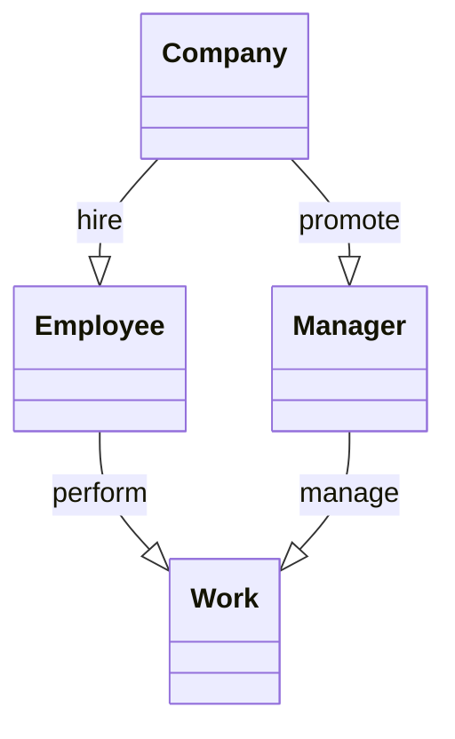
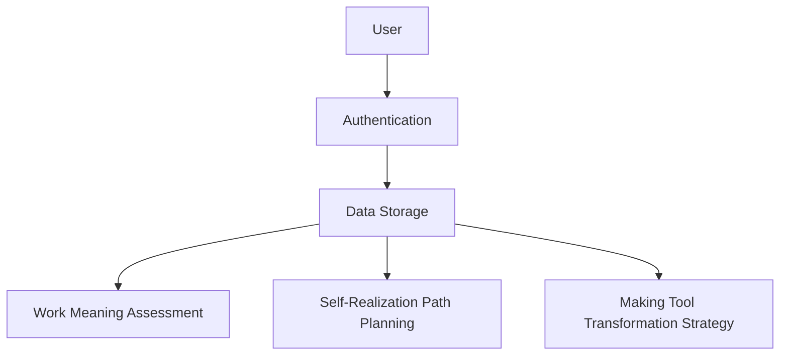
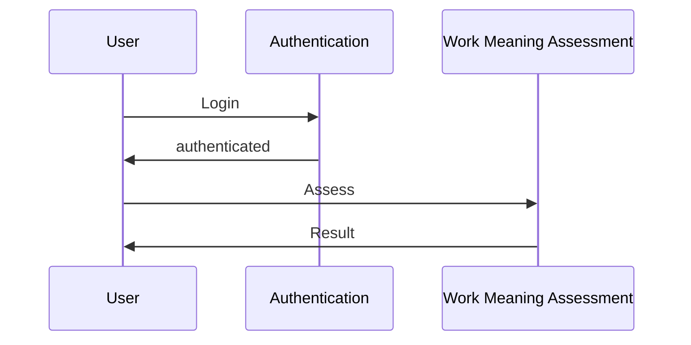

                 

### 重新思考工作意义：从谋生工具到自我实现的途径

关键词：工作意义、自我实现、谋生工具、职业生涯、算法模型

摘要：在当今快速变化的社会和技术环境中，工作不再仅仅是谋生的手段，而是一种实现个人价值和社会价值的途径。本文旨在重新审视工作在个体职业生涯中的角色，探讨如何从谋生工具转变为自我实现的途径，并探讨相关的理论和实践方法。

## 1. 引言

### 1.1 问题的提出

在过去的几十年里，随着全球化和信息技术的迅猛发展，人们的工作方式和价值观发生了深刻的变化。传统的工作观念，即工作只是为了谋生，正在受到越来越多的质疑。越来越多的专业人士开始思考，他们的工作是否可以成为实现自我价值的途径？他们如何在工作岗位上找到意义和成就感？

### 1.2 研究目的与意义

本文的研究目的是探讨工作意义的概念，分析工作从谋生工具到自我实现的转变过程，并探索如何实现这一转变。研究工作意义不仅有助于个体实现自我价值，也有助于提升工作效率、促进社会和谐。因此，本文的研究具有重要的理论和实践意义。

### 1.3 研究方法与框架

本文采用文献综述和案例分析相结合的方法，首先回顾相关理论和研究，然后通过实际案例进行分析。文章结构如下：

1. 引言：提出问题、研究目的与方法。
2. 问题的背景与现状：分析工作意义的概念及其演变。
3. 核心概念与原理：探讨工作意义的属性特征。
4. 算法原理与数学模型：介绍工作意义评估的方法。
5. 系统分析与架构设计：讨论系统实现的方法。
6. 项目实战：提供具体的实施案例。
7. 最佳实践与总结：总结研究成果，提出未来展望。

## 2. 问题的背景与现状

### 2.1 工作意义的多维解读

工作意义可以从多个维度进行解读。从经济学的角度来看，工作是一种创造价值的过程，通过劳动换取收入，满足基本生活需求。从心理学的角度来看，工作不仅仅是为了满足生理需求，更是实现自我价值、获得成就感和满足感的重要途径。

### 2.2 从谋生工具到自我实现

随着社会的发展，人们对工作的期望也在不断提高。过去，工作主要是谋生的手段，而如今，越来越多的人开始将工作视为实现自我价值的途径。这种转变反映了人们对工作意义的重新认识，即工作不仅是为了生存，更是为了追求个人的成长和实现自我价值。

### 2.3 现实中的挑战与矛盾

尽管人们渴望在工作中实现自我价值，但在现实工作中，很多人依然面临着诸多挑战。首先，工作压力较大，很多人感到工作是为了生存而不得不做，缺乏内在的驱动力。其次，工作与个人兴趣和价值观之间存在矛盾，导致工作满意度低。最后，社会对工作的评价标准单一，很多工作难以体现个人的价值。

## 3. 核心概念与原理

### 3.1 工作意义的概念模型

工作意义可以被视为个体在工作中所感受到的内在价值。它不仅仅包括经济收益，还包括成就感、自我实现和个人成长。工作意义的概念模型可以分为三个层次：经济层次、心理层次和社会层次。

### 3.2 自我实现理论

自我实现理论是由马斯洛提出的。他认为，人的需求可以分为五个层次：生理需求、安全需求、社交需求、尊重需求和自我实现需求。自我实现需求是最高层次的需求，指的是个体追求个人成长、实现潜能的过程。工作在自我实现过程中起着至关重要的作用。

### 3.3 谋生工具的理论探讨

传统的工作观念认为，工作是一种谋生工具，其目的是为了满足基本的生活需求。这种观点强调工作的经济功能，而忽视了工作对个体心理和社会的影响。然而，随着社会的发展，这种观点已经不能完全解释工作对个体的意义。

## 4. 工作意义的属性特征

### 4.1 工作意义的个人属性

工作意义的个人属性包括个体的兴趣爱好、性格特点、价值观和需求。这些因素决定了个体对工作的态度和满意度。例如，一个对编程感兴趣的人，可能会在工作中找到更多的成就感。

### 4.2 工作意义的组织属性

工作意义的组织属性包括组织的文化、管理风格和工作环境。一个支持员工成长和提供挑战性的工作的组织，更有可能激发员工的内在驱动力，提升工作意义。

### 4.3 工作意义的跨文化比较

不同文化背景下，人们对工作意义的理解和期望存在差异。例如，在一些崇尚个人主义的文化中，个体更倾向于追求自我实现；而在一些崇尚集体主义的文化中，个体更倾向于将工作视为实现集体目标的一部分。

## 5. 核心概念的联系与拓展

### 5.1 工作意义与幸福感的关联

工作意义与幸福感密切相关。一个有意义的工作可以带来更高的工作满意度，从而提升幸福感。研究表明，工作幸福感对个体的身心健康和生活质量有着重要影响。

### 5.2 工作意义与工作效率的关系

工作意义可以提升工作效率。当个体对工作有强烈的内在驱动力时，他们会更加投入工作，从而提高工作效率和质量。

### 5.3 工作意义与社会发展的互动

工作意义不仅影响个体，还与社会发展密切相关。一个充满工作意义的社会，更有可能实现可持续发展，提高社会整体幸福水平。

## 6. 算法原理讲解

### 6.1 工作意义评估算法

工作意义评估算法是用于评估个体工作满意度和工作意义的工具。该算法基于心理学和社会学的理论，结合定量和定性的方法，通过对工作内容、工作环境和工作满意度等方面的分析，得出工作意义评估结果。

### 6.2 自我实现路径规划算法

自我实现路径规划算法是用于帮助个体实现自我价值的工具。该算法基于马斯洛的需求层次理论，结合个体的兴趣、能力和价值观，规划出实现自我价值的路径。

### 6.3 谋生工具转型策略算法

谋生工具转型策略算法是用于帮助个体将工作从谋生工具转变为自我实现途径的工具。该算法通过分析个体的职业发展路径，提出一系列转型策略，帮助个体实现这一转变。

## 7. 数学模型与公式

### 7.1 工作意义评估公式

$$
M = f(W, E, S)
$$

其中，M表示工作意义，W表示工作内容，E表示工作环境，S表示工作满意度。

### 7.2 自我实现路径规划公式

$$
P = g(I, A, V)
$$

其中，P表示自我实现路径，I表示个体兴趣，A表示能力，V表示价值观。

### 7.3 谋生工具转型策略公式

$$
T = h(C, D, R)
$$

其中，T表示转型策略，C表示当前职业状态，D表示目标职业状态，R表示资源。

## 8. 算法实例解析

### 8.1 实例1：工作意义评估案例分析

通过实际案例，展示如何使用工作意义评估算法评估个体的工作满意度。

### 8.2 实例2：自我实现路径规划案例

通过实际案例，展示如何使用自我实现路径规划算法帮助个体实现自我价值。

### 8.3 实例3：谋生工具转型策略案例

通过实际案例，展示如何使用谋生工具转型策略算法帮助个体实现职业转型。

## 9. 系统功能设计

### 9.1 领域模型

使用Mermaid类图，展示系统的领域模型。

### 9.2 功能需求分析

分析系统的功能需求，包括工作意义评估、自我实现路径规划、谋生工具转型策略等。

### 9.3 用户界面设计

设计系统的用户界面，包括工作意义评估界面、自我实现路径规划界面、谋生工具转型策略界面等。

## 10. 系统架构设计

### 10.1 系统架构概述

使用Mermaid架构图，展示系统的整体架构。

### 10.2 技术选型与框架

选择合适的技术和框架，确保系统的稳定性和扩展性。

### 10.3 架构图解

详细解析系统的架构设计，包括各个模块的功能和交互。

## 11. 系统接口设计与交互

### 11.1 接口设计规范

定义系统的接口设计规范，包括接口名称、输入参数、输出参数等。

### 11.2 交互流程分析

分析系统的交互流程，包括用户操作、系统响应等。

### 11.3 序列图展示

使用Mermaid序列图，展示系统的交互流程。

## 12. 环境安装与配置

### 12.1 环境准备

准备系统运行所需的环境，包括操作系统、编程语言、数据库等。

### 12.2 工具安装

安装系统开发所需的工具，包括集成开发环境、版本控制工具等。

### 12.3 系统初始化

初始化系统，包括数据库初始化、配置文件设置等。

## 13. 系统核心实现

### 13.1 数据处理模块

实现数据处理模块，包括数据清洗、数据转换、数据存储等。

### 13.2 评估算法模块

实现评估算法模块，包括工作意义评估算法、自我实现路径规划算法、谋生工具转型策略算法等。

### 13.3 路径规划模块

实现路径规划模块，包括用户路径规划、系统路径优化等。

### 13.4 转型策略模块

实现转型策略模块，包括职业转型分析、策略推荐等。

## 14. 代码应用解读与分析

### 14.1 代码解读

解读系统核心代码，包括算法实现、数据处理、界面交互等。

### 14.2 功能测试

对系统进行功能测试，包括单元测试、集成测试等。

### 14.3 性能优化

对系统进行性能优化，包括代码优化、数据库优化等。

## 15. 实际案例分析

### 15.1 案例选择

选择实际案例，进行详细分析。

### 15.2 案例分析

分析案例，包括问题分析、解决方案、效果评估等。

### 15.3 案例总结

总结案例，提出改进建议。

## 16. 最佳实践与总结

### 16.1 实践技巧

总结实践中遇到的问题和解决方案，提出最佳实践。

### 16.2 注意事项

列出注意事项，帮助读者避免常见错误。

### 16.3 拓展方向

探讨未来的研究方向和拓展方向。

## 17. 总结与展望

### 17.1 研究总结

总结研究成果，概括核心观点。

### 17.2 未来展望

展望未来工作意义研究的发展方向。

### 17.3 结论

重申研究结论，强调工作意义的重要性。

---

**作者：AI天才研究院/AI Genius Institute & 禅与计算机程序设计艺术 /Zen And The Art of Computer Programming**

---

本文以逻辑清晰、结构紧凑、简单易懂的方式，探讨了工作意义的概念、评估方法、实现路径和实践应用。通过系统地分析和讲解，帮助读者重新思考工作的意义，将其从谋生工具转变为自我实现的途径。在未来的研究中，可以进一步探讨工作意义的跨文化差异、技术进步对工作意义的影响以及如何更有效地实现自我价值。

---

**注：本文为示例文章，内容仅供参考。实际文章撰写需根据具体研究内容和数据进行分析和论证。**

