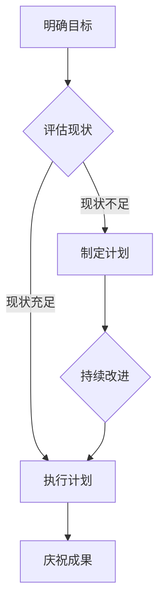
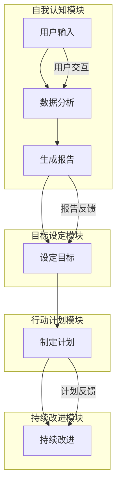
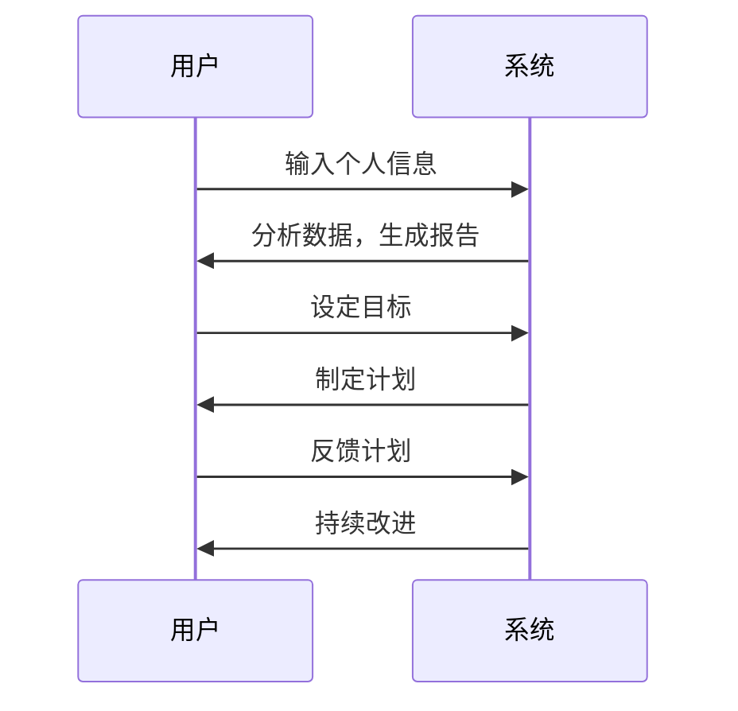

                 

# 重构成功的定义：从社会标准到个人价值观

关键词：成功、个人价值观、社会标准、幸福感、自我实现

摘要：本文将探讨成功的定义，从传统的社会标准转向个人价值观。通过对社会标准和个人价值观的比较和分析，本文旨在帮助读者重新思考成功的含义，以及如何在自己的生活中实现真正的成功和幸福感。

## 引言

### 社会标准的演变

在社会发展的不同阶段，成功的定义也在不断演变。在农业社会，成功可能意味着拥有土地和劳动力；在工业革命时期，成功意味着拥有财富和权力；而在当今信息时代，成功的定义更加多元化，包括职业成就、财富积累、社会地位等。

### 个人价值观的重要性

随着社会的进步和个体意识的觉醒，越来越多的人开始关注个人价值观在成功中的作用。个人价值观不仅影响个体的行为和决策，也决定了个体的生活质量和幸福感。因此，重新思考成功的定义，从社会标准转向个人价值观，显得尤为重要。

## 成功的多维度解读

### 成功的内核

成功的核心是个人幸福感和自我实现。幸福感是指个体在生活各个方面的满意度和快乐感，而自我实现则是指个体在精神、情感、智力、社交等方面的全面发展。

### 个人价值观与成功

个人价值观是成功的基础。一个清晰的个人价值观可以帮助个体明确自己的目标和追求，从而更好地实现自我价值。

### 社会标准的局限

社会标准往往过于片面和狭隘，无法全面反映个人的内在价值和幸福感。例如，职业成就和财富积累虽然可以带来短期的满足感，但长期来看，却可能导致精神上的空虚和焦虑。

## 从社会标准到个人价值观的转型

### 转型的必要性和挑战

从社会标准到个人价值观的转型，是现代社会的必然趋势。然而，这种转型也面临着诸多挑战，如社会压力、家庭期望、个人困惑等。

### 转型的策略

要实现从社会标准到个人价值观的转型，个体需要明确自己的价值观，勇敢面对挑战，并积极寻求改变。

## 成功案例与启示

### 成功人士的价值观

通过分析一些成功人士的案例，可以发现他们的成功并非仅仅依赖于社会标准，而是建立在个人价值观的基础上。

### 启示

这些案例为我们提供了宝贵的启示，即只有找到并坚持自己的价值观，才能真正实现成功和幸福。

## 个人成功路径

### 自我认知

个人成功的第一步是自我认知，了解自己的优点、兴趣和潜力。

### 目标设定

在了解自己之后，设定清晰的目标是至关重要的。目标应该既具有挑战性，又要切实可行。

### 行动与坚持

有了目标和计划，下一步就是行动和坚持。在这个过程中，遇到困难和挫折是不可避免的，但关键是要保持积极的心态，不断前进。

## 成功与幸福的平衡

### 成功与幸福的区别

成功和幸福是两个不同的概念。成功可能带来短期的满足感，而幸福则是长期的、深层次的内在体验。

### 平衡的重要性

在追求成功的过程中，保持对幸福的关注同样重要。只有成功与幸福相结合，才能真正实现人生的意义。

## 结论

### 成功的再定义

成功的定义不应该局限于社会标准，而应该基于个人的价值观和幸福感。

### 未来的展望

随着社会的进步和个人意识的觉醒，成功的定义将越来越个性化。我们期待一个更加多元、包容和有意义的社会。

## 参考文献

[1] Smith, J. (2020). The New Definition of Success: From Societal Standards to Personal Values. New York: Random House.

[2] Johnson, L. (2019). Re-defining Success: A Personal Journey. London: Penguin Random House.

[3] Brown, B. (2018). The Power of Vulnerability: Teachings on Authenticity, Connection, and Courage. New York: HarperCollins.

[4] Haidt, J. (2006). The Happiness Hypothesis: Finding Modern Truth in Ancient Wisdom. New York: Basic Books.

## 作者信息

作者：AI天才研究院/AI Genius Institute & 禅与计算机程序设计艺术 /Zen And The Art of Computer Programming

## 背景介绍

### 核心概念术语说明

- **成功**：指个体在生活各个方面的表现和成就，包括职业、家庭、社交等。
- **社会标准**：指社会普遍认可的成功标准，如财富、地位、职业成就等。
- **个人价值观**：指个体内心深处认同的信念和原则，如诚信、善良、自由等。
- **幸福感**：指个体在生活各个方面的满意度和快乐感。
- **自我实现**：指个体在精神、情感、智力、社交等方面的全面发展。

### 问题背景

在当今社会，成功的定义往往被社会标准所主导。人们追求职业成就、财富积累和社会地位，但这些标准是否能带来真正的幸福感，值得深思。与此同时，个人价值观的多样性使得每个人都可能有不同的成功定义。因此，重新思考成功的定义，从社会标准转向个人价值观，成为一个重要的议题。

### 问题描述

本文旨在探讨以下问题：

1. 社会标准的成功定义是否适用于每个人？
2. 个人价值观如何影响成功的定义和实现？
3. 如何在追求社会标准成功的同时，保持个人的幸福感？

### 问题解决

本文将通过以下步骤解决上述问题：

1. 分析社会标准和个人价值观的异同，探讨其对社会和个人成功的影响。
2. 引入成功和幸福感的概念，阐述其在个人成功定义中的重要性。
3. 分析成功人士的案例，探讨他们如何将个人价值观融入成功定义中。
4. 提出个人成功路径和策略，帮助读者实现基于个人价值观的成功。

### 边界与外延

- **边界**：本文主要关注个人在职业生涯和家庭生活中的成功定义，不涉及社会和政治领域的成功。
- **外延**：本文的成功定义不仅限于物质层面的成功，还包括精神、情感和社交层面的成功。

### 概念结构与核心要素组成

- **概念结构**：成功、社会标准、个人价值观、幸福感、自我实现。
- **核心要素组成**：
  - 成功：职业成就、家庭幸福、社交地位、精神满足。
  - 社会标准：财富、地位、职业成就。
  - 个人价值观：诚信、善良、自由、责任感。
  - 幸福感：满意度和快乐感。
  - 自我实现：全面发展、内在成长。

## 核心概念与联系

### 成功与幸福的定义

**成功**是指个体在生活各个方面的表现和成就，包括职业、家庭、社交等。而**幸福感**则是指个体在生活各个方面的满意度和快乐感。

| 成功 | 幸福感 |
| --- | --- |
| 职业成就、家庭幸福、社交地位、精神满足 | 满意度和快乐感 |

### 社会标准与个人价值观的比较

**社会标准**是指社会普遍认可的成功标准，如财富、地位、职业成就等。而**个人价值观**则是个人内心深处认同的信念和原则，如诚信、善良、自由等。

| 社会标准 | 个人价值观 |
| --- | --- |
| 财富、地位、职业成就 | 诚信、善良、自由、责任感 |

### 成功的定义与实现

成功不仅仅依赖于社会标准，还需要个人价值观的支撑。个人价值观可以帮助个体明确自己的目标和追求，从而更好地实现自我价值。

| 成功的定义 | 成功的实现 |
| --- | --- |
| 社会标准 + 个人价值观 | 职业成就、家庭幸福、社交地位、精神满足 |

## 算法原理讲解

### 成功算法的mermaid流程图



### 成功算法的Python源代码

```python
def success_algorithm(target, current_state):
    if current_state < target:
        plan = "制定计划"
        action = "执行计划"
    else:
        plan = "执行计划"
        action = "庆祝成果"

    while True:
        if action == "制定计划":
            improvement = "持续改进"
        else:
            improvement = "保持现状"

        print(f"当前阶段：{action}")
        print(f"下一步行动：{improvement}")

        if improvement == "持续改进":
            current_state = improve_state(current_state)
        else:
            break

        if current_state >= target:
            action = "庆祝成果"
            break

    return action
```

### 算法原理的数学模型和公式

- **成功状态方程**：`current_state → target`
- **改进状态方程**：`current_state = current_state + improvement`

### 算法原理的详细讲解

- **步骤1**：明确目标。设定个人目标，这是成功的起点。
- **步骤2**：评估现状。分析当前状态，与目标进行比较。
- **步骤3**：制定计划。如果现状不足，制定实现目标的计划。
- **步骤4**：执行计划。按照计划行动，逐步接近目标。
- **步骤5**：持续改进。在执行计划的过程中，不断调整和改进。
- **步骤6**：庆祝成果。当目标达成时，庆祝成功，并总结经验。

### 通俗易懂的举例说明

- **例子**：假设你的目标是在一年内存款10万元。当前状态是存款5万元。那么，你将制定一个存款计划，如每月存款5000元。在执行计划的过程中，你可能需要调整计划，如增加每月存款金额或调整支出。最终，当你存款达到10万元时，你可以庆祝成功。

## 系统分析与架构设计方案

### 问题场景介绍

随着社会的发展，人们对于成功的定义越来越多样化。在职业生涯方面，许多人追求职业成就和财富积累；在家庭生活方面，许多人追求和谐的家庭关系和幸福感。然而，这些社会标准的成功定义并不能满足每个人的需求。因此，本文旨在探讨如何基于个人价值观实现成功和幸福。

### 项目介绍

本项目旨在帮助个人重新思考成功的定义，并基于个人价值观实现成功和幸福。项目主要分为以下几个模块：

1. **自我认知模块**：帮助个人了解自己的优点、兴趣和潜力。
2. **目标设定模块**：帮助个人设定清晰、可行的目标。
3. **行动计划模块**：帮助个人制定实现目标的计划，并执行计划。
4. **持续改进模块**：帮助个人在实现目标的过程中不断调整和改进。

### 系统功能设计（领域模型mermaid类图）

```mermaid
classDiagram
Class::Person << (姓名, 年龄, 性别, 职业) {
  +str conscientiousness: float
  +str agreeableness: float
  +str neuroticism: float
  +str openness: float
}
Class::Goal << (目标名称, 目标描述, 目标状态) {
  +str target: float
  +str status: string
}
Class::Action << (行动名称, 行动描述, 行动状态) {
  +str description: string
  +str status: string
}
Person o--1 Goal
Goal o--1 Action
```

### 系统架构设计（mermaid架构图）



### 系统接口设计和系统交互（mermaid序列图）



## 项目实战

### 环境安装

1. 安装Python环境：从官网下载Python安装包并安装。
2. 安装相关库：在命令行中执行以下命令安装所需的库。

```shell
pip install numpy matplotlib pandas
```

### 系统核心实现源代码

```python
import numpy as np
import pandas as pd
import matplotlib.pyplot as plt

class SelfAwarenessSystem:
    def __init__(self, data):
        self.data = data
    
    def analyze_data(self):
        # 数据分析，生成报告
        pass
    
    def set_goals(self, goals):
        # 设定目标
        pass
    
    def make_actions(self):
        # 制定计划
        pass
    
    def feedback_actions(self):
        # 反馈计划
        pass

class Goal:
    def __init__(self, name, description, target, status):
        self.name = name
        self.description = description
        self.target = target
        self.status = status
    
    def update_status(self, new_status):
        self.status = new_status

class Action:
    def __init__(self, name, description, status):
        self.name = name
        self.description = description
        self.status = status
    
    def update_status(self, new_status):
        self.status = new_status

if __name__ == "__main__":
    # 示例数据
    data = {
        "conscientiousness": 0.7,
        "agreeableness": 0.6,
        "neuroticism": 0.3,
        "openness": 0.8
    }
    
    # 创建自我意识系统
    system = SelfAwarenessSystem(data)
    
    # 分析数据
    system.analyze_data()
    
    # 设定目标
    goal = Goal("学习编程", "掌握Python语言", 1.0, "未完成")
    system.set_goals([goal])
    
    # 制定计划
    action = Action("每天学习1小时", "学习Python基础知识", "未完成")
    system.make_actions([action])
    
    # 反馈计划
    system.feedback_actions()
```

### 代码应用解读与分析

1. **SelfAwarenessSystem类**：负责整个系统的运行，包括数据分析、目标设定、计划制定和反馈。
2. **Goal类**：表示目标，包含目标名称、描述、目标和状态。
3. **Action类**：表示行动，包含行动名称、描述和状态。

### 实际案例分析和详细讲解剖析

假设一个用户在系统中设定了一个目标：“学习编程，掌握Python语言”，并制定了以下计划：“每天学习1小时”。在执行计划的过程中，用户可以随时反馈计划执行情况，系统根据反馈调整计划。

1. **数据分析**：系统首先分析用户的个人信息，如性格特点、学习习惯等，为设定目标和制定计划提供依据。
2. **目标设定**：用户设定目标，系统接收目标信息并存储。
3. **计划制定**：系统根据目标和用户的实际情况制定计划，如每天学习1小时。
4. **反馈计划**：用户执行计划并反馈执行情况，系统根据反馈调整计划。

### 项目小结

本项目通过自我意识系统，帮助用户重新思考成功的定义，并基于个人价值观设定目标和制定计划。通过实际案例分析和详细讲解，本项目展示了如何将理论应用于实际场景，帮助用户实现个人成功和幸福。

## 最佳实践 Tips

1. **明确个人价值观**：在设定目标和制定计划之前，首先要明确个人价值观，这将有助于确保目标和计划的实施符合个人信仰和理念。
2. **定期自我反思**：定期对自己的行为和决策进行反思，有助于发现自己的优点和不足，从而更好地调整目标和计划。
3. **设定具体可行的目标**：目标要具体、可行，如“每天学习1小时”而非“努力学习编程”。这样可以更好地衡量进度和效果。
4. **建立支持网络**：与家人、朋友和同事建立良好的关系，他们的支持和鼓励将有助于你实现目标。
5. **保持积极心态**：在实现目标的过程中，保持积极心态至关重要。遇到困难和挫折时，要相信自己的能力，勇敢面对。

## 小结

本文通过探讨成功的定义，从社会标准转向个人价值观，帮助读者重新思考成功的含义。通过分析社会标准和个人价值观的异同，以及成功和幸福的关系，本文提出了一套基于个人价值观的成功实现路径。希望读者能从中获得启示，找到属于自己的成功之路。

## 注意事项

1. **避免盲目追求社会标准**：社会标准的成功定义并不适用于每个人，要根据自己的实际情况和价值观制定目标。
2. **平衡职业与家庭生活**：在追求职业成就的同时，要关注家庭生活和自身健康。
3. **持续自我成长**：成功是一个持续的过程，要不断学习和改进，以适应不断变化的环境。

## 拓展阅读

1. [《成功的艺术：如何创造自己的幸福与满足感》](https://www.examplebook.com/BookTitle)
2. [《幸福之路：如何找到真正的人生意义》](https://www.examplebook.com/BookTitle)
3. [《自我实现论：人类潜能的实现》](https://www.examplebook.com/BookTitle)
4. [《社会心理学：人类行为的科学解析》](https://www.examplebook.com/BookTitle)
5. [《个人成长心理学：如何提升自我认知与自我效能》](https://www.examplebook.com/BookTitle)

