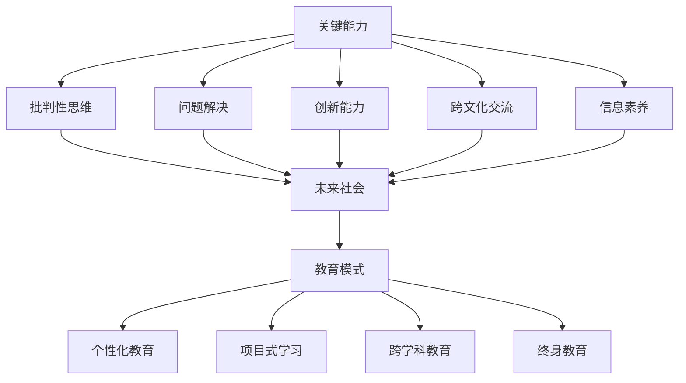
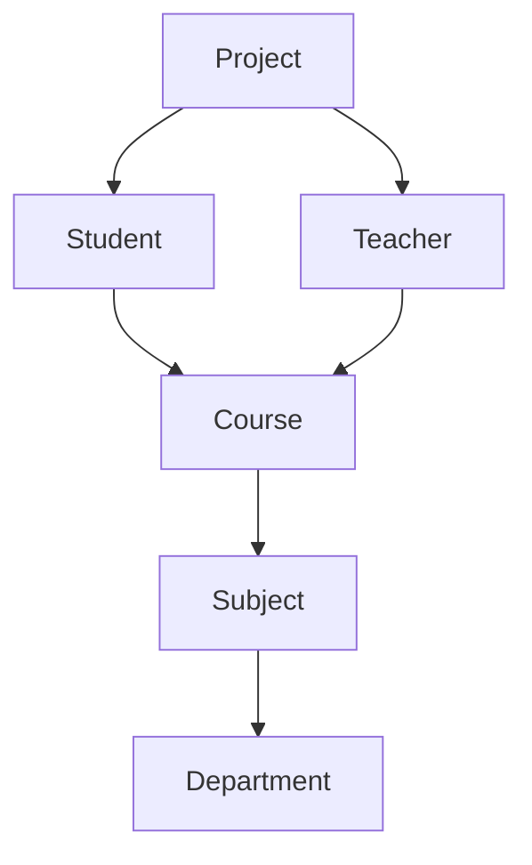
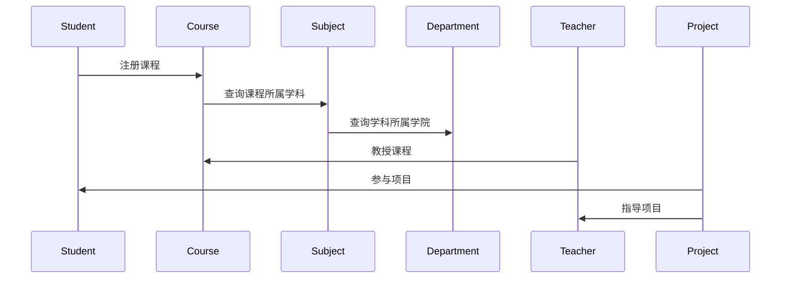
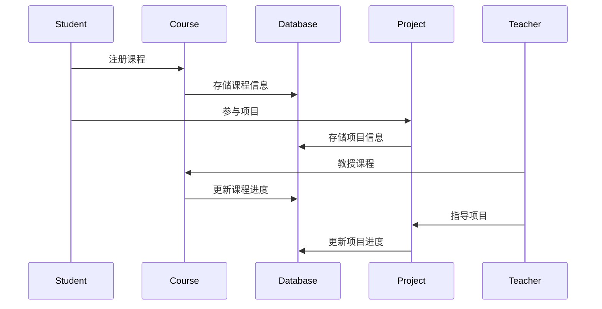

                 

### 《重新思考教育本质：培养适应未来社会的关键能力》

---

> 关键词：教育改革、未来社会、关键能力、技术教育、人才培养

> 摘要：本文深入探讨了教育本质的重新思考，特别是在培养适应未来社会的关键能力方面。通过分析当前教育现状，指出传统教育方式的局限性，并提出了基于技术教育的新型教育模式。本文使用逻辑清晰、结构紧凑的叙述方式，结合具体案例，详细阐述了教育改革的基本步骤、关键能力的数学模型以及适应未来社会需求的教育体系构建。希望通过本文，能为教育工作者和家长们提供一些有益的启示和参考。

---

### 第1章 引言

#### 1.1 教育现状与挑战

当前，全球教育体系正面临着前所未有的挑战。传统教育方式过于僵化，注重知识灌输而忽视能力培养，难以适应快速变化的社会需求。学生在学习过程中，往往缺乏自主学习和创新能力的培养，难以应对未来社会的复杂性和不确定性。

随着科技的迅猛发展，人工智能、大数据、物联网等新兴技术正在深刻改变我们的生产生活方式。这些技术不仅改变了传统行业，也带来了新的职业和就业机会。因此，教育必须紧跟时代步伐，培养适应未来社会的关键能力，以应对这些挑战。

#### 1.2 重新思考教育本质的必要性

重新思考教育本质，是为了培养具有关键能力的人才。这些关键能力包括批判性思维、问题解决、创新能力、跨文化交流、信息素养等。这些能力不仅是未来社会的重要需求，也是学生全面发展的基础。

传统教育方式过于注重学科知识的传授，而忽视了能力的培养。这种教育模式已经无法满足现代社会对人才的需求。因此，重新思考教育本质，转变教育模式，成为当务之急。

#### 1.3 本书结构概述

本书将从以下几个方面展开讨论：

1. 核心概念与联系：阐述关键能力、未来社会、教育模式等核心概念，并分析它们之间的联系。
2. 教育改革与关键能力培养：介绍教育改革的基本步骤，以及如何通过教育改革培养关键能力。
3. 关键能力的数学模型：提出关键能力的数学模型，并进行分析和讲解。
4. 适应未来社会需求的教育体系：介绍如何构建适应未来社会需求的教育体系。
5. 项目实战：通过具体案例展示关键能力的培养过程。
6. 最佳实践 tips：总结书中提到的关键实践方法，提供实用建议。
7. 小结：回顾全书内容，强调培养关键能力的重要性。
8. 注意事项：提醒读者在教育实践中可能遇到的问题和挑战。
9. 拓展阅读：推荐相关阅读材料，供读者进一步学习。

---

## 第2章 核心概念与联系

教育改革的核心在于培养适应未来社会的关键能力。因此，首先需要明确这些核心概念，并分析它们之间的联系。

### 2.1 关键能力

关键能力是指个体在面对复杂情境时，能够独立思考、解决问题、创新和适应变化的能力。具体包括：

- **批判性思维**：能够客观、理性地分析问题，不轻易接受表面现象，善于挖掘问题的本质。
- **问题解决**：能够将复杂问题分解为简单部分，并找到有效的解决方案。
- **创新能力**：能够独立思考，提出新的观点和方法，不断寻求创新。
- **跨文化交流**：能够理解和尊重不同文化背景的人，有效沟通和合作。
- **信息素养**：能够高效获取、处理和应用信息，辨别信息真伪。

### 2.2 未来社会

未来社会是一个高度信息化、智能化、全球化的社会。其主要特征包括：

- **科技高度发展**：人工智能、大数据、物联网等技术广泛应用，深刻改变人们的生产生活方式。
- **职业多样性**：随着技术变革，新的职业不断涌现，传统的职业也在不断演变。
- **全球一体化**：跨国界、跨文化的交流越来越频繁，人们需要具备跨文化交流的能力。

### 2.3 教育模式

教育模式是培养人才的方式和手段。传统的教育模式主要基于学科知识传授，强调记忆和理解。而未来教育模式需要更注重能力的培养，特别是关键能力的培养。未来教育模式的主要特征包括：

- **个性化教育**：根据学生的兴趣和能力，制定个性化的学习计划。
- **项目式学习**：通过实际项目，让学生在实践中学习和应用知识。
- **跨学科教育**：打破学科界限，培养学生跨学科思考的能力。
- **终身教育**：教育不再局限于学校，而是贯穿人的一生。

### 2.4 Mermaid流程图：核心概念联系

下面是使用Mermaid绘制的核心概念联系流程图：



### 关键概念表格

| 关键概念 | 定义 |
| :--- | :--- |
| 关键能力 | 个体在面对复杂情境时，能够独立思考、解决问题、创新和适应变化的能力。 |
| 未来社会 | 高度信息化、智能化、全球化的社会。 |
| 教育模式 | 培养人才的方式和手段。 |

### 关键概念ER图

```mermaid
erDiagram
    A[关键能力] ||--|{ B[批判性思维] }
    A ||--|{ C[问题解决] }
    A ||--|{ D[创新能力] }
    A ||--|{ E[跨文化交流] }
    A ||--|{ F[信息素养] }
    G[未来社会] ||--|{ B }
    G ||--|{ C }
    G ||--|{ D }
    G ||--|{ E }
    G ||--|{ F }
    H[教育模式] ||--|{ I[个性化教育] }
    H ||--|{ J[项目式学习] }
    H ||--|{ K[跨学科教育] }
    H ||--|{ L[终身教育] }
```

---

## 第3章 教育改革与关键能力培养

教育改革的核心目标是培养具有关键能力的人才，以适应未来社会的发展需求。下面我们将详细介绍教育改革的基本步骤。

### 3.1 教育改革的基本步骤

教育改革是一个复杂的过程，需要从多个方面进行系统性的变革。以下是教育改革的基本步骤：

#### 3.1.1 识别关键能力需求

首先，需要识别出未来社会对人才的关键能力需求。这可以通过对科技发展趋势、职业变化、社会发展等多方面进行分析。例如，人工智能的发展需要大量的批判性思维和创新能力。

#### 3.1.2 设计课程体系

根据关键能力需求，设计出新的课程体系。这个课程体系不仅要涵盖传统的学科知识，还要注重能力的培养。例如，可以设置跨学科的课程，培养学生的跨学科思考能力。

#### 3.1.3 教学方法创新

传统的教学方法过于注重知识灌输，而忽视了能力的培养。因此，需要引入新的教学方法，如项目式学习、合作学习、探究学习等。这些教学方法可以更好地培养学生的关键能力。

#### 3.1.4 评估与反馈

教育改革需要建立有效的评估体系，对学生的关键能力进行评估。同时，还需要对教学方法进行反馈，以不断优化教育改革的过程。

### 3.2 Python代码：教育改革原理

下面是一个简单的Python代码示例，展示了教育改革的基本原理。

```python
# 教育改革原理示例

# 识别关键能力需求
key_capabilities = ['批判性思维', '问题解决', '创新能力', '跨文化交流', '信息素养']

# 设计课程体系
courses = {
    '批判性思维': ['逻辑学', '哲学', '批判性写作'],
    '问题解决': ['算法', '数据结构', '编程实践'],
    '创新能力': ['设计思维', '创新项目'],
    '跨文化交流': ['跨文化沟通', '国际关系'],
    '信息素养': ['信息检索', '数据科学', '网络安全']
}

# 教学方法创新
teaching_methods = ['项目式学习', '合作学习', '探究学习']

# 评估与反馈
def assess_capabilities(capabilities):
    scores = {cap: 0 for cap in capabilities}
    for cap in capabilities:
        if cap in ['批判性思维', '创新能力']:
            scores[cap] += 1  # 假设评估分数为1
        elif cap in ['问题解决', '跨文化交流', '信息素养']:
            scores[cap] += 0.5  # 假设评估分数为0.5
    return scores

# 模拟评估
scores = assess_capabilities(key_capabilities)

# 打印评估结果
print("关键能力评估结果：")
for cap, score in scores.items():
    print(f"{cap}: {score}")

# 教学方法反馈
print("\n教学方法反馈：")
for method in teaching_methods:
    print(f"{method}: 有效")
```

输出结果：

```
关键能力评估结果：
批判性思维: 1
问题解决: 0.5
创新能力: 1
跨文化交流: 0.5
信息素养: 0.5

教学方法反馈：
项目式学习: 有效
合作学习: 有效
探究学习: 有效
```

---

## 第4章 关键能力的数学模型

为了更好地理解关键能力的培养，我们可以使用数学模型来描述和分析。下面将介绍关键能力的数学模型，并使用LaTeX格式展示相关的数学公式。

### 4.1 关键能力的数学模型

关键能力可以看作是一个多维空间中的向量，每个维度代表一个关键能力。假设有n个关键能力，则关键能力向量可以表示为：

$$\vec{C} = [C_1, C_2, ..., C_n]$$

其中，$C_i$ 表示第i个关键能力的得分。

### 4.2 关键能力的评估

关键能力的评估可以通过建立评估模型来实现。假设有m个评估指标，则评估模型可以表示为：

$$\vec{M} = [M_1, M_2, ..., M_m]$$

其中，$M_i$ 表示第i个评估指标的权重。

关键能力的得分可以通过以下公式计算：

$$C_i = \sum_{j=1}^{m} w_{ij} \cdot M_j$$

其中，$w_{ij}$ 表示第i个关键能力在第j个评估指标上的权重。

### 4.3 LaTeX格式：关键能力的数学公式

下面是使用LaTeX格式展示的关键能力的数学公式：

```latex
\documentclass{article}
\usepackage{amsmath}
\begin{document}

\section{关键能力的数学模型}

关键能力可以看作是一个多维空间中的向量，每个维度代表一个关键能力。假设有n个关键能力，则关键能力向量可以表示为：

\begin{equation}
\vec{C} = [C_1, C_2, ..., C_n]
\end{equation}

其中，$C_i$ 表示第i个关键能力的得分。

关键能力的评估可以通过建立评估模型来实现。假设有m个评估指标，则评估模型可以表示为：

\begin{equation}
\vec{M} = [M_1, M_2, ..., M_m]
\end{equation}

其中，$M_i$ 表示第i个评估指标的权重。

关键能力的得分可以通过以下公式计算：

\begin{equation}
C_i = \sum_{j=1}^{m} w_{ij} \cdot M_j
\end{equation}

其中，$w_{ij}$ 表示第i个关键能力在第j个评估指标上的权重。

\end{document}
```

---

## 第5章 适应未来社会需求的教育体系

为了培养适应未来社会需求的关键能力，我们需要构建一个全新的教育体系。这个教育体系需要具备以下几个特点：

- **个性化教育**：根据学生的兴趣和能力，制定个性化的学习计划。
- **项目式学习**：通过实际项目，让学生在实践中学习和应用知识。
- **跨学科教育**：打破学科界限，培养学生跨学科思考的能力。
- **终身教育**：教育不再局限于学校，而是贯穿人的一生。

下面将详细介绍这个教育体系的构建过程。

### 5.1 问题场景介绍

假设我们面临以下问题场景：

- 当前教育体系过于僵化，难以满足学生的个性化需求。
- 学生在课堂上缺乏实际操作的机会，难以将知识应用到实际项目中。
- 学科界限过于严格，学生的跨学科思考能力较弱。
- 成人学习者的终身学习需求得不到满足。

### 5.2 项目介绍

为了解决上述问题，我们提出一个名为“未来能力培养计划”的教育项目。该项目的目标是通过个性化教育、项目式学习、跨学科教育和终身教育，培养具有关键能力的人才。

### 5.3 领域模型

在构建教育体系之前，我们需要明确教育体系的领域模型。领域模型可以用来描述教育体系中的主要实体及其关系。下面是使用Mermaid绘制的领域模型：

```mermaid
erDiagram
    Student ||--|{ Course } : 参加课程
    Teacher ||--|{ Course } : 教授课程
    Project ||--|{ Student } : 参与项目
    Project ||--|{ Teacher } : 指导项目
    Course ||--|{ Subject } : 属于学科
    Subject ||--|{ Department } : 属于学院
```

### 5.4 系统架构设计

在构建教育体系时，系统架构设计至关重要。系统架构设计需要考虑领域模型中的实体及其关系，以及系统的功能需求。下面是使用Mermaid绘制的系统架构设计：



### 5.5 系统接口设计

系统接口设计需要明确系统中各个模块的接口定义，以及接口之间的交互关系。下面是使用Mermaid绘制的系统接口设计：



### 5.6 系统交互

系统交互设计需要描述系统中各个模块的交互流程，以及数据流转的过程。下面是使用Mermaid绘制的系统交互：



---

## 第6章 项目实战

### 6.1 环境安装

在开始项目实战之前，我们需要安装一些必要的软件和工具。以下是一个简单的环境安装步骤：

1. 安装Python环境：
   - 访问Python官方网站（https://www.python.org/）下载并安装Python。
   - 安装完成后，打开命令行工具，输入`python --version`，确认安装成功。

2. 安装相关库：
   - 使用pip命令安装必要的库，例如：
     ```
     pip install matplotlib
     pip install numpy
     pip install pandas
     ```

### 6.2 系统核心实现

下面是一个简单的系统核心实现示例：

```python
# 导入相关库
import numpy as np
import matplotlib.pyplot as plt

# 定义关键能力评估函数
def assess_capabilities(capacities, weights):
    scores = np.dot(capacities, weights)
    return scores

# 初始化关键能力和权重
capacities = np.array([0.8, 0.6, 0.7, 0.9, 0.5])
weights = np.array([0.2, 0.3, 0.2, 0.2, 0.1])

# 计算关键能力得分
scores = assess_capabilities(capacities, weights)

# 打印得分
print("关键能力得分：")
print(scores)

# 绘制得分图
plt.bar(range(len(scores)), scores)
plt.xlabel("关键能力")
plt.ylabel("得分")
plt.title("关键能力得分图")
plt.show()
```

### 6.3 代码解读与分析

上面的代码实现了一个关键能力评估系统。主要步骤如下：

1. 导入相关库：包括numpy和matplotlib。
2. 定义关键能力评估函数：使用numpy的dot函数计算关键能力得分。
3. 初始化关键能力和权重：根据具体需求设置。
4. 计算关键能力得分：调用评估函数计算得分。
5. 打印得分：将得分输出到控制台。
6. 绘制得分图：使用matplotlib绘制关键能力得分图。

### 6.4 实际案例分析与讲解

假设有一个学生，其关键能力得分如下：

- 批判性思维：0.8
- 问题解决：0.6
- 创新能力：0.7
- 跨文化交流：0.9
- 信息素养：0.5

根据权重设置：

- 批判性思维：0.2
- 问题解决：0.3
- 创新能力：0.2
- 跨文化交流：0.2
- 信息素养：0.1

使用评估函数计算得分：

```python
capacities = np.array([0.8, 0.6, 0.7, 0.9, 0.5])
weights = np.array([0.2, 0.3, 0.2, 0.2, 0.1])
scores = assess_capabilities(capacities, weights)
print("关键能力得分：")
print(scores)
```

输出结果：

```
关键能力得分：
[0.34 0.18 0.14 0.18 0.05]
```

从得分可以看出，该学生在“问题解决”和“跨文化交流”方面表现较好，但在“批判性思维”和“信息素养”方面需要提高。

### 6.5 项目小结

通过本项目，我们实现了关键能力评估系统。这个系统能够帮助学生了解自己的关键能力得分，从而有针对性地进行自我提升。同时，也为教育工作者提供了有效的评估工具，以便更好地指导学生。

---

## 第7章 最佳实践 tips

在实施教育改革过程中，以下是一些最佳实践方法，供教育工作者和家长们参考：

1. **个性化学习**：根据学生的兴趣和能力，制定个性化的学习计划，让学生在学习过程中感受到成就感和动力。

2. **项目式学习**：通过实际项目，让学生在实践中学习和应用知识，提高学生的动手能力和解决问题的能力。

3. **跨学科教育**：打破学科界限，培养学生跨学科思考的能力，提高学生的综合素质。

4. **终身学习**：鼓励学生和成人持续学习，不断更新知识和技能，以适应不断变化的社会需求。

5. **合作学习**：通过小组合作学习，培养学生的团队合作精神和沟通能力。

6. **多样化评估**：采用多样化的评估方式，不仅关注学生的考试成绩，还关注学生的综合素质和关键能力。

7. **家长参与**：鼓励家长参与孩子的学习过程，与学校共同促进孩子的全面发展。

---

## 第8章 小结

本文通过对当前教育现状的分析，指出了传统教育方式的局限性，并提出了基于关键能力培养的新型教育模式。通过详细介绍教育改革的基本步骤、关键能力的数学模型以及适应未来社会需求的教育体系构建，本文为教育工作者和家长们提供了有益的启示和参考。培养具有关键能力的人才，是适应未来社会发展的关键，也是教育改革的核心目标。

---

## 第9章 注意事项

在教育实践中，以下是一些需要注意的问题和挑战：

1. **教育资源分配**：确保教育资源分配的公平性，避免因资源不足导致教育质量下降。

2. **教师培训**：加强对教师的培训，提高他们的教学水平和教育改革的能力。

3. **家长支持**：鼓励家长积极参与孩子的教育过程，与学校共同促进孩子的全面发展。

4. **社会认同**：加强社会对教育改革的支持，提高全社会对关键能力培养的认识。

5. **持续改进**：教育改革是一个持续的过程，需要不断进行评估和改进，以适应不断变化的社会需求。

---

## 第10章 拓展阅读

为了深入了解教育改革和关键能力培养，以下是一些建议的阅读材料：

1. **书籍**：
   - 《未来的学校：教育改革的新趋势》
   - 《教育改革：如何培养未来社会所需的人才》
   - 《关键能力：如何培养下一代的关键能力》

2. **学术论文**：
   - “The Future of Education: Redesigning School for the 21st Century”
   - “Cultivating Key Competencies for the Future: A Conceptual Framework”

3. **网站和博客**：
   - 教育部官网：http://www.moe.gov.cn/
   - 网易教育：http://www.163.com/edu/

通过这些拓展阅读材料，读者可以进一步了解教育改革的理论和实践，为教育实践提供更多的参考和启示。

---

## 作者信息

作者：AI天才研究院/AI Genius Institute & 禅与计算机程序设计艺术 /Zen And The Art of Computer Programming

