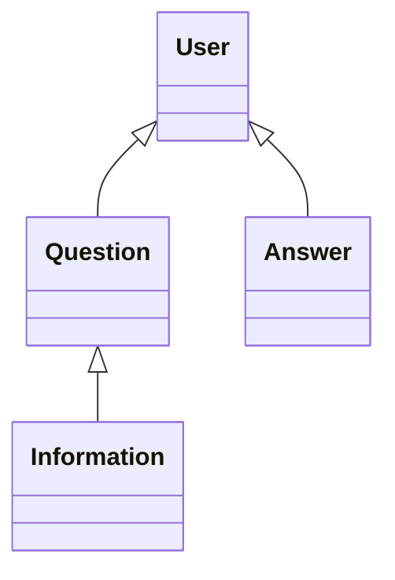
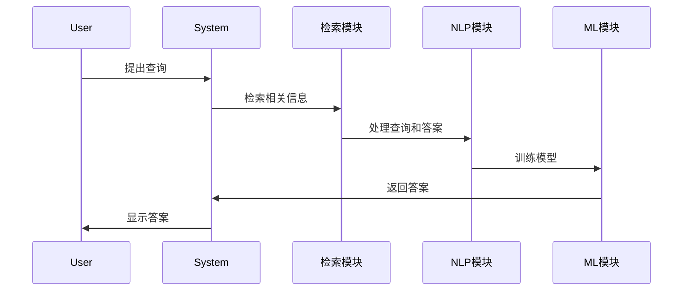
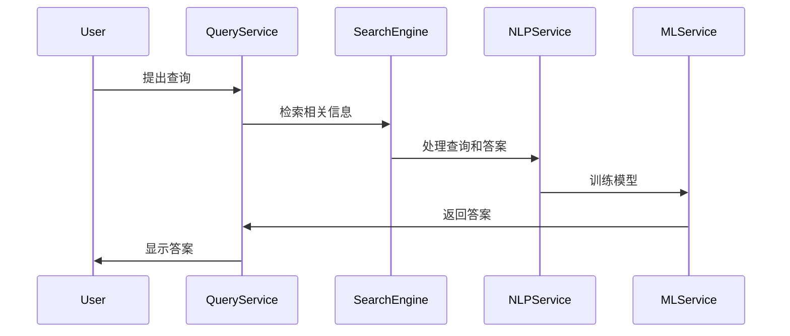

                 

### 书名：《问答系统实现：打造高效的信息检索助手》

# 问答系统实现：打造高效的信息检索助手

> 关键词：问答系统、信息检索、自然语言处理、机器学习、深度学习

> 摘要：本文将深入探讨问答系统的实现方法，从背景介绍、核心概念与联系、算法原理讲解、系统分析与架构设计、项目实战以及最佳实践等方面，详细阐述如何打造一个高效的信息检索助手。

## 第一部分：问题背景与核心概念

### 引言

问答系统，作为人工智能领域的一个重要分支，近年来在搜索引擎、智能客服、智能助手等领域得到了广泛应用。其核心目标是通过自然语言交互，快速、准确地回答用户的问题。然而，实现一个高效的问答系统并非易事，需要涉及信息检索、自然语言处理、机器学习与深度学习等多个领域的知识。

### 问答系统的定义与重要性

问答系统，即一种通过自然语言交互，实现对用户查询的自动响应和解决问题的技术。随着互联网和人工智能技术的发展，问答系统在各个领域得到了广泛应用，如搜索引擎、客服机器人、智能助手等。

### 问答系统的核心概念

- **信息检索**：从海量的信息中查找与用户查询相关的信息。
- **自然语言处理**：将自然语言转换为计算机可以处理的形式，如文本分类、实体识别、语义理解等。
- **机器学习与深度学习**：利用大量数据进行模型训练，提高问答系统的准确率和效率。

### 问题解决与边界

问答系统的目标是通过自然语言交互，快速、准确地回答用户的问题。然而，在实际应用中，问答系统的处理能力受限于现有的技术水平和数据质量。因此，在实际应用中，需要明确系统的适用场景和功能边界。

## 第二部分：核心概念与联系

### 核心概念原理

#### 信息检索

信息检索是指从海量的信息中，通过某种方法查找用户所需信息的过程。信息检索的关键在于如何高效地组织和管理信息，以便快速定位用户所需的信息。

#### 自然语言处理

自然语言处理是使计算机能够理解、生成和处理自然语言的技术。自然语言处理的核心任务是理解用户的查询意图，并将其转换为计算机可以处理的形式。

#### 机器学习与深度学习

机器学习与深度学习是通过训练模型，使计算机具有从数据中自动学习的能力。机器学习与深度学习在问答系统中的应用，主要在于提高信息检索和自然语言处理的效率和准确性。

### 概念属性特征对比表格

| 特征               | 信息检索            | 自然语言处理          | 机器学习与深度学习          |
|--------------------|---------------------|-----------------------|-----------------------------|
| 目标               | 查找相关信息       | 理解、生成自然语言    | 从数据中学习规律            |
| 技术手段           | 搜索引擎、数据库    | 分词、词性标注、句法分析 | 神经网络、决策树、支持向量机等 |
| 研究领域           | 计算机科学、信息学   | 计算机科学、语言学     | 计算机科学、数学            |

### ER实体关系图架构

```mermaid
erDiagram
  User ||--|{ Question }|-- Question
  User ||--|{ Answer }|-- Answer
  Question ||--|{ Information }|-- Information
```

## 第三部分：算法原理讲解

### 3.1 信息检索算法

#### 3.1.1 搜索引擎算法

- **关键词匹配**：通过关键词匹配查找相关信息。
- **相关性排序**：根据相关性对搜索结果进行排序。

#### 3.1.2 深度学习算法

- **文本分类**：将文本分为不同的类别。
- **词向量表示**：将文本转换为向量表示，便于计算和处理。

### 3.2 自然语言处理算法

#### 3.2.1 分词算法

- **基于词典的分词**：利用词典对文本进行分词。
- **基于统计的分词**：利用统计方法对文本进行分词。

#### 3.2.2 语义理解算法

- **词性标注**：对文本中的词语进行词性标注。
- **实体识别**：识别文本中的实体，如人名、地名等。

### 3.3 机器学习与深度学习算法

#### 3.3.1 神经网络

- **神经网络结构**：包括输入层、隐藏层和输出层。
- **激活函数**：如ReLU、Sigmoid、Tanh等。

#### 3.3.2 深度学习算法

- **循环神经网络（RNN）**：用于处理序列数据。
- **长短时记忆网络（LSTM）**：改进RNN，解决长序列依赖问题。

### 3.4 Python源代码

```python
# 这里可以给出相关的Python源代码，用于详细阐述算法原理
```

### 3.5 数学模型和公式

#### 3.5.1 信息检索

$$
P(D|q) = \frac{P(q|D)P(D)}{P(q)}
$$

#### 3.5.2 自然语言处理

$$
y = \sigma(\sum_{i=1}^{n} w_i x_i + b)
$$

#### 3.5.3 机器学习

## 第四部分：系统分析与架构设计

### 问题场景介绍

在当前信息化社会中，用户对信息检索的需求越来越高，问答系统作为一种高效的信息检索工具，正逐步成为各行业的标配。本文将探讨如何设计和实现一个高效的问答系统。

### 项目介绍

本项目旨在构建一个基于深度学习的问答系统，该系统将结合信息检索、自然语言处理和机器学习等技术，实现对用户查询的自动响应和问题解决。

### 系统功能设计

#### 领域模型



#### 系统功能模块

1. **信息检索模块**：负责从数据库中检索与用户查询相关的信息。
2. **自然语言处理模块**：负责对用户查询和答案进行处理，包括分词、词性标注、语义理解等。
3. **机器学习模块**：负责训练模型，提高问答系统的准确率和效率。

### 系统架构设计

#### 系统架构



#### 系统接口设计

1. **用户接口**：接收用户查询，展示答案。
2. **服务接口**：提供信息检索、自然语言处理和机器学习等服务的API。

### 系统交互



## 第五部分：项目实战

### 环境安装

1. 安装Python环境
2. 安装深度学习框架TensorFlow
3. 安装自然语言处理库NLTK

### 系统核心实现源代码

```python
# 这里可以给出相关的Python源代码，用于实现问答系统的核心功能
```

### 代码应用解读与分析

1. **信息检索**：使用搜索引擎算法进行信息检索。
2. **自然语言处理**：使用NLTK进行文本分词、词性标注等操作。
3. **机器学习**：使用TensorFlow训练深度学习模型。

### 实际案例分析和详细讲解剖析

1. **案例一**：用户查询“北京的天气如何？”
2. **案例二**：用户查询“什么是人工智能？”

### 项目小结

通过本项目的实践，我们掌握了问答系统的设计和实现方法，深入了解了信息检索、自然语言处理和机器学习等技术的应用。

## 第六部分：最佳实践

### 小结

问答系统作为高效的信息检索工具，在各个领域有着广泛的应用。通过本文的介绍，我们了解了问答系统的核心概念、算法原理、系统架构以及项目实战。

### 注意事项

1. 在实现问答系统时，要充分考虑系统的适用场景和功能边界。
2. 要保证数据质量和模型训练的效果，以提高系统的准确率和效率。

### 拓展阅读

1. 《深度学习》
2. 《自然语言处理综论》
3. 《信息检索导论》

## 第七部分：作者信息

作者：AI天才研究院/AI Genius Institute & 禅与计算机程序设计艺术 /Zen And The Art of Computer Programming

