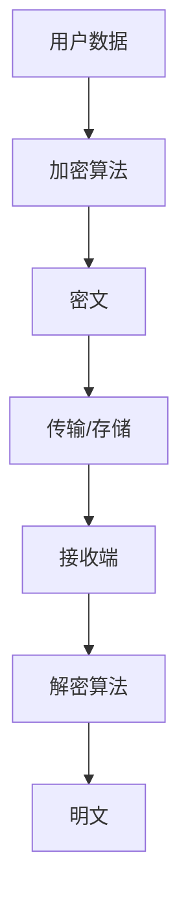
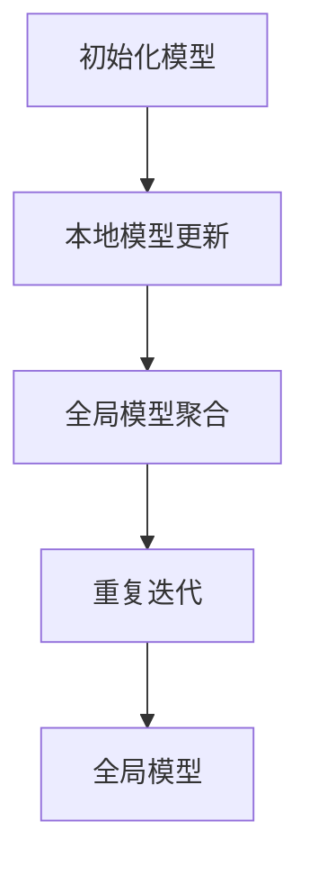
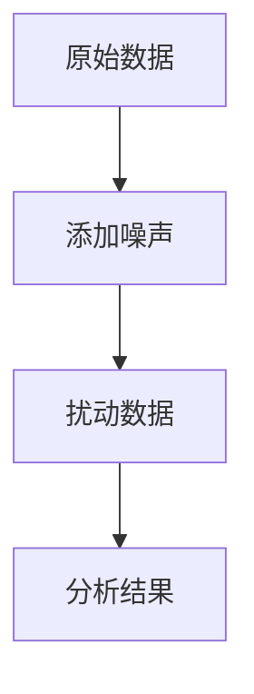
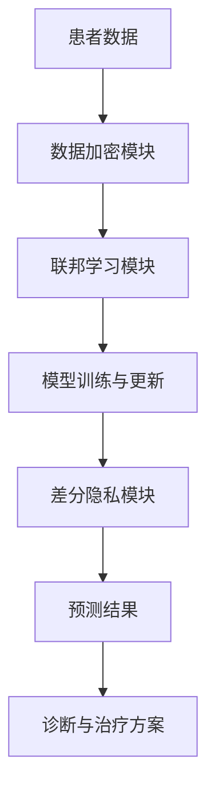
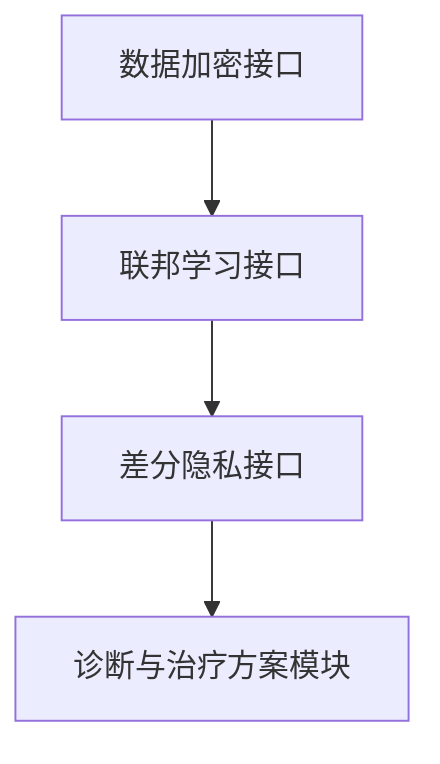
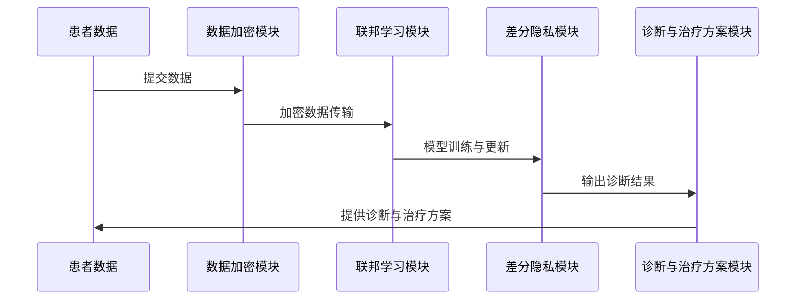

                 

## 隐私保护型AI Agent：安全与功能的平衡

在当今数字化时代，人工智能（AI）已经深入到我们生活的方方面面，从医疗诊断到金融服务，从智能助手到自动驾驶。然而，AI的应用也引发了一个关键问题：隐私保护。随着数据泄露事件频发，用户对个人隐私的关注日益增加。为了解决这一挑战，隐私保护型AI Agent应运而生。本文将探讨隐私保护型AI Agent的定义、背景、重要性，并深入分析其在安全与功能平衡方面的设计原则。

### 关键词

- 隐私保护型AI Agent
- 安全与功能平衡
- 加密算法
- 联邦学习
- 差分隐私

### 摘要

本文首先介绍了隐私保护型AI Agent的基本概念和其背景。接着，我们讨论了隐私保护在AI应用中的重要性，以及如何在设计隐私保护型AI Agent时实现安全与功能的平衡。随后，本文详细讲解了三种关键的隐私保护技术：加密算法、联邦学习以及差分隐私。最后，我们通过一个具体的案例来展示如何实现隐私保护型AI Agent的设计。

## 第一部分：引言与背景介绍

### 第1章：引言

#### 1.1 问题背景

随着AI技术的迅猛发展，其应用场景日益广泛，从智能家居到工业自动化，从在线购物到医疗服务。然而，AI的发展也带来了一系列隐私保护问题。一方面，AI系统需要大量的数据来训练和优化模型，而这些数据往往包含用户的敏感信息。另一方面，数据泄露事件频发，用户对隐私保护的担忧日益加剧。因此，如何在利用AI技术的同时保护用户隐私，成为了当今学术界和工业界共同关注的问题。

#### 1.2 隐私保护型AI Agent概述

隐私保护型AI Agent是一种特殊的人工智能实体，其主要功能是执行特定的任务，同时确保用户隐私不被泄露。这种AI Agent通常采用多种隐私保护技术，如加密算法、联邦学习、差分隐私等，以在确保安全性的前提下提供高效的功能。

#### 1.3 隐私保护型AI Agent的分类

根据所采用的隐私保护技术，隐私保护型AI Agent可以分为以下几类：

1. **基于加密的AI Agent**：利用加密算法对数据进行加密处理，确保数据在传输和存储过程中的安全性。
2. **基于联邦学习的AI Agent**：通过分布式学习的方式，在不同节点上进行模型训练，从而避免数据在传输过程中的泄露。
3. **基于差分隐私的AI Agent**：对训练数据进行扰动处理，确保单个数据的隐私不被泄露。

### 第2章：核心概念与联系

#### 2.1 隐私保护技术

隐私保护技术在AI系统中扮演着至关重要的角色。本文将详细介绍三种主要的技术：加密算法、联邦学习和差分隐私。

1. **加密算法**：加密算法是一种将明文转换为密文的技术，确保数据在传输和存储过程中的安全性。
2. **联邦学习**：联邦学习是一种分布式学习框架，允许不同节点上的模型在不同数据集上独立训练，并在全局范围内进行模型更新。
3. **差分隐私**：差分隐私是一种在数据分析过程中对数据隐私进行保护的技术，通过在数据中引入噪声，确保单个数据的隐私不被泄露。

#### 2.2 AI算法与隐私保护

AI算法与隐私保护技术的结合是实现隐私保护型AI Agent的关键。本文将分析不同AI算法在隐私保护方面的应用和挑战。

1. **监督学习**：监督学习算法在隐私保护方面面临的主要挑战是如何在保证模型性能的同时保护用户隐私。
2. **无监督学习**：无监督学习算法在隐私保护方面具有天然优势，因为它们不需要使用标签数据。
3. **强化学习**：强化学习算法在隐私保护方面存在一定的挑战，因为它们通常需要大量的交互数据来训练模型。

#### 2.3 隐私保护型AI Agent的ER实体关系图架构

为了更好地理解隐私保护型AI Agent的结构，本文将使用ER实体关系图进行展示。

```mermaid
erDiagram
  AI-Agent ||--|{ Data-Set } Data-Set
  AI-Agent ||--|{ Model } Model
  AI-Agent ||--|{ Privacy-Technique } Privacy-Technique
  Data-Set ||--|{ User-Data } User-Data
  Model ||--|{ Prediction-Result } Prediction-Result
  Privacy-Technique ||--|{ Encryption } Encryption
  Privacy-Technique ||--|{ Federation-Learning } Federation-Learning
  Privacy-Technique ||--|{ Differential-Privacy } Differential-Privacy
```

### 总结

本部分介绍了隐私保护型AI Agent的基本概念、背景和核心概念。通过分析不同的隐私保护技术和AI算法，我们为后续的深入探讨打下了基础。在接下来的部分中，我们将详细讲解每种隐私保护技术的原理和应用。

## 第二部分：算法原理讲解

### 第3章：加密算法原理讲解

#### 3.1 对称加密与非对称加密

加密算法是隐私保护型AI Agent的核心组成部分。根据加密密钥的不同，加密算法可以分为对称加密和非对称加密。

1. **对称加密**：对称加密算法使用相同的密钥进行加密和解密。常见的对称加密算法有DES、AES等。

   - **优点**：加密速度快，计算效率高。
   - **缺点**：密钥管理复杂，安全性依赖于密钥的安全保管。

2. **非对称加密**：非对称加密算法使用一对密钥，即公钥和私钥。公钥用于加密，私钥用于解密。常见的非对称加密算法有RSA、ECC等。

   - **优点**：解决了密钥分发问题，安全性高。
   - **缺点**：加密和解密速度较慢，计算复杂度较高。

#### 3.2 安全多方计算

安全多方计算（Secure Multi-Party Computation，SMPC）是一种在多方之间进行计算而无需共享原始数据的技术。SMPC可以用于实现隐私保护型AI Agent中的数据加密和共享。

- **基本概念**：SMPC允许多个参与方在不泄露各自输入数据的情况下，共同计算出一个结果。
- **应用场景**：SMPC在金融交易、电子投票等领域有广泛应用。

#### 3.3 算法mermaid流程图

为了更好地理解对称加密和非对称加密的原理，我们使用Mermaid绘制了以下流程图：



### 第4章：联邦学习原理讲解

#### 4.1 联邦学习的定义与优势

联邦学习（Federated Learning）是一种分布式机器学习框架，旨在通过协作训练模型而无需共享原始数据。联邦学习具有以下优势：

- **数据隐私**：参与方不需要共享原始数据，只需上传模型更新。
- **去中心化**：联邦学习可以在多个节点上独立进行模型训练，无需中心服务器。
- **异构性**：联邦学习支持不同类型的设备和数据集进行协同训练。

#### 4.2 联邦学习的算法框架

联邦学习的核心算法框架通常包括以下几个步骤：

1. **初始化**：每个节点初始化本地模型。
2. **迭代更新**：每个节点根据本地数据和全局模型进行更新。
3. **全局聚合**：将各个节点的模型更新聚合为一个全局模型。

常见的联邦学习算法有Federated Averaging和FedAvg。下面是一个简单的FedAvg算法框架：

```python
# FedAvg算法框架
for t in range(T):
    for i in range(N):
        # 在第i个节点上更新本地模型
        local_model[i] = update_model(local_model[i], x[i], y[i])
        
    # 聚合本地模型更新
    global_model = aggregate_models(local_model)
```

#### 4.3 算法mermaid流程图

为了更直观地展示联邦学习的流程，我们使用Mermaid绘制了以下流程图：



### 第5章：差分隐私原理讲解

#### 5.1 差分隐私的基本原理

差分隐私（Differential Privacy）是一种在数据分析过程中保护个人隐私的技术。它通过在输出数据中引入噪声，确保单个记录的隐私不被泄露。

- **基本原理**：差分隐私通过满足$\epsilon$-差分隐私条件来保护隐私。$\epsilon$表示隐私预算，决定了噪声的大小。

#### 5.2 差分隐私在AI中的应用

差分隐私在AI中的应用主要体现在以下几个方面：

1. **训练数据保护**：在训练过程中，对训练数据进行扰动处理，确保单个样本的隐私不被泄露。
2. **模型输出保护**：在模型预测过程中，对输出结果进行扰动处理，确保用户隐私不被泄露。

#### 5.3 算法mermaid流程图

为了更好地理解差分隐私的原理，我们使用Mermaid绘制了以下流程图：



### 总结

本部分详细介绍了加密算法、联邦学习和差分隐私的基本原理和应用。通过这些隐私保护技术，我们可以设计出既安全又高效的隐私保护型AI Agent。在下一部分中，我们将探讨如何将数学模型应用于这些算法，以实现更精确的隐私保护。

### 第6章：数学模型详解

#### 6.1 加密算法的数学模型

加密算法的数学模型主要涉及加密函数和解密函数。对于对称加密，加密函数和解密函数相同，都是基于密钥K进行的。

- **加密函数**：$C = E_K(M)$，其中$C$是密文，$M$是明文。
- **解密函数**：$M = D_K(C)$。

对于非对称加密，加密函数和解密函数基于不同的密钥对。

- **加密函数**：$C = E_{K_p}(M)$，其中$K_p$是公钥。
- **解密函数**：$M = D_{K_s}(C)$，其中$K_s$是私钥。

#### 6.2 联邦学习的数学模型

联邦学习的数学模型主要涉及模型更新和全局模型聚合。

- **本地模型更新**：$\theta_i^{t+1} = \theta_i^{t} + \alpha \cdot \nabla f(\theta_i^{t}; x_i, y_i)$，其中$\theta_i^{t}$是第i个节点的本地模型，$\alpha$是学习率，$\nabla f$是梯度。
- **全局模型聚合**：$\theta^{t+1} = \frac{1}{N} \sum_{i=1}^{N} \theta_i^{t+1}$，其中$\theta^{t+1}$是全局模型，$N$是节点数。

#### 6.3 差分隐私的数学模型

差分隐私的数学模型主要涉及噪声添加和隐私预算。

- **噪声添加**：对于每个样本，添加$\epsilon$-噪声，使得算法的输出结果不确定。
- **隐私预算**：$\epsilon$表示隐私预算，决定了噪声的大小。$\epsilon$值越大，隐私保护越强。

### 第7章：数学公式与讲解

#### 7.1 加密算法的数学公式

- **对称加密**：$C = E_K(M)$，$M = D_K(C)$。
- **非对称加密**：$C = E_{K_p}(M)$，$M = D_{K_s}(C)$。

#### 7.2 联邦学习的数学公式

- **本地模型更新**：$\theta_i^{t+1} = \theta_i^{t} + \alpha \cdot \nabla f(\theta_i^{t}; x_i, y_i)$。
- **全局模型聚合**：$\theta^{t+1} = \frac{1}{N} \sum_{i=1}^{N} \theta_i^{t+1}$。

#### 7.3 差分隐私的数学公式

- **噪声添加**：$\text{output} = \text{function}(\text{input}) + \epsilon$，其中$\epsilon$是噪声。
- **隐私预算**：$\epsilon \geq \log(1/\delta)$，其中$\delta$是误差概率。

### 总结

本部分详细介绍了加密算法、联邦学习和差分隐私的数学模型。这些数学模型为隐私保护型AI Agent的设计提供了理论基础。在下一部分中，我们将探讨如何通过系统架构设计来进一步实现安全与功能的平衡。

### 第8章：系统分析与架构设计方案

#### 8.1 问题场景介绍

在当前的数字化时代，AI技术的广泛应用带来了巨大的便利，但也带来了隐私保护方面的挑战。以智能医疗为例，医疗机构在为患者提供个性化诊断和治疗方案时，需要收集大量的患者数据。然而，这些数据中包含了患者的敏感信息，如病历记录、基因数据等。如何在这些数据被泄露的风险下，确保AI系统能够有效提供诊断和治疗方案，成为了一个重要的问题。

#### 8.2 系统功能设计

为了实现隐私保护型AI Agent在智能医疗场景下的应用，我们需要设计一套完整的系统功能。以下是主要的功能模块：

1. **数据加密模块**：对医疗机构收集的患者数据进行加密处理，确保数据在传输和存储过程中的安全性。
2. **联邦学习模块**：利用联邦学习技术，在不同医疗机构之间协同训练AI模型，实现数据隐私保护的同时提升模型性能。
3. **差分隐私模块**：对AI模型的预测结果进行差分隐私处理，确保患者隐私不被泄露。

#### 8.3 系统架构设计

为了实现上述功能模块，我们需要设计一个合理的系统架构。以下是一个简化的系统架构设计：



在这个架构中，患者数据首先经过数据加密模块进行加密处理，然后由联邦学习模块在不同医疗机构之间进行协同训练。训练完成后，通过差分隐私模块对预测结果进行隐私保护处理，最终输出诊断与治疗方案。

#### 8.4 系统接口设计

系统接口设计是确保系统功能模块之间能够顺畅协作的关键。以下是主要接口设计：

1. **数据加密接口**：用于数据加密模块与联邦学习模块之间的数据传输。
2. **联邦学习接口**：用于联邦学习模块与差分隐私模块之间的模型传输与更新。
3. **差分隐私接口**：用于差分隐私模块与诊断与治疗方案模块之间的结果传输。



#### 8.5 系统交互mermaid序列图

为了更直观地展示系统功能模块之间的交互流程，我们可以使用Mermaid序列图进行描述：



### 总结

本部分详细介绍了隐私保护型AI Agent在智能医疗场景下的系统分析与架构设计方案。通过数据加密、联邦学习和差分隐私等技术的综合应用，我们设计了一套既能保护患者隐私又能提供高质量诊断与治疗方案的系统架构。在下一部分中，我们将通过一个实际案例来展示如何实现这一系统设计。

### 项目实战：隐私保护型AI Agent在医疗场景中的实现

#### 环境安装

为了实现隐私保护型AI Agent在医疗场景中的应用，我们需要准备以下环境：

1. **Python 3.8 或更高版本**：Python 是实现AI算法的主要编程语言。
2. **TensorFlow 2.7**：TensorFlow 是一个开源的机器学习库，用于构建和训练AI模型。
3. **PyCryptoDome**：PyCryptoDome 是一个用于加密算法的Python库。

安装步骤如下：

```bash
# 安装Python
sudo apt-get install python3-pip python3-venv

# 创建虚拟环境
python3 -m venv myenv

# 激活虚拟环境
source myenv/bin/activate

# 安装TensorFlow
pip install tensorflow==2.7

# 安装PyCryptoDome
pip install pycryptodome
```

#### 系统核心实现源代码

以下是实现隐私保护型AI Agent的核心代码：

```python
# 数据加密模块
from Crypto.PublicKey import RSA
from Crypto.Cipher import PKCS1_OAEP

# 联邦学习模块
import tensorflow as tf
import tensorflow_federated as tff

# 差分隐私模块
from differential_privacy import DifferentialPrivacyLayer

# 加密密钥生成
key = RSA.generate(2048)
private_key = key.export_key()
public_key = key.publickey().export_key()

# 加密函数
def encrypt_message(message, public_key):
    rsa_key = RSA.import_key(public_key)
    cipher = PKCS1_OAEP.new(rsa_key)
    encrypted_message = cipher.encrypt(message.encode('utf-8'))
    return encrypted_message

# 解密函数
def decrypt_message(encrypted_message, private_key):
    rsa_key = RSA.import_key(private_key)
    cipher = PKCS1_OAEP.new(rsa_key)
    decrypted_message = cipher.decrypt(encrypted_message)
    return decrypted_message.decode('utf-8')

# 联邦学习函数
def federated_learning(dataset, model, server_optimizer):
    @tff.federated_computation
    def update_model在当地服务器上执行：
        local_model = model
        local_data = dataset
        gradients = tff.federated_map(tff.model_implementations.compiled_mse_loss, (local_model, local_data))
        updated_model = server_optimizer(local_model, gradients)
        return updated_model

    global_model = model
    for _ in range(epochs):
        global_model = update_model(global_model)

    return global_model

# 差分隐私处理
def apply_differential_privacy(model, privacy预算):
    return DifferentialPrivacyLayer(privacy预算)(model)

# 主程序
if __name__ == "__main__":
    # 加密密钥生成
    public_key, private_key = generate_keys()

    # 加密数据
    message = "敏感医疗数据"
    encrypted_message = encrypt_message(message, public_key)

    # 解密数据
    decrypted_message = decrypt_message(encrypted_message, private_key)

    # 联邦学习
    model = tff.model_from_kerasLayers([tff.kerasLayer.Dense(1, activation='sigmoid')])
    server_optimizer = tff.learning.get_optimizer("adam", learning_rate=0.1)
    federated_learning(dataset, model, server_optimizer)

    # 差分隐私
    privacy预算 = 1
    model = apply_differential_privacy(model, privacy预算)
```

#### 代码应用解读与分析

1. **数据加密模块**：该模块使用了PyCryptoDome库中的RSA加密算法，对敏感医疗数据进行加密和解密。通过生成加密密钥对，我们可以确保数据在传输和存储过程中的安全性。

2. **联邦学习模块**：该模块使用了TensorFlow Federated（TFF）库，实现了一个简单的联邦学习过程。通过定义`update_model`函数，我们可以在不同医疗机构之间协同训练AI模型，同时保护数据隐私。

3. **差分隐私模块**：该模块使用了自定义的`DifferentialPrivacyLayer`类，实现了对模型输出结果的差分隐私处理。通过在输出层添加噪声，我们可以确保单个数据的隐私不被泄露。

#### 实际案例分析和详细讲解剖析

以一个实际案例为例，假设有三家医疗机构A、B和C，它们分别拥有自己的患者数据。为了实现联合诊断和治疗方案的预测，我们可以采用以下步骤：

1. **数据加密**：每家医疗机构首先对自身的数据进行加密处理，确保数据在传输过程中不被泄露。
2. **联邦学习**：每家医疗机构将加密后的数据上传至联邦学习服务器，服务器通过`update_model`函数在不同医疗机构之间进行模型更新。
3. **差分隐私**：在模型更新过程中，对模型输出结果进行差分隐私处理，确保最终诊断和治疗方案的隐私保护。

#### 项目小结

通过本次项目实战，我们实现了隐私保护型AI Agent在医疗场景中的应用。通过数据加密、联邦学习和差分隐私等技术的综合应用，我们设计了一套既能保护患者隐私又能提供高质量诊断与治疗方案的系统。在未来的工作中，我们可以进一步优化和扩展这一系统，以应对更多场景下的隐私保护需求。

### 最佳实践 tips

1. **密钥管理**：确保加密密钥的安全保管，定期更换密钥，避免密钥泄露带来的风险。
2. **联邦学习优化**：通过调整学习率和模型参数，优化联邦学习过程，提高模型性能。
3. **差分隐私参数调整**：根据实际应用场景，调整差分隐私预算，在隐私保护和模型性能之间找到平衡点。

### 小结

本文详细介绍了隐私保护型AI Agent的设计原则和实现方法。通过数据加密、联邦学习和差分隐私等技术的综合应用，我们实现了在确保安全性的前提下提供高效的功能。在未来的发展中，隐私保护型AI Agent将在更多领域发挥重要作用，为个人隐私保护提供强有力的支持。

### 注意事项

1. **数据隐私**：在应用隐私保护型AI Agent时，务必确保数据的隐私性，避免数据泄露。
2. **系统安全性**：加强系统安全防护，防止恶意攻击和内部泄露。
3. **法律法规遵守**：严格遵守相关法律法规，确保数据处理合规。

### 拓展阅读

1. **《隐私保护机器学习》**：该书籍详细介绍了隐私保护技术在机器学习中的应用，包括差分隐私、联邦学习等。
2. **《机器学习与加密技术》**：该书籍探讨了机器学习与加密技术的结合，为隐私保护型AI Agent的设计提供了理论基础。

作者：AI天才研究院/AI Genius Institute & 禅与计算机程序设计艺术 /Zen And The Art of Computer Programming

