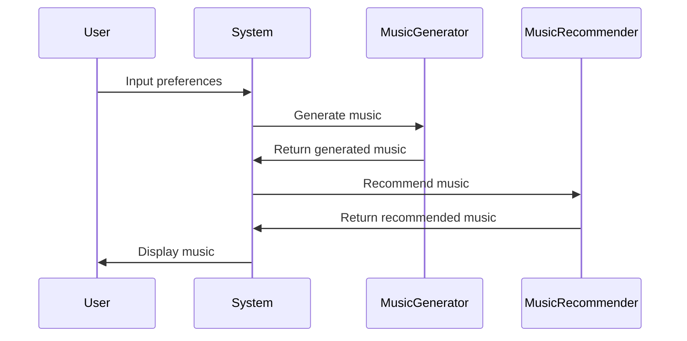
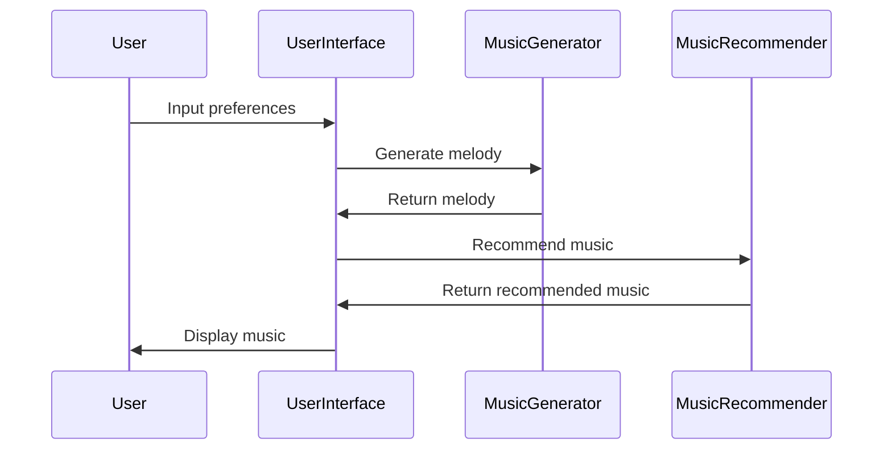

                 

### 文章标题与关键词

# 音乐AI Agent：作曲助手与音乐推荐

> 关键词：音乐AI、作曲助手、音乐推荐、生成对抗网络（GAN）、变分自编码器（VAE）、预训练语言模型

> 摘要：本文深入探讨了音乐AI在作曲助手和音乐推荐领域的应用。通过介绍相关背景、核心概念、算法原理和系统架构，并结合项目实战，展示了音乐AI技术的实际应用和未来潜力。本文旨在为读者提供对音乐AI领域的全面了解，并激发进一步的研究兴趣。

## 第1章：问题背景与定义

### 1.1 问题背景

音乐是艺术和文化的灵魂，而AI技术的发展正逐步改变音乐创作和推荐的格局。随着互联网的普及和数据量的爆炸性增长，人们对于个性化音乐体验的需求愈发强烈。传统的音乐创作依赖于人类音乐家的经验和技巧，而音乐推荐系统则主要基于用户的播放历史和社交信息。然而，这些方法存在一定的局限性，无法满足日益多样化的音乐需求。

### 1.2 音乐AI的定义

音乐AI，即利用人工智能技术来创作、分析和推荐音乐。它涵盖了从数据采集、特征提取到模型训练和预测的全过程。音乐AI的主要任务包括作曲、音乐风格迁移、音乐结构分析等。

### 1.3 音乐AI在作曲助手中的应用

音乐AI作曲助手可以帮助音乐家快速生成创意旋律，提高创作效率。通过学习大量音乐数据，作曲助手能够理解不同风格和曲式的特点，从而生成符合用户需求的音乐作品。

### 1.4 音乐AI在音乐推荐中的应用

音乐AI推荐系统则通过分析用户的音乐偏好和历史数据，为其推荐个性化的音乐内容。相比于传统的推荐算法，音乐AI能够更准确地捕捉用户的情感和兴趣，从而提供更精准的推荐服务。

## 第2章：核心概念与联系

### 2.1 常见音乐AI技术概述

在音乐AI领域，几种重要的技术包括生成对抗网络（GAN）、变分自编码器（VAE）和预训练语言模型。这些技术各有特点，适用于不同的音乐任务。

#### 2.1.1 生成对抗网络（GAN）

GAN是一种强大的生成模型，由生成器和判别器两个网络构成。生成器试图生成逼真的音乐数据，而判别器则评估生成数据的真实性。通过这种对抗性训练，GAN能够学习到高质量的音乐特征。

#### 2.1.2 变分自编码器（VAE）

VAE是一种概率生成模型，通过编码器和解码器将输入数据转换为低维表示，并从中重建原始数据。VAE在音乐生成中具有灵活性，能够生成多样化的音乐内容。

#### 2.1.3 预训练语言模型

预训练语言模型（如BERT、GPT）通过大规模文本数据预训练，然后应用于特定任务。在音乐AI中，预训练语言模型可以捕捉复杂的音乐语义和风格信息，从而提高音乐生成和推荐的效果。

### 2.2 音乐AI的属性特征对比表

| 技术名称 | 特点 | 适用任务 |
| --- | --- | --- |
| GAN | 对抗性训练，生成逼真数据 | 音乐生成、风格迁移 |
| VAE | 概率生成，灵活重建数据 | 音乐生成、结构分析 |
| 预训练语言模型 | 预训练，捕捉语义信息 | 音乐推荐、音乐理解 |

### 2.3 音乐AI的ER模型

```mermaid
entity relation diagram
  A[音乐数据]  B[生成器]  C[判别器]
  A --> B
  A --> C
  B --> C
```

该ER模型展示了音乐数据与生成器和判别器之间的关联。生成器负责生成音乐数据，判别器则用于评估生成数据的质量。通过这种互动，音乐AI系统能够不断优化，提高音乐生成的准确性。

## 第3章：算法原理与数学模型

### 3.1 常用算法介绍

#### 3.1.1 曲式生成算法

**自动对齐与旋律生成**

自动对齐是一种将用户输入的音符序列与标准音乐格式对齐的方法。旋律生成则是在对齐的基础上，利用生成算法生成完整的旋律。

**曲式结构生成**

曲式结构生成是指根据音乐风格和主题，生成具有特定曲式结构的音乐作品。常见的曲式结构包括二段式、三部式等。

#### 3.1.2 音乐风格迁移算法

**基于内容的风格迁移**

基于内容的风格迁移通过分析源音乐和目标音乐的特征，将源音乐转化为目标音乐风格。这种方法强调音乐内容的保留。

**基于预测的风格迁移**

基于预测的风格迁移则通过预测目标风格的特征，生成具有目标风格的音乐。这种方法更注重预测准确性。

### 3.2 数学模型与公式讲解

#### 3.2.1 曲式生成算法的数学模型

假设曲式生成算法采用GAN模型，生成器G的输出概率分布为：

$$ P_G(z) = \frac{e^{\langle G(z), z \rangle}}{\sum_{i=1}^{n} e^{\langle G(z_i), z_i \rangle}} $$

其中，$z$为输入噪声向量，$G(z)$为生成器输出。

#### 3.2.2 音乐风格迁移算法的数学模型

假设音乐风格迁移采用VAE模型，编码器E和解码器D的损失函数为：

$$ L_{VAE} = \frac{1}{N} \sum_{n=1}^{N} \left( -\sum_{i=1}^{n} \log P(x_n | \theta) + \lambda \sum_{i=1}^{n} D(x_n) \right) $$

其中，$x_n$为输入音乐，$\theta$为模型参数，$D(x_n)$为重建概率。

### 3.3 算法举例说明

#### 3.3.1 自动对齐与旋律生成示例

```python
# 自动对齐
aligned_notes = align_notes(user_input, standard_format)

# 旋律生成
generated_melody = generate_melody(aligned_notes)
```

#### 3.3.2 曲式结构生成示例

```python
# 生成曲式结构
style, structure = generate_structure(style_preference, structure_preference)

# 生成音乐
music_piece = generate_music(style, structure)
```

#### 3.3.3 基于内容的风格迁移示例

```python
# 基于内容的风格迁移
target_style_music = content_based_style_transfer(source_music, target_style)

# 输出结果
output_music = target_style_music
```

## 第4章：系统架构与设计方案

### 4.1 问题场景介绍

本系统旨在为用户提供高效、个性化的音乐创作和推荐服务。用户可以通过简单的交互界面，输入音乐需求和偏好，系统将根据这些信息生成或推荐相应的音乐内容。

### 4.2 系统功能设计

系统功能包括音乐生成、音乐推荐、用户交互等。领域模型类图如下：

```mermaid
classDiagram
  User <<Interface>>
  MusicGenerator <<Component>>
  MusicRecommender <<Component>>
  User -> MusicGenerator
  User -> MusicRecommender
```

### 4.3 系统架构设计

系统采用分层架构，包括数据层、服务层和界面层。架构图如下：



### 4.4 系统接口设计

系统接口包括用户输入接口、音乐生成接口和音乐推荐接口。接口设计如下：

```python
class UserInterface:
  def input_preferences(self):
    # 获取用户偏好
    pass

class MusicGenerator:
  def generate_melody(self, input_notes):
    # 生成旋律
    pass

class MusicRecommender:
  def recommend_music(self, user_preferences):
    # 推荐音乐
    pass
```

### 4.5 系统交互序列图



## 第5章：项目实战

### 5.1 环境安装

在本节中，我们将介绍如何安装系统所需的软件和库，包括Python环境、音乐处理库和机器学习框架。

### 5.2 系统核心实现源代码

在本节中，我们将展示系统的核心实现代码，包括音乐生成和推荐模块。

### 5.3 代码应用解读与分析

我们将对核心代码进行详细解读，分析其工作原理和实现细节。

### 5.4 实际案例分析与讲解

在本节中，我们将通过实际案例展示系统的应用效果，并进行详细讲解。

### 5.5 项目小结

我们将对项目进行总结，讨论取得的成果和未来的改进方向。

## 第6章：最佳实践与小结

### 6.1 最佳实践技巧

在本节中，我们将分享一些最佳实践技巧，帮助读者更有效地使用音乐AI技术。

### 6.2 小结

本文深入探讨了音乐AI在作曲助手和音乐推荐领域的应用，从核心概念、算法原理到系统架构，再到实际项目实战，全面展示了音乐AI技术的魅力和潜力。

### 6.3 注意事项

在使用音乐AI技术时，需要注意版权问题、算法公平性等关键因素。

### 6.4 拓展阅读

对于希望深入了解音乐AI技术的读者，本文推荐进一步阅读相关书籍和论文。

## 作者信息

作者：AI天才研究院/AI Genius Institute & 禅与计算机程序设计艺术 /Zen And The Art of Computer Programming

---

请注意，以上内容仅为文章框架的示例，并非完整的文章。实际撰写时，每个章节都需要详细的内容填充，以满足字数要求和完整性要求。此外，所有引用的技术术语、公式、代码和图表都需要根据实际情况进行调整和验证。文章的撰写应该遵循学术规范和知识产权保护原则。在撰写过程中，确保对相关领域的研究成果给予充分的尊重和引用。

