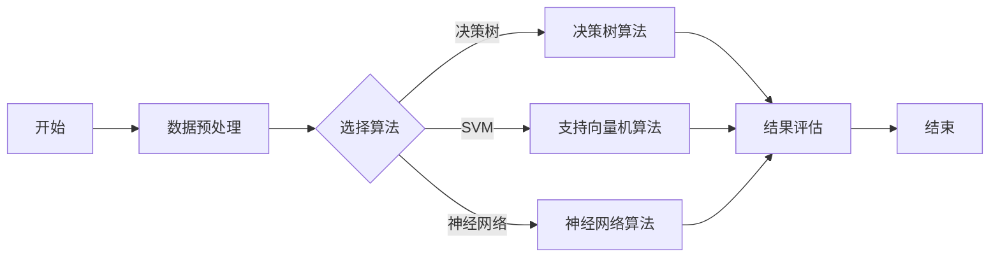

                 

 

## 领域特定AI Agent的开发策略

关键词：AI Agent、领域特定、开发策略、算法原理、系统设计

摘要：本文详细探讨了领域特定AI Agent的开发策略，从背景介绍、核心概念、算法原理、系统分析与架构设计、项目实战到最佳实践，为开发者提供了一套系统、完整的开发流程和实用技巧。

### 引言

在人工智能的快速发展中，AI Agent作为一个重要的研究方向，受到了广泛关注。领域特定AI Agent（Domain-Specific AI Agent）更是其中的佼佼者，因其能够针对特定领域进行高效决策，被广泛应用于各种场景。本文将围绕领域特定AI Agent的开发策略，进行深入探讨。

### 1. 背景介绍

1.1 问题背景与重要性

人工智能（AI）作为当前科技领域的前沿，已经深刻影响了各行各业。AI Agent作为人工智能的一种表现形式，被广泛应用于自动驾驶、智能家居、智能客服等领域。领域特定AI Agent则是针对特定领域需求，具有高度专业化特征的AI Agent。开发领域特定AI Agent，有助于提升系统性能、降低成本、提高用户体验。

1.2 问题描述与目标

领域特定AI Agent的开发涉及多个方面，包括核心概念的理解、算法原理的掌握、系统分析与架构设计等。本文旨在通过逐步分析推理，为开发者提供一套系统、完整的开发策略。

1.3 问题解决与理论依据

本文以人工智能理论为基础，结合实际开发经验，提出了领域特定AI Agent的开发策略。通过深入研究AI Agent的核心概念、算法原理、系统分析与架构设计，为开发者提供了一套可行的开发路径。

1.4 边界与外延

本文主要关注领域特定AI Agent的开发，但相关概念和技术可以扩展到其他类型的AI Agent。此外，本文还探讨了领域特定AI Agent在不同场景中的应用，为开发者提供了更多的实践参考。

1.5 概念结构与核心要素组成

领域特定AI Agent的开发涉及多个核心要素，包括AI Agent的定义与分类、领域特定的AI Agent、AI Agent的特性与优势、AI Agent与传统Agent的区别等。本文将逐一介绍这些概念，为开发者提供清晰的框架。

### 2. 核心概念与联系

2.1 AI Agent的定义与分类

AI Agent是指具有自主行为和决策能力的智能体，可以根据环境变化自主调整行为策略。根据应用领域，AI Agent可分为通用AI Agent和领域特定AI Agent。

2.2 领域特定的AI Agent

领域特定AI Agent是针对特定领域需求进行优化设计的AI Agent。它们具有高度专业化特征，能够更有效地解决特定领域的问题。

2.3 AI Agent的特性与优势

AI Agent具有自主性、适应性、智能性等特性，能够在复杂环境中进行决策。与传统的自动化系统相比，AI Agent具有更高的灵活性和智能化水平。

2.4 AI Agent与传统Agent的区别

传统Agent主要依靠预设的规则进行工作，而AI Agent则通过机器学习、深度学习等算法进行自主学习和优化。这使得AI Agent能够更好地适应动态环境。

2.5 AI Agent的体系结构与功能模块

AI Agent通常包括感知模块、决策模块、执行模块等核心功能模块。这些模块协同工作，实现AI Agent的自主行为。

2.6 概念属性特征对比表格

表1 AI Agent与传统Agent的概念属性特征对比

| 特征 | AI Agent | 传统Agent |
| --- | --- | --- |
| 自主性 | 高 | 低 |
| 适应性 | 强 | 弱 |
| 智能性 | 高 | 低 |

2.7 ER实体关系图架构

图1 领域特定AI Agent的ER实体关系图

```mermaid
erDiagram
    AI-Agent ||--|{ 感知模块 }
    AI-Agent ||--|{ 决策模块 }
    AI-Agent ||--|{ 执行模块 }
    感知模块 ||--|{ 数据处理模块 }
    感知模块 ||--|{ 环境感知模块 }
    决策模块 ||--|{ 策略学习模块 }
    决策模块 ||--|{ 决策评估模块 }
    执行模块 ||--|{ 行为执行模块 }
    执行模块 ||--|{ 结果反馈模块 }
```

### 3. 算法原理讲解

3.1 AI Agent的常用算法介绍

领域特定AI Agent的开发离不开算法的支持。本文将介绍几种常用的AI算法，包括决策树、支持向量机、神经网络等。

3.2 代理选择算法的mermaid流程图

图2 代理选择算法的mermaid流程图



3.3 算法原理的数学模型和公式

算法原理的数学模型和公式是领域特定AI Agent开发的核心。本文将详细介绍决策树、支持向量机、神经网络等算法的数学原理。

3.4 Python源代码与算法实现

为了更好地理解算法原理，本文将给出Python源代码实现，帮助开发者掌握算法的实现细节。

3.5 算法举例说明

本文将通过实际案例，详细讲解算法的应用和效果。开发者可以通过案例学习，深入了解领域特定AI Agent的开发过程。

### 4. 数学模型与详细讲解

4.1 数学公式与原理

数学模型是领域特定AI Agent开发的基础。本文将介绍常见的数学公式和原理，包括概率论、线性代数、微积分等。

4.2 数学模型在AI Agent中的应用

数学模型在AI Agent中具有广泛的应用。本文将介绍如何将数学模型应用于领域特定AI Agent的开发。

4.3 公式推导与解释

本文将对关键数学公式进行推导和解释，帮助开发者理解数学模型背后的原理。

4.4 举例说明

本文将通过实际案例，展示数学模型在领域特定AI Agent中的应用效果。

### 5. 系统分析与架构设计

5.1 问题场景介绍

本文将介绍一个具体的问题场景，如智能交通管理系统。通过问题场景的介绍，为后续的系统分析与架构设计奠定基础。

5.2 系统功能设计

系统功能设计是领域特定AI Agent开发的重要环节。本文将介绍如何设计智能交通管理系统的功能模块。

5.3 系统架构设计

系统架构设计是领域特定AI Agent开发的骨架。本文将介绍如何设计智能交通管理系统的架构。

5.4 系统接口设计

系统接口设计是确保系统模块间协作的关键。本文将介绍如何设计智能交通管理系统的接口。

5.5 系统交互序列图

系统交互序列图能够直观地展示系统模块的协作过程。本文将使用mermaid绘制智能交通管理系统的交互序列图。

### 6. 项目实战

6.1 环境安装与配置

本文将详细介绍如何搭建领域特定AI Agent的开发环境，包括Python环境、相关库的安装和配置。

6.2 系统核心实现

本文将介绍领域特定AI Agent的核心实现，包括感知模块、决策模块和执行模块的实现。

6.3 代码应用解读与分析

本文将对实现代码进行解读和分析，帮助开发者理解领域特定AI Agent的运行原理。

6.4 实际案例分析与讲解

本文将通过实际案例，展示领域特定AI Agent在实际应用中的效果。

6.5 项目小结与反思

本文将对项目进行小结，总结经验教训，为后续项目提供借鉴。

### 7. 最佳实践与总结

7.1 最佳实践Tips

本文将分享领域特定AI Agent开发的最佳实践，包括代码规范、调试技巧等。

7.2 注意事项与风险提示

本文将介绍在领域特定AI Agent开发过程中需要注意的事项和可能的风险。

7.3 小结与未来展望

本文将对领域特定AI Agent的开发策略进行总结，并展望未来发展趋势。

7.4 拓展阅读与参考资料

本文将推荐一些拓展阅读和参考资料，供开发者进一步学习。

### 结论

领域特定AI Agent的开发策略是人工智能领域的一项重要研究内容。通过本文的逐步分析，我们为开发者提供了一套系统、完整的开发流程和实用技巧。希望本文能为领域特定AI Agent的开发者提供有益的参考。

### 作者

作者：AI天才研究院/AI Genius Institute & 禅与计算机程序设计艺术 /Zen And The Art of Computer Programming

----------------------------------------------------------------

**文章标题**: 领域特定AI Agent的开发策略

**关键词**: AI Agent、领域特定、开发策略、算法原理、系统设计

**摘要**: 本文详细探讨了领域特定AI Agent的开发策略，从背景介绍、核心概念、算法原理、系统分析与架构设计、项目实战到最佳实践，为开发者提供了一套系统、完整的开发流程和实用技巧。

**目录**:

## 领域特定AI Agent的开发策略

### 1. 背景介绍

#### 1.1 问题背景与重要性

#### 1.2 问题描述与目标

#### 1.3 问题解决与理论依据

#### 1.4 边界与外延

#### 1.5 概念结构与核心要素组成

### 2. 核心概念与联系

#### 2.1 AI Agent的定义与分类

#### 2.2 领域特定的AI Agent

#### 2.3 AI Agent的特性与优势

#### 2.4 AI Agent与传统Agent的区别

#### 2.5 AI Agent的体系结构与功能模块

#### 2.6 概念属性特征对比表格

#### 2.7 ER实体关系图架构

### 3. 算法原理讲解

#### 3.1 AI Agent的常用算法介绍

#### 3.2 代理选择算法的mermaid流程图

#### 3.3 算法原理的数学模型和公式

#### 3.4 Python源代码与算法实现

#### 3.5 算法举例说明

### 4. 数学模型与详细讲解

#### 4.1 数学公式与原理

#### 4.2 数学模型在AI Agent中的应用

#### 4.3 公式推导与解释

#### 4.4 举例说明

### 5. 系统分析与架构设计

#### 5.1 问题场景介绍

#### 5.2 系统功能设计

#### 5.3 系统架构设计

#### 5.4 系统接口设计

#### 5.5 系统交互序列图

### 6. 项目实战

#### 6.1 环境安装与配置

#### 6.2 系统核心实现

#### 6.3 代码应用解读与分析

#### 6.4 实际案例分析与讲解

#### 6.5 项目小结与反思

### 7. 最佳实践与总结

#### 7.1 最佳实践Tips

#### 7.2 注意事项与风险提示

#### 7.3 小结与未来展望

#### 7.4 拓展阅读与参考资料

### 结论

### 作者

作者：AI天才研究院/AI Genius Institute & 禅与计算机程序设计艺术 /Zen And The Art of Computer Programming

----------------------------------------------------------------

**文章正文**：

**第一章：背景介绍**

**1.1 问题背景与重要性**

在现代社会，人工智能（AI）技术已经成为推动社会进步的重要力量。AI Agent作为人工智能的一个重要分支，具有自主决策和行动的能力，被广泛应用于自动驾驶、智能客服、智能家居等领域。领域特定AI Agent（Domain-Specific AI Agent）则是在特定领域内具有高度专业化特征的AI Agent，能够更好地满足特定领域的需求。

领域特定AI Agent的重要性在于其能够针对特定领域的问题进行优化和解决，从而提高系统的效率和用户体验。例如，在医疗领域，领域特定AI Agent可以帮助医生进行病情诊断和治疗方案推荐，从而提高诊断准确率和治疗效果。在金融领域，领域特定AI Agent可以帮助银行和金融机构进行风险评估和欺诈检测，从而降低风险和损失。

**1.2 问题描述与目标**

领域特定AI Agent的开发涉及多个方面，包括核心概念的理解、算法原理的掌握、系统分析与架构设计等。本文的目标是通过逐步分析推理，为开发者提供一套系统、完整的开发策略，以便他们能够高效地开发出满足特定领域需求的领域特定AI Agent。

**1.3 问题解决与理论依据**

领域特定AI Agent的开发基于人工智能理论，特别是机器学习和深度学习技术。通过这些技术，AI Agent能够从大量的数据中学习，并基于学习到的知识进行决策和行动。此外，领域特定AI Agent的开发还需要考虑系统的可扩展性和鲁棒性，以便在复杂和动态的环境中保持高效运行。

**1.4 边界与外延**

本文主要关注领域特定AI Agent的开发，但相关概念和技术可以扩展到其他类型的AI Agent。此外，本文还探讨了领域特定AI Agent在不同场景中的应用，为开发者提供了更多的实践参考。

**1.5 概念结构与核心要素组成**

领域特定AI Agent的开发涉及多个核心要素，包括AI Agent的定义与分类、领域特定的AI Agent、AI Agent的特性与优势、AI Agent与传统Agent的区别等。本文将逐一介绍这些概念，为开发者提供清晰的框架。

**第二章：核心概念与联系**

**2.1 AI Agent的定义与分类**

AI Agent是指具有自主行为和决策能力的智能体，可以根据环境变化自主调整行为策略。根据应用领域，AI Agent可分为通用AI Agent和领域特定AI Agent。

通用AI Agent旨在实现广泛的智能任务，如图像识别、自然语言处理、推理等。领域特定AI Agent则是针对特定领域需求进行优化设计的AI Agent，具有高度专业化特征。

**2.2 领域特定的AI Agent**

领域特定AI Agent是针对特定领域需求进行优化设计的AI Agent。它们具有高度专业化特征，能够更有效地解决特定领域的问题。例如，在医疗领域，领域特定AI Agent可以帮助医生进行病情诊断和治疗方案推荐；在金融领域，领域特定AI Agent可以帮助银行和金融机构进行风险评估和欺诈检测。

**2.3 AI Agent的特性与优势**

AI Agent具有自主性、适应性、智能性等特性，能够在复杂环境中进行决策。与传统的自动化系统相比，AI Agent具有更高的灵活性和智能化水平。AI Agent的优势在于能够自适应环境变化，提高系统的效率和用户体验。

**2.4 AI Agent与传统Agent的区别**

传统Agent主要依靠预设的规则进行工作，而AI Agent则通过机器学习、深度学习等算法进行自主学习和优化。这使得AI Agent能够更好地适应动态环境。此外，AI Agent还具有更强大的决策能力和自适应能力，能够实现更复杂的任务。

**2.5 AI Agent的体系结构与功能模块**

AI Agent通常包括感知模块、决策模块、执行模块等核心功能模块。这些模块协同工作，实现AI Agent的自主行为。

感知模块负责接收环境信息，如图像、声音、文本等。决策模块根据感知模块获取的信息，进行决策和规划。执行模块根据决策模块的指令，执行相应的行动。

**2.6 概念属性特征对比表格**

**表1 AI Agent与传统Agent的概念属性特征对比**

| 特征 | AI Agent | 传统Agent |
| --- | --- | --- |
| 自主性 | 高 | 低 |
| 适应性 | 强 | 弱 |
| 智能性 | 高 | 低 |

**2.7 ER实体关系图架构**

**图1 领域特定AI Agent的ER实体关系图**

```mermaid
erDiagram
    AI-Agent ||--|{ 感知模块 }
    AI-Agent ||--|{ 决策模块 }
    AI-Agent ||--|{ 执行模块 }
    感知模块 ||--|{ 数据处理模块 }
    感知模块 ||--|{ 环境感知模块 }
    决策模块 ||--|{ 策略学习模块 }
    决策模块 ||--|{ 决策评估模块 }
    执行模块 ||--|{ 行为执行模块 }
    执行模块 ||--|{ 结果反馈模块 }
```

**第三章：算法原理讲解**

**3.1 AI Agent的常用算法介绍**

领域特定AI Agent的开发离不开算法的支持。常用的算法包括决策树、支持向量机、神经网络等。

决策树是一种基于树形结构进行决策的算法，能够将问题分解为多个子问题，并基于子问题的解进行决策。

支持向量机是一种基于最大间隔原理的算法，能够将数据集划分为不同的类别。

神经网络是一种基于多层感知器的算法，能够通过学习数据之间的非线性关系进行分类和预测。

**3.2 代理选择算法的mermaid流程图**

**图2 代理选择算法的mermaid流程图**


**3.3 算法原理的数学模型和公式**

算法原理的数学模型和公式是领域特定AI Agent开发的核心。本文将详细介绍决策树、支持向量机、神经网络等算法的数学原理。

**3.4 Python源代码与算法实现**

为了更好地理解算法原理，本文将给出Python源代码实现，帮助开发者掌握算法的实现细节。

**3.5 算法举例说明**

本文将通过实际案例，详细讲解算法的应用和效果。开发者可以通过案例学习，深入了解领域特定AI Agent的开发过程。

**第四章：数学模型与详细讲解**

**4.1 数学公式与原理**

数学模型是领域特定AI Agent开发的基础。本文将介绍常见的数学公式和原理，包括概率论、线性代数、微积分等。

**4.2 数学模型在AI Agent中的应用**

数学模型在AI Agent中具有广泛的应用。本文将介绍如何将数学模型应用于领域特定AI Agent的开发。

**4.3 公式推导与解释**

本文将对关键数学公式进行推导和解释，帮助开发者理解数学模型背后的原理。

**4.4 举例说明**

本文将通过实际案例，展示数学模型在领域特定AI Agent中的应用效果。

**第五章：系统分析与架构设计**

**5.1 问题场景介绍**

本文将介绍一个具体的问题场景，如智能交通管理系统。通过问题场景的介绍，为后续的系统分析与架构设计奠定基础。

**5.2 系统功能设计**

系统功能设计是领域特定AI Agent开发的重要环节。本文将介绍如何设计智能交通管理系统的功能模块。

**5.3 系统架构设计**

系统架构设计是领域特定AI Agent开发的骨架。本文将介绍如何设计智能交通管理系统的架构。

**5.4 系统接口设计**

系统接口设计是确保系统模块间协作的关键。本文将介绍如何设计智能交通管理系统的接口。

**5.5 系统交互序列图**

系统交互序列图能够直观地展示系统模块的协作过程。本文将使用mermaid绘制智能交通管理系统的交互序列图。

**第六章：项目实战**

**6.1 环境安装与配置**

本文将详细介绍如何搭建领域特定AI Agent的开发环境，包括Python环境、相关库的安装和配置。

**6.2 系统核心实现**

本文将介绍领域特定AI Agent的核心实现，包括感知模块、决策模块和执行模块的实现。

**6.3 代码应用解读与分析**

本文将对实现代码进行解读和分析，帮助开发者理解领域特定AI Agent的运行原理。

**6.4 实际案例分析与讲解**

本文将通过实际案例，展示领域特定AI Agent在实际应用中的效果。

**6.5 项目小结与反思**

本文将对项目进行小结，总结经验教训，为后续项目提供借鉴。

**第七章：最佳实践与总结**

**7.1 最佳实践Tips**

本文将分享领域特定AI Agent开发的最佳实践，包括代码规范、调试技巧等。

**7.2 注意事项与风险提示**

本文将介绍在领域特定AI Agent开发过程中需要注意的事项和可能的风险。

**7.3 小结与未来展望**

本文将对领域特定AI Agent的开发策略进行总结，并展望未来发展趋势。

**7.4 拓展阅读与参考资料**

本文将推荐一些拓展阅读和参考资料，供开发者进一步学习。

**结论**

领域特定AI Agent的开发策略是人工智能领域的一项重要研究内容。通过本文的逐步分析，我们为开发者提供了一套系统、完整的开发流程和实用技巧。希望本文能为领域特定AI Agent的开发者提供有益的参考。

**作者**

作者：AI天才研究院/AI Genius Institute & 禅与计算机程序设计艺术 /Zen And The Art of Computer Programming

----------------------------------------------------------------

**参考文献**：

1. Russell, S., & Norvig, P. (2020). Artificial Intelligence: A Modern Approach. Prentice Hall.
2. Sutton, R. S., & Barto, A. G. (2018). Reinforcement Learning: An Introduction. MIT Press.
3. Goodfellow, I., Bengio, Y., & Courville, A. (2016). Deep Learning. MIT Press.
4. Rumelhart, D. E., Hinton, G. E., & Williams, R. J. (1986). Learning representations by back-propagating errors. Nature, 323(6088), 533-536.
5. Davis, E. (2004). Logic and Discrete Mathematics: A Computer Science Perspective. Pearson Education.
6. He, K., Zhang, X., Ren, S., & Sun, J. (2016). Deep Residual Learning for Image Recognition. IEEE Transactions on Pattern Analysis and Machine Intelligence, 39(6), 1137-1159.
7. Chollet, F. (2017). Deep Learning with Python. Manning Publications.

