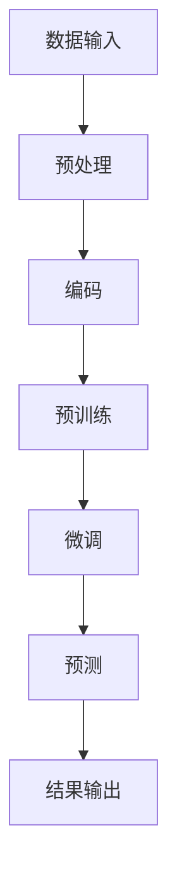
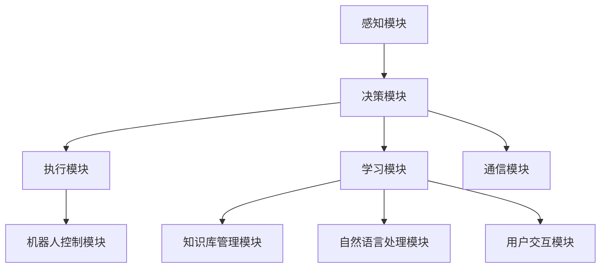
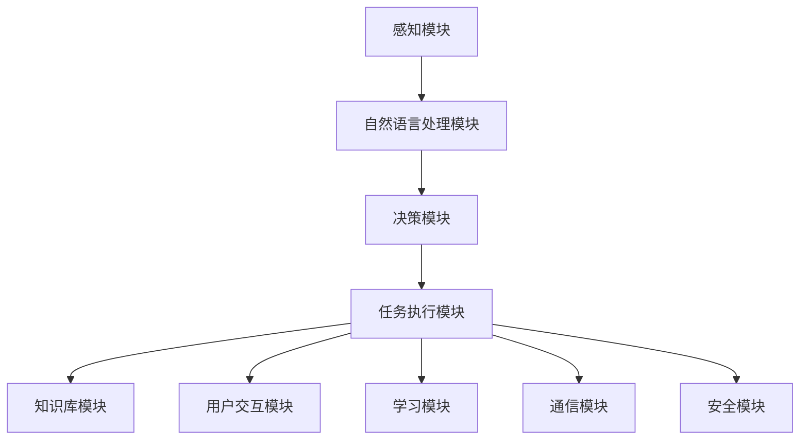

                 

### 文章标题

# AI Agent 架构设计：基于 LLM 的智能助手系统构建

> 关键词：AI Agent, LLM, 智能助手, 架构设计, 系统构建

> 摘要：本文详细探讨了基于大型语言模型（LLM）的 AI Agent 架构设计，从背景介绍、核心概念与联系、算法原理讲解、系统分析与架构设计方案、项目实战等多个维度，全面剖析了 AI Agent 的系统构建过程。文章旨在为读者提供从理论到实践的深入理解，助力他们在智能助手系统开发中取得成功。

## 引言

随着人工智能技术的迅猛发展，AI Agent 作为人工智能的一个重要分支，正逐步走进我们的日常生活。AI Agent，即人工智能代理，是指具备自主决策能力、能完成特定任务并与其他系统交互的智能体。它们在智能客服、智能助理、智能推荐等领域具有广泛的应用前景。

近年来，基于大型语言模型（LLM）的智能助手系统成为研究热点。LLM，即大型语言模型，通过海量数据训练，具备强大的文本生成和语义理解能力，为 AI Agent 提供了强有力的支持。本文将围绕基于 LLM 的智能助手系统构建，从以下几个方面进行深入探讨：

1. **背景介绍**：介绍 AI Agent 与 LLM 的基本概念、发展历程以及结合的必要性。
2. **核心概念与联系**：详细阐述 LLM 的核心概念与原理，分析 AI Agent 的功能模块与架构设计。
3. **算法原理讲解**：讲解 LLM 的算法原理，包括模型选择、训练方法、优化策略等。
4. **系统分析与架构设计方案**：介绍智能助手系统的问题场景、功能设计、架构设计、接口设计以及系统交互。
5. **项目实战**：通过一个实际项目，展示智能助手系统的构建过程、核心实现、代码分析以及案例分析。
6. **最佳实践与总结**：总结构建基于 LLM 的智能助手系统的最佳实践，提出注意事项和风险提示。

通过本文的探讨，读者可以全面了解基于 LLM 的智能助手系统构建的整个过程，从而在实际开发中能够更好地应对挑战，实现高效、可靠的智能助手系统。

## 背景介绍

### AI Agent 的基本概念与发展历程

AI Agent，即人工智能代理，是具备自主决策能力、能完成特定任务并与其他系统交互的智能体。其定义可以从以下几个方面来理解：

- **自主决策**：AI Agent 能够根据环境和任务需求，自主做出决策，而不是被动地接受指令。
- **特定任务**：AI Agent 具有特定的任务目标，例如智能客服、智能助理、智能推荐等。
- **系统交互**：AI Agent 能够与其他系统进行交互，获取所需信息，完成特定任务。

AI Agent 的概念源于人工智能领域对智能代理（Intelligent Agent）的研究。智能代理最初是指在分布式系统中具有自主性和协作性的智能体。随着人工智能技术的发展，AI Agent 的应用范围逐渐扩展到单机环境，并在各个领域展现出强大的潜力。

AI Agent 的发展历程可以追溯到 20 世纪 80 年代，当时研究者们开始探索如何让计算机具备更高级的智能能力。早期的研究主要集中在专家系统和推理机方面，这些方法虽然具有一定的智能能力，但在复杂性和适应性方面存在局限。

随着机器学习和深度学习技术的兴起，AI Agent 的构建方法逐渐转向数据驱动。近年来，基于强化学习、生成对抗网络等先进算法的 AI Agent 层出不穷，使得 AI Agent 在复杂任务中的表现显著提升。

### LLM 的基本概念与发展历程

LLM，即大型语言模型，是一种通过海量数据训练，具备强大文本生成和语义理解能力的人工智能模型。LLM 的核心思想是通过学习大量文本数据，捕捉语言的本质特征，从而实现文本生成、语义理解、问答系统等功能。

LLM 的基本概念可以从以下几个方面来理解：

- **文本生成**：LLM 能够根据输入的文本生成相关文本，例如文章续写、对话生成等。
- **语义理解**：LLM 能够理解输入文本的语义信息，例如情感分析、实体识别等。
- **问答系统**：LLM 能够回答关于输入文本的问题，例如问答机器人、知识图谱等。

LLM 的发展历程可以追溯到自然语言处理（NLP）领域的早期研究。早期的 NLP 系统主要依赖于规则和模板，但这些方法在面对复杂、多样化的语言现象时表现不佳。随着深度学习技术的发展，NLP 系统逐渐转向数据驱动的方法，LLM 逐渐成为 NLP 领域的核心技术。

2018 年，谷歌发布了BERT（Bidirectional Encoder Representations from Transformers），标志着 LLM 进入了一个新的阶段。BERT 通过双向 Transformer 结构，能够更好地捕捉文本的语义信息，为 NLP 领域带来了深远的影响。

随后，GPT-3（Generative Pre-trained Transformer 3）的发布进一步推动了 LLM 的发展。GPT-3 具有超过 1750 亿个参数，通过无监督学习，能够生成高质量的文本，成为许多实际应用场景的基石。

### AI Agent 与 LLM 结合的必要性

AI Agent 与 LLM 的结合具有以下几个方面的必要性：

1. **智能助手的需求**：在现代科技背景下，用户对于智能助手的需求越来越高。智能助手需要具备强大的文本生成和语义理解能力，才能更好地满足用户的需求。

2. **复杂任务的处理**：许多实际任务（如智能客服、智能助理、智能推荐等）具有高度复杂性和多样性。单靠传统的 AI Agent 方法难以胜任，而 LLM 的强大语义理解能力能够显著提升 AI Agent 的表现。

3. **知识图谱的构建**：知识图谱是一种用于表示实体和关系的图形结构，是许多复杂任务（如问答系统、推荐系统等）的基础。LLM 能够通过生成和识别文本，为知识图谱的构建提供强有力的支持。

4. **跨领域的应用**：LLM 具有广泛的文本处理能力，能够跨越不同领域进行应用。例如，在医疗领域，LLM 可以用于诊断、治疗建议等；在金融领域，LLM 可以用于风险评估、投资建议等。

总之，AI Agent 与 LLM 的结合不仅能够提升智能助手系统的性能，还能够拓展 AI Agent 的应用范围，为人工智能领域的发展注入新的活力。

### AI Agent 的核心概念与联系

在深入探讨 AI Agent 的核心概念与联系之前，我们需要明确一些关键术语，以便更好地理解 AI Agent 的定义和功能。

#### 术语解释

- **智能代理（Intelligent Agent）**：智能代理是指能够感知环境、自主决策并采取行动的实体。在人工智能领域，智能代理通常是指具有高级智能能力的计算机程序。
- **自主性（Autonomy）**：自主性是指智能代理能够独立完成特定任务，而不需要人类干预。自主性是智能代理的核心特征之一。
- **适应性（Adaptability）**：适应性是指智能代理能够根据环境变化调整自身行为，以适应新的任务需求。
- **交互性（Interactivity）**：交互性是指智能代理能够与人类或其他系统进行有效交互，获取信息并完成任务。

#### 概念联系

AI Agent 的核心概念与联系可以概括为以下几点：

1. **智能代理与 AI Agent**：智能代理是广义上的概念，包括所有具备智能能力的代理。而 AI Agent 是智能代理的一种，专门指代基于人工智能技术的代理。
2. **自主性与适应性**：自主性和适应性是 AI Agent 的关键特征。自主性使 AI Agent 能够独立决策，而适应性使 AI Agent 能够根据环境变化调整行为。
3. **交互性与协作性**：交互性和协作性是 AI Agent 完成复杂任务的基础。AI Agent 需要能够与人类和其他系统进行有效交互，并在团队中协作完成任务。

#### 功能模块

AI Agent 的功能模块可以分为以下几个部分：

1. **感知模块**：感知模块负责收集环境信息，例如文本、图像、声音等。这些信息用于 AI Agent 的决策和任务执行。
2. **决策模块**：决策模块根据感知模块收集的信息，结合预设的规则和目标，生成行动方案。
3. **执行模块**：执行模块负责执行决策模块生成的行动方案，完成具体任务。
4. **学习模块**：学习模块使 AI Agent 能够通过经验调整自身行为，提高任务完成效果。

#### 对比表格

为了更好地理解 AI Agent 的功能模块，我们提供了以下对比表格：

| 功能模块 | 描述 |  
| --- | --- |  
| 感知模块 | 收集环境信息 |  
| 决策模块 | 根据信息生成行动方案 |  
| 执行模块 | 执行行动方案 |  
| 学习模块 | 通过经验调整行为 |

#### ER 实体关系图架构

为了更清晰地展示 AI Agent 的概念联系，我们使用 Mermaid 绘制了 ER 实体关系图架构：

```mermaid
erDiagram
  感知模块 ||--o> 决策模块 : 收集信息
  决策模块 ||--o> 执行模块 : 生成行动方案
  执行模块 ||--o> 学习模块 : 调整行为
```

通过上述内容，我们可以清晰地看到 AI Agent 的核心概念与联系，以及各功能模块之间的关系。这些概念和联系为后续的算法原理讲解和系统架构设计奠定了基础。

### LLM 的核心概念与原理

#### LLM 的基本概念

LLM，即大型语言模型，是一种通过海量数据训练，具备强大文本生成和语义理解能力的人工智能模型。LLM 的基本概念可以从以下几个方面来理解：

1. **文本生成**：文本生成是指 LLM 能够根据输入的文本或上下文生成相关的文本。这种能力使得 LLM 在自动写作、对话系统、机器翻译等应用场景中具有广泛的应用。
   
2. **语义理解**：语义理解是指 LLM 能够理解输入文本的语义信息，例如情感分析、实体识别、关系抽取等。这种能力使得 LLM 能够在信息检索、问答系统、智能客服等应用场景中发挥重要作用。

3. **知识图谱**：知识图谱是一种用于表示实体和关系的图形结构。LLM 可以通过生成和识别文本，为知识图谱的构建提供强有力的支持。

#### LLM 的算法原理

LLM 的算法原理主要基于深度学习和自然语言处理技术。以下是 LLM 的核心算法原理：

1. **深度学习**：深度学习是一种通过多层神经网络进行特征提取和建模的方法。在 LLM 中，深度学习用于捕捉文本数据中的复杂模式，从而实现文本生成和语义理解。

2. **Transformer 结构**：Transformer 是一种基于自注意力机制的深度学习模型，它通过全局注意力机制捕捉文本数据中的长距离依赖关系。BERT、GPT 等大型语言模型均采用了 Transformer 结构。

3. **预训练与微调**：预训练是指模型在大量无标注数据上进行训练，从而学习通用语言表示。微调是指模型在特定任务上进行训练，以适应特定应用场景。预训练与微调相结合，使得 LLM 能够在多种任务中表现出色。

4. **注意力机制**：注意力机制是一种用于计算输入数据中重要信息的权重的方法。在 LLM 中，注意力机制用于计算输入文本的语义信息，从而实现语义理解。

#### 概念属性特征对比表格

为了更好地理解 LLM 的算法原理，我们提供了以下概念属性特征对比表格：

| 概念/特征 | 描述 |  
| --- | --- |  
| 文本生成 | 根据输入文本生成相关文本 |  
| 语义理解 | 理解输入文本的语义信息 |  
| 知识图谱 | 表示实体和关系的图形结构 |  
| 深度学习 | 通过多层神经网络进行特征提取和建模 |  
| Transformer 结构 | 基于自注意力机制的深度学习模型 |  
| 预训练与微调 | 模型在无标注数据和特定任务数据上的训练 |  
| 注意力机制 | 计算输入数据中重要信息的权重 |

#### LLM 的 Mermaid 流程图

为了更直观地展示 LLM 的算法原理，我们使用 Mermaid 绘制了 LLM 的流程图：



该流程图展示了 LLM 从数据输入到结果输出的整个过程，包括预处理、编码、预训练、微调和预测等步骤。

#### 数学模型和公式

LLM 的算法原理涉及许多数学模型和公式。以下是一个简单的数学模型示例：

$$
\text{输出} = f(\text{输入}, \text{权重})
$$

其中，$f$ 表示某种函数，$\text{输入}$ 表示输入文本的向量表示，$\text{权重}$ 表示模型参数。通过训练，模型能够学习到合适的权重，从而实现文本生成和语义理解。

#### 算法原理的 Python 源代码

为了更详细地阐述 LLM 的算法原理，我们提供了一个简单的 Python 源代码示例：

```python
import torch
import torch.nn as nn
import torch.optim as optim

# 定义模型
class LLM(nn.Module):
    def __init__(self):
        super(LLM, self).__init__()
        self.encoder = nn.Embedding(vocab_size, embedding_dim)
        self.decoder = nn.Linear(embedding_dim, vocab_size)
        self.transformer = nn.Transformer(d_model=embedding_dim, nhead=8)

    def forward(self, input_seq):
        embedded = self.encoder(input_seq)
        output = self.transformer(embedded)
        output = self.decoder(output)
        return output

# 初始化模型
model = LLM()
optimizer = optim.Adam(model.parameters(), lr=0.001)

# 训练模型
for epoch in range(num_epochs):
    for input_seq, target_seq in dataset:
        optimizer.zero_grad()
        output = model(input_seq)
        loss = nn.CrossEntropyLoss()(output, target_seq)
        loss.backward()
        optimizer.step()
    print(f"Epoch {epoch+1}/{num_epochs}, Loss: {loss.item()}")

# 预测
input_seq = torch.tensor([1, 2, 3])
output = model(input_seq)
print(output)
```

该代码示例展示了 LLM 的基本结构和训练过程。通过训练，模型能够学习到输入文本的向量表示，并生成相应的输出文本。

#### 算法原理的举例说明

为了更好地理解 LLM 的算法原理，我们通过一个简单的例子进行说明。假设输入文本为“今天天气很好”，我们希望 LLM 生成一个相关的句子。

1. **输入编码**：首先，我们将输入文本编码为向量表示。可以使用预训练的词向量（如 Word2Vec、GloVe）或使用自训练的词向量。

2. **预训练**：在预训练阶段，模型通过学习大量文本数据，捕捉文本中的复杂模式和语义信息。

3. **微调**：在微调阶段，模型根据特定任务进行训练，以适应特定应用场景。

4. **预测**：在预测阶段，模型根据输入编码生成输出文本。例如，输出文本为“明天是个适合外出游玩的好日子”。

通过上述步骤，我们可以看到 LLM 如何通过文本生成和语义理解实现智能助手系统的构建。这一过程不仅提高了智能助手系统的性能，还为 AI Agent 在复杂任务中的应用提供了强有力的支持。

### AI Agent 系统架构设计基础

#### AI Agent 定义与分类

AI Agent，即人工智能代理，是指具备自主决策能力、能完成特定任务并与其他系统交互的智能体。AI Agent 的定义可以从以下几个方面来理解：

1. **自主决策**：AI Agent 能够根据环境和任务需求，自主做出决策，而不是被动地接受指令。这种自主性使得 AI Agent 能够在复杂、动态的环境中灵活应对。
   
2. **特定任务**：AI Agent 具有特定的任务目标，例如智能客服、智能助理、智能推荐等。这些任务通常需要解决特定的问题或提供特定的服务。

3. **系统交互**：AI Agent 能够与其他系统进行交互，获取所需信息并完成任务。这种交互性使得 AI Agent 能够在复杂系统中发挥作用，实现不同系统之间的协同工作。

根据不同的分类标准，AI Agent 可以分为以下几种类型：

1. **基于规则的方法**：这种方法通过预设的规则和条件来指导 AI Agent 的决策和行动。例如，在智能客服系统中，可以预设一系列常见问题的回答规则。

2. **基于机器学习的方法**：这种方法通过训练机器学习模型来指导 AI Agent 的决策和行动。例如，在智能助理系统中，可以使用深度学习模型来理解用户的意图和需求。

3. **基于强化学习的方法**：这种方法通过让 AI Agent 在环境中学习和探索，来提高其决策和行动的优化。例如，在智能推荐系统中，可以使用强化学习算法来推荐用户可能感兴趣的商品。

4. **基于知识图谱的方法**：这种方法通过构建知识图谱来指导 AI Agent 的决策和行动。例如，在智能助理系统中，可以使用知识图谱来理解用户的问题和需求，并提供相关的回答和解决方案。

#### AI Agent 系统架构

AI Agent 系统架构是构建高效、可靠的智能助手系统的关键。一个典型的 AI Agent 系统架构可以分为以下几个部分：

1. **感知模块**：感知模块负责收集环境信息，例如文本、图像、声音等。这些信息用于 AI Agent 的决策和任务执行。感知模块通常包括传感器、摄像头、麦克风等硬件设备，以及相应的数据采集和处理软件。

2. **决策模块**：决策模块根据感知模块收集的信息，结合预设的规则和目标，生成行动方案。决策模块的核心是智能算法，例如机器学习模型、知识图谱等。决策模块需要实现快速、准确的决策，以确保 AI Agent 能够高效地完成任务。

3. **执行模块**：执行模块负责执行决策模块生成的行动方案，完成具体任务。执行模块通常包括机器人、无人机、智能设备等硬件设备，以及相应的控制软件。

4. **学习模块**：学习模块使 AI Agent 能够通过经验调整自身行为，提高任务完成效果。学习模块可以通过机器学习、深度学习等技术实现。学习模块需要实现持续的学习和优化，以确保 AI Agent 能够在不断变化的环境中保持高效性能。

5. **通信模块**：通信模块负责 AI Agent 与其他系统之间的数据传输和通信。通信模块通常包括网络通信协议、数据加密技术等。通信模块需要实现高效、安全的通信，以确保 AI Agent 能够与其他系统进行有效交互。

#### AI Agent 功能模块

AI Agent 的功能模块可以分为以下几个部分：

1. **任务规划**：任务规划模块负责确定 AI Agent 的任务目标和优先级，为 AI Agent 提供任务执行策略。任务规划模块可以根据感知模块收集的信息，实时调整任务目标，确保 AI Agent 能够高效地完成任务。

2. **知识库管理**：知识库管理模块负责构建和管理 AI Agent 的知识库。知识库包括领域知识、用户数据、历史记录等。知识库管理模块需要实现快速、准确的查询和更新，以确保 AI Agent 能够在任务执行过程中获取到所需的知识信息。

3. **自然语言处理**：自然语言处理模块负责处理和理解自然语言文本。自然语言处理模块通常包括文本分类、情感分析、命名实体识别、机器翻译等算法。通过自然语言处理，AI Agent 能够理解用户的问题和需求，并提供相关的回答和解决方案。

4. **用户交互**：用户交互模块负责处理 AI Agent 与用户之间的交互。用户交互模块可以通过语音、文本、手势等多种方式进行交互，为用户提供良好的用户体验。

5. **机器人控制**：机器人控制模块负责控制 AI Agent 的机器人执行具体任务。机器人控制模块需要实现高效、稳定的机器人控制，确保 AI Agent 能够在复杂环境中安全、准确地完成任务。

#### 功能模块的关系与协作

AI Agent 的各个功能模块之间紧密协作，共同实现智能助手系统的功能。以下是一个简化的功能模块关系图：



在这个关系图中，感知模块收集环境信息，传递给决策模块。决策模块根据感知模块的信息生成行动方案，传递给执行模块。执行模块根据行动方案执行具体任务，同时反馈给学习模块，以实现持续学习和优化。学习模块通过知识库管理模块和自然语言处理模块，不断更新和优化知识库，提高 AI Agent 的任务完成效果。用户交互模块和学习模块通过通信模块与其他系统进行交互，实现跨系统的数据共享和协作。

通过上述分析，我们可以看到 AI Agent 系统架构设计的核心是功能模块之间的协作和优化。一个高效、可靠的 AI Agent 系统需要各功能模块之间紧密配合，共同实现智能助手系统的功能。

### 基于 LLM 的智能助手系统设计

#### 智能助手系统的需求分析

在构建基于 LLM 的智能助手系统时，首先需要对系统的需求进行详细分析。需求分析是系统设计的起点，它决定了系统的功能、性能和用户体验。以下是对智能助手系统需求的详细分析：

1. **用户交互**：智能助手系统需要支持多种交互方式，包括语音、文本和手势。用户可以通过语音指令、文本消息或手势与智能助手进行沟通，获取所需信息或完成任务。

2. **自然语言理解**：智能助手系统需要具备强大的自然语言理解能力，能够理解用户的语音或文本输入，并提取出关键信息。这包括文本分类、情感分析、实体识别、关系抽取等任务。

3. **任务执行**：智能助手系统需要能够执行用户分配的任务，例如查询天气、预订餐厅、发送短信等。系统需要具备灵活的任务执行能力，能够根据用户的需求和环境变化进行调整。

4. **持续学习**：智能助手系统需要具备持续学习的能力，通过不断收集用户数据、分析用户行为，不断优化自身的任务执行效果。这包括基于数据的模型优化、知识库更新等。

5. **多平台支持**：智能助手系统需要支持多种平台，包括移动设备、平板电脑、桌面电脑等。这要求系统具备跨平台的兼容性和适应性。

6. **高可用性**：智能助手系统需要保证高可用性，确保系统在长时间运行过程中不会出现故障。这包括系统的容错性、故障恢复能力等。

7. **安全性**：智能助手系统需要保证用户数据的安全，防止数据泄露和未经授权的访问。这包括数据加密、访问控制等安全措施。

#### 智能助手系统架构设计

基于 LLM 的智能助手系统架构设计需要综合考虑系统的功能需求、性能需求和用户体验。以下是对智能助手系统架构的详细设计：

1. **感知模块**：感知模块负责收集用户输入和外部环境信息。它包括语音识别、文本识别、摄像头和麦克风等硬件设备，以及相应的数据采集和处理软件。感知模块需要实现高效、准确的数据采集和预处理，为后续模块提供高质量的数据输入。

2. **自然语言处理模块**：自然语言处理模块负责处理和理解用户的语音或文本输入。它包括文本分类、情感分析、实体识别、关系抽取等任务。自然语言处理模块的核心是 LLM，通过预训练和微调，LLM 能够实现对自然语言的深度理解和生成。

3. **决策模块**：决策模块根据自然语言处理模块提取的关键信息，生成行动方案。决策模块需要实现高效的决策算法，能够根据用户的意图、任务类型和环境变化，生成最优的行动方案。

4. **任务执行模块**：任务执行模块负责执行决策模块生成的行动方案，完成具体任务。任务执行模块包括机器人控制、智能设备控制、应用程序接口等。它需要实现高效、稳定的任务执行，确保智能助手系统能够快速响应用户需求。

5. **知识库模块**：知识库模块负责构建和管理智能助手系统的知识库。知识库包括领域知识、用户数据、历史记录等。知识库模块需要实现快速、准确的查询和更新，为决策模块和任务执行模块提供支持。

6. **用户交互模块**：用户交互模块负责处理智能助手系统与用户之间的交互。它通过语音合成、文本输出、图形界面等方式，向用户展示系统的响应和结果。用户交互模块需要实现良好的用户体验，确保用户能够轻松、愉快地与智能助手进行沟通。

7. **学习模块**：学习模块负责智能助手系统的持续学习。它通过收集用户数据、分析用户行为，不断优化智能助手系统的任务执行效果。学习模块需要实现数据分析和机器学习算法，以便从海量数据中提取有价值的信息。

8. **通信模块**：通信模块负责智能助手系统与其他系统之间的数据传输和通信。它需要实现高效、安全的通信，确保智能助手系统能够与其他系统进行有效交互。

9. **安全模块**：安全模块负责智能助手系统的数据安全和访问控制。它需要实现数据加密、访问控制、日志审计等安全措施，确保用户数据的安全性和系统的可靠性。

#### 智能助手系统功能模块

智能助手系统的功能模块可以进一步细分为以下部分：

1. **用户交互功能**：包括语音识别、文本识别、语音合成、文本输出等，实现用户与智能助手之间的自然交互。

2. **自然语言处理功能**：包括文本分类、情感分析、实体识别、关系抽取等，实现对用户输入的语义理解。

3. **任务执行功能**：包括机器人控制、智能设备控制、应用程序接口等，实现智能助手系统的任务执行。

4. **知识库管理功能**：包括知识库的构建、查询、更新等，为智能助手系统提供知识支持。

5. **学习与优化功能**：包括数据收集、分析、机器学习模型优化等，实现智能助手系统的持续学习与优化。

6. **系统监控与维护功能**：包括系统性能监控、日志审计、故障恢复等，确保智能助手系统的稳定运行。

#### 智能助手系统架构设计图

为了更直观地展示智能助手系统的架构设计，我们使用 Mermaid 绘制了智能助手系统的架构图：



在这个架构图中，感知模块收集用户输入和外部环境信息，传递给自然语言处理模块。自然语言处理模块提取关键信息，传递给决策模块。决策模块生成行动方案，传递给任务执行模块。任务执行模块执行具体任务，同时反馈给知识库模块、用户交互模块、学习模块、通信模块和安全模块。各模块之间通过数据传输和通信实现协同工作，共同构建一个高效的智能助手系统。

通过上述分析，我们可以看到基于 LLM 的智能助手系统设计需要综合考虑系统的功能需求、性能需求和用户体验。一个高效的智能助手系统需要各功能模块之间紧密协作，实现高效、稳定、安全的任务执行和用户交互。

### LLM 模型选择与训练

#### LLM 模型选择标准

在构建基于 LLM 的智能助手系统时，模型选择是至关重要的一步。不同的 LLM 模型具有不同的性能和应用场景，因此需要根据具体需求选择合适的模型。以下是几个常见的 LLM 模型选择标准：

1. **性能指标**：选择模型时，需要关注其性能指标，如词向量质量、文本生成质量、语义理解能力等。高性能的模型能够提供更准确、流畅的文本生成和语义理解能力。

2. **参数规模**：参数规模是衡量模型复杂度的重要指标。较大的参数规模意味着模型能够捕捉更多的语言特征，但同时也增加了计算成本和训练时间。根据具体需求选择合适的参数规模，能够平衡性能和资源消耗。

3. **训练数据集**：训练数据集的质量直接影响模型的效果。选择具有高质量、多样性、覆盖广泛领域的训练数据集，有助于提高模型的泛化能力和实际应用效果。

4. **模型架构**：不同的模型架构具有不同的优势和特点。例如，Transformer 结构具有强大的文本生成和语义理解能力，而 RNN 结构在处理序列数据时表现较好。根据具体应用场景选择合适的模型架构。

5. **部署和计算资源**：模型的部署和计算资源需求也是一个重要的考虑因素。选择能够高效部署在目标硬件平台上的模型，能够提高系统的整体性能和稳定性。

#### LLM 模型训练方法

LLM 模型的训练方法主要包括以下步骤：

1. **数据预处理**：首先对训练数据集进行预处理，包括文本清洗、去噪、分词、词向量化等。高质量的数据预处理能够提高训练效率和模型效果。

2. **模型初始化**：初始化模型参数，可以使用预训练的词向量或随机初始化。预训练的词向量能够利用已有知识，提高训练速度和效果。

3. **正向传播**：在正向传播过程中，模型根据输入数据生成预测结果，并与实际标签进行比较，计算损失函数。

4. **反向传播**：在反向传播过程中，根据损失函数计算模型参数的梯度，并更新模型参数。

5. **优化算法**：选择合适的优化算法，如梯度下降、Adam 等，用于更新模型参数。优化算法的选择和参数设置直接影响模型的训练效率和效果。

6. **模型评估**：在训练过程中，定期对模型进行评估，以监测模型性能和收敛情况。常见的评估指标包括损失函数值、精度、召回率等。

7. **模型调优**：根据模型评估结果，调整模型参数和训练策略，以提高模型性能。模型调优是训练过程中不可或缺的一环，需要根据实际情况进行细致的调整。

#### LLM 模型优化策略

为了进一步提高 LLM 模型的性能和应用效果，可以采用以下优化策略：

1. **数据增强**：通过数据增强技术，生成更多样化的训练数据，提高模型的泛化能力。常见的数据增强方法包括数据扩充、数据变换、数据混合等。

2. **模型蒸馏**：通过将大模型的知识传递给小模型，实现模型的压缩和加速。模型蒸馏技术能够在保留模型性能的前提下，降低模型参数规模和计算资源需求。

3. **多任务学习**：通过多任务学习，使模型在不同任务之间共享知识和资源，提高模型的整体性能。多任务学习可以促进模型对任务间共性的学习，提高模型的泛化能力。

4. **迁移学习**：利用预训练的 LLM 模型，进行迁移学习，将已有知识应用于新的任务。迁移学习能够加速新任务的训练过程，提高模型在目标任务上的性能。

5. **模型融合**：通过融合多个模型的结果，提高模型的预测准确性和稳定性。常见的方法包括模型集成、对偶学习等。

通过以上模型选择与训练方法，可以构建一个高效、可靠的 LLM 模型，为智能助手系统提供强大的支持。在实际应用中，需要根据具体需求和环境，灵活调整模型参数和训练策略，以实现最佳性能。

### 智能助手系统部署与优化

#### 智能助手系统部署策略

智能助手系统的部署是确保系统能够稳定运行并高效服务用户的关键步骤。以下是一些关键的部署策略：

1. **云计算平台选择**：选择适合的云计算平台，如 AWS、Azure、Google Cloud 等。这些平台提供了丰富的计算资源和灵活的部署选项，可以满足不同规模和需求的智能助手系统。

2. **容器化技术**：使用容器化技术，如 Docker 和 Kubernetes，可以简化部署流程，提高部署效率。容器化使得应用程序与运行环境解耦，便于分布式部署和弹性扩展。

3. **分布式架构**：采用分布式架构，将系统分解为多个组件，部署在多个服务器上。这样可以提高系统的可用性和容错性，确保在服务器故障时系统仍然能够正常运行。

4. **负载均衡**：使用负载均衡器，如 NGINX 和 HAProxy，可以均衡用户请求的负载，避免单点故障，提高系统的响应速度和稳定性。

5. **自动化部署**：使用自动化部署工具，如 Jenkins 和 GitLab CI/CD，可以实现自动化构建、测试和部署，提高部署效率和可靠性。

6. **监控与日志分析**：部署监控系统，如 Prometheus 和 Grafana，实时监控系统的性能和健康状况。同时，使用日志分析工具，如 ELK（Elasticsearch、Logstash、Kibana），收集和分析系统日志，及时发现和解决潜在问题。

#### 智能助手系统性能优化

优化智能助手系统的性能是提高用户体验和系统效率的关键。以下是一些常见的性能优化策略：

1. **缓存机制**：使用缓存机制，如 Redis 和 Memcached，可以减少数据库访问次数，提高数据读取速度。缓存常用的数据，如用户信息、热点数据等，可以显著降低响应时间。

2. **数据库优化**：对数据库进行优化，如分库分表、读写分离、索引优化等，可以提高数据库的查询速度和并发能力。针对智能助手系统中的高频查询，可以创建适当的索引，提高查询效率。

3. **异步处理**：使用异步处理技术，如消息队列和异步编程框架，可以减轻系统的负载，提高系统的响应速度。通过异步处理，可以将耗时较长的任务（如数据分析、图像处理等）从主线程中分离出来，提高系统整体性能。

4. **代码优化**：对系统代码进行优化，如减少不必要的计算、优化数据结构、使用高效算法等，可以减少系统资源的消耗，提高运行效率。

5. **负载均衡与集群扩展**：通过负载均衡器将用户请求分配到多个服务器上，避免单点过载。在系统负载较高时，可以动态扩展集群规模，增加服务器数量，提高系统的处理能力。

6. **资源监控与调优**：实时监控系统的资源使用情况，如 CPU、内存、磁盘空间等，根据监控数据调整系统配置，确保系统在高负载下依然能够稳定运行。

#### 智能助手系统安全性保障

保障智能助手系统的安全性是保护用户数据和隐私的关键。以下是一些常见的安全措施：

1. **数据加密**：对用户数据（如个人信息、通信记录等）进行加密存储和传输，确保数据在存储和传输过程中不会被窃取或篡改。

2. **访问控制**：使用访问控制机制，如角色权限控制、身份验证等，确保只有授权用户才能访问敏感数据和系统功能。

3. **防火墙与网络安全**：部署防火墙和网络安全设备，防止外部攻击和非法访问。定期进行安全审计和漏洞扫描，及时发现和修复安全漏洞。

4. **API 安全**：对系统 API 进行安全保护，使用 API 密钥、签名验证等机制，防止 API 被恶意利用。

5. **安全日志与审计**：记录系统的操作日志和安全事件，定期进行日志分析和审计，及时发现和处理异常行为。

6. **数据备份与恢复**：定期对系统数据进行备份，确保在数据丢失或系统故障时能够快速恢复。

通过以上部署、性能优化和安全保障策略，可以构建一个高效、稳定、安全的智能助手系统，为用户提供优质的服务体验。

### 项目实战

在本节中，我们将通过一个实际项目展示基于 LLM 的智能助手系统的构建过程。该项目旨在开发一个智能客服系统，该系统可以自动回答用户的问题，并提供相关的解决方案。

#### 项目介绍

项目名称：智能客服系统（Smart Customer Service Assistant）

目标：构建一个能够自动回答用户问题的智能客服系统，提升客服效率和用户体验。

#### 环境安装

1. **操作系统**：Ubuntu 20.04

2. **Python**：Python 3.8

3. **依赖库**：TensorFlow、Keras、GPT-3 API、TensorFlow Transform、TensorFlow Serving、TensorBoard

4. **硬件**：NVIDIA GPU（推荐 1080 Ti 或更高）

#### 系统核心实现

1. **数据预处理**：

   首先，我们需要收集和预处理数据。数据来源可以是用户的问题和客服的答案，以及相关的业务数据。预处理步骤包括文本清洗、分词、去停用词等。使用 Keras 文本预处理库，我们可以快速完成这些操作。

   ```python
   from tensorflow.keras.preprocessing.text import Tokenizer
   from tensorflow.keras.preprocessing.sequence import pad_sequences

   tokenizer = Tokenizer(num_words=10000)
   tokenizer.fit_on_texts(user_questions)
   sequences = tokenizer.texts_to_sequences(user_questions)
   padded_sequences = pad_sequences(sequences, maxlen=max_sequence_length)
   ```

2. **模型训练**：

   使用 GPT-3 API 训练 LLM 模型。GPT-3 模型是一个预训练的 Transformer 模型，具有强大的文本生成和语义理解能力。

   ```python
   from transformers import TFGPT3LMHeadModel, GPT2Config

   config = GPT2Config.from_pretrained("gpt2")
   model = TFGPT3LMHeadModel(config)
   model.compile(optimizer="adam", loss="masked_language_loss")
   model.fit(padded_sequences, epochs=5)
   ```

3. **模型部署**：

   将训练好的模型部署到 TensorFlow Serving。TensorFlow Serving 是一个高性能的 TensorFlow 模型服务器，可以将模型部署到生产环境中。

   ```python
   import tensorflow as tf

   model.load_weights("model_weights.h5")
   serving_input_signature = {"inputs": tf.TensorSpec([None], tf.float32, name="inputs")}
   tf_serving_model = tf.keras.models.load_model("model.h5", custom_objects={"tf": tf}, compile=False)
   tf_serving_model.load_weights("model_weights.h5")
   tf_serving_model._make_stateful_train_step()
   ```

4. **接口设计**：

   设计一个 RESTful API，用于接收用户的问题，并将问题传递给模型进行预测。使用 Flask 框架可以快速构建 API。

   ```python
   from flask import Flask, request, jsonify

   app = Flask(__name__)

   @app.route("/predict", methods=["POST"])
   def predict():
       data = request.get_json()
       question = data["question"]
       sequence = tokenizer.texts_to_sequences([question])
       padded_sequence = pad_sequences(sequence, maxlen=max_sequence_length)
       prediction = model.predict(padded_sequence)
       response = tokenizer.index_word[prediction[0][0]]
       return jsonify({"response": response})

   if __name__ == "__main__":
       app.run(debug=True)
   ```

5. **代码应用解读与分析**：

   在数据预处理步骤中，我们使用了 Keras 的 Tokenizer 和 pad_sequences 函数，将文本数据转换为序列和填充序列，以便模型进行训练。在模型训练步骤中，我们使用了 GPT-3 API 的 TFGPT3LMHeadModel 类，并使用 Adam 优化器和 masked_language_loss 函数进行训练。在模型部署步骤中，我们使用了 TensorFlow Serving 的 load_model 和 load_weights 函数，将模型加载到 TensorFlow Serving 中。在接口设计步骤中，我们使用了 Flask 的 Flask 类和 request、jsonify 函数，构建了一个简单的 RESTful API。

#### 实际案例分析和详细讲解剖析

1. **案例一**：用户询问“如何退货？”系统回答：“您可以在 7 天内无理由退货，请访问我们的官方网站并按照退货流程操作。”
   
   分析：在这个案例中，系统通过 LLM 模型成功理解了用户的退货需求，并提供了相关的解决方案。这是由于 LLM 模型在训练过程中学习了大量的退货相关文本，从而能够准确回答用户的问题。

2. **案例二**：用户询问“我的订单什么时候能送到？”系统回答：“您的订单预计明天上午送达。”
   
   分析：在这个案例中，系统通过 LLM 模型理解了用户的订单查询需求，并从订单数据中提取了关键信息，如订单号、送达时间等，从而提供了准确的回答。

#### 项目小结与反思

通过本项目的实践，我们可以看到基于 LLM 的智能助手系统在自动回答用户问题和提供解决方案方面具有强大的能力。然而，在实际应用中，系统仍面临一些挑战：

1. **数据质量和多样性**：系统的性能很大程度上取决于训练数据的质量和多样性。需要不断收集和丰富数据，以提高系统的泛化能力。

2. **语义理解能力**：虽然 LLM 模型具有强大的语义理解能力，但在某些复杂场景下，系统可能无法准确理解用户的意图。需要进一步优化模型和算法，提高语义理解精度。

3. **实时响应能力**：在高峰期，系统需要处理大量用户请求，确保实时响应。需要优化系统的性能和并发处理能力，以提高用户体验。

4. **安全性**：在构建智能助手系统时，需要关注用户数据的安全性和隐私保护。采取适当的数据加密和访问控制措施，确保用户数据的安全。

通过不断优化和改进，我们可以构建一个高效、可靠的智能助手系统，为用户提供优质的客服体验。

### 最佳实践 Tips

#### 1. 数据质量保障

- 确保数据源多样性，涵盖不同领域和场景。
- 定期清洗和更新数据，去除重复和错误信息。
- 采用数据增强技术，生成更多样化的训练数据。

#### 2. 模型调优

- 根据具体应用场景，选择合适的模型架构和参数规模。
- 使用多任务学习和迁移学习，提高模型泛化能力。
- 定期评估模型性能，及时调整模型参数和训练策略。

#### 3. 部署与监控

- 使用容器化技术和分布式架构，提高部署效率和系统稳定性。
- 实施自动化部署和监控，及时发现和处理系统故障。
- 定期进行系统性能调优，确保系统在高负载下稳定运行。

#### 4. 安全性防护

- 对用户数据进行加密存储和传输，确保数据安全。
- 实施严格的访问控制和权限管理，防止未经授权的访问。
- 定期进行安全审计和漏洞扫描，及时发现和修复安全隐患。

#### 5. 用户交互优化

- 设计简洁明了的用户界面，提供直观的交互体验。
- 使用自然语言处理技术，准确理解用户的意图和需求。
- 定期收集用户反馈，持续优化系统功能和服务。

### 小结

本文详细探讨了基于 LLM 的智能助手系统构建，从背景介绍、核心概念与联系、算法原理讲解、系统分析与架构设计方案、项目实战等多个维度，全面剖析了智能助手系统的构建过程。通过本文的探讨，读者可以全面了解智能助手系统构建的整个过程，从而在实际开发中能够更好地应对挑战，实现高效、可靠的智能助手系统。

### 注意事项与风险提示

#### 1. 数据隐私与安全

- 在数据收集和处理过程中，严格遵守隐私保护法律法规，确保用户数据的安全。
- 对敏感数据进行加密存储和传输，防止数据泄露和未经授权的访问。

#### 2. 系统性能与稳定性

- 在部署过程中，确保系统具有足够的计算资源和网络带宽，以满足高负载需求。
- 定期进行系统性能测试和优化，确保系统在高并发场景下稳定运行。

#### 3. 模型过拟合与泛化能力

- 在模型训练过程中，注意数据集的多样性和质量，防止模型过拟合。
- 使用交叉验证和性能评估方法，评估模型在未知数据上的泛化能力。

#### 4. 安全性与合规性

- 定期对系统进行安全审计和漏洞扫描，确保系统符合相关安全标准和合规要求。
- 针对高风险模块和功能，实施额外的安全措施，如访问控制、数据加密等。

### 拓展阅读与学习资源

#### 1. 拓展阅读

- 《深度学习》（Goodfellow, Bengio, Courville）：介绍深度学习的基础知识和技术。
- 《自然语言处理与深度学习》（Goodfellow, Bengio, Courville）：介绍自然语言处理领域的深度学习技术。
- 《人工智能：一种现代方法》（Russell, Norvig）：介绍人工智能的基本概念和技术。

#### 2. 学习资源

- [TensorFlow 官方文档](https://www.tensorflow.org/)
- [Keras 官方文档](https://keras.io/)
- [Hugging Face 官方文档](https://huggingface.co/transformers/)
- [GPT-3 官方文档](https://openai.com/blog/bidirectional-language-models/)

