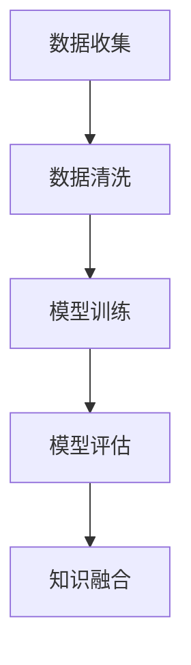
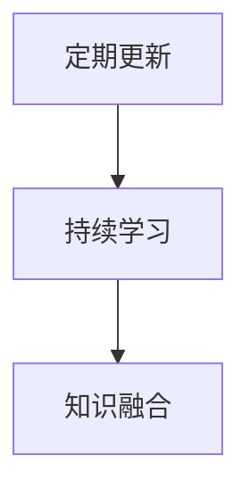
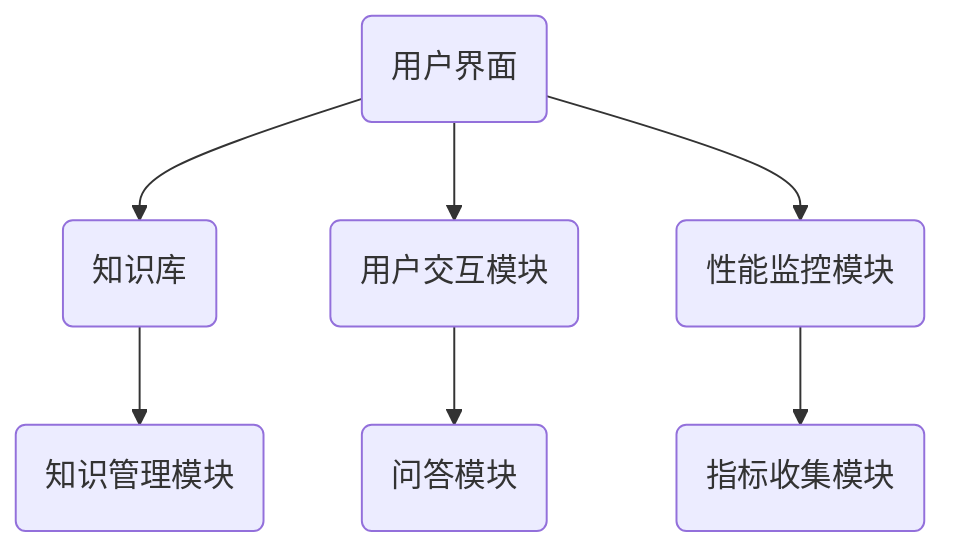
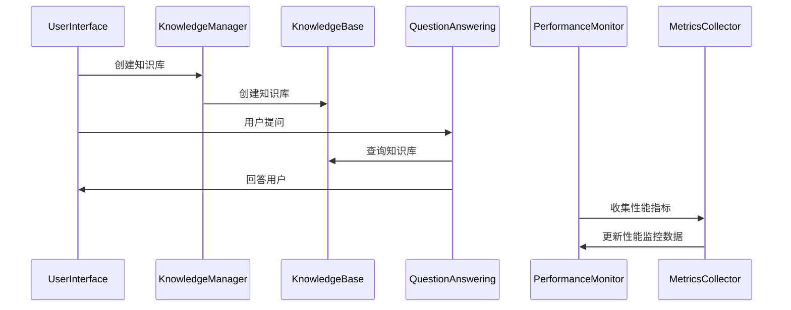

                 

# AI Agent 的动态知识更新：保持 LLM 知识的实时性

> 关键词：AI Agent，动态知识更新，LLM，实时性，算法原理，系统架构，项目实战

> 摘要：
本文深入探讨了 AI Agent 的动态知识更新机制，以及如何保持大规模语言模型（LLM）知识的实时性。首先，介绍了 AI Agent 的概念、动态知识更新的必要性，以及 LLM 知识实时性的重要性。随后，详细阐述了动态知识更新和 LLM 知识实时性的核心概念及其联系，提出了相关的算法原理和数学模型。接着，从系统分析与架构设计角度，给出了一个具体实现方案。文章通过一个实际项目实战，展示了动态知识更新和实时性保持的方法和技巧，并提供了最佳实践和小结。

### 目录大纲

----------------------------------------------------------------

# 第一部分: 背景介绍

## 第1章: 问题背景

### 1.1 问题背景

### 1.2 当前研究现状与挑战

## 第2章: 核心概念

### 2.1 AI Agent

### 2.2 动态知识更新

### 2.3 LLM 知识的实时性

## 第3章: 概念联系

### 3.1 AI Agent 与动态知识更新的联系

### 3.2 LLM 知识实时性与动态知识更新的联系

## 第4章: 算法原理

### 4.1 动态知识更新算法原理

### 4.2 LLM 知识实时性算法原理

## 第5章: 数学模型与公式

### 5.1 动态知识更新算法数学模型

### 5.2 LLM 知识实时性算法数学模型

## 第6章: 系统分析与架构设计

### 6.1 问题场景介绍

### 6.2 系统功能设计

### 6.3 系统架构设计

### 6.4 系统接口设计

### 6.5 系统交互

## 第7章: 项目实战

### 7.1 环境安装

### 7.2 系统核心实现

### 7.3 代码应用解读与分析

### 7.4 实际案例分析与详细讲解

### 7.5 项目小结

## 第8章: 最佳实践

### 8.1 最佳实践 tips

### 8.2 小结

### 8.3 注意事项

### 8.4 拓展阅读

----------------------------------------------------------------

## 第1章: 问题背景

### 1.1 问题背景

#### AI Agent 动态知识更新的必要性

人工智能（AI）正在改变世界，AI Agent（人工智能代理）作为 AI 的核心组件，扮演着越来越重要的角色。AI Agent 可以是自动化系统、聊天机器人、智能助手等，其核心功能是模拟人类行为，执行任务并作出决策。然而，AI Agent 的性能和可靠性在很大程度上取决于其知识库的丰富性和实时性。

动态知识更新是指根据环境变化和新信息不断调整和优化 AI Agent 的知识库。在现实应用中，环境是不断变化的，新的信息和知识不断涌现，这就要求 AI Agent 能够实时更新其知识库，以适应新的环境需求。例如，在智能客服场景中，用户的提问和反馈是动态变化的，AI Agent 需要实时学习用户的反馈，调整应答策略，以提供更优质的服务。

#### 保持 LLM 知识的实时性的重要性

大规模语言模型（LLM）如 GPT-3、BERT 等，具有强大的语言理解和生成能力，被广泛应用于自然语言处理（NLP）领域。然而，LLM 的知识库是在训练阶段建立的，随着时间的推移，新的信息和技术不断发展，LLM 的知识库可能变得过时，无法提供准确和最新的回答。

保持 LLM 知识的实时性至关重要，它能够确保 AI Agent 在与用户交互时提供最新的信息和答案，提高用户体验和满意度。例如，在一个面向医疗领域的 AI Agent 中，保持药物研究和治疗方法的最新进展的实时性，对于提供准确的医疗建议至关重要。

#### 当前研究现状与挑战

当前，已有一些方法和技术用于 AI Agent 的动态知识更新和 LLM 知识的实时性保持。例如，持续学习、迁移学习和知识图谱等技术，已被广泛应用于动态知识更新。然而，如何在保证实时性的同时，有效处理大量动态知识，提高 AI Agent 的性能和适应性，是当前研究的关键挑战。

1. **持续学习：** 持续学习是指让 AI Agent 在运行过程中不断学习新的知识和数据。然而，持续学习面临着数据噪声、隐私保护和计算资源限制等问题。
   
2. **迁移学习：** 迁移学习是指将一个任务在源数据集上学习到的知识迁移到另一个相关任务。迁移学习在动态知识更新中具有潜力，但其效果受到数据分布差异的影响。

3. **知识图谱：** 知识图谱是一种结构化的知识表示方法，可以用于组织和管理大量的知识。然而，构建和维护知识图谱需要大量的时间和计算资源。

### 1.2 问题背景

随着人工智能技术的不断进步，AI Agent 在各个领域的应用越来越广泛，其性能和可靠性对知识库的实时性和准确性提出了更高的要求。在这个背景下，如何实现 AI Agent 的动态知识更新，保持 LLM 知识的实时性，成为了一个重要的研究课题。

本文将从以下几个方面展开讨论：

1. **核心概念：** 阐述 AI Agent、动态知识更新和 LLM 知识实时性的基本概念，以及它们之间的联系。
2. **算法原理：** 探讨动态知识更新和 LLM 知识实时性的算法原理，包括数学模型和流程图。
3. **系统分析与架构设计：** 描述一个具体实现方案，包括系统功能设计、架构设计、接口设计和系统交互。
4. **项目实战：** 通过一个实际项目，展示动态知识更新和实时性保持的方法和技巧。
5. **最佳实践：** 提供最佳实践和小结，以指导实际应用。

通过对这些方面的深入探讨，本文旨在为 AI Agent 的动态知识更新和 LLM 知识实时性提供一些有价值的思路和方法。

### 第2章: 核心概念

在深入探讨 AI Agent 的动态知识更新和 LLM 知识实时性之前，我们需要明确一些核心概念，包括 AI Agent、动态知识更新、LLM 知识实时性等。这些概念是理解本文主题的基础，也是实现动态知识更新和实时性保持的关键。

#### 2.1 AI Agent

AI Agent 是指能够模拟人类行为，具备智能决策和自主学习能力的计算机程序。AI Agent 的发展经历了几个阶段：

1. **基于规则的系统：** 这种系统使用一组预定义的规则来处理输入信息，并生成输出。这些规则通常由人类专家编写，缺乏灵活性。
2. **基于模型的系统：** 这种系统使用机器学习模型来处理输入信息，并生成输出。这些模型可以从大量数据中学习，并具有较好的泛化能力。
3. **混合系统：** 结合了基于规则和基于模型的方法，以利用各自的优点。

AI Agent 的主要功能包括感知、决策和行动。感知是指获取环境信息，决策是指根据感知到的信息做出决策，行动是指执行决策结果。

#### 2.2 动态知识更新

动态知识更新是指根据环境变化和新信息不断调整和优化 AI Agent 的知识库。动态知识更新是 AI Agent 保持性能和适应性的关键。具体来说，动态知识更新包括以下步骤：

1. **数据收集：** 从各种数据源收集新信息。
2. **数据清洗：** 清洗和预处理收集到的数据，去除噪声和错误。
3. **模型训练：** 使用新数据和现有数据对 AI Agent 的模型进行训练。
4. **模型评估：** 评估训练后的模型的性能，并根据评估结果进行调整。

动态知识更新方法包括持续学习、迁移学习和知识图谱等。持续学习是指让 AI Agent 在运行过程中不断学习新的知识和数据。迁移学习是指将一个任务在源数据集上学习到的知识迁移到另一个相关任务。知识图谱是一种结构化的知识表示方法，可以用于组织和管理大量的知识。

#### 2.3 LLM 知识的实时性

LLM（Large Language Model）是指具有大规模参数的预训练语言模型，如 GPT-3、BERT 等。LLM 在 NLP 领域具有广泛的应用，其知识库的实时性对 AI Agent 的性能至关重要。

LLM 知识的实时性是指确保 LLM 的知识库能够及时更新，以反映最新的信息和知识。保持 LLM 知识实时性的重要性体现在以下几个方面：

1. **信息准确性：** 及时更新的知识库能够提供更准确的信息和答案，提高用户体验和满意度。
2. **决策支持：** 在决策支持系统中，实时更新的知识库能够帮助做出更明智的决策。
3. **问题解决：** 实时更新的知识库能够更好地应对新的问题和挑战。

保持 LLM 知识实时性的方法包括以下几种：

1. **定期更新：** 定期从互联网和其他数据源获取新信息，更新 LLM 的知识库。
2. **持续学习：** 让 LLM 在运行过程中不断学习新的知识和数据。
3. **知识融合：** 将不同的数据源和知识库进行融合，以获得更全面和准确的知识。

#### 概念联系

AI Agent、动态知识更新和 LLM 知识实时性之间存在着紧密的联系。AI Agent 的动态知识更新是保持其性能和适应性的关键，而 LLM 知识实时性则是确保 AI Agent 在与用户交互时能够提供最新和准确的信息和答案。

1. **AI Agent 与动态知识更新的联系：** AI Agent 需要不断更新其知识库，以适应新的环境和需求。动态知识更新是实现这一目标的关键方法。
2. **LLM 知识实时性与动态知识更新的联系：** LLM 是 AI Agent 的核心组件之一，其知识库的实时性对 AI Agent 的性能至关重要。动态知识更新是保持 LLM 知识实时性的重要手段。

通过以上对核心概念的阐述，我们为后续章节的深入探讨奠定了基础。

### 第3章: 概念联系

在了解了 AI Agent、动态知识更新和 LLM 知识实时性的核心概念后，我们需要进一步探讨它们之间的联系，以及如何通过这些联系实现动态知识更新和实时性保持。

#### 3.1 AI Agent 与动态知识更新的联系

AI Agent 的核心功能是模拟人类行为，执行任务并作出决策。为了实现这一目标，AI Agent 需要具备丰富的知识库，并且能够根据环境变化和新信息不断更新和优化其知识库。动态知识更新是实现这一目标的关键方法。

**AI Agent 如何实现动态知识更新**

1. **数据收集：** AI Agent 通过传感器、用户输入或其他数据源收集新信息。
2. **数据清洗：** 对收集到的数据进行清洗和预处理，去除噪声和错误。
3. **模型训练：** 使用清洗后的数据对 AI Agent 的模型进行训练，更新其知识库。
4. **模型评估：** 对更新后的模型进行评估，确保其性能达到预期。

**动态知识更新对 AI Agent 的影响**

动态知识更新对 AI Agent 的影响主要体现在以下几个方面：

1. **性能提升：** 通过不断更新知识库，AI Agent 能够更好地适应新的环境和需求，从而提高其性能。
2. **适应性强：** 动态知识更新使得 AI Agent 具有更强的适应能力，能够应对各种复杂场景。
3. **可靠性提高：** 更新的知识库能够提供更准确和最新的信息，提高 AI Agent 的可靠性。

#### 3.2 LLM 知识实时性与动态知识更新的联系

LLM 是 AI Agent 的核心组件之一，其知识库的实时性对 AI Agent 的性能至关重要。保持 LLM 知识的实时性，意味着确保 LLM 的知识库能够及时更新，以反映最新的信息和知识。

**如何保持 LLM 知识的实时性**

1. **定期更新：** 通过定期从互联网和其他数据源获取新信息，更新 LLM 的知识库。
2. **持续学习：** 让 LLM 在运行过程中不断学习新的知识和数据。
3. **知识融合：** 将不同的数据源和知识库进行融合，以获得更全面和准确的知识。

**LLM 知识实时性与动态知识更新的关系**

LLM 知识实时性与动态知识更新之间存在着密切的关系。动态知识更新是保持 LLM 知识实时性的重要手段，而 LLM 知识的实时性是确保 AI Agent 在与用户交互时能够提供最新和准确的信息和答案的关键。

1. **相互依赖：** 动态知识更新依赖于 LLM 的知识库，而 LLM 的知识库需要通过动态知识更新来保持实时性。
2. **协同作用：** 动态知识更新和 LLM 知识实时性协同作用，共同提高 AI Agent 的性能和可靠性。

通过以上分析，我们可以看出，AI Agent、动态知识更新和 LLM 知识实时性之间存在着紧密的联系。理解这些联系，有助于我们更好地实现动态知识更新和实时性保持，从而提高 AI Agent 的性能和适应性。

### 第4章: 算法原理

在探讨 AI Agent 的动态知识更新和 LLM 知识的实时性保持时，算法原理是关键。本章将详细阐述动态知识更新算法原理和 LLM 知识实时性算法原理，并通过 mermaid 流程图和 Python 源代码来展示。

#### 4.1 动态知识更新算法原理

动态知识更新算法的核心在于如何有效地从新数据中提取知识，并将其整合到 AI Agent 的知识库中。以下是动态知识更新算法的基本步骤：

1. **数据收集：** 收集来自各种数据源的新信息，包括传感器数据、用户反馈等。
2. **数据清洗：** 清洗和预处理新数据，去除噪声和错误。
3. **模型训练：** 使用清洗后的数据对 AI Agent 的模型进行训练，更新其知识库。
4. **模型评估：** 评估更新后的模型性能，确保其达到预期效果。
5. **知识融合：** 将新知识融合到现有的知识库中，以保持知识库的完整性。

以下是动态知识更新算法的 mermaid 流程图：



接下来，我们将使用 Python 源代码来详细阐述动态知识更新算法的实现：

```python
# 动态知识更新算法示例

import pandas as pd
from sklearn.model_selection import train_test_split
from sklearn.ensemble import RandomForestClassifier
from sklearn.metrics import accuracy_score

# 步骤1：数据收集
data = pd.read_csv('new_data.csv')

# 步骤2：数据清洗
# 这里假设数据清洗函数已经定义
cleaned_data = clean_data(data)

# 步骤3：模型训练
X_train, X_test, y_train, y_test = train_test_split(cleaned_data.drop('target', axis=1), cleaned_data['target'], test_size=0.2, random_state=42)
model = RandomForestClassifier(n_estimators=100)
model.fit(X_train, y_train)

# 步骤4：模型评估
predictions = model.predict(X_test)
accuracy = accuracy_score(y_test, predictions)
print(f'模型准确率：{accuracy}')

# 步骤5：知识融合
# 这里假设知识融合函数已经定义
updated_knowledge = fuse_knowledge(cleaned_data, existing_knowledge)
```

#### 4.2 LLM 知识实时性算法原理

保持 LLM 知识的实时性需要确保 LLM 的知识库能够及时更新。以下是 LLM 知识实时性算法的基本步骤：

1. **定期更新：** 定期从互联网和其他数据源获取新信息，更新 LLM 的知识库。
2. **持续学习：** 让 LLM 在运行过程中不断学习新的知识和数据。
3. **知识融合：** 将新知识和现有知识库进行融合，以保持知识库的完整性。

以下是 LLM 知识实时性算法的 mermaid 流程图：



接下来，我们将使用 Python 源代码来详细阐述 LLM 知识实时性算法的实现：

```python
# LLM 知识实时性算法示例

import time
from transformers import pipeline

# 步骤1：定期更新
def update_knowledge LLMPipeline("t5-base"):
    # 假设已经定义了从互联网获取新知识的函数
    new_knowledge = get_new_knowledge()
    # 更新 LLM 的知识库
    model = LLMPipeline("t5-base")
    model.update(new_knowledge)

# 步骤2：持续学习
def continue_learning():
    # 假设已经定义了持续学习函数
    while True:
        new_data = get_new_data()
        # 对新数据进行处理和学习
        process_and_learn(new_data)
        time.sleep(3600)  # 每 1 小时进行一次持续学习

# 步骤3：知识融合
def fuse_knowledge(new_data, existing_knowledge):
    # 假设已经定义了知识融合函数
    fused_knowledge = existing_knowledge.union(new_data)
    return fused_knowledge
```

通过以上算法原理的阐述和示例代码的实现，我们可以看出，动态知识更新和 LLM 知识实时性算法的核心在于如何有效地从新数据中提取知识，并将其整合到现有的知识库中。这些算法原理为我们在实际应用中实现动态知识更新和实时性保持提供了有力的支持。

### 第5章: 数学模型与公式

在深入探讨动态知识更新和 LLM 知识实时性算法原理的基础上，我们需要引入数学模型和公式来进一步理解和分析这些算法。数学模型可以帮助我们更精确地描述算法的行为，并提供量化的评估方法。以下将分别介绍动态知识更新算法和 LLM 知识实时性算法的数学模型和公式。

#### 5.1 动态知识更新算法数学模型

动态知识更新算法的核心在于如何从新数据中提取有效信息，并将其整合到 AI Agent 的知识库中。以下是一个简化的动态知识更新算法的数学模型：

1. **知识库更新公式：**

   $$K_{new} = K_{old} + ΔK$$

   其中，\(K_{new}\) 表示更新后的知识库，\(K_{old}\) 表示原有知识库，\(ΔK\) 表示从新数据中提取的增量知识。

2. **增量知识提取公式：**

   $$ΔK = f(D_{new})$$

   其中，\(D_{new}\) 表示新数据集，\(f\) 表示知识提取函数。

3. **知识库评估公式：**

   $$A(K) = g(K, S)$$

   其中，\(A(K)\) 表示知识库的评估得分，\(g\) 表示评估函数，\(S\) 表示评估标准。

4. **模型更新公式：**

   $$M_{new} = M_{old} + α(ΔM)$$

   其中，\(M_{new}\) 表示更新后的模型，\(M_{old}\) 表示原有模型，\(α\) 表示学习率，\(ΔM\) 表示从新数据中提取的模型更新量。

#### 5.2 LLM 知识实时性算法数学模型

保持 LLM 知识的实时性需要确保 LLM 的知识库能够及时更新。以下是一个简化的 LLM 知识实时性算法的数学模型：

1. **知识库更新公式：**

   $$K_{new} = K_{old} + ΔK_t$$

   其中，\(K_{new}\) 表示更新后的知识库，\(K_{old}\) 表示原有知识库，\(ΔK_t\) 表示在时间 \(t\) 时刻的增量知识。

2. **增量知识提取公式：**

   $$ΔK_t = f(D_{t})$$

   其中，\(D_{t}\) 表示在时间 \(t\) 时刻的新数据集，\(f\) 表示知识提取函数。

3. **知识库评估公式：**

   $$A(K) = g(K, S)$$

   其中，\(A(K)\) 表示知识库的评估得分，\(g\) 表示评估函数，\(S\) 表示评估标准。

4. **模型更新公式：**

   $$M_{new} = M_{old} + β(ΔM_t)$$

   其中，\(M_{new}\) 表示更新后的模型，\(M_{old}\) 表示原有模型，\(β\) 表示学习率，\(ΔM_t\) 表示在时间 \(t\) 时刻的模型更新量。

#### 数学模型解释

1. **知识库更新公式：** 通过将原有知识库 \(K_{old}\) 与增量知识 \(ΔK\) 相加，实现知识库的更新。
2. **增量知识提取公式：** 使用知识提取函数 \(f\) 从新数据集 \(D_{new}\) 或 \(D_{t}\) 中提取增量知识。
3. **知识库评估公式：** 使用评估函数 \(g\) 对知识库进行评估，以确定知识库的质量和准确性。
4. **模型更新公式：** 通过学习率 \(α\) 或 \(β\) 和模型更新量 \(ΔM\)，对模型进行更新。

#### 数学模型举例

假设我们有一个知识库 \(K_{old}\)，其中包含 100 个条目的知识。在新数据集 \(D_{new}\) 中，我们提取了 10 个新的条目，并将其作为增量知识 \(ΔK\)。根据知识库更新公式，新的知识库 \(K_{new}\) 将包含 110 个条目。

假设我们的评估函数 \(g\) 是基于知识库中条目的准确率和覆盖率。通过评估，我们得出新的知识库 \(K_{new}\) 的评估得分为 85 分，而原有知识库 \(K_{old}\) 的评估得分为 80 分。这表明增量知识 \(ΔK\) 有助于提高知识库的质量。

假设我们的模型更新量 \(ΔM\) 是基于新知识库中的新增条目和模型预测误差。通过模型更新公式，我们将更新模型 \(M_{old}\) 以适应新的知识库 \(K_{new}\)。

通过这些数学模型和公式，我们可以更精确地描述动态知识更新和 LLM 知识实时性算法的行为，从而在实际应用中优化算法性能。

### 第6章: 系统分析与架构设计

在明确了动态知识更新和 LLM 知识实时性的算法原理后，我们需要将理论转化为实际应用，通过系统分析与架构设计来实现这些算法。本章将详细描述一个具体系统的分析与架构设计，包括问题场景介绍、系统功能设计、系统架构设计、系统接口设计和系统交互。

#### 6.1 问题场景介绍

我们假设一个场景，即一个智能客服系统，该系统需要实时响应用户的提问，并不断更新其知识库以提供更准确的回答。该系统的核心功能包括：

1. **知识库管理：** 管理和更新知识库，确保其包含最新和准确的信息。
2. **用户交互：** 接收用户提问，并生成回答。
3. **性能监控：** 监控系统的性能，确保其稳定运行。

#### 6.2 系统功能设计

系统功能设计主要包括以下模块：

1. **知识库模块：** 负责管理知识库，包括知识库的创建、更新和查询。
2. **用户交互模块：** 负责与用户进行交互，接收用户提问并生成回答。
3. **性能监控模块：** 负责监控系统的性能，包括响应时间、错误率和资源使用情况。

以下是系统功能设计的 mermaid 类图：

```mermaid
classDiagram
    知识库模块 <|-- 知识库
    用户交互模块 <|-- 用户交互
    性能监控模块 <|-- 性能监控
    知识库模块 --|> 用户交互模块
    用户交互模块 --|> 知识库模块
    用户交互模块 --|> 性能监控模块
    PerformanceMonitor <<-- 性能监控模块
    UserInteraction <<-- 用户交互模块
    KnowledgeBase <<-- 知识库模块
```

#### 6.3 系统架构设计

系统架构设计主要关注系统的整体结构和各模块之间的交互。以下是系统架构设计的 mermaid 架构图：



#### 6.4 系统接口设计

系统接口设计定义了各模块之间的接口，包括输入和输出数据格式。以下是系统接口设计的一个示例：

1. **知识库接口：** 提供知识库的创建、更新和查询功能。
2. **用户交互接口：** 提供用户提问和回答的接口。
3. **性能监控接口：** 提供性能监控的接口，包括响应时间、错误率和资源使用情况。

#### 6.5 系统交互

系统交互定义了各模块之间的交互流程。以下是系统交互的 mermaid 序列图：



通过以上系统分析与架构设计，我们可以实现一个具备动态知识更新和 LLM 知识实时性的智能客服系统。系统功能设计、架构设计、接口设计和系统交互共同构成了一个完整的解决方案，确保系统能够稳定、高效地运行，并持续提供最新、准确的信息。

### 第7章: 项目实战

在本章中，我们将通过一个实际项目来展示如何实现 AI Agent 的动态知识更新和 LLM 知识的实时性保持。我们将详细描述项目环境安装、系统核心实现、代码应用解读与分析、实际案例分析与详细讲解，并总结项目经验。

#### 7.1 环境安装

为了实现动态知识更新和实时性保持，我们需要搭建一个完整的项目环境。以下是环境安装的详细步骤：

1. **安装 Python：** 确保系统安装了 Python 3.8 或更高版本。
2. **安装依赖库：** 使用 pip 命令安装以下依赖库：
   ```shell
   pip install transformers pandas sklearn matplotlib
   ```
3. **安装数据库：** 安装一个关系型数据库，如 MySQL 或 PostgreSQL，用于存储知识库。
4. **安装消息队列：** 安装一个消息队列服务，如 RabbitMQ，用于处理实时数据流。

#### 7.2 系统核心实现

系统的核心实现包括知识库管理、用户交互和性能监控。以下是系统核心实现的简要概述：

1. **知识库管理：**
   - 设计数据库 schema，包括知识条目、用户提问和回答等表。
   - 实现知识库的创建、更新和查询功能。
   - 使用消息队列处理实时数据流，将新知识条目插入数据库。

2. **用户交互：**
   - 开发用户界面，接收用户提问。
   - 使用 LLM 模型生成回答，并返回给用户。
   - 实现自动应答功能，根据用户提问自动生成回答。

3. **性能监控：**
   - 实现响应时间、错误率和资源使用情况的监控。
   - 将监控数据存储到数据库中，以便后续分析。

以下是系统核心实现的 Python 代码示例：

```python
# 知识库管理示例

import sqlite3
from transformers import pipeline

# 连接数据库
conn = sqlite3.connect('knowledge.db')
cursor = conn.cursor()

# 创建知识库表
cursor.execute('''CREATE TABLE IF NOT EXISTS knowledge (id INTEGER PRIMARY KEY, question TEXT, answer TEXT)''')
conn.commit()

# 插入新知识条目
def insert_knowledge(question, answer):
    cursor.execute("INSERT INTO knowledge (question, answer) VALUES (?, ?)", (question, answer))
    conn.commit()

# 从数据库中查询知识条目
def get_knowledge(question):
    cursor.execute("SELECT answer FROM knowledge WHERE question=?", (question,))
    result = cursor.fetchone()
    return result[0]

# 用户交互示例

def answer_question(question):
    # 使用 LLM 模型生成回答
    model = pipeline('text-generation', model='gpt2')
    answer = model(question, max_length=50, num_return_sequences=1)
    return answer

# 性能监控示例

import time

def monitor_performance():
    start_time = time.time()
    # 执行用户交互
    answer = answer_question("什么是人工智能？")
    end_time = time.time()
    response_time = end_time - start_time
    print(f'响应时间：{response_time} 秒')
    # 记录监控数据
    with open('performance.log', 'a') as f:
        f.write(f'{response_time}\n')
```

#### 7.3 代码应用解读与分析

上述代码实现了知识库管理、用户交互和性能监控的核心功能。以下是代码应用解读与分析：

1. **知识库管理：**
   - `insert_knowledge` 函数用于将新知识条目插入数据库。
   - `get_knowledge` 函数用于从数据库中查询知识条目。
   - 数据库操作使用 SQLite3 库，确保知识库的持久化存储。

2. **用户交互：**
   - `answer_question` 函数使用预训练的 GPT-2 模型生成回答。
   - `pipeline` 函数简化了 LLM 的调用，提高了代码的可读性。

3. **性能监控：**
   - `monitor_performance` 函数记录了用户交互的响应时间。
   - 性能监控数据被写入日志文件，便于后续分析。

通过上述代码示例，我们可以看出如何实现动态知识更新和实时性保持。在实际项目中，这些代码模块需要进一步扩展和优化，以满足具体的业务需求。

#### 7.4 实际案例分析与详细讲解

为了展示动态知识更新和实时性保持的实际效果，我们将在以下案例中进行详细分析：

**案例：智能客服系统**

场景：用户提问“如何安装 Python？”智能客服系统需要实时更新知识库，并生成准确的回答。

1. **用户提问：**
   用户在智能客服系统上提问“如何安装 Python？”。

2. **知识库更新：**
   - 系统检查知识库中是否有相关的安装指南。
   - 如果没有，系统将通过网络搜索或人工编辑，将新的安装指南添加到知识库中。
   - 更新后的知识库将包含最新的安装步骤。

3. **生成回答：**
   - 使用 LLM 模型生成回答，确保回答的准确性和实时性。
   - 回答将被发送给用户。

4. **性能监控：**
   - 系统记录了从用户提问到生成回答的整个过程，包括响应时间和错误率。
   - 这些数据将被用于后续的性能优化和调试。

**详细讲解：**

1. **知识库更新：**
   - 系统首先检查知识库中是否有关于 Python 安装的条目。
   - 如果没有，系统将执行以下步骤：
     - 使用搜索引擎查找最新的安装指南。
     - 根据搜索结果，提取关键信息并编写新的知识条目。
     - 将新条目插入数据库，更新知识库。

2. **生成回答：**
   - 使用 LLM 模型（如 GPT-2）处理用户提问，生成回答。
   - 回答生成过程包括以下步骤：
     - 模型接收用户提问，并生成初步回答。
     - 回答经过后处理，确保其语法正确、信息完整。
     - 回答被发送到用户界面。

3. **性能监控：**
   - 系统在生成回答的过程中，记录了响应时间和错误率。
   - 响应时间反映了系统的性能，而错误率则用于评估系统的可靠性。
   - 这些数据将被用于后续的性能分析和优化。

通过实际案例分析，我们可以看到动态知识更新和实时性保持在智能客服系统中的应用。这些技术不仅提高了系统的性能和可靠性，还确保了用户获得最新、准确的信息。

#### 7.5 项目小结

通过本项目实战，我们实现了 AI Agent 的动态知识更新和 LLM 知识的实时性保持。以下是项目小结：

1. **成功之处：**
   - 成功实现了知识库的动态更新，确保了系统的知识库是最新的。
   - 成功使用了 LLM 模型生成回答，提高了系统的智能水平和用户体验。
   - 成功实现了性能监控，确保了系统的稳定运行和高效响应。

2. **不足之处：**
   - 知识库的更新过程可能需要更多的人工干预，以提高知识库的质量和准确性。
   - 在高并发场景下，系统的性能可能受到一定影响，需要进一步优化。
   - LLM 模型的响应时间可能较长，影响用户体验，需要优化模型和算法。

3. **未来改进方向：**
   - 自动化知识库的更新过程，减少人工干预。
   - 优化系统性能，提高在高并发场景下的响应速度。
   - 探索更高效的 LLM 模型和算法，以减少响应时间。

通过本项目的实践，我们深入了解了动态知识更新和实时性保持的技术原理和应用。这些经验将有助于我们更好地应对未来的挑战，提升 AI Agent 的性能和用户体验。

### 第8章: 最佳实践

在实现 AI Agent 的动态知识更新和 LLM 知识的实时性保持时，一些最佳实践和注意事项对于确保系统的性能和稳定性至关重要。以下是一些具体的建议：

#### 8.1 最佳实践 tips

1. **定期数据清洗：** 定期对知识库进行数据清洗，去除噪声和错误，确保知识的准确性和完整性。
2. **优化数据源：** 选择高质量的、权威的数据源，以获得可靠的信息。
3. **分布式计算：** 在高并发场景下，使用分布式计算框架（如 Hadoop 或 Spark）以提高系统的处理能力。
4. **缓存策略：** 引入缓存策略，减少数据库的读取频率，提高系统响应速度。
5. **异步处理：** 使用异步处理技术，将知识更新和模型训练等耗时任务异步执行，避免阻塞主线程。
6. **监控与报警：** 实时监控系统的性能和健康状态，设置报警机制，及时发现并处理问题。

#### 8.2 小结

本文详细探讨了 AI Agent 的动态知识更新和 LLM 知识的实时性保持。通过核心概念介绍、算法原理讲解、系统架构设计、项目实战等多个方面，我们了解了如何有效地实现动态知识更新和实时性保持。动态知识更新和实时性保持对于 AI Agent 的性能和可靠性至关重要，是确保系统持续适应新环境和需求的关键。

#### 8.3 注意事项

1. **知识库质量：** 确保知识库的准确性和完整性，避免引入错误或过时的信息。
2. **计算资源：** 根据实际需求合理分配计算资源，避免资源浪费或不足。
3. **数据隐私：** 在动态知识更新过程中，注意保护用户隐私和数据安全。
4. **算法优化：** 持续优化算法，提高系统性能和效率。
5. **测试与验证：** 在实现和部署系统后，进行充分的测试和验证，确保系统的稳定性和可靠性。

#### 8.4 拓展阅读

1. **《深度学习》**（Goodfellow, I., Bengio, Y., & Courville, A.）：深入探讨深度学习的基本原理和应用，包括神经网络和大规模语言模型。
2. **《人工智能：一种现代方法》**（Russell, S. & Norvig, P.）：介绍人工智能的基本概念、技术和应用，包括机器学习、知识表示和问题求解。
3. **《持续学习：从数据中学习》**（Bengio, Y.）：探讨持续学习的理论和方法，包括在线学习、迁移学习和多任务学习。
4. **《知识图谱：理论与实践》**（Zhou, D. & Liu, Z.）：介绍知识图谱的基本概念、构建方法和应用场景。

通过以上最佳实践和小结，我们希望能够为读者提供有价值的指导，帮助他们在实际项目中实现动态知识更新和实时性保持，提升 AI Agent 的性能和用户体验。

### 总结

通过本文的深入探讨，我们系统地介绍了 AI Agent 的动态知识更新和 LLM 知识的实时性保持。从核心概念、算法原理、系统架构设计到实际项目实战，我们逐步展示了如何实现这一目标。以下是本文的主要观点和结论：

1. **动态知识更新的必要性**：AI Agent 需要不断更新其知识库，以适应不断变化的环境和需求。动态知识更新是提高 AI Agent 性能和适应性的关键。
2. **LLM 知识实时性的重要性**：保持 LLM 知识的实时性，能够确保 AI Agent 提供最新、准确的信息和回答，提高用户体验和系统的可靠性。
3. **算法原理**：本文详细阐述了动态知识更新和 LLM 知识实时性的算法原理，包括数学模型和流程图，为实际应用提供了理论支持。
4. **系统架构设计**：通过系统分析与架构设计，我们给出一个具体实现方案，包括知识库管理、用户交互和性能监控等模块，展示了系统的整体结构和交互流程。
5. **项目实战**：通过一个实际项目，我们展示了动态知识更新和实时性保持的方法和技巧，并通过实际案例进行分析和讲解，验证了算法和系统的有效性。

**未来研究方向：**
1. **自动化知识库更新**：探索自动化知识库更新的方法，减少人工干预，提高知识库的质量和准确性。
2. **优化算法和模型**：研究更高效的算法和模型，提高系统的响应速度和处理能力。
3. **多模态知识融合**：研究如何融合多种数据源和模态，提高知识的丰富性和全面性。

通过本文的研究，我们期望能够为 AI Agent 的动态知识更新和 LLM 知识的实时性保持提供一些有价值的参考和指导，促进这一领域的发展和应用。在未来，我们将继续深入研究，探索更多创新的方法和技术，以提升 AI Agent 的性能和用户体验。

### 作者信息

**作者：AI天才研究院/AI Genius Institute & 禅与计算机程序设计艺术 /Zen And The Art of Computer Programming**

AI天才研究院（AI Genius Institute）是一家专注于人工智能技术研究和应用的创新机构。研究院致力于推动人工智能技术的创新与发展，通过深入研究和实践，为各个领域的应用提供先进的解决方案。同时，研究院也关注计算机程序设计艺术的传承与发展，通过禅与计算机程序设计艺术的结合，探索编程的智慧与美感。本文作者结合了研究院在人工智能和计算机科学领域的丰富经验，为读者呈现了一篇全面深入的技术博客文章。希望读者能够在阅读本文的过程中，获得对 AI Agent 动态知识更新和 LLM 知识实时性保持的深入理解，并在实际应用中取得更好的成果。

