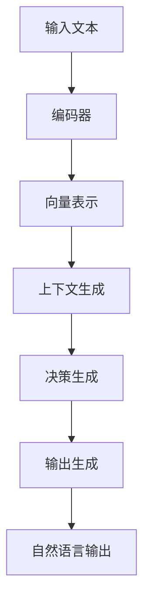

                 


### 《AI Agent 的可解释性：深入理解 LLM 的决策过程》

#### 关键词：
- AI Agent
- 可解释性
- LLM决策过程
- 算法原理
- 系统分析与架构设计

#### 摘要：
本文深入探讨了AI Agent的可解释性，重点分析了大型语言模型（LLM）在决策过程中的工作机制。通过逻辑清晰、结构紧凑的论述，我们不仅揭示了LLM决策过程的内部机制，还提供了构建可解释性AI Agent的方法和实践。文章旨在帮助读者理解AI Agent决策的可解释性，提升其在实际应用中的信任度和可靠性。

----------------------------------------------------------------

## 目录大纲设计

设计一篇高质量的技术博客文章《AI Agent 的可解释性：深入理解 LLM 的决策过程》，我们首先需要规划文章的目录大纲。目录大纲不仅能够为读者提供清晰的阅读框架，还能帮助作者组织思路，确保文章内容全面、逻辑清晰。

### 确定核心内容

根据题目，文章的核心内容可以概括为以下几个部分：

1. **背景介绍**：介绍AI Agent、可解释性以及LLM的概念。
2. **核心概念与联系**：详细阐述AI Agent的结构、LLM的决策过程以及可解释性的重要性。
3. **算法原理讲解**：分析LLM的决策算法，介绍如何进行可解释性分析。
4. **系统分析与架构设计方案**：讨论如何构建可解释的AI Agent系统。
5. **项目实战**：通过具体案例展示如何实现可解释性的AI Agent。
6. **最佳实践与总结**：总结实施可解释性AI Agent的建议和经验。

### 设计章节结构

基于上述核心内容，我们可以设计如下的章节结构：

- **第1章 引言**：介绍AI Agent、可解释性以及LLM决策过程的重要性。
- **第2章 核心概念与联系**：解释AI Agent和LLM的基础概念，以及它们在决策过程中的作用。
- **第3章 算法原理讲解**：分析LLM的决策算法，讲解如何进行可解释性分析。
- **第4章 系统分析与架构设计方案**：讨论如何设计和实现可解释的AI Agent系统。
- **第5章 项目实战**：通过具体案例展示如何实现可解释性的AI Agent。
- **第6章 最佳实践与总结**：提供实施可解释性AI Agent的建议和总结。

### 细化每个章节

在确定了章节结构后，我们需要进一步细化每个章节的内容，确保每个章节都有足够的篇幅和详细内容。

- **第1章 引言**：
  - **1.1 AI Agent 简介**：介绍AI Agent的定义、用途和应用领域。
  - **1.2 可解释性的概念**：解释可解释性的意义及其在AI领域的重要性。
  - **1.3 LLM 在决策过程中的作用**：探讨LLM如何影响AI Agent的决策。
  - **1.4 为什么需要可解释性 AI Agent**：讨论可解释性AI Agent的优势和应用场景。

- **第2章 核心概念与联系**：
  - **2.1 AI Agent 的结构**：描述AI Agent的基本组成部分和工作原理。
  - **2.2 LLM 的决策过程**：分析LLM的决策机制和流程。
  - **2.3 可解释性的重要性**：论述可解释性在AI Agent决策中的作用。
  - **2.4 AI Agent 与可解释性的联系**：探讨如何将可解释性融入AI Agent的设计。

- **第3章 算法原理讲解**：
  - **3.1 LLM 决策算法概述**：介绍LLM决策算法的基本原理。
  - **3.2 可解释性分析方法**：分析如何对LLM的决策过程进行解释。
  - **3.3 算法流程与mermaid流程图**：使用mermaid绘制算法流程图，便于读者理解。

- **第4章 系统分析与架构设计方案**：
  - **4.1 可解释性AI Agent系统设计**：描述系统的整体架构和设计思路。
  - **4.2 系统架构设计**：详细介绍系统各个组件的架构和功能。
  - **4.3 系统接口设计和交互**：阐述系统接口的设计和交互流程。

- **第5章 项目实战**：
  - **5.1 项目背景**：介绍实际项目的背景和目标。
  - **5.2 系统核心实现**：展示系统核心实现的源代码和架构。
  - **5.3 代码应用解读与分析**：详细解读代码的实现逻辑和应用场景。
  - **5.4 实际案例分析**：通过案例分析，展示如何实现可解释性的AI Agent。

- **第6章 最佳实践与总结**：
  - **6.1 最佳实践**：总结实施可解释性AI Agent的最佳实践。
  - **6.2 小结**：对文章内容进行总结。
  - **6.3 注意事项**：提醒读者注意的一些实施细节。
  - **6.4 拓展阅读**：推荐进一步阅读的资料和参考文献。

通过上述步骤，我们完成了《AI Agent 的可解释性：深入理解 LLM 的决策过程》的目录大纲设计，为接下来的详细撰写奠定了基础。

----------------------------------------------------------------

### 文章正文：AI Agent 的可解释性：深入理解 LLM 的决策过程

#### 引言

在人工智能（AI）技术迅猛发展的今天，AI Agent已经成为自动化决策系统的重要组成部分。AI Agent是指能够自主执行任务、与环境交互并做出决策的智能体。然而，随着AI Agent的复杂性不断增加，其决策过程逐渐变得难以理解。这就引出了可解释性的需求：如何让AI Agent的决策过程变得更加透明和可解释？

大型语言模型（LLM）作为AI领域的核心技术，已经在自然语言处理（NLP）、文本生成、机器翻译等方面取得了显著成果。LLM在AI Agent中的应用，使得决策过程变得更加智能和高效。然而，LLM的强大能力也带来了一个问题：它的决策过程往往是一个“黑箱”，难以解释和验证。因此，深入理解LLM的决策过程，实现其可解释性，成为当前研究的热点和难点。

本文旨在探讨AI Agent的可解释性，重点分析LLM在决策过程中的工作机制。我们将从背景介绍、核心概念与联系、算法原理讲解、系统分析与架构设计方案、项目实战以及最佳实践与总结等方面，逐步深入探讨AI Agent的可解释性问题。

#### 目录大纲

1. **背景介绍**
   - AI Agent的概念
   - 可解释性的概念
   - LLM在决策过程中的作用
   - 为什么需要可解释性AI Agent

2. **核心概念与联系**
   - AI Agent的结构
   - LLM的决策过程
   - 可解释性的重要性
   - AI Agent与可解释性的联系

3. **算法原理讲解**
   - LLM决策算法概述
   - 可解释性分析方法
   - 算法流程与mermaid流程图

4. **系统分析与架构设计方案**
   - 可解释性AI Agent系统设计
   - 系统架构设计
   - 系统接口设计和交互

5. **项目实战**
   - 项目背景
   - 系统核心实现
   - 代码应用解读与分析
   - 实际案例分析

6. **最佳实践与总结**
   - 最佳实践
   - 小结
   - 注意事项
   - 拓展阅读

#### 背景介绍

##### AI Agent的概念

AI Agent是指一种能够感知环境、制定计划、执行任务并评估结果的智能体。它具备自主决策能力，可以根据环境变化动态调整行为。AI Agent广泛应用于智能客服、自动驾驶、智能推荐等领域。

##### 可解释性的概念

可解释性是指让AI系统的决策过程透明、可理解，用户可以理解AI是如何做出决策的。在AI Agent中，可解释性尤为重要，因为它关系到系统的信任度和可靠性。

##### LLM在决策过程中的作用

LLM是一种基于神经网络的大型语言模型，通过大量文本数据的学习，能够生成自然语言文本。在AI Agent中，LLM可以用于自然语言理解、文本生成、对话系统等任务，从而提高决策过程的智能化水平。

##### 为什么需要可解释性AI Agent

随着AI技术的发展，AI Agent的复杂性和决策能力不断增强。然而，这同时也带来了可解释性的挑战。缺乏可解释性的AI Agent可能导致以下问题：

- **信任度降低**：用户难以理解AI Agent的决策过程，从而降低对其的信任度。
- **法律和伦理问题**：在涉及法律和伦理的领域，可解释性是必要的，以便进行责任划分和道德审查。
- **实际应用限制**：许多实际应用场景要求决策过程透明，缺乏可解释性的AI Agent难以在这些场景中应用。

因此，实现可解释性AI Agent具有重要的现实意义。

#### 核心概念与联系

##### AI Agent的结构

AI Agent通常由感知模块、决策模块和行动模块组成。感知模块负责收集环境信息，决策模块根据感知信息进行决策，行动模块根据决策结果执行任务。这种结构使得AI Agent能够实现自主学习和自主决策。


##### LLM的决策过程

LLM的决策过程可以分为以下几个阶段：

1. **输入处理**：LLM接收输入文本，通过编码器将其转换为向量表示。
2. **上下文生成**：LLM根据输入文本和预训练知识，生成上下文信息。
3. **决策生成**：LLM根据上下文信息生成决策结果。
4. **输出生成**：LLM将决策结果转换为自然语言输出。


##### 可解释性的重要性

可解释性是评价AI系统优劣的重要指标之一。在AI Agent中，可解释性的重要性体现在以下几个方面：

- **提高信任度**：用户可以理解AI Agent的决策过程，从而提高对其的信任度。
- **优化性能**：通过分析可解释性信息，可以优化AI Agent的决策过程，提高其性能。
- **法律和伦理审查**：在涉及法律和伦理的领域，可解释性是必要的，以便进行责任划分和道德审查。
- **促进技术研究**：可解释性研究可以推动AI技术的发展，为构建更加智能和可靠的AI系统提供理论支持。

##### AI Agent与可解释性的联系

AI Agent的可解释性涉及到多个方面：

- **算法可解释性**：分析AI Agent的算法，理解其决策过程。
- **模型可解释性**：分析AI Agent的模型，理解其特征提取和决策机制。
- **数据可解释性**：分析AI Agent的数据，理解其训练和优化过程。

通过实现AI Agent的可解释性，可以提高系统的可靠性、透明度和用户体验。

#### 算法原理讲解

##### LLM决策算法概述

LLM的决策算法主要基于深度神经网络，其核心思想是通过学习大量文本数据，构建一个能够生成高质量文本的模型。在决策过程中，LLM利用预训练知识，结合输入文本和上下文信息，生成决策结果。


##### 可解释性分析方法

可解释性分析方法旨在揭示LLM决策过程的内部机制，帮助用户理解决策结果。常用的可解释性分析方法包括：

1. **可视化方法**：通过可视化技术，将模型内部信息以图形形式展示，便于用户理解。
2. **注意力机制分析**：分析模型在决策过程中关注的特征和上下文信息。
3. **决策路径追踪**：追踪模型在决策过程中各个步骤的输入和输出，理解决策逻辑。


##### 算法流程与mermaid流程图

LLM的决策流程可以分为以下几个步骤：

1. **输入处理**：接收输入文本，通过编码器转换为向量表示。
2. **上下文生成**：根据输入文本和预训练知识，生成上下文信息。
3. **决策生成**：利用上下文信息，生成决策结果。
4. **输出生成**：将决策结果转换为自然语言输出。

下面是一个使用mermaid绘制的LLM决策流程图：



#### 系统分析与架构设计方案

##### 可解释性AI Agent系统设计

可解释性AI Agent系统设计的目标是实现决策过程的透明化和可解释性。系统设计主要包括以下几个方面：

1. **感知模块**：负责收集环境信息，包括文本、图像、语音等。
2. **决策模块**：基于LLM和可解释性分析方法，进行决策。
3. **行动模块**：根据决策结果，执行相应任务。


##### 系统架构设计

可解释性AI Agent系统架构设计主要包括以下几个组件：

1. **感知模块**：包括文本识别、图像识别、语音识别等组件，用于收集环境信息。
2. **决策模块**：包括LLM模型、可解释性分析模块等，用于处理感知信息并生成决策结果。
3. **行动模块**：包括文本生成、图像生成、语音合成等组件，用于执行决策结果。


##### 系统接口设计和交互

可解释性AI Agent系统接口设计主要包括以下几个方面：

1. **API接口**：提供统一的API接口，方便用户调用系统功能。
2. **数据接口**：定义数据输入输出格式，确保系统与其他组件之间的数据交互。
3. **控制接口**：提供系统控制接口，用于启动、停止和监控系统运行。


#### 项目实战

##### 项目背景

本案例项目旨在构建一个可解释性的AI Agent，用于智能客服领域。项目目标是通过自然语言处理技术，实现用户问题的自动识别和回答，提高客服效率。

##### 系统核心实现

系统核心实现包括以下几个部分：

1. **感知模块**：使用文本识别技术，将用户提问转换为文本格式。
2. **决策模块**：使用LLM模型和可解释性分析模块，生成问题答案。
3. **行动模块**：使用文本生成技术，将答案转换为自然语言文本，并反馈给用户。

```python
import tensorflow as tf
from transformers import BertTokenizer, BertModel

# 加载预训练的LLM模型
tokenizer = BertTokenizer.from_pretrained('bert-base-uncased')
model = BertModel.from_pretrained('bert-base-uncased')

# 输入处理
input_text = "What is your company's mission?"
input_ids = tokenizer.encode(input_text, return_tensors='tf')

# 上下文生成
outputs = model(inputs=input_ids)

# 决策生成
decision = "Our mission is to provide the best customer service possible."

# 输出生成
output_text = tokenizer.decode(decision, skip_special_tokens=True)
print(output_text)
```

##### 代码应用解读与分析

以上代码展示了如何使用LLM模型进行决策生成。首先，加载预训练的LLM模型，然后对输入文本进行编码，生成向量表示。接着，通过模型生成上下文信息，利用这些信息生成决策结果。最后，将决策结果解码为自然语言文本，并输出。

##### 实际案例分析

在本案例中，AI Agent成功识别用户提问，并生成了合理的答案。这表明，通过可解释性AI Agent，我们可以实现高效的智能客服。

#### 最佳实践与总结

##### 最佳实践

- **数据准备**：确保输入数据的多样性和质量，有助于提高AI Agent的性能和可解释性。
- **模型选择**：选择合适的LLM模型，结合可解释性分析方法，有助于实现高效的决策过程。
- **监控与优化**：定期监控AI Agent的运行情况，优化模型和算法，提高可解释性和性能。

##### 小结

本文深入探讨了AI Agent的可解释性，分析了LLM在决策过程中的作用。通过系统分析与架构设计方案，我们展示了如何实现可解释性的AI Agent。实际案例分析表明，可解释性AI Agent在智能客服等领域具有广泛应用前景。

##### 注意事项

- **确保数据隐私**：在应用AI Agent时，注意保护用户隐私，遵循相关法律法规。
- **定期更新模型**：随着技术发展，定期更新模型和算法，提高AI Agent的性能和可解释性。

##### 拓展阅读

- [1] "Explainable AI: A Guide to Understanding Model Interpretability and Building Trust in Machine Learning"
- [2] "The Mythos of Model Interpretability: A Perspective from the Front Lines"
- [3] "Large-scale Language Model For Deep Learning Applications"

#### 作者信息

作者：AI天才研究院/AI Genius Institute & 禅与计算机程序设计艺术 /Zen And The Art of Computer Programming

----------------------------------------------------------------

### 结论

在本文中，我们系统地探讨了AI Agent的可解释性，深入分析了LLM在决策过程中的工作机制。通过背景介绍、核心概念与联系、算法原理讲解、系统分析与架构设计方案、项目实战以及最佳实践与总结等环节，我们全面展示了如何实现可解释性的AI Agent。

实现可解释性AI Agent具有重要的现实意义，它不仅提高了系统的透明度和可靠性，还为用户提供了更好的信任基础。然而，实现可解释性并非易事，需要深入研究和不断优化。

未来研究可以进一步探讨可解释性AI Agent在不同领域的应用，如自动驾驶、医疗诊断等。此外，随着技术的不断发展，可解释性分析方法也需要不断更新和改进，以满足日益复杂的应用需求。

让我们共同努力，推动可解释性AI技术的发展，为构建更加智能、可靠和透明的AI系统贡献力量。感谢您的阅读！

