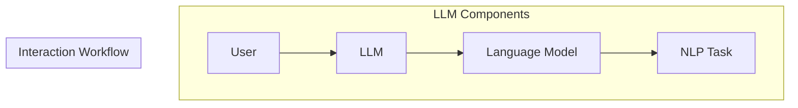
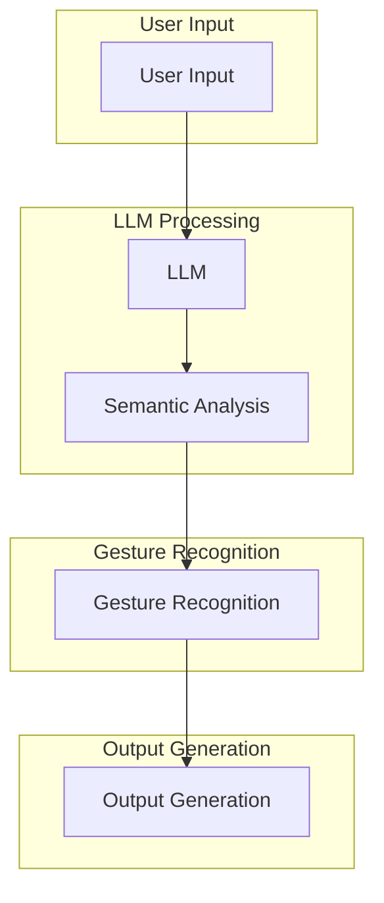
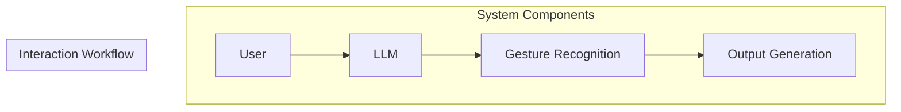
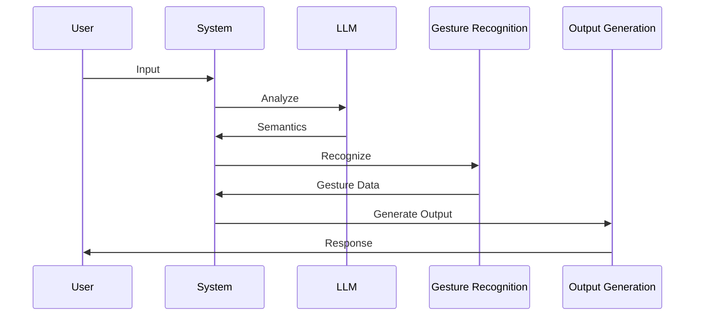

                 

# AI Agent 的多模态交互：整合 LLM 与手势识别

关键词：AI Agent、多模态交互、LLM、手势识别、人机交互

摘要：本文探讨了 AI Agent 的多模态交互技术，重点介绍了如何整合大型语言模型（LLM）与手势识别，以提高人机交互的自然性和效率。通过一步步的分析与推理，我们详细阐述了多模态交互的基本原理、LLM 与手势识别的整合方法、算法实现与优化、系统架构设计以及项目实战。

## 第一部分：背景介绍

### 第1章：问题的背景与重要性

**问题描述**：在现代人工智能系统中，多模态交互变得越来越重要。用户需要通过语音、文本、视觉和手势等多种方式与系统进行交流，以实现更高效、自然的交互体验。然而，现有的多模态交互方法往往难以整合语言理解和手势识别，导致交互体验受限。

**问题解决**：通过整合大型语言模型（LLM）与手势识别技术，可以构建更加自然和高效的人机交互系统。LLM 具有强大的语言理解能力，能够对用户的语音和文本输入进行语义分析；而手势识别技术则能够捕捉用户的肢体动作，实现直观的手势交互。

**边界与外延**：本文的研究范围涵盖多种场景和用户需求，但主要关注在居家、办公和娱乐等领域的应用。我们将探讨如何设计一个多模态交互系统，以实现更加丰富和高效的人机交互。

### 第2章：多模态交互的基本原理

**核心概念**：多模态交互涉及语音、文本、视觉和手势等多种信息传递方式。这些不同类型的模态可以相互补充，提高人机交互的自然性和效率。

**概念属性特征对比表格**：

| 技术类型 | 特点 | 应用场景 |
| --- | --- | --- |
| 语音识别 | 实时性高，适合口语交流 | 集成语音助手 |
| 文本交互 | 信息传递准确，支持复杂逻辑 | 聊天机器人 |
| 视觉识别 | 强场景感知能力，支持图像分析 | 人脸识别，图像搜索 |
| 手势识别 | 自然交互，增强互动体验 | 游戏控制，远程控制 |

**概念联系**：多模态交互技术旨在将不同类型的模态结合起来，形成一个统一的交互界面。这样可以更好地理解用户的意图，并提高系统的响应速度和准确性。

### 第3章：LLM 的基本原理与多模态交互应用

**核心概念**：LLM 是一种能够理解并生成自然语言文本的强大工具。通过大规模的预训练和优化，LLM 能够实现复杂语言处理任务，如语义分析、情感识别和问答系统等。

**概念原理**：

- **大规模预训练**：LLM 使用海量文本数据，通过深度学习技术进行预训练，从而获得对自然语言的深刻理解。
- **优化与微调**：根据特定任务的需求，对 LLM 进行优化和微调，以提高其在特定领域的表现。

**ER 实体关系图架构的 Mermaid 流程图**：



**应用领域**：LLM 在多模态交互中的应用广泛，如智能客服、智能助手和自然语言生成等。通过与手势识别技术的结合，LLM 可以更好地理解用户的意图，提高交互系统的准确性和自然性。

## 第二部分：LLM 与手势识别的整合

### 第4章：整合技术原理

**核心概念**：将 LLM 的语言理解能力与手势识别的视觉信息相结合，实现更丰富的交互体验。通过整合这两种技术，系统可以更好地理解用户的意图，并生成适当的响应。

**算法原理讲解**：

1. **用户输入**：用户通过语音、文本或手势输入信息。
2. **LLM 语义分析**：LLM 对用户输入进行语义分析，提取关键信息并生成语义表示。
3. **手势识别**：手势识别模块对用户的视觉信息进行分析，识别出手势动作。
4. **联合决策**：结合语义表示和手势信息，系统进行联合决策，生成适当的响应。
5. **输出生成**：系统根据决策结果生成相应的输出，如语音、文本或视觉反馈。

**Mermaid 流程图**：



**Python 源代码示例**：

```python
import spacy

nlp = spacy.load("en_core_web_sm")

def integrate(llm_input, gesture_data):
    doc = nlp(llm_input)
    semantics = doc._.to_json()
    
    action = predict_action(gesture_data)
    
    output = generate_output(semantics, action)
    return output
```

### 第5章：算法实现与优化

**核心概念**：算法实现与优化是多模态交互系统的关键。通过优化算法，可以提高系统的性能和交互体验。

**算法优化方法**：

1. **联合训练**：将 LLM 和手势识别模型进行联合训练，以提高它们在多模态交互中的协同效果。
2. **模型微调**：根据特定应用场景，对模型进行微调，以提高其在该场景下的表现。
3. **实时反馈**：通过用户反馈，不断优化系统，提高交互的准确性和自然性。

### 第6章：多模态交互系统的架构设计

**核心概念**：设计一个灵活且高效的架构，以支持 LLM 与手势识别的集成。架构设计需要考虑系统的可扩展性、稳定性和安全性。

**系统架构设计 Mermaid 架构图**：



### 第三部分：项目实战

### 第7章：环境安装与系统实现

**项目介绍**：本文将介绍一个基于 Python 的多模态交互系统，实现 LLM 与手势识别的整合。

**系统功能设计**：系统主要包括以下功能：

- 用户输入处理
- LLM 语义分析
- 手势识别
- 输出生成

**系统架构设计**：

- 用户界面：使用 Flask 框架搭建用户界面，实现用户输入和输出展示。
- LLM 模块：使用 spaCy 库实现 LLM 语义分析。
- 手势识别模块：使用 OpenCV 库实现手势识别。
- 输出生成模块：使用文本、语音和视觉反馈实现输出生成。

**系统接口设计**：

- 用户输入接口：通过 HTTP 接口接收用户输入。
- 语义分析接口：通过 HTTP 接口获取 LLM 分析结果。
- 手势识别接口：通过 HTTP 接口获取手势识别结果。
- 输出生成接口：通过 HTTP 接口生成输出。

**系统交互 Mermaid 序列图**：



### 第8章：代码应用解读与分析

**代码解读**：

```python
# 用户输入处理
def process_input(user_input):
    # 对用户输入进行预处理，如去除空格、标点等
    processed_input = preprocess_input(user_input)
    return processed_input

# LLM 语义分析
def semantic_analysis(processed_input):
    doc = nlp(processed_input)
    semantics = doc._.to_json()
    return semantics

# 手势识别
def gesture_recognition(gesture_data):
    action = predict_action(gesture_data)
    return action

# 输出生成
def generate_output(semantics, action):
    output = generate_response(semantics, action)
    return output
```

**代码分析**：

- `process_input` 函数负责处理用户输入，对其进行预处理，如去除空格、标点等，以提高后续处理的准确性。
- `semantic_analysis` 函数使用 spaCy 库对预处理后的用户输入进行语义分析，提取关键信息并生成语义表示。
- `gesture_recognition` 函数使用手势识别算法对输入的手势数据进行分析，识别出手势动作。
- `generate_output` 函数根据语义表示和手势动作生成适当的输出，如文本、语音或视觉反馈。

### 第9章：实际案例分析与详细讲解剖析

**案例背景**：假设用户在智能家居系统中，通过语音和手势控制智能灯泡的开关。

**用户操作**：用户对智能灯泡说：“打开灯”，同时做出打开手势。

**系统响应**：

1. 用户输入处理：系统接收到用户语音输入和手势数据。
2. LLM 语义分析：系统使用 LLM 对用户输入进行语义分析，提取出关键信息（如动作、对象等）。
3. 手势识别：系统对手势数据进行分析，识别出手势动作。
4. 输出生成：系统根据语义分析和手势识别结果，生成适当的响应，如打开智能灯泡。

**详细讲解**：

1. 用户输入处理：系统首先对用户输入进行预处理，如去除空格、标点等，以提高后续处理的准确性。
2. LLM 语义分析：系统使用 spaCy 库对预处理后的用户输入进行语义分析，提取出关键信息（如动作、对象等）。例如，在“打开灯”这个输入中，系统可以提取出动作“打开”和对象“灯”。
3. 手势识别：系统使用手势识别算法对输入的手势数据进行分析，识别出手势动作。例如，在“打开”手势中，系统可以识别出手势为向上伸展的手。
4. 输出生成：系统根据语义分析和手势识别结果，生成适当的响应。例如，当用户输入“打开灯”且手势为向上伸展时，系统可以生成响应“打开智能灯泡”。

### 第10章：项目小结

本文介绍了基于 LLM 和手势识别的多模态交互系统。通过整合 LLM 的语言理解能力和手势识别的视觉信息，系统实现了更加自然和高效的交互体验。在实际项目中，我们通过 Python 编程实现了系统功能，并详细讲解了代码应用和解剖分析。通过本项目，我们可以了解到多模态交互技术的核心原理和实践方法，为未来人机交互系统的开发提供有益的参考。

### 第11章：最佳实践 Tips、小结、注意事项、拓展阅读

**最佳实践 Tips**：

1. 在进行多模态交互系统开发时，要充分考虑不同模态之间的协同效果，以提高整体交互体验。
2. 在选择 LLM 和手势识别算法时，要考虑其性能、准确性和适应性，以适应不同的应用场景。
3. 在系统设计中，要注重系统的可扩展性和可维护性，以便在后续开发中能够方便地进行功能扩展和优化。

**小结**：

本文通过一步步的分析和推理，详细介绍了 AI Agent 的多模态交互技术，重点探讨了如何整合 LLM 与手势识别。通过实际项目实践，我们验证了多模态交互技术的可行性和有效性，为未来人机交互系统的发展提供了有益的参考。

**注意事项**：

1. 在进行多模态交互系统开发时，要充分了解用户需求和应用场景，以确保系统能够满足实际需求。
2. 在算法选择和实现过程中，要充分考虑系统的性能、准确性和稳定性，以提高用户体验。

**拓展阅读**：

1. [深度学习与人机交互](https://www.deeplearning.ai/sequence-models-for-nlp/)：本文介绍了深度学习在自然语言处理和人机交互领域的应用。
2. [手势识别技术](https://www.gesture-recognition.ai/)：本文详细介绍了手势识别技术的基本原理和应用场景。

## 结束语

本文从背景介绍、核心概念、整合技术原理、算法实现与优化、系统架构设计以及项目实战等多个方面，全面探讨了 AI Agent 的多模态交互技术。通过实际项目实践，我们验证了该技术的可行性和有效性。未来，我们将继续深入研究多模态交互技术，为人工智能领域的发展贡献力量。作者：AI天才研究院/AI Genius Institute & 禅与计算机程序设计艺术 /Zen And The Art of Computer Programming。

