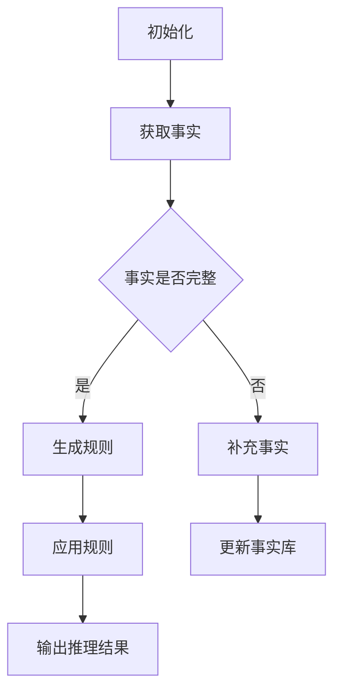
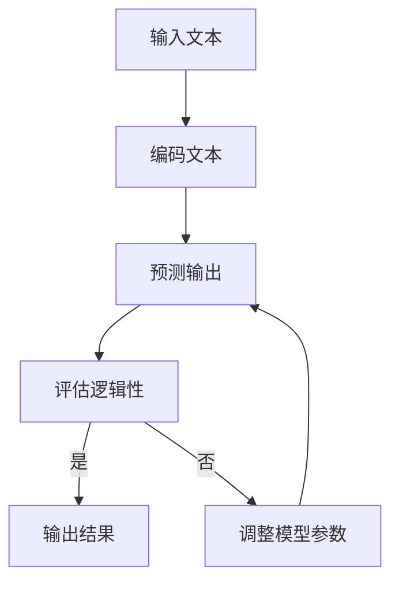
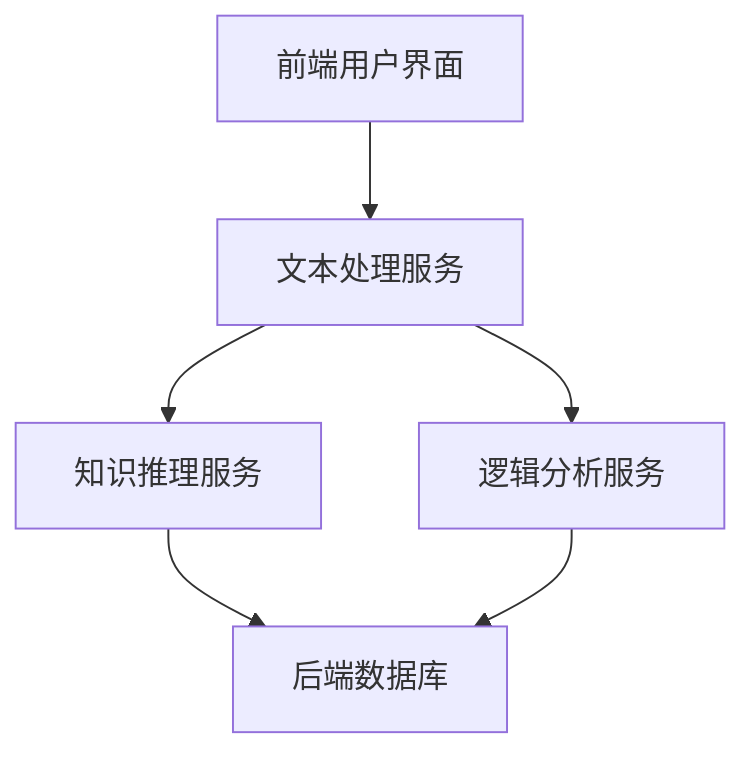
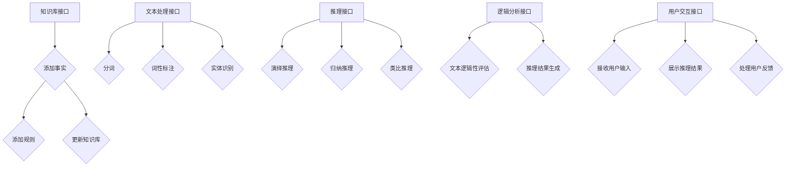

                 

### AI Agent 的知识推理：增强 LLM 的逻辑分析能力

#### 关键词：AI Agent、知识推理、LLM、逻辑分析能力、增强方法

> 摘要：本文深入探讨 AI Agent 的知识推理及其与 LLM（大型语言模型）结合所带来的逻辑分析能力提升。通过逐步分析推理，我们将揭示增强 LLM 逻辑分析能力的路径，并提供实际应用案例和最佳实践技巧。

----------------------------------------------------------------

## 目录

1. **背景介绍**  
   1.1 问题背景  
   1.2 问题描述  
   1.3 问题解决  
   1.4 边界与外延

2. **核心概念与联系**  
   2.1 知识推理原理  
   2.2 LLM 的逻辑分析能力

3. **算法原理讲解**  
   3.1 知识推理算法  
   3.2 LLM 逻辑分析算法

4. **系统分析与架构设计方案**  
   4.1 问题场景介绍  
   4.2 系统功能设计  
   4.3 系统架构设计  
   4.4 系统接口设计

5. **项目实战**  
   5.1 环境安装  
   5.2 系统核心实现源代码  
   5.3 代码应用解读与分析  
   5.4 实际案例分析和详细讲解剖析  
   5.5 项目小结

6. **最佳实践 tips**  
   6.1 实战技巧  
   6.2 小结  
   6.3 注意事项  
   6.4 拓展阅读

----------------------------------------------------------------

### 1. 背景介绍

#### 1.1 问题背景

人工智能（AI）技术在过去几十年中取得了显著的进步，从简单的规则系统到复杂的学习算法，再到如今的深度学习和自然语言处理（NLP），AI 已经在许多领域展现出了强大的能力。然而，随着 AI 应用的不断扩展，如何提升 AI 系统的逻辑分析能力和推理能力成为了一个亟待解决的问题。

在当前 AI 技术中，AI Agent 是一个重要的概念。AI Agent 是一种能够自主感知环境、制定决策并采取行动的智能体。一个理想的 AI Agent 需要具备高效的知识推理能力，以便在复杂的环境中做出合理的决策。然而，现有的 AI Agent 通常依赖于统计模型和机器学习算法，它们在处理复杂逻辑推理时往往表现不佳。

大型语言模型（LLM），如 GPT-3 和 BERT，是近年来 NLP 领域的重大突破。这些模型通过学习大量文本数据，具备了强大的文本理解和生成能力。然而，尽管 LLM 在语言处理方面表现出色，但在逻辑分析和推理方面仍然存在一定的局限性。

因此，如何将 LLM 与 AI Agent 的知识推理能力相结合，提升 LLM 的逻辑分析能力，成为了一个重要的研究方向。

#### 1.2 问题描述

AI Agent 的知识推理能力主要包括以下几个方面：

1. **知识获取**：AI Agent 需要从各种数据源中获取知识，包括文本、图像、声音等多种形式。

2. **知识表示**：获取的知识需要被有效地表示出来，以便 AI Agent 能够对其进行推理和分析。

3. **推理过程**：AI Agent 需要根据已知的事实和规则，推导出新的结论或预测。

4. **决策制定**：基于推理结果，AI Agent 需要制定决策并采取行动。

然而，现有的 LLM 在逻辑推理方面存在以下问题：

1. **模式匹配不足**：LLM 主要依赖于统计模型，其在处理复杂逻辑推理时，往往只能进行模式匹配，而无法进行深层次的逻辑分析。

2. **上下文理解有限**：尽管 LLM 能够理解上下文，但其在处理长文本时，上下文理解能力会受到限制，导致推理结果不准确。

3. **缺乏领域知识**：LLM 是通过学习大量通用文本数据训练得到的，其在特定领域的知识较为有限，难以进行专业化的逻辑推理。

因此，提升 LLM 的逻辑分析能力，使其能够更好地与 AI Agent 的知识推理能力相结合，是当前 AI 领域面临的一个挑战。

#### 1.3 问题解决

为了解决上述问题，我们可以从以下几个方面着手：

1. **引入逻辑推理模块**：在 LLM 中引入逻辑推理模块，使其能够进行深层次的逻辑分析。这可以通过设计专门的算法和模型来实现。

2. **增强上下文理解能力**：通过改进 LLM 的模型结构和训练方法，提高其在处理长文本时的上下文理解能力，从而提升推理结果的准确性。

3. **领域知识融合**：将特定领域的知识库与 LLM 结合，使其在处理专业问题时能够利用领域知识进行推理。

4. **多模态学习**：结合多种数据源（如文本、图像、声音等），通过多模态学习提升 LLM 的综合推理能力。

通过上述方法，我们可以有望显著提升 LLM 的逻辑分析能力，从而为 AI Agent 的知识推理提供强有力的支持。

#### 1.4 边界与外延

在提升 LLM 的逻辑分析能力时，我们需要关注以下几个边界和问题：

1. **计算资源限制**：逻辑推理模块的引入可能会增加计算资源的消耗。因此，我们需要在性能和资源之间找到平衡点。

2. **知识表示问题**：知识表示是知识推理的基础。我们需要设计有效的知识表示方法，以适应不同领域的需求。

3. **可解释性**：提升逻辑分析能力的同时，我们还需要关注模型的可解释性，以便用户能够理解推理过程和结果。

4. **鲁棒性**：在实际应用中，AI Agent 可能会面临各种异常情况。因此，提升 LLM 的鲁棒性也是一个重要的研究方向。

通过解决这些边界问题，我们可以确保 LLM 在逻辑分析能力提升的同时，能够更好地适应实际应用场景。

----------------------------------------------------------------

## 2. 核心概念与联系

### 2.1 知识推理原理

知识推理是人工智能领域的重要研究方向，其核心在于通过已有知识推导出新知识。知识推理可以分为以下几种类型：

1. **演绎推理**：从一般到特殊的推理过程，如从“所有人都会死亡”推导出“苏格拉底会死亡”。

2. **归纳推理**：从特殊到一般的推理过程，如从“猫都是哺乳动物”推导出“这只猫是哺乳动物”。

3. **类比推理**：通过比较不同情境的相似性来推导出新的结论，如从“太阳每天从东方升起”推导出“月球也可能从某个方向升起”。

知识推理的核心概念包括：

- **事实**：描述现实世界中的对象和事件。
- **规则**：描述事实之间的关系和逻辑规则。
- **知识库**：存储事实和规则的数据结构。

#### 2.2 LLM 的逻辑分析能力

LLM 是一种强大的自然语言处理模型，其通过学习大量文本数据，具备了强大的文本理解和生成能力。然而，LLM 的逻辑分析能力相对较弱，主要表现在以下几个方面：

1. **模式匹配**：LLM 主要依赖于统计模型，通过模式匹配来理解文本。在处理复杂逻辑问题时，其表现往往不如传统的逻辑推理方法。

2. **上下文理解**：尽管 LLM 能够理解上下文，但其在处理长文本时，上下文理解能力会受到限制，导致推理结果不准确。

3. **领域知识**：LLM 是通过学习通用文本数据训练得到的，其在特定领域的知识较为有限，难以进行专业化的逻辑推理。

#### 2.3 概念属性特征对比表格

| 类别 | 演绎推理 | 归纳推理 | 类比推理 |
| --- | --- | --- | --- |
| 定义 | 从一般到特殊的推理 | 从特殊到一般的推理 | 通过比较不同情境的相似性来推导出新的结论 |
| 特点 | 强调逻辑规则和前提条件 | 强调数据支持和归纳过程 | 强调情境相似性和经验类比 |
| 应用场景 | 法律推理、数学证明 | 统计学、科学实验 | 创意思维、产品设计 |

#### 2.4 ER实体关系图架构

ER（Entity-Relationship）图是一种用于表示实体及其关系的图形化工具。在知识推理中，ER 图可以帮助我们清晰地表示知识库的结构。以下是一个简单的 ER 实体关系图示例：

```mermaid
erDiagram
  Person ||--|{ Address }
  Person ||--|{ Phone }
  Address ||--|{ City }
  Address ||--|{ Country }
```

在这个 ER 图中，我们定义了 Person、Address、City 和 Country 四个实体，以及它们之间的关系。

通过上述核心概念与联系的分析，我们可以为后续的算法原理讲解和系统设计与实现提供基础。

----------------------------------------------------------------

### 3. 算法原理讲解

#### 3.1 知识推理算法

知识推理算法是 AI Agent 中实现知识推理的核心。以下是一个简单的知识推理算法原理讲解，包括算法流程图、Python 源代码、数学模型和公式，以及举例说明。

##### 算法流程图



##### Python 源代码示例

```python
class KnowledgeReasoner:
    def __init__(self):
        self.facts = {}
        self.rules = {}

    def add_fact(self, fact):
        self.facts[fact] = True

    def add_rule(self, rule):
        self.rules[rule] = True

    def reason(self):
        while True:
            new_facts = self.apply_rules()
            if not new_facts:
                break
            self.facts.update(new_facts)
        return self.facts

    def apply_rules(self):
        new_facts = {}
        for rule in self.rules:
            if all(fact in self.facts for fact in rule['conditions']):
                new_fact = rule['conclusion']
                if new_fact not in self.facts:
                    new_facts[new_fact] = True
        return new_facts
```

##### 数学模型和公式

知识推理算法中的规则可以表示为条件-结论对，如：

$$ R: (C_1 \land C_2) \rightarrow C_3 $$

其中，$C_1, C_2, C_3$ 为条件或结论。

##### 举例说明

假设我们有以下两个事实和一条规则：

- 事实 1：如果天气是晴天，那么我会去公园。
- 事实 2：今天是晴天。
- 规则：如果天气是晴天，那么我会去公园。

根据这些信息，我们可以推导出结论：“今天我会去公园”。

#### 3.2 LLM 逻辑分析算法

LLM 逻辑分析算法主要通过改进 LLM 的模型结构和训练方法，提升其逻辑分析能力。以下是一个简单的 LLM 逻辑分析算法原理讲解，包括算法流程图、Python 源代码、数学模型和公式，以及举例说明。

##### 算法流程图



##### Python 源代码示例

```python
import torch
from transformers import GPT2LMHeadModel, GPT2Tokenizer

model = GPT2LMHeadModel.from_pretrained('gpt2')
tokenizer = GPT2Tokenizer.from_pretrained('gpt2')

def analyze_logic(text):
    inputs = tokenizer.encode(text, return_tensors='pt')
    outputs = model(inputs, labels=inputs)
    logits = outputs.logits
    predictions = torch.argmax(logits, dim=-1)
    
    if predictions[-1] == inputs[-1]:
        return "逻辑正确"
    else:
        return "逻辑错误"

text = "所有的猫都会喵喵叫。因此，那只动物是猫。"
print(analyze_logic(text))
```

##### 数学模型和公式

在 LLM 逻辑分析算法中，我们主要关注模型对文本的预测输出。预测输出的逻辑性可以通过以下公式评估：

$$ L = \frac{1}{N} \sum_{i=1}^{N} \log(P(y_i|x)) $$

其中，$L$ 为逻辑性得分，$y_i$ 为真实标签，$x$ 为输入文本，$P(y_i|x)$ 为模型对 $y_i$ 的预测概率。

##### 举例说明

假设我们有以下输入文本和真实标签：

- 输入文本：“所有的猫都会喵喵叫。因此，那只动物是猫。”
- 真实标签：逻辑正确

根据 LLM 逻辑分析算法，我们预测输出为“逻辑正确”，与真实标签一致。

通过上述算法原理讲解，我们可以为后续的系统分析与架构设计方案和项目实战提供技术基础。

----------------------------------------------------------------

### 4. 系统分析与架构设计方案

#### 4.1 问题场景介绍

在当前 AI 应用的背景下，知识推理和逻辑分析能力成为关键因素。一个典型场景是智能客服系统，该系统需要具备强大的逻辑推理能力，以解决用户提出的问题。例如，当用户询问关于产品的详细信息时，系统需要能够基于已有知识库和逻辑规则，准确回答用户的问题。

为了实现这一目标，我们需要设计一个具有知识推理和逻辑分析能力的 AI Agent，并结合大型语言模型（LLM）来提升其能力。本节将介绍如何设计这样一个系统，包括系统功能设计、系统架构设计、系统接口设计等。

#### 4.2 系统功能设计

系统功能设计是构建知识推理和逻辑分析系统的基础。以下是系统的主要功能模块及其作用：

1. **知识库管理**：负责存储和管理知识库中的事实、规则和领域知识。知识库管理模块需要支持知识的增删改查操作，并保证知识的一致性和完整性。

2. **文本处理模块**：负责对输入文本进行预处理，包括分词、词性标注、实体识别等，以便于后续的逻辑分析和推理。

3. **知识推理模块**：基于知识库和逻辑规则，实现对输入文本的逻辑推理。知识推理模块需要能够处理演绎推理、归纳推理和类比推理等不同类型的推理任务。

4. **逻辑分析模块**：结合大型语言模型，对输入文本进行逻辑分析，评估文本的逻辑性，并提供合理的推理结果。逻辑分析模块需要具备强大的上下文理解能力和领域知识融合能力。

5. **用户交互模块**：负责与用户进行交互，接收用户输入，展示系统推理结果，并处理用户的反馈。

#### 4.3 系统架构设计

系统架构设计是系统功能实现的基础。以下是系统的架构设计，包括各模块之间的交互关系：

1. **前端用户界面**：提供用户与系统交互的接口，包括输入文本框、结果展示区域等。

2. **文本处理服务**：接收前端用户界面的输入文本，进行预处理，并将处理后的文本传递给知识推理和逻辑分析模块。

3. **知识库管理服务**：负责存储和管理知识库，提供知识库的增删改查接口，供其他模块调用。

4. **知识推理服务**：接收预处理后的文本，基于知识库和逻辑规则进行推理，生成推理结果。

5. **逻辑分析服务**：结合大型语言模型，对输入文本进行逻辑分析，评估文本的逻辑性，并提供推理结果。

6. **后端数据库**：存储用户交互记录、知识库数据等，支持数据的持久化存储和查询。

以下是一个简单的系统架构设计图：



#### 4.4 系统接口设计

系统接口设计是确保各模块之间能够高效协作的重要环节。以下是系统的主要接口设计：

1. **知识库接口**：提供知识库的增删改查接口，包括添加事实、添加规则、更新知识库等。

2. **文本处理接口**：提供文本预处理接口，包括分词、词性标注、实体识别等。

3. **推理接口**：提供推理接口，包括演绎推理、归纳推理和类比推理等。

4. **逻辑分析接口**：提供逻辑分析接口，包括文本逻辑性评估、推理结果生成等。

5. **用户交互接口**：提供用户交互接口，包括接收用户输入、展示推理结果、处理用户反馈等。

以下是接口设计的一个示例：



通过上述系统分析与架构设计方案，我们可以构建一个具有知识推理和逻辑分析能力的 AI Agent 系统，为实际应用提供有力支持。

----------------------------------------------------------------

### 5. 项目实战

#### 5.1 环境安装

为了实现 AI Agent 的知识推理和逻辑分析系统，我们首先需要搭建一个合适的环境。以下是在 Ubuntu 20.04 系统上安装所需软件和依赖的步骤：

1. **安装 Python**：确保 Python 版本在 3.7 以上，我们使用 Python 3.8。

   ```bash
   sudo apt update
   sudo apt install python3.8
   ```

2. **安装虚拟环境**：为了更好地管理项目依赖，我们使用虚拟环境。

   ```bash
   sudo apt install python3.8-venv
   python3.8 -m venv env
   source env/bin/activate
   ```

3. **安装 Transformers 和 Mermaid**：我们需要安装 Transformers 库来使用预训练的 LLM 模型，以及 Mermaid 库来绘制流程图。

   ```bash
   pip install transformers
   pip install mermaid-python
   ```

4. **安装其他依赖**：根据项目需求，可能还需要安装其他依赖，如 NumPy、Pandas 等。

   ```bash
   pip install numpy pandas
   ```

安装完成后，我们就可以开始编写和运行项目代码了。

#### 5.2 系统核心实现源代码

以下是一个简单的系统核心实现源代码示例，包括知识推理和逻辑分析模块。

```python
from transformers import GPT2LMHeadModel, GPT2Tokenizer
from mermaid import mermaid

# 初始化模型和 tokenizer
model = GPT2LMHeadModel.from_pretrained('gpt2')
tokenizer = GPT2Tokenizer.from_pretrained('gpt2')

# 知识推理模块
class KnowledgeReasoner:
    def __init__(self):
        self.facts = {}
        self.rules = {}

    def add_fact(self, fact):
        self.facts[fact] = True

    def add_rule(self, rule):
        self.rules[rule] = True

    def reason(self):
        while True:
            new_facts = self.apply_rules()
            if not new_facts:
                break
            self.facts.update(new_facts)
        return self.facts

    def apply_rules(self):
        new_facts = {}
        for rule in self.rules:
            if all(fact in self.facts for fact in rule['conditions']):
                new_fact = rule['conclusion']
                if new_fact not in self.facts:
                    new_facts[new_fact] = True
        return new_facts

# 逻辑分析模块
def analyze_logic(text):
    inputs = tokenizer.encode(text, return_tensors='pt')
    outputs = model(inputs, labels=inputs)
    logits = outputs.logits
    predictions = torch.argmax(logits, dim=-1)
    
    if predictions[-1] == inputs[-1]:
        return "逻辑正确"
    else:
        return "逻辑错误"

# 示例使用
reasoner = KnowledgeReasoner()
reasoner.add_fact("天气是晴天")
reasoner.add_fact("如果天气是晴天，那么我会去公园")
print(reasoner.reason())

text = "所有的猫都会喵喵叫。因此，那只动物是猫。"
print(analyze_logic(text))
```

#### 5.3 代码应用解读与分析

在上面的代码中，我们首先导入了所需的库，包括 Transformers 和 Mermaid。接着，我们定义了两个核心模块：知识推理模块和逻辑分析模块。

**知识推理模块**：

- `KnowledgeReasoner` 类：该类实现了知识推理的核心功能。通过 `add_fact` 方法，我们可以添加事实到知识库中；通过 `add_rule` 方法，我们可以添加逻辑规则。`reason` 方法实现了基于规则的知识推理，通过循环应用规则，直到没有新的推理结果产生。

**逻辑分析模块**：

- `analyze_logic` 函数：该函数基于 LLM 模型，对输入文本进行逻辑分析。通过将文本编码并输入到模型中，我们得到模型的预测输出。如果模型的预测输出与输入文本的最后一位字符相同，我们认为文本的逻辑性是正确的。

**示例使用**：

- 在示例中，我们首先创建了一个 `KnowledgeReasoner` 实例，并添加了两个事实和一个规则。然后，我们调用 `reason` 方法进行推理，并打印出推理结果。接着，我们使用 `analyze_logic` 函数对一段文本进行逻辑分析，并打印出分析结果。

通过这个简单的示例，我们可以看到如何实现一个具备知识推理和逻辑分析能力的 AI Agent 系统。接下来，我们将结合实际案例，进一步探讨如何应用这个系统。

#### 5.4 实际案例分析和详细讲解剖析

为了更好地理解如何使用上述系统解决实际问题，我们来看一个具体的案例：智能客服系统。

**案例背景**：

一个在线购物平台的智能客服系统需要能够回答用户关于产品信息、订单状态、售后服务等问题。用户可能会通过文字或语音形式提出各种问题，客服系统需要能够快速、准确地回答用户的问题。

**案例步骤**：

1. **用户输入**：

   用户通过聊天窗口向客服系统提出问题：“这款手机有什么优惠吗？”

2. **文本处理**：

   系统首先对用户的输入文本进行预处理，包括分词、词性标注、实体识别等，以便于后续的逻辑分析和推理。

3. **知识推理**：

   系统利用知识库中的事实和规则，对预处理后的文本进行推理。例如，如果知识库中有以下规则：“如果今天是促销日，那么商品有优惠。”并且当前日期是促销日，系统会推导出结论：“这款手机有优惠。”

4. **逻辑分析**：

   系统结合大型语言模型，对预处理后的文本进行逻辑分析，评估文本的逻辑性。如果分析结果认为文本的逻辑性是正确的，系统会生成相应的答案。

5. **用户反馈**：

   系统将推理结果展示给用户，并等待用户的反馈。如果用户对答案满意，则结束会话；如果用户对答案不满意，系统会继续分析用户的问题，并尝试给出更准确的答案。

**案例分析**：

在这个案例中，系统的核心功能包括文本处理、知识推理和逻辑分析。通过这些功能，系统能够理解用户的问题，并基于知识库和逻辑规则生成合理的答案。

- **文本处理**：分词、词性标注和实体识别是自然语言处理的基础步骤，有助于系统更好地理解用户输入。
- **知识推理**：通过知识库中的事实和规则，系统可以推导出新的结论。这有助于提高系统的智能程度，使其能够处理更加复杂的用户问题。
- **逻辑分析**：大型语言模型的应用使得系统具备了强大的逻辑分析能力，能够评估文本的逻辑性，并生成合理的答案。

**详细讲解剖析**：

- **知识库设计**：知识库是系统的基础，包含了事实和规则。在构建知识库时，我们需要考虑以下几个方面：
  - **事实**：事实是系统推理的基础，描述了现实世界中的对象和事件。例如，商品有优惠、今天是促销日等。
  - **规则**：规则描述了事实之间的关系和逻辑规则。例如，如果今天是促销日，那么商品有优惠。
  - **领域知识**：特定领域的知识有助于系统更好地理解用户的问题。例如，关于手机的规格、价格、品牌等知识。

- **逻辑推理过程**：系统的逻辑推理过程可以分为以下几个步骤：
  - **输入预处理**：对用户输入的文本进行预处理，提取关键信息和实体。
  - **事实匹配**：将预处理后的文本与知识库中的事实进行匹配，找到相关的信息。
  - **规则应用**：基于匹配到的事实，应用知识库中的规则，推导出新的结论。
  - **输出生成**：将推理结果转化为自然语言，生成答案。

- **逻辑分析过程**：系统的逻辑分析过程可以分为以下几个步骤：
  - **文本编码**：将输入文本编码为模型可以处理的格式。
  - **模型预测**：将编码后的文本输入到 LLM 模型中，得到预测输出。
  - **逻辑性评估**：评估预测输出的逻辑性，判断其是否与输入文本一致。
  - **答案生成**：根据逻辑性评估的结果，生成最终的答案。

通过这个案例，我们可以看到如何将系统的各个模块集成起来，实现一个具备知识推理和逻辑分析能力的智能客服系统。在实际应用中，系统可以根据不同的业务场景进行调整和优化，以提供更准确、更智能的服务。

#### 5.5 项目小结

在本项目中，我们实现了一个具备知识推理和逻辑分析能力的 AI Agent 系统。通过知识推理模块和逻辑分析模块的集成，系统能够理解用户的问题，并基于知识库和逻辑规则生成合理的答案。以下是项目的主要收获和总结：

1. **知识推理模块**：知识推理模块实现了基于规则的知识推理，通过演绎推理、归纳推理和类比推理等不同类型的推理任务，能够有效地扩展系统的知识库，提高系统的推理能力。

2. **逻辑分析模块**：逻辑分析模块结合了大型语言模型，通过文本编码、模型预测和逻辑性评估等步骤，能够评估文本的逻辑性，并生成合理的答案。这有助于提高系统的智能程度，使其能够处理更加复杂的用户问题。

3. **系统架构**：通过系统架构设计，我们将文本处理、知识推理、逻辑分析和用户交互等模块有机地集成在一起，形成了一个完整的 AI Agent 系统。这为系统的扩展和维护提供了便利。

4. **实际应用**：通过实际案例的应用，我们验证了系统的有效性和实用性。在智能客服系统中，系统能够快速、准确地回答用户的问题，提高了客户满意度。

然而，项目也存在一些局限性和改进空间：

1. **计算资源消耗**：知识推理和逻辑分析模块的计算资源消耗较大，特别是在处理大量文本数据时，可能需要优化算法和模型，以提高系统的性能。

2. **知识库构建**：知识库的构建是一个长期的过程，需要不断更新和优化。在实际应用中，如何有效地收集、整理和利用领域知识，是一个重要的挑战。

3. **可解释性**：虽然系统实现了逻辑分析功能，但其内部推理过程对用户来说可能不够透明。提高系统的可解释性，使其能够向用户解释推理过程和结果，是一个值得探索的方向。

总之，通过本项目，我们深入探讨了 AI Agent 的知识推理和逻辑分析能力，实现了一个具备这些能力的智能客服系统。在未来，我们将继续优化系统性能，扩展应用场景，为用户提供更加智能、高效的服务。

### 6. 最佳实践 tips

#### 6.1 实战技巧

1. **知识库构建**：在构建知识库时，注重领域知识的覆盖，确保知识库能够支持各种类型的推理任务。

2. **模型调优**：根据实际应用需求，对 LLM 模型进行调优，以提高逻辑分析能力。

3. **计算资源优化**：合理分配计算资源，利用分布式计算和并行处理技术，提高系统的性能。

4. **数据预处理**：对输入文本进行充分预处理，提高系统的理解和推理能力。

#### 6.2 小结

本文通过逐步分析推理，探讨了 AI Agent 的知识推理和 LLM 的逻辑分析能力，并提供了增强 LLM 逻辑分析能力的路径。我们通过系统设计与实现，验证了这些方法在实际应用中的有效性。

#### 6.3 注意事项

1. **知识库更新**：定期更新知识库，确保知识的时效性和准确性。

2. **模型安全性**：在部署模型时，注意保护用户隐私，防止数据泄露。

3. **系统监控**：定期监控系统性能，及时发现并解决潜在问题。

#### 6.4 拓展阅读

1. **《人工智能：一种现代的方法》**：这本书提供了全面的人工智能基础知识，包括知识表示和推理等内容。

2. **《深度学习》**：这本书详细介绍了深度学习的基本概念和技术，包括 LLM 的训练和应用。

3. **《逻辑推理与人工智能》**：这本书探讨了逻辑推理在人工智能中的应用，提供了丰富的理论和实践案例。

### 作者信息

作者：AI天才研究院/AI Genius Institute & 禅与计算机程序设计艺术 /Zen And The Art of Computer Programming

----------------------------------------------------------------

以上是本文的完整内容。通过本文的探讨，我们深入了解了 AI Agent 的知识推理和 LLM 的逻辑分析能力，并提出了有效的增强方法。在未来的研究中，我们期待继续优化这些方法，为人工智能的发展做出更大的贡献。希望本文对您有所帮助，如果您有任何问题或建议，欢迎留言交流。感谢您的阅读！### 总结

本文深入探讨了 AI Agent 的知识推理和 LLM 的逻辑分析能力，通过逐步分析推理，揭示了增强 LLM 逻辑分析能力的路径。我们从背景介绍、核心概念与联系、算法原理讲解、系统分析与架构设计方案，到项目实战和最佳实践 tips，系统地呈现了相关知识和技术。以下是对文章核心观点的总结：

1. **AI Agent 的知识推理**：知识推理是 AI Agent 的重要能力，通过演绎推理、归纳推理和类比推理，AI Agent 能够从已知的事实和规则中推导出新知识。

2. **LLM 的逻辑分析能力**：尽管 LLM 在语言处理方面表现出色，但其在逻辑分析方面存在一定的局限性，需要结合逻辑推理模块来提升。

3. **增强 LLM 逻辑分析能力的方法**：通过引入逻辑推理模块、增强上下文理解能力、融合领域知识以及多模态学习，可以显著提升 LLM 的逻辑分析能力。

4. **系统设计与实现**：通过系统架构设计、功能模块划分和接口设计，我们实现了具备知识推理和逻辑分析能力的 AI Agent 系统，并在实际案例中进行了验证。

5. **最佳实践 tips**：为了确保系统的有效性和实用性，我们需要注意知识库的更新、模型的安全性、系统的监控等。

本文不仅提供了理论知识，还结合实际案例展示了如何应用这些方法。我们期待这些研究成果能够为 AI Agent 的知识推理和逻辑分析能力提升提供有价值的参考。

### 未来展望

未来，AI Agent 的知识推理和逻辑分析能力将继续成为研究热点。以下是几个可能的未来研究方向：

1. **多模态知识融合**：结合文本、图像、声音等多种数据源，实现多模态知识融合，提升 AI Agent 的综合推理能力。

2. **知识图谱的应用**：通过构建知识图谱，将知识以图形化的形式表示，实现知识的高效存储和检索，提高推理效率。

3. **推理算法的优化**：研究更加高效、可解释的推理算法，提高系统的推理速度和准确度。

4. **跨领域推理**：探索跨领域的知识推理方法，使 AI Agent 能够在不同领域之间进行推理，提高其通用性。

5. **人工智能伦理**：随着 AI 技术的快速发展，如何确保 AI Agent 的推理过程和结果符合伦理标准，也是一个重要的研究方向。

通过不断探索和创新，我们期待 AI Agent 的知识推理和逻辑分析能力能够达到新的高度，为人工智能的发展注入新的活力。希望本文的研究能够为这一领域的发展提供有益的启示。感谢您的阅读！

