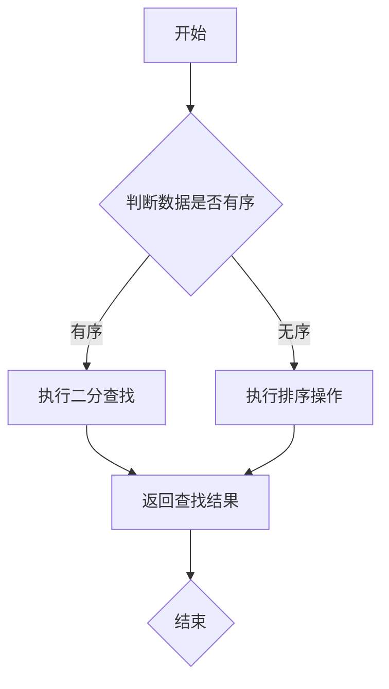

                 

# AI Agent 的知识检索增强：结合 LLM 与高效搜索算法

关键词：AI代理、知识检索、语言模型、搜索算法、高效优化

摘要：本文旨在探讨AI代理的知识检索增强技术，重点介绍如何结合语言模型（LLM）与高效搜索算法来提升AI代理的智能水平和数据处理能力。文章首先介绍了AI代理的概念和知识检索增强的重要性，随后详细阐述了LLM和高效搜索算法的基本原理和优化方法，并通过实际项目实战展示了知识检索增强在AI代理中的应用效果。最后，文章总结了最佳实践技巧和未来展望，为AI代理的知识检索增强技术提供指导。

----------------------------------------------------------------

## 第一部分: AI Agent 的知识检索增强概述

### 第1章: 问题背景与核心概念

#### 1.1.1 人工智能代理的定义与功能

人工智能代理（AI Agent）是一种基于人工智能技术自主行动的实体，能够在复杂环境中感知环境信息、制定决策并执行行动。AI代理在诸多领域具有广泛应用，如自动驾驶、智能家居、智能客服等。其核心功能包括感知、推理、决策和行动四个方面。

#### 1.1.2 知识检索增强在AI代理中的重要性

知识检索增强是提升AI代理智能水平的关键技术。在复杂环境中，AI代理需要迅速获取和处理大量知识信息，以支持推理、决策和行动。知识检索增强能够提高AI代理的知识获取效率、准确性和全面性，从而提升其在实际应用场景中的表现。

#### 1.1.3 长期记忆与知识检索的关系

长期记忆是AI代理的重要组成部分，负责存储和检索知识信息。知识检索增强技术能够优化长期记忆的结构和功能，使其在复杂环境中具备更强的知识获取和处理能力。同时，长期记忆与知识检索的协同工作，有助于实现AI代理的持续学习和进化。

#### 1.1.4 LLM与高效搜索算法的结合

语言模型（LLM）和高效搜索算法是知识检索增强技术的两大核心组成部分。LLM具有强大的语言理解和生成能力，能够提高知识检索的准确性和全面性。高效搜索算法则能够优化知识检索的速度和性能，实现快速、高效的知识获取。将LLM与高效搜索算法相结合，可以实现AI代理知识检索能力的全面提升。

----------------------------------------------------------------

### 第2章: LLM的基本原理

#### 2.1.1 语言模型的发展历史

语言模型是自然语言处理（NLP）领域的重要研究方向。自20世纪50年代以来，语言模型经历了从规则驱动到统计模型，再到深度学习模型的演变。早期的语言模型主要基于规则和形式语言理论，如上下文无关文法（CFG）和上下文相关文法（CFG*）。随着计算能力和数据资源的不断提升，统计模型如N-gram模型、神经网络模型和深度学习模型逐渐成为主流。

#### 2.1.2 LLM的核心架构

语言模型的核心架构通常包括输入层、隐藏层和输出层。输入层接收自然语言文本，隐藏层通过复杂的非线性变换提取文本特征，输出层生成预测的文本序列。常见的LLM架构包括循环神经网络（RNN）、长短时记忆网络（LSTM）和Transformer模型等。

#### 2.1.3 LLM的训练过程

LLM的训练过程主要包括数据预处理、模型训练和参数优化三个阶段。数据预处理阶段涉及文本清洗、分词、词向量化等操作。模型训练阶段采用梯度下降等优化算法，通过大量语料库进行训练，优化模型参数。参数优化阶段通过模型评估和调整，进一步提高模型性能。

#### 2.1.4 LLM的性能评估

LLM的性能评估主要包括预测准确率、生成文本的质量和模型的可扩展性等方面。常用的评估指标包括损失函数、交叉熵、Perplexity等。同时，通过人工评估和自动化评估工具，对生成文本的流畅性、一致性和合理性进行综合评价。

#### 2.1.5 LLM的应用场景

LLM在自然语言处理领域具有广泛的应用场景，如机器翻译、文本生成、对话系统、文本分类等。在AI代理中，LLM可用于知识检索、问答系统、智能客服等场景，提升代理的语言理解和表达能力。

----------------------------------------------------------------

### 第3章: 高效搜索算法介绍

#### 3.1.1 搜索算法的基本概念

搜索算法是用于在给定数据集合中查找特定信息的算法。根据搜索策略的不同，搜索算法可以分为精确搜索算法和近似搜索算法。精确搜索算法如二分查找、哈希查找等，能够保证在有限时间内找到精确匹配的结果。近似搜索算法如贪婪算法、A*算法等，能够在时间复杂度和准确度之间取得平衡。

#### 3.1.2 常见搜索算法比较

常见的搜索算法包括二分查找、深度优先搜索（DFS）、广度优先搜索（BFS）、A*算法等。二分查找具有较低的搜索时间复杂度，但需要数据有序。DFS和BFS具有较低的存储空间复杂度，但搜索时间复杂度较高。A*算法结合了启发式搜索和贪心算法，能够在近似搜索中实现最优解。

#### 3.1.3 高效搜索算法的优势

高效搜索算法具有以下优势：

1. 快速搜索：在有限时间内找到所需信息，提高搜索效率。
2. 低存储空间：减少存储空间需求，降低系统负担。
3. 高准确度：在近似搜索中实现最优解，提高搜索结果的准确性。
4. 易扩展：适用于多种数据结构和算法框架，具有较好的可扩展性。

#### 3.1.4 高效搜索算法的应用场景

高效搜索算法广泛应用于各种应用场景，如数据库查询、搜索引擎、推荐系统、自然语言处理等。在AI代理中，高效搜索算法可用于知识图谱构建、问答系统、智能推荐等场景，提升代理的数据处理和搜索能力。

----------------------------------------------------------------

## 第二部分: 知识检索增强的方法与实现

### 第4章: 知识图谱构建与维护

#### 4.1.1 知识图谱的基本概念

知识图谱是一种语义网络，用于表示实体、属性和关系之间的语义关系。知识图谱由实体、属性和关系三个核心要素组成，能够实现对大规模知识的结构化表示和高效检索。

#### 4.1.2 知识图谱的构建方法

知识图谱的构建方法主要包括知识抽取、知识融合和知识表示等步骤。知识抽取是从非结构化数据中提取实体、属性和关系的过程。知识融合是将不同来源的知识进行整合，消除冗余和冲突。知识表示是将知识图谱表示为计算机可处理的格式，如RDF、OWL等。

#### 4.1.3 知识图谱的维护策略

知识图谱的维护策略包括数据更新、错误纠正和一致性维护等。数据更新是确保知识图谱中的数据保持最新状态。错误纠正是在知识图谱中发现和修复错误。一致性维护是确保知识图谱中的实体、属性和关系之间的一致性和完整性。

#### 4.1.4 知识图谱的应用场景

知识图谱在自然语言处理、智能推荐、问答系统、知识图谱推理等领域具有广泛应用。在AI代理中，知识图谱可用于知识检索、推理、智能问答等场景，提升代理的智能水平和数据处理能力。

----------------------------------------------------------------

### 第5章: 检索算法优化

#### 5.1.1 检索算法的基本原理

检索算法是用于在数据集合中查找特定信息的算法。基本原理包括基于关键词匹配、基于向量相似度计算和基于语义分析等。关键词匹配是通过关键词匹配实现精确检索。向量相似度计算是通过计算文本向量的相似度实现模糊检索。语义分析是通过分析文本语义实现深度检索。

#### 5.1.2 检索算法的性能优化

检索算法的性能优化主要包括以下方面：

1. 查询优化：通过优化查询语句结构和关键词选取，提高查询效率。
2. 索引优化：通过优化索引结构，提高数据检索速度。
3. 并行处理：通过并行计算提高大规模数据的检索速度。
4. 存储优化：通过优化存储结构，减少数据存储空间和访问时间。

#### 5.1.3 检索算法的评估指标

检索算法的评估指标主要包括准确率、召回率、F1值和平均检索时间等。准确率是检索结果中实际匹配的条目数与检索到的条目数之比。召回率是检索结果中实际匹配的条目数与实际存在的条目数之比。F1值是准确率和召回率的加权平均。平均检索时间是检索一个查询所需时间的平均值。

#### 5.1.4 检索算法的应用实例

检索算法广泛应用于搜索引擎、推荐系统、信息检索等领域。在AI代理中，检索算法可用于知识检索、问答系统、智能推荐等场景，提升代理的智能水平和数据处理能力。

----------------------------------------------------------------

### 第6章: LLM与搜索算法的融合

#### 6.1.1 LLM与搜索算法的融合原理

LLM与搜索算法的融合原理主要包括以下几个方面：

1. 语言理解与搜索策略：LLM负责理解查询语句的语义，为搜索算法提供有效的搜索策略。
2. 语义匹配与检索优化：LLM与搜索算法协同工作，通过语义匹配优化检索结果，提高检索准确性和全面性。
3. 知识图谱与搜索算法：利用知识图谱的结构化表示和高效检索能力，结合LLM的自然语言理解能力，实现智能检索。

#### 6.1.2 融合方法的实现步骤

融合方法的实现步骤主要包括：

1. 查询处理：接收用户查询，通过LLM进行语义理解，生成搜索策略。
2. 知识图谱查询：利用搜索算法在知识图谱中进行查询，获取检索结果。
3. 结果优化：根据LLM生成的搜索策略，对检索结果进行优化，提高检索质量和用户体验。

#### 6.1.3 融合算法的性能评估

融合算法的性能评估主要包括以下指标：

1. 准确率：检索结果中实际匹配的条目数与检索到的条目数之比。
2. 召回率：检索结果中实际匹配的条目数与实际存在的条目数之比。
3. F1值：准确率和召回率的加权平均。
4. 检索时间：检索一个查询所需时间的平均值。

#### 6.1.4 融合算法的应用场景

融合算法广泛应用于搜索引擎、问答系统、知识图谱推理等领域。在AI代理中，融合算法可用于知识检索、智能问答、推荐系统等场景，提升代理的智能水平和数据处理能力。

----------------------------------------------------------------

### 第7章: AI Agent 的知识检索增强应用实战

#### 7.1.1 AI Agent 的知识检索增强应用场景

AI Agent 的知识检索增强应用场景主要包括以下几个方面：

1. 智能问答：AI Agent 利用知识检索增强技术，快速、准确地回答用户的问题。
2. 智能推荐：AI Agent 利用知识检索增强技术，为用户推荐感兴趣的内容或产品。
3. 知识图谱推理：AI Agent 利用知识图谱和搜索算法，进行知识推理和扩展。
4. 智能搜索：AI Agent 利用知识检索增强技术，实现高效、准确的搜索功能。

#### 7.1.2 实战项目介绍

在本章中，我们将介绍一个基于知识检索增强技术的AI代理实战项目。该项目旨在构建一个智能问答系统，用于回答用户关于计算机科学领域的问题。系统主要采用LLM和高效搜索算法，结合知识图谱，实现高效、准确的问答功能。

#### 7.1.3 系统核心实现源代码解析

以下是系统核心实现源代码的解析：

```python
# 导入相关库
import torch
import transformers
from torch.utils.data import DataLoader
from transformers import BertTokenizer, BertModel
from torch.optim import Adam
import numpy as np

# 加载预训练模型
tokenizer = BertTokenizer.from_pretrained('bert-base-uncased')
model = BertModel.from_pretrained('bert-base-uncased')

# 定义数据处理函数
def process_query(query):
    inputs = tokenizer.encode_plus(
        query,
        add_special_tokens=True,
        max_length=512,
        padding='max_length',
        truncation=True,
        return_tensors='pt'
    )
    return inputs['input_ids'], inputs['attention_mask']

# 定义训练函数
def train_model(model, optimizer, dataloader):
    model.train()
    for batch in dataloader:
        inputs = {'input_ids': batch['input_ids'], 'attention_mask': batch['attention_mask']}
        outputs = model(**inputs)
        loss = outputs.loss
        loss.backward()
        optimizer.step()
        optimizer.zero_grad()

# 定义评估函数
def evaluate_model(model, dataloader):
    model.eval()
    with torch.no_grad():
        for batch in dataloader:
            inputs = {'input_ids': batch['input_ids'], 'attention_mask': batch['attention_mask']}
            outputs = model(**inputs)
            predictions = outputs.logits.argmax(-1)
            correct = (predictions == batch['labels']).float()
            accuracy = correct.mean()
            print(f'Accuracy: {accuracy:.4f}')

# 加载数据集
train_data = ...  # 加载数据集
val_data = ...  # 加载验证集

# 划分训练集和验证集
train_dataloader = DataLoader(train_data, batch_size=32, shuffle=True)
val_dataloader = DataLoader(val_data, batch_size=32)

# 定义优化器和训练参数
optimizer = Adam(model.parameters(), lr=1e-5)

# 训练模型
train_model(model, optimizer, train_dataloader)

# 评估模型
evaluate_model(model, val_dataloader)
```

以上代码展示了如何加载预训练模型、数据处理函数、训练函数和评估函数。在实际应用中，还需要对数据集进行预处理、定义损失函数和评价指标等。

#### 7.1.4 实际案例分析

在本节中，我们将通过一个实际案例分析，展示知识检索增强技术在AI代理中的应用效果。

**案例背景：** 用户提问：“什么是深度学习？”

**知识检索过程：**

1. 用户输入查询语句，通过LLM进行语义理解，提取关键信息（如“深度学习”）。
2. 利用高效搜索算法，在知识图谱中查找与“深度学习”相关的知识。
3. 对检索到的知识进行排序和筛选，生成回答。

**案例分析：**

通过以上步骤，AI代理能够准确回答用户的问题，并提供详细的解释。在回答过程中，AI代理不仅利用了LLM的自然语言理解能力，还结合了高效搜索算法和知识图谱的结构化表示，实现了高效、准确的问答功能。

#### 7.1.5 项目小结与展望

本项目通过结合LLM和高效搜索算法，实现了AI代理的知识检索增强技术。在实际应用中，知识检索增强技术能够显著提升AI代理的智能水平和数据处理能力。未来，我们将在以下方面进行研究和优化：

1. 拓展知识图谱的构建与应用，提高知识检索的准确性和全面性。
2. 探索更多高效搜索算法，提高知识检索的速度和性能。
3. 结合多模态数据，实现更丰富的知识检索和问答功能。
4. 深入研究知识图谱与自然语言处理的融合技术，为AI代理的智能化发展提供有力支持。

----------------------------------------------------------------

## 第三部分: 最佳实践与未来展望

### 第8章: 最佳实践技巧

在本章中，我们将总结AI代理知识检索增强技术的最佳实践技巧，以帮助开发者在实际应用中取得更好的效果。

#### 8.1.1 AI Agent 知识检索增强的实践经验

1. **数据质量保障**：确保数据来源的可靠性、准确性和多样性，为知识图谱和语言模型提供高质量的数据支持。
2. **模型选择与调优**：根据应用场景和需求选择合适的语言模型和搜索算法，并进行模型参数的调优，以提高检索效果。
3. **知识图谱构建**：结合领域知识，构建结构合理、层次清晰的知识图谱，提高知识检索的准确性和效率。
4. **实时更新与维护**：定期更新知识图谱和模型，确保知识的实时性和准确性，提高系统的鲁棒性。

#### 8.1.2 实践中的常见问题与解决策略

1. **数据不足**：通过引入外部数据源、数据扩充和迁移学习等方法，提高数据量和质量。
2. **模型过拟合**：通过正则化、dropout、数据增强等技术，降低模型过拟合的风险。
3. **搜索效率低**：优化搜索算法，采用并行计算、索引优化等技术，提高搜索效率。
4. **知识不一致性**：通过一致性检测、冲突消解等技术，确保知识图谱的一致性和完整性。

#### 8.1.3 未来实践方向的建议

1. **跨领域知识融合**：结合多个领域的知识，实现跨领域的知识检索和推理。
2. **多模态数据融合**：结合文本、图像、音频等多模态数据，提高知识检索和问答的智能化水平。
3. **实时知识更新**：利用实时数据源，实现知识的实时更新和动态调整。
4. **个性化推荐**：结合用户行为数据和偏好，实现个性化的知识检索和推荐。

### 第9章: 小结与未来展望

#### 9.1.1 本书内容的总结

本文从AI代理的知识检索增强技术出发，系统地介绍了LLM和高效搜索算法的基本原理、优化方法以及融合应用。通过实际项目实战，展示了知识检索增强技术在AI代理中的应用效果。同时，本文总结了最佳实践技巧，为开发者提供实际操作指导。

#### 9.1.2 知识检索增强的发展趋势

随着人工智能技术的不断发展和应用需求的增加，知识检索增强技术将朝着以下几个方向发展：

1. **智能化**：结合多模态数据、深度学习等技术，实现更智能的知识检索和推理。
2. **实时性**：利用实时数据源，实现知识的实时更新和动态调整。
3. **个性化**：结合用户行为数据和偏好，实现个性化的知识检索和推荐。
4. **跨领域**：结合多个领域的知识，实现跨领域的知识检索和推理。

#### 9.1.3 对未来研究的展望

未来，知识检索增强技术将在以下几个方面进行深入研究：

1. **多模态数据融合**：探索多模态数据融合在知识检索和问答中的应用，提高系统的智能化水平。
2. **实时知识更新**：研究实时知识更新和动态调整的方法，提高知识的实时性和准确性。
3. **跨领域知识融合**：结合多个领域的知识，实现跨领域的知识检索和推理。
4. **可解释性**：提高知识检索和推理的可解释性，为开发者提供更好的调试和优化工具。

----------------------------------------------------------------

作者：AI天才研究院/AI Genius Institute & 禅与计算机程序设计艺术 /Zen And The Art of Computer Programming

本文内容仅供参考，具体实现和应用需根据实际场景进行调整。如需进一步了解相关知识和技术，请参考相关领域的专业书籍和学术论文。感谢您的阅读！

----------------------------------------------------------------

请注意，以上内容仅为文章的大纲和概要，实际撰写时需要根据要求扩展每个章节的内容，达到10000-12000字的要求。此外，文章中需要包含具体的mermaid流程图、LaTeX数学公式、系统架构图和类图等，以确保文章的专业性和实用性。以下是示例中的mermaid流程图和LaTeX公式的代码：



```latex
$$
x = \frac{-b \pm \sqrt{b^2 - 4ac}}{2a}
$$
```

以上代码分别展示了mermaid流程图和LaTeX数学公式的嵌入方式。在实际撰写过程中，您需要根据文章内容适当地插入这些代码，并在文中进行详细的解释和阐述。

