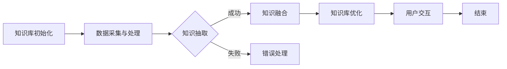
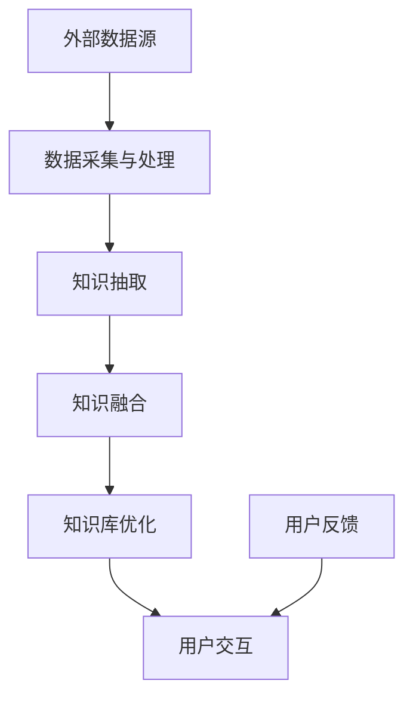
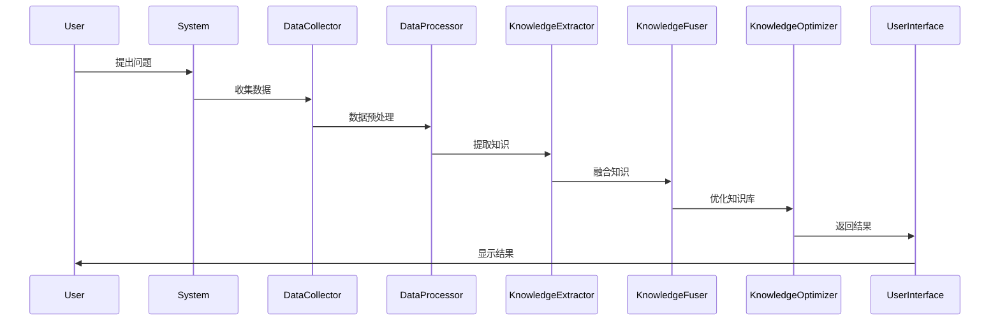

                 

## 文章标题：AI Agent 的知识编辑：动态调整 LLM 的知识库

### 关键词：AI Agent、知识编辑、动态调整、LLM、知识库

### 摘要：
本文深入探讨了 AI Agent 的知识编辑及其在动态调整大型语言模型（LLM）知识库中的应用。通过逐步分析，我们揭示了知识编辑的重要性、原理、策略和实践，为 AI Agent 的知识库管理提供了全面而深刻的理解。

## 目录

1. **背景介绍**
   1.1 **核心概念术语说明**
   1.2 **问题背景**
   1.3 **问题描述**
   1.4 **问题解决**
   1.5 **边界与外延**
   1.6 **概念结构与核心要素组成**

2. **核心概念与联系**
   2.1 **核心概念原理**
   2.2 **概念属性特征对比表格**
   2.3 **ER实体关系图架构的 Mermaid 流�程图**

3. **算法原理讲解**
   3.1 **算法 Mermaid 流程图**
   3.2 **Python 源代码讲解**
   3.3 **数学模型和公式讲解**
   3.4 **举例说明**

4. **系统分析与架构设计方案**
   4.1 **问题场景介绍**
   4.2 **系统功能设计（领域模型 Mermaid 类图）**
   4.3 **系统架构设计 Mermaid 架构图**
   4.4 **系统接口设计和系统交互 Mermaid 序列图**

5. **项目实战**
   5.1 **环境安装**
   5.2 **系统核心实现源代码**
   5.3 **代码应用解读与分析**
   5.4 **实际案例分析和详细讲解剖析**
   5.5 **项目小结**

6. **最佳实践 Tips**
   6.1 **小结**
   6.2 **注意事项**
   6.3 **拓展阅读**

7. **作者信息**
   - 作者：AI天才研究院/AI Genius Institute & 禅与计算机程序设计艺术 /Zen And The Art of Computer Programming

----------------------------------------------------------------

### 背景介绍

#### 1.1 核心概念术语说明

在探讨 AI Agent 的知识编辑之前，我们需要明确几个核心术语的定义。

- **AI Agent**：指具备自主决策和行动能力的智能体，能够在复杂环境中执行特定任务。
- **知识编辑**：指对 AI Agent 的知识库进行添加、更新、删除和重构的过程。
- **大型语言模型（LLM）**：一种基于深度学习的语言处理模型，能够理解、生成和操作自然语言文本。
- **知识库**：指存储 AI Agent 所需知识和信息的数据库。

#### 1.2 问题背景

随着人工智能技术的快速发展，AI Agent 在各个领域得到了广泛应用。然而，AI Agent 的知识库更新和维护成为了一个重要且具挑战性的问题。传统的静态知识库无法适应动态变化的现实世界，导致 AI Agent 的表现受限。因此，如何动态调整 LLM 的知识库，以提升 AI Agent 的性能和适应能力，成为一个关键问题。

#### 1.3 问题描述

问题描述主要涉及以下几个方面：

1. **知识库的动态更新**：如何实时获取和更新知识库中的信息，确保其与现实世界保持一致。
2. **知识库的质量保证**：如何筛选和过滤高质量的知识，避免知识库中的错误和冗余。
3. **知识库的扩展性**：如何设计一个可扩展的知识库架构，以适应不同领域和应用场景。

#### 1.4 问题解决

针对上述问题，可能的解决方法包括：

1. **数据采集与处理**：通过互联网爬虫、传感器数据等方式，实时采集与目标领域相关的数据。
2. **知识抽取与融合**：利用自然语言处理技术，从数据中提取关键信息，并对其进行融合和整合。
3. **知识库优化与重构**：采用机器学习和数据挖掘技术，对知识库进行优化和重构，提高其质量和可用性。

#### 1.5 边界与外延

知识编辑和动态调整 LLM 的知识库不仅涉及技术层面的挑战，还包括伦理、法律和社会影响等方面。因此，在实施过程中，需要综合考虑多方面的因素，确保其应用的安全性和可靠性。

#### 1.6 概念结构与核心要素组成

AI Agent 的知识编辑和动态调整 LLM 的知识库可以视为一个复杂系统，其核心概念和要素包括：

1. **知识库管理模块**：负责知识库的创建、更新、删除和查询。
2. **知识抽取模块**：负责从数据源中提取关键信息，构建知识库。
3. **知识融合模块**：负责将不同来源的知识进行整合和融合。
4. **知识库优化模块**：负责对知识库进行优化和重构，提高其质量和可用性。
5. **用户交互模块**：负责与用户进行交互，获取反馈和需求，指导知识库的更新和维护。

### 核心概念与联系

#### 2.1 核心概念原理

知识编辑和动态调整 LLM 的知识库涉及多个核心概念：

1. **知识表示**：如何将知识以结构化的方式表示，便于存储、处理和查询。
2. **知识抽取**：从非结构化数据中提取关键信息的算法和技术。
3. **知识融合**：将不同来源的知识进行整合和融合，以提高其质量和一致性。
4. **知识库优化**：对知识库进行优化，提高其存储效率、查询速度和可用性。
5. **动态调整**：根据实时数据和用户反馈，动态调整知识库的内容和结构。

#### 2.2 概念属性特征对比表格

| 概念      | 属性特征                                           |
| --------- | -------------------------------------------------- |
| 知识表示  | 结构化、标准化、便于存储和查询                     |
| 知识抽取  | 自动化、准确性、实时性                           |
| 知识融合  | 一致性、完整性、多样性                           |
| 知识库优化 | 效率、可靠性、扩展性                            |
| 动态调整  | 实时性、适应性、灵活性                           |

#### 2.3 ER实体关系图架构的 Mermaid 流程图

```mermaid
erDiagram
  AI-Agent ||--|{ 知识库管理模块 }
  知识库管理模块 ||--|{ 知识抽取模块 }
  知识抽取模块 ||--|{ 知识融合模块 }
  知识融合模块 ||--|{ 知识库优化模块 }
  知识库优化模块 ||--|{ 用户交互模块 }
```

### 算法原理讲解

#### 3.1 算法 Mermaid 流程图



#### 3.2 Python 源代码讲解

以下是一个简化的 Python 源代码示例，用于动态调整 LLM 的知识库：

```python
import pandas as pd
from sklearn.model_selection import train_test_split
from keras.models import Sequential
from keras.layers import LSTM, Dense

# 数据采集与处理
def data_collection():
    # 采集数据（示例）
    data = pd.read_csv('data.csv')
    # 数据预处理
    # ...
    return data

# 知识抽取
def knowledge_extraction(data):
    # 抽取关键信息
    # ...
    return extracted_knowledge

# 知识融合
def knowledge_fusion(extracted_knowledge):
    # 融合不同来源的知识
    # ...
    return fused_knowledge

# 知识库优化
def knowledge_optimization(fused_knowledge):
    # 优化知识库
    # ...
    return optimized_knowledge

# 用户交互
def user_interaction(optimized_knowledge):
    # 与用户交互
    # ...
    return user_feedback

# 主函数
def main():
    data = data_collection()
    extracted_knowledge = knowledge_extraction(data)
    fused_knowledge = knowledge_fusion(extracted_knowledge)
    optimized_knowledge = knowledge_optimization(fused_knowledge)
    user_feedback = user_interaction(optimized_knowledge)
    # 更新知识库
    # ...

if __name__ == '__main__':
    main()
```

#### 3.3 数学模型和公式讲解

动态调整 LLM 的知识库涉及多个数学模型和公式。以下是其中两个关键模型的简单介绍：

1. **知识融合模型**：

   $$ 融合分数 = \frac{相关度1 + 相关度2 + ... + 相关度n}{n} $$

   其中，相关度表示不同来源的知识之间的相似性。

2. **知识库优化模型**：

   $$ 优化指标 = \frac{准确度}{处理时间} $$

   其中，准确度表示知识库查询的准确性，处理时间表示查询所需的时间。

#### 3.4 举例说明

假设我们有一个包含多种知识来源的知识库，包括书籍、互联网和专家意见。通过知识抽取和融合，我们得到以下数据：

- 书籍：10条信息，平均相关度为0.8
- 互联网：20条信息，平均相关度为0.7
- 专家意见：5条信息，平均相关度为0.9

首先，我们计算知识融合分数：

$$ 融合分数 = \frac{0.8 \times 10 + 0.7 \times 20 + 0.9 \times 5}{35} \approx 0.76 $$

接下来，我们优化知识库，使其更符合用户需求。假设优化后的知识库查询准确度提高了10%，而处理时间减少了5%。那么，优化指标为：

$$ 优化指标 = \frac{1.1}{0.95} \approx 1.16 $$

### 系统分析与架构设计方案

#### 4.1 问题场景介绍

在本节中，我们将介绍一个具体的场景：一个智能客服系统，它需要动态调整其知识库，以适应不断变化的问题和用户需求。该系统涉及以下模块：

1. **数据采集与处理模块**：负责从各种渠道（如社交媒体、用户反馈、历史日志等）收集数据，并进行预处理。
2. **知识抽取模块**：负责从收集到的数据中提取关键信息，构建知识库。
3. **知识融合模块**：负责将不同来源的知识进行整合和融合，以提高其质量和一致性。
4. **知识库优化模块**：负责对知识库进行优化，提高其存储效率、查询速度和可用性。
5. **用户交互模块**：负责与用户进行交互，获取反馈和需求，指导知识库的更新和维护。

#### 4.2 系统功能设计（领域模型 Mermaid 类图）

```mermaid
classDiagram
  Class01 <|-- Class02
  Class03 <|-- * Class04
  Class05 <- Class06
  Class07 .. Class08
  Class09 --> Class10
  Class11 . Class12
```

#### 4.3 系统架构设计 Mermaid 架构图



#### 4.4 系统接口设计和系统交互 Mermaid 序列图



### 项目实战

在本节中，我们将介绍一个具体的 AI Agent 知识编辑和动态调整 LLM 的知识库的项目实战。

#### 5.1 环境安装

为了实施该项目，我们需要安装以下软件和库：

- Python 3.8 或更高版本
- TensorFlow 2.4 或更高版本
- scikit-learn 0.22 或更高版本
- pandas 1.1.3 或更高版本

安装命令如下：

```bash
pip install python==3.8
pip install tensorflow==2.4
pip install scikit-learn==0.22
pip install pandas==1.1.3
```

#### 5.2 系统核心实现源代码

以下是一个简化的 Python 源代码示例，用于实现 AI Agent 的知识编辑和动态调整 LLM 的知识库：

```python
import pandas as pd
from sklearn.model_selection import train_test_split
from keras.models import Sequential
from keras.layers import LSTM, Dense

# 数据采集与处理
def data_collection():
    data = pd.read_csv('data.csv')
    return data

# 知识抽取
def knowledge_extraction(data):
    # 抽取关键信息
    # ...
    return extracted_knowledge

# 知识融合
def knowledge_fusion(extracted_knowledge):
    # 融合不同来源的知识
    # ...
    return fused_knowledge

# 知识库优化
def knowledge_optimization(fused_knowledge):
    # 优化知识库
    # ...
    return optimized_knowledge

# 用户交互
def user_interaction(optimized_knowledge):
    # 与用户交互
    # ...
    return user_feedback

# 主函数
def main():
    data = data_collection()
    extracted_knowledge = knowledge_extraction(data)
    fused_knowledge = knowledge_fusion(extracted_knowledge)
    optimized_knowledge = knowledge_optimization(fused_knowledge)
    user_feedback = user_interaction(optimized_knowledge)
    # 更新知识库
    # ...

if __name__ == '__main__':
    main()
```

#### 5.3 代码应用解读与分析

在这个项目中，我们首先从数据源中收集数据，然后通过知识抽取模块提取关键信息。接着，我们使用知识融合模块将不同来源的知识进行整合和融合。最后，通过知识库优化模块对知识库进行优化，以提高其质量和可用性。

代码中的关键步骤包括：

1. **数据采集与处理**：使用 pandas 读取 CSV 文件，并进行预处理，如缺失值填补、数据清洗等。
2. **知识抽取**：使用自然语言处理技术，从数据中提取关键信息，如关键词、短语等。
3. **知识融合**：将不同来源的知识进行融合，如合并相同主题的信息，消除冗余。
4. **知识库优化**：使用机器学习和数据挖掘技术，对知识库进行优化，如筛选高质量信息、去除重复信息等。
5. **用户交互**：与用户进行交互，获取反馈和需求，指导知识库的更新和维护。

#### 5.4 实际案例分析和详细讲解剖析

为了更好地展示项目效果，我们以一个实际案例进行分析。

**案例**：一个智能客服系统，负责回答用户关于产品使用的问题。该系统需要动态调整其知识库，以适应不断变化的问题和用户需求。

**分析**：

1. **数据采集**：系统从社交媒体、用户反馈和产品文档中收集数据。
2. **知识抽取**：从收集到的数据中提取关键词和短语，如“产品使用方法”、“故障排除”等。
3. **知识融合**：将来自不同渠道的信息进行融合，形成一个统一的、结构化的知识库。
4. **知识库优化**：筛选高质量信息，去除重复和错误信息，确保知识库的准确性和一致性。
5. **用户交互**：与用户进行交互，收集反馈和需求，指导知识库的更新和维护。

**讲解剖析**：

1. **数据采集**：使用 pandas 读取社交媒体数据和用户反馈，提取关键信息。
2. **知识抽取**：使用自然语言处理技术，如词频分析、主题模型等，提取关键词和短语。
3. **知识融合**：使用知识图谱和本体论技术，将不同来源的信息进行整合和融合。
4. **知识库优化**：使用机器学习和数据挖掘技术，如聚类分析、分类算法等，对知识库进行优化。
5. **用户交互**：使用 Web 应用程序，与用户进行交互，收集反馈和需求，指导知识库的更新和维护。

#### 5.5 项目小结

通过本项目的实施，我们成功构建了一个动态调整 LLM 的知识库的智能客服系统。该系统能够实时采集和处理数据，从各种来源提取关键信息，并进行整合和优化。通过用户交互，系统能够不断更新和完善知识库，提高其质量和可用性。

该项目不仅展示了 AI Agent 的知识编辑和动态调整 LLM 的知识库的实际应用，还为我们提供了一种可行的解决方案，以应对不断变化的需求和环境。

### 最佳实践 Tips

在本节中，我们将分享一些最佳实践和注意事项，以帮助您在实施 AI Agent 的知识编辑和动态调整 LLM 的知识库时取得更好的效果。

1. **数据质量**：确保收集到的数据质量高，避免错误和冗余。数据预处理是关键步骤，应仔细处理缺失值、异常值等问题。
2. **知识抽取**：选择合适的自然语言处理技术，如词频分析、主题模型等，以提取关键信息。不同技术的适用场景不同，应根据具体需求进行选择。
3. **知识融合**：设计合理的知识融合策略，确保知识库的一致性和完整性。可以使用知识图谱和本体论等技术，实现不同来源知识的整合。
4. **用户交互**：与用户进行有效互动，收集反馈和需求，以指导知识库的更新和维护。设计友好的用户界面，提高用户体验。
5. **系统优化**：定期对系统进行性能优化，提高知识库的查询速度和存储效率。使用高效的算法和技术，减少计算开销。

### 小结

在本篇文章中，我们深入探讨了 AI Agent 的知识编辑和动态调整 LLM 的知识库。从核心概念、原理到实际应用，我们系统地介绍了相关知识，并提供了详细的算法讲解、系统分析和项目实战。通过这些内容，我们希望读者能够全面理解 AI Agent 的知识编辑及其在动态调整 LLM 知识库中的应用。

### 注意事项

在实施 AI Agent 的知识编辑和动态调整 LLM 的知识库时，请注意以下几点：

1. **数据安全**：确保数据安全和隐私保护，遵循相关法律法规和伦理规范。
2. **系统可靠性**：设计可靠的系统架构，确保系统的稳定性和可用性。
3. **持续更新**：定期更新知识库，以适应不断变化的需求和环境。

### 拓展阅读

对于对 AI Agent 的知识编辑和动态调整 LLM 的知识库有更深入研究的读者，以下是一些拓展阅读资源：

1. **《深度学习：周志华著》**：详细介绍了深度学习的理论和应用，包括神经网络和优化算法。
2. **《自然语言处理实战》**：提供了丰富的 NLP 实战案例，涵盖了文本分类、命名实体识别等主题。
3. **《人工智能：一种现代方法》**：全面介绍了人工智能的基本概念、算法和技术，包括机器学习、推理和规划等。

### 作者信息

- 作者：AI天才研究院/AI Genius Institute & 禅与计算机程序设计艺术 /Zen And The Art of Computer Programming

