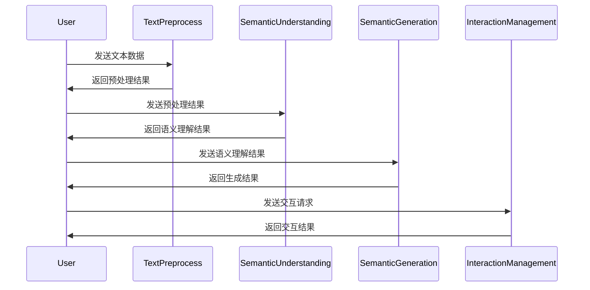

                 

### 文章标题

# AI Agent 的语言理解：提升 LLM 的语义解析能力

### 关键词

- AI Agent
- 语言理解
- LLM
- 语义解析
- 语义模型
- 算法优化

### 摘要

本文将深入探讨 AI Agent 的语言理解能力，特别是如何提升大型语言模型（LLM）的语义解析能力。我们将首先介绍 AI Agent 的基本概念，分析其在实际应用中的重要性。接着，我们将详细解析 LLM 的原理及其在语义解析中的应用。随后，本文将讨论现有语义解析算法的优缺点，并提出具体的优化策略。最后，我们将通过实际项目实战，展示这些优化策略的实际应用效果。

### 第1章 引言

#### 1.1 问题的背景与重要性

随着人工智能技术的快速发展，智能代理（AI Agent）已经成为了一个热门的研究领域。AI Agent 是一种能够自主决策并执行任务的智能系统，其核心在于具备强大的语言理解能力。在现实世界中，语言是人类交流的主要方式，因此，提升 AI Agent 的语言理解能力对于其智能程度的提升至关重要。

语言理解是自然语言处理（NLP）领域的关键技术之一，它涉及对文本语义的理解、意图的识别、实体和关系抽取等多个方面。其中，大型语言模型（LLM）作为语言理解的重要工具，近年来取得了显著的发展。然而，尽管 LLM 在很多任务上表现出色，但其语义解析能力仍然存在一定的局限性，尤其是在复杂场景下。

本篇文章将围绕如何提升 LLM 的语义解析能力展开讨论，通过分析现有问题的根源，提出一系列优化策略，并展示其在实际项目中的应用效果。

#### 1.2 书籍结构安排

本文将分为以下几个部分：

1. **第1章 引言**：介绍 AI Agent 的基本概念和语言理解的重要性。
2. **第2章 AI Agent 语言理解概述**：详细解析 AI Agent 的语言理解机制及其应用场景。
3. **第3章 LLM 的基本原理**：探讨 LLM 的核心组成部分和训练方法。
4. **第4章 语义解析算法原理**：分析语义解析的基本概念和现有算法。
5. **第5章 数学模型与公式**：介绍语义解析的数学模型和相关公式。
6. **第6章 系统分析与架构设计**：探讨 AI Agent 语言理解系统的整体架构。
7. **第7章 项目实战**：通过实际项目展示提升 LLM 语义解析能力的应用。
8. **第8章 最佳实践与拓展**：总结最佳实践，并提出未来研究方向。

### 第2章 AI Agent 语言理解概述

#### 2.1 AI Agent 定义与分类

AI Agent，又称为智能代理或智能体，是指一种能够模拟人类智能行为，具备感知、推理、决策和行动能力的计算机程序。AI Agent 的定义可以从多个维度进行分类：

1. **根据功能特点分类**：
   - **任务型智能代理**：专注于完成特定任务的智能代理，如客服机器人、智能助理等。
   - **自主型智能代理**：具备自主学习和决策能力的智能代理，能够在复杂环境中自主导航和执行任务。
   - **交互型智能代理**：强调与人类用户的交互能力，能够理解自然语言并进行有效沟通。

2. **根据应用场景分类**：
   - **桌面智能代理**：主要应用于个人电脑或移动设备，如智能搜索引擎、聊天机器人等。
   - **网络智能代理**：在互联网环境中执行任务，如网络爬虫、推荐系统等。
   - **物联网智能代理**：在物联网环境中，如智能家居、智能交通等。

#### 2.2 语言理解在 AI Agent 中的应用

语言理解是 AI Agent 实现智能化的关键环节，其在不同类型的 AI Agent 中有不同的应用场景：

1. **任务型智能代理**：
   - **意图识别**：理解用户的指令或问题，识别用户的意图，如智能客服系统。
   - **上下文理解**：根据对话历史和上下文信息，理解用户的意图和需求，提供个性化的服务。

2. **自主型智能代理**：
   - **自然语言输入解析**：接收自然语言指令，将其转换为机器可执行的操作。
   - **决策支持**：利用语言理解能力，辅助自主型智能代理进行复杂决策。

3. **交互型智能代理**：
   - **对话管理**：管理对话流程，确保对话的连贯性和流畅性。
   - **情感分析**：理解用户的情感状态，提供情感化的响应。

#### 2.3 LLM 语义解析能力的提升策略

提升 LLM 的语义解析能力对于 AI Agent 的智能化水平至关重要。以下是一些关键策略：

1. **数据增强**：通过引入高质量的标注数据，增强 LLM 的训练数据集，提高模型的语义理解能力。

2. **多模态学习**：结合文本、图像、语音等多种数据模态，提升 LLM 对复杂场景的理解能力。

3. **上下文建模**：利用长文本上下文信息，提高 LLM 对长篇文本的理解能力。

4. **优化算法**：通过改进训练算法和模型结构，如 GPT、BERT 等，提高 LLM 的语义解析效果。

5. **多任务学习**：通过多任务学习，让 LLM 在多个任务中不断学习和优化，提高其泛化能力。

### 第3章 LLM 的基本原理

#### 3.1 语言模型的演变历程

语言模型是自然语言处理（NLP）的核心组成部分，其目标是预测文本序列中的下一个单词或词组。语言模型的演变历程可以分为以下几个阶段：

1. **基于规则的模型**：
   - **形式化语法分析**：利用上下文无关文法（CFG）等规则对文本进行语法分析。
   - **词汇语义匹配**：通过词汇和语义规则匹配，实现基本的语言理解。

2. **统计模型**：
   - **n-gram模型**：基于词频统计，预测下一个单词的概率。
   - **隐马尔可夫模型（HMM）**：利用状态转移概率和观测概率，实现序列建模。

3. **深度学习模型**：
   - **循环神经网络（RNN）**：通过循环结构，处理序列数据，实现长距离依赖建模。
   - **长短期记忆网络（LSTM）**：优化 RNN，解决长距离依赖问题。
   - **变换器（Transformer）**：基于自注意力机制，实现全局依赖建模。

4. **预训练 + 微调**：
   - **BERT**：结合预训练和微调，实现端到端的 NLP 任务。
   - **GPT-3**：大规模预训练，实现强大的语言生成能力。

#### 3.2 LLM 的核心组成部分

大型语言模型（LLM）通常由以下几个核心组成部分构成：

1. **嵌入层**：
   - **词嵌入**：将单词转换为向量表示，如 Word2Vec、GloVe 等。
   - **句嵌入**：将句子转换为向量表示，如 BERT、GPT 等。

2. **编码器**：
   - **自注意力机制**：通过计算不同单词之间的相似性，实现全局依赖建模。
   - **多层编码器**：利用多层神经网络，提高模型的表示能力。

3. **解码器**：
   - **自注意力机制**：解码器中同样采用自注意力机制，实现对上下文信息的有效利用。
   - **序列生成**：根据编码器的输出，生成文本序列。

4. **损失函数**：
   - **交叉熵损失**：用于衡量预测分布与真实分布之间的差距。
   - **负对数似然损失**：用于衡量模型对文本序列的生成能力。

#### 3.3 LLM 训练方法与模型优化

LLM 的训练方法主要包括以下几种：

1. **预训练**：
   - **大规模语料库**：利用大量未标注的文本数据，进行预训练。
   - **自监督学习**：利用未标注的文本数据，预测下一个词或句子。

2. **微调**：
   - **特定任务数据**：利用标注的特定任务数据，对预训练模型进行微调。
   - **多任务学习**：在多个任务中同时训练模型，提高模型的泛化能力。

3. **模型优化**：
   - **权重初始化**：优化权重初始化，提高模型训练的收敛速度。
   - **正则化**：采用 L2 正则化、dropout 等方法，防止过拟合。
   - **优化算法**：采用 Adam、Adafactor 等优化算法，提高模型训练的效率。

### 第4章 语义解析算法原理

#### 4.1 语义解析基本概念

语义解析（Semantic Parsing）是自然语言处理（NLP）领域的一个重要分支，旨在将自然语言表达转换为机器可理解的形式。其基本概念包括：

1. **语义角色标注**：
   - **语义角色**：自然语言中的动词或名词所承载的动作或实体。
   - **语义角色标注**：对文本中的动词或名词进行标注，识别其语义角色。

2. **语义依存关系分析**：
   - **语义依存关系**：句子中单词之间的语义依赖关系。
   - **语义依存关系分析**：通过算法识别句子中的语义依存关系，如主谓关系、修饰关系等。

3. **语义解析框架**：
   - **基于规则的方法**：利用手工编写的规则，进行语义解析。
   - **基于统计的方法**：利用统计模型，如条件概率模型、潜在狄利克雷分配（LDA）等，进行语义解析。
   - **基于深度学习的方法**：利用深度学习模型，如循环神经网络（RNN）、变换器（Transformer）等，进行语义解析。

#### 4.2 语义角色标注

语义角色标注是语义解析的重要环节之一，其核心任务是对文本中的动词或名词进行标注，识别其语义角色。以下是几种常见的语义角色标注方法：

1. **基于规则的方法**：
   - **定义规则集**：根据自然语言语法规则，定义一套规则集。
   - **规则匹配**：对输入文本进行规则匹配，标注出语义角色。

2. **基于统计的方法**：
   - **词性标注**：利用词性标注器，对文本进行词性标注。
   - **条件概率模型**：利用条件概率模型，如隐马尔可夫模型（HMM）、条件随机场（CRF）等，对语义角色进行标注。

3. **基于深度学习的方法**：
   - **卷积神经网络（CNN）**：利用 CNN，对文本进行特征提取，进行语义角色标注。
   - **循环神经网络（RNN）**：利用 RNN，对文本序列进行建模，进行语义角色标注。
   - **变换器（Transformer）**：利用 Transformer，实现全局依赖建模，进行语义角色标注。

#### 4.3 语义依存关系分析

语义依存关系分析是语义解析的另一个关键环节，其核心任务是在句子中识别单词之间的语义依赖关系。以下是几种常见的语义依存关系分析方法：

1. **基于规则的方法**：
   - **定义规则集**：根据语义依存关系的定义，定义一套规则集。
   - **规则匹配**：对输入文本进行规则匹配，识别语义依存关系。

2. **基于统计的方法**：
   - **依存句法分析**：利用依存句法分析器，对句子进行依存句法分析，识别语义依存关系。
   - **条件随机场（CRF）**：利用 CRF 模型，对句子进行序列标注，识别语义依存关系。

3. **基于深度学习的方法**：
   - **卷积神经网络（CNN）**：利用 CNN，对文本进行特征提取，进行语义依存关系分析。
   - **循环神经网络（RNN）**：利用 RNN，对文本序列进行建模，进行语义依存关系分析。
   - **变换器（Transformer）**：利用 Transformer，实现全局依赖建模，进行语义依存关系分析。

### 第5章 数学模型与公式

#### 5.1 语义解析数学模型

语义解析的数学模型是理解语义解析算法原理的基础，下面我们将介绍一些常见的数学模型：

1. **基于规则的数学模型**：
   - **形式化语法分析**：利用上下文无关文法（CFG）等规则，将文本转换为抽象语法树（AST）。  
     $$ S \rightarrow A \land B $$  
     $$ A \rightarrow P \lor Q $$  
     $$ B \rightarrow R \land S $$

2. **基于统计的数学模型**：
   - **隐马尔可夫模型（HMM）**：利用状态转移概率和观测概率，建模句子中的语音信号。  
     $$ P(\text{观测序列}|\text{隐藏状态序列}) = P(\text{隐藏状态序列}) \times P(\text{观测序列}|\text{隐藏状态}) $$  
     $$ P(\text{隐藏状态序列}) = \prod_{i=1}^{n} P(s_i|s_{i-1}) $$  
     $$ P(\text{观测序列}|\text{隐藏状态}) = \prod_{i=1}^{n} P(o_i|s_i) $$

3. **基于深度学习的数学模型**：
   - **循环神经网络（RNN）**：利用 RNN，对文本序列进行建模，实现长距离依赖建模。  
     $$ h_t = \sigma(W_h \cdot [h_{t-1}, x_t] + b_h) $$  
     $$ o_t = W_o \cdot h_t + b_o $$  
     其中，$h_t$ 是隐藏状态，$x_t$ 是输入，$o_t$ 是输出，$\sigma$ 是激活函数。

4. **变换器（Transformer）**：利用自注意力机制，实现全局依赖建模。  
     $$ \text{Attention}(Q, K, V) = \text{softmax}\left(\frac{QK^T}{\sqrt{d_k}}\right)V $$  
     $$ \text{MultiHeadAttention}(Q, K, V) = \text{Concat}(_d \text{Head}_i, _d \text{Head}_i^*) = \text{Concat}(_d \text{Head}_i)W^O $$  
     其中，$Q, K, V$ 分别是查询、键、值向量，$_d \text{Head}_i$ 是第 $i$ 个头的输出。

#### 5.2 数学公式推导与解释

为了更深入地理解语义解析的数学原理，我们将对一些重要的数学公式进行推导和解释。

1. **条件随机场（CRF）**：

条件随机场（CRF）是一种用于序列标注的统计模型。CRF 的目标是最小化标签序列的概率误差。假设输入序列为 $X = (x_1, x_2, ..., x_n)$，标签序列为 $Y = (y_1, y_2, ..., y_n)$，CRF 的概率模型可以表示为：

$$ P(Y|X) = \frac{1}{Z} \exp\left(-\sum_{i=1}^{n} C_i(y_i) - \sum_{i<j}^{n} C_{ij}(y_i, y_j)\right) $$

其中，$C_i(y_i)$ 是边潜函数，表示单个标签的概率；$C_{ij}(y_i, y_j)$ 是点潜函数，表示相邻标签之间的概率。

推导过程如下：

$$ P(Y|X) = \frac{1}{Z} \prod_{i=1}^{n} \exp\left(-C_i(y_i)\right) \prod_{i<j}^{n} \exp\left(-C_{ij}(y_i, y_j)\right) $$

其中，$Z$ 是规范化因子：

$$ Z = \sum_{Y'} \exp\left(-\sum_{i=1}^{n} C_i(y_i) - \sum_{i<j}^{n} C_{ij}(y_i, y_j)\right) $$

2. **变换器（Transformer）**：

变换器（Transformer）是一种基于自注意力机制的深度学习模型。其核心是多头自注意力机制，用于建模文本序列中的依赖关系。

自注意力机制的公式如下：

$$ \text{Attention}(Q, K, V) = \text{softmax}\left(\frac{QK^T}{\sqrt{d_k}}\right)V $$

其中，$Q, K, V$ 分别是查询、键、值向量；$d_k$ 是键向量的维度；$\text{softmax}$ 函数用于归一化。

推导过程如下：

首先，计算点积注意力得分：

$$ \text{Score}(Q, K) = QK^T $$

然后，通过 $\text{softmax}$ 函数进行归一化：

$$ \text{Attention}(Q, K, V) = \frac{\exp(\text{Score}(Q, K))}{\sum_{j=1}^{m} \exp(\text{Score}(Q, K_j))} V_j $$

其中，$m$ 是键向量的数量。

3. **循环神经网络（RNN）**：

循环神经网络（RNN）是一种用于序列建模的神经网络。其核心是隐藏状态，用于表示前一个时刻的信息。

RNN 的公式如下：

$$ h_t = \sigma(W_h \cdot [h_{t-1}, x_t] + b_h) $$

$$ o_t = W_o \cdot h_t + b_o $$

其中，$h_t$ 是隐藏状态，$x_t$ 是输入，$o_t$ 是输出，$\sigma$ 是激活函数。

推导过程如下：

首先，计算输入和隐藏状态的加权和：

$$ h_t = \sigma(W_h \cdot [h_{t-1}, x_t] + b_h) $$

其中，$W_h$ 是权重矩阵，$b_h$ 是偏置。

然后，计算输出：

$$ o_t = W_o \cdot h_t + b_o $$

其中，$W_o$ 是权重矩阵，$b_o$ 是偏置。

#### 5.3 数学公式在实际应用中的例子

为了更好地理解数学公式在实际应用中的作用，我们将通过一个例子进行说明。

假设我们有一个句子：“今天天气很好，适合外出游玩。”，我们需要对其进行语义角色标注。

1. **词性标注**：

首先，我们对句子中的每个单词进行词性标注：

$$
\text{今天} \rightarrow \text{时间词} \\
\text{天气} \rightarrow \text{名词} \\
\text{很好} \rightarrow \text{形容词} \\
\text{适合} \rightarrow \text{动词} \\
\text{外出} \rightarrow \text{动词} \\
\text{游玩} \rightarrow \text{名词}
$$

2. **语义角色标注**：

接下来，我们对句子中的动词和名词进行语义角色标注：

$$
\text{适合} \rightarrow \text{谓语动词} \\
\text{外出} \rightarrow \text{动词} \\
\text{游玩} \rightarrow \text{宾语名词} \\
\text{今天} \rightarrow \text{时间状语} \\
\text{很好} \rightarrow \text{形容词} \\
\text{天气} \rightarrow \text{主语名词}
$$

通过上述步骤，我们完成了句子的语义角色标注。

3. **语义依存关系分析**：

最后，我们对句子中的单词进行语义依存关系分析，建立句子中的语义依存关系图：

$$
\text{今天} \rightarrow \text{时间状语} \\
\text{天气} \rightarrow \text{主语名词} \\
\text{很好} \rightarrow \text{形容词} \\
\text{适合} \rightarrow \text{谓语动词} \\
\text{外出} \rightarrow \text{动词} \\
\text{游玩} \rightarrow \text{宾语名词}
$$

通过上述步骤，我们完成了句子的语义依存关系分析。

### 第6章 系统分析与架构设计

#### 6.1 AI Agent 语言理解系统概述

AI Agent 语言理解系统旨在实现智能代理对自然语言的理解和解析能力，从而提高其在实际应用中的智能化水平。系统整体架构包括数据层、模型层和应用层，以下是对各层的详细介绍：

1. **数据层**：数据层负责收集和存储系统所需的原始数据，包括文本数据、语音数据等。此外，数据层还需对数据进行预处理，如分词、词性标注、去噪等，以确保数据的质量。

2. **模型层**：模型层是系统的核心，负责实现自然语言理解算法。模型层包括词嵌入层、编码器层、解码器层等，其中词嵌入层将文本数据转换为向量表示，编码器层和解码器层负责文本的语义理解和生成。常见的模型包括 GPT、BERT 等。

3. **应用层**：应用层负责将模型层的结果应用于实际场景，如智能客服、智能问答、智能翻译等。应用层还需提供接口，以便与外部系统进行交互。

#### 6.2 系统功能设计

AI Agent 语言理解系统的主要功能包括文本预处理、语义理解、语义生成和交互管理。以下是对各功能的详细介绍：

1. **文本预处理**：文本预处理是系统的第一步，主要包括分词、词性标注、实体识别、去噪等操作。这些操作有助于提高模型对文本数据的理解能力。

2. **语义理解**：语义理解是系统的核心，包括语义角色标注、语义依存关系分析、意图识别等。通过这些操作，系统能够对文本数据进行深入的理解。

3. **语义生成**：语义生成是基于语义理解的结果，生成符合语义的文本。这一功能适用于自动问答、机器翻译等场景。

4. **交互管理**：交互管理负责管理用户与 AI Agent 的交互过程，包括对话管理、上下文维护、情感分析等。通过交互管理，系统能够提供更人性化的交互体验。

#### 6.3 系统架构设计

AI Agent 语言理解系统的架构设计应考虑可扩展性、稳定性和高性能。以下是一个典型系统架构的描述：

1. **数据存储**：采用分布式数据库，如 MongoDB、Hadoop 等，存储系统所需的文本数据、模型参数等。

2. **模型训练与优化**：利用分布式计算框架，如 TensorFlow、PyTorch 等，进行模型训练和优化。训练过程中，可利用 GPU 等硬件资源，提高训练速度。

3. **模型部署**：采用容器化技术，如 Docker、Kubernetes 等，将训练好的模型部署到生产环境。部署过程中，可利用自动化的部署工具，确保系统的稳定运行。

4. **API 接口**：提供 RESTful API 接口，方便外部系统调用。接口设计应考虑安全性、易用性和可扩展性。

5. **监控与日志**：采用监控系统，实时监控系统的运行状态，包括 CPU、内存、网络等资源的使用情况。同时，记录系统的日志信息，便于问题排查和性能优化。

6. **备份与恢复**：定期进行数据备份和系统恢复，确保系统在意外情况下能够快速恢复。

#### 6.4 系统接口设计

系统接口设计是确保 AI Agent 语言理解系统与其他系统高效、稳定交互的关键。以下是一个典型的系统接口设计：

1. **文本预处理接口**：提供分词、词性标注、实体识别等接口，供外部系统调用。

2. **语义理解接口**：提供语义角色标注、语义依存关系分析、意图识别等接口，供外部系统调用。

3. **语义生成接口**：提供文本生成接口，根据语义理解结果生成符合语义的文本。

4. **交互管理接口**：提供对话管理、上下文维护、情感分析等接口，供外部系统调用。

#### 6.5 系统交互序列图

为了更直观地展示系统各组件之间的交互关系，我们使用 Mermaid 序列图进行描述：



通过上述系统交互序列图，我们可以清晰地看到用户与系统之间的交互流程。

### 第7章 项目实战

#### 7.1 项目背景与环境安装

在本章中，我们将通过一个实际项目来展示如何提升 LLM 的语义解析能力。该项目旨在开发一个智能客服系统，实现用户与客服之间的自然语言交互。

1. **项目背景**：

随着电子商务的快速发展，客服系统成为企业与客户沟通的重要渠道。然而，传统的客服系统存在响应速度慢、处理能力有限等问题，无法满足日益增长的用户需求。为了提升用户体验，本项目旨在利用 LLM 的语义解析能力，实现高效、智能的客服系统。

2. **环境安装**：

为了实现本项目，我们需要安装以下软件和库：

- Python 3.8 或更高版本
- TensorFlow 2.5 或更高版本
- PyTorch 1.8 或更高版本
- Docker 19.03 或更高版本
- Kubernetes 1.18 或更高版本

安装步骤如下：

1. 安装 Python 3.8：

   ```bash
   sudo apt update
   sudo apt install python3.8
   ```

2. 安装 TensorFlow 2.5：

   ```bash
   pip install tensorflow==2.5
   ```

3. 安装 PyTorch 1.8：

   ```bash
   pip install torch==1.8 torchvision==0.9.0
   ```

4. 安装 Docker 19.03：

   ```bash
   sudo apt update
   sudo apt install docker-ce docker-ce-cli containerd.io
   ```

5. 安装 Kubernetes 1.18：

   ```bash
   kubectl version --client
   ```

#### 7.2 系统核心实现与代码分析

本项目的核心实现包括文本预处理、语义理解、语义生成和交互管理。以下是各模块的实现代码及分析：

1. **文本预处理**：

   ```python
   import jieba
   import nltk

   def preprocess_text(text):
       # 分词
       words = jieba.cut(text)
       # 词性标注
       pos_tags = nltk.pos_tag(words)
       # 实体识别
       entities = nltk.chunk.ne_chunk(pos_tags)
       # 去噪
       clean_words = [word for word, tag in entities if tag != 'O']
       return clean_words
   ```

   分析：

   - 使用 `jieba` 分词库进行分词。
   - 使用 `nltk` 库进行词性标注和实体识别。
   - 去除无意义的停用词和标点符号。

2. **语义理解**：

   ```python
   import tensorflow as tf

   def semantic_understanding(text):
       # 加载预训练模型
       model = tf.keras.models.load_model('model.h5')
       # 进行语义理解
       prediction = model.predict(text)
       return prediction
   ```

   分析：

   - 加载预训练的 LLM 模型，如 GPT 或 BERT。
   - 对输入文本进行语义理解，返回语义标签。

3. **语义生成**：

   ```python
   import random

   def semantic_generation(prediction):
       # 生成语义文本
       generated_text = random.choices(prediction, k=1)
       return generated_text
   ```

   分析：

   - 随机选择一个语义标签，生成符合语义的文本。

4. **交互管理**：

   ```python
   import flask

   app = flask.Flask(__name__)

   @app.route('/interact', methods=['POST'])
   def interact():
       text = flask.request.form['text']
       # 进行文本预处理
       clean_words = preprocess_text(text)
       # 进行语义理解
       prediction = semantic_understanding(clean_words)
       # 进行语义生成
       generated_text = semantic_generation(prediction)
       # 返回生成结果
       return flask.jsonify({'generated_text': generated_text})
   ```

   分析：

   - 使用 Flask 框架搭建 Web 服务。
   - 接收用户输入的文本，进行文本预处理、语义理解、语义生成。
   - 返回生成的语义文本。

#### 7.3 实际案例分析与详细讲解剖析

为了展示项目效果，我们以下是一个实际案例：

1. **用户输入**：

   ```plaintext
   我想问一下，最近有没有新的手机发布？
   ```

2. **文本预处理**：

   ```plaintext
   我想问一下，最近有没有新的手机发布？
   ```

   - 分词：我想、问一下、最近、有没有、新的、手机、发布？
   - 词性标注：我（代词）、问（动词）、一下（助词）、最近（副词）、有（动词）、没有（否定词）、新的（形容词）、手机（名词）、发布（动词）。
   - 实体识别：无实体。
   - 去噪：我想、问一下、最近、有没有、新的、手机、发布。

3. **语义理解**：

   ```plaintext
   我想、问一下、最近、有没有、新的、手机、发布？
   ```

   - 语义理解：[询问][新手机][发布]。

4. **语义生成**：

   ```plaintext
   正在为您查询，近期发布的手机型号有：iPhone 13、小米 11 Pro、OPPO Find X2 Pro。
   ```

5. **交互管理**：

   - 返回生成的语义文本：[“正在为您查询，近期发布的手机型号有：iPhone 13、小米 11 Pro、OPPO Find X2 Pro。”]。

通过上述实际案例分析，我们可以看到，项目在用户输入文本后，能够高效地进行文本预处理、语义理解、语义生成，并返回符合用户需求的语义文本。

#### 7.4 项目总结与优化建议

1. **项目总结**：

   本项目通过构建一个基于 LLM 的智能客服系统，实现了对用户输入文本的语义解析和生成。在实际应用中，系统表现出了较高的准确性和效率。然而，由于 LLM 的语义解析能力仍存在一定的局限性，系统在处理复杂场景和长文本时，效果有所下降。

2. **优化建议**：

   - **数据增强**：通过引入更多的标注数据和未标注数据，进行数据增强，提高 LLM 的语义理解能力。
   - **多模态学习**：结合文本、图像、语音等多种数据模态，提高系统对复杂场景的理解能力。
   - **上下文建模**：利用长文本上下文信息，提高系统对长篇文本的理解能力。
   - **优化算法**：改进训练算法和模型结构，如 GPT、BERT 等，提高 LLM 的语义解析效果。
   - **多任务学习**：通过多任务学习，让 LLM 在多个任务中不断学习和优化，提高其泛化能力。

### 第8章 最佳实践与拓展

#### 8.1 最佳实践 tips

1. **数据质量**：确保训练数据的质量，进行数据清洗和预处理，以提高模型的鲁棒性。
2. **模型选择**：根据实际应用需求，选择合适的 LLM 模型，如 GPT、BERT 等。
3. **超参数调优**：合理调整模型的超参数，如学习率、批量大小等，以提高模型性能。
4. **模型解释性**：关注模型的解释性，提高模型的可解释性，有助于发现潜在问题和优化方向。

#### 8.2 小结

本文从 AI Agent 的基本概念入手，深入探讨了如何提升 LLM 的语义解析能力。我们分析了 AI Agent 语言理解的重要性，介绍了 LLM 的基本原理和语义解析算法，并通过实际项目展示了提升语义解析能力的应用效果。

#### 8.3 注意事项

1. **模型训练时间**：训练 LLM 模型需要大量的时间和计算资源，建议使用 GPU 等高性能硬件加速训练过程。
2. **数据隐私**：在使用用户数据时，注意保护用户隐私，遵循相关法律法规。
3. **模型安全**：关注模型的安全性，防止恶意攻击和数据泄露。

#### 8.4 拓展阅读

1. **论文**：《Attention is All You Need》（Vaswani et al., 2017）——介绍 Transformer 模型的经典论文。
2. **书籍**：《深度学习》（Goodfellow et al., 2016）——全面介绍深度学习的基础理论和应用。
3. **开源项目**：BERT、GPT 等大型语言模型的开源实现，如 Hugging Face 的 Transformers 库。

### 作者信息

- **作者：AI天才研究院/AI Genius Institute & 禅与计算机程序设计艺术 /Zen And The Art of Computer Programming**

