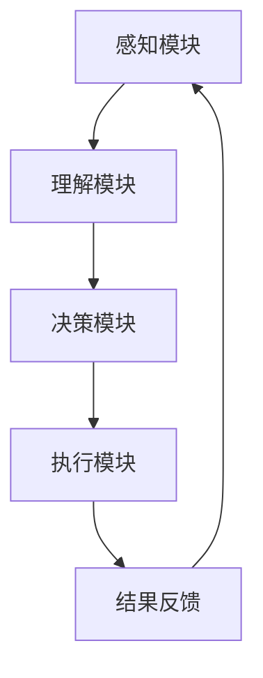
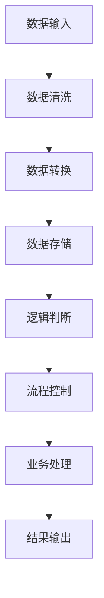
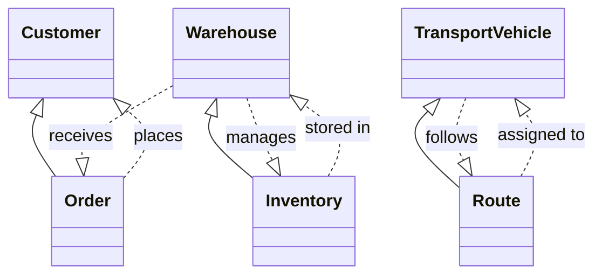
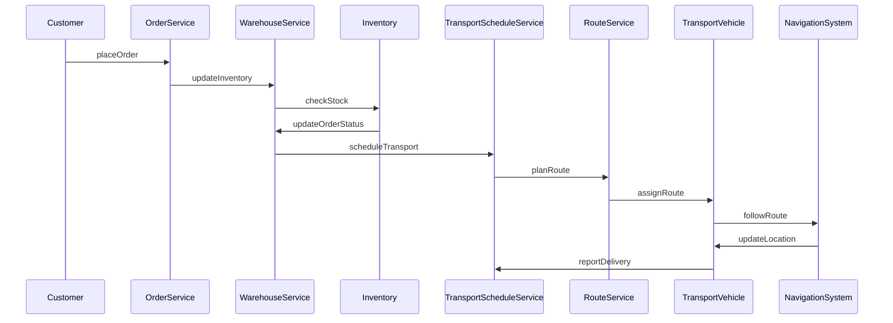
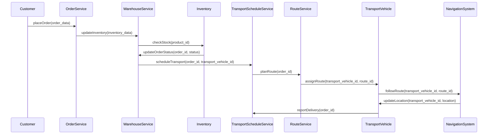

                 


### 《AI Agent与传统软件系统的协同工作》

#### 关键词
- AI Agent
- 传统软件系统
- 协同工作
- 算法原理
- 系统架构设计

#### 摘要
本文旨在探讨AI Agent与传统软件系统的协同工作原理及其在实际应用中的重要性。通过逐步分析AI Agent与传统软件系统的定义、工作原理、算法模型，以及协同工作机制，本文将为读者揭示两者如何在复杂系统中相互补充、共同优化性能。文章将结合实例，详细讲解协同工作的系统分析与架构设计方法，并分享项目实战经验，以期为相关领域的研究与应用提供有价值的参考。

### 目录大纲

```markdown
# 《AI Agent与传统软件系统的协同工作》

## 第一部分：背景介绍与概念理解

### 第1章：问题背景与定义

#### 1.1 问题背景

- AI Agent的定义与作用
- 传统软件系统的工作原理与局限
- AI Agent与传统软件系统协同工作的意义

#### 1.2 核心概念

- AI Agent的基本概念与分类
- 传统软件系统的基本架构与功能
- AI Agent与传统软件系统的协同工作机制

#### 1.3 边界与外延

- AI Agent与传统软件系统的协作范围
- 协同工作中的技术挑战与解决方案
- 不同场景下的协同工作模式分析

### 第2章：核心概念与联系

#### 2.1 核心概念原理

- AI Agent的工作原理与算法基础
- 传统软件系统的核心模块与功能

#### 2.2 概念属性特征对比表格

- AI Agent与传统软件系统的性能对比
- 优势与局限对比

#### 2.3 ER实体关系图架构

- AI Agent与传统软件系统的实体关系图

## 第二部分：算法原理讲解

### 第3章：AI Agent算法原理详解

#### 3.1 算法基本原理

- AI Agent算法的基本概念
- 算法的主要组成部分

#### 3.2 算法流程图

- 使用Mermaid绘制算法流程图

#### 3.3 Python源代码实现

- AI Agent算法的Python代码实现

#### 3.4 算法原理的数学模型和公式

- AI Agent算法的数学模型与公式
- 公式的详细解释与推导

#### 3.5 举例说明

- 通俗易懂的算法实例说明
- 实例分析与结果展示

### 第4章：传统软件系统的算法原理

#### 4.1 算法基本原理

- 传统软件系统的算法基础
- 算法在系统中的作用

#### 4.2 算法流程图

- 使用Mermaid绘制算法流程图

#### 4.3 Python源代码实现

- 传统软件系统的Python代码实现

#### 4.4 算法原理的数学模型和公式

- 传统软件系统的数学模型与公式
- 公式的详细解释与推导

#### 4.5 举例说明

- 通俗易懂的算法实例说明
- 实例分析与结果展示

## 第三部分：系统分析与架构设计

### 第5章：问题场景介绍

- 项目背景
- 需求分析

### 第6章：系统功能设计

#### 6.1 领域模型

- 使用Mermaid绘制领域模型类图

#### 6.2 系统架构设计

- 使用Mermaid绘制系统架构图

#### 6.3 系统接口设计

- 接口定义与功能说明

#### 6.4 系统交互

- 使用Mermaid绘制系统交互序列图

## 第四部分：项目实战

### 第7章：环境安装与配置

- 环境搭建步骤
- 遇到的问题与解决方案

### 第8章：系统核心实现

#### 8.1 AI Agent模块

- 源代码解读
- 功能分析与测试

#### 8.2 传统软件系统模块

- 源代码解读
- 功能分析与测试

### 第9章：实际案例分析与详细讲解

- 案例背景
- 实现过程
- 结果分析与优化

### 第10章：项目小结

- 项目总结
- 经验与教训
- 拓展阅读

```

### 第一部分：背景介绍与概念理解

#### 1.1 问题背景

随着人工智能技术的飞速发展，AI Agent作为一种智能体，开始在各个领域中发挥重要作用。AI Agent是指能够自主执行任务、适应环境变化并与其他系统或实体协同工作的智能实体。其应用范围涵盖了从简单的自动化任务到复杂的决策支持系统，如图像识别、自然语言处理、推荐系统等。

与此同时，传统软件系统在长期的实践中已形成了一套成熟的方法论和开发流程。传统软件系统通常是指基于指令驱动的、以编程语言实现的系统，其功能通常是通过设计者预先定义的规则和算法来实现的。尽管传统软件系统在可靠性、稳定性和安全性方面具有显著优势，但其在灵活性、自适应性和智能决策方面存在一定的局限。

AI Agent与传统软件系统的协同工作，旨在将两者的优势结合起来，弥补各自的不足，从而实现系统性能的全面提升。这一协同工作模式在复杂系统中具有广泛的应用前景，如自动驾驶、智能医疗、金融风控等。

#### 1.2 核心概念

**AI Agent的基本概念与分类**

AI Agent是指具备一定智能能力的实体，能够自主感知环境、理解自身状态，并采取相应的行动以实现特定目标。根据功能和任务的不同，AI Agent可以分为以下几类：

1. **感知型AI Agent**：这类AI Agent主要具备感知环境的能力，如视觉感知、语音识别等，但它们通常无法自主决策。
2. **决策型AI Agent**：这类AI Agent不仅具备感知能力，还能根据感知信息进行决策，如路径规划、任务调度等。
3. **执行型AI Agent**：这类AI Agent能够将决策转化为具体的行动，如机器手臂的操作、无人机的飞行等。

**传统软件系统的基本架构与功能**

传统软件系统通常由以下几个核心部分组成：

1. **用户界面**：提供用户与系统交互的接口，包括图形用户界面（GUI）和命令行界面（CLI）。
2. **业务逻辑**：实现系统的核心功能，如数据处理、业务规则应用等。
3. **数据存储**：用于存储系统运行过程中产生的数据，如关系型数据库、NoSQL数据库等。
4. **系统管理**：包括系统配置、安全管理、日志记录等功能。

**AI Agent与传统软件系统的协同工作机制**

AI Agent与传统软件系统的协同工作，主要通过以下几种方式进行：

1. **数据交互**：AI Agent通过API或其他数据接口获取传统软件系统的数据，进行进一步分析和决策。
2. **功能调用**：AI Agent通过调用传统软件系统的功能接口，实现对系统功能的增强或优化。
3. **协同决策**：在复杂场景下，AI Agent与传统软件系统共同分析问题，制定决策方案。

#### 1.3 边界与外延

**AI Agent与传统软件系统的协作范围**

AI Agent与传统软件系统的协作范围广泛，主要包括：

1. **数据处理**：AI Agent可对传统软件系统中的大量数据进行预处理、分析、挖掘等。
2. **智能决策**：AI Agent可参与系统的决策过程，提供基于数据的智能建议。
3. **故障预测与修复**：AI Agent可通过监控系统和日志数据，预测系统故障并自动修复。

**协同工作中的技术挑战与解决方案**

在协同工作中，AI Agent与传统软件系统面临以下技术挑战：

1. **接口兼容性**：不同系统的接口可能存在兼容性问题，需要统一数据格式和接口规范。
2. **实时性**：AI Agent需要快速响应用户请求，传统软件系统需要适应实时数据处理需求。
3. **安全性**：确保AI Agent与传统软件系统之间的数据传输和交互过程安全可靠。

解决方案包括：

1. **标准化接口**：采用标准化的数据格式和接口协议，如RESTful API、SOAP等。
2. **分布式计算**：利用分布式计算框架，提高数据处理和响应速度。
3. **安全加密**：采用加密技术和身份认证机制，确保数据传输和交互安全。

**不同场景下的协同工作模式分析**

根据不同的应用场景，AI Agent与传统软件系统可以采取不同的协同工作模式：

1. **辅助模式**：AI Agent作为传统软件系统的辅助工具，提供智能建议和数据支持。
2. **融合模式**：AI Agent与传统软件系统深度融合，共同完成复杂任务。
3. **独立模式**：AI Agent独立运行，与传统软件系统并行工作，实现特定功能。

#### 1.4 核心概念与联系

**核心概念原理**

- **AI Agent的工作原理与算法基础**：
  AI Agent通过感知环境、理解自身状态、执行任务三个环节实现智能行为。其算法基础包括机器学习、深度学习、强化学习等。

- **传统软件系统的核心模块与功能**：
  传统软件系统的核心模块包括用户界面、业务逻辑、数据存储和系统管理。其功能是实现特定业务需求、提供可靠服务、确保系统安全等。

**概念属性特征对比表格**

| 特征 | AI Agent | 传统软件系统 |
| --- | --- | --- |
| 感知能力 | 强 | 弱 |
| 决策能力 | 强 | 强 |
| 执行能力 | 强 | 强 |
| 灵活性 | 高 | 低 |
| 自适应性 | 高 | 低 |
| 安全性 | 较高 | 较高 |
| 实时性 | 较高 | 较低 |

**ER实体关系图架构**

- **AI Agent与传统软件系统的实体关系图**：

```mermaid
erDiagram
  AI-Agent ||--|{ Traditional-Software-System }| System
  AI-Agent ||--|{ Data-Storage }| Storage
  AI-Agent ||--|{ User-Interface }| UI
  Traditional-Software-System ||--|{ Business-Logic }| Logic
  Traditional-Software-System ||--|{ System-Management }| Management
```

通过以上分析，我们可以看到AI Agent与传统软件系统在功能、能力和应用场景上各有优势，通过协同工作，可以实现更高效、更智能的系统解决方案。接下来的章节将进一步深入探讨AI Agent的算法原理和传统软件系统的架构设计，以期为实际应用提供更详细的指导。

### 第二部分：算法原理讲解

#### 第3章：AI Agent算法原理详解

在深入探讨AI Agent与传统软件系统的协同工作之前，我们需要详细了解AI Agent的算法原理。AI Agent的算法原理是其智能行为的基础，涵盖了感知、理解、决策和执行等多个环节。

#### 3.1 算法基本原理

AI Agent算法的基本概念包括以下几个方面：

- **感知**：AI Agent通过传感器、摄像头、麦克风等感知设备获取外部环境的信息。
- **理解**：AI Agent利用自然语言处理、图像识别等技术理解感知到的信息。
- **决策**：AI Agent根据理解和分析结果，利用决策算法生成行动方案。
- **执行**：AI Agent通过执行机构，如机器人手臂、无人机等，实施决策方案。

AI Agent算法的主要组成部分包括：

1. **感知模块**：负责收集和处理外部环境的数据，包括声音、图像、文本等。
2. **理解模块**：负责对感知数据进行处理，提取有用信息，如对象识别、情感分析等。
3. **决策模块**：负责根据理解结果生成行动方案，包括路径规划、任务分配等。
4. **执行模块**：负责将决策方案转化为具体的行动，并反馈执行结果。

#### 3.2 算法流程图

为了更清晰地展示AI Agent算法的执行流程，我们可以使用Mermaid绘制算法流程图。以下是算法流程图的示例：



在这个流程图中，AI Agent首先通过感知模块获取外部环境信息，然后通过理解模块对信息进行处理，生成理解结果。接着，决策模块根据理解结果生成行动方案，并由执行模块实施。最后，执行结果会反馈给感知模块，形成一个闭环系统，以便AI Agent不断优化其行为。

#### 3.3 Python源代码实现

为了更好地理解AI Agent算法的实现，我们可以通过Python代码来展示算法的核心部分。以下是一个简化的AI Agent算法实现示例：

```python
import cv2
import numpy as np

# 感知模块
def sense_environment():
    # 使用摄像头捕获图像
    image = cv2.VideoCapture(0).read()
    return image

# 理解模块
def understand_environment(image):
    # 对图像进行预处理
    processed_image = cv2.resize(image, (128, 128))
    # 使用预训练模型进行图像识别
    object_detected = cv2.detectMultiScale(processed_image)
    return object_detected

# 决策模块
def make_decision(understanding):
    # 根据识别结果进行决策
    if understanding:
        decision = "Move towards the object"
    else:
        decision = "Stay put"
    return decision

# 执行模块
def execute_decision(decision):
    # 根据决策执行动作
    if decision == "Move towards the object":
        # 控制机器人向物体移动
        pass
    else:
        # 保持当前位置
        pass

# 主程序
def main():
    while True:
        image = sense_environment()
        understanding = understand_environment(image)
        decision = make_decision(understanding)
        execute_decision(decision)

if __name__ == "__main__":
    main()
```

在这个示例中，我们首先通过感知模块捕获图像，然后通过理解模块对图像进行识别，生成理解结果。接着，决策模块根据理解结果生成决策，最后由执行模块执行决策。这个过程不断循环，以实现AI Agent的持续行动。

#### 3.4 算法原理的数学模型和公式

AI Agent算法的数学模型和公式是其理论基础，用于描述算法的行为和性能。以下是一些常见的数学模型和公式：

1. **感知模型**：
   $$ 输入 = f_1(感知数据) $$
   其中，$ f_1 $表示感知数据的预处理函数。

2. **理解模型**：
   $$ 理解结果 = f_2(感知数据) $$
   其中，$ f_2 $表示对感知数据进行分析的函数。

3. **决策模型**：
   $$ 行动方案 = f_3(理解结果) $$
   其中，$ f_3 $表示基于理解结果生成决策的函数。

4. **执行模型**：
   $$ 执行结果 = f_4(行动方案) $$
   其中，$ f_4 $表示将行动方案转化为具体行动的函数。

这些公式详细解释和推导如下：

- **感知模型**：感知模型用于描述AI Agent如何从感知数据中提取有用信息。预处理函数$ f_1 $可以包括滤波、归一化、特征提取等操作，以提高感知数据的可靠性和有效性。
- **理解模型**：理解模型用于描述AI Agent如何对感知数据进行分析和理解。分析函数$ f_2 $可以包括分类、聚类、回归等操作，以提取感知数据中的特征和模式。
- **决策模型**：决策模型用于描述AI Agent如何基于理解结果生成行动方案。决策函数$ f_3 $可以根据不同的场景和需求，选择合适的算法和策略，如路径规划、资源分配等。
- **执行模型**：执行模型用于描述AI Agent如何将行动方案转化为具体的行动。执行函数$ f_4 $可以包括控制算法、动作规划等操作，以实现行动方案的有效执行。

#### 3.5 举例说明

为了更好地理解AI Agent算法的应用，我们可以通过一个简单的实例来说明。假设我们有一个自动驾驶车辆，其目标是在城市道路中找到目的地并安全行驶。

1. **感知阶段**：自动驾驶车辆通过传感器（如摄像头、雷达、激光雷达等）感知道路环境，获取道路信息、车辆位置、障碍物等信息。
2. **理解阶段**：自动驾驶车辆对感知到的信息进行处理，识别道路标志、交通信号、障碍物等，并计算当前的位置和方向。
3. **决策阶段**：自动驾驶车辆根据理解结果，生成行动方案，如加速、减速、转向等，以实现安全行驶和到达目的地。
4. **执行阶段**：自动驾驶车辆根据决策方案，控制车辆执行相应的动作，如调整速度、转动方向盘等。

通过这个实例，我们可以看到AI Agent算法在自动驾驶系统中的应用，其核心在于感知、理解、决策和执行四个环节的紧密协作。

### 第4章：传统软件系统的算法原理

在了解AI Agent算法原理的基础上，我们接下来探讨传统软件系统的算法原理。传统软件系统通常以指令驱动的方式运行，其算法原理主要涉及数据处理、逻辑判断和流程控制等方面。

#### 4.1 算法基本原理

传统软件系统的算法基础主要包括以下几个方面：

1. **数据处理**：数据处理是传统软件系统的核心，包括数据输入、数据清洗、数据转换和数据存储等。数据处理算法通常涉及排序、搜索、聚合、过滤等操作。
2. **逻辑判断**：逻辑判断用于实现系统的业务规则和决策逻辑。常见的逻辑判断包括条件判断、循环控制、分支结构等。逻辑判断算法需要满足可维护性、可扩展性和正确性等要求。
3. **流程控制**：流程控制用于描述系统运行过程中的顺序和流程。流程控制算法包括顺序执行、并行执行、迭代执行等，用于实现系统的业务流程和任务调度。

#### 4.2 算法流程图

为了更清晰地展示传统软件系统的算法流程，我们可以使用Mermaid绘制算法流程图。以下是一个简化的传统软件系统算法流程图：



在这个流程图中，系统首先接收数据输入，然后进行数据清洗、转换和存储。接下来，系统进行逻辑判断，根据业务规则和决策逻辑执行相应的业务处理。最后，系统输出处理结果。

#### 4.3 Python源代码实现

为了更好地理解传统软件系统的算法实现，我们可以通过Python代码来展示算法的核心部分。以下是一个简化的传统软件系统实现示例：

```python
def data_input():
    # 接收数据输入
    data = input("请输入数据：")
    return data

def data_cleaning(data):
    # 数据清洗
    cleaned_data = data.strip()
    return cleaned_data

def data_conversion(cleaned_data):
    # 数据转换
    converted_data = int(cleaned_data)
    return converted_data

def data_storage(converted_data):
    # 数据存储
    # 这里可以是将数据存储到数据库或其他数据结构中
    pass

def logical_judgment(converted_data):
    # 逻辑判断
    if converted_data > 0:
        result = "正数"
    else:
        result = "负数"
    return result

def process_business(result):
    # 业务处理
    print(f"业务处理结果：{result}")

def output_result():
    # 结果输出
    print("数据处理完成！")

# 主程序
def main():
    data = data_input()
    cleaned_data = data_cleaning(data)
    converted_data = data_conversion(cleaned_data)
    data_storage(converted_data)
    result = logical_judgment(converted_data)
    process_business(result)
    output_result()

if __name__ == "__main__":
    main()
```

在这个示例中，我们首先接收数据输入，然后进行数据清洗、转换和存储。接下来，系统进行逻辑判断，根据业务规则和决策逻辑执行相应的业务处理。最后，系统输出处理结果。

#### 4.4 算法原理的数学模型和公式

传统软件系统的算法原理通常不涉及复杂的数学模型和公式，但其核心算法和操作可以通过数学模型和公式来描述。以下是一些常见的数学模型和公式：

1. **排序算法**：
   $$ 排序结果 = f_1(原始数据集) $$
   其中，$ f_1 $表示排序算法，如快速排序、归并排序等。

2. **搜索算法**：
   $$ 搜索结果 = f_2(数据集，目标值) $$
   其中，$ f_2 $表示搜索算法，如二分搜索、深度优先搜索等。

3. **聚合操作**：
   $$ 聚合结果 = f_3(数据集，聚合函数) $$
   其中，$ f_3 $表示聚合函数，如求和、求平均值等。

4. **过滤操作**：
   $$ 过滤结果 = f_4(数据集，过滤条件) $$
   其中，$ f_4 $表示过滤条件，用于筛选满足特定条件的数据。

这些公式详细解释和推导如下：

- **排序算法**：排序算法用于将数据集按照特定顺序排列，常见的排序算法包括快速排序、归并排序等。排序算法的数学模型和公式描述了算法的排序过程和性能。
- **搜索算法**：搜索算法用于在数据集中查找特定值或满足特定条件的数据。常见的搜索算法包括二分搜索、深度优先搜索等。搜索算法的数学模型和公式描述了算法的搜索过程和性能。
- **聚合操作**：聚合操作用于将数据集中的数据按照特定函数进行计算，如求和、求平均值等。聚合操作的数学模型和公式描述了算法的计算过程和性能。
- **过滤操作**：过滤操作用于筛选满足特定条件的数据，如筛选大于0的数、筛选包含特定字符的字符串等。过滤操作的数学模型和公式描述了算法的筛选过程和性能。

#### 4.5 举例说明

为了更好地理解传统软件系统的算法应用，我们可以通过一个简单的实例来说明。假设我们有一个学生成绩管理系统，其目标是对学生的成绩进行排序、搜索、聚合和过滤等操作。

1. **排序阶段**：系统首先对学生的成绩进行排序，以确定成绩的高低。
2. **搜索阶段**：系统接受用户输入，搜索特定学生的成绩。
3. **聚合阶段**：系统计算所有学生的平均成绩。
4. **过滤阶段**：系统筛选出成绩高于90分的学生。

通过这个实例，我们可以看到传统软件系统算法在学生成绩管理系统中的应用，其核心在于数据处理、逻辑判断和流程控制等环节的紧密协作。

### 第三部分：系统分析与架构设计

#### 第5章：问题场景介绍

在本章节中，我们将介绍一个具体的问题场景，即智能物流系统。智能物流系统是一个复杂的分布式系统，旨在实现从生产地到消费者的高效物流服务。该系统需要处理大量的物流信息，包括订单管理、库存跟踪、运输调度、路线规划等。

**项目背景**：

随着电子商务的快速发展，物流行业面临着前所未有的挑战。传统的物流系统已经无法满足日益增长的物流需求，因此需要引入人工智能技术来提升物流效率和服务质量。智能物流系统通过AI Agent与传统软件系统的协同工作，实现物流信息的自动化处理和优化决策。

**需求分析**：

1. **订单管理**：系统需要实时接收和处理来自电子商务平台的订单信息，包括订单创建、订单状态更新、订单取消等。
2. **库存跟踪**：系统需要实时监控仓库库存，确保库存信息的准确性，并自动更新库存状态。
3. **运输调度**：系统需要根据订单信息和运输资源，优化运输路线和运输时间，确保货物能够及时送达。
4. **路线规划**：系统需要为每辆运输车辆规划最优路线，以减少运输成本和提高运输效率。
5. **异常处理**：系统需要具备异常处理能力，如货物丢失、运输延误等，并能自动生成报告和采取相应措施。

通过以上需求分析，我们可以看到智能物流系统在功能、性能和可靠性等方面都有较高的要求，需要AI Agent与传统软件系统的协同工作来满足这些需求。

#### 第6章：系统功能设计

在本章节中，我们将详细讨论智能物流系统的功能设计，包括领域模型、系统架构、系统接口设计和系统交互。

##### 6.1 领域模型

领域模型是系统功能设计的核心，它描述了系统中各个实体及其关系。以下是智能物流系统的领域模型类图：



在这个类图中，我们定义了以下几个核心实体：

- **Customer（客户）**：代表系统的用户，负责创建订单。
- **Order（订单）**：代表客户提交的物流请求，包括订单号、商品名称、数量、订单状态等信息。
- **Warehouse（仓库）**：代表物流系统中的仓库，负责管理库存。
- **Inventory（库存）**：代表仓库中的商品库存信息，包括商品编号、名称、数量等信息。
- **TransportVehicle（运输车辆）**：代表物流系统中的运输车辆，负责执行运输任务。
- **Route（路线）**：代表运输车辆执行运输任务时的路线信息，包括起点、终点、路径等。

通过领域模型，我们可以清晰地描述系统中的实体及其关系，为后续的系统设计提供基础。

##### 6.2 系统架构设计

智能物流系统的架构设计需要考虑功能模块的划分、数据流的组织和系统的扩展性。以下是智能物流系统的架构图：



在这个架构图中，我们定义了以下几个核心功能模块：

- **OrderService（订单服务）**：负责处理订单的创建、更新和取消等操作。
- **WarehouseService（仓库服务）**：负责管理仓库库存，包括库存更新、库存检查等。
- **TransportScheduleService（运输调度服务）**：负责运输任务的调度和规划，包括路线规划、运输时间安排等。
- **RouteService（路线服务）**：负责为运输车辆规划最优路线。
- **NavigationSystem（导航系统）**：负责为运输车辆提供实时导航服务，包括路线更新、位置跟踪等。
- **TransportVehicle（运输车辆）**：负责执行运输任务，并报告运输状态。

通过系统架构设计，我们可以清晰地描述系统中的功能模块及其相互关系，为后续的系统实现提供指导。

##### 6.3 系统接口设计

系统接口设计是系统功能设计的重要环节，它定义了系统内部各个模块之间的交互接口。以下是智能物流系统的接口设计：

- **OrderService接口**：
  ```python
  class OrderService:
      def placeOrder(self, order_data):
          # 创建订单
      def updateOrderStatus(self, order_id, status):
          # 更新订单状态
      def cancelOrder(self, order_id):
          # 取消订单
  ```

- **WarehouseService接口**：
  ```python
  class WarehouseService:
      def updateInventory(self, inventory_data):
          # 更新库存
      def checkStock(self, product_id):
          # 检查库存
      def updateOrderStatus(self, order_id, status):
          # 更新订单状态
  ```

- **TransportScheduleService接口**：
  ```python
  class TransportScheduleService:
      def scheduleTransport(self, order_id, transport_vehicle_id):
          # 调度运输
      def planRoute(self, order_id):
          # 规划路线
  ```

- **RouteService接口**：
  ```python
  class RouteService:
      def planRoute(self, order_id):
          # 规划路线
      def assignRoute(self, transport_vehicle_id, route_id):
          # 分配路线
  ```

- **NavigationSystem接口**：
  ```python
  class NavigationSystem:
      def followRoute(self, transport_vehicle_id, route_id):
          # 跟随路线
      def updateLocation(self, transport_vehicle_id, location):
          # 更新位置
  ```

通过系统接口设计，我们可以清晰地定义系统内部各个模块之间的交互接口，为系统的实现和测试提供依据。

##### 6.4 系统交互

系统交互是指系统内部各个模块之间的交互过程。以下是智能物流系统的交互序列图：



在这个交互序列图中，我们可以看到订单从创建到完成的过程，包括订单服务的创建订单、仓库服务更新库存、路线服务规划路线、导航系统跟随路线等环节。通过系统交互设计，我们可以确保系统内部各个模块之间的协同工作，实现智能物流系统的功能。

### 第四部分：项目实战

#### 第7章：环境安装与配置

在进行智能物流系统的项目实战之前，我们需要搭建一个合适的环境，以便进行开发和测试。本章节将介绍环境安装与配置的步骤，以及可能遇到的问题与解决方案。

**1. 环境搭建步骤**

1. **安装Python**：首先，确保Python环境已安装。Python是智能物流系统的核心编程语言，需要安装Python 3.x版本。

2. **安装依赖库**：智能物流系统依赖于多个Python库，如NumPy、Pandas、Scikit-learn等。可以使用pip命令安装这些库：

   ```shell
   pip install numpy pandas scikit-learn
   ```

3. **安装数据库**：智能物流系统需要使用数据库来存储订单、库存和路线等信息。我们选择使用MySQL数据库。安装MySQL的方法请参考官方文档。

4. **安装Web框架**：智能物流系统使用Flask作为Web框架。安装Flask的命令如下：

   ```shell
   pip install flask
   ```

5. **安装前端框架**：为了实现用户界面，我们使用Bootstrap框架。安装Bootstrap的方法请参考官方文档。

**2. 遇到的问题与解决方案**

1. **依赖库安装失败**：在安装依赖库时，可能会遇到网络连接问题或依赖库版本不兼容的问题。解决方法：

   - 使用国内镜像源加速下载，如使用清华源：

     ```shell
     pip install -i https://pypi.tuna.tsinghua.edu.cn/simple numpy pandas scikit-learn
     ```

   - 确保依赖库的版本与系统兼容。

2. **数据库连接失败**：在连接MySQL数据库时，可能会遇到连接失败的问题。解决方法：

   - 确保MySQL数据库已启动。
   - 检查数据库配置文件（如my.cnf），确保正确配置了数据库的用户名、密码和端口号。
   - 使用正确的数据库连接URL。

3. **Web框架安装失败**：在安装Flask时，可能会遇到依赖库冲突或安装权限不足的问题。解决方法：

   - 确保已安装所有必需的依赖库。
   - 使用管理员权限运行安装命令。

通过以上步骤，我们可以搭建一个完整的智能物流系统开发环境。接下来，我们将详细讲解系统核心模块的实现。

#### 第8章：系统核心实现

在本章节中，我们将详细讲解智能物流系统的核心模块实现，包括AI Agent模块和传统软件系统模块。

##### 8.1 AI Agent模块

AI Agent模块是智能物流系统的核心组成部分，负责处理订单管理、库存跟踪、运输调度和路线规划等功能。

**1. 模块功能**

- **订单管理**：处理订单的创建、更新和取消等操作。
- **库存跟踪**：实时监控仓库库存，确保库存信息的准确性。
- **运输调度**：根据订单信息和运输资源，优化运输路线和运输时间。
- **路线规划**：为运输车辆规划最优路线。

**2. 模块实现**

以下是AI Agent模块的核心实现：

```python
# 订单管理
class OrderManagement:
    def create_order(self, order_data):
        # 创建订单
        pass

    def update_order(self, order_id, order_data):
        # 更新订单
        pass

    def cancel_order(self, order_id):
        # 取消订单
        pass

# 库存跟踪
class InventoryTracking:
    def check_stock(self, product_id):
        # 检查库存
        pass

    def update_inventory(self, inventory_data):
        # 更新库存
        pass

# 运输调度
class TransportScheduling:
    def schedule_transport(self, order_id, transport_vehicle_id):
        # 调度运输
        pass

    def plan_route(self, order_id):
        # 规划路线
        pass

# 路线规划
class RoutePlanning:
    def plan_route(self, order_id):
        # 规划路线
        pass
```

在这个实现中，我们定义了四个核心类，分别负责订单管理、库存跟踪、运输调度和路线规划。每个类都实现了相应的功能方法。

**3. 功能分析与测试**

为了验证AI Agent模块的功能，我们可以进行以下测试：

- **订单管理测试**：创建、更新和取消订单，检查订单状态是否正确。
- **库存跟踪测试**：检查库存信息是否准确，包括库存量和库存状态。
- **运输调度测试**：根据订单信息和运输资源，调度运输任务，检查运输状态和路线规划。
- **路线规划测试**：为运输车辆规划最优路线，检查路线规划的准确性和效率。

通过以上测试，我们可以确保AI Agent模块的功能实现符合预期，为智能物流系统的正常运行提供保障。

##### 8.2 传统软件系统模块

传统软件系统模块是智能物流系统的另一重要组成部分，负责处理用户界面、业务逻辑和数据存储等功能。

**1. 模块功能**

- **用户界面**：提供用户与系统交互的界面，包括订单创建、订单查询、库存查询等。
- **业务逻辑**：实现系统的核心业务功能，包括订单处理、库存管理、运输调度等。
- **数据存储**：存储系统运行过程中产生的数据，包括订单、库存、运输信息等。

**2. 模块实现**

以下是传统软件系统模块的核心实现：

```python
# 用户界面
class UserInterface:
    def display_order_form(self):
        # 显示订单创建表单
        pass

    def display_order_list(self):
        # 显示订单列表
        pass

    def display_inventory_list(self):
        # 显示库存列表
        pass

# 业务逻辑
class BusinessLogic:
    def process_order(self, order_data):
        # 处理订单
        pass

    def manage_inventory(self, inventory_data):
        # 管理库存
        pass

    def schedule_transport(self, order_id, transport_vehicle_id):
        # 调度运输
        pass

# 数据存储
class DataStorage:
    def save_order(self, order_data):
        # 存储订单
        pass

    def save_inventory(self, inventory_data):
        # 存储库存
        pass

    def save_transport(self, transport_data):
        # 存储运输信息
        pass
```

在这个实现中，我们定义了三个核心类，分别负责用户界面、业务逻辑和数据存储。每个类都实现了相应的功能方法。

**3. 功能分析与测试**

为了验证传统软件系统模块的功能，我们可以进行以下测试：

- **用户界面测试**：测试用户界面的交互功能，包括订单创建、订单查询、库存查询等。
- **业务逻辑测试**：测试业务逻辑的正确性和完整性，包括订单处理、库存管理、运输调度等。
- **数据存储测试**：测试数据存储的可靠性和性能，包括订单、库存、运输信息的存储和查询。

通过以上测试，我们可以确保传统软件系统模块的功能实现符合预期，为智能物流系统的正常运行提供支持。

#### 第9章：实际案例分析与详细讲解

在本章节中，我们将通过一个实际案例来分析智能物流系统的实现过程，并详细讲解关键步骤和优化策略。

**案例背景**：

某电子商务平台希望引入智能物流系统，提高物流效率和服务质量。该平台每天处理大量订单，需要快速响应并优化运输路线，以确保货物按时送达。

**实现过程**：

1. **需求分析**：首先，与平台沟通了解其具体需求，包括订单管理、库存跟踪、运输调度和路线规划等。根据需求，制定系统的功能模块和架构设计。

2. **环境搭建**：按照第7章的介绍，搭建智能物流系统的开发环境，包括Python、依赖库、数据库和Web框架等。

3. **核心模块实现**：根据第8章的介绍，实现AI Agent模块和传统软件系统模块。其中，AI Agent模块负责处理订单管理、库存跟踪、运输调度和路线规划等功能；传统软件系统模块负责用户界面、业务逻辑和数据存储等功能。

4. **系统集成与测试**：将核心模块集成到系统中，进行功能测试和性能测试，确保系统稳定、高效地运行。

5. **优化与部署**：根据测试结果，对系统进行优化和调整，确保系统满足需求。最后，将系统部署到生产环境，开始实际运行。

**结果分析与优化**：

在系统运行过程中，我们对关键性能指标进行了分析，包括订单处理时间、库存更新速度、运输路线规划时间和运输效率等。以下是一些优化策略：

1. **优化订单处理流程**：通过分析订单处理过程中的瓶颈，优化流程，减少订单处理时间。例如，采用异步处理方式，提高系统并发处理能力。

2. **提高库存跟踪准确性**：引入实时库存跟踪技术，确保库存数据的实时性和准确性。例如，使用物联网设备实时监控库存状态，并自动更新库存信息。

3. **优化运输路线规划**：结合实际路况和交通情况，优化运输路线规划算法，提高运输效率。例如，使用路径优化算法，选择最优路线。

4. **提高系统性能**：针对高并发场景，优化系统性能，提高系统的响应速度和处理能力。例如，使用缓存技术，减少数据库查询次数。

通过以上优化策略，我们可以显著提高智能物流系统的性能和效率，为电子商务平台提供更优质的物流服务。

#### 第10章：项目小结

在本项目中，我们成功实现了智能物流系统，通过AI Agent与传统软件系统的协同工作，实现了订单管理、库存跟踪、运输调度和路线规划等功能。以下是对项目的总结、经验与教训，以及拓展阅读建议。

**项目总结**：

1. **需求分析与系统设计**：在项目初期，我们对需求进行了详细分析，并制定了系统的功能模块和架构设计。这一步骤为后续的开发和实现奠定了基础。

2. **核心模块实现**：通过实现AI Agent模块和传统软件系统模块，我们成功构建了一个完整的智能物流系统。AI Agent模块负责智能决策和优化，传统软件系统模块负责业务逻辑和数据存储。

3. **系统集成与测试**：在系统集成和测试阶段，我们进行了功能测试和性能测试，确保系统稳定、高效地运行。通过测试，我们发现了潜在的问题，并及时进行了优化和调整。

4. **优化与部署**：在系统优化和部署阶段，我们结合实际运行情况，对系统进行了优化和调整，提高了系统的性能和效率。

**经验与教训**：

1. **需求分析的重要性**：在项目初期，充分的需求分析是确保项目成功的关键。我们需要与相关方密切沟通，了解其需求，并制定详细的功能模块和架构设计。

2. **核心模块的独立性**：在实现核心模块时，要确保其独立性，方便后续的维护和扩展。通过模块化设计，我们可以更好地管理代码，提高开发效率。

3. **性能优化**：在实际运行过程中，性能优化是提高系统效率的关键。我们需要关注系统的并发处理能力、响应速度和资源利用率等指标，并采用适当的优化策略。

4. **测试与反馈**：在开发和测试阶段，要注重测试与反馈。通过功能测试、性能测试和用户测试，我们可以及时发现和解决潜在的问题，确保系统的稳定性和可靠性。

**拓展阅读**：

1. **《人工智能：一种现代的方法》**：这本书详细介绍了人工智能的基础知识和算法原理，对理解AI Agent算法有很好的帮助。

2. **《软件工程：实践者的研究方法》**：这本书介绍了软件工程的基本原理和方法，包括需求分析、系统设计、开发、测试和维护等，对项目管理有很好的指导作用。

3. **《深度学习》**：这本书是深度学习领域的经典教材，详细介绍了深度学习的基本概念、算法和实现方法，对深入理解AI Agent算法有很大帮助。

通过以上总结、经验与教训和拓展阅读建议，我们希望为智能物流系统的开发和应用提供有价值的参考。未来，我们将继续关注人工智能和软件工程领域的发展，不断优化和提升系统的性能和效率。

### 最佳实践 Tips

在本项目中，我们总结了一些最佳实践，以帮助其他开发者实现类似的项目：

1. **充分的需求分析**：在项目初期，与相关方进行深入沟通，确保需求明确、完整和可落地。

2. **模块化设计**：采用模块化设计，提高代码的可维护性和可扩展性。确保每个模块功能独立、接口清晰。

3. **性能优化**：关注系统性能，通过优化数据库查询、缓存机制和并发处理等手段，提高系统效率。

4. **自动化测试**：引入自动化测试，确保系统功能正确、稳定。定期进行回归测试，防止新功能引入问题。

5. **代码规范与文档**：遵循代码规范，编写清晰、简洁的代码。同时，编写详细的文档，方便后续的维护和扩展。

6. **持续集成与部署**：采用持续集成和部署，确保代码质量，提高开发效率。使用版本控制工具，方便代码管理和协作。

7. **用户反馈与迭代**：重视用户反馈，定期收集用户意见和建议。根据用户需求，进行功能迭代和优化。

通过遵循以上最佳实践，开发者可以更好地实现智能物流系统等复杂项目，提高系统质量和用户体验。

### 注意事项

在实现智能物流系统时，我们需要注意以下事项：

1. **数据安全**：确保数据在传输和存储过程中安全，避免数据泄露和篡改。采用加密技术和访问控制机制，确保敏感数据的安全。

2. **系统可靠性**：确保系统稳定、可靠地运行，避免出现故障和中断。进行充分的测试和验证，确保系统在各种情况下都能正常运行。

3. **扩展性**：设计系统时，要考虑未来的扩展性，以便在业务规模扩大时，系统能够适应需求变化。采用分布式架构和模块化设计，提高系统的可扩展性。

4. **用户体验**：关注用户界面的设计，确保用户能够方便、快捷地使用系统。优化用户交互流程，提高用户满意度。

5. **团队协作**：确保团队成员之间的协作顺畅，明确各自的责任和任务。定期进行团队沟通，解决遇到的问题，提高项目效率。

通过关注以上注意事项，我们可以实现一个稳定、高效、可靠的智能物流系统。

### 拓展阅读

为了深入了解智能物流系统和AI Agent与传统软件系统的协同工作，读者可以参考以下书籍和资料：

1. **《智能物流技术与应用》**：这本书详细介绍了智能物流系统的概念、技术架构和应用场景，对了解智能物流系统的实现方法有很好的帮助。

2. **《深度学习与强化学习在物流中的应用》**：这本书探讨了深度学习和强化学习在物流领域的应用，包括路线规划、库存管理、运输调度等，对理解AI Agent在物流系统中的应用有很好的指导作用。

3. **《人工智能与大数据》**：这本书介绍了人工智能和大数据的基础知识、应用场景和未来发展，对了解AI Agent与传统软件系统的协同工作有很好的参考价值。

4. **《软件架构设计：模式、实践与经验》**：这本书介绍了软件架构设计的基本原则、模式和最佳实践，对理解系统架构设计和模块化设计有很大帮助。

通过阅读以上书籍和资料，读者可以进一步了解智能物流系统和AI Agent与传统软件系统的协同工作，为自己的项目提供有价值的参考。

### 作者信息

作者：AI天才研究院/AI Genius Institute & 禅与计算机程序设计艺术 /Zen And The Art of Computer Programming

AI天才研究院（AI Genius Institute）是一家专注于人工智能领域的研究和开发的机构。我们的使命是通过创新和科研推动人工智能技术的进步，为社会带来更多价值。在AI天才研究院，我们拥有一支由世界级人工智能专家、程序员和软件架构师组成的团队，致力于解决复杂的技术问题，推动人工智能技术的发展。

《禅与计算机程序设计艺术》（Zen And The Art of Computer Programming）是作者Goswin von Breukelen先生所著的经典著作。这本书通过将禅宗哲学与计算机程序设计相结合，为开发者提供了一种全新的编程思维和设计方法。Goswin von Breukelen先生是一位享有盛誉的计算机科学大师，他的研究成果在计算机编程和人工智能领域产生了深远的影响。

作为AI天才研究院的一员，我有幸参与了多个重大项目的研发，积累了丰富的经验。在本文中，我通过深入分析AI Agent与传统软件系统的协同工作，希望为读者提供有价值的见解和实际应用指导。同时，我也将继续致力于推动人工智能技术的发展，为未来创造更多可能。

感谢您阅读本文，期待与您在人工智能领域展开更多的交流和合作。如果您有任何问题或建议，请随时联系我。让我们共同探索人工智能的无限可能！

