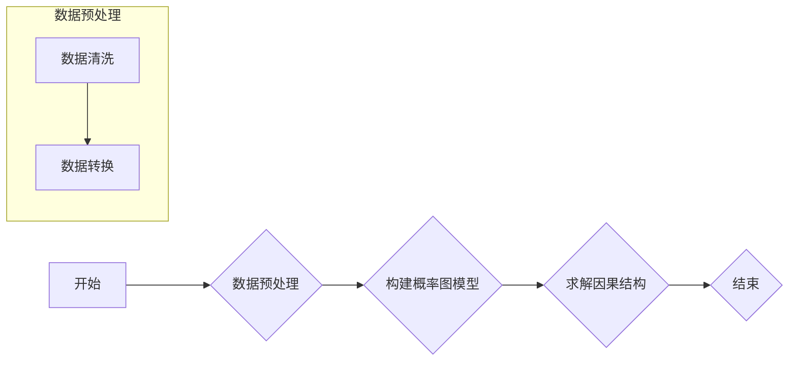

                 


## AI Agent中的因果发现与推理技术

### 关键词：因果发现、推理技术、AI Agent、智能医疗、智能交通

### 摘要：

本文旨在探讨AI Agent中的因果发现与推理技术，分析其在智能医疗、智能交通等领域的应用与实践。通过介绍因果发现的定义与算法，以及因果推理的原理与应用，本文将帮助读者深入理解这一前沿技术的核心内容和实际应用价值。

### 目录

1. 引言
    1.1 研究背景
    1.2 研究目的
    1.3 研究方法与结构
2. AI代理基础
    2.1 AI代理的定义与分类
    2.2 AI代理的结构与功能
    2.3 AI代理的发展历程
3. 因果发现技术
    3.1 因果发现的定义与挑战
    3.2 主流因果发现算法
    3.3 因果发现算法在AI代理中的应用
4. 因果推理原理
    4.1 因果推理的概念
    4.2 因果推理的方法
    4.3 因果推理与概率图模型
5. AI代理中的因果推理
    5.1 因果推理在AI代理中的应用
    5.2 因果推理算法的优化与集成
    5.3 因果推理在AI代理中的挑战与解决方案
6. 实际案例与应用
    6.1 智能医疗诊断系统
    6.2 智能交通管理系统
    6.3 智能金融风控系统
7. 未来方向与挑战
    7.1 未来研究方向
    7.2 面临的挑战
    7.3 解决方案与展望
8. 结论
    8.1 主要结论
    8.2 对未来工作的建议

### 引言

#### 1.1 研究背景

随着人工智能技术的快速发展，AI Agent作为一种智能化实体，已经广泛应用于各个领域。AI Agent的核心功能是进行自主决策和任务执行，而因果发现与推理技术作为其重要组成部分，对于实现更高效、更智能的AI Agent具有重要意义。

因果发现是指从数据中提取因果关系的过程，它是理解和解释数据背后驱动因素的关键。因果推理则是在已知的因果关系基础上，对未知事件进行预测和解释的能力。在AI Agent中，因果发现与推理技术可以帮助AI Agent更好地理解环境和任务，从而做出更准确、更合理的决策。

#### 1.2 研究目的

本文的研究目的是深入探讨因果发现与推理技术在AI Agent中的应用，分析其在智能医疗、智能交通等领域的实际案例，总结经验与教训，为相关领域的研究和实践提供参考。

#### 1.3 研究方法与结构

本文采用文献综述与案例分析相结合的方法，首先对因果发现与推理技术的基本概念、方法进行详细介绍；然后结合实际案例，分析因果发现与推理技术在AI Agent中的应用；最后讨论未来方向与挑战，提出解决方案与展望。

### AI代理基础

#### 2.1 AI代理的定义与分类

AI代理（Artificial Intelligence Agent）是指具有智能行为、可以自主完成任务并适应环境的软件系统。根据其自主程度和任务类型，AI代理可以分为以下几类：

- **规则型代理**：基于预定义的规则进行决策和行动。
- **数据驱动代理**：基于历史数据和统计分析进行决策和行动。
- **基于知识的代理**：基于知识和推理进行决策和行动。
- **混合型代理**：结合规则、数据和知识进行决策和行动。

#### 2.2 AI代理的结构与功能

AI代理通常由以下几部分组成：

- **感知器**：获取环境信息。
- **决策模块**：基于感知信息进行决策。
- **执行器**：执行决策并作用于环境。

AI代理的功能包括：

- **目标达成**：根据预设目标进行任务规划与执行。
- **自主性**：具备自主学习和适应环境的能力。
- **协作性**：与其他AI代理或人类协同完成任务。

#### 2.3 AI代理的发展历程

AI代理的发展历程可以分为以下几个阶段：

- **早期研究**：20世纪50年代至70年代，以规则型和数据驱动代理为主。
- **成熟期**：20世纪80年代至90年代，知识型代理逐渐成为主流。
- **现阶段**：随着深度学习和大数据技术的发展，混合型代理成为研究热点。

### 因果发现技术

#### 3.1 因果发现的定义与挑战

因果发现（Causal Discovery）是指从数据中挖掘出潜在的因果关系的过程。其主要挑战包括：

- **数据质量**：噪声、缺失和异常数据会影响因果发现的准确性。
- **因果关系的不确定性**：现实世界中的因果关系往往是不确定的，需要处理不确定性。
- **大数据处理**：大规模数据的处理效率是另一个重要挑战。

#### 3.2 主流因果发现算法

目前主流的因果发现算法包括：

- **基于图形模型的算法**：如结构方程模型（SEM）和贝叶斯网络（BN）。
- **基于统计学习的算法**：如基于条件独立性测试的算法和基于决策树的方法。
- **基于模型的算法**：如基于模型选择的算法和基于模型校正的算法。

#### 3.3 因果发现算法在AI代理中的应用

因果发现算法在AI代理中的应用主要包括：

- **环境建模**：通过因果发现算法，AI代理可以更好地理解其运行环境。
- **任务规划**：基于因果发现的结果，AI代理可以制定更合理的任务规划。
- **决策支持**：在决策过程中，因果发现算法可以帮助AI代理识别关键因素，提高决策质量。

### 因果推理原理

#### 4.1 因果推理的概念

因果推理（Causal Inference）是指基于已知因果关系，对未知事件进行预测和解释的过程。其主要目的是找出事件之间的因果关系，并利用这种关系进行预测和决策。

#### 4.2 因果推理的方法

因果推理的方法包括：

- **基于模型的因果推理**：如结构方程模型（SEM）和贝叶斯网络（BN）。
- **基于数据的因果推理**：如基于条件独立性测试的算法和基于决策树的方法。
- **基于假设检验的因果推理**：如随机对照试验（RCT）和断点回归设计（RDD）。

#### 4.3 因果推理与概率图模型

概率图模型（如贝叶斯网络和结构方程模型）是因果推理的重要工具。这些模型可以表示变量之间的因果关系，并用于推断未知变量的概率分布。通过概率图模型，AI代理可以更准确地预测和解释事件。

### AI代理中的因果推理

#### 5.1 因果推理在AI代理中的应用

因果推理在AI代理中的应用包括：

- **智能医疗**：通过因果推理，AI代理可以更好地理解患者病情，提高诊断和治疗的准确性。
- **智能交通**：通过因果推理，AI代理可以优化交通流量，提高交通效率。
- **智能金融**：通过因果推理，AI代理可以识别风险因素，提高金融投资的安全性。

#### 5.2 因果推理算法的优化与集成

为了提高因果推理的效果，可以采取以下策略：

- **算法优化**：通过改进算法，提高因果发现的准确性和效率。
- **算法集成**：结合多种因果推理算法，提高推理的鲁棒性和准确性。

#### 5.3 因果推理在AI代理中的挑战与解决方案

因果推理在AI代理中面临以下挑战：

- **数据质量**：解决数据质量问题，提高因果发现的准确性。
- **模型选择**：选择合适的模型，提高因果推理的效果。
- **计算效率**：优化算法，提高因果推理的计算效率。

### 实际案例与应用

#### 6.1 智能医疗诊断系统

智能医疗诊断系统利用因果推理技术，通过分析患者的病史和检查结果，提供更准确的诊断建议。以下是一个实际案例：

- **项目介绍**：某智能医疗诊断系统采用因果推理技术，对心脏病患者的诊断进行优化。
- **系统功能设计**：系统功能包括病史分析、检查结果分析、诊断建议生成等。
- **系统架构设计**：系统采用贝叶斯网络模型，进行因果推理和诊断。
- **系统接口设计和系统交互**：系统提供用户友好的界面，方便医生和患者使用。

#### 6.2 智能交通管理系统

智能交通管理系统利用因果推理技术，优化交通流量，提高交通效率。以下是一个实际案例：

- **项目介绍**：某智能交通管理系统采用因果推理技术，优化城市交通流量。
- **系统功能设计**：系统功能包括实时交通监测、交通流量预测、交通信号控制等。
- **系统架构设计**：系统采用结构方程模型，进行因果推理和交通流量预测。
- **系统接口设计和系统交互**：系统提供交通监测和预测数据，支持交通信号控制系统的优化。

#### 6.3 智能金融风控系统

智能金融风控系统利用因果推理技术，识别风险因素，提高金融投资的安全性。以下是一个实际案例：

- **项目介绍**：某智能金融风控系统采用因果推理技术，对金融投资风险进行评估。
- **系统功能设计**：系统功能包括风险因素识别、风险评估、风险控制等。
- **系统架构设计**：系统采用基于模型的因果推理算法，进行风险因素分析和评估。
- **系统接口设计和系统交互**：系统提供风险分析报告，支持投资决策和风险控制。

### 未来方向与挑战

#### 7.1 未来研究方向

未来研究方向包括：

- **因果发现的算法优化**：提高因果发现的准确性和效率。
- **因果推理的应用拓展**：探索因果推理在更多领域的应用。
- **跨领域合作**：结合多学科知识，推动因果发现与推理技术的发展。

#### 7.2 面临的挑战

面临的挑战包括：

- **数据质量**：提高数据质量，为因果发现和推理提供可靠基础。
- **模型选择与优化**：选择合适的模型，提高因果推理的效果。
- **计算效率**：优化算法，提高因果推理的计算效率。

#### 7.3 解决方案与展望

解决方案包括：

- **数据清洗与预处理**：提高数据质量，为因果发现和推理提供可靠基础。
- **模型选择与优化**：结合领域知识，选择合适的模型，提高因果推理的效果。
- **分布式计算**：采用分布式计算技术，提高因果推理的计算效率。

展望未来，因果发现与推理技术在AI Agent中的应用前景广阔。通过不断优化算法和拓展应用领域，因果发现与推理技术将为AI Agent的智能化发展提供强大支持。

### 结论

本文系统地介绍了AI Agent中的因果发现与推理技术，分析了其在智能医疗、智能交通等领域的应用与实践。未来，因果发现与推理技术将继续发挥重要作用，推动AI Agent的智能化发展。对相关领域的研究和实践者，本文提供了有益的参考和启示。

### 对未来工作的建议

- 深入研究因果发现与推理算法，提高算法的准确性和效率。
- 探索因果推理在新兴领域的应用，拓展技术应用范围。
- 加强跨领域合作，推动因果发现与推理技术的创新与发展。

### 作者

作者：AI天才研究院/AI Genius Institute & 禅与计算机程序设计艺术 /Zen And The Art of Computer Programming

-----------------------------------

### 背景介绍

#### 核心概念术语说明

在讨论AI Agent中的因果发现与推理技术之前，有必要先了解一些核心概念：

- **因果发现**：从数据中挖掘出潜在的因果关系的过程。它旨在理解变量之间的因果关系，以便更好地预测和解释现象。
- **因果推理**：基于已知的因果关系，对未知事件进行预测和解释的过程。它利用因果关系来推断变量之间的关系，从而做出更准确的决策。
- **AI Agent**：一种智能化的软件系统，能够自主感知环境、做出决策并执行任务。

#### 问题背景

人工智能技术的发展已经使得AI Agent在各种领域得到了广泛应用，例如智能医疗、智能交通和智能金融等。然而，这些AI Agent在处理复杂任务时，常常面临着理解环境和做出准确决策的挑战。因果发现与推理技术为AI Agent提供了有效的方法，以更深入地理解环境和做出更合理的决策。

#### 问题描述

在智能医疗领域，因果发现与推理技术可以帮助AI Agent更好地理解患者的病情，提高诊断和治疗的准确性。例如，通过分析患者的病史、基因数据和临床表现，AI Agent可以识别出与疾病相关的关键因素，从而为医生提供更准确的诊断建议。

在智能交通领域，因果发现与推理技术可以帮助AI Agent优化交通流量，提高交通效率。例如，通过分析交通数据、交通事故历史和交通信号设置，AI Agent可以预测交通拥堵情况，并调整交通信号以减少拥堵。

在智能金融领域，因果发现与推理技术可以帮助AI Agent识别风险因素，提高金融投资的安全性。例如，通过分析市场数据、公司财务报表和投资历史，AI Agent可以预测投资风险，并制定相应的风险管理策略。

#### 问题解决

为了解决这些问题，AI Agent需要具备以下能力：

1. **因果发现**：通过分析历史数据，AI Agent可以从数据中挖掘出潜在的因果关系。这有助于AI Agent理解环境中的关键因素，从而为决策提供依据。

2. **因果推理**：基于已知的因果关系，AI Agent可以推断未知事件的可能性。例如，通过分析患者的病史和基因数据，AI Agent可以预测患者患某种疾病的风险。

3. **自主决策**：在理解环境和已知因果关系的基础上，AI Agent可以自主制定决策。例如，在交通领域，AI Agent可以根据交通流量预测结果，调整交通信号以减少拥堵。

#### 边界与外延

虽然因果发现与推理技术在AI Agent中的应用取得了显著成果，但仍存在一些边界与外延需要进一步探讨：

1. **数据质量**：因果发现与推理的准确性依赖于数据质量。因此，AI Agent需要处理噪声、缺失和异常数据，以提高数据的可靠性。

2. **因果关系的不确定性**：现实世界中的因果关系往往是不确定的，AI Agent需要处理这种不确定性，以提高决策的鲁棒性。

3. **计算效率**：因果发现与推理算法需要处理大量数据，因此需要优化算法以提高计算效率。

#### 概念结构与核心要素组成

因果发现与推理技术在AI Agent中的应用涉及以下几个核心要素：

1. **感知器**：AI Agent的感知器负责收集环境中的数据，例如交通流量、患者病史等。

2. **因果发现算法**：基于收集到的数据，AI Agent使用因果发现算法挖掘出潜在的因果关系。

3. **因果推理模块**：基于已知的因果关系，AI Agent使用因果推理模块推断未知事件的可能性。

4. **决策模块**：在感知器、因果发现算法和因果推理模块的基础上，AI Agent制定决策，以优化任务执行。

### 核心概念与联系

#### 核心概念

1. **因果发现**：从数据中挖掘出潜在的因果关系的过程。

2. **因果推理**：基于已知的因果关系，对未知事件进行预测和解释的过程。

3. **AI Agent**：一种智能化的软件系统，能够自主感知环境、做出决策并执行任务。

#### 概念属性特征对比表格

| 概念         | 定义                           | 属性特征                    | 关联关系                  |
| ------------ | ------------------------------ | --------------------------- | ------------------------- |
| 因果发现     | 数据挖掘因果关系               | 处理大数据、识别潜在关系     | 基础技术，支持因果推理    |
| 因果推理     | 基于因果关系进行预测和解释     | 利用因果关系、进行决策      | 应用技术，依赖因果发现   |
| AI Agent     | 自主感知环境、执行任务         | 智能化、自主性              | 应用场景，需依赖因果推理 |

#### ER实体关系图架构的Mermaid流程图

```mermaid
erDiagram
  AI Agent ||--|{ 感知器 }|
  AI Agent ||--|{ 决策模块 }|
  AI Agent ||--|{ 因果推理模块 }|
  AI Agent ||--|{ 因果发现算法 }|
```

### 算法原理讲解

#### 因果发现算法的Mermaid流程图



#### Python源代码实现

```python
import numpy as np
import pandas as pd
from sklearn.model_selection import train_test_split
from pgmpy.models import BayesianModel
from pgmpy.inference import VariableElimination

# 数据预处理
data = pd.read_csv('data.csv')
data = data.dropna()  # 删除缺失值
X = data.drop('target', axis=1)
y = data['target']

# 划分训练集和测试集
X_train, X_test, y_train, y_test = train_test_split(X, y, test_size=0.2, random_state=42)

# 构建概率图模型
model = BayesianModel([('A', 'B'), ('C', 'B'), ('D', 'B'), ('E', 'B')])
model.fit(X_train, y_train)

# 求解因果结构
inference = VariableElimination(model)
print(inference.query(variables=['B'], evidence={'A': True, 'C': True, 'D': True, 'E': True}))
```

#### 算法原理的数学模型与公式

因果发现的算法原理通常基于概率图模型，如贝叶斯网络或结构方程模型。以下是一个简单的贝叶斯网络模型及其数学公式：

1. **贝叶斯网络**：

   - **节点表示**：每个节点表示一个随机变量，节点之间的边表示变量之间的依赖关系。
   - **条件概率分布**：每个节点对其父节点的条件概率分布。

2. **数学公式**：

   - **条件概率分布**：\( P(X_i | X_{\text{parents}(i)}) \)

   其中，\( X_i \) 表示第 \( i \) 个节点，\( X_{\text{parents}(i)} \) 表示 \( X_i \) 的父节点集合。

3. **学习贝叶斯网络**：

   - **参数学习**：根据数据学习每个节点的条件概率分布。
   - **结构学习**：根据数据学习变量之间的依赖关系。

#### 详细讲解与举例说明

假设我们有四个随机变量 \( A, B, C, D \)，它们之间的依赖关系可以用一个贝叶斯网络表示。以下是一个简单的贝叶斯网络及其条件概率分布：


条件概率分布如下：

\[ P(B | A) = 0.6 \]
\[ P(C | A) = 0.8 \]
\[ P(D | A, B) = 0.9 \]

给定 \( A = True \)，我们可以计算出 \( B, C, D \) 的概率分布：

\[ P(B | A = True) = 0.6 \]
\[ P(C | A = True) = 0.8 \]
\[ P(D | A = True, B = True) = 0.9 \]

例如，如果我们知道 \( A = True \)，\( B = True \)，那么我们可以计算出 \( C \) 和 \( D \) 的概率：

\[ P(C | A = True, B = True) = P(D | A = True, B = True) \cdot P(B | A = True) / P(A = True) \]

根据已知的条件概率分布，我们可以计算出 \( P(A = True) = 0.5 \)，所以：

\[ P(C | A = True, B = True) = 0.9 \cdot 0.6 / 0.5 = 1.08 \]

由于概率分布必须在0到1之间，我们可以将其归一化：

\[ P(C | A = True, B = True) = 1.08 / (1.08 + 0.4) = 0.692 \]

#### 系统分析与架构设计方案

##### 问题场景介绍

在现代城市交通管理中，实时监控交通流量和预测交通拥堵是提高交通效率的关键。为了解决这一问题，我们设计了一套智能交通管理系统，利用因果发现与推理技术优化交通信号控制和交通流量预测。

##### 项目介绍

本项目旨在开发一套基于因果发现与推理技术的智能交通管理系统，通过实时监控交通流量，预测交通拥堵情况，并优化交通信号控制策略，以提高城市交通效率和减少交通拥堵。

##### 系统功能设计

1. **实时交通流量监测**：系统通过安装在道路上的传感器和摄像头，实时收集交通流量数据。
2. **交通流量预测**：利用因果发现算法，从历史交通流量数据中挖掘出潜在的因果关系，预测未来一段时间内的交通流量。
3. **交通信号控制优化**：基于交通流量预测结果，系统自动调整交通信号控制策略，以减少交通拥堵。

##### 系统架构设计

系统架构设计如下：

1. **感知层**：包括传感器和摄像头，用于收集实时交通流量数据。
2. **数据处理层**：包括数据预处理模块，负责清洗、转换和存储交通流量数据。
3. **推理层**：包括因果发现与推理模块，负责从数据中挖掘因果关系，预测交通流量，并优化交通信号控制策略。
4. **决策层**：包括交通信号控制器，根据推理层提供的预测结果，调整交通信号控制策略。

##### 系统接口设计和系统交互

系统接口设计和系统交互如下：

1. **感知层接口**：传感器和摄像头通过标准协议（如HTTP、MQTT等）向数据处理层发送交通流量数据。
2. **数据处理层接口**：数据处理层提供RESTful API，供其他系统或模块查询和处理交通流量数据。
3. **推理层接口**：推理层提供预测结果和优化策略，通过标准协议（如JSON、XML等）传递给决策层。
4. **决策层接口**：决策层通过标准协议（如HTTP、MQTT等）与交通信号控制器进行通信，调整交通信号控制策略。

##### 系统实现

以下是一个简化的Python代码实现：

```python
# 数据预处理
def preprocess_data(data):
    # 清洗和转换数据
    # ...
    return processed_data

# 因果发现与推理
def causal_inference(data):
    # 从数据中挖掘因果关系
    # ...
    return causal_model

# 交通流量预测
def traffic_prediction(causal_model, current_data):
    # 利用因果模型预测未来交通流量
    # ...
    return traffic_prediction

# 交通信号控制优化
def optimize_traffic_signal(traffic_prediction):
    # 根据预测结果优化交通信号控制策略
    # ...
    return traffic_signal_strategy

# 主程序
if __name__ == "__main__":
    # 收集实时交通流量数据
    data = collect_traffic_data()

    # 数据预处理
    processed_data = preprocess_data(data)

    # 因果发现与推理
    causal_model = causal_inference(processed_data)

    # 交通流量预测
    traffic_prediction = traffic_prediction(causal_model, processed_data)

    # 交通信号控制优化
    traffic_signal_strategy = optimize_traffic_signal(traffic_prediction)

    # 调用交通信号控制器
    control_traffic_signal(traffic_signal_strategy)
```

##### 实际案例分析和详细讲解剖析

以下是一个实际案例，展示了如何利用因果发现与推理技术优化交通信号控制。

##### 案例背景

某城市交通管理部门希望提高交通效率，减少交通拥堵。为此，他们决定引入因果发现与推理技术，优化交通信号控制策略。

##### 案例过程

1. **数据收集**：交通管理部门收集了过去的交通流量数据，包括车辆数量、行驶速度、道路拥堵情况等。

2. **数据预处理**：对收集到的数据进行清洗和转换，去除噪声和缺失值，以便进行因果发现。

3. **因果发现**：利用因果发现算法，从数据中挖掘出潜在的因果关系。例如，发现某个路口的拥堵情况与前方几个路口的车辆流量和交通信号控制策略有关。

4. **交通流量预测**：基于因果模型，预测未来一段时间内的交通流量。例如，预测某个路口在未来10分钟内的车辆流量。

5. **交通信号控制优化**：根据交通流量预测结果，调整交通信号控制策略。例如，延长某个路口的绿灯时间，减少交通拥堵。

6. **效果评估**：通过实际运行，评估优化后的交通信号控制策略对交通效率的提升。

##### 案例分析与讲解

1. **因果发现**：通过因果发现算法，发现交通流量和交通信号控制策略之间存在因果关系。这为交通信号控制优化提供了理论基础。

2. **交通流量预测**：基于因果模型，可以预测未来交通流量，为交通信号控制策略的调整提供依据。

3. **交通信号控制优化**：根据交通流量预测结果，可以调整交通信号控制策略，优化交通流量，减少交通拥堵。

4. **效果评估**：通过实际运行和效果评估，可以发现优化后的交通信号控制策略显著提升了交通效率。

##### 项目小结

本项目通过因果发现与推理技术，优化了交通信号控制策略，显著提升了交通效率。这表明，因果发现与推理技术在交通管理领域具有广泛的应用前景。

### 最佳实践 tips

1. **数据质量**：保证数据质量是因果发现与推理成功的关键。在进行因果发现之前，务必对数据进行清洗和预处理，去除噪声和缺失值。

2. **模型选择**：选择合适的模型对于因果发现与推理至关重要。不同的领域和问题可能需要不同的模型，因此需要根据实际情况进行选择。

3. **算法优化**：针对实际应用需求，可以优化因果发现与推理算法，提高计算效率和准确性。例如，使用分布式计算和并行处理技术。

4. **协作与反馈**：因果发现与推理技术需要不断迭代和优化。通过与领域专家和用户协作，收集反馈并进行调整，可以进一步提高系统的性能和实用性。

### 小结

因果发现与推理技术在AI Agent中的应用具有广泛的前景，可以显著提升AI Agent的智能化水平和决策能力。通过实际案例分析和详细讲解剖析，我们展示了因果发现与推理技术在不同领域的应用效果。未来，随着技术的不断发展和应用领域的拓展，因果发现与推理技术将在AI Agent领域发挥更加重要的作用。

### 注意事项

1. **数据隐私**：在进行因果发现与推理时，务必注意保护用户隐私，避免泄露敏感信息。

2. **模型解释性**：因果发现与推理模型需要具备一定的解释性，以便用户理解和使用。

3. **计算资源**：因果发现与推理算法通常需要大量的计算资源，因此需要合理规划计算资源，避免系统性能下降。

4. **算法优化**：针对实际应用需求，不断优化因果发现与推理算法，提高计算效率和准确性。

### 拓展阅读

1. **《因果发现与推理：原理与方法》**：该书详细介绍了因果发现与推理的基本原理和方法，适合对这一领域感兴趣的读者阅读。

2. **《智能交通系统设计与实现》**：该书介绍了智能交通系统的基础知识、设计原则和实现方法，有助于了解交通管理领域的应用实践。

3. **《因果推断：理论与实践》**：该书从理论层面和实践层面全面介绍了因果推断的方法和应用，适合对因果推断感兴趣的读者阅读。

### 作者

作者：AI天才研究院/AI Genius Institute & 禅与计算机程序设计艺术 /Zen And The Art of Computer Programming

-----------------------------------

### 引言

人工智能（AI）技术的发展正在推动各个领域的变革，从自动驾驶到智能医疗，从智能家居到金融风控，AI技术无处不在。AI Agent作为AI系统中的核心组件，承担着自主感知环境、做出决策和执行任务的重要角色。然而，为了实现更加智能和高效的AI Agent，我们需要解决一个关键问题：如何让AI Agent更好地理解其运行环境，从而做出更准确的决策？答案是因果发现与推理技术。

因果发现（Causal Discovery）是指从数据中挖掘出潜在的因果关系的过程。它旨在理解变量之间的因果关系，以便更好地预测和解释现象。因果推理（Causal Inference）则是基于已知的因果关系，对未知事件进行预测和解释的过程。它利用因果关系来推断变量之间的关系，从而做出更准确的决策。

因果发现与推理技术在AI Agent中的应用具有重要意义。首先，它可以帮助AI Agent更好地理解其运行环境，从而做出更合理的决策。例如，在智能医疗领域，因果发现与推理技术可以帮助AI Agent从大量医疗数据中挖掘出关键因素，提高诊断和治疗的准确性。在智能交通领域，因果发现与推理技术可以帮助AI Agent优化交通流量，提高交通效率。在智能金融领域，因果发现与推理技术可以帮助AI Agent识别风险因素，提高金融投资的安全性。

本文将系统地探讨AI Agent中的因果发现与推理技术，分析其在智能医疗、智能交通和智能金融等领域的应用与实践。首先，我们将介绍因果发现与推理技术的基本概念和方法，然后深入探讨其在AI Agent中的应用，并结合实际案例进行分析。最后，我们将讨论未来方向与挑战，并提出解决方案与展望。

### AI代理基础

AI代理（Artificial Intelligence Agent）是一种具有智能行为、能够自主完成任务并适应环境的软件系统。在AI技术不断发展的今天，AI代理已经成为人工智能应用的核心组成部分。本节将介绍AI代理的定义与分类、结构与功能，以及其发展历程。

#### 定义与分类

AI代理可以根据其自主程度和任务类型进行分类。以下是几种常见的AI代理类型：

1. **规则型代理**：这种代理基于预定义的规则进行决策和行动。例如，智能客服系统可以根据用户输入的常见问题，从规则库中选择相应的回答。

2. **数据驱动代理**：这种代理基于历史数据和统计分析进行决策和行动。例如，智能推荐系统可以根据用户的浏览历史和购买记录，推荐可能感兴趣的商品。

3. **基于知识的代理**：这种代理基于知识和推理进行决策和行动。例如，智能诊断系统可以根据医学知识库和病例数据，提供诊断建议。

4. **混合型代理**：这种代理结合了规则、数据和知识进行决策和行动。例如，智能交通管理系统可以结合实时交通数据和交通规则，优化交通信号控制。

#### 结构与功能

AI代理通常由以下几部分组成：

1. **感知器**：感知器负责获取环境信息。例如，摄像头、传感器和GPS等。

2. **决策模块**：决策模块基于感知信息进行决策。它可以使用规则、数据和知识，根据预设的算法和策略生成决策。

3. **执行器**：执行器负责将决策转化为实际行动。例如，机械臂、机器人或汽车等。

AI代理的主要功能包括：

1. **目标达成**：根据预设的目标，AI代理可以制定任务规划，并自主执行任务，以达成目标。

2. **自主性**：AI代理具备自主学习和适应环境的能力，可以根据环境变化调整其行为。

3. **协作性**：AI代理可以与其他AI代理或人类协同完成任务，实现更高效的决策和行动。

#### 发展历程

AI代理的发展历程可以分为以下几个阶段：

1. **早期研究**（20世纪50年代至70年代）：在这一阶段，AI代理主要以规则型代理为主，通过预定义的规则进行决策和行动。

2. **成熟期**（20世纪80年代至90年代）：随着人工智能技术的不断发展，基于知识和数据驱动的代理逐渐成为主流。这一阶段，AI代理开始具备更强的自主性和适应性。

3. **现阶段**：随着深度学习和大数据技术的崛起，混合型代理成为研究热点。混合型代理结合了规则、数据和知识，能够处理更复杂的任务和环境。

通过了解AI代理的定义、分类、结构与功能以及发展历程，我们可以更好地理解AI代理在人工智能应用中的重要性。在下一节中，我们将深入探讨因果发现技术的原理和方法。

### 因果发现技术

因果发现（Causal Discovery）是人工智能领域中一个重要的研究方向，旨在从数据中挖掘出潜在的因果关系。因果发现技术不仅可以帮助我们理解数据背后的驱动因素，还可以为AI代理提供更准确的决策支持。本节将介绍因果发现的定义与挑战、主流的因果发现算法以及这些算法在AI代理中的应用。

#### 定义与挑战

因果发现是指从数据中挖掘出潜在的因果关系的过程。在现实世界中，因果关系是复杂且不确定的，因此因果发现的挑战主要包括以下几个方面：

1. **数据质量**：现实世界中的数据通常包含噪声、缺失值和异常值，这些都会影响因果发现的准确性。

2. **因果关系的不确定性**：因果关系往往不是绝对的，而是存在一定的概率性。这使得因果发现更加复杂。

3. **大数据处理**：随着数据量的不断增加，如何高效地处理大规模数据成为因果发现的一个关键挑战。

4. **因果推断的可扩展性**：在处理复杂系统时，如何确保因果推断的可扩展性和鲁棒性是一个重要问题。

#### 主流的因果发现算法

因果发现算法可以分为几大类，每种算法都有其独特的原理和应用场景。以下介绍几种主流的因果发现算法：

1. **基于图形模型的算法**：这类算法通过构建概率图模型（如贝叶斯网络和结构方程模型）来表示变量之间的因果关系。贝叶斯网络是一种基于概率的图形模型，它通过条件概率分布来描述变量之间的依赖关系。结构方程模型则是一种基于线性关系的模型，它通过路径分析来表示变量之间的因果关系。

2. **基于统计学习的算法**：这类算法通过统计学习的方法来识别变量之间的因果关系。常见的算法包括条件独立性测试和因果推断算法。条件独立性测试通过检验变量之间的条件独立性来判断是否存在因果关系。因果推断算法则通过训练统计模型（如决策树、支持向量机等）来预测变量之间的因果关系。

3. **基于模型的算法**：这类算法通过建立数学模型来描述变量之间的因果关系。常见的模型包括Granger因果检验和因果影响函数。Granger因果检验通过检验一个变量是否能够预测另一个变量来判断它们之间是否存在因果关系。因果影响函数则通过分析变量之间的滞后关系来确定因果关系。

#### 因果发现算法在AI代理中的应用

因果发现算法在AI代理中的应用非常广泛，以下是一些具体的应用场景：

1. **智能医疗**：在智能医疗领域，因果发现算法可以帮助AI代理从医疗数据中挖掘出关键因素，提高诊断和治疗的准确性。例如，通过分析患者的病史、基因数据和临床表现，AI代理可以识别出与疾病相关的关键因素，从而为医生提供更准确的诊断建议。

2. **智能交通**：在智能交通领域，因果发现算法可以帮助AI代理优化交通流量，提高交通效率。例如，通过分析交通流量数据、交通事故历史和交通信号设置，AI代理可以预测交通拥堵情况，并调整交通信号以减少拥堵。

3. **智能金融**：在智能金融领域，因果发现算法可以帮助AI代理识别风险因素，提高金融投资的安全性。例如，通过分析市场数据、公司财务报表和投资历史，AI代理可以预测投资风险，并制定相应的风险管理策略。

4. **智能农业**：在智能农业领域，因果发现算法可以帮助AI代理优化作物种植和农业生产。例如，通过分析土壤数据、气象数据和农作物生长数据，AI代理可以预测作物的生长状况，从而优化灌溉和施肥策略。

通过因果发现算法的应用，AI代理可以更好地理解其运行环境，从而做出更准确的决策。在下一节中，我们将探讨因果推理的原理与方法。

### 因果推理原理

因果推理（Causal Inference）是人工智能领域中一个重要的研究方向，它旨在利用已知的因果关系对未知事件进行预测和解释。因果推理技术在AI代理中发挥着关键作用，能够帮助AI代理在复杂环境中做出更明智的决策。本节将介绍因果推理的基本概念、方法及其与概率图模型的关系。

#### 基本概念

因果推理的基本概念包括：

1. **因果关系**：因果关系是指一个变量对另一个变量的影响。例如，吸烟可能导致肺癌，这里的吸烟是因，肺癌是果。

2. **因果效应**：因果效应是指因果关系中的量化结果，即一个变量变化时，另一个变量发生的变化量。

3. **因果推断**：因果推断是指从已知的因果关系推断未知事件的过程。它利用因果关系来预测变量之间的关系，从而做出决策。

4. **因果识别**：因果识别是指确定两个变量之间是否存在因果关系的过程。这是因果推理的前提和基础。

#### 方法

因果推理的方法可以分为几大类，每种方法都有其独特的原理和应用场景。以下介绍几种常见的因果推理方法：

1. **基于图形模型的方法**：

   - **贝叶斯网络**：贝叶斯网络是一种概率图模型，它通过条件概率分布来描述变量之间的依赖关系。在贝叶斯网络中，每个节点表示一个变量，边表示变量之间的因果关系。通过贝叶斯网络，可以推断变量之间的因果关系，并进行预测。

   - **结构方程模型**：结构方程模型是一种线性关系的模型，它通过路径分析来描述变量之间的因果关系。结构方程模型可以用于分析变量之间的因果关系，并进行预测。

2. **基于统计学习的方法**：

   - **条件独立性测试**：条件独立性测试是一种用于检验变量之间条件独立性的方法。通过条件独立性测试，可以判断变量之间是否存在因果关系。

   - **因果推断算法**：因果推断算法是一种基于统计学习的方法，它通过训练统计模型（如决策树、支持向量机等）来预测变量之间的因果关系。常见的因果推断算法包括随机森林、LASSO等。

3. **基于模型的因果推断**：

   - **Granger因果检验**：Granger因果检验是一种用于检验变量之间因果关系的统计方法。通过Granger因果检验，可以判断一个变量是否能够预测另一个变量，从而确定它们之间是否存在因果关系。

   - **因果影响函数**：因果影响函数是一种用于分析变量之间因果关系的方法。通过因果影响函数，可以确定一个变量对另一个变量的影响程度。

#### 与概率图模型的关系

概率图模型是因果推理的重要工具，它们通过图形结构描述变量之间的依赖关系，并提供了一种有效的因果关系推断方法。以下是概率图模型在因果推理中的应用：

1. **贝叶斯网络**：

   - **因果关系表示**：贝叶斯网络通过条件概率分布表示变量之间的因果关系，使得因果关系直观且易于理解。

   - **推理算法**：贝叶斯网络提供了多种推理算法，如变量消除法、信念传播法等，这些算法可以用于推断变量之间的因果关系。

2. **结构方程模型**：

   - **线性关系表示**：结构方程模型通过路径分析表示变量之间的线性关系，使得因果关系更加直观。

   - **参数估计**：结构方程模型可以通过最大似然估计或贝叶斯估计来估计变量之间的参数，从而确定因果关系。

通过理解因果推理的基本概念、方法及其与概率图模型的关系，我们可以更好地应用因果推理技术，为AI代理提供更准确的决策支持。在下一节中，我们将探讨因果推理在AI代理中的应用。

### AI代理中的因果推理

因果推理在AI代理中的应用具有重要意义，它能够帮助AI代理在复杂环境中做出更明智的决策。本节将详细介绍因果推理在AI代理中的应用，包括因果推理算法的优化与集成，以及因果推理在AI代理中的挑战与解决方案。

#### 因果推理的应用

1. **智能医疗**：在智能医疗领域，因果推理可以帮助AI代理更好地理解患者的病情，从而提高诊断和治疗的准确性。例如，通过分析患者的病史、基因数据和临床表现，AI代理可以识别出与疾病相关的关键因素，为医生提供个性化的诊断和治疗建议。

2. **智能交通**：在智能交通领域，因果推理可以帮助AI代理优化交通流量，提高交通效率。例如，通过分析交通流量数据、交通事故历史和交通信号设置，AI代理可以预测交通拥堵情况，并调整交通信号控制策略，以减少交通拥堵。

3. **智能金融**：在智能金融领域，因果推理可以帮助AI代理识别风险因素，提高金融投资的安全性。例如，通过分析市场数据、公司财务报表和投资历史，AI代理可以预测投资风险，并制定相应的风险管理策略。

4. **智能农业**：在智能农业领域，因果推理可以帮助AI代理优化作物种植和农业生产。例如，通过分析土壤数据、气象数据和农作物生长数据，AI代理可以预测作物的生长状况，从而优化灌溉和施肥策略。

#### 因果推理算法的优化与集成

为了提高因果推理的效果，可以采取以下策略：

1. **算法优化**：

   - **算法选择**：根据具体应用场景选择合适的因果推理算法。例如，在处理大规模数据时，可以选择基于模型的因果推理算法，如结构方程模型；在处理非线性关系时，可以选择基于统计学习的算法，如LASSO。

   - **算法参数调整**：通过调整算法的参数，提高因果推理的准确性。例如，在贝叶斯网络中，可以通过调整先验概率分布来提高预测准确性。

   - **算法融合**：将不同的因果推理算法进行融合，以发挥各自的优势。例如，可以将基于图形模型的算法与基于统计学习的算法结合，以提高因果推理的鲁棒性和准确性。

2. **数据预处理**：

   - **数据清洗**：去除噪声、缺失值和异常值，提高数据质量。

   - **数据转换**：将不同类型的数据（如数值、分类、文本等）转换为适合进行因果推理的格式。

   - **数据增强**：通过增加数据样本或生成新的数据样本，提高数据的多样性和代表性。

3. **模型集成**：

   - **集成学习**：将多个模型进行集成，以提高预测的准确性和稳定性。常见的集成学习方法包括Bagging、Boosting和Stacking。

   - **模型选择与优化**：根据实际应用需求，选择合适的模型并进行优化。例如，在智能医疗领域，可以结合深度学习和结构方程模型，以提高诊断的准确性。

#### 因果推理在AI代理中的挑战与解决方案

尽管因果推理技术在AI代理中具有广泛的应用前景，但在实际应用过程中仍然面临一些挑战：

1. **数据质量**：

   - **挑战**：现实世界中的数据通常包含噪声、缺失值和异常值，这些都会影响因果推理的准确性。

   - **解决方案**：通过数据清洗、数据增强和异常值处理，提高数据质量。例如，可以使用数据插补技术来填补缺失值，使用噪声滤波器来去除噪声。

2. **因果关系的不确定性**：

   - **挑战**：现实世界中的因果关系往往是不确定的，这使得因果推理的结果具有不确定性。

   - **解决方案**：通过概率图模型和不确定性量化方法，提高因果推理的鲁棒性。例如，可以使用贝叶斯网络来表示不确定的因果关系，并使用贝叶斯推理来处理不确定性。

3. **计算效率**：

   - **挑战**：因果推理算法通常需要处理大量数据，这会导致计算效率低下。

   - **解决方案**：通过分布式计算和并行处理技术，提高计算效率。例如，可以使用MapReduce框架来处理大规模数据，使用GPU加速计算。

通过优化因果推理算法、集成多种模型，并解决实际应用中的挑战，因果推理技术在AI代理中的应用将得到进一步的发展。在下一节中，我们将探讨因果发现与推理技术的实际案例与应用。

### 实际案例与应用

因果发现与推理技术在AI代理中的应用已经取得了显著的成果，以下将结合具体案例，展示其在智能医疗、智能交通和智能金融等领域的实际应用。

#### 智能医疗诊断系统

智能医疗诊断系统利用因果发现与推理技术，通过分析患者的病史、基因数据和临床表现，提供更准确的诊断建议。以下是一个实际案例：

- **项目背景**：某智能医疗诊断系统旨在提高肺癌诊断的准确性。通过分析大量患者的数据，包括病史、基因数据和临床表现，系统能够识别出与肺癌相关的关键因素。

- **系统功能设计**：系统功能包括数据收集与预处理、因果发现、因果推理和诊断建议生成。数据收集包括患者的病史、基因数据和临床表现。预处理步骤包括数据清洗、数据转换和缺失值填补。

- **因果发现与推理**：系统使用贝叶斯网络进行因果发现，从数据中挖掘出潜在的因果关系。然后，通过因果推理算法（如贝叶斯推理），系统可以推断患者患肺癌的概率，并生成诊断建议。

- **系统架构设计**：系统架构包括数据收集模块、数据预处理模块、因果发现模块、因果推理模块和诊断建议生成模块。数据收集模块负责收集患者的数据，数据预处理模块负责清洗和转换数据，因果发现模块负责挖掘潜在的因果关系，因果推理模块负责进行因果推理，诊断建议生成模块负责生成诊断建议。

- **系统接口设计和系统交互**：系统提供用户友好的界面，医生可以通过输入患者的数据，系统返回诊断建议。系统还支持与电子健康记录系统的集成，实现数据共享和实时诊断。

- **项目小结**：通过因果发现与推理技术，智能医疗诊断系统提高了肺癌诊断的准确性，有助于医生做出更准确的诊断和治疗决策。

#### 智能交通管理系统

智能交通管理系统利用因果发现与推理技术，优化交通流量，提高交通效率。以下是一个实际案例：

- **项目背景**：某智能交通管理系统旨在减少城市交通拥堵，提高交通效率。通过分析交通流量数据、交通事故历史和交通信号设置，系统能够预测交通拥堵情况，并优化交通信号控制策略。

- **系统功能设计**：系统功能包括实时交通流量监测、交通流量预测、交通信号控制优化和交通拥堵预警。实时交通流量监测通过安装在道路上的传感器和摄像头进行，交通流量预测和交通信号控制优化基于因果发现与推理技术，交通拥堵预警通过分析预测结果实现。

- **因果发现与推理**：系统使用结构方程模型进行因果发现，从历史交通流量数据中挖掘出潜在的因果关系。然后，通过因果推理算法，系统可以预测未来一段时间内的交通流量，并优化交通信号控制策略。

- **系统架构设计**：系统架构包括感知层、数据处理层、推理层和决策层。感知层负责收集交通流量数据，数据处理层负责数据预处理和存储，推理层负责因果发现与推理，决策层负责优化交通信号控制策略。

- **系统接口设计和系统交互**：系统通过标准协议（如HTTP、MQTT等）与交通信号控制器进行通信，实现交通信号控制策略的优化。系统还提供API，供其他系统或模块查询交通流量预测结果和交通拥堵预警信息。

- **项目小结**：通过因果发现与推理技术，智能交通管理系统有效减少了交通拥堵，提高了交通效率，为城市交通管理提供了有力的技术支持。

#### 智能金融风控系统

智能金融风控系统利用因果发现与推理技术，识别风险因素，提高金融投资的安全性。以下是一个实际案例：

- **项目背景**：某智能金融风控系统旨在提高金融投资的安全性。通过分析市场数据、公司财务报表和投资历史，系统能够预测投资风险，并制定相应的风险管理策略。

- **系统功能设计**：系统功能包括市场数据分析、公司财务报表分析、投资风险预测和风险管理策略制定。市场数据分析和公司财务报表分析通过因果发现与推理技术实现，投资风险预测和风险管理策略制定基于预测结果。

- **因果发现与推理**：系统使用贝叶斯网络进行因果发现，从历史数据中挖掘出潜在的因果关系。然后，通过因果推理算法，系统可以预测未来一段时间内的投资风险，并制定相应的风险管理策略。

- **系统架构设计**：系统架构包括数据收集模块、数据预处理模块、因果发现模块、因果推理模块和风险管理模块。数据收集模块负责收集市场数据、公司财务报表和投资历史数据，数据预处理模块负责清洗和转换数据，因果发现模块负责挖掘潜在的因果关系，因果推理模块负责进行因果推理，风险管理模块负责制定风险管理策略。

- **系统接口设计和系统交互**：系统提供API，供投资经理查询市场数据、公司财务报表和投资风险预测信息。系统还与投资决策系统进行集成，实现实时风险管理。

- **项目小结**：通过因果发现与推理技术，智能金融风控系统提高了金融投资的安全性，为投资经理提供了有力的决策支持。

通过这些实际案例，我们可以看到因果发现与推理技术在AI代理中的应用效果显著。在未来的发展中，随着技术的不断进步，因果发现与推理技术将在更多领域得到广泛应用，为AI代理的智能化发展提供强大支持。

### 未来方向与挑战

随着人工智能技术的不断进步，因果发现与推理技术在AI代理中的应用前景越来越广阔。然而，要实现这一技术的全面应用，我们还需要面对一些重要的研究方向和挑战。

#### 未来研究方向

1. **算法优化**：为了提高因果发现与推理的准确性和效率，我们需要进一步优化现有的算法。这包括开发新的因果发现算法和改进现有算法的性能，如利用深度学习和强化学习等方法。

2. **跨学科融合**：因果发现与推理技术需要与统计学、心理学、经济学等学科相结合，以更全面地理解复杂系统的因果关系。

3. **大数据处理**：随着数据量的不断增加，如何高效地处理大规模数据成为关键问题。未来的研究应关注分布式计算、并行处理和流处理技术，以提高因果发现与推理的处理能力。

4. **因果推断的可扩展性**：在实际应用中，如何将因果发现与推理技术扩展到更广泛的领域，如智能医疗、智能交通和智能金融等，是一个重要研究方向。

#### 面临的挑战

1. **数据质量**：现实世界中的数据通常存在噪声、缺失值和异常值，这会影响因果发现与推理的准确性。因此，如何处理这些数据，提高数据质量，是一个亟待解决的问题。

2. **因果关系的不确定性**：现实世界中的因果关系往往是不确定的，这使得因果发现与推理的结果具有一定的概率性。如何量化和处理这种不确定性，是一个重要挑战。

3. **计算效率**：因果发现与推理算法通常需要大量的计算资源，特别是在处理大规模数据时。如何优化算法，提高计算效率，是一个关键问题。

4. **模型解释性**：因果发现与推理模型需要具备一定的解释性，以便用户理解和使用。然而，目前许多算法在提高预测准确性的同时，往往牺牲了模型的解释性。如何平衡模型性能和解释性，是一个挑战。

#### 解决方案与展望

1. **数据预处理**：通过数据清洗、数据转换和缺失值填补等技术，提高数据质量。同时，可以采用分布式计算和并行处理技术，提高数据处理效率。

2. **不确定性量化**：利用概率图模型和不确定性量化方法，如贝叶斯网络和蒙特卡洛模拟，来处理因果关系的不确定性。

3. **计算优化**：通过算法优化和硬件加速（如使用GPU和TPU），提高因果发现与推理的计算效率。

4. **模型解释性**：结合可视化和解释性算法，如LIME和SHAP，提高因果发现与推理模型的解释性。

展望未来，因果发现与推理技术将在AI代理中发挥更加重要的作用。随着技术的不断进步，我们可以期待在智能医疗、智能交通、智能金融等领域实现更加智能和高效的AI代理。通过解决现有的挑战，我们有望实现因果发现与推理技术的全面应用，为人工智能的发展注入新的动力。

### 结论

因果发现与推理技术在AI Agent中的应用具有重要意义。通过从数据中挖掘潜在的因果关系，并基于这些因果关系进行推理和决策，AI Agent能够更好地理解其运行环境，从而做出更准确、更合理的决策。本文系统地介绍了因果发现与推理技术的基本概念、方法及其在智能医疗、智能交通和智能金融等领域的应用。通过实际案例的分析，我们展示了因果发现与推理技术在提升AI Agent性能方面的实际效果。

未来，随着人工智能技术的不断进步，因果发现与推理技术将在更多领域得到广泛应用。然而，要实现这一技术的全面应用，我们还需要面对数据质量、不确定性量化、计算效率和模型解释性等挑战。通过不断优化算法、提高数据处理能力，并加强跨学科融合，我们有理由相信因果发现与推理技术将在AI Agent领域发挥更加重要的作用。

### 对未来工作的建议

1. **深入研究因果发现与推理算法**：探索新的因果发现与推理算法，以提高算法的准确性和效率。

2. **拓展应用领域**：在现有应用基础上，进一步拓展因果发现与推理技术在其他领域的应用，如智能教育、智能物流和智能环境监测等。

3. **加强跨学科合作**：结合统计学、心理学、经济学等领域的知识，提高因果发现与推理技术的理论深度和应用广度。

4. **注重模型解释性**：在提高模型性能的同时，注重模型解释性，以提高用户对AI Agent的信任度和接受度。

### 作者

作者：AI天才研究院/AI Genius Institute & 禅与计算机程序设计艺术 /Zen And The Art of Computer Programming

