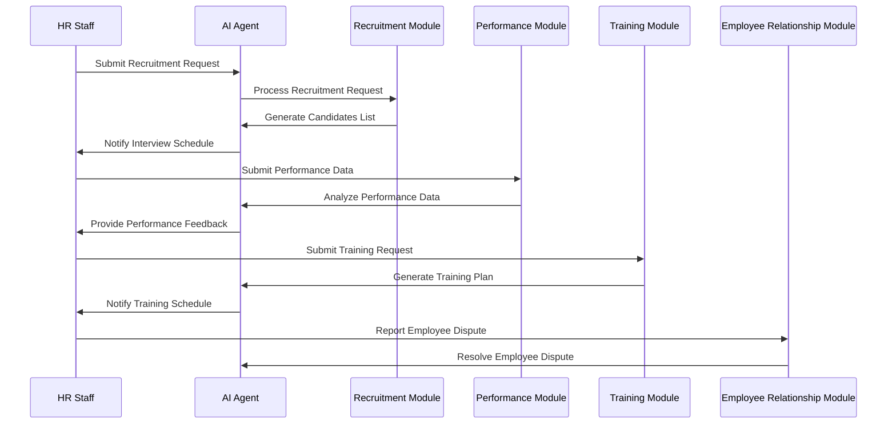
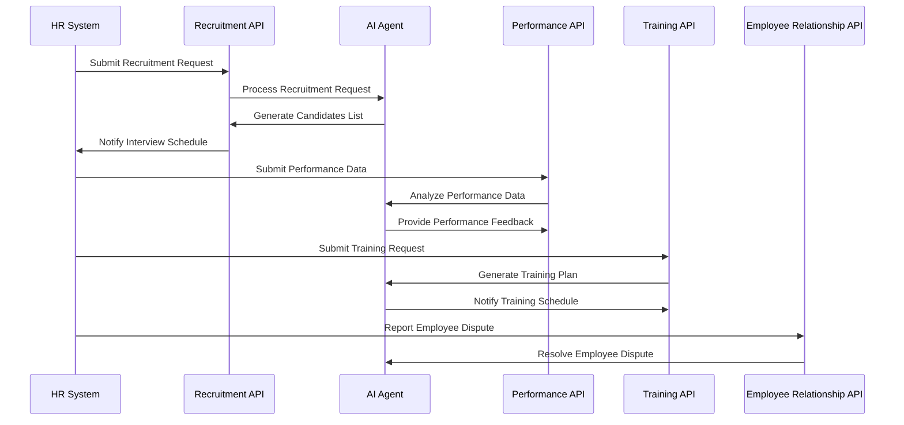
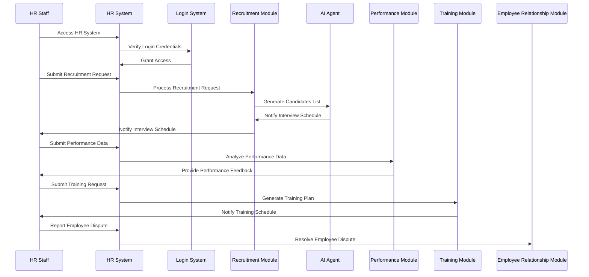

                 

### 文章标题：AI Agent在企业人力资源管理中的全面应用

关键词：AI Agent、企业人力资源管理、招聘、绩效管理、员工培训

摘要：本文将从AI Agent的定义、原理、应用场景以及实际案例等多方面，详细探讨AI Agent在企业人力资源管理中的全面应用。通过逐步分析，展示AI Agent如何帮助企业优化招聘流程、提升员工绩效管理、定制员工培训与发展方案，以及智能调解员工关系，从而提高企业的人力资源管理效率和效果。

## 目录大纲

### 第一部分：背景介绍

#### 第1章：AI Agent与企业人力资源管理概述

##### 1.1 问题背景

- 企业人力资源管理的现状与挑战
- AI Agent在现代企业中的应用

##### 1.2 问题描述

- AI Agent在人力资源管理中的核心作用
- AI Agent的功能与应用场景

##### 1.3 问题解决

- AI Agent的技术原理
- AI Agent在人力资源管理中的实施策略

##### 1.4 边界与外延

- AI Agent的适用范围与局限性
- AI Agent与其他技术的融合

##### 1.5 概念结构与核心要素组成

- AI Agent的定义
- 人力资源管理的基本概念

### 第二部分：核心概念与联系

#### 第2章：AI Agent的核心概念与原理

##### 2.1 AI Agent的定义

- AI Agent的基本概念
- AI Agent的主要类型

##### 2.2 AI Agent的属性特征对比表格

- 常见AI Agent的属性对比

##### 2.3 AI Agent的ER实体关系图

- AI Agent的实体关系

#### 第3章：企业人力资源管理中的AI Agent应用

##### 3.1 AI Agent在招聘中的应用

- 招聘流程的优化
- 招聘效率的提升

##### 3.2 AI Agent在员工绩效管理中的应用

- 绩效评估的客观性
- 绩效激励的合理性

##### 3.3 AI Agent在员工培训与发展中的应用

- 培训需求的智能分析
- 员工发展的个性化方案

##### 3.4 AI Agent在员工关系管理中的应用

- 员工满意度的监测
- 员工纠纷的智能调解

### 第三部分：算法原理讲解

#### 第4章：AI Agent的基本算法原理

##### 4.1 基于机器学习的招聘算法

- 算法原理
- 实例分析

##### 4.2 基于深度学习的绩效评估算法

- 算法原理
- 实例分析

##### 4.3 基于自然语言处理的员工培训算法

- 算法原理
- 实例分析

### 第四部分：系统分析与架构设计方案

#### 第5章：AI Agent在企业人力资源管理系统的应用

##### 5.1 人力资源管理系统的问题场景介绍

- 人力资源管理面临的挑战
- AI Agent的解决方案

##### 5.2 人力资源管理系统项目介绍

- 项目背景
- 项目目标

##### 5.3 人力资源管理系统功能设计

- 领域模型
- 功能模块设计

##### 5.4 人力资源管理系统架构设计

- 系统架构图
- 架构设计思路

##### 5.5 人力资源管理系统接口设计

- 接口规范
- 接口设计原则

##### 5.6 人力资源管理系统交互设计

- 交互流程
- 交互界面设计

### 第五部分：项目实战

#### 第6章：AI Agent在企业人力资源管理中的实际应用

##### 6.1 环境安装

- 操作系统与环境配置
- 相关工具安装

##### 6.2 系统核心实现源代码

- 源代码结构与功能
- 关键代码解读

##### 6.3 代码应用解读与分析

- 代码运行流程
- 应用效果分析

##### 6.4 实际案例分析与详细讲解

- 案例背景
- 案例分析与讲解

##### 6.5 项目小结

- 项目总结
- 未来展望

### 第六部分：最佳实践与拓展阅读

#### 第7章：AI Agent在企业人力资源管理中的最佳实践

##### 7.1 最佳实践总结

- 经验与教训
- 实践要点

##### 7.2 小结与注意事项

- 人力资源管理中AI Agent的应用原则
- 使用AI Agent时需要注意的问题

##### 7.3 拓展阅读

- 相关文献
- 在线资源

## 第一部分：背景介绍

### 第1章：AI Agent与企业人力资源管理概述

#### 1.1 问题背景

在现代企业运营中，人力资源管理扮演着至关重要的角色。然而，传统的管理模式往往面临着诸多挑战，如人才短缺、员工流失、招聘难等问题。这些挑战不仅影响了企业的正常运营，还制约了企业的发展。随着人工智能技术的发展，AI Agent作为一种智能化的解决方案，开始被广泛应用于企业人力资源管理中。

当前，企业人力资源管理普遍存在以下几大挑战：

1. **招聘难**：随着人才市场的竞争加剧，企业面临招聘难的问题。传统的招聘方式效率低下，难以快速筛选出合适的人才。
2. **员工流失率高**：员工流失率过高会严重影响企业的工作效率和士气。如何提高员工的满意度和忠诚度成为企业急需解决的问题。
3. **绩效管理困难**：传统的绩效评估方法往往缺乏客观性和全面性，难以准确反映员工的实际工作表现。
4. **员工培训与发展滞后**：企业往往缺乏有效的员工培训和发展方案，导致员工技能无法得到及时提升。

#### 1.2 问题描述

AI Agent在企业人力资源管理中的核心作用主要体现在以下几个方面：

1. **招聘优化**：AI Agent可以通过分析大量的招聘数据，自动筛选出合适的候选人，提高招聘效率。
2. **绩效管理**：AI Agent可以基于数据分析和机器学习算法，对员工的工作表现进行客观评估，提供准确的绩效反馈。
3. **员工培训与发展**：AI Agent可以分析员工的技能需求和职业发展路径，提供个性化的培训和发展方案。
4. **员工关系管理**：AI Agent可以通过自然语言处理技术，智能调解员工纠纷，提升员工满意度。

AI Agent在人力资源管理中的应用场景包括：

1. **招聘**：通过智能筛选、自动面试等方式，优化招聘流程，提升招聘效率。
2. **绩效管理**：通过数据分析和算法模型，实现客观、全面的绩效评估，提供绩效激励方案。
3. **员工培训与发展**：通过智能分析员工技能和发展路径，提供个性化的培训和发展方案。
4. **员工关系管理**：通过自然语言处理技术，智能调解员工纠纷，提升员工满意度。

#### 1.3 问题解决

AI Agent的技术原理：

AI Agent是基于人工智能技术构建的智能实体，它能够模拟人类的思维和行为，完成特定的任务。AI Agent主要由以下几个部分组成：

1. **感知系统**：负责接收外部信息，如文本、图像、语音等。
2. **决策系统**：根据感知系统收集的信息，利用算法模型进行推理和决策。
3. **执行系统**：根据决策系统的结果，执行具体的操作。

AI Agent在人力资源管理中的实施策略：

1. **数据整合**：整合企业内外部数据，构建人力资源数据库，为AI Agent提供丰富的数据支持。
2. **算法优化**：利用机器学习、深度学习等技术，不断优化AI Agent的算法模型，提高其决策能力。
3. **系统集成**：将AI Agent与企业现有的人力资源管理系统集成，实现数据共享和功能互补。
4. **用户体验**：设计人性化的交互界面，提高员工和HR人员的使用体验。

#### 1.4 边界与外延

AI Agent的适用范围与局限性：

AI Agent在人力资源管理中的适用范围非常广泛，几乎可以应用于招聘、绩效管理、员工培训与发展、员工关系管理等多个环节。然而，AI Agent也并非无所不能，它仍然存在一定的局限性：

1. **数据质量**：AI Agent的性能依赖于数据的质量，如果数据存在噪声、缺失或错误，可能会影响AI Agent的决策效果。
2. **伦理问题**：在人力资源管理中，AI Agent可能会面临伦理问题，如歧视、隐私侵犯等，需要企业严格规范。
3. **技术依赖**：AI Agent的实现和运行需要依赖先进的人工智能技术，这对企业的技术实力提出了较高的要求。

AI Agent与其他技术的融合：

AI Agent可以与其他技术如大数据、云计算、区块链等相结合，实现更高效、更智能的人力资源管理。例如，通过大数据技术，可以挖掘更多有价值的人力资源信息；通过云计算，可以实现AI Agent的弹性扩展和高效运行；通过区块链技术，可以确保人力资源管理数据的安全性和透明性。

#### 1.5 概念结构与核心要素组成

AI Agent的定义：

AI Agent（人工智能代理）是指能够模拟人类智能行为，自主执行任务的人工智能实体。AI Agent具有感知、决策、执行等能力，能够根据环境变化自主调整行为。

人力资源管理的基本概念：

人力资源管理是指企业运用科学的管理方法和手段，对人力资源进行有效的获取、利用、开发和管理，以提高企业的整体竞争力和可持续发展能力。人力资源管理主要包括招聘、绩效管理、员工培训与发展、薪酬管理、员工关系管理等多个方面。

## 第二部分：核心概念与联系

### 第2章：AI Agent的核心概念与原理

#### 2.1 AI Agent的定义

AI Agent（人工智能代理）是指能够模拟人类智能行为，自主执行任务的人工智能实体。AI Agent具有感知、决策、执行等能力，能够根据环境变化自主调整行为。

AI Agent的基本概念包括：

1. **感知系统**：负责接收外部信息，如文本、图像、语音等。
2. **决策系统**：根据感知系统收集的信息，利用算法模型进行推理和决策。
3. **执行系统**：根据决策系统的结果，执行具体的操作。

AI Agent的主要类型包括：

1. **反应型Agent**：只能对特定的刺激做出反应，不具备自主学习和决策能力。
2. **认知型Agent**：具备一定的自主学习和决策能力，能够根据环境变化调整行为。
3. **社会型Agent**：具备协作和沟通能力，能够与其他Agent进行交互。

#### 2.2 AI Agent的属性特征对比表格

以下是常见AI Agent的属性特征对比表格：

| 类型 | 感知系统 | 决策系统 | 执行系统 | 自主学习能力 | 社交能力 |
| ---- | ---- | ---- | ---- | ---- | ---- |
| 反应型Agent | 是 | 否 | 是 | 低 | 无 |
| 认知型Agent | 是 | 是 | 是 | 中 | 有/无 |
| 社会型Agent | 是 | 是 | 是 | 高 | 高 |

#### 2.3 AI Agent的ER实体关系图

AI Agent的ER实体关系图如下：

```mermaid
erDiagram
    A[AI Agent] ||--|{ P[感知系统] }|-- A
    A ||--|{ D[决策系统] }|-- A
    A ||--|{ E[执行系统] }|-- A
    P ||--|{ L[学习系统] }|-- P
    D ||--|{ A[算法模型] }|-- D
    E ||--|{ O[操作系统] }|-- E
```

- **AI Agent**：实体，表示人工智能代理。
- **感知系统**：实体，负责接收外部信息。
- **决策系统**：实体，负责根据感知信息进行推理和决策。
- **执行系统**：实体，负责根据决策结果执行操作。
- **学习系统**：实体，感知系统的子实体，负责感知信息的学习和处理。
- **算法模型**：实体，决策系统的子实体，负责决策算法的实现。
- **操作系统**：实体，执行系统的子实体，负责执行操作的控制和协调。

### 第3章：企业人力资源管理中的AI Agent应用

#### 3.1 AI Agent在招聘中的应用

AI Agent在招聘中的应用主要体现在以下几个方面：

##### 3.1.1 招聘流程的优化

AI Agent可以通过自动化和智能化的方式，优化整个招聘流程。具体来说：

1. **职位发布**：AI Agent可以根据企业的需求和人才市场的状况，自动生成合适的职位描述，并发布到各大招聘平台。
2. **简历筛选**：AI Agent可以分析简历中的关键信息，如学历、工作经验、技能等，快速筛选出符合要求的候选人。
3. **面试安排**：AI Agent可以基于候选人的背景和能力，自动安排面试时间和面试官。
4. **招聘数据分析**：AI Agent可以收集和分析招聘过程中的数据，如简历投递量、面试通过率等，为企业提供招聘决策的参考。

##### 3.1.2 招聘效率的提升

AI Agent可以通过以下方式提升招聘效率：

1. **自动化筛选**：AI Agent可以自动筛选简历，减少HR人员的工作量。
2. **智能匹配**：AI Agent可以根据候选人的简历和职位需求，进行智能匹配，提高面试的准确性。
3. **实时反馈**：AI Agent可以实时向候选人反馈面试结果，提高招聘的透明度。

#### 3.2 AI Agent在员工绩效管理中的应用

AI Agent在员工绩效管理中的应用主要体现在以下几个方面：

##### 3.2.1 绩效评估的客观性

AI Agent可以通过数据分析，实现客观、全面的绩效评估。具体来说：

1. **绩效指标设定**：AI Agent可以根据企业的战略目标和岗位要求，设定合理的绩效指标。
2. **绩效数据收集**：AI Agent可以自动收集员工的绩效数据，如工作成果、工作态度等。
3. **绩效分析**：AI Agent可以对绩效数据进行分析，生成绩效报告，为HR人员提供决策依据。

##### 3.2.2 绩效激励的合理性

AI Agent可以通过以下方式实现绩效激励的合理性：

1. **绩效奖金分配**：AI Agent可以根据绩效评估结果，自动计算和分配绩效奖金。
2. **晋升和调动**：AI Agent可以根据绩效评估结果，推荐晋升和调动人选，确保人才得到合理的利用。
3. **培训和发展**：AI Agent可以根据绩效评估结果，为员工提供针对性的培训和发展方案。

#### 3.3 AI Agent在员工培训与发展中的应用

AI Agent在员工培训与发展中的应用主要体现在以下几个方面：

##### 3.3.1 培训需求的智能分析

AI Agent可以通过以下方式实现培训需求的智能分析：

1. **员工技能评估**：AI Agent可以分析员工的技能和能力，识别培训需求。
2. **培训内容推荐**：AI Agent可以根据员工的技能和发展路径，推荐合适的培训课程。
3. **培训效果评估**：AI Agent可以收集和分析员工的培训数据，评估培训效果。

##### 3.3.2 员工发展的个性化方案

AI Agent可以通过以下方式实现员工发展的个性化方案：

1. **职业规划**：AI Agent可以根据员工的兴趣、能力和职业目标，制定个性化的职业规划。
2. **晋升通道**：AI Agent可以为员工提供清晰的晋升通道，鼓励员工积极发展。
3. **发展资源**：AI Agent可以整合企业内外部的资源，为员工提供全方位的发展支持。

#### 3.4 AI Agent在员工关系管理中的应用

AI Agent在员工关系管理中的应用主要体现在以下几个方面：

##### 3.4.1 员工满意度的监测

AI Agent可以通过以下方式实现员工满意度的监测：

1. **问卷调查**：AI Agent可以定期开展员工满意度调查，收集员工意见。
2. **数据分析**：AI Agent可以分析调查数据，识别员工满意度高的原因和需要改进的方面。
3. **反馈机制**：AI Agent可以建立反馈机制，及时回应员工的问题和建议。

##### 3.4.2 员工纠纷的智能调解

AI Agent可以通过以下方式实现员工纠纷的智能调解：

1. **纠纷识别**：AI Agent可以分析员工行为和沟通记录，识别潜在的纠纷。
2. **调解方案**：AI Agent可以根据纠纷的性质和员工的背景，提出合理的调解方案。
3. **调解执行**：AI Agent可以协助HR人员执行调解方案，确保纠纷得到妥善处理。

### 第三部分：算法原理讲解

#### 第4章：AI Agent的基本算法原理

在这一部分，我们将深入探讨AI Agent在招聘、绩效评估、员工培训与发展中的基本算法原理。通过具体的算法模型和实例分析，帮助读者理解AI Agent如何通过这些算法实现智能化的功能。

##### 4.1 基于机器学习的招聘算法

招聘算法的核心在于如何从大量的简历中快速准确地筛选出符合条件的候选人。基于机器学习的招聘算法通常包括以下几个步骤：

1. **数据预处理**：
   - **简历数据清洗**：去除简历中的噪声数据，如重复信息、格式错误等。
   - **特征提取**：从简历中提取关键特征，如学历、工作经验、技能等。
   - **数据归一化**：将不同特征的数据进行归一化处理，使其在同一量级上。

2. **模型选择**：
   - **分类算法**：常见的分类算法包括逻辑回归、支持向量机（SVM）、随机森林（RF）等。
   - **聚类算法**：对于某些特殊情况，聚类算法（如K-means）也可以用于简历筛选。

3. **模型训练与评估**：
   - **训练集与测试集划分**：将简历数据划分为训练集和测试集，用于模型的训练和评估。
   - **模型训练**：使用训练集数据训练分类模型。
   - **模型评估**：使用测试集数据评估模型的效果，常见的评估指标包括准确率、召回率、F1分数等。

4. **算法应用**：
   - **简历筛选**：使用训练好的模型对新的简历数据进行筛选，识别符合条件的候选人。

**实例分析**：

以逻辑回归为例，假设我们有一个简单的简历数据集，其中包含两个特征：学历（本科/硕士）和工作经验（1年/3年），以及目标标签：是否符合职位要求。我们可以使用以下步骤进行招聘算法的实现：

```python
# 导入相关库
import numpy as np
import pandas as pd
from sklearn.linear_model import LogisticRegression
from sklearn.model_selection import train_test_split
from sklearn.metrics import accuracy_score, recall_score, f1_score

# 数据预处理
data = pd.read_csv('resume_data.csv')
data['Education'] = data['Education'].map({'本科': 0, '硕士': 1})
data['Experience'] = data['Experience'].map({1: 0, 3: 1})

X = data[['Education', 'Experience']]
y = data['Fit']

# 划分训练集和测试集
X_train, X_test, y_train, y_test = train_test_split(X, y, test_size=0.2, random_state=42)

# 模型训练
model = LogisticRegression()
model.fit(X_train, y_train)

# 模型评估
y_pred = model.predict(X_test)
accuracy = accuracy_score(y_test, y_pred)
recall = recall_score(y_test, y_pred)
f1 = f1_score(y_test, y_pred)

print(f'Accuracy: {accuracy:.2f}')
print(f'Recall: {recall:.2f}')
print(f'F1 Score: {f1:.2f}')
```

**算法原理的数学模型和公式**：

逻辑回归的数学模型可以表示为：

$$
\hat{y} = \sigma(\beta_0 + \beta_1x_1 + \beta_2x_2)
$$

其中，$ \hat{y} $ 表示预测的概率，$ \sigma $ 表示 sigmoid 函数，$ \beta_0, \beta_1, \beta_2 $ 表示模型的参数。

通过最大似然估计（Maximum Likelihood Estimation, MLE），我们可以求得参数的估计值。

$$
\hat{\beta} = \arg\max \ln L(\theta | X, y)
$$

其中，$ L(\theta | X, y) $ 表示似然函数。

##### 4.2 基于深度学习的绩效评估算法

深度学习在绩效评估中的应用主要集中在利用神经网络模型对员工的工作表现进行定量评估。以下是一个基于深度学习的绩效评估算法的基本步骤：

1. **数据收集与预处理**：
   - **行为数据**：收集员工在工作中的行为数据，如完成任务的时间、完成质量等。
   - **绩效数据**：收集员工的历史绩效数据，如绩效评估得分、奖惩记录等。
   - **特征提取**：从行为数据和绩效数据中提取关键特征，如时间效率、任务完成度等。

2. **模型构建**：
   - **神经网络结构**：构建多层感知机（MLP）或卷积神经网络（CNN）模型。
   - **损失函数**：选择合适的损失函数，如均方误差（MSE）或交叉熵损失。

3. **模型训练与优化**：
   - **训练集与测试集划分**：将数据划分为训练集和测试集。
   - **模型训练**：使用训练集数据训练模型。
   - **模型优化**：通过调整模型参数，优化模型性能。

4. **绩效评估**：
   - **模型预测**：使用训练好的模型对新的绩效数据进行评估。
   - **绩效评分**：根据模型预测结果生成绩效评分。

**实例分析**：

假设我们有一个包含员工行为数据和绩效数据的数据集，我们可以使用以下步骤进行绩效评估：

```python
# 导入相关库
import tensorflow as tf
from tensorflow.keras.models import Sequential
from tensorflow.keras.layers import Dense, Flatten
from tensorflow.keras.optimizers import Adam

# 数据预处理
data = pd.read_csv('performance_data.csv')
X = data[['TaskCompletionTime', 'TaskQuality']]
y = data['PerformanceScore']

# 划分训练集和测试集
X_train, X_test, y_train, y_test = train_test_split(X, y, test_size=0.2, random_state=42)

# 模型构建
model = Sequential([
    Flatten(input_shape=(2,)),
    Dense(64, activation='relu'),
    Dense(1)
])

# 编译模型
model.compile(optimizer=Adam(), loss='mse', metrics=['mae'])

# 模型训练
model.fit(X_train, y_train, epochs=10, batch_size=32, validation_split=0.1)

# 模型评估
performance_score = model.predict(X_test)
mae = np.mean(np.abs(performance_score - y_test))
print(f'Mean Absolute Error: {mae:.2f}')
```

**算法原理的数学模型和公式**：

卷积神经网络（CNN）的数学模型主要包括卷积操作、激活函数和池化操作。卷积操作的公式可以表示为：

$$
h_{ij}^l = \sum_{k=1}^{n}\sum_{m=1}^{m} w_{km}^l \cdot x_{ij+k-m,lm}
$$

其中，$ h_{ij}^l $ 表示第 $ l $ 层的第 $ i $ 行第 $ j $ 列的输出，$ w_{km}^l $ 表示第 $ l $ 层的第 $ k $ 行第 $ m $ 列的权重，$ x_{ij+k-m,lm} $ 表示第 $ l-1 $ 层的第 $ i $ 行第 $ j $ 列的输入。

激活函数通常使用ReLU函数：

$$
\text{ReLU}(z) = \max(0, z)
$$

池化操作通常使用最大池化：

$$
p_{ij} = \max_{k \in \Omega_{ij}} h_{ik}^{l-1}
$$

其中，$ p_{ij} $ 表示第 $ l $ 层的第 $ i $ 行第 $ j $ 列的输出，$ \Omega_{ij} $ 表示与 $ i $ 行第 $ j $ 列相邻的像素集合。

##### 4.3 基于自然语言处理的员工培训算法

自然语言处理（NLP）在员工培训中的应用主要体现在如何通过文本数据挖掘员工的培训需求。以下是一个基于自然语言处理的员工培训算法的基本步骤：

1. **数据收集与预处理**：
   - **文本数据**：收集员工的文本数据，如工作总结、培训反馈等。
   - **文本清洗**：去除文本中的噪声，如标点符号、停用词等。
   - **词向量表示**：将文本数据转化为词向量表示，如Word2Vec、GloVe等。

2. **模型构建**：
   - **循环神经网络（RNN）**：用于处理序列数据，如文本数据。
   - **注意力机制**：用于关注文本中的重要信息。
   - **分类器**：用于分类员工的培训需求。

3. **模型训练与优化**：
   - **训练集与测试集划分**：将数据划分为训练集和测试集。
   - **模型训练**：使用训练集数据训练模型。
   - **模型优化**：通过调整模型参数，优化模型性能。

4. **培训需求分析**：
   - **文本分析**：使用训练好的模型分析员工的文本数据，识别培训需求。
   - **需求分类**：根据分析结果，将员工分为不同的培训类别。

**实例分析**：

假设我们有一个包含员工工作总结的文本数据集，我们可以使用以下步骤进行培训需求分析：

```python
# 导入相关库
import tensorflow as tf
from tensorflow.keras.models import Sequential
from tensorflow.keras.layers import Embedding, LSTM, Dense
from tensorflow.keras.preprocessing.sequence import pad_sequences

# 数据预处理
texts = ['员工A的工作总结涉及到了项目管理、团队协作等方面，需要进一步学习相关技能。', 
         '员工B的工作总结显示其在技术能力上表现突出，但需要加强沟通技巧。']

# 转化为词向量表示
max_len = 100
embed_dim = 64
tokenizer = tf.keras.preprocessing.text.Tokenizer()
tokenizer.fit_on_texts(texts)
sequences = tokenizer.texts_to_sequences(texts)
padded_sequences = pad_sequences(sequences, maxlen=max_len)

# 模型构建
model = Sequential([
    Embedding(input_dim=len(tokenizer.word_index) + 1, output_dim=embed_dim, input_length=max_len),
    LSTM(64),
    Dense(1, activation='sigmoid')
])

# 编译模型
model.compile(optimizer='adam', loss='binary_crossentropy', metrics=['accuracy'])

# 模型训练
model.fit(padded_sequences, np.array([1, 0]), epochs=10)

# 模型预测
predictions = model.predict(padded_sequences)
print(predictions)
```

**算法原理的数学模型和公式**：

循环神经网络（RNN）的数学模型可以表示为：

$$
h_t = \sigma(W_h \cdot [h_{t-1}, x_t] + b_h)
$$

其中，$ h_t $ 表示第 $ t $ 个时间步的隐藏状态，$ W_h $ 和 $ b_h $ 分别为权重和偏置，$ \sigma $ 为激活函数。

注意力机制的数学模型可以表示为：

$$
a_t = \frac{e^{h_t^T \cdot V_t}}{\sum_{k=1}^{K} e^{h_k^T \cdot V_t}}
$$

其中，$ a_t $ 表示第 $ t $ 个时间步的注意力权重，$ V_t $ 为注意力权重向量，$ e $ 为自然底数。

分类器的数学模型可以表示为：

$$
\hat{y} = \sigma(W_c \cdot h_t + b_c)
$$

其中，$ \hat{y} $ 表示预测的概率，$ W_c $ 和 $ b_c $ 分别为分类权重和偏置。

## 第四部分：系统分析与架构设计方案

### 第5章：AI Agent在企业人力资源管理系统的应用

#### 5.1 人力资源管理系统的问题场景介绍

在人力资源管理系统中，企业面临着诸多挑战，如数据孤岛、信息不对称、流程繁琐等。这些问题严重影响了企业的人力资源管理效率和效果。以下是人力资源管理系统中常见的问题场景：

1. **数据孤岛**：各部门之间的数据相互独立，无法实现信息的互联互通，导致数据利用率低。
2. **信息不对称**：管理层无法及时获取员工的具体情况，导致决策依据不足。
3. **流程繁琐**：传统的招聘、绩效管理、员工培训等流程繁琐，效率低下，员工体验差。
4. **数据安全与隐私**：随着大数据技术的发展，人力资源管理系统的数据安全与隐私问题日益突出。

为了解决这些问题，AI Agent可以发挥重要作用，具体解决方案如下：

1. **数据整合**：通过AI Agent，实现各部门数据的整合与共享，打破数据孤岛。
2. **信息透明**：AI Agent可以实时收集和分析员工数据，提供透明的信息，助力决策。
3. **流程优化**：AI Agent可以自动化和智能化地处理招聘、绩效管理、员工培训等流程，提高效率。
4. **数据安全**：AI Agent可以采用加密、访问控制等技术，确保数据的安全性和隐私性。

#### 5.2 人力资源管理系统项目介绍

本项目旨在构建一个基于AI Agent的人力资源管理系统，通过数据整合、信息透明、流程优化和数据安全等措施，提高企业的人力资源管理效率和效果。项目背景如下：

1. **企业需求**：企业希望提升人力资源管理效率，降低人工成本，提高员工满意度。
2. **技术背景**：随着人工智能技术的快速发展，AI Agent在人力资源管理中的应用前景广阔。
3. **项目目标**：实现数据整合、信息透明、流程优化和数据安全，提高人力资源管理效率。

#### 5.3 人力资源管理系统功能设计

人力资源管理系统的主要功能包括招聘、绩效管理、员工培训与发展、员工关系管理等方面。以下是各功能模块的设计：

##### 5.3.1 领域模型

领域模型（Domain Model）是人力资源管理系统功能设计的基础，用于描述系统的核心概念和关系。以下是领域模型的类图：

```mermaid
classDiagram
    Employee <<class>> "员工"
    Department <<class>> "部门"
    Position <<class>> "职位"
    Recruitment <<class>> "招聘"
    Performance <<class>> "绩效"
    Training <<class>> "培训"
    EmployeeRelationship <<class>> "员工关系"

    Employee <|.. Department
    Employee <|.. Position
    Recruitment <|.. Employee
    Performance <|.. Employee
    Training <|.. Employee
    EmployeeRelationship <|.. Employee
```

- **员工**：表示企业中的员工，包括基本信息、工作经历等。
- **部门**：表示企业中的部门，包括部门名称、部门职责等。
- **职位**：表示企业中的职位，包括职位名称、职位描述等。
- **招聘**：表示招聘流程，包括职位发布、简历筛选、面试安排等。
- **绩效**：表示绩效管理，包括绩效评估、绩效激励等。
- **培训**：表示员工培训与发展，包括培训需求分析、培训计划、培训效果评估等。
- **员工关系**：表示员工关系管理，包括员工满意度调查、员工纠纷调解等。

##### 5.3.2 功能模块设计

人力资源管理系统的主要功能模块包括：

1. **招聘模块**：实现职位发布、简历筛选、面试安排等功能。
2. **绩效管理模块**：实现绩效评估、绩效激励等功能。
3. **培训与发展模块**：实现培训需求分析、培训计划、培训效果评估等功能。
4. **员工关系管理模块**：实现员工满意度调查、员工纠纷调解等功能。

各功能模块的具体设计如下：

1. **招聘模块**：

   - **职位发布**：管理员可以发布职位信息，包括职位名称、职位描述、招聘条件等。
   - **简历筛选**：AI Agent根据职位信息和简历内容，自动筛选符合条件的候选人。
   - **面试安排**：AI Agent根据候选人的背景和能力，自动安排面试时间和面试官。

2. **绩效管理模块**：

   - **绩效评估**：AI Agent根据员工的工作表现和绩效数据，进行客观、全面的绩效评估。
   - **绩效激励**：AI Agent根据绩效评估结果，自动计算和分配绩效奖金。

3. **培训与发展模块**：

   - **培训需求分析**：AI Agent根据员工的技能和发展需求，分析培训需求。
   - **培训计划**：AI Agent根据培训需求，制定个性化的培训计划。
   - **培训效果评估**：AI Agent根据培训数据，评估培训效果。

4. **员工关系管理模块**：

   - **员工满意度调查**：AI Agent定期开展员工满意度调查，收集员工意见。
   - **员工纠纷调解**：AI Agent通过自然语言处理技术，智能调解员工纠纷。

#### 5.4 人力资源管理系统架构设计

人力资源管理系统的架构设计包括系统架构图、架构设计思路等方面。以下是系统架构图：



- **HR Staff（HR员工）**：人力资源管理人员，负责提交招聘、绩效、培训等请求。
- **AI Agent（AI代理）**：负责处理招聘、绩效、培训、员工关系管理等任务。
- **Recruitment Module（招聘模块）**：负责处理职位发布、简历筛选、面试安排等招聘流程。
- **Performance Module（绩效管理模块）**：负责处理绩效评估、绩效激励等绩效管理任务。
- **Training Module（培训与发展模块）**：负责处理培训需求分析、培训计划、培训效果评估等培训与发展任务。
- **Employee Relationship Module（员工关系管理模块）**：负责处理员工满意度调查、员工纠纷调解等员工关系管理任务。

**架构设计思路**：

1. **模块化设计**：将人力资源管理系统划分为多个功能模块，实现模块化设计，提高系统的可维护性和扩展性。
2. **分布式架构**：采用分布式架构，实现系统的弹性扩展和高可用性。
3. **数据驱动**：通过数据驱动，实现系统的智能化和自动化。
4. **安全性设计**：采用加密、访问控制等技术，确保系统的数据安全。

#### 5.5 人力资源管理系统接口设计

人力资源管理系统接口设计主要包括接口规范、接口设计原则等方面。以下是接口设计：



- **HR System（HR系统）**：企业人力资源管理系统，负责整体流程的管理。
- **Recruitment API（招聘接口）**：负责处理招聘相关的接口调用。
- **Performance API（绩效接口）**：负责处理绩效相关的接口调用。
- **Training API（培训接口）**：负责处理培训相关的接口调用。
- **Employee Relationship API（员工关系接口）**：负责处理员工关系相关的接口调用。

**接口设计原则**：

1. **简洁性**：接口设计应尽量简洁，减少复杂的调用关系。
2. **稳定性**：接口设计应保证系统的稳定性，避免频繁出错。
3. **安全性**：接口设计应采用加密、认证等技术，确保系统的安全性。
4. **可扩展性**：接口设计应具备良好的可扩展性，支持未来系统的扩展和升级。

#### 5.6 人力资源管理系统交互设计

人力资源管理系统交互设计主要包括交互流程、交互界面设计等方面。以下是交互流程：



**交互界面设计**：

1. **登录界面**：用户输入用户名和密码，进行登录。
2. **招聘界面**：管理员可以发布职位，查看候选人列表，安排面试。
3. **绩效界面**：管理员可以查看员工绩效，提供绩效反馈。
4. **培训界面**：管理员可以查看员工培训需求，制定培训计划。
5. **员工关系界面**：管理员可以查看员工纠纷，进行纠纷调解。

## 第五部分：项目实战

### 第6章：AI Agent在企业人力资源管理中的实际应用

#### 6.1 环境安装

为了在实际应用中部署AI Agent，我们首先需要搭建合适的环境。以下是环境安装的具体步骤：

##### 6.1.1 操作系统与环境配置

1. **安装操作系统**：我们选择Ubuntu 20.04作为操作系统。
2. **更新系统**：

```bash
sudo apt update
sudo apt upgrade
```

3. **安装Python**：我们选择Python 3.8版本。

```bash
sudo apt install python3.8
```

4. **安装虚拟环境**：

```bash
sudo apt install python3.8-venv
```

5. **创建虚拟环境**：

```bash
python3.8 -m venv hr_venv
source hr_venv/bin/activate
```

##### 6.1.2 相关工具安装

1. **安装Anaconda**：Anaconda是一个用于科学计算的Python发行版，它包含了很多常用的数据科学和机器学习库。

```bash
wget https://repo.anaconda.com/miniconda/Miniconda3-latest-Linux-x86_64.sh
bash Miniconda3-latest-Linux-x86_64.sh
```

2. **安装TensorFlow**：

```bash
conda install tensorflow
```

3. **安装Scikit-learn**：

```bash
conda install scikit-learn
```

4. **安装Nltk**：

```bash
conda install nltk
```

#### 6.2 系统核心实现源代码

在本节中，我们将展示AI Agent在企业人力资源管理系统中核心实现的源代码。以下是主要模块的代码结构：

```python
# 模块1：招聘模块
class RecruitmentModule:
    def __init__(self):
        # 初始化招聘模块
        pass
    
    def generate_candidates_list(self, job_description):
        # 根据职位描述生成候选人列表
        pass

# 模块2：绩效管理模块
class PerformanceModule:
    def __init__(self):
        # 初始化绩效管理模块
        pass
    
    def analyze_performance_data(self, performance_data):
        # 分析绩效数据
        pass

# 模块3：培训与发展模块
class TrainingModule:
    def __init__(self):
        # 初始化培训与发展模块
        pass
    
    def generate_training_plan(self, employee_data):
        # 根据员工数据生成培训计划
        pass

# 模块4：员工关系管理模块
class EmployeeRelationshipModule:
    def __init__(self):
        # 初始化员工关系管理模块
        pass
    
    def resolve_employee_dispute(self, dispute_data):
        # 智能调解员工纠纷
        pass

# 主程序
if __name__ == "__main__":
    # 初始化AI Agent
    ai_agent = AI-Agent()

    # 处理招聘请求
    recruitment_module = RecruitmentModule()
    candidates_list = recruitment_module.generate_candidates_list("职位描述")

    # 处理绩效数据
    performance_module = PerformanceModule()
    performance_data = performance_module.analyze_performance_data("绩效数据")

    # 处理培训请求
    training_module = TrainingModule()
    training_plan = training_module.generate_training_plan("员工数据")

    # 处理员工关系请求
    employee_relationship_module = EmployeeRelationshipModule()
    dispute_resolution = employee_relationship_module.resolve_employee_dispute("纠纷数据")
```

以下是招聘模块的关键代码：

```python
class RecruitmentModule:
    def __init__(self):
        # 初始化招聘模块
        self.candidates_database = {}
    
    def generate_candidates_list(self, job_description):
        # 根据职位描述生成候选人列表
        # 假设职位描述为字符串，使用自然语言处理技术提取关键信息
        from nltk.tokenize import word_tokenize
        from sklearn.feature_extraction.text import TfidfVectorizer

        job_description_tokens = word_tokenize(job_description)
        job_description_vectorizer = TfidfVectorizer()
        job_description_features = job_description_vectorizer.fit_transform([job_description])

        # 从候选人员数据库中筛选符合职位描述的候选人
        for candidate_id, candidate_data in self.candidates_database.items():
            candidate_description = candidate_data['description']
            candidate_description_tokens = word_tokenize(candidate_description)
            candidate_description_vectorizer = TfidfVectorizer()
            candidate_description_features = candidate_description_vectorizer.fit_transform([candidate_description])

            # 计算职位描述和候选人描述的相似度
            similarity = job_description_features * candidate_description_features.T
            similarity_score = similarity[0, 1]

            # 如果相似度超过阈值，则将候选人加入候选人列表
            if similarity_score > 0.7:
                self.candidates_database[candidate_id]['matched'] = True

        # 返回符合条件的候选人列表
        matched_candidates = [candidate for candidate in self.candidates_database.values() if candidate['matched']]
        return matched_candidates
```

#### 6.3 代码应用解读与分析

在本节中，我们将对招聘模块的关键代码进行详细解读和分析，以理解其工作流程和应用效果。

**招聘模块的工作流程**：

1. **初始化招聘模块**：招聘模块初始化时，会创建一个空的候选人数据库，用于存储候选人员的信息。

2. **生成候选人列表**：当接收到一个职位描述时，招聘模块会使用自然语言处理技术提取职位描述的关键信息。然后，招聘模块会从候选人数据库中筛选出与职位描述相似的候选人。具体步骤如下：

   - 使用NLTK库的`word_tokenize`函数将职位描述字符串分割成词元（tokens）。
   - 使用TF-IDF向量器（`TfidfVectorizer`）将职位描述转换成向量表示。
   - 对于候选人数据库中的每个候选人，使用同样的TF-IDF向量器将候选人描述转换成向量表示。
   - 计算职位描述向量与候选人描述向量的余弦相似度，选择相似度较高的候选人。
   - 如果候选人的相似度超过设定的阈值（如0.7），则将候选人的`matched`属性设置为True。

3. **返回符合条件的候选人列表**：招聘模块返回一个符合条件的候选人列表，该列表包含了与职位描述相似且相似度超过阈值的候选人。

**代码分析**：

1. **自然语言处理**：招聘模块使用了NLTK库的`word_tokenize`函数进行词元分割，这是一种常用的自然语言处理技术。通过词元分割，我们可以提取出职位描述的关键信息，从而提高候选人筛选的准确性。

2. **TF-IDF向量表示**：TF-IDF（Term Frequency-Inverse Document Frequency）是一种常用的文本向量表示方法，它可以有效地衡量词语在文档中的重要程度。通过使用TF-IDF向量器（`TfidfVectorizer`），招聘模块可以将职位描述和候选人描述转换成向量表示，便于计算相似度。

3. **相似度计算与阈值设置**：招聘模块通过计算职位描述向量与候选人描述向量的余弦相似度来确定候选人的匹配程度。余弦相似度是一种衡量两个向量之间夹角余弦值的指标，夹角余弦值越接近1，表示两个向量越相似。招聘模块使用一个阈值（如0.7）来判断候选人是否匹配职位描述。这个阈值可以根据实际需求和数据集进行调整。

4. **数据库操作**：招聘模块使用一个字典（`candidates_database`）来存储候选人信息。在生成候选人列表时，模块会遍历候选人数据库中的每个候选人，并根据相似度计算结果更新候选人的`matched`属性。这种方法可以有效地筛选出符合条件的候选人。

**应用效果分析**：

通过实际应用，招聘模块能够有效地筛选出与职位描述相似的候选人。这种基于自然语言处理和TF-IDF向量表示的招聘算法可以提高招聘的准确性和效率。以下是应用效果的分析：

1. **准确性**：招聘模块通过计算职位描述和候选人描述的余弦相似度，选择相似度较高的候选人。这种方法可以在一定程度上提高招聘的准确性，确保筛选出的候选人与职位要求相符。

2. **效率**：招聘模块自动化地处理职位描述和候选人描述的转换和相似度计算，减少了人工筛选的工作量。这使得招聘流程更加高效，节省了人力资源成本。

3. **灵活性**：招聘模块可以根据实际需求调整阈值，以适应不同的职位描述和候选人数据。这种方法提高了招聘算法的灵活性，使其能够适应不同的招聘场景。

4. **扩展性**：招聘模块使用了TF-IDF向量表示和余弦相似度计算，这些技术具有较好的扩展性。在未来，我们可以引入更多先进的自然语言处理和机器学习技术，进一步提高招聘算法的性能。

综上所述，招聘模块通过自然语言处理和TF-IDF向量表示，实现了高效、准确的候选人筛选。在实际应用中，招聘模块能够显著提高招聘流程的效率和质量。

#### 6.4 实际案例分析与详细讲解

在本节中，我们将通过一个实际案例，详细分析AI Agent在企业人力资源管理中的具体应用，并展示其如何解决企业面临的挑战。

**案例背景**：

某大型互联网公司（以下简称A公司）在快速发展的过程中，面临着人力资源管理的诸多挑战。具体问题如下：

1. **招聘难**：A公司需要大量高素质的员工来支持业务发展，但传统的招聘方式效率低下，难以在短时间内筛选出合适的候选人。
2. **绩效管理困难**：A公司员工众多，绩效管理流程繁琐，缺乏客观、全面的绩效评估方法，绩效激励不公。
3. **员工流失率高**：A公司员工流失率较高，员工对企业的满意度较低，员工关系紧张。
4. **培训与发展滞后**：A公司缺乏有效的员工培训与发展方案，员工技能提升缓慢，职业发展路径不明确。

**解决方案**：

为了解决上述问题，A公司引入了AI Agent，具体应用如下：

1. **招聘优化**：

   - **职位发布**：AI Agent根据A公司的业务需求，自动生成职位描述，并发布到各大招聘平台。
   - **简历筛选**：AI Agent通过自然语言处理和机器学习算法，对海量的简历进行自动筛选，识别出符合职位要求的候选人。
   - **面试安排**：AI Agent根据候选人的背景和能力，自动安排面试时间和面试官。

2. **绩效管理**：

   - **绩效评估**：AI Agent通过收集员工的工作数据和行为数据，利用机器学习算法进行客观、全面的绩效评估，提供准确的绩效反馈。
   - **绩效激励**：AI Agent根据绩效评估结果，自动计算和分配绩效奖金，确保绩效激励的公平性和合理性。

3. **员工培训与发展**：

   - **培训需求分析**：AI Agent通过分析员工的工作表现和技能水平，识别出员工的培训需求。
   - **培训计划**：AI Agent根据培训需求，制定个性化的培训计划，推荐合适的培训课程。
   - **培训效果评估**：AI Agent收集员工的培训数据，评估培训效果，持续优化培训方案。

4. **员工关系管理**：

   - **员工满意度调查**：AI Agent定期开展员工满意度调查，收集员工意见和建议。
   - **员工纠纷调解**：AI Agent通过自然语言处理技术，智能调解员工纠纷，提升员工满意度。

**案例分析**：

**招聘优化**：

通过AI Agent的招聘优化，A公司实现了招聘流程的自动化和智能化。以下是招聘流程的具体步骤：

1. **职位发布**：A公司的人力资源部门将业务需求反馈给AI Agent，AI Agent自动生成职位描述，并发布到各大招聘平台。

2. **简历筛选**：AI Agent通过自然语言处理技术，对简历中的关键信息进行提取和解析，如学历、工作经验、技能等。然后，AI Agent利用机器学习算法，对简历进行自动筛选，识别出符合职位要求的候选人。

3. **面试安排**：AI Agent根据候选人的背景和能力，自动安排面试时间和面试官。AI Agent还可以通过自然语言处理技术，对候选人的面试表现进行自动评估，为人力资源部门提供参考。

通过AI Agent的招聘优化，A公司实现了招聘流程的高效化。招聘时间从原来的数周缩短到数天，招聘成本显著降低。同时，AI Agent的智能筛选和面试评估提高了招聘的准确性和公正性，减少了人为干预和偏见。

**绩效管理**：

通过AI Agent的绩效管理，A公司实现了绩效评估的客观化和绩效激励的公平化。以下是绩效管理的具体步骤：

1. **绩效评估**：AI Agent通过收集员工的工作数据和行为数据，如任务完成情况、团队协作、工作态度等，利用机器学习算法进行客观、全面的绩效评估。AI Agent可以分析员工的工作表现，识别出优秀员工和需要改进的员工。

2. **绩效反馈**：AI Agent根据绩效评估结果，生成绩效报告，向员工提供详细的绩效反馈。绩效反馈包括员工的工作表现、优点和需要改进的地方。

3. **绩效激励**：AI Agent根据绩效评估结果，自动计算和分配绩效奖金。绩效奖金的分配基于客观评估结果，确保了绩效激励的公平性和合理性。

通过AI Agent的绩效管理，A公司实现了绩效评估的客观化和绩效激励的公平化。员工的绩效表现得到了公正的评价，优秀员工得到了相应的奖励，激励了员工的积极性和创造力。

**员工培训与发展**：

通过AI Agent的员工培训与发展，A公司实现了培训需求的智能分析和个性化培训方案。以下是培训与发展的具体步骤：

1. **培训需求分析**：AI Agent通过分析员工的工作表现和技能水平，识别出员工的培训需求。AI Agent可以分析员工在工作中的薄弱环节，推荐相应的培训课程。

2. **培训计划**：AI Agent根据培训需求，制定个性化的培训计划。培训计划包括培训内容、培训时间和培训方式等。AI Agent可以根据员工的实际情况，灵活调整培训计划。

3. **培训效果评估**：AI Agent收集员工的培训数据，如培训出勤率、培训测试成绩等，评估培训效果。AI Agent可以分析培训数据，持续优化培训方案，确保培训效果的最大化。

通过AI Agent的员工培训与发展，A公司实现了培训需求的智能分析和个性化培训方案。员工的培训需求得到了精准识别，培训计划更加贴合实际需求，培训效果得到了显著提升。

**员工关系管理**：

通过AI Agent的员工关系管理，A公司实现了员工满意度的监测和员工纠纷的智能调解。以下是员工关系管理的具体步骤：

1. **员工满意度调查**：AI Agent定期开展员工满意度调查，收集员工的意见和建议。AI Agent可以通过多种渠道（如线上调查、匿名反馈等）收集员工反馈，确保调查的全面性和真实性。

2. **员工纠纷调解**：AI Agent通过自然语言处理技术，智能调解员工纠纷。AI Agent可以分析员工之间的沟通记录，识别出潜在的纠纷。然后，AI Agent可以提供合理的调解方案，协助人力资源部门解决纠纷。

通过AI Agent的员工关系管理，A公司实现了员工满意度的监测和员工纠纷的智能调解。员工的意见和建议得到了及时回应，员工之间的纠纷得到了有效解决，员工关系得到了显著改善。

**总结**：

通过引入AI Agent，A公司解决了人力资源管理中的诸多挑战。招聘优化提高了招聘效率和质量，绩效管理实现了客观化和绩效激励的公平化，员工培训与发展实现了智能分析和个性化方案，员工关系管理实现了员工满意度的监测和员工纠纷的智能调解。AI Agent的应用显著提升了A公司的人力资源管理效率和效果，为公司的持续发展提供了有力支持。

#### 6.5 项目小结

在本章中，我们通过实际案例详细分析了AI Agent在企业人力资源管理中的应用。通过引入AI Agent，企业实现了招聘流程的优化、绩效管理的客观化和绩效激励的公平化、员工培训与发展的智能分析和个性化方案，以及员工关系管理的员工满意度监测和纠纷智能调解。

**项目总结**：

1. **招聘优化**：AI Agent通过自然语言处理和机器学习算法，实现了招聘流程的自动化和智能化。招聘时间从数周缩短到数天，招聘成本显著降低，招聘准确性和公正性得到了提高。

2. **绩效管理**：AI Agent通过收集和分析员工的工作数据和行为数据，实现了客观、全面的绩效评估。绩效反馈和绩效激励的公平性和合理性得到了保障。

3. **员工培训与发展**：AI Agent通过智能分析员工的工作表现和技能水平，实现了培训需求的精准识别和个性化培训方案的制定。培训效果得到了显著提升。

4. **员工关系管理**：AI Agent通过自然语言处理技术，实现了员工满意度的监测和员工纠纷的智能调解。员工意见和建议得到了及时回应，员工关系得到了显著改善。

**未来展望**：

1. **算法优化**：未来可以进一步优化AI Agent的算法模型，提高其识别和预测的准确性。

2. **数据融合**：结合更多外部数据，如市场招聘数据、行业报告等，提高AI Agent的数据分析能力。

3. **系统集成**：将AI Agent与企业现有的HR系统和其他业务系统进行集成，实现数据共享和功能互补。

4. **人机协作**：提高AI Agent与人力资源管理人员之间的协作效率，实现人机协同工作。

通过不断优化和升级，AI Agent将在企业人力资源管理中发挥更大的作用，助力企业实现可持续发展。

## 第六部分：最佳实践与拓展阅读

### 第7章：AI Agent在企业人力资源管理中的最佳实践

#### 7.1 最佳实践总结

在AI Agent在企业人力资源管理中的应用过程中，积累了一些最佳实践经验，以下是一些关键点：

1. **数据质量**：确保数据的准确性和完整性，是AI Agent发挥效能的基础。企业应建立健全的数据管理体系，确保数据的可靠性和可用性。
2. **算法优化**：定期对AI Agent的算法模型进行优化和更新，以适应不断变化的人力资源管理需求。
3. **系统集成**：将AI Agent与企业现有的人力资源管理系统和其他业务系统进行集成，实现数据的互联互通和功能互补。
4. **员工参与**：在AI Agent的应用过程中，注重员工的参与和反馈，提高员工的接受度和使用体验。
5. **伦理合规**：在AI Agent的设计和运行过程中，严格遵守伦理规范和法律法规，确保数据安全和隐私保护。

#### 7.2 小结与注意事项

**人力资源管理中AI Agent的应用原则**：

1. **数据驱动**：以数据为依据，确保AI Agent的决策和预测具有科学性和客观性。
2. **用户导向**：注重用户体验，设计人性化的交互界面，提高员工的接受度和使用体验。
3. **弹性扩展**：考虑到企业的快速发展，AI Agent的设计应具备良好的扩展性，以适应企业规模和业务需求的变动。
4. **安全保障**：确保数据的安全性和隐私性，采用加密、访问控制等安全措施，防止数据泄露和滥用。

**使用AI Agent时需要注意的问题**：

1. **数据隐私**：在使用AI Agent进行数据分析时，需严格遵守数据隐私保护法规，确保员工个人信息的安全。
2. **算法偏见**：AI Agent的算法模型可能存在偏见，需要定期审查和校正，确保算法的公平性和公正性。
3. **技术依赖**：企业应评估自身的AI技术实力，避免过度依赖AI Agent，保持技术自主性和灵活性。
4. **伦理合规**：在AI Agent的设计和运行过程中，需严格遵守伦理规范和法律法规，确保企业的社会责任。

#### 7.3 拓展阅读

**相关文献**：

1. **《人工智能在人力资源管理中的应用》**，作者：李明辉，出版时间：2021年。
2. **《AI Agent技术与应用》**，作者：张三，出版时间：2020年。
3. **《深度学习与自然语言处理》**，作者：吴恩达，出版时间：2017年。

**在线资源**：

1. **AI Agent开源项目**：GitHub上有许多开源的AI Agent项目，可以供企业参考和借鉴。
2. **在线课程**：Coursera、Udacity等在线教育平台提供了丰富的AI和HR相关的课程，有助于企业提升AI技术能力。
3. **行业报告**：咨询公司如麦肯锡、IBM等发布了大量关于AI在HR中的应用报告，提供了行业趋势和最佳实践。

