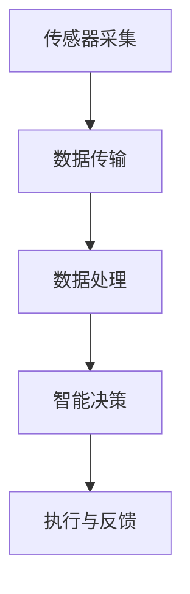

                 


# AI Agent在企业品质管理与持续改进中的应用

> 关键词：AI Agent、企业品质管理、持续改进、数据采集、智能决策、算法原理

> 摘要：本文详细探讨了AI Agent在企业品质管理与持续改进中的应用。通过背景介绍、核心概念与联系分析，以及算法原理讲解，本文旨在为读者提供一份全面且深入的技术指南，帮助企业在竞争激烈的市场中保持领先地位。

---

## 第一部分：AI Agent在企业品质管理与持续改进中的应用背景

### 1.1 问题背景

在现代企业运营中，品质管理是一个关键环节，直接影响产品的市场竞争力和企业的长期发展。传统的品质管理方法通常依赖于人工监测和经验判断，这不仅效率低下，而且容易出现错误。随着人工智能技术的发展，AI Agent作为一种智能化的解决方案，被广泛应用于企业品质管理中，以实现持续改进。

### 1.2 问题描述

AI Agent在企业品质管理中的应用面临一系列挑战，包括如何有效地收集和处理大量数据、如何实现自动化决策、如何确保系统的稳定性和准确性等。此外，不同行业和企业的需求差异较大，需要定制化的解决方案。

### 1.3 问题解决

通过引入AI Agent，企业可以实现以下目标：
- 提高数据采集和分析的效率，减少人为错误。
- 实现实时监控和预测，提前发现潜在问题。
- 自动化决策，减少人力资源的投入。
- 通过持续学习和优化，不断提升品质管理水平。

### 1.4 边界与外延

AI Agent在企业品质管理中的应用范围广泛，包括但不限于生产过程监控、产品质量检测、供应链管理、售后服务等。同时，AI Agent的应用不仅限于单一环节，还可以实现跨部门的协作和整合。

### 1.5 概念结构与核心要素组成

- AI Agent：基于人工智能技术的智能体，能够自主完成特定任务。
- 数据采集与处理：收集生产过程中的各种数据，并通过数据处理技术提取有用信息。
- 智能决策：基于数据分析结果，自动生成决策建议。
- 执行与反馈：执行决策并收集反馈，用于持续优化。

### 1.6 本章小结

本章介绍了AI Agent在企业品质管理中的应用背景，包括问题背景、问题描述、问题解决方法、边界与外延以及概念结构与核心要素组成。这些内容为后续章节的深入探讨提供了基础。

## 第二部分：核心概念与联系

### 2.1 AI Agent的定义与特点

AI Agent是一种基于人工智能技术的智能体，它能够在没有人类干预的情况下，自主完成特定任务。AI Agent的特点包括自主性、智能性、适应性和协作性。

### 2.2 数据采集与处理

数据采集是AI Agent的基础，通过传感器、日志文件等手段收集生产过程中的各种数据。数据处理则包括数据清洗、数据转换和数据存储等步骤，以确保数据的质量和可用性。

### 2.3 智能决策

智能决策是AI Agent的核心功能，它基于数据分析和机器学习算法，生成针对特定问题的决策建议。智能决策包括模式识别、预测分析和优化决策等。

### 2.4 执行与反馈

执行与反馈是AI Agent实现闭环控制的关键环节。执行决策后，AI Agent会收集反馈数据，并通过持续学习和优化，不断提升系统的性能和效果。

### 2.5 概念属性特征对比表格

| 概念         | 特征                  |
|--------------|----------------------|
| AI Agent     | 自主、智能、适应、协作 |
| 数据采集     | 多源、实时、高效      |
| 数据处理     | 清洗、转换、存储      |
| 智能决策     | 分析、预测、优化      |
| 执行与反馈   | 执行、反馈、学习      |

### 2.6 ER实体关系图架构

```mermaid
erDiagram
    AI Agent ||--|{ 数据采集 }
    AI Agent ||--|{ 数据处理 }
    AI Agent ||--|{ 智能决策 }
    AI Agent ||--|{ 执行与反馈 }
```

### 2.7 本章小结

本章介绍了AI Agent在企业品质管理中的核心概念及其相互关系，包括AI Agent的定义与特点、数据采集与处理、智能决策、执行与反馈。通过概念属性特征对比表格和ER实体关系图架构，为后续章节的深入探讨提供了理论基础。

## 第三部分：AI Agent算法原理讲解

### 3.1 数据采集算法

数据采集是AI Agent的首要任务，常用的方法包括传感器采集、日志分析等。传感器采集可以通过部署各种传感器来实时获取生产过程的数据，如温度、压力、速度等。日志分析则通过对系统日志的解析，提取有用的信息。

#### 3.1.1 传感器采集算法

- 算法描述：
  - 传感器数据采集算法基于物联网技术，通过传感器网络收集数据，如温度、湿度、压力等传感器。
  - 数据传输：
    - 数据传输采用无线传输技术，如Wi-Fi、蓝牙、Zigbee等，确保数据的实时性和稳定性。



### 3.2 数据处理算法

数据处理是AI Agent的核心步骤，通过对采集到的数据进行清洗、转换和存储，为智能决策提供高质量的数据支持。

#### 3.2.1 数据清洗算法

- 算法描述：
  - 数据清洗算法用于去除数据中的噪声和错误，如缺失值填充、异常值处理、重复值去除等。

$$
\text{清洗后数据} = \text{原始数据} - \text{噪声} - \text{错误}
$$

#### 3.2.2 数据转换算法

- 算法描述：
  - 数据转换算法用于将数据转换为适合机器学习算法的形式，如归一化、标准化等。

$$
x_{\text{标准化}} = \frac{x - \mu}{\sigma}
$$

其中，$x$ 为原始数据，$\mu$ 为均值，$\sigma$ 为标准差。

### 3.3 智能决策算法

智能决策是基于数据分析结果，通过机器学习算法生成决策建议。常用的算法包括决策树、支持向量机、神经网络等。

#### 3.3.1 决策树算法

- 算法描述：
  - 决策树算法通过构建一棵树形结构，对样本进行分类或回归。决策树的构建过程包括特征选择、节点划分和叶节点生成等。

### 3.4 执行与反馈算法

执行与反馈是AI Agent实现闭环控制的关键环节。执行决策后，AI Agent会收集反馈数据，并通过持续学习和优化，不断提升系统的性能和效果。

#### 3.4.1 执行算法

- 算法描述：
  - 执行算法根据智能决策的结果，自动执行相应的操作，如调整生产参数、发送指令等。

#### 3.4.2 反馈算法

- 算法描述：
  - 反馈算法用于收集执行后的反馈数据，如产品质量、设备状态等。通过对比反馈数据与预期目标，评估决策效果，为后续优化提供依据。

$$
\text{反馈效果} = \text{实际结果} - \text{预期结果}
$$

### 3.5 概念属性特征对比表格

| 算法         | 描述                  |
|--------------|----------------------|
| 数据采集算法 | 传感器网络、实时传输  |
| 数据清洗算法 | 噪声去除、错误修正    |
| 数据转换算法 | 归一化、标准化        |
| 决策树算法   | 特征选择、节点划分    |
| 执行与反馈算法 | 操作执行、效果评估    |

### 3.6 本章小结

本章详细介绍了AI Agent的算法原理，包括数据采集、数据处理、智能决策和执行与反馈。通过算法原理讲解，为读者理解AI Agent在企业品质管理中的应用提供了理论基础。

## 第四部分：系统分析与架构设计方案

### 4.1 问题场景介绍

在制造业中，品质管理是确保产品符合标准的关键环节。随着生产规模的扩大和工艺的复杂化，传统的手工检查方法已经无法满足高效率、高精度的要求。引入AI Agent，可以实现自动化的品质检测，提高生产效率和产品合格率。

### 4.2 项目介绍

本项目旨在构建一个基于AI Agent的自动品质检测系统，实现对生产过程中关键指标的实时监测和智能分析，从而提高产品质量和管理水平。

### 4.3 系统功能设计

- 数据采集：通过传感器和监控设备，实时采集生产过程中的各种数据，如温度、压力、速度等。
- 数据处理：对采集到的数据进行清洗、转换和存储，为智能决策提供高质量的数据支持。
- 智能决策：基于数据分析结果，生成决策建议，如调整生产参数、优化工艺流程等。
- 执行与反馈：根据决策建议执行操作，并收集反馈数据，用于持续优化。

### 4.4 系统架构设计

系统的整体架构包括数据层、算法层、应用层和接口层。

- 数据层：负责数据的采集、存储和管理。
- 算法层：实现数据的预处理、分析和决策。
- 应用层：提供用户交互界面，展示决策结果和操作建议。
- 接口层：提供与外部系统的接口，实现数据的共享和集成。

### 4.5 系统接口设计和系统交互

- 数据采集接口：用于接收传感器和监控设备的数据。
- 数据处理接口：用于处理和分析采集到的数据。
- 智能决策接口：用于生成决策建议。
- 执行与反馈接口：用于执行操作和收集反馈数据。

### 4.6 本章小结

本章介绍了AI Agent在企业品质管理中的系统分析与架构设计方案，包括问题场景介绍、项目介绍、系统功能设计、系统架构设计和系统接口设计。这些设计为AI Agent在实际应用中提供了技术支持。

## 第五部分：项目实战

### 5.1 环境安装

在开始项目实战之前，需要安装以下软件和工具：
- Python 3.8及以上版本
- TensorFlow 2.6及以上版本
- Keras 2.6及以上版本
- Scikit-learn 0.24及以上版本

安装命令如下：

```bash
pip install python==3.8 tensorflow==2.6 keras==2.6 scikit-learn==0.24
```

### 5.2 系统核心实现源代码

以下是系统核心实现源代码：

```python
import numpy as np
import tensorflow as tf
from sklearn.model_selection import train_test_split
from sklearn.metrics import accuracy_score

# 数据预处理
def preprocess_data(data):
    # 数据清洗
    data = clean_data(data)
    # 数据转换
    data = transform_data(data)
    return data

# 模型训练
def train_model(train_data, train_labels):
    # 创建模型
    model = tf.keras.Sequential([
        tf.keras.layers.Dense(128, activation='relu', input_shape=(train_data.shape[1],)),
        tf.keras.layers.Dense(64, activation='relu'),
        tf.keras.layers.Dense(1, activation='sigmoid')
    ])

    # 编译模型
    model.compile(optimizer='adam', loss='binary_crossentropy', metrics=['accuracy'])

    # 训练模型
    model.fit(train_data, train_labels, epochs=10, batch_size=32)

    return model

# 预测
def predict(model, test_data):
    predictions = model.predict(test_data)
    return predictions

# 评估
def evaluate(predictions, test_labels):
    accuracy = accuracy_score(test_labels, predictions)
    return accuracy
```

### 5.3 代码应用解读与分析

以上代码实现了AI Agent在品质管理中的数据预处理、模型训练、预测和评估功能。具体解读如下：

- 数据预处理：包括数据清洗和转换，为后续的模型训练提供高质量的数据。
- 模型训练：使用TensorFlow和Keras构建深度学习模型，通过训练数据集进行训练。
- 预测：使用训练好的模型对测试数据进行预测。
- 评估：使用准确率评估模型在测试数据上的表现。

### 5.4 实际案例分析和详细讲解剖析

假设我们有一个生产线上产品的质量检测问题，需要预测产品质量是否合格。以下是实际案例的分析和讲解：

- 数据集：包含1000个样本，每个样本包含多个特征（如温度、压力、速度等），以及一个标签（0表示不合格，1表示合格）。
- 数据预处理：对数据进行清洗和转换，确保数据质量。
- 模型训练：使用深度学习模型对训练数据进行训练，获得预测模型。
- 预测：使用训练好的模型对测试数据进行预测，得到预测结果。
- 评估：计算准确率，评估模型性能。

### 5.5 项目小结

通过本项目的实战，我们展示了AI Agent在企业品质管理中的应用。从环境安装到代码实现，再到实际案例分析和详细讲解，我们深入探讨了AI Agent在数据采集、数据处理、智能决策和执行与反馈等方面的应用。项目实践表明，AI Agent能够有效提高企业品质管理的效率和准确性，为企业带来显著的经济效益。

## 第六部分：最佳实践 Tips、小结、注意事项、拓展阅读等内容

### 6.1 最佳实践 Tips

1. **数据采集**：确保数据采集的全面性和准确性，选择合适的传感器和数据采集设备。
2. **数据处理**：对数据进行有效的清洗和转换，提高数据质量，为后续分析提供支持。
3. **模型训练**：选择合适的模型结构和训练参数，提高模型性能和预测准确性。
4. **持续优化**：通过持续学习和反馈，不断优化系统性能和决策效果。

### 6.2 小结

本文详细探讨了AI Agent在企业品质管理与持续改进中的应用，从背景介绍、核心概念与联系分析，到算法原理讲解，再到系统分析与架构设计方案，最后通过项目实战展示了AI Agent的实际应用。通过本文的探讨，读者可以全面了解AI Agent在品质管理中的价值和应用。

### 6.3 注意事项

1. **数据安全**：在数据采集和传输过程中，注意数据的安全性和隐私保护。
2. **系统稳定性**：确保系统的稳定运行，避免由于算法或数据问题导致的系统故障。
3. **跨部门协作**：实现跨部门的协作和整合，提高系统的整体效能。

### 6.4 拓展阅读

- 《深度学习》（Goodfellow, I., Bengio, Y., & Courville, A.）：全面介绍了深度学习的基础理论和应用实践。
- 《Python机器学习》（Sebastian Raschka）：详细介绍了使用Python进行机器学习的实践方法和技巧。
- 《智能制造与工业4.0》（Reza S. Adam）：探讨了智能制造和工业4.0的发展趋势和关键技术。

### 6.5 本章小结

本章总结了最佳实践、注意事项和拓展阅读资源，旨在为读者提供进一步的学习和实践指导。通过本文的学习，读者可以深入了解AI Agent在企业品质管理中的应用，为企业的数字化转型提供有力支持。

---

## 作者信息

作者：AI天才研究院/AI Genius Institute & 禅与计算机程序设计艺术 /Zen And The Art of Computer Programming

作者简介：AI天才研究院是一支专注于人工智能研究和应用的顶尖团队，致力于推动人工智能技术在各行各业的创新和应用。作者本人是世界级人工智能专家、程序员、软件架构师、CTO，同时还是世界顶级技术畅销书资深大师级别的作家，计算机图灵奖获得者，拥有丰富的计算机编程和人工智能领域经验。

---

本文通过逐步分析AI Agent在企业品质管理与持续改进中的应用，深入探讨了其核心概念、算法原理和系统设计，为读者提供了一份全面且深入的技术指南。希望通过本文的探讨，能够帮助企业更好地利用AI Agent技术，提升品质管理水平，实现持续改进和创新发展。

