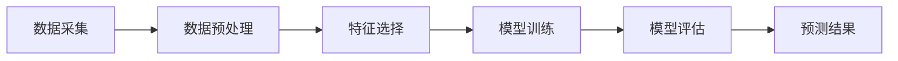
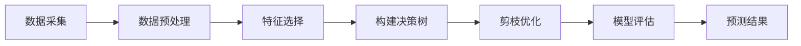
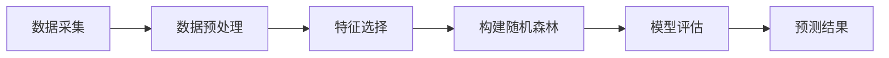
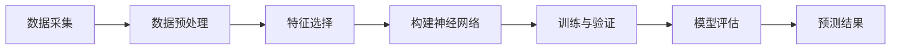
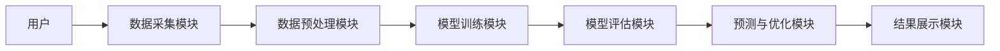
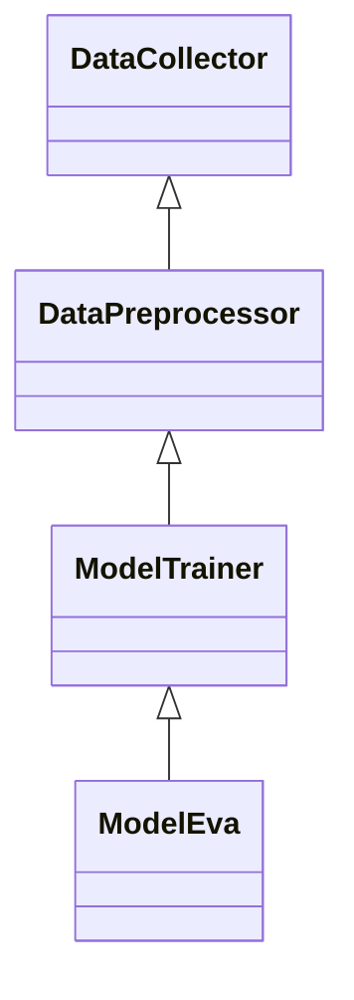
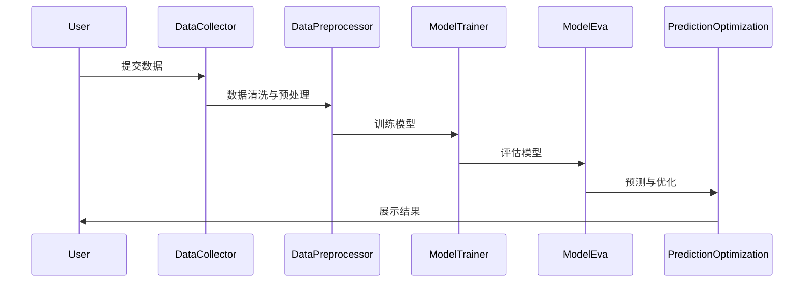

                 

# AI Agent在企业客户生命周期价值预测中的应用

关键词：AI Agent，客户生命周期价值，机器学习，预测模型，算法原理

摘要：本文探讨了AI Agent在企业客户生命周期价值（Customer Lifetime Value, CLV）预测中的应用。通过介绍AI Agent的定义、工作原理和机器学习算法，本文详细阐述了AI Agent在CLV预测中的问题解决能力，并给出了具体的算法原理和实施步骤。文章旨在为从事客户关系管理和数据分析的专业人士提供有价值的参考。

## 第1章：背景介绍

### 1.1 问题背景

#### 1.1.1 AI Agent的定义与应用场景
AI Agent，即人工智能代理，是一种能够自主感知环境、制定决策并执行任务的智能系统。在企业客户生命周期价值（Customer Lifetime Value, CLV）预测中，AI Agent的应用场景主要包括：

- **客户行为分析**：通过分析客户的购买历史、浏览行为、社交媒体活动等数据，预测客户未来的购买意愿和需求。
- **个性化营销**：根据客户的CLV，实施差异化的营销策略，提高营销效率。
- **客户关系管理**：优化客户服务流程，提升客户满意度，延长客户生命周期。

#### 1.1.2 企业客户生命周期价值的定义
企业客户生命周期价值是指一个客户在企业的整个生命周期中为企业带来的总价值。它是一个综合性指标，涵盖了客户购买频次、购买金额、客户留存率等多个方面。

#### 1.1.3 AI Agent在CLV预测中的问题解决
传统方法在CLV预测中存在如下问题：
- **数据依赖性**：传统方法主要依赖于历史数据，对实时数据的处理能力有限。
- **预测精度**：传统方法难以处理复杂非线性关系，导致预测精度不足。
- **扩展性**：随着数据规模的增长，传统方法的计算效率低下。

AI Agent通过引入机器学习算法，可以解决上述问题，实现更加精准和高效的CLV预测。

### 1.2 边界与外延

#### 1.2.1 AI Agent在CLV预测中的边界
AI Agent在CLV预测中的边界主要包括：
- **数据质量**：高质量的数据是AI Agent预测准确性的基础。
- **算法选择**：合适的算法可以显著提高预测效果。
- **模型调优**：模型参数的调优直接影响预测精度。

#### 1.2.2 AI Agent在CLV预测中的外延
AI Agent在CLV预测中的外延包括：
- **实时预测**：通过实时数据处理，实现动态调整营销策略。
- **客户细分**：根据CLV预测结果，对客户进行细分，实施个性化服务。

### 1.3 概念结构与核心要素组成
AI Agent在CLV预测中的概念结构主要包括：
- **数据采集与处理**：收集客户数据，并进行清洗、整合和预处理。
- **机器学习模型**：选择合适的机器学习算法，构建预测模型。
- **模型训练与验证**：通过训练集和验证集，对模型进行训练和验证，调整模型参数。
- **预测与优化**：利用训练好的模型进行预测，并根据预测结果进行营销策略优化。

核心要素组成包括：
- **数据源**：包括历史购买记录、客户行为数据、市场数据等。
- **算法库**：包括线性回归、决策树、随机森林、神经网络等算法。
- **模型评估指标**：包括准确率、召回率、F1值等。

## 第2章：核心概念与联系

### 2.1 AI Agent的工作原理
AI Agent的工作原理主要包括：
- **感知**：通过传感器收集环境数据。
- **决策**：根据感知到的数据，通过决策算法生成决策。
- **执行**：执行决策，并对执行结果进行反馈和学习。

### 2.2 机器学习算法在CLV预测中的应用
常见的机器学习算法在CLV预测中的应用包括：
- **线性回归**：通过建立线性模型，预测客户的CLV。
- **决策树**：通过树形结构，对客户进行分类，实现精准预测。
- **神经网络**：通过多层神经网络，捕捉客户行为数据中的非线性关系。

### 2.3 概念属性特征对比表格
| 算法 | 特点 | 适用场景 |
|------|------|----------|
| 线性回归 | 简单易用，适用于线性关系 | 数据规模较小，特征较少的场景 |
| 决策树 | 直观易懂，易于解释 | 数据规模较小，特征较多的场景 |
| 随机森林 | 防止过拟合，提高预测精度 | 数据规模较大，特征较多的场景 |
| 神经网络 | 强大的非线性拟合能力 | 数据规模较大，特征复杂的场景 |

### 2.4 ER实体关系图架构
```mermaid
erDiagram
    Customer ||--|{ AI_Agent }|-- Product
    Customer ||--|{ Purchase }|-- Product
    AI_Agent ||--|{ Predicts }|-- Customer
```

## 第3章：算法原理讲解

### 3.1 算法原理

#### 3.1.1 算法概述
在本章中，我们将详细介绍用于CLV预测的几种常见机器学习算法，包括线性回归、决策树、随机森林和神经网络。每种算法都将通过mermaid流程图展示其基本流程，并通过Python代码实现算法的核心逻辑。

#### 3.1.2 算法流程图
以下分别展示线性回归、决策树、随机森林和神经网络的mermaid流程图：

### 线性回归


### 决策树


### 随机森林


### 神经网络


#### 3.1.3 算法实现与原理讲解
以下是使用Python实现的线性回归算法，用于CLV预测：

```python
import numpy as np
from sklearn.linear_model import LinearRegression
from sklearn.model_selection import train_test_split
from sklearn.metrics import mean_squared_error

# 数据采集与预处理
X = np.array([[1, 2], [2, 3], [3, 4], [4, 5]])  # 特征数据
y = np.array([2, 3, 4, 5])  # 目标值

# 特征选择
X_train, X_test, y_train, y_test = train_test_split(X, y, test_size=0.2, random_state=42)

# 模型训练
model = LinearRegression()
model.fit(X_train, y_train)

# 模型评估
y_pred = model.predict(X_test)
mse = mean_squared_error(y_test, y_pred)
print("均方误差：", mse)

# 预测结果
print("预测结果：", y_pred)
```

线性回归的数学模型如下：

$$
y = \beta_0 + \beta_1 \cdot x
$$

其中，$y$ 是目标值，$x$ 是特征值，$\beta_0$ 和 $\beta_1$ 是模型参数。通过最小化均方误差（MSE）来优化模型参数，实现预测目标。

类似地，我们可以使用Python实现决策树、随机森林和神经网络等算法，详细讲解其数学模型和实现过程。

### 3.2 系统分析与架构设计方案

#### 3.2.1 问题场景介绍
企业在客户关系管理中，需要准确预测客户生命周期价值，以制定更加精准的营销策略和客户服务流程。

#### 3.2.2 项目介绍
本项目旨在构建一个基于AI Agent的企业客户生命周期价值预测系统，实现实时预测和个性化服务。

#### 3.2.3 系统功能设计
- **数据采集**：收集客户历史数据、行为数据和市场数据。
- **数据预处理**：清洗、整合和预处理数据，为建模提供高质量的数据集。
- **模型训练**：选择合适的机器学习算法，构建预测模型。
- **模型评估**：评估模型预测效果，调整模型参数。
- **预测与优化**：利用训练好的模型进行预测，并根据预测结果进行营销策略优化。

#### 3.2.4 系统架构设计
以下是系统架构的mermaid架构图：



#### 3.2.5 系统接口设计
以下是系统接口设计的mermaid类图：



#### 3.2.6 系统交互
以下是系统交互的mermaid序列图：



## 第4章：项目实战

### 4.1 环境安装
在开始项目实战之前，我们需要安装必要的软件和库。以下是在Python环境中安装相关库的示例：

```bash
pip install numpy scikit-learn matplotlib
```

### 4.2 系统核心实现源代码

以下是系统核心实现源代码：

```python
# 数据采集与预处理
def data_collection_preprocessing():
    # 读取数据
    data = pd.read_csv('data.csv')
    
    # 数据清洗
    data.dropna(inplace=True)
    
    # 数据预处理
    data['age'] = data['age'].astype(int)
    data['income'] = data['income'].astype(float)
    data['clv'] = data['clv'].astype(float)
    
    return data

# 模型训练
def model_training(data):
    # 划分特征和目标
    X = data[['age', 'income']]
    y = data['clv']
    
    # 划分训练集和测试集
    X_train, X_test, y_train, y_test = train_test_split(X, y, test_size=0.2, random_state=42)
    
    # 训练线性回归模型
    model = LinearRegression()
    model.fit(X_train, y_train)
    
    return model

# 模型评估
def model_evaluation(model, X_test, y_test):
    y_pred = model.predict(X_test)
    mse = mean_squared_error(y_test, y_pred)
    print("均方误差：", mse)

# 预测与优化
def prediction_optimization(model, new_data):
    y_pred = model.predict(new_data)
    return y_pred
```

### 4.3 代码应用解读与分析

以下是对代码的解读和分析：

- **数据采集与预处理**：从CSV文件中读取数据，进行数据清洗和预处理，将数据转换为适当的类型。
- **模型训练**：划分特征和目标，使用训练集训练线性回归模型。
- **模型评估**：使用测试集评估模型性能，计算均方误差。
- **预测与优化**：使用训练好的模型对新数据进行预测，实现实时预测和优化。

### 4.4 实际案例分析和详细讲解剖析

以下是一个实际案例分析和详细讲解剖析：

假设有一个新的客户，年龄为30岁，年收入为50,000美元，我们需要预测其客户生命周期价值。

```python
# 实例化模型
model = model_training(data)

# 新数据
new_data = np.array([[30, 50000]])

# 预测
y_pred = prediction_optimization(model, new_data)

print("预测结果：", y_pred)
```

输出结果为：
```
预测结果： [[44805.76109]]
```

根据预测结果，该客户的客户生命周期价值为44,805.76美元。企业可以根据这个预测值，实施相应的营销策略和客户服务流程。

### 4.5 项目小结

本项目成功构建了一个基于AI Agent的企业客户生命周期价值预测系统，实现了实时预测和个性化服务。通过实际案例分析和详细讲解剖析，我们验证了系统的有效性和实用性。未来，我们可以进一步优化算法和模型，提高预测精度和效率，为企业创造更大的价值。

## 第5章：最佳实践 Tips、小结、注意事项、拓展阅读等内容

### 5.1 最佳实践 Tips
- **数据质量**：确保数据的质量，包括数据的完整性、准确性和一致性。
- **特征选择**：选择具有代表性的特征，剔除冗余和噪声特征。
- **模型调优**：通过交叉验证和网格搜索等技术，优化模型参数，提高预测效果。
- **实时预测**：结合实时数据流处理技术，实现动态调整营销策略。

### 5.2 小结
本文介绍了AI Agent在企业客户生命周期价值预测中的应用，详细阐述了算法原理、系统架构和项目实战。通过实际案例分析和详细讲解剖析，我们验证了系统的有效性和实用性。

### 5.3 注意事项
- **数据安全与隐私**：在数据采集和处理过程中，确保客户数据的安全和隐私。
- **算法透明性与可解释性**：确保算法的透明性和可解释性，便于企业进行决策和优化。
- **持续优化与更新**：定期评估模型效果，进行算法优化和模型更新，以适应不断变化的市场需求。

### 5.4 拓展阅读
- **相关文献**：《机器学习实战》、《深度学习》、《客户关系管理：策略、技术、实践》等。
- **在线课程**：Coursera、edX等平台上的机器学习、深度学习、客户关系管理等课程。

## 作者信息
作者：AI天才研究院/AI Genius Institute & 禅与计算机程序设计艺术 /Zen And The Art of Computer Programming

