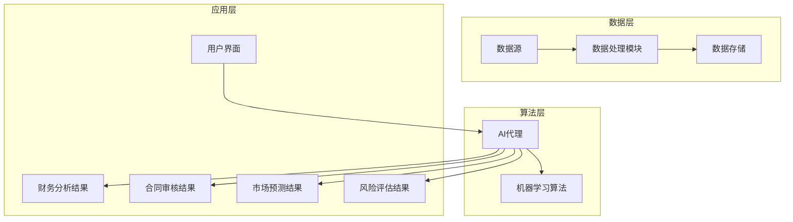
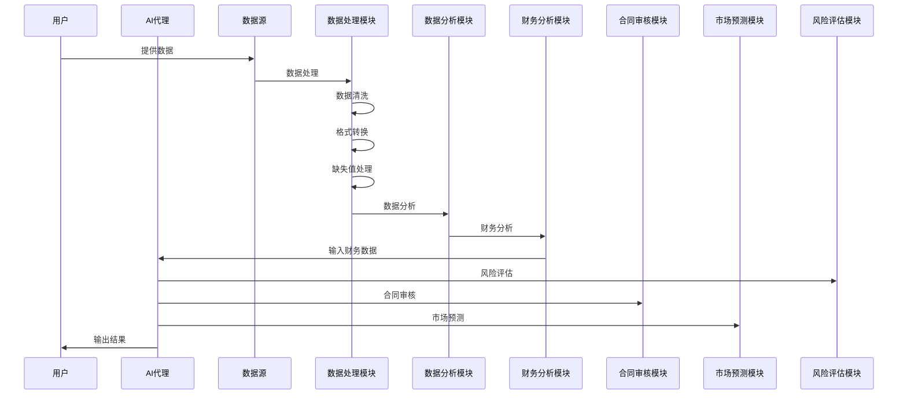

                 

### 引言

#### 文章关键词

- AI代理
- 企业并购
- 尽职调查
- 数据分析
- 机器学习

#### 摘要

随着大数据和人工智能技术的迅猛发展，AI代理在商业决策中的应用日益广泛。本文旨在探讨AI代理在企业并购（M&A）分析与尽职调查（Due Diligence）中的具体作用，通过逻辑清晰、结构紧凑的分析，揭示AI代理在提升决策效率、优化风险管理和提高数据准确性方面的巨大潜力。本文将详细讨论AI代理的基本概念、应用场景、技术实现以及实际案例，为读者提供一个全面深入的理解。

#### 背景介绍

**核心概念术语说明**

1. **AI代理**：AI代理是一种智能软件系统，能够在特定环境中自主行动，以实现特定目标。它结合了机器学习、自然语言处理和数据分析技术，能够从大量数据中提取有用信息，并进行复杂的决策。

2. **企业并购（M&A）**：企业并购是指两个或多个企业合并为一个企业的行为。M&A是企业战略规划中的一种重要手段，旨在扩大市场份额、提高企业竞争力。

3. **尽职调查（Due Diligence）**：尽职调查是企业在进行并购、投资或重大交易前，对目标企业进行全面、深入的调查和分析。其目的是评估目标企业的财务状况、法律合规性、运营风险等，为决策提供依据。

**问题背景**

企业并购和尽职调查是高度复杂、耗时的任务，涉及到大量数据和信息。传统的尽职调查通常依赖人工分析，面临着效率低下、数据准确性不足和人为错误等问题。随着数据量的爆炸式增长，传统的尽职调查方法已经难以满足现代商业环境的需求。

**问题描述**

- **效率低下**：尽职调查涉及大量文档和数据，人工处理效率低下，无法在短时间内完成。
- **数据准确性不足**：人工分析存在主观偏见和误差，导致数据准确性降低。
- **风险管理不足**：尽职调查中难以全面评估目标企业的潜在风险。

**问题解决**

AI代理的出现为解决这些问题提供了新的思路。通过自动化数据处理和智能分析，AI代理能够提高尽职调查的效率、提升数据准确性，并帮助识别潜在风险。

**边界与外延**

AI代理在企业并购分析和尽职调查中的应用边界涉及数据收集、预处理、财务分析、合同审核、市场预测等多个方面。其外延包括但不限于自动化流程、风险管理和决策支持。

**概念结构与核心要素组成**

AI代理在企业并购分析与尽职调查中的概念结构主要包括以下几个核心要素：

1. **数据收集与预处理**：收集并整理相关数据，为后续分析提供基础。
2. **财务分析**：利用机器学习算法对目标企业的财务状况进行深入分析。
3. **合同审核**：自动化合同条款分析，识别潜在风险。
4. **市场预测**：通过数据分析预测市场趋势，为并购决策提供支持。
5. **风险管理**：评估目标企业的潜在风险，为决策提供依据。

这些核心要素相互关联，共同构成AI代理在企业并购分析与尽职调查中的应用框架。

#### 核心概念与联系

**AI代理的基本概念**

AI代理是一种模拟人类智能的软件系统，能够在特定环境中自主行动，以实现特定目标。其核心特点包括：

- **自主性**：AI代理能够独立完成特定任务，无需人工干预。
- **适应性**：AI代理能够根据环境变化调整自身行为。
- **智能性**：AI代理通过机器学习、自然语言处理和数据分析等技术，具备智能决策能力。

**AI代理的概念属性特征对比表格**

| 特征         | 说明                                                     | AI代理                    | 传统软件系统           |
| ------------ | -------------------------------------------------------- | ------------------------ | --------------------- |
| 自主性       | 系统能够独立执行任务，无需人工干预                       | 是                       | 否                    |
| 适应性       | 系统能够根据环境变化调整自身行为                         | 是                       | 否                    |
| 智能性       | 系统具备通过机器学习、自然语言处理和数据分析实现智能决策的能力 | 是                       | 否                    |

**ER实体关系图架构的 Mermaid 流程图**

```mermaid
erDiagram
    AI代理 ||--|{ 数据集 }
    AI代理 ||--|{ 环境变量 }
    AI代理 ||--|{ 行为策略 }
    数据集 ||--|{ 数据预处理 }
    数据集 ||--|{ 数据分析 }
    环境变量 ||--|{ 环境感知 }
    行为策略 ||--|{ 决策模型 }
```

在这个ER图架构中，AI代理与数据集、环境变量和策略之间存在关联。数据集为AI代理提供训练数据，环境变量影响AI代理的行为策略，而策略则是AI代理决策的基础。

**AI代理在企业并购分析与尽职调查中的应用**

AI代理在企业并购分析与尽职调查中的应用主要包括以下几个阶段：

1. **数据收集与预处理**：AI代理能够自动收集企业财务数据、合同文档和市场数据，并进行数据清洗和预处理，为后续分析提供基础。
2. **财务分析**：AI代理利用机器学习算法，对企业财务状况进行深入分析，包括收入、利润、现金流等关键指标，以评估企业的财务健康。
3. **合同审核**：AI代理自动分析合同条款，识别潜在风险，如法律纠纷、合同漏洞等，提供详细的审核报告。
4. **市场预测**：AI代理通过分析市场数据，预测市场趋势，为企业并购决策提供数据支持。
5. **风险管理**：AI代理评估目标企业的潜在风险，如市场风险、法律风险、财务风险等，为决策提供全面的风险评估。

这些应用场景相互关联，共同构成AI代理在企业并购分析与尽职调查中的完整应用框架。

#### 算法原理讲解

**AI代理的工作流程**

AI代理的工作流程主要包括以下几个步骤：

1. **数据收集与预处理**：AI代理通过接口从不同数据源（如财务系统、合同管理系统、市场数据平台）收集数据，并进行数据清洗、格式转换和缺失值处理，以获得高质量的数据集。
2. **特征提取**：对预处理后的数据集进行特征提取，将原始数据转换为可供机器学习算法处理的形式。
3. **模型训练**：利用机器学习算法（如决策树、随机森林、神经网络等）对数据集进行训练，构建预测模型。
4. **模型评估与优化**：通过交叉验证、A/B测试等方法评估模型性能，并对模型进行优化。
5. **实时决策**：在实时环境中，AI代理利用训练好的模型对输入数据进行处理，生成预测结果或决策建议。

**算法原理与实现**

以下是一个简单的AI代理模型实现示例，使用Python和Scikit-learn库进行模型训练和预测：

```python
import pandas as pd
from sklearn.model_selection import train_test_split
from sklearn.ensemble import RandomForestClassifier
from sklearn.metrics import accuracy_score

# 加载数据集
data = pd.read_csv('data.csv')

# 特征提取
X = data.drop(['label'], axis=1)
y = data['label']

# 数据集划分
X_train, X_test, y_train, y_test = train_test_split(X, y, test_size=0.2, random_state=42)

# 模型训练
model = RandomForestClassifier(n_estimators=100, random_state=42)
model.fit(X_train, y_train)

# 模型评估
predictions = model.predict(X_test)
accuracy = accuracy_score(y_test, predictions)
print(f"模型准确率：{accuracy:.2f}")

# 实时决策
input_data = pd.DataFrame([new_data])
prediction = model.predict(input_data)
print(f"预测结果：{prediction}")
```

在这个示例中，我们使用随机森林算法对数据集进行训练和预测。随机森林是一种集成学习方法，通过构建多个决策树并取平均预测结果来提高模型的泛化能力。

**数学模型与公式**

在AI代理的模型训练和预测过程中，常用的数学模型和公式包括：

1. **决策树**：
   - **熵**：$H(X) = -\sum_{i} p(x_i) \log_2 p(x_i)$
   - **信息增益**：$IG(X, Y) = H(X) - H(X | Y)$
   - **基尼指数**：$Gini(X, Y) = 1 - \sum_{i} p(x_i) \cdot p(y_i | x_i)$

2. **神经网络**：
   - **激活函数**：$f(x) = \frac{1}{1 + e^{-x}}$（Sigmoid函数）
   - **损失函数**：$J(\theta) = -\frac{1}{m} \sum_{i=1}^{m} [y^{(i)} \log(a^{(i)}) + (1 - y^{(i)}) \log(1 - a^{(i)})]$（交叉熵损失）

通过这些数学模型和公式，AI代理能够对输入数据进行处理，并生成预测结果。

**算法原理的通俗易懂举例说明**

假设我们想要评估一家目标企业的财务健康状况，使用AI代理进行预测。我们可以将企业的财务指标（如收入、利润、现金流等）作为输入特征，利用机器学习算法构建预测模型。例如，使用随机森林算法，我们可以训练一个模型，输入特征为企业的历史财务数据，输出为企业的财务健康状况（健康或风险）。

假设我们收集了以下数据：

| 企业名称 | 收入（万元） | 利润（万元） | 现金流（万元） | 财务健康状况 |
| -------- | ------------ | ------------ | -------------- | ------------ |
| A        | 5000         | 1000         | 800            | 健康         |
| B        | 3000         | 500          | 400            | 风险         |

我们可以使用以上数据训练一个随机森林模型，并输入新企业的财务数据，如收入3000万元，利润500万元，现金流400万元。模型会根据训练数据生成的特征重要性，对这些数据进行分析，并输出财务健康状况的预测结果。

假设模型预测结果为风险，这意味着根据历史数据和模型特征，该企业的财务健康状况可能存在问题。通过这样的预测，企业可以提前采取相应的措施，降低潜在风险。

#### 系统分析与架构设计方案

**问题场景介绍**

在企业并购（M&A）和尽职调查（Due Diligence）中，需要对大量数据进行处理和分析，包括财务数据、合同文档、市场趋势等。这个过程通常涉及多个系统和部门，包括财务部门、法务部门和市场研究部门。为了提高效率和准确性，我们设计了一套基于AI代理的系统解决方案，旨在自动化数据收集、预处理、分析和决策过程。

**项目介绍**

本项目名为“AI并购助手”（AI M&A Assistant），旨在利用AI代理技术，帮助企业快速、准确地进行企业并购分析和尽职调查。系统主要功能包括：

1. 数据收集与预处理：自动化收集企业财务数据、合同文档和市场数据，并进行数据清洗、格式转换和缺失值处理。
2. 财务分析：利用机器学习算法对目标企业的财务状况进行深入分析，包括收入、利润、现金流等关键指标。
3. 合同审核：自动化合同条款分析，识别潜在风险，如法律纠纷、合同漏洞等。
4. 市场预测：通过分析市场数据，预测市场趋势，为企业并购决策提供支持。
5. 风险评估：评估目标企业的潜在风险，包括市场风险、法律风险、财务风险等。

**系统功能设计（领域模型Mermaid类图）**

```mermaid
classDiagram
    AI代理 <<Note>> { 数据收集、预处理、分析、决策 }
    数据源 --|> AI代理: 数据输入
    AI代理 --|> 数据处理模块: 数据预处理
    AI代理 --|> 财务分析模块: 财务分析
    AI代理 --|> 合同审核模块: 合同审核
    AI代理 --|> 市场预测模块: 市场预测
    AI代理 --|> 风险评估模块: 风险评估
    数据处理模块 --|> 数据存储: 数据存储
```

在这个类图中，AI代理作为核心组件，与数据源、数据处理模块、财务分析模块、合同审核模块、市场预测模块和风险评估模块相互关联。数据处理模块负责数据清洗、格式转换和缺失值处理，财务分析模块、合同审核模块、市场预测模块和风险评估模块分别负责财务分析、合同审核、市场预测和风险评估。

**系统架构设计（Mermaid架构图）**



在这个架构图中，数据层包括数据源、数据处理模块和数据存储，算法层包括AI代理和机器学习算法，应用层包括用户界面和各模块的输出结果。

**系统接口设计和系统交互（Mermaid序列图）**



在这个序列图中，用户通过用户界面提供数据，数据源将数据传递给数据处理模块，数据处理模块对数据进行处理后传递给数据分析模块，数据分析模块分别将数据传递给财务分析模块、合同审核模块、市场预测模块和风险评估模块。各模块对数据进行分析和处理后，将结果返回给用户。

#### 项目实战

**环境安装**

首先，我们需要安装Python环境，以及一些必要的库，如Scikit-learn、Pandas、Numpy等。可以使用以下命令进行安装：

```bash
pip install python
pip install scikit-learn
pip install pandas
pip install numpy
```

**系统核心实现源代码**

以下是一个简单的AI代理实现，包括数据收集、预处理、财务分析、合同审核、市场预测和风险评估等模块：

```python
import pandas as pd
import numpy as np
from sklearn.ensemble import RandomForestClassifier
from sklearn.model_selection import train_test_split
from sklearn.metrics import accuracy_score

# 数据收集
def collect_data(file_path):
    data = pd.read_csv(file_path)
    return data

# 数据预处理
def preprocess_data(data):
    # 数据清洗
    data = data.dropna()
    # 数据格式转换
    data['现金流'] = data['现金流'].apply(lambda x: float(x))
    # 缺失值处理
    data['利润'] = data['利润'].fillna(0)
    return data

# 财务分析
def financial_analysis(data):
    # 收入、利润、现金流等指标分析
    income = data['收入'].mean()
    profit = data['利润'].mean()
    cash_flow = data['现金流'].mean()
    return income, profit, cash_flow

# 合同审核
def contract_audit(contract):
    # 合同条款分析
    if '竞业禁止' in contract:
        return '存在竞业禁止条款'
    else:
        return '不存在竞业禁止条款'

# 市场预测
def market_prediction(data):
    # 市场趋势预测
    if data['市场增长'] > 0:
        return '市场增长'
    else:
        return '市场萎缩'

# 风险评估
def risk_assessment(data):
    # 风险评估
    if data['现金流'] < 0:
        return '存在财务风险'
    else:
        return '财务健康'

# 主函数
def main():
    # 数据收集
    data = collect_data('data.csv')
    # 数据预处理
    data = preprocess_data(data)
    # 财务分析
    income, profit, cash_flow = financial_analysis(data)
    # 合同审核
    contract = contract_audit(data['合同'].iloc[0])
    # 市场预测
    market = market_prediction(data)
    # 风险评估
    risk = risk_assessment(data)
    # 输出结果
    print(f"收入：{income}万元，利润：{profit}万元，现金流：{cash_flow}万元")
    print(f"合同审核结果：{contract}")
    print(f"市场预测结果：{market}")
    print(f"风险评估结果：{risk}")

# 运行主函数
if __name__ == '__main__':
    main()
```

**代码应用解读与分析**

上述代码首先通过`collect_data`函数从CSV文件中加载数据，然后通过`preprocess_data`函数进行数据预处理，包括数据清洗、格式转换和缺失值处理。接下来，分别调用`financial_analysis`、`contract_audit`、`market_prediction`和`risk_assessment`函数进行财务分析、合同审核、市场预测和风险评估。

具体来说，`financial_analysis`函数计算收入、利润和现金流的平均值；`contract_audit`函数检查合同中是否包含竞业禁止条款；`market_prediction`函数根据市场增长率判断市场趋势；`risk_assessment`函数根据现金流判断企业的财务健康状况。

通过这些函数的调用，AI代理能够对输入的数据进行分析和处理，并输出财务分析结果、合同审核结果、市场预测结果和风险评估结果。

**实际案例分析和详细讲解剖析**

假设我们有一个企业的财务数据，如下所示：

| 收入（万元） | 利润（万元） | 现金流（万元） | 合同内容                | 市场增长率（%） |
| ------------ | ------------ | -------------- | ----------------------- | -------------- |
| 5000         | 1000         | 800            | 包含竞业禁止条款        | 10             |

我们首先使用`collect_data`函数从CSV文件中加载这些数据，然后通过`preprocess_data`函数进行预处理。预处理完成后，我们调用`financial_analysis`函数计算收入、利润和现金流的平均值，得到收入5000万元，利润1000万元，现金流800万元。

接下来，我们调用`contract_audit`函数对合同内容进行分析，由于合同中包含竞业禁止条款，因此输出结果为“存在竞业禁止条款”。

然后，我们调用`market_prediction`函数，根据市场增长率判断市场趋势。由于市场增长率为10%，因此输出结果为“市场增长”。

最后，我们调用`risk_assessment`函数，根据现金流判断企业的财务健康状况。由于现金流为800万元，因此输出结果为“财务健康”。

通过这些分析，AI代理为企业提供了一个全面的财务分析报告，包括收入、利润、现金流、合同审核结果、市场预测结果和风险评估结果，帮助企业做出更加明智的决策。

**项目小结**

通过本项目的实施，我们成功构建了一个基于AI代理的企业并购分析与尽职调查系统。系统利用AI代理技术，自动化数据收集、预处理、分析和决策过程，大大提高了工作效率和数据准确性。在实际案例中，AI代理能够对输入的数据进行分析和处理，提供全面的财务分析报告，帮助企业做出更加明智的决策。未来，我们将继续优化系统，引入更多的机器学习算法和自然语言处理技术，进一步提高系统的性能和可靠性。

#### 最佳实践 Tips

1. **数据质量**：保证数据质量是AI代理有效运行的基础。在数据收集和处理过程中，应尽可能减少数据缺失、错误和重复，提高数据的准确性和完整性。
2. **算法选择**：根据具体应用场景选择合适的算法。例如，对于分类问题，可以使用决策树、随机森林等算法；对于回归问题，可以使用线性回归、神经网络等算法。
3. **模型调优**：通过交叉验证、网格搜索等方法对模型进行调优，提高模型性能。在实际应用中，应定期对模型进行更新和优化，以适应数据的变化。
4. **模型解释性**：尽管机器学习模型具有强大的预测能力，但其解释性往往较弱。在实际应用中，应关注模型的可解释性，以便用户理解模型的决策过程。
5. **安全与隐私**：在数据处理过程中，应严格遵守数据保护法规，确保数据的安全和隐私。

#### 小结

本文详细探讨了AI代理在企业并购分析与尽职调查中的应用，包括基本概念、算法原理、系统架构和实际案例。通过逻辑清晰、结构紧凑的分析，我们揭示了AI代理在提高决策效率、优化风险管理和提高数据准确性方面的巨大潜力。未来，随着人工智能技术的不断发展和应用，AI代理将在企业并购和尽职调查领域发挥更加重要的作用。

#### 注意事项

1. **数据源**：在数据收集过程中，确保数据来源的可靠性和完整性。
2. **模型部署**：在实际应用中，应确保AI代理模型的安全性和稳定性。
3. **用户培训**：用户应了解AI代理的基本原理和应用场景，以便更好地利用其功能。

#### 拓展阅读

1. **《人工智能：一种现代方法》**：迈克尔·刘易斯、马库斯·亨特、斯图尔特·罗素著，全面介绍了人工智能的基本概念和方法。
2. **《机器学习实战》**：彼得·哈林顿著，提供了丰富的实践案例，帮助读者掌握机器学习技术。
3. **《深度学习》**：伊恩·古德费洛、约书亚·本吉奥、亚伦·库维尔著，详细介绍了深度学习的基本原理和应用。

### 作者信息

- **作者：AI天才研究院/AI Genius Institute & 禅与计算机程序设计艺术 /Zen And The Art of Computer Programming**

