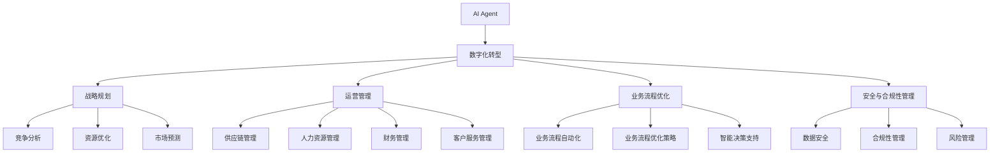

                 

### 引言

#### 1.1 问题背景

在当今全球化的商业环境中，企业面临着前所未有的挑战和机遇。随着信息技术的飞速发展，特别是人工智能（AI）技术的突破，企业数字化转型已经成为大势所趋。数字化转型不仅仅是为了跟上技术潮流，更是为了提升企业的竞争力、优化业务流程、提高客户体验和实现可持续发展。然而，企业在数字化转型过程中面临着诸多挑战，如技术选择、数据安全、组织变革和人才缺口等。

在这个背景下，AI Agent作为一种先进的智能技术，其在企业数字化转型中的催化作用日益凸显。AI Agent，即人工智能代理，是一种能够自主执行任务、适应环境变化并作出决策的智能实体。通过AI Agent，企业可以自动化复杂的业务流程，优化资源配置，提高运营效率，并实现业务流程的智能化。

#### 1.2 问题描述

企业的数字化转型涉及多个层面，包括战略规划、运营管理、业务流程优化和合规性管理等。在这个过程中，如何有效地利用AI Agent来推动数字化转型，是一个亟待解决的问题。具体来说，需要解决以下几个关键问题：

1. **AI Agent在战略层面的应用**：AI Agent如何帮助企业制定和调整战略规划，优化资源分配，提高市场竞争力？
2. **AI Agent在运营管理中的应用**：AI Agent如何帮助企业优化供应链管理、人力资源管理、财务管理和客户服务等运营环节？
3. **AI Agent在业务流程优化中的应用**：AI Agent如何帮助企业自动化业务流程，提高效率，降低成本？
4. **AI Agent在安全与合规性管理中的应用**：AI Agent如何保障企业在数字化转型过程中的数据安全、合规性以及风险管理？

#### 1.3 问题解决

本文旨在通过系统性地探讨AI Agent在企业数字化转型中的应用，提供一系列的解决方案和最佳实践。文章将分为以下几个部分：

1. **引言**：介绍企业数字化转型的背景和AI Agent的催化作用。
2. **AI Agent基础**：详细阐述AI Agent的基本概念、特点、分类及其与传统机器学习模型的区别。
3. **企业数字化转型的现状与挑战**：分析企业数字化转型的现状和面临的主要挑战。
4. **AI Agent在战略层面的应用**：探讨AI Agent在战略规划、竞争分析、资源优化和市场预测中的应用。
5. **AI Agent在运营管理中的应用**：分析AI Agent在供应链管理、人力资源管理、财务管理和客户服务管理中的应用。
6. **AI Agent在业务流程优化中的应用**：讨论AI Agent在业务流程自动化、业务流程优化和业务流程智能决策支持中的应用。
7. **AI Agent在安全与合规性管理中的应用**：分析AI Agent在安全与合规性管理中的角色和作用。

通过上述探讨，本文希望为企业提供一套全面、系统的AI Agent应用方案，助力企业实现数字化转型，提升整体竞争力。

#### 1.4 边界与外延

在本文的研究中，我们主要关注的是AI Agent在企业数字化转型中的应用，而非AI Agent在其他领域的应用。因此，本文的边界主要包括以下几个方面：

1. **应用范围**：本文主要探讨AI Agent在企业管理、运营、业务流程和安全与合规性管理中的应用，不涉及AI Agent在其他非商业场景的应用。
2. **技术层面**：本文将侧重于AI Agent的核心技术和应用原理，不深入探讨具体的编程实现和算法细节。
3. **案例研究**：本文将选取一些典型企业案例进行深入分析，以展示AI Agent的实际应用效果，但不涉及所有可能的企业应用场景。

#### 1.5 核心概念

为了更好地理解本文的内容，以下是本文中的一些核心概念及其定义：

- **AI Agent**：一种能够自主执行任务、适应环境变化并作出决策的智能实体，通常基于机器学习、自然语言处理和深度学习等技术构建。
- **数字化转型**：企业利用数字技术优化其业务流程、提高效率、增强竞争力的过程，通常涉及云计算、大数据、物联网和人工智能等技术的应用。
- **战略规划**：企业为实现长期目标而制定的总体计划和策略，涉及市场定位、资源配置、竞争策略等多个方面。
- **运营管理**：企业日常运营中的管理活动，包括供应链管理、人力资源管理、财务管理和客户服务等。
- **业务流程优化**：通过改进业务流程，提高运营效率、降低成本和提升客户满意度的一系列措施。

#### 1.6 概念结构与核心要素

为了更好地理解AI Agent在企业数字化转型中的应用，我们需要构建一个概念结构图，展示各核心概念及其相互关系。

在这个概念结构中，AI Agent作为核心要素，贯穿于企业数字化转型的各个层面，通过不同领域的应用，实现企业整体竞争力的提升。

#### 1.7 本章小结

本章作为引言部分，首先介绍了企业数字化转型的背景和AI Agent的催化作用，分析了企业在数字化转型过程中面临的挑战。接着，明确了本文的研究问题，并概述了问题的解决方法。此外，本章还对研究的边界与外延进行了定义，并介绍了核心概念及其相互关系。通过本章的介绍，读者可以对后续内容有一个全局性的认识，为深入探讨AI Agent在企业数字化转型中的应用打下基础。

## AI Agent的基本概念

### 2.1 AI Agent的定义

AI Agent，即人工智能代理，是一种能够在复杂环境中自主执行任务、适应环境变化并作出决策的智能实体。与传统的机器学习模型不同，AI Agent具有更强的自主性和适应性。它不仅能够根据输入数据生成预测或决策，还能通过学习环境反馈不断优化自身行为。

AI Agent的基本定义可以概括为以下几点：

1. **自主性**：AI Agent能够在没有外部干预的情况下，根据内部状态和外部环境自主地执行任务。
2. **适应性**：AI Agent能够通过学习环境和经验，不断调整自身的行为策略，以适应环境变化。
3. **决策能力**：AI Agent能够根据环境信息和自身目标，自主地作出决策，实现任务目标。

### 2.2 AI Agent的特点

AI Agent具有以下几个显著特点：

1. **智能决策**：AI Agent能够利用机器学习算法，从数据中学习并提取知识，从而实现智能决策。
2. **自主行动**：AI Agent能够在执行任务过程中，根据环境反馈自主地调整行动策略，以实现任务目标。
3. **动态适应**：AI Agent能够通过不断学习和调整，适应动态变化的环境，提高任务执行成功率。
4. **协作能力**：AI Agent能够与其他AI Agent或人类协作，共同完成任务。
5. **可扩展性**：AI Agent可以通过模块化设计，轻松扩展其功能，适应不同的应用场景。

### 2.3 AI Agent与传统机器学习模型的区别

传统机器学习模型通常是基于数据驱动的，通过训练模型来预测或分类新数据。而AI Agent则更接近于一个智能体，具有自主性和决策能力。以下是AI Agent与传统机器学习模型的几个关键区别：

1. **目的性**：传统机器学习模型主要是根据训练数据生成预测或决策，而AI Agent则具有明确的目标和任务，能够根据目标和环境自主地调整行为。
2. **动态性**：传统机器学习模型在训练完成后就固定不变，而AI Agent则能够在运行过程中动态调整其行为策略，以适应环境变化。
3. **环境交互**：传统机器学习模型通常与外部环境交互较少，而AI Agent则能够与外部环境实时互动，根据环境反馈调整自身行为。
4. **复杂度**：传统机器学习模型通常处理的是静态数据，而AI Agent则需要处理动态、复杂的实时数据，并能够从中提取有用的信息。

### 2.4 AI Agent的分类

AI Agent可以根据其功能和特性进行分类，以下是几种常见的AI Agent类型：

1. **基于规则的AI Agent**：这类Agent主要通过预设的规则进行决策，适用于规则明确、环境稳定的场景。
2. **基于行为的AI Agent**：这类Agent通过学习环境中的行为模式进行决策，适用于需要灵活应对环境变化的应用场景。
3. **基于模型的AI Agent**：这类Agent通过机器学习模型来预测和决策，适用于需要高精度、自适应性的复杂场景。
4. **混合型AI Agent**：这类Agent结合了多种类型的AI技术，能够根据不同应用场景动态调整其行为策略。

### 2.5 AI Agent的核心组成部分

AI Agent通常由以下几个核心组成部分构成：

1. **感知系统**：感知系统负责接收外部环境的信息，如传感器、摄像头等。
2. **决策模块**：决策模块根据感知系统提供的信息和内部状态，通过机器学习算法进行决策。
3. **执行系统**：执行系统负责根据决策模块的决策执行具体的任务，如机器人、自动化设备等。
4. **学习系统**：学习系统负责从环境中学习和积累经验，不断优化自身行为策略。

### 2.6 AI Agent的架构设计

AI Agent的架构设计通常包括以下几个层次：

1. **感知层**：感知层负责接收和处理外部环境信息，如语音识别、图像处理等。
2. **决策层**：决策层负责基于感知层提供的信息进行决策，如使用深度学习算法进行图像分类、语音识别等。
3. **执行层**：执行层负责根据决策层的决策执行具体的任务，如控制机器人移动、自动化设备运行等。
4. **学习层**：学习层负责从执行层和环境反馈中学习，不断优化自身的行为策略。

通过上述架构设计，AI Agent能够实现高效、智能的任务执行，并在复杂环境中灵活应对。

### 2.7 本章小结

本章详细介绍了AI Agent的基本概念、特点、与传统机器学习模型的区别、分类及其核心组成部分和架构设计。通过对这些基本概念的理解，读者可以对AI Agent有更深入的认识，为后续章节探讨AI Agent在企业数字化转型中的应用奠定基础。同时，本章也为后续章节提供了必要的技术背景和理论基础。

### 企业数字化转型的现状与挑战

#### 3.1 企业数字化转型的定义

企业数字化转型是指企业通过应用数字化技术，优化业务流程、提高运营效率、增强客户体验和实现可持续发展的过程。数字化转型的核心目标是利用数字技术提升企业的竞争力，实现从传统模式向现代智能模式的转变。数字化转型涉及多个层面，包括战略规划、运营管理、业务流程优化和合规性管理等。

#### 3.2 企业数字化转型的现状

目前，全球范围内的企业都在积极推进数字化转型。根据相关报告，超过70%的企业已经将其视为战略重点。以下是一些企业数字化转型的现状：

1. **技术投资增加**：企业不断加大对云计算、大数据、物联网和人工智能等技术的投资，以提高业务效率和创新能力。
2. **业务流程优化**：通过数字化技术，企业对业务流程进行优化，自动化程度不断提高，减少了人工操作和错误。
3. **数据驱动决策**：企业利用大数据分析和人工智能技术，实现数据驱动的决策，提高了决策的精准度和效率。
4. **客户体验提升**：通过数字化技术，企业能够更好地了解客户需求，提供个性化的产品和服务，提升了客户满意度。

#### 3.3 企业数字化转型的挑战

尽管数字化转型带来了诸多机遇，但企业也面临着一系列挑战：

1. **技术选择困难**：市场上存在大量的数字化技术，企业需要在众多技术中选择最适合自身需求的解决方案，这增加了决策的复杂性。
2. **数据安全与隐私**：数字化转型过程中，企业需要处理大量的数据，数据安全和隐私保护成为重要问题，任何数据泄露都可能对企业造成巨大损失。
3. **组织变革**：数字化转型需要企业进行组织架构和业务流程的调整，这涉及到员工技能的提升和岗位职责的重新分配，可能面临员工抵制和适应困难。
4. **人才缺口**：数字化转型需要大量具备数字技能的人才，但当前市场上这类人才供不应求，企业难以招聘到合适的人才。

#### 3.4 AI Agent在数字化转型中的作用

AI Agent在企业数字化转型中发挥着重要作用，能够有效解决上述挑战，推动企业实现数字化目标。以下是AI Agent在数字化转型中的几个关键作用：

1. **优化战略规划**：AI Agent能够通过大数据分析和机器学习，帮助企业进行市场预测、竞争分析和资源优化，提高战略决策的精准度和效率。
2. **提升运营效率**：AI Agent能够自动化复杂的业务流程，减少人工操作，降低运营成本，提高运营效率。
3. **保障数据安全**：AI Agent能够进行实时数据监控和分析，发现潜在的安全威胁，采取相应的措施进行防范和应对。
4. **促进组织变革**：AI Agent能够辅助企业进行组织架构和业务流程的优化，帮助员工适应新的工作方式和岗位职责。
5. **培养数字人才**：AI Agent可以通过模拟训练和技能提升，帮助企业培养和储备数字化人才，满足企业数字化转型的人才需求。

#### 3.5 企业数字化转型的目标与路径

企业数字化转型的目标主要包括提高业务效率、增强客户体验、提升数据驱动决策能力和实现可持续发展。为了实现这些目标，企业需要制定明确的数字化转型路径：

1. **制定数字化转型战略**：企业需要明确数字化转型的愿景、目标和实施路径，确保各部门协调一致，共同努力。
2. **评估技术需求**：企业需要对现有技术和业务需求进行评估，确定需要引入的数字化技术，制定技术升级计划。
3. **建立数字化团队**：企业需要建立专门的数字化团队，负责数字化转型项目的规划、实施和推进。
4. **进行试点项目**：企业可以通过试点项目，验证数字化技术的效果和可行性，积累经验，逐步推广。
5. **持续优化与迭代**：企业需要持续优化数字化方案，根据市场变化和企业需求进行迭代更新，确保数字化转型不断推进。

#### 3.6 本章小结

本章详细分析了企业数字化转型的现状和面临的挑战，并探讨了AI Agent在数字化转型中的作用和目标。通过本章的讨论，读者可以了解到企业数字化转型的背景、现状、挑战以及AI Agent的应用价值，为后续章节的深入探讨打下基础。

### AI Agent在企业战略规划中的应用

#### 4.1 AI Agent与战略规划的融合

企业战略规划是企业在长期发展过程中制定的重要计划，旨在明确企业的愿景、使命、目标和策略。随着人工智能技术的不断发展，AI Agent开始成为战略规划中的重要工具。AI Agent能够通过大数据分析、机器学习和智能决策，为企业提供更加精准和高效的战略支持。

#### 4.2 AI Agent在竞争分析中的应用

竞争分析是企业战略规划的重要环节，旨在了解竞争对手的动态，预测市场趋势，制定有效的竞争策略。AI Agent可以通过分析大量的市场数据，提供以下帮助：

1. **市场趋势预测**：AI Agent能够通过历史数据和市场动态，预测未来的市场趋势和潜在机会，帮助企业提前布局。
2. **竞争对手分析**：AI Agent可以实时监控竞争对手的营销策略、产品更新和市场份额，为企业提供有针对性的竞争策略。
3. **竞争策略优化**：基于对市场和竞争对手的深入分析，AI Agent可以帮助企业不断优化竞争策略，提高市场竞争力。

#### 4.3 AI Agent在资源优化中的应用

资源优化是战略规划中的关键任务，旨在最大限度地利用企业资源，提高效率和效益。AI Agent能够通过智能算法，实现以下资源优化：

1. **供应链管理优化**：AI Agent可以优化供应链管理，通过预测需求和库存变化，减少库存成本，提高供应链效率。
2. **人力资源配置优化**：AI Agent可以帮助企业优化人力资源配置，通过分析员工技能和岗位需求，实现人力资源的最佳匹配。
3. **财务管理优化**：AI Agent可以优化财务管理，通过预测现金流、成本分析和风险评估，提高财务管理的准确性和效率。

#### 4.4 AI Agent在市场预测中的应用

市场预测是企业战略规划的重要组成部分，准确的预测有助于企业抓住市场机遇，规避市场风险。AI Agent在市场预测中的应用主要体现在：

1. **需求预测**：AI Agent可以通过分析历史销售数据、市场趋势和消费者行为，预测未来的市场需求，帮助企业制定生产和销售计划。
2. **价格预测**：AI Agent可以分析市场动态和竞争策略，预测产品价格的走势，帮助企业制定合理的定价策略。
3. **新产品开发**：AI Agent可以通过分析市场数据和消费者反馈，识别潜在的新产品机会，帮助企业快速响应市场变化。

#### 4.5 AI Agent在战略决策支持系统中的应用

AI Agent可以作为战略决策支持系统的一部分，为企业的战略决策提供智能支持。具体应用包括：

1. **决策模拟**：AI Agent可以通过模拟不同决策场景和策略，评估决策结果，帮助企业做出更明智的决策。
2. **风险分析**：AI Agent可以分析潜在的风险因素，预测风险的可能性和影响，帮助企业管理风险。
3. **绩效评估**：AI Agent可以评估企业战略执行的效果，提供改进建议，帮助企业实现战略目标。

#### 4.6 本章小结

通过本章的讨论，我们可以看到AI Agent在企业战略规划中的重要作用。AI Agent不仅能够优化竞争分析、资源优化和市场预测，还能为企业的战略决策提供强大的支持。通过引入AI Agent，企业可以更加精准地制定战略规划，提高战略执行的效率和效果，从而在激烈的市场竞争中占据优势地位。

### AI Agent在运营管理中的应用

#### 5.1 AI Agent在供应链管理中的应用

在供应链管理中，AI Agent的应用主要体现在以下几个方面：

1. **需求预测**：AI Agent可以通过分析历史销售数据、市场趋势和消费者行为，预测未来的市场需求，帮助企业制定生产和采购计划。这一功能有助于减少库存积压，提高供应链的响应速度。

2. **库存管理**：AI Agent可以实时监控库存水平，预测库存变化趋势，并根据需求预测调整库存策略，确保库存水平的最佳状态。这有助于降低库存成本，提高资金利用率。

3. **物流优化**：AI Agent可以通过优化配送路线、运输时间和运输方式，提高物流效率，降低物流成本。同时，AI Agent还可以实时监控物流状态，提高物流透明度，确保货物安全送达。

4. **供应商管理**：AI Agent可以分析供应商的绩效、价格和质量等数据，帮助企业选择合适的供应商，优化供应链结构。此外，AI Agent还可以通过预测供应商的风险，提前采取预防措施，降低供应链风险。

#### 5.2 AI Agent在人力资源管理中的应用

AI Agent在人力资源管理中的应用主要体现在以下几个方面：

1. **招聘与选拔**：AI Agent可以通过分析求职者的简历、技能和经验，匹配最佳候选人，提高招聘效率。同时，AI Agent还可以利用自然语言处理技术，进行面试评估，提高选拔的准确性。

2. **员工培训与发展**：AI Agent可以分析员工的技能需求和职业发展路径，制定个性化的培训计划，提高员工的专业能力和工作效率。此外，AI Agent还可以通过实时监控员工的工作表现，提供反馈和改进建议。

3. **绩效评估**：AI Agent可以通过分析员工的工作数据，进行绩效评估，提供客观、准确的评估结果。这有助于企业制定合理的绩效激励机制，提高员工的工作积极性和满意度。

4. **员工关系管理**：AI Agent可以监控员工的工作状态和情绪变化，提供心理支持和服务，帮助企业构建和谐的工作环境，提高员工的工作满意度和忠诚度。

#### 5.3 AI Agent在财务管理中的应用

AI Agent在财务管理中的应用主要体现在以下几个方面：

1. **预算编制**：AI Agent可以通过分析历史财务数据、市场趋势和业务计划，帮助制定合理的预算方案，确保企业财务预算的准确性和合理性。

2. **成本控制**：AI Agent可以实时监控企业的成本支出，分析成本结构，识别成本节约的机会，帮助企业实现成本控制。

3. **财务预测**：AI Agent可以通过分析历史财务数据和当前市场情况，预测未来的财务状况，为企业提供财务决策支持。

4. **风险控制**：AI Agent可以分析财务数据，识别潜在的风险因素，提供风险预警和应对策略，帮助企业有效控制财务风险。

#### 5.4 AI Agent在客户服务管理中的应用

AI Agent在客户服务管理中的应用主要体现在以下几个方面：

1. **客服自动化**：AI Agent可以通过自然语言处理和机器学习技术，自动处理客户咨询、投诉和反馈，提高客户服务的响应速度和处理效率。

2. **个性化服务**：AI Agent可以通过分析客户的历史行为和偏好，提供个性化的产品推荐和服务，提高客户满意度和忠诚度。

3. **客户关系管理**：AI Agent可以实时监控客户的状态和需求，提供及时的跟进和服务，建立良好的客户关系。

4. **客户反馈分析**：AI Agent可以通过分析客户反馈数据，识别客户的需求和痛点，为企业提供改进产品和服务方向的建议。

#### 5.5 AI Agent在运营优化中的应用

AI Agent在运营优化中的应用主要体现在以下几个方面：

1. **流程自动化**：AI Agent可以通过自动化技术，减少人工操作，提高业务流程的效率和准确性。

2. **资源优化**：AI Agent可以通过分析运营数据，优化资源配置，提高资源利用效率。

3. **风险管理**：AI Agent可以通过监控和分析运营数据，识别潜在的风险因素，提供风险预警和应对策略。

4. **决策支持**：AI Agent可以通过数据分析，提供运营决策支持，帮助企业做出更加明智的决策。

#### 5.6 本章小结

通过本章的讨论，我们可以看到AI Agent在运营管理中的广泛应用和重要作用。无论是在供应链管理、人力资源管理、财务管理还是客户服务管理方面，AI Agent都能够提供高效的解决方案，优化运营流程，提高运营效率，增强企业的竞争力。随着AI技术的不断发展，AI Agent在运营管理中的应用前景将更加广阔。

### AI Agent在业务流程优化中的应用

#### 6.1 业务流程优化的基本概念

业务流程优化是指通过改进业务流程，提高运营效率、降低成本和提升客户满意度的一系列措施。业务流程优化的核心目标是实现资源的最优配置，使业务流程更加高效、灵活和可控。在数字化时代，业务流程优化已经成为企业提升竞争力、实现可持续发展的重要手段。

业务流程优化的基本概念包括以下几个方面：

1. **业务流程**：业务流程是指企业为了完成特定业务目标而进行的一系列有序、连续的活动。业务流程是企业运营的基础，直接影响企业的效率和质量。
2. **流程分析**：流程分析是业务流程优化的第一步，旨在识别业务流程中的问题和瓶颈，分析流程的合理性和效率。
3. **流程设计**：流程设计是根据流程分析的结果，对现有业务流程进行改进和优化，设计出更加高效、灵活和可控的新流程。
4. **流程实施**：流程实施是将设计好的新流程落地执行，包括流程培训、操作手册编制和执行监控等。
5. **流程评估**：流程评估是对新流程的实际运行效果进行评估，包括流程效率、成本、质量和客户满意度等指标。

#### 6.2 AI Agent在业务流程自动化中的应用

业务流程自动化是业务流程优化的重要手段，通过引入AI Agent，可以大幅提高业务流程的自动化水平，减少人工操作，降低错误率，提高工作效率。AI Agent在业务流程自动化中的应用主要体现在以下几个方面：

1. **自动化决策**：AI Agent可以通过机器学习算法，对业务流程中的决策节点进行自动化处理，减少人工干预。例如，在供应链管理中，AI Agent可以根据库存水平和需求预测，自动调整采购计划。
2. **自动化执行**：AI Agent可以自动化执行业务流程中的操作步骤，例如自动处理订单、生成报告和发送通知等。通过自动化执行，可以大幅减少人工操作，提高流程效率。
3. **自动化监控**：AI Agent可以实时监控业务流程的运行状态，识别潜在的问题和瓶颈，自动发出警报并采取相应的应对措施。例如，在财务管理中，AI Agent可以监控现金流情况，自动发出财务预警。
4. **自动化优化**：AI Agent可以根据业务流程的运行数据，不断优化业务流程，提高流程的效率和灵活性。例如，在人力资源管理中，AI Agent可以根据员工绩效数据，自动调整员工培训计划。

#### 6.3 AI Agent在业务流程优化中的应用案例

以下是几个AI Agent在业务流程优化中的应用案例：

1. **供应链管理优化**：某大型零售企业引入AI Agent，对供应链管理进行优化。AI Agent通过分析销售数据、库存水平和供应链信息，自动调整采购计划和库存水平，提高了供应链的响应速度和库存利用率。
2. **人力资源优化**：某科技公司引入AI Agent，优化人力资源管理。AI Agent通过分析员工绩效数据和工作量，自动调整员工工作分配，提高了工作效率和员工满意度。
3. **财务管理优化**：某金融机构引入AI Agent，优化财务管理。AI Agent通过分析财务数据，自动识别风险点，提供财务预警和建议，提高了财务管理的准确性和效率。

#### 6.4 AI Agent在业务流程智能决策支持中的应用

AI Agent不仅可以自动化业务流程，还可以提供智能决策支持，帮助企业做出更加明智的决策。AI Agent在业务流程智能决策支持中的应用主要体现在以下几个方面：

1. **预测分析**：AI Agent可以通过大数据分析和机器学习算法，预测业务流程中的关键指标，如需求量、成本和风险等，为决策提供数据支持。
2. **优化方案**：AI Agent可以通过模拟不同决策场景，评估不同决策方案的优劣，提供最优的决策方案。
3. **风险评估**：AI Agent可以分析业务流程中的潜在风险，提供风险评估和建议，帮助企业制定风险管理策略。
4. **决策支持系统**：AI Agent可以集成到企业的决策支持系统中，为企业管理层提供实时的决策支持和建议。

#### 6.5 业务流程优化的策略与方法

为了实现业务流程优化，企业可以采取以下策略和方法：

1. **流程重构**：通过重新设计业务流程，消除冗余和瓶颈，提高流程效率。例如，采用精益思想，消除浪费，简化流程。
2. **流程自动化**：引入自动化技术，减少人工操作，提高流程自动化水平。例如，采用RPA（机器人流程自动化）技术，实现业务流程的自动化执行。
3. **数据驱动**：通过数据分析，识别流程中的问题和优化点，制定针对性的优化方案。例如，采用大数据分析技术，对业务流程进行深入分析，发现潜在问题。
4. **持续改进**：建立持续改进机制，通过定期评估和优化，不断改进业务流程。例如，采用PDCA（计划-执行-检查-行动）循环，实现业务流程的不断优化。

#### 6.6 本章小结

通过本章的讨论，我们可以看到AI Agent在业务流程优化中的应用价值。AI Agent不仅可以实现业务流程的自动化，还可以提供智能决策支持，帮助企业提高流程效率、降低成本和提升客户满意度。随着AI技术的不断发展，AI Agent在业务流程优化中的应用将更加广泛和深入，为企业带来更大的竞争优势。

### AI Agent在安全与合规性管理中的应用

#### 7.1 数据安全的重要性

在数字化时代，数据安全是企业面临的重要挑战之一。数据是企业的重要资产，一旦泄露或遭到破坏，可能导致严重的商业损失和声誉损害。AI Agent在数据安全方面的应用，旨在通过智能技术和自动化手段，提升数据保护能力，确保企业数据的安全和完整性。

#### 7.2 AI Agent在数据安全中的角色

AI Agent在数据安全中的应用主要体现在以下几个方面：

1. **数据监控**：AI Agent可以实时监控企业数据的安全状态，检测潜在的安全威胁。例如，通过分析网络流量和系统日志，识别异常行为和潜在入侵。

2. **漏洞扫描**：AI Agent可以定期进行漏洞扫描，识别系统中的安全漏洞，并提供修复建议。这有助于企业在漏洞被利用之前进行修补，防止数据泄露。

3. **威胁预警**：AI Agent可以分析安全事件数据，预测可能的安全威胁，并提供预警信息。这有助于企业采取预防措施，防止数据泄露和破坏。

4. **数据加密**：AI Agent可以自动加密敏感数据，防止未经授权的访问。例如，在数据存储和传输过程中，AI Agent可以采用加密算法，确保数据的安全性。

5. **数据备份**：AI Agent可以定期进行数据备份，确保数据在发生意外时能够及时恢复。这有助于减少数据丢失的风险，保障企业的业务连续性。

#### 7.3 AI Agent在合规性管理中的应用

合规性管理是企业在数字化时代面临的另一个重要挑战。随着法规和政策的不断变化，企业需要确保其业务操作符合相关法规要求，避免法律风险和罚款。AI Agent在合规性管理中的应用，旨在通过智能分析和自动化手段，提高合规性管理的效率和准确性。

AI Agent在合规性管理中的应用主要体现在以下几个方面：

1. **法规监控**：AI Agent可以实时监控法规和政策的变化，确保企业业务操作符合最新法规要求。例如，通过分析法规文本和新闻报告，识别潜在的合规风险。

2. **合规检查**：AI Agent可以自动检查企业业务操作，确保其符合相关法规要求。例如，在金融行业中，AI Agent可以检查交易记录，确保其符合反洗钱法规要求。

3. **合规报告**：AI Agent可以自动生成合规性报告，提供合规性管理的详细记录。这有助于企业内部审计和外部审查，提高合规性管理的透明度和可信度。

4. **违规预警**：AI Agent可以分析业务操作数据，预测可能发生的违规行为，并提供预警信息。这有助于企业采取预防措施，防止违规行为的发生。

5. **合规培训**：AI Agent可以提供在线合规培训，帮助员工了解最新的法规要求，提高合规意识。这有助于减少因员工失误导致的违规行为。

#### 7.4 AI Agent在风险管理中的应用

风险管理是企业确保业务持续运营和安全的重要手段。AI Agent在风险管理中的应用，旨在通过智能分析和自动化手段，提高风险识别、评估和控制能力。

AI Agent在风险管理中的应用主要体现在以下几个方面：

1. **风险识别**：AI Agent可以分析企业内外部数据，识别潜在的风险因素。例如，通过分析市场趋势和竞争对手行为，预测可能的市场风险。

2. **风险评估**：AI Agent可以评估风险的可能性和影响，提供风险评估报告。这有助于企业制定风险应对策略，降低风险暴露。

3. **风险控制**：AI Agent可以自动执行风险控制措施，例如，通过调整业务流程和策略，降低风险发生的概率和影响。

4. **风险预警**：AI Agent可以实时监控风险变化，提供预警信息。这有助于企业及时采取应对措施，防止风险扩大。

5. **风险报告**：AI Agent可以自动生成风险报告，提供企业风险管理的详细记录。这有助于企业内部审计和外部审查，提高风险管理的效果和透明度。

#### 7.5 本章小结

通过本章的讨论，我们可以看到AI Agent在安全与合规性管理中的应用具有重要意义。AI Agent不仅能够提升数据安全保护能力，确保企业数据的安全和完整性，还能够提高合规性管理效率和准确性，确保企业业务操作符合法规要求。同时，AI Agent在风险管理中的应用，有助于企业识别、评估和控制风险，提高整体风险防范能力。随着AI技术的不断发展，AI Agent在安全与合规性管理中的应用将更加广泛和深入，为企业提供更加全面和高效的安全保障。

### 结论

通过本文的讨论，我们可以得出以下结论：

1. **AI Agent的催化作用**：AI Agent在企业数字化转型中扮演着重要的催化角色，通过优化战略规划、运营管理、业务流程和合规性管理，显著提升了企业的竞争力、效率和市场响应速度。

2. **AI Agent的多维度应用**：从战略层面的市场预测和资源优化，到运营管理中的供应链和人力资源管理，再到业务流程的自动化和优化，以及安全与合规性管理中的数据安全和风险管理，AI Agent展示了其广泛的应用前景和强大的潜力。

3. **未来的发展趋势**：随着AI技术的不断进步，AI Agent的应用将更加深入和普及。未来的发展趋势包括：更智能的决策支持、更高效的流程自动化、更全面的安全保障和更精准的风险管理。

4. **实践意义**：本文为企业提供了系统化的AI Agent应用方案，通过具体案例和最佳实践，帮助企业在实际操作中更好地利用AI Agent，实现数字化转型的目标。

5. **进一步研究**：未来的研究可以进一步探讨AI Agent在不同行业和场景中的具体应用，以及如何通过AI Agent实现更高级别的智能化和自动化，从而为企业创造更大的价值。

通过本文的研究，我们期待能够为企业提供有价值的指导，推动AI Agent在企业数字化转型中的广泛应用，助力企业实现可持续发展。作者：AI天才研究院/AI Genius Institute & 禅与计算机程序设计艺术 /Zen And The Art of Computer Programming

## 最佳实践 tips

在实际应用AI Agent推动企业数字化转型时，以下是一些最佳实践和注意事项：

1. **需求分析与规划**：在引入AI Agent之前，企业应进行详细的业务需求分析，明确AI Agent的应用场景和预期目标，制定详细的规划和实施路线图。

2. **数据质量和治理**：数据是AI Agent的基础，确保数据质量和数据治理至关重要。企业应建立完善的数据质量管理机制，定期进行数据清洗和治理，确保数据的准确性和一致性。

3. **技术选型与集成**：根据企业需求和场景，选择合适的人工智能技术，并考虑与其他系统的集成。应确保所选技术的可扩展性和兼容性，以支持未来的扩展和升级。

4. **人才培养与技能提升**：AI Agent的应用需要具备相关技能的人才，企业应加强人才培养和技能提升，通过培训、学习和实践，提高员工对AI技术的理解和应用能力。

5. **风险管理**：在AI Agent应用过程中，应建立完善的风险管理机制，识别潜在的风险因素，并制定相应的风险应对策略，确保AI Agent的安全和稳定运行。

6. **持续优化与迭代**：AI Agent的应用是一个持续优化和迭代的过程，企业应定期评估AI Agent的性能和效果，根据反馈进行调整和优化，不断提升AI Agent的应用价值。

通过遵循这些最佳实践，企业可以更加有效地利用AI Agent，实现数字化转型目标，提升整体竞争力。

### 本章小结

通过本章节的讨论，我们深入探讨了AI Agent在安全与合规性管理中的重要作用。首先，我们分析了数据安全在数字化转型中的重要性，并介绍了AI Agent在数据监控、漏洞扫描、威胁预警和数据加密等方面的应用。其次，我们探讨了合规性管理的挑战，展示了AI Agent在法规监控、合规检查、合规报告和违规预警等方面的应用。最后，我们讨论了AI Agent在风险管理中的角色，包括风险识别、风险评估、风险控制和风险预警。通过这些应用，AI Agent不仅提升了企业的数据安全保护能力，还确保了业务操作的合规性和风险管理的效果。随着AI技术的不断发展，AI Agent在安全与合规性管理中的应用将更加深入和广泛，为企业提供更全面和高效的安全保障。

### 拓展阅读

对于希望深入了解AI Agent在企业数字化转型中的应用的读者，以下是一些建议的拓展阅读材料：

1. **《AI in Enterprise Transformation: Strategies for Success》**：这本书详细介绍了AI在企业数字化转型中的应用，包括战略规划、业务流程优化和风险管理等多个方面。

2. **《Artificial Intelligence: A Modern Approach》**：由Stuart Russell和Peter Norvig合著的这本书是人工智能领域的经典教材，涵盖了AI的基础知识、算法和模型，适合希望系统学习AI技术的人士。

3. **《AI and the Modern Enterprise: Transforming Business with Machine Learning and Deep Learning》**：这本书讨论了AI在现代企业中的应用，包括机器学习和深度学习技术的实际应用案例，适合企业决策者和技术管理者阅读。

4. **《Digital Transformation: Driven by AI》**：这本书探讨了AI如何驱动企业的数字化转型，提供了多个成功案例和最佳实践，有助于读者理解和实施AI驱动的数字化转型。

5. **《Practical Artificial Intelligence: A Strategic Guide for Business and Managers》**：这本书为非技术背景的管理者提供了实际操作指南，介绍了AI技术的商业应用和战略意义，适合希望推动AI应用的企业领导者。

通过阅读这些书籍和资料，读者可以进一步拓展对AI Agent和企业数字化转型之间关系的理解，获取更多的实用知识和经验。

