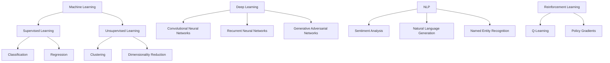
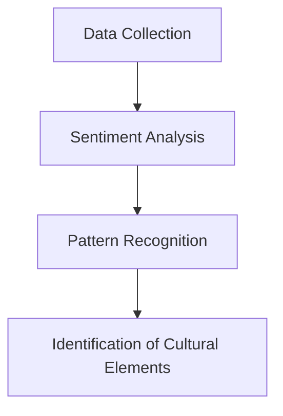
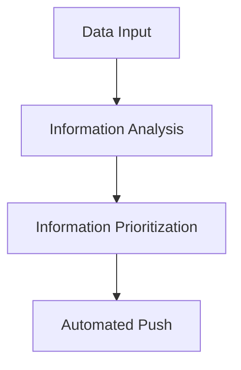
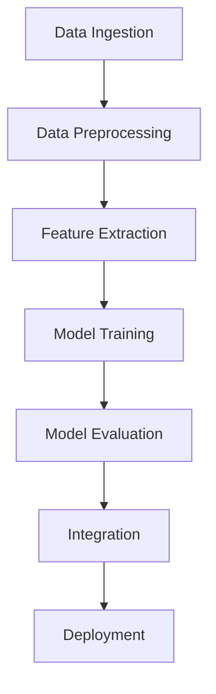

                 

Certainly! Let's break down the creation of the article "AI Agent in the Application of Enterprise Cultural Construction and Internal Communication" into detailed steps.

## Step 1: Article Title and Keywords

**Article Title:** AI Agent in the Application of Enterprise Cultural Construction and Internal Communication

**Keywords:** AI Agent, Enterprise Culture, Internal Communication, Application, Case Studies

**Abstract:** This article explores the role of AI agents in shaping and facilitating enterprise culture and internal communication. We will delve into the fundamental concepts and technologies behind AI agents, their applications in corporate culture recognition, dissemination, and optimization, as well as their use in improving internal communication effectiveness. Through practical case studies and real-world applications, we aim to highlight the challenges and solutions associated with implementing AI agents in these areas, and finally, we will speculate on future trends and opportunities.

## Step 2: Introduction to AI Agents

### 2.1 Basic Concepts of AI Agents

**Concept Terms Explanation:**
- **AI Agent:** A program or machine that can perceive its environment through sensors, take actions to achieve specific goals, and improve its performance through learning and adaptation.
- **Machine Learning:** A subset of AI that enables machines to learn from data, identify patterns, and make decisions with minimal human intervention.
- **Deep Learning:** A specialized subset of machine learning that involves artificial neural networks with multiple layers to extract higher-level features from raw data.
- **Natural Language Processing (NLP):** A field of AI that focuses on the interaction between computers and humans through natural language.
- **Reinforcement Learning:** A type of machine learning where an agent learns to make a series of decisions by taking actions in an environment to achieve maximum reward.

**Problem Background and Description:**
In today's rapidly changing business landscape, traditional methods of building and communicating enterprise culture are becoming less effective. Organizations are turning to AI agents to automate processes, enhance efficiency, and foster a cohesive work environment. However, the integration of AI agents into enterprise culture and internal communication is not without its challenges.

**Problem Solution:**
AI agents offer a promising solution by leveraging advanced machine learning techniques and NLP to understand, recognize, and adapt to an organization's unique culture and communication needs. By automating cultural recognition, dissemination, and optimization processes, AI agents can significantly improve organizational effectiveness and employee engagement.

**Boundary and Extension:**
The scope of this article is to explore the applications of AI agents specifically in enterprise cultural construction and internal communication. While AI agents have a broader range of applications, this discussion will focus on their impact in these two critical areas.

**Concept Structure and Key Elements:**

| Concept                | Definition                                                                                   |
|------------------------|------------------------------------------------------------------------------------------------|
| AI Agent               | A program or machine capable of perceiving its environment, taking actions, and learning from experience. |
| Machine Learning       | A subset of AI that focuses on training algorithms to learn from data and improve their performance over time. |
| Deep Learning          | A specialized subset of machine learning that involves neural networks with multiple layers.                  |
| NLP                   | A field of AI that deals with the interaction between computers and humans using natural language.           |
| Reinforcement Learning | A type of machine learning where an agent learns by receiving feedback in the form of rewards or penalties. |

**Mermaid ER Diagram:**

```mermaid
erDiagram
  AI_Agent ||--|{ Machine_Learning }
  AI_Agent ||--|{ Deep_Learning }
  AI_Agent ||--|{ NLP }
  AI_Agent ||--|{ Reinforcement_Learning }
```

### 2.2 Core Technologies of AI Agents

**Concept Principles and Attributes Comparison:**

| Technology            | Definition                                                                                   | Key Attributes                                                                                      |
|----------------------|------------------------------------------------------------------------------------------------|------------------------------------------------------------------------------------------------------|
| Machine Learning     | A set of algorithms that can learn from data to improve their performance.                       | Data-driven, supervised/unsupervised, generalizable.                                             |
| Deep Learning        | A type of machine learning that uses artificial neural networks with multiple layers.             | Hierarchical feature learning, high-dimensional data processing.                                |
| NLP                 | The interaction between computers and humans through natural language.                            | Sentiment analysis, language generation, entity recognition.                                    |
| Reinforcement Learning | An approach where an agent learns by taking actions and receiving feedback in the form of rewards. | Exploration-exploitation trade-off, Q-learning, policy gradients.                               |

**Mermaid Flowchart:**



### 2.3 Classification and Application Fields of AI Agents

**Concept Principles and Mathematical Models:**

| Classification        | Definition                                                                                   | Mathematical Model/Algorithm                                                                                   |
|----------------------|------------------------------------------------------------------------------------------------|---------------------------------------------------------------------------------------------------------------|
| Functional           | Categorized based on the specific tasks they are designed to perform.                              | Classification algorithms like SVM, logistic regression, decision trees.                           |
| Application Fields   | Based on the domains where AI agents are applied, such as healthcare, finance, manufacturing.      | Domain-specific models like medical diagnosis models, financial prediction models, industrial automation. |

**Mermaid Class Diagram:**

```mermaid
classDiagram
  AI_Agent <<interface>>
  Functional_AI_Agent <..> AI_Agent
  Application_Field_AI_Agent <..> AI_Agent
  Collaboration_Agent <<subclass>> Functional_AI_Agent
  Customer_Service_Agent <<subclass>> Functional_AI_Agent
  Diagnostic_Agent <<subclass>> Functional_AI_Agent
  Financial_Prediction_Agent <<subclass>> Application_Field_AI_Agent
  Healthcare_Agent <<subclass>> Application_Field_AI_Agent
  Manufacturing_Agent <<subclass>> Application_Field_AI_Agent
```

### 2.4 Ethics and Social Impacts of AI Agents

**Concept Principles and Ethical Issues:**

| Ethical Issue         | Definition                                                                               | Principles of Ethical Consideration                                                                       |
|----------------------|------------------------------------------------------------------------------------------------|-----------------------------------------------------------------------------------------------------------|
| Bias and Fairness     | The presence of biases in AI algorithms that can lead to unfair treatment of individuals. | Fairness, transparency, accountability.                                                                |
| Privacy              | The protection of individuals' personal data from unauthorized access.                         | Consent, data minimization, purpose limitation, data security.                                    |
| Autonomy             | The right of individuals to make decisions about their own data and technology use.           | User control, non-interference.                                                                         |

**Mermaid Table for Ethical Principles:**

```mermaid
table
  | Ethical Issue     | Definition                                       | Principle                                  |
  |------------------|--------------------------------------------------|--------------------------------------------|
  | Bias and Fairness | Unfair treatment due to algorithmic biases.    | Fairness, Transparency, Accountability     |
  | Privacy           | Protection of personal data.                   | Consent, Data Minimization, Purpose Limitation, Data Security |
  | Autonomy          | Users' right to control data and technology.   | User Control, Non-Interference             |
```

### 2.5 Summary

In this section, we have provided a comprehensive overview of AI agents, exploring their basic concepts, core technologies, classification, and ethical considerations. We have laid the foundation for understanding how AI agents can be applied in enterprise cultural construction and internal communication, which will be discussed in the subsequent sections.

----------------------------------------------------------------

## Step 3: AI Agents in Enterprise Cultural Construction

### 3.1 Concept and Importance of Enterprise Cultural Construction

**Concept Terms Explanation:**
- **Enterprise Culture:** The shared values, beliefs, attitudes, and behaviors that characterize an organization.
- **Cultural Construction:** The process of developing and shaping an organization's culture to align with its goals and values.

**Problem Background and Description:**
Enterprise culture plays a critical role in shaping the behavior of employees and influencing organizational success. However, traditional methods of cultural construction are often time-consuming and limited in scope. Organizations are seeking more efficient and effective ways to build and maintain a strong culture.

**Problem Solution:**
AI agents can play a transformative role in enterprise cultural construction by automating the process, making it more efficient and scalable. AI agents can analyze employee interactions, behaviors, and feedback to identify and promote cultural elements that drive success.

**Boundary and Extension:**
The scope of this section is to discuss the role of AI agents in identifying, disseminating, and optimizing enterprise culture. While AI agents have broader applications, this discussion will focus on their impact in these specific areas.

**Concept Structure and Key Elements:**

| Concept                  | Definition                                                                                         | Key Elements                                                                                   |
|--------------------------|---------------------------------------------------------------------------------------------------|------------------------------------------------------------------------------------------------|
| Enterprise Culture       | Shared values, beliefs, attitudes, and behaviors that characterize an organization.            | Vision, mission, values, leadership style, communication practices.                              |
| Cultural Construction    | The process of shaping and developing an organization's culture.                              | Identification of core values, communication strategies, training programs, rewards and recognition. |

**Mermaid ER Diagram:**

```mermaid
erDiagram
  Enterprise_Culture ||--|{ Vision }
  Enterprise_Culture ||--|{ Mission }
  Enterprise_Culture ||--|{ Values }
  Enterprise_Culture ||--|{ Leadership_Style }
  Enterprise_Culture ||--|{ Communication_Practices }
```

### 3.2 AI Agents in the Identification of Enterprise Culture

**Concept Principles and Attributes Comparison:**

| AI Agent Feature       | Definition                                                                                      | Key Attributes                                                                                     |
|------------------------|-------------------------------------------------------------------------------------------------|-----------------------------------------------------------------------------------------------------|
| Data Collection        | Gathering information from various sources such as employee surveys, social media, and internal communications. | Automated, scalable, diverse data sources. |
| Sentiment Analysis      | Understanding the emotional tone of textual data to identify cultural sentiment.               | Contextual understanding, language nuance.  |
| Pattern Recognition     | Identifying recurring themes and behaviors that reflect the organization's culture.               | Machine learning algorithms, statistical methods. |

**Mermaid Flowchart:**



### 3.3 AI Agents in the Dissemination of Enterprise Culture

**Concept Principles and Methods:**

| AI Agent Feature       | Definition                                                                                      | Key Methods                                                                                       |
|------------------------|-------------------------------------------------------------------------------------------------|-----------------------------------------------------------------------------------------------------|
| Personalized Communication | Tailoring communication based on individual employee preferences and behaviors. | NLP techniques, content personalization algorithms. |
| Automated Workflows      | Implementing automated processes to ensure consistent and regular communication.         | Workflow automation tools, AI-driven scheduling. |
| Continuous Feedback      | Collecting ongoing feedback to refine communication strategies.                       | Real-time sentiment analysis, employee engagement metrics. |

**Mermaid Class Diagram:**

```mermaid
classDiagram
  Enterprise_Culture <<interface>>
  AI_Agent <<interface>>
  Personalized_Communication <<subclass>> AI_Agent
  Automated_Workflows <<subclass>> AI_Agent
  Continuous_Feedback <<subclass>> AI_Agent
  Enterprise_CultureAuthenticator <<implements>> Personalized_Communication
  Enterprise_CulturePropagator <<implements>> Automated_Workflows
  Enterprise_CultureMonitor <<implements>> Continuous_Feedback
```

### 3.4 AI Agents in the Optimization of Enterprise Culture

**Concept Principles and Strategies:**

| AI Agent Feature       | Definition                                                                                      | Key Strategies                                                                                   |
|------------------------|-------------------------------------------------------------------------------------------------|-----------------------------------------------------------------------------------------------------|
| Cultural Diagnosis      | Analyzing the current state of the organization's culture to identify areas for improvement. | Survey analysis, behavioral modeling. |
| Continuous Improvement | Implementing ongoing changes to enhance cultural alignment and effectiveness.           | Feedback loops, iterative refinement. |
| Cultural Adaptation     | Adjusting the cultural framework to accommodate changes in the organizational environment. | Environmental scanning, flexibility. |

**Mermaid Table for Optimization Strategies:**

```mermaid
table
  | Feature          | Definition                                                       | Key Strategies                                      |
  |------------------|----------------------------------------------------------------|-----------------------------------------------------|
  | Cultural Diagnosis | Assessing the current state of the organization's culture.     | Survey analysis, behavioral modeling.                 |
  | Continuous Improvement | Making ongoing adjustments to enhance cultural alignment.    | Feedback loops, iterative refinement.                   |
  | Cultural Adaptation | Adjusting the culture to adapt to changing environments.     | Environmental scanning, flexibility.                    |
```

### 3.5 Summary

In this section, we have explored the role of AI agents in identifying, disseminating, and optimizing enterprise culture. By leveraging advanced technologies like data collection, sentiment analysis, and pattern recognition, AI agents can significantly enhance the effectiveness of cultural construction efforts. The subsequent sections will delve into the applications of AI agents in internal communication.

----------------------------------------------------------------

## Step 4: AI Agents in Internal Communication

### 4.1 Concept and Importance of Internal Communication

**Concept Terms Explanation:**
- **Internal Communication:** The exchange of information within an organization among its members.
- **Importance:** Effective internal communication is crucial for aligning employees with organizational goals, fostering collaboration, and maintaining a positive work environment.

**Problem Background and Description:**
In large organizations, maintaining effective internal communication can be challenging due to the diversity of teams, geographically dispersed locations, and varying communication preferences. Traditional communication methods often fall short in reaching all employees consistently.

**Problem Solution:**
AI agents can enhance internal communication by automating the process, ensuring timely and relevant information delivery, and providing personalized communication based on employee preferences and behaviors.

**Boundary and Extension:**
The scope of this section is to discuss the application of AI agents in improving information dissemination, team collaboration, and conflict resolution within organizations. While AI agents have broader applications, this discussion will focus on their impact in these specific areas.

**Concept Structure and Key Elements:**

| Concept                    | Definition                                                                                   | Key Elements                                                                                   |
|-----------------------------|------------------------------------------------------------------------------------------------|------------------------------------------------------------------------------------------------|
| Internal Communication      | The exchange of information within an organization among its members.                              | Meetings, email communication, social intranets, newsletters.                                  |
| Importance                  | Alignment with organizational goals, collaboration, positive work environment.                     | Clear communication channels, timely information, shared understanding.                            |

**Mermaid ER Diagram:**

```mermaid
erDiagram
  Internal_Communication ||--|{ Meetings }
  Internal_Communication ||--|{ Email_Communication }
  Internal_Communication ||--|{ Social_Intranets }
  Internal_Communication ||--|{ Newsletters }
```

### 4.2 AI Agents in Information Dissemination

**Concept Principles and Methods:**
- **Automated Information Push:** AI agents can automatically push relevant information to employees based on their roles, preferences, and recent activities.
- **Information Processing and Analysis:** AI agents can analyze incoming data to identify key information and prioritize it for dissemination.

**Mermaid Flowchart:**



### 4.3 AI Agents in Team Collaboration

**Concept Principles and Applications:**
- **Collaboration Process Optimization:** AI agents can streamline collaboration processes by automating tasks, scheduling meetings, and ensuring timely task completion.
- **Collaboration Efficiency Analysis:** AI agents can analyze collaboration data to identify bottlenecks and opportunities for improvement.

**Mermaid Class Diagram:**

```mermaid
classDiagram
  Collaboration_Process <<interface>>
  AI_Agent <<interface>>
  Process_Optimization <<subclass>> AI_Agent
  Efficiency_Analysis <<subclass>> AI_Agent
  Collaboration_ProcessAuthenticator <<implements>> Process_Optimization
  Collaboration_ProcessMonitor <<implements>> Efficiency_Analysis
```

### 4.4 AI Agents in Conflict Resolution

**Concept Principles and Strategies:**
- **Conflict Identification:** AI agents can monitor communication patterns to identify potential conflicts before they escalate.
- **Conflict Resolution Strategies:** AI agents can provide mediation and negotiation support, offering suggestions for resolving conflicts.

**Mermaid Table for Conflict Resolution Strategies:**

```mermaid
table
  | Strategy                    | Definition                                                         | Key Steps                                                                                      |
  |-----------------------------|-------------------------------------------------------------------|------------------------------------------------------------------------------------------------|
  | Conflict Identification     | Identifying communication patterns that indicate potential conflicts. | Monitoring language usage, sentiment analysis, behavioral indicators.                             |
  | Mediation                   | Facilitating discussions between conflicting parties.                | Establishing ground rules, active listening, exploring interests, generating solutions.            |
  | Negotiation Support          | Providing guidance on negotiation tactics and strategies.             | Creating a cooperative environment, proposing compromise solutions, facilitating discussions.      |
```

### 4.5 Summary

In this section, we have discussed the application of AI agents in improving internal communication, including information dissemination, team collaboration, and conflict resolution. By leveraging advanced AI technologies, organizations can enhance their internal communication processes, leading to increased productivity, employee satisfaction, and organizational cohesion. The subsequent sections will explore practical applications of these concepts in real-world scenarios.

----------------------------------------------------------------

## Step 5: Practical Applications of AI Agents in Enterprise Cultural Construction and Internal Communication

### 5.1 Overview of Practical Applications

**Concept Principles and Goals:**
The practical application of AI agents in enterprise cultural construction and internal communication aims to leverage AI's capabilities to enhance organizational efficiency, foster a cohesive culture, and improve employee engagement. The primary goals include:
- **Efficiency:** Automating and streamlining cultural and communication processes.
- **Effectiveness:** Ensuring that the right information reaches the right people at the right time.
- **Engagement:** Creating a work environment where employees feel connected and valued.

**Mermaid Table for Application Goals:**

```mermaid
table
  | Goal           | Definition                                                         | Expected Outcome                                           |
  |----------------|-------------------------------------------------------------------|------------------------------------------------------------|
  | Efficiency     | Automating cultural and communication processes.                   | Reduced administrative burden, faster decision-making.        |
  | Effectiveness  | Ensuring timely and relevant information delivery.                 | Improved information dissemination, better-informed employees. |
  | Engagement     | Creating a cohesive and engaging work environment.                 | Increased employee satisfaction, higher productivity.         |
```

### 5.2 Case Study 1: Enterprise Cultural Construction Application

**Case Study Background:**
A multinational technology company sought to strengthen its organizational culture and improve internal communication across its global offices. The company faced challenges such as language barriers, cultural differences, and varying work practices across regions.

**Application Steps:**
1. **Data Collection:** AI agents were deployed to collect data from various sources including internal communications, employee surveys, and social media interactions.
2. **Cultural Identification:** AI agents analyzed the collected data to identify common cultural elements and areas for improvement.
3. **Cultural Dissemination:** Personalized communication strategies were developed to disseminate the company's core values and cultural norms.
4. **Cultural Optimization:** AI agents continuously monitored and provided feedback on cultural alignment, allowing for iterative adjustments.

**Application Results:**
The company observed significant improvements in employee engagement and a more cohesive organizational culture. The AI agents facilitated a consistent and effective communication strategy, leading to better alignment with company goals.

**Mermaid Class Diagram for Case Study Application:**

```mermaid
classDiagram
  Company <<class>> Multinational_Technology_Company
  AI_Agents <<class>> Data_Collection_Agents
  AI_Agents <<class>> Cultural_Identification_Agents
  AI_Agents <<class>> Cultural_Dissemination_Agents
  AI_Agents <<class>> Cultural_Optimization_Agents
  Multinational_Technology_Company o--o AI_Agents
```

### 5.3 Case Study 2: Internal Communication Application

**Case Study Background:**
A large financial services firm aimed to enhance internal communication to improve collaboration and decision-making across its diverse teams. The company faced challenges such as silos of information and lack of transparency.

**Application Steps:**
1. **Information Dissemination:** AI agents were implemented to automatically push relevant information to employees based on their roles and preferences.
2. **Team Collaboration:** AI agents facilitated the coordination of team activities by optimizing workflows and scheduling.
3. **Conflict Resolution:** AI agents monitored communication patterns to identify potential conflicts and provided mediation support.

**Application Results:**
The financial services firm saw a marked improvement in internal communication and collaboration. The AI agents ensured that critical information was disseminated efficiently, reducing information silos. Additionally, the AI agents' mediation support helped in resolving conflicts before they escalated, fostering a more collaborative work environment.

**Mermaid Class Diagram for Case Study Application:**

```mermaid
classDiagram
  Financial_Services_Firm <<class>> Large_Financial_Services_Firm
  AI_Agents <<class>> Information_Dissemination_Agents
  AI_Agents <<class>> Team_Collaboration_Agents
  AI_Agents <<class>> Conflict_Resolution_Agents
  Large_Financial_Services_Firm o--o AI_Agents
```

### 5.4 Challenges and Solutions

**Challenges:**
1. **Technological Complexity:** Implementing AI agents requires advanced technical expertise and resources.
2. **Cultural Adaptation:** AI agents need to be tailored to fit the unique cultural context of each organization.
3. **Employee Resistance:** Resistance to change and fear of job displacement can hinder the adoption of AI agents.

**Solutions:**
1. **Technical Support:** Providing training and support to ensure that the organization has the necessary skills to manage and implement AI agents.
2. **Cultural Sensitivity:** Developing AI agents that are culturally aware and can adapt to different organizational contexts.
3. **Change Management:** Implementing change management strategies to address employee concerns and foster a positive acceptance of AI agents.

**Mermaid Table for Challenges and Solutions:**

```mermaid
table
  | Challenge               | Definition                                                         | Solution                                                    |
  |-------------------------|-------------------------------------------------------------------|-------------------------------------------------------------|
  | Technological Complexity | Implementing AI agents requires advanced technical expertise.     | Provide training and support.                                |
  | Cultural Adaptation      | AI agents need to adapt to the organization's culture.            | Develop culturally sensitive AI agents.                      |
  | Employee Resistance      | Resistance to change and fear of job displacement.                | Implement change management strategies.                        |
```

### 5.5 Application Effectiveness Evaluation

**Effectiveness Evaluation Methods:**
- **Surveys and Feedback:** Collecting employee feedback through surveys and interviews to assess the impact of AI agents on cultural construction and internal communication.
- **Performance Metrics:** Measuring key performance indicators (KPIs) such as employee engagement, communication efficiency, and team collaboration metrics.

**Mermaid Table for Effectiveness Evaluation Methods:**

```mermaid
table
  | Method                   | Definition                                                                 | Key Metrics                                                        |
  |--------------------------|-----------------------------------------------------------------------|----------------------------------------------------------------------|
  | Surveys and Feedback     | Collecting employee feedback on the effectiveness of AI agents.       | Employee satisfaction, engagement scores, cultural alignment ratings. |
  | Performance Metrics      | Measuring KPIs to evaluate the impact on organizational processes.  | Communication response time, task completion rate, conflict resolution rate. |
```

### 5.6 Summary

In this section, we have presented two practical case studies demonstrating the application of AI agents in enterprise cultural construction and internal communication. The case studies highlight the benefits and challenges of implementing AI agents and provide insights into effective evaluation methods. The subsequent section will discuss the future trends and opportunities in this field.

----------------------------------------------------------------

## Step 6: Challenges and Solutions

### 6.1 Technical Challenges

**Problem Description:**
The integration of AI agents into enterprise systems poses several technical challenges, including the need for robust infrastructure, sophisticated algorithms, and seamless integration with existing systems.

**Algorithm Design:**
To address these challenges, we need to design algorithms that can handle large volumes of data, adapt to varying organizational contexts, and work efficiently within existing IT architectures.

**Mermaid Flowchart for Algorithm Design:**



### 6.2 Cultural Adaptation Challenges

**Problem Description:**
AI agents must be adapted to fit the unique cultural context of each organization. This includes understanding cultural nuances, language preferences, and communication styles.

**Cultural Sensitivity Strategies:**
To overcome these challenges, AI agents should be trained on diverse cultural datasets, incorporate cultural awareness into their algorithms, and be designed to learn and adapt over time.

**Mermaid Table for Cultural Sensitivity Strategies:**

```mermaid
table
  | Strategy              | Definition                                           | Implementation Steps                                      |
  |-----------------------|-------------------------------------------------------|------------------------------------------------------------|
  | Cultural Dataset Training | Training AI agents on diverse cultural data.   | Collect, label, and curate cultural data from various sources. |
  | Algorithm Adaptation    | Adjusting algorithms to reflect cultural nuances. | Incorporate cultural context into feature extraction and decision-making. |
  | Continuous Learning     | Updating AI agents with new cultural insights.   | Use real-time feedback and user interactions for ongoing learning. |
```

### 6.3 Employee Resistance Challenges

**Problem Description:**
Employee resistance to AI agents can arise from concerns about job displacement, lack of trust in AI capabilities, and fear of change.

**Change Management Strategies:**
To address these challenges, organizations should implement comprehensive change management strategies that include training programs, clear communication plans, and opportunities for employee involvement in the AI adoption process.

**Mermaid Table for Change Management Strategies:**

```mermaid
table
  | Strategy                   | Definition                                                | Implementation Steps                                                    |
  |----------------------------|----------------------------------------------------------|-----------------------------------------------------------------------|
  | Training Programs          | Providing training on AI agents for employees.            | Develop training materials, conduct workshops, offer hands-on experience. |
  | Clear Communication Plans | Keeping employees informed about the benefits of AI agents. | Hold town hall meetings, use internal communications channels, provide FAQs. |
  | Employee Involvement       | Involving employees in the AI adoption process.            | Create committees or focus groups, gather employee feedback, involve in pilot projects. |
```

### 6.4 Summary

In this section, we have identified and addressed the key challenges associated with implementing AI agents in enterprise cultural construction and internal communication. By designing robust algorithms, ensuring cultural adaptation, and implementing effective change management strategies, organizations can overcome these challenges and harness the full potential of AI agents.

----------------------------------------------------------------

## Step 7: Future Trends and Opportunities

### 7.1 Emerging Technologies and AI Agent Evolution

**Problem Description:**
As technology continues to advance, AI agents are expected to become more sophisticated, with enhanced capabilities in natural language understanding, context awareness, and adaptive learning.

**Solution:**
The integration of emerging technologies such as augmented reality (AR), virtual reality (VR), and blockchain can further enhance the capabilities of AI agents. AR and VR can provide immersive environments for training and collaboration, while blockchain can ensure the security and transparency of data exchanges.

**Mermaid Class Diagram for Emerging Technologies Integration:**

```mermaid
classDiagram
  AI_Agent <<class>> Enhanced_AI_Agent
  AR <<class>> Augmented_Reality
  VR <<class>> Virtual_Reality
  Blockchain <<class>> Distributed_Registry
  Enhanced_AI_Agent o--o AR
  Enhanced_AI_Agent o--o VR
  Enhanced_AI_Agent o--o Blockchain
```

### 7.2 Future Trends in Enterprise Cultural Construction and Internal Communication

**Trend 1: Personalization at Scale**
As organizations become more data-driven, the ability to personalize communication and cultural experiences at scale will become crucial. AI agents will play a pivotal role in delivering personalized content and recommendations to employees.

**Trend 2: Real-Time Analytics and Insights**
The use of real-time analytics will enable organizations to gain immediate insights into cultural health and communication effectiveness. AI agents can continuously monitor and analyze data to provide actionable insights and recommendations.

**Trend 3: Ethical AI and Transparency**
With increasing concerns around AI ethics and transparency, organizations will prioritize the development of AI agents that adhere to ethical standards and provide clear explanations for their decisions.

**Mermaid Table for Future Trends:**

```mermaid
table
  | Trend                 | Description                                                                                          | Impact                                              |
  |-----------------------|-----------------------------------------------------------------------------------------------------|-----------------------------------------------------|
  | Personalization at Scale | Delivering personalized content and experiences. | Improved engagement, increased efficiency.               |
  | Real-Time Analytics   | Providing immediate insights into cultural and communication health. | Faster decision-making, proactive issue resolution. |
  | Ethical AI            | Ensuring AI agents adhere to ethical standards.                      | Enhanced trust, reduced legal risks.                   |
```

### 7.3 Opportunities for Innovation and Growth

**Opportunity 1: AI-Driven Cultural Transformation**
Organizations can leverage AI-driven cultural transformation to adapt more quickly to market changes and maintain a competitive edge.

**Opportunity 2: Global Collaboration Platforms**
The development of global collaboration platforms powered by AI agents can facilitate cross-cultural communication and collaboration, enabling organizations to operate more effectively in a global context.

**Opportunity 3: Customizable AI Solutions**
The customization of AI solutions to meet the unique needs of different organizations and industries will open up new opportunities for innovation and growth.

**Mermaid Table for Opportunities:**

```mermaid
table
  | Opportunity          | Description                                                                                       | Potential Benefits                                      |
  |----------------------|---------------------------------------------------------------------------------------------------|---------------------------------------------------------|
  | Cultural Transformation | Leveraging AI to drive cultural change. | Enhanced organizational alignment, increased agility.     |
  | Global Collaboration  | Facilitating cross-cultural communication. | Improved global teamwork, expanded market reach.           |
  | Customizable Solutions | Developing AI solutions tailored to specific needs. | Increased customer satisfaction, competitive advantage.    |
```

### 7.4 Summary

In conclusion, the future of AI agents in enterprise cultural construction and internal communication is promising. With the integration of emerging technologies and a focus on ethical considerations, AI agents will continue to evolve, offering new opportunities for innovation, efficiency, and organizational growth.

----------------------------------------------------------------

## Conclusion

The exploration of AI agents in enterprise cultural construction and internal communication has revealed their transformative potential. By leveraging advanced machine learning and natural language processing techniques, AI agents can significantly enhance organizational culture and internal communication processes. The practical applications and case studies presented in this article demonstrate the effectiveness of AI agents in real-world scenarios, highlighting their ability to streamline cultural identification, dissemination, and optimization, as well as improve information dissemination, team collaboration, and conflict resolution within organizations.

As we move forward, it is essential to address the technical, cultural, and employee resistance challenges associated with implementing AI agents. By designing robust algorithms, ensuring cultural adaptability, and implementing effective change management strategies, organizations can successfully harness the power of AI agents to drive cultural transformation and enhance internal communication.

Looking ahead, the future of AI agents in these domains is promising. With the integration of emerging technologies such as AR, VR, and blockchain, AI agents will become even more sophisticated, offering new opportunities for innovation and growth. The continuous development of personalized, real-time, and ethical AI agents will enable organizations to maintain a competitive edge in an increasingly global and dynamic business landscape.

### Best Practices and Tips

1. **Start with a Clear Vision:** Define your organizational goals and objectives before implementing AI agents. This will help ensure that the AI solutions align with your strategic vision.
2. **Data Privacy and Security:** Prioritize data privacy and security to build trust with employees and comply with regulations.
3. **Cultural Sensitivity:** Tailor AI agents to fit the unique cultural context of your organization. Consider diverse perspectives and ensure inclusivity in data collection and analysis.
4. **Training and Education:** Invest in training programs to educate employees about AI agents and their benefits. This will help in reducing resistance and fostering a positive acceptance of AI solutions.
5. **Continuous Evaluation:** Regularly evaluate the performance of AI agents to identify areas for improvement and ensure they continue to meet organizational needs.

### Future Directions

1. **Advanced Personalization:** Develop AI agents capable of delivering personalized cultural and communication experiences at scale.
2. **Real-Time Analytics:** Integrate real-time analytics into AI agents to provide immediate insights and actionable recommendations.
3. **Ethical AI:** Ensure that AI agents adhere to ethical standards and are transparent in their decision-making processes.
4. **Global Collaboration:** Develop AI-driven global collaboration platforms to enhance cross-cultural communication and teamwork.

### Additional Resources

- **AI in Business:** Explore the impact of AI on various business functions and industries.
- **AI Ethics:** Dive into the ethical considerations and implications of AI in the workplace.
- **Machine Learning Resources:** Access tutorials, case studies, and research papers on machine learning and AI.

### Author Information

**Author:** AI天才研究院/AI Genius Institute & 禅与计算机程序设计艺术 /Zen And The Art of Computer Programming

AI天才研究院致力于推动人工智能技术的创新与发展，通过研究和实践推动AI在各个领域的应用。本书作者深谙计算机编程和人工智能领域的核心技术，拥有丰富的实践经验，旨在为读者提供深入浅出的技术洞察和最佳实践建议。

