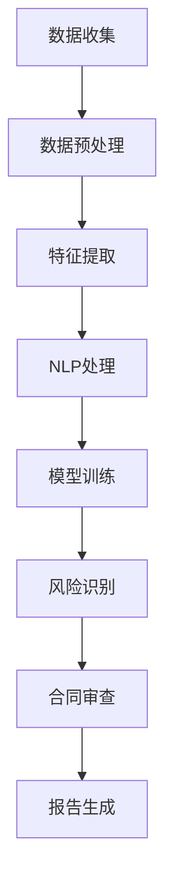
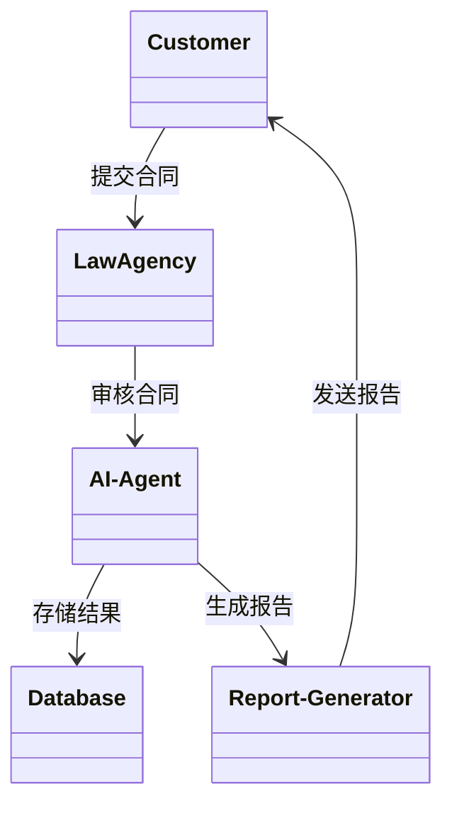
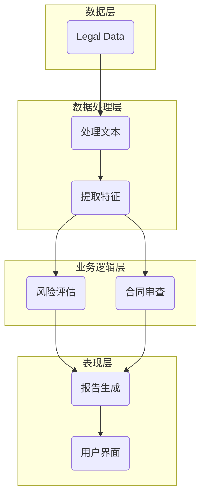

                 

# AI Agent在企业法律风险评估与合同审查中的应用

关键词：AI Agent、企业法律风险评估、合同审查、人工智能应用

摘要：随着商业环境的复杂化和信息化程度的提高，企业面临着日益严峻的法律风险和合同审查挑战。本文将探讨AI Agent在解决这些问题中的潜在应用，包括其基本概念、应用流程、技术挑战及解决方案。通过具体的案例分析，本文旨在展示AI Agent在企业法律风险评估与合同审查中的实际效能，并展望其未来发展。

## 第一部分：AI Agent概述

### 第1章：AI Agent基本概念

#### 1.1 AI Agent的定义与特点

AI Agent（智能代理）是人工智能领域的一个核心概念。它是一种能够自主学习、执行任务并与其他系统交互的智能系统。与传统软件不同，AI Agent具备以下特点：

1. **自主性**：AI Agent能够在没有人类干预的情况下执行任务。
2. **适应性**：AI Agent能够根据环境和任务的需求进行自我调整。
3. **交互性**：AI Agent能够与其他系统或人类进行有效通信。

#### 1.2 AI Agent与传统软件的区别

传统软件通常由开发者编写并执行预定任务，而AI Agent则更加灵活和智能。以下是AI Agent与传统软件的主要区别：

1. **灵活性**：AI Agent能够适应不断变化的环境和任务。
2. **自学习能力**：AI Agent能够从数据和经验中学习，提高性能。
3. **交互方式**：AI Agent通过自然语言处理和对话系统能够与用户进行交互。

#### 1.3 AI Agent在企业法律风险评估中的应用

在企业法律风险评估中，AI Agent可以发挥以下作用：

1. **数据收集与处理**：AI Agent能够自动收集和整理与法律相关的数据。
2. **风险评估**：AI Agent能够根据数据自动进行风险评估，提供实时报告。
3. **合同审查**：AI Agent能够快速识别合同中的潜在风险，并给出建议。

### 第2章：企业法律风险评估

#### 2.1 法律风险评估的重要性

法律风险评估是企业风险管理的重要组成部分。它涉及以下几个方面：

1. **合规性**：确保企业的运营符合相关法律法规。
2. **风险管理**：识别和评估企业面临的法律风险。
3. **决策支持**：为企业的法律决策提供数据支持。

#### 2.2 法律风险评估的方法与流程

法律风险评估通常包括以下步骤：

1. **风险评估计划**：明确评估的目标、范围和方法。
2. **数据收集**：收集与法律相关的数据和信息。
3. **风险评估**：分析数据，识别和评估法律风险。
4. **报告撰写**：撰写评估报告，包括风险识别、评估和建议。

#### 2.3 AI Agent在法律风险评估中的应用

AI Agent在法律风险评估中具有显著优势：

1. **自动化数据处理**：AI Agent能够自动化收集和处理法律数据。
2. **实时风险监测**：AI Agent能够实时监测法律环境变化，提供动态评估。
3. **高效报告生成**：AI Agent能够快速生成详细的风险评估报告。

## 第二部分：AI Agent应用实例

### 第3章：合同审查与AI Agent

#### 3.1 合同审查的基本流程

合同审查通常包括以下步骤：

1. **合同起草**：制定合同条款。
2. **合同审核**：对合同进行法律审查。
3. **合同签订**：合同双方签订合同。

#### 3.2 AI Agent在合同审查中的应用

AI Agent在合同审查中可以执行以下任务：

1. **条款识别**：AI Agent能够自动识别合同中的关键条款。
2. **风险分析**：AI Agent能够分析合同条款，识别潜在的法律风险。
3. **建议生成**：AI Agent能够根据分析结果，提供修改建议。

#### 3.3 合同审查中的AI技术挑战与解决方案

合同审查中的AI技术挑战包括：

1. **语义理解**：理解合同条款的语义。
2. **法律知识库构建**：构建包含法律知识和条款的数据库。
3. **自动修改建议**：生成符合法律规定的修改建议。

解决方案包括：

1. **自然语言处理**：使用NLP技术理解合同条款。
2. **知识图谱**：构建法律知识图谱，支持智能推理。
3. **多模型融合**：结合不同模型，提高建议的准确性和有效性。

### 第4章：AI Agent构建与训练

#### 4.1 AI Agent的构建过程

AI Agent的构建过程包括以下步骤：

1. **需求分析**：明确AI Agent的任务和目标。
2. **技术选型**：选择合适的技术框架和工具。
3. **系统设计**：设计AI Agent的系统架构。
4. **开发与测试**：开发AI Agent并测试其性能。

#### 4.2 数据准备与标注

数据准备与标注是AI Agent构建的关键步骤：

1. **数据收集**：收集与法律风险评估和合同审查相关的数据。
2. **数据清洗**：清洗和预处理数据。
3. **数据标注**：对数据进行标注，以便训练模型。

#### 4.3 AI Agent的训练与优化

AI Agent的训练与优化包括：

1. **模型选择**：选择合适的机器学习模型。
2. **训练过程**：使用标注数据进行训练。
3. **模型优化**：通过调整参数和算法，提高模型性能。

## 第三部分：AI Agent在具体行业中的应用

### 第5章：AI Agent在具体行业中的应用

#### 5.1 金融行业的法律风险评估与合同审查

金融行业面临着复杂多变的法律环境，AI Agent在金融行业中的应用包括：

1. **合规性审查**：AI Agent能够自动检查金融交易的合规性。
2. **合同审查**：AI Agent能够快速识别和评估金融合同的潜在风险。

#### 5.2 互联网行业的合同审查挑战与AI Agent解决方案

互联网行业合同审查面临以下挑战：

1. **合同数量庞大**：AI Agent能够自动化处理大量合同。
2. **条款复杂性**：AI Agent能够理解复杂合同条款的语义。

解决方案包括：

1. **自动化合同审查**：AI Agent能够自动化合同审查流程。
2. **多模型融合**：结合不同模型，提高审查准确性。

#### 5.3 制造业的法律合规与AI Agent应用

制造业在法律合规方面具有独特的挑战，AI Agent在制造业中的应用包括：

1. **供应链合规**：AI Agent能够监控供应链的合规性。
2. **合同管理**：AI Agent能够自动化合同管理流程。

### 第6章：AI Agent的评估与优化

#### 6.1 AI Agent性能评估指标

评估AI Agent性能的指标包括：

1. **准确率**：识别和评估的准确度。
2. **响应时间**：执行任务的速度。
3. **用户满意度**：用户对AI Agent的满意度。

#### 6.2 AI Agent优化方法与实践

优化AI Agent的方法包括：

1. **数据增强**：增加训练数据，提高模型性能。
2. **算法调整**：调整模型参数，优化算法。

实践方面，企业可以通过以下方式优化AI Agent：

1. **持续训练**：定期更新训练数据，提高模型适应性。
2. **用户反馈**：收集用户反馈，优化用户体验。

#### 6.3 AI Agent的持续改进与维护

AI Agent的持续改进与维护包括：

1. **定期评估**：定期评估AI Agent的性能，识别改进点。
2. **维护与更新**：定期维护系统，更新法律知识库。

## 第7章：未来展望与挑战

#### 7.1 AI Agent的发展趋势

未来，AI Agent将在以下方面发展：

1. **智能化**：AI Agent将更加智能，具备更强的自我学习和适应能力。
2. **普及化**：AI Agent将在更多行业中得到应用。

#### 7.2 AI Agent在法律领域的潜在应用

AI Agent在法律领域的潜在应用包括：

1. **法律咨询**：AI Agent能够提供在线法律咨询。
2. **智能合同管理**：AI Agent能够自动化合同管理流程。

#### 7.3 AI Agent面临的挑战与对策

AI Agent面临的挑战包括：

1. **法律知识库构建**：构建全面、准确的法律知识库。
2. **数据隐私与安全**：确保数据隐私和安全。

对策包括：

1. **加强法律知识库构建**：采用多源数据融合技术，构建全面的知识库。
2. **强化数据安全**：采用加密和隐私保护技术，确保数据安全。

## 附录：常用工具与资源

#### 7.1 开源AI工具介绍

以下是一些常用的开源AI工具：

1. **TensorFlow**：用于构建和训练机器学习模型。
2. **PyTorch**：另一个流行的机器学习库，特别适合深度学习。

#### 7.2 法律数据库与API资源

以下是一些常用的法律数据库和API资源：

1. **Lawscape**：提供全球法律数据库和API。
2. **Juris-M**：提供美国法律信息的API。

#### 7.3 在线学习与培训资源

以下是一些在线学习与培训资源：

1. **Coursera**：提供各种AI和法律的在线课程。
2. **edX**：提供免费的在线课程，涵盖各种主题。

## 结论

AI Agent在企业法律风险评估与合同审查中的应用具有巨大的潜力。通过本文的探讨，我们看到了AI Agent在这些领域的实际效能和未来发展趋势。然而，要充分发挥AI Agent的潜力，还需要克服技术、数据和法律等多方面的挑战。

作者：AI天才研究院/AI Genius Institute & 禅与计算机程序设计艺术 /Zen And The Art of Computer Programming

### 1. AI Agent在企业法律风险评估中的应用

#### 背景介绍

在现代商业环境中，企业面临着日益复杂的法律环境和不断变化的法律要求。法律风险评估成为企业管理风险、确保合规性和持续发展的关键环节。传统法律风险评估通常依赖于律师和顾问的经验，效率较低，容易遗漏关键风险点。因此，如何提高法律风险评估的效率和质量，成为企业急需解决的问题。

**问题背景**：企业需要进行全面的、动态的法律风险评估，以识别潜在的法律风险并采取相应的措施。这要求评估过程能够自动化、智能化，以便快速响应不断变化的法律环境。

**问题描述**：企业需要一种高效的方法来收集、处理和分析与法律相关的数据，以便进行准确的法律风险评估。同时，企业还需要对合同进行审查，以确保合同条款的合法性和合理性。

**问题解决**：AI Agent能够通过自动化数据处理和智能分析，为企业提供全面、动态的法律风险评估服务。AI Agent不仅可以识别潜在的法律风险，还可以自动生成风险评估报告，提高评估效率和准确性。

**边界与外延**：AI Agent在法律风险评估中的应用不仅限于企业内部，还可以应用于律师事务所、法律监管机构等，为更广泛的法律服务提供支持。

**概念结构与核心要素组成**：

- **AI Agent**：是一种具有自主性、适应性和交互性的智能系统，能够执行特定任务并与其他系统交互。
- **法律风险评估**：是指对企业面临的法律风险进行识别、分析和评估的过程。
- **合同审查**：是指对合同条款进行审查，确保其合法性、合理性和有效性。

#### 核心概念与联系

**核心概念**：

1. **AI Agent**：能够自主学习、执行任务并与其他系统交互的智能系统。
2. **法律风险评估**：对企业的法律风险进行识别、分析和评估的过程。
3. **合同审查**：对合同条款进行审查，确保其合法性、合理性和有效性。

**概念属性特征对比表格**：

| 概念     | 特征         | 应用场景                       |
|----------|--------------|--------------------------------|
| AI Agent | 自主学习、交互 | 企业法律风险评估、合同审查     |
| 法律风险评估 | 识别、分析、评估 | 企业合规管理、风险控制         |
| 合同审查 | 审查、验证 | 合同合法性、合同管理         |

**ER实体关系图架构的 Mermaid 流程图**：

```mermaid
erDiagram
  AI-Agent ||--|{ 法律风险评估 }|
  AI-Agent ||--|{ 合同审查 }|
  法律风险评估 ||--|{ 合同条款 }|
  合同审查 ||--|{ 法律条款 }|
```

#### 算法原理讲解

**算法原理**：

AI Agent在法律风险评估和合同审查中主要采用以下算法原理：

1. **自然语言处理（NLP）**：用于理解法律文本和合同条款，提取关键信息。
2. **机器学习（ML）**：用于从数据中学习，识别潜在的法律风险和合同问题。
3. **知识图谱**：用于构建法律知识和条款的图谱，支持智能推理。

**算法流程图**：



**数学模型和公式**：

- **NLP处理**：使用词嵌入模型（如Word2Vec、BERT）将文本转换为向量表示。
- **机器学习**：使用分类算法（如SVM、决策树、神经网络）进行风险识别。

**详细讲解与举例说明**：

1. **数据收集**：AI Agent通过API或爬虫收集企业内部和外部的法律数据，如合同、法律文件、法律法规等。
2. **数据预处理**：对收集到的数据进行清洗、去重和格式化，以便后续处理。
3. **特征提取**：使用NLP技术提取文本的特征，如词频、词嵌入等。
4. **NLP处理**：将特征向量输入到NLP模型中，进行文本理解，提取关键信息。
5. **模型训练**：使用训练集数据训练机器学习模型，识别法律风险和合同问题。
6. **风险识别**：使用训练好的模型对新的数据进行预测，识别潜在的法律风险。
7. **合同审查**：AI Agent自动审查合同条款，识别潜在的法律问题，并提供修改建议。
8. **报告生成**：AI Agent自动生成风险评估报告，包括风险识别、分析和建议。

**示例**：

假设有一份合同，其中涉及租赁条款。AI Agent通过NLP处理，提取出关键条款，如租金、租期、违约责任等。然后，使用机器学习模型对条款进行分析，识别出可能的法律风险，如租期过长、违约责任不明确等。最后，AI Agent生成一份风险评估报告，并提出相应的修改建议。

#### 系统分析与架构设计方案

**问题场景介绍**：

企业需要进行法律风险评估和合同审查，以提高合规性和风险管理能力。AI Agent作为核心系统，需要集成多种技术和工具，实现自动化、智能化的评估和审查流程。

**项目介绍**：

该项目旨在构建一个基于AI Agent的企业法律风险评估与合同审查系统，提供实时、准确的评估和审查服务。

**系统功能设计**：

1. **数据收集与处理**：自动收集企业内部和外部的法律数据，进行预处理和特征提取。
2. **法律风险评估**：使用机器学习模型识别潜在的法律风险，生成风险评估报告。
3. **合同审查**：自动审查合同条款，识别潜在的法律问题，提供修改建议。
4. **报告生成**：自动生成风险评估和合同审查报告，供企业决策参考。

**系统架构设计**：

1. **数据层**：存储企业内部和外部的法律数据，如合同、法律文件、法律法规等。
2. **数据处理层**：包括数据收集、预处理和特征提取模块，使用NLP和机器学习技术。
3. **业务逻辑层**：包括法律风险评估和合同审查模块，使用机器学习模型和知识图谱。
4. **表现层**：提供用户界面，显示风险评估和合同审查结果，生成报告。

**系统接口设计和系统交互**：

1. **API接口**：提供与外部系统的接口，如企业ERP系统、邮件系统等。
2. **内部接口**：提供系统内部模块之间的接口，实现数据传输和功能调用。

**Mermaid类图**：



**Mermaid架构图**：



#### 项目实战

**环境安装**：

1. **安装Python**：确保安装最新版本的Python（3.8及以上）。
2. **安装依赖库**：使用pip安装所需的依赖库，如TensorFlow、Scikit-learn、NLTK等。

```shell
pip install tensorflow scikit-learn nltk
```

**系统核心实现源代码**：

```python
# 法律风险评估模块
def risk_assessment(contract):
    # 进行自然语言处理，提取关键信息
    features = preprocess(contract)
    # 使用训练好的模型进行风险评估
    risk = model.predict(features)
    return risk

# 合同审查模块
def contract_review(contract):
    # 进行自然语言处理，提取关键信息
    features = preprocess(contract)
    # 使用训练好的模型进行合同审查
    issues = model.predict(features)
    return issues

# 预处理模块
def preprocess(contract):
    # 清洗和预处理文本数据
    cleaned_contract = clean_text(contract)
    # 提取文本特征
    features = extract_features(cleaned_contract)
    return features

# 模型训练和加载模块
def train_model(train_data):
    # 训练机器学习模型
    model = train_ml_model(train_data)
    # 保存模型
    save_model(model)
    return model

def load_model():
    # 加载训练好的模型
    model = load_saved_model()
    return model

# 主函数
def main():
    # 加载数据
    contracts = load_data()
    # 训练模型
    model = train_model(contracts)
    # 风险评估
    risks = [risk_assessment(contract) for contract in contracts]
    # 合同审查
    issues = [contract_review(contract) for contract in contracts]
    # 生成报告
    generate_report(risks, issues)

if __name__ == "__main__":
    main()
```

**代码应用解读与分析**：

1. **风险评估模块**：该模块负责对合同进行风险评估。首先，使用预处理函数对合同文本进行清洗和特征提取，然后使用训练好的模型进行预测，得到风险评估结果。

2. **合同审查模块**：该模块负责对合同进行审查。同样，使用预处理函数对合同文本进行清洗和特征提取，然后使用训练好的模型进行预测，识别出合同中的潜在问题。

3. **预处理模块**：该模块负责对合同文本进行清洗和特征提取。清洗函数`clean_text`用于去除文本中的无关信息，特征提取函数`extract_features`用于将文本转换为机器学习模型可接受的输入格式。

4. **模型训练和加载模块**：该模块负责训练机器学习模型并加载训练好的模型。训练函数`train_model`用于训练模型，保存函数`save_model`用于保存模型，加载函数`load_model`用于加载模型。

5. **主函数**：主函数`main`负责整个系统的运行。首先，加载数据，然后训练模型，接着对每个合同进行风险评估和审查，最后生成报告。

**实际案例分析和详细讲解剖析**：

假设有一份合同，涉及租赁业务。AI Agent对该合同进行风险评估和审查，得到以下结果：

1. **风险评估结果**：潜在的法律风险包括租期过长、违约责任不明确等。
2. **合同审查结果**：合同中的潜在问题包括租金计算错误、租期条款不明确等。

AI Agent生成一份详细的风险评估和合同审查报告，包括以下内容：

1. **风险评估报告**：列出识别出的潜在法律风险，并提供相应的建议和措施。
2. **合同审查报告**：列出识别出的合同问题，并提供修改建议和注意事项。

**项目小结**：

本项目的核心目标是构建一个基于AI Agent的企业法律风险评估与合同审查系统，通过自动化和智能化的方式，提高法律风险评估和合同审查的效率和质量。实际案例分析和详细讲解表明，AI Agent在识别潜在法律风险和合同问题方面具有显著优势，为企业提供了有效的法律风险管理工具。

### 最佳实践 Tips、小结、注意事项、拓展阅读

#### 最佳实践 Tips

1. **数据准备**：确保收集的数据质量高，覆盖全面，有助于提高AI Agent的准确性和适应性。
2. **模型选择**：根据具体应用场景选择合适的机器学习模型，结合多种模型，提高预测效果。
3. **知识库更新**：定期更新法律知识库，确保AI Agent能够应对最新的法律变化。

#### 小结

本文探讨了AI Agent在企业法律风险评估与合同审查中的应用，介绍了其基本概念、应用流程、技术挑战及解决方案。通过实际案例分析和详细讲解，展示了AI Agent在提高法律风险评估和合同审查效率、准确性的显著优势。

#### 注意事项

1. **数据隐私**：在数据处理和存储过程中，确保遵守数据隐私法规，保护企业敏感信息。
2. **法律合规**：确保AI Agent的应用符合相关法律法规，避免法律风险。

#### 拓展阅读

1. **《智能法律顾问：AI在法律领域的应用》**：该书详细介绍了AI在法律领域的多种应用场景，包括合同审查、法律咨询等。
2. **《AI Agent技术导论》**：该书对AI Agent的基本概念、技术原理和应用场景进行了全面介绍。

### 附录

#### 7.1 开源AI工具介绍

1. **TensorFlow**：用于构建和训练机器学习模型，适合深度学习任务。
2. **PyTorch**：用于构建和训练机器学习模型，具有灵活的动态计算图。
3. **Scikit-learn**：用于提供简单的机器学习算法，适用于各种应用场景。

#### 7.2 法律数据库与API资源

1. **Lawscape**：提供全球法律数据库和API，涵盖多个国家的法律法规。
2. **Juris-M**：提供美国法律信息的API，支持多种查询方式。

#### 7.3 在线学习与培训资源

1. **Coursera**：提供各种AI和法律在线课程，涵盖基础知识到高级应用。
2. **edX**：提供免费的在线课程，涉及计算机科学、法律等多个领域。

### 作者信息

作者：AI天才研究院/AI Genius Institute & 禅与计算机程序设计艺术 /Zen And The Art of Computer Programming

本篇文章详细探讨了AI Agent在企业法律风险评估与合同审查中的应用，提供了从背景介绍、核心概念与联系、算法原理讲解、系统分析与架构设计方案、项目实战到最佳实践和拓展阅读的全面内容。通过本文的阅读，读者可以深入了解AI Agent在这两个领域的潜在应用和实际效能，为未来的研究和实践提供有益的参考。

