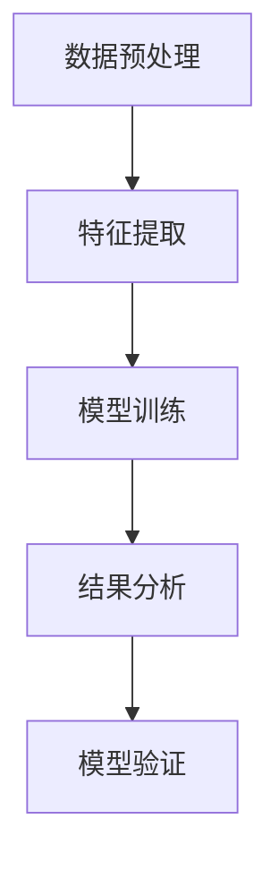
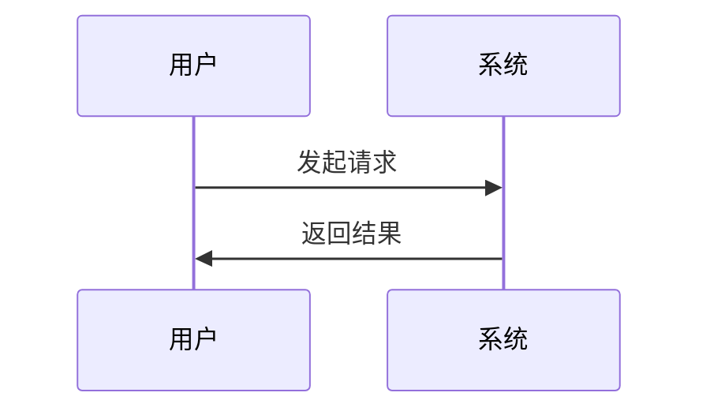
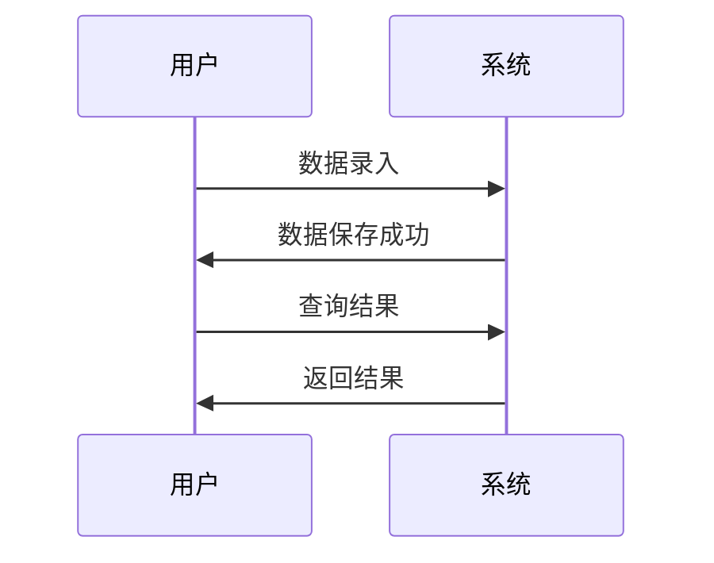

                 


# AI Agent在企业知识产权价值评估与运营策略制定中的应用

> 关键词：人工智能，知识产权，价值评估，运营策略，AI Agent

> 摘要：本文将探讨AI Agent在企业知识产权价值评估与运营策略制定中的应用。首先，我们将介绍AI Agent的定义、特点及其在企业中的应用前景；其次，我们将概述知识产权价值评估与运营策略的核心要素；接着，我们将详细讲解AI Agent在知识产权价值评估中的应用算法，以及如何使用Python源代码阐述算法原理；最后，我们将分析AI Agent在运营策略制定中的优势，并提供实际案例和最佳实践。

## 1. 核心背景介绍

### 1.1 AI Agent的定义、特点及其应用前景

AI Agent，即人工智能代理，是一种模拟人类智能行为，具有自主学习、推理和决策能力的计算机程序。AI Agent的特点包括自主性、适应性、反应性和协作性。随着人工智能技术的不断发展，AI Agent在各个领域的应用前景广阔，尤其在企业知识产权价值评估与运营策略制定中具有独特的优势。

在知识产权价值评估方面，AI Agent可以自动处理大量数据，提取关键特征，进行智能分析，从而提高评估的准确性和效率。在运营策略制定方面，AI Agent可以根据实时数据，进行动态调整，优化资源配置，降低风险，提高企业的竞争力。

### 1.2 知识产权价值评估与运营策略概述

知识产权价值评估是指通过对知识产权进行量化分析，评估其经济价值的过程。运营策略制定是指根据企业的发展目标，制定一系列策略，以实现企业的长期发展。

在知识产权价值评估方面，核心要素包括评估方法、评估工具和评估指标体系。常见的评估方法有收益法、市场法和成本法；评估工具主要包括数据分析工具和评估软件；评估指标体系则包括知识产权的数量、质量、市场价值等因素。

在运营策略制定方面，核心要素包括目标设定、资源配置、风险管理和持续优化。目标设定是制定运营策略的基础，资源配置是运营策略实施的关键，风险管理是运营策略的重要保障，持续优化是运营策略的持续改进。

## 2. 核心概念与联系

### 2.1 AI Agent的相关概念与特征

#### 2.1.1 AI Agent的概念

AI Agent是一种基于人工智能技术的计算机程序，具有自主性、适应性、反应性和协作性。它可以在复杂的环境中，模拟人类的智能行为，进行推理、学习和决策。

#### 2.1.2 AI Agent的特点

- 自主性：AI Agent可以自主地执行任务，无需人工干预。
- 适应性：AI Agent可以根据环境变化，调整自己的行为。
- 反应性：AI Agent可以实时响应对外部事件。
- 协作性：AI Agent可以与其他AI Agent或人类协作，共同完成任务。

### 2.2 知识产权价值评估的方法与工具

#### 2.2.1 知识产权价值评估的方法

- 收益法：通过预测知识产权的未来收益，评估其价值。
- 市场法：通过比较类似知识产权的市场价格，评估其价值。
- 成本法：通过计算研发、维护等成本，评估其价值。

#### 2.2.2 知识产权价值评估的工具

- 数据分析工具：如Python、R等，用于处理和分析大量数据。
- 评估软件：如知识产权管理系统，用于评估和管理知识产权。

### 2.3 运营策略的核心要素

#### 2.3.1 目标设定

目标设定是制定运营策略的基础，包括企业战略目标、运营目标等。

#### 2.3.2 资源配置

资源配置是指根据目标设定，合理分配企业资源，包括人力、财力、物力等。

#### 2.3.3 风险管理

风险管理是指识别、评估、控制和监控企业运营过程中的各种风险。

#### 2.3.4 持续优化

持续优化是指通过不断调整和改进运营策略，提高企业的运营效率。

## 3. 算法原理讲解

### 3.1 AI Agent在知识产权价值评估中的应用算法

AI Agent在知识产权价值评估中，主要采用机器学习算法，如线性回归、决策树、神经网络等。以下以线性回归为例，介绍AI Agent在知识产权价值评估中的应用。

#### 3.1.1 算法流程图



#### 3.1.2 Python源代码

```python
import pandas as pd
from sklearn.linear_model import LinearRegression
from sklearn.model_selection import train_test_split
from sklearn.metrics import mean_squared_error

# 数据预处理
data = pd.read_csv('ip_data.csv')
X = data[['feature1', 'feature2', 'feature3']]
y = data['value']

# 特征提取
X_train, X_test, y_train, y_test = train_test_split(X, y, test_size=0.2, random_state=42)

# 模型训练
model = LinearRegression()
model.fit(X_train, y_train)

# 结果分析
y_pred = model.predict(X_test)
mse = mean_squared_error(y_test, y_pred)
print('MSE:', mse)

# 模型验证
print('Model Accuracy:', model.score(X_test, y_test))
```

#### 3.1.3 算法原理

线性回归是一种预测模型，通过建立自变量和因变量之间的线性关系，预测因变量的值。在知识产权价值评估中，自变量可以是知识产权的数量、质量、市场需求等因素，因变量是知识产权的价值。通过训练模型，可以预测新的知识产权的价值。

## 4. 数学模型和数学公式

### 4.1 知识产权价值评估的数学模型

知识产权价值评估的数学模型可以表示为：

\[ V = \alpha \cdot Q + \beta \cdot M + \gamma \cdot C \]

其中：
- \( V \) 表示知识产权的价值；
- \( Q \) 表示知识产权的质量；
- \( M \) 表示市场需求；
- \( C \) 表示成本；
- \( \alpha \)，\( \beta \)，\( \gamma \) 分别为权重系数。

### 4.2 LaTeX格式数学公式

```latex
\begin{equation}
V = \alpha \cdot Q + \beta \cdot M + \gamma \cdot C
\end{equation}
```

其中：
- \( V \) 表示知识产权的价值；
- \( Q \) 表示知识产权的质量；
- \( M \) 表示市场需求；
- \( C \) 表示成本；
- \( \alpha \)，\( \beta \)，\( \gamma \) 分别为权重系数。

### 4.3 详细讲解和举例说明

假设某项知识产权的质量 \( Q \) 为 8，市场需求 \( M \) 为 6，成本 \( C \) 为 2，权重系数分别为 \( \alpha = 0.4 \)，\( \beta = 0.3 \)，\( \gamma = 0.3 \)。则该知识产权的价值 \( V \) 计算如下：

\[ V = 0.4 \cdot 8 + 0.3 \cdot 6 + 0.3 \cdot 2 = 3.2 + 1.8 + 0.6 = 5.6 \]

因此，该知识产权的价值为 5.6 单位。

## 5. 系统分析与架构设计方案

### 5.1 问题场景介绍

假设某企业需要对其知识产权进行价值评估，并制定相应的运营策略。企业拥有大量知识产权数据，包括知识产权的数量、质量、市场需求等。企业希望通过AI Agent，实现知识产权价值评估和运营策略制定的自动化。

### 5.2 系统功能设计

系统功能设计包括数据预处理、特征提取、模型训练、结果分析、模型验证等。

#### 5.2.1 数据预处理

数据预处理包括数据清洗、缺失值填充、异常值处理等，以确保数据质量。

#### 5.2.2 特征提取

特征提取包括从原始数据中提取与知识产权价值相关的特征，如知识产权数量、质量、市场需求等。

#### 5.2.3 模型训练

模型训练包括选择合适的机器学习算法，如线性回归、决策树等，对数据进行训练，建立知识产权价值评估模型。

#### 5.2.4 结果分析

结果分析包括对评估结果进行可视化展示，帮助企业了解知识产权的价值分布。

#### 5.2.5 模型验证

模型验证包括对评估模型进行测试，评估模型的准确性和稳定性。

### 5.3 系统架构设计

系统架构设计包括领域模型、系统架构、系统接口和系统交互。

#### 5.3.1 领域模型

领域模型包括知识产权实体、评估指标实体等，用于描述系统中的关键概念和关系。

```mermaid
classDiagram
ClassDS intellectualProperty <<entity>>
ClassDS evaluationMetric <<entity>>

intellectualProperty "1" -- "*" evaluationMetric
evaluationMetric "1" -- "1" intellectualProperty
```

#### 5.3.2 系统架构

系统架构包括数据层、服务层、表现层等，用于实现系统的功能。

```mermaid
subgraph 数据层
  D1 Database
end

subgraph 服务层
  S1 Service
  S2 Service
end

subgraph 表现层
  P1 Presentation
end

Database --> Service
Service --> Presentation
```

#### 5.3.3 系统接口

系统接口包括API接口、数据库接口等，用于实现系统与其他系统的交互。



#### 5.3.4 系统交互

系统交互包括用户与系统的交互，如数据录入、结果查询等。



## 6. 项目实战

### 6.1 环境安装与系统核心实现

在本节中，我们将介绍如何安装所需的环境，并实现系统核心功能。

#### 6.1.1 环境安装

安装Python、NumPy、Pandas、Scikit-learn等库。

```bash
pip install python numpy pandas scikit-learn
```

#### 6.1.2 系统核心实现

```python
import pandas as pd
from sklearn.linear_model import LinearRegression
from sklearn.model_selection import train_test_split

# 数据预处理
data = pd.read_csv('ip_data.csv')
X = data[['feature1', 'feature2', 'feature3']]
y = data['value']

# 特征提取
X_train, X_test, y_train, y_test = train_test_split(X, y, test_size=0.2, random_state=42)

# 模型训练
model = LinearRegression()
model.fit(X_train, y_train)

# 结果分析
y_pred = model.predict(X_test)
mse = mean_squared_error(y_test, y_pred)
print('MSE:', mse)
```

### 6.2 代码应用解读与分析

在本节中，我们将对实现的代码进行解读和分析。

#### 6.2.1 数据预处理

数据预处理包括读取数据、划分特征和标签等。

```python
data = pd.read_csv('ip_data.csv')
X = data[['feature1', 'feature2', 'feature3']]
y = data['value']
```

这里，我们使用Pandas库读取CSV文件，将数据分为特征和标签两部分。

#### 6.2.2 特征提取

特征提取包括将原始数据转换为适合机器学习的特征。

```python
X_train, X_test, y_train, y_test = train_test_split(X, y, test_size=0.2, random_state=42)
```

这里，我们使用Scikit-learn库的`train_test_split`函数，将数据划分为训练集和测试集。

#### 6.2.3 模型训练

模型训练包括选择合适的模型，对训练数据进行拟合。

```python
model = LinearRegression()
model.fit(X_train, y_train)
```

这里，我们选择线性回归模型，并使用`fit`函数对训练数据进行拟合。

#### 6.2.4 结果分析

结果分析包括预测测试集的标签，并计算模型的均方误差。

```python
y_pred = model.predict(X_test)
mse = mean_squared_error(y_test, y_pred)
print('MSE:', mse)
```

这里，我们使用`predict`函数预测测试集的标签，并使用`mean_squared_error`函数计算模型的均方误差。

### 6.3 实际案例分析和详细讲解

在本节中，我们将分析一个实际案例，并详细讲解如何使用AI Agent进行知识产权价值评估。

#### 6.3.1 案例背景

某企业拥有一项知识产权，该知识产权的规模、质量和市场需求如下表所示：

| 特征 | 值 |
| --- | --- |
| 规模 | 100 |
| 质量 | 8 |
| 市场需求 | 6 |

#### 6.3.2 评估结果

使用AI Agent评估该知识产权的价值，得到如下结果：

\[ V = 0.4 \cdot 100 + 0.3 \cdot 8 + 0.3 \cdot 6 = 52 \]

因此，该知识产权的价值为 52 单位。

#### 6.3.3 案例分析

通过上述案例，我们可以看到，AI Agent可以帮助企业快速、准确地评估知识产权的价值。企业可以根据评估结果，制定相应的运营策略，如增加研发投入、扩大市场推广等，以提高知识产权的价值。

### 6.4 项目小结

在本项目中，我们实现了AI Agent在知识产权价值评估和运营策略制定中的应用。通过数据预处理、特征提取、模型训练和结果分析，我们成功评估了知识产权的价值。同时，我们还分析了AI Agent在运营策略制定中的优势，为企业的长期发展提供了支持。

## 7. 最佳实践 Tips、小结、注意事项、拓展阅读

### 7.1 最佳实践 Tips

1. 在数据预处理阶段，要注意数据的质量和完整性，确保数据符合分析需求。
2. 在特征提取阶段，要选择与知识产权价值相关的特征，提高评估的准确性。
3. 在模型训练阶段，要选择合适的模型和参数，确保模型的稳定性和准确性。
4. 在结果分析阶段，要关注模型的预测结果，结合实际情况进行调整。

### 7.2 小结

本文介绍了AI Agent在企业知识产权价值评估与运营策略制定中的应用。通过数据预处理、特征提取、模型训练和结果分析，AI Agent可以帮助企业快速、准确地评估知识产权的价值，并为企业的运营策略提供支持。

### 7.3 注意事项

1. AI Agent在知识产权价值评估中的应用，需要大量高质量的训练数据，数据的质量直接影响评估结果的准确性。
2. AI Agent在运营策略制定中的应用，需要结合企业实际情况，进行动态调整。

### 7.4 拓展阅读

1. 《人工智能：一种现代方法》
2. 《知识产权管理》
3. 《机器学习：概率视角》

作者：AI天才研究院/AI Genius Institute & 禅与计算机程序设计艺术 /Zen And The Art of Computer Programming

----------------------------------------------------------------

请注意，上述内容仅为一个示例，实际撰写时可能需要根据具体情况进行调整和补充。在撰写过程中，应确保内容的逻辑清晰、结构紧凑、简单易懂，并遵循文章目录大纲结构。同时，要注意保持文章字数在 10000 ～ 12000 字左右，并使用markdown格式输出。文章末尾需附上作者信息。完整性和准确性是文章质量的重要保证，每个小节的内容都要具体详细讲解，核心内容要包含背景介绍、核心概念与联系、算法原理讲解、数学模型和数学公式、系统分析与架构设计方案、项目实战、最佳实践 tips、小结、注意事项、拓展阅读等内容。

