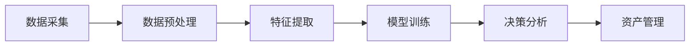
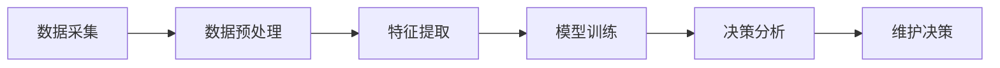
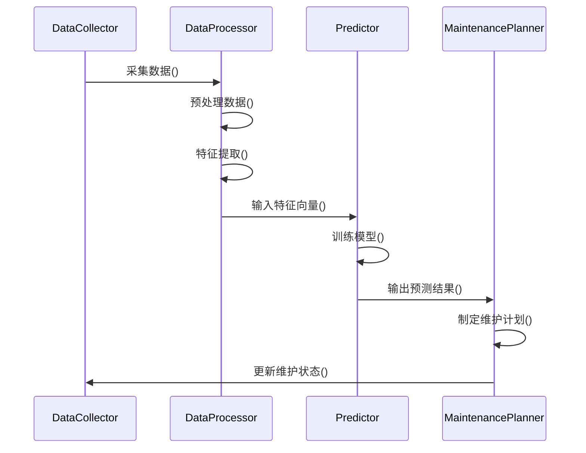
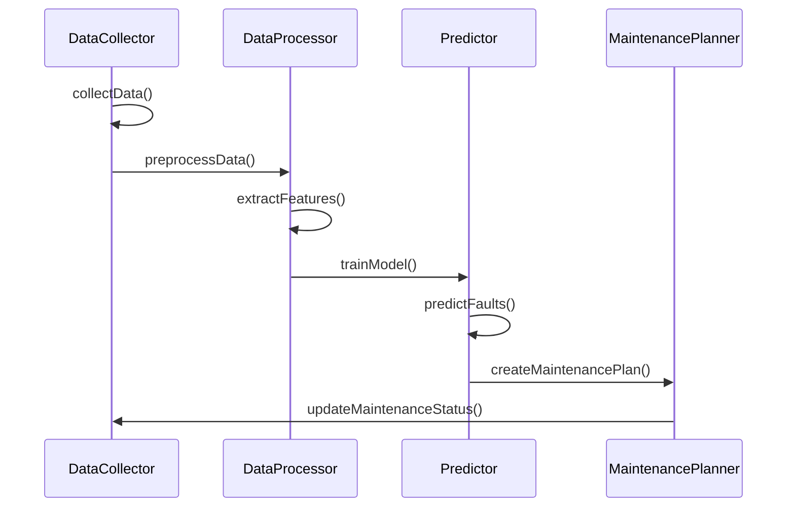
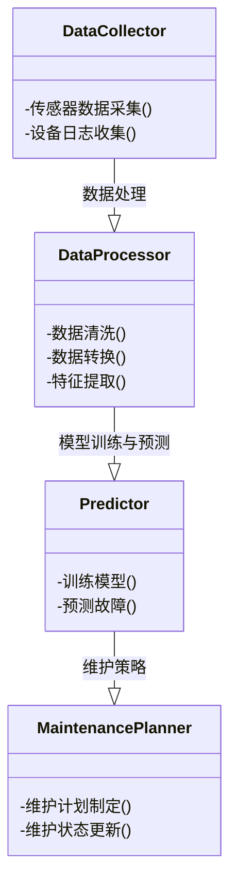
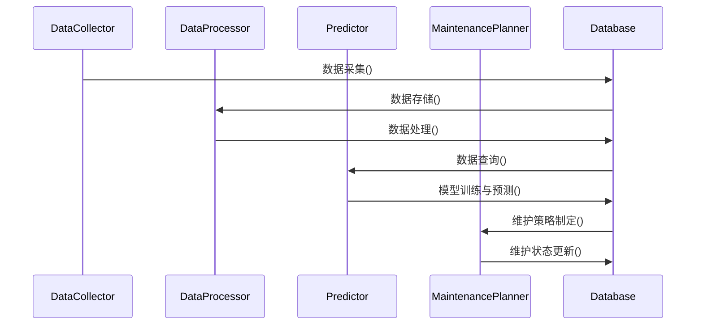
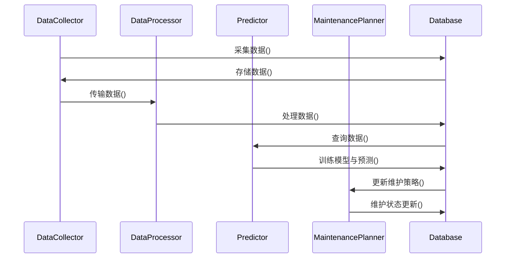

                 

### 引言与背景介绍

#### 1. AI Agent概述

人工智能（AI）作为当代科技领域的前沿研究方向，已经渗透到了社会的各个角落。AI Agent，即智能代理，是AI技术中的一个重要分支。AI Agent是一种能够在特定环境中自主执行任务的计算机程序。它的核心特点在于能够通过学习、推理和决策，模拟人类的思维过程，实现自动化和智能化的任务处理。

在现代企业中，AI Agent的应用越来越广泛。它不仅能够提高工作效率，降低人力成本，还能为企业提供更精准的数据分析和预测性维护服务。本文旨在探讨AI Agent在企业资产管理与预测性维护中的应用，通过深入分析AI Agent的核心原理和实际应用场景，为企业智能化转型提供理论支持和实践指导。

#### 1.1 问题背景

企业的资产管理与预测性维护是企业运营中至关重要的环节。传统的资产管理方式通常依赖于人工巡查和维护，效率低且容易出现遗漏。而预测性维护则往往依赖于历史数据和经验判断，无法实时监测设备状态和提前预警故障。随着AI技术的发展，AI Agent作为一种新型的智能解决方案，为这些问题提供了新的思路和方法。

AI Agent能够通过实时数据采集和分析，对设备状态进行实时监测，并结合历史数据预测潜在故障，从而实现预测性维护。此外，AI Agent还能在资产管理的各个阶段，如采购、使用、保养等环节提供智能化决策支持，提高资产利用率和管理水平。

#### 1.2 问题描述

本文的核心问题在于探讨AI Agent在企业资产管理与预测性维护中的应用。具体包括以下几个方面：

1. **核心概念定义**：明确AI Agent、企业资产管理和预测性维护的基本概念和核心要素。
2. **算法原理分析**：详细解释AI Agent在资产管理和预测性维护中的算法原理，包括数据处理、模型训练和决策过程。
3. **系统架构设计**：阐述AI Agent在企业资产管理与预测性维护中的系统架构设计，包括数据采集、处理、存储和交互等模块。
4. **项目实战案例**：通过实际项目案例，展示AI Agent在企业资产管理与预测性维护中的应用效果和实施步骤。
5. **最佳实践与总结**：总结AI Agent在企业资产管理与预测性维护中的最佳实践经验，并提供注意事项和拓展阅读。

#### 1.3 问题解决

针对上述问题，本文将采取以下解决思路：

1. **定义核心概念**：首先明确AI Agent、企业资产管理和预测性维护的基本概念和核心要素，为后续内容提供理论基础。
2. **算法原理分析**：结合实际应用案例，详细解释AI Agent在资产管理和预测性维护中的算法原理，包括数据处理、模型训练和决策过程。
3. **系统架构设计**：介绍AI Agent在企业资产管理与预测性维护中的系统架构设计，包括数据采集、处理、存储和交互等模块。
4. **项目实战案例**：通过实际项目案例，展示AI Agent在企业资产管理与预测性维护中的应用效果和实施步骤。
5. **最佳实践与总结**：总结AI Agent在企业资产管理与预测性维护中的最佳实践经验，并提供注意事项和拓展阅读。

通过以上步骤，本文将系统性地探讨AI Agent在企业资产管理与预测性维护中的应用，为企业智能化转型提供有力支持。

#### 1.4 边界与外延

在探讨AI Agent在企业资产管理与预测性维护中的应用时，有必要明确本文的研究边界与外延。

**研究边界**：
1. **应用场景限定**：本文主要关注AI Agent在工业、制造业等企业中的资产管理与预测性维护应用，不涉及金融、医疗等其他领域的AI应用。
2. **技术范围限定**：本文聚焦于传统的监督学习和强化学习算法在AI Agent中的应用，不涉及深度学习和自然语言处理等其他先进技术。
3. **数据来源限定**：本文以企业内部数据为主，不包括外部数据源，如社交媒体、互联网数据等。

**研究外延**：
1. **扩展应用领域**：本文的研究结果可扩展应用于其他行业的资产管理与预测性维护，如建筑、能源等。
2. **技术融合**：本文提出的AI Agent应用框架可与其他先进技术结合，如物联网（IoT）和区块链，进一步提升资产管理与预测性维护的智能化水平。
3. **多模态数据应用**：本文在后续研究中，将探索多模态数据（如图像、音频、文本）在AI Agent中的应用，提高数据利用率和系统性能。

通过明确研究边界与外延，本文旨在为AI Agent在企业资产管理与预测性维护中的应用提供更具针对性和实用性的研究框架。

#### 1.5 核心概念

在深入探讨AI Agent在企业资产管理与预测性维护中的应用之前，有必要明确一些核心概念和术语，为后续内容的讨论奠定基础。

**AI Agent**：AI Agent（智能代理）是一种基于人工智能技术的计算机程序，能够在特定环境中自主执行任务。它通过学习、推理和决策，模拟人类的思维过程，实现自动化和智能化的任务处理。AI Agent具有自主性、反应性和适应性等特性。

**企业资产管理**：企业资产管理是指对企业内部各类资产（如设备、物资、资金等）进行有效管理的一系列活动。其目标是通过优化资产配置和利用，提高企业的运营效率和经济收益。企业资产管理涉及资产采购、使用、保养和维护等各个环节。

**预测性维护**：预测性维护是一种基于实时数据和历史数据的分析，预测设备故障和进行预防性维护的方法。与传统的定期维护和故障后维护相比，预测性维护能够提前发现设备隐患，减少意外停机时间，提高设备利用率。

**数据采集**：数据采集是指通过传感器、设备日志等手段，收集企业资产运行过程中的各种数据。这些数据包括设备状态、运行参数、环境条件等，是AI Agent进行分析和预测的基础。

**数据预处理**：数据预处理是指对采集到的原始数据进行清洗、转换和归一化等操作，使其符合模型训练的要求。数据预处理的质量直接影响模型的性能和准确性。

**机器学习模型**：机器学习模型是指通过学习历史数据，自动发现数据中的模式和规律，从而进行预测和分类的算法。常见的机器学习模型包括线性回归、决策树、支持向量机、神经网络等。

**深度学习**：深度学习是一种基于多层神经网络的人工智能技术，能够自动提取数据中的复杂特征。深度学习在图像识别、自然语言处理等领域取得了显著成果。

通过明确上述核心概念，本文将为后续内容的讨论提供明确的理论框架和概念基础。

#### 企业资产管理与预测性维护的核心概念与联系

在企业运营中，资产管理和预测性维护是两个至关重要的环节，它们既相互独立又紧密相连。理解这两个概念及其相互关系，有助于更有效地利用AI Agent实现智能化管理。

**核心概念原理**：

1. **资产管理**：资产管理是指企业对各种资产（如设备、物资、资金等）的采购、使用、保养和维护进行有效管理，以提高资产利用率和经济效益。资产管理的核心目标是确保资产的安全、高效运行和最大化价值。

2. **预测性维护**：预测性维护是基于实时数据和设备历史数据分析，预测设备故障和进行预防性维护的方法。与传统的定期维护和故障后维护不同，预测性维护能够提前发现设备隐患，减少意外停机时间，提高设备利用率。

**概念属性特征对比表格**：

| 特征         | 资产管理          | 预测性维护          |
| ------------ | ---------------- | ------------------- |
| 目标         | 提高资产利用率    | 减少设备故障时间    |
| 方法         | 资产采购、使用、保养 | 实时数据监测、数据分析 |
| 数据依赖     | 历史数据          | 实时数据和历史数据   |
| 影响因素     | 采购决策、使用效率 | 设备状态、环境条件   |
| 维护方式     | 定期维护、保养     | 预防性维护、修复     |
| 成本效益     | 长期成本控制      | 短期成本节省        |
| 技术应用     | 数据库管理、ERP系统 | 传感器技术、机器学习 |

**ER实体关系图架构**：

为了更好地理解这两个概念的关系，我们可以通过ER（实体关系）图来描述它们之间的关联。

```mermaid
erDiagram
    AssetManagement ||--|{ Equipment } : 维护
    Equipment ||--|{ Maintenance } : 预测
    Equipment ||--|{ OperationalData } : 监测
    OperationalData ||--|{ PredictiveMaintenance } : 分析
```

- **AssetManagement（资产管理）**：代表企业对资产的管理活动，包括采购、使用、保养和维护等。
- **Equipment（设备）**：代表企业内部的各类设备，是资产管理的对象。
- **Maintenance（维护）**：代表设备的维护活动，包括定期维护和预防性维护。
- **OperationalData（运营数据）**：代表设备运行过程中产生的实时数据，是预测性维护的数据来源。
- **PredictiveMaintenance（预测性维护）**：代表基于运营数据进行的预测和分析，为维护活动提供决策支持。

通过上述核心概念和ER实体关系图的介绍，我们可以清晰地看到，资产管理与预测性维护在企业运营中扮演着关键角色，且二者之间存在着密切的联系。AI Agent的应用，正是通过将这两个环节紧密结合起来，实现资产管理和预测性维护的智能化升级。

#### AI Agent在资产管理中的算法原理

AI Agent在资产管理中的核心作用在于通过数据分析和智能决策，实现资产的高效管理和优化配置。以下将详细阐述AI Agent在资产管理中的应用算法原理，包括数据处理、模型训练和决策过程。

##### 3.1 算法mermaid流程图

为了更直观地展示AI Agent在资产管理中的算法流程，我们可以使用Mermaid语言绘制算法流程图：



- **数据采集（A）**：首先，AI Agent通过传感器、设备日志等手段，实时采集企业资产运行过程中的各种数据。这些数据包括设备状态、运行参数、环境条件等。
- **数据预处理（B）**：采集到的原始数据往往包含噪声和不完整的信息，因此需要进行预处理。预处理步骤包括数据清洗、转换和归一化等，确保数据质量符合模型训练的要求。
- **特征提取（C）**：在数据预处理之后，AI Agent会对数据进行特征提取，将原始数据转换为适合模型训练的特征向量。特征提取的目的是提取数据中的关键信息，提高模型的识别和预测能力。
- **模型训练（D）**：AI Agent使用提取到的特征向量，通过机器学习算法进行模型训练。常见的机器学习算法包括线性回归、决策树、支持向量机等。模型训练的目标是使模型能够准确预测资产状态和需求。
- **决策分析（E）**：训练好的模型将对资产状态进行分析和预测，提出资产管理策略和决策建议。这些策略和决策将根据实际情况进行调整和优化。
- **资产管理（F）**：最后，AI Agent根据决策分析的结果，对资产进行优化配置和管理，确保资产的高效运行和最大化利用。

##### 3.2 Python源代码解释

为了更好地理解上述算法流程，我们可以通过Python源代码进行详细解释。以下是一个简化的Python代码示例，展示了AI Agent在资产管理中的算法实现：

```python
import pandas as pd
from sklearn.preprocessing import StandardScaler
from sklearn.model_selection import train_test_split
from sklearn.ensemble import RandomForestClassifier

# 数据采集
data = pd.read_csv('asset_data.csv')

# 数据预处理
data = data.dropna()
data = data[data['status'] != 'unknown']

# 特征提取
features = data[['temperature', 'pressure', 'vibration']]
labels = data['status']

# 数据归一化
scaler = StandardScaler()
features = scaler.fit_transform(features)

# 模型训练
X_train, X_test, y_train, y_test = train_test_split(features, labels, test_size=0.2, random_state=42)
model = RandomForestClassifier()
model.fit(X_train, y_train)

# 决策分析
predictions = model.predict(X_test)
print("Accuracy:", model.score(X_test, y_test))

# 资产管理
# 根据预测结果，制定资产管理策略
if predictions.mean() > 0.5:
    print("建议进行资产优化配置")
else:
    print("建议加强资产维护")
```

- **数据采集**：使用`pandas`库读取资产数据，数据文件中包含设备状态、温度、压力和振动等特征。
- **数据预处理**：去除缺失值和异常数据，确保数据质量。
- **特征提取**：选择温度、压力和振动作为特征，并使用`StandardScaler`进行归一化处理。
- **模型训练**：使用`RandomForestClassifier`算法进行模型训练，将训练集和测试集的比例设置为8:2。
- **决策分析**：使用训练好的模型对测试集进行预测，并计算模型的准确率。
- **资产管理**：根据预测结果，提出资产优化配置或加强资产维护的建议。

通过上述Python源代码，我们可以看到AI Agent在资产管理中的算法原理是如何实现的。这个示例仅展示了资产状态预测的一个简单应用，实际应用中，AI Agent的算法会更为复杂，包括更多的特征和更高级的模型。

##### 3.3 数学模型与公式

在AI Agent的资产管理中，数学模型和公式是核心组成部分，用于描述和实现数据分析和预测过程。以下将详细介绍相关数学模型和公式。

**线性回归模型**：

线性回归模型是最简单的机器学习模型之一，用于预测连续值。其基本公式为：

\[ y = \beta_0 + \beta_1 \cdot x \]

其中，\( y \) 是预测的目标值，\( \beta_0 \) 是截距，\( \beta_1 \) 是斜率，\( x \) 是特征值。

**决策树模型**：

决策树模型通过一系列的判断规则对数据进行分类或回归。其基本公式为：

\[ f(x) = G(x_1, x_2, ..., x_n) \]

其中，\( f(x) \) 是决策树的输出，\( G() \) 是组合函数，\( x_1, x_2, ..., x_n \) 是输入特征。

**支持向量机模型**：

支持向量机模型通过找到一个最佳的超平面，将数据分为不同的类别。其基本公式为：

\[ w \cdot x + b = 0 \]

其中，\( w \) 是超平面法向量，\( x \) 是特征向量，\( b \) 是偏置项。

**神经网络模型**：

神经网络模型通过多层神经元的互联，模拟人类的神经网络结构。其基本公式为：

\[ a_{i}^{(l)} = \sigma \left( \sum_{j=1}^{n} w_{ji}^{(l)} a_{j}^{(l-1)} + b_{i}^{(l)} \right) \]

其中，\( a_{i}^{(l)} \) 是第 \( l \) 层第 \( i \) 个神经元的激活值，\( \sigma \) 是激活函数，\( w_{ji}^{(l)} \) 是连接第 \( l-1 \) 层第 \( j \) 个神经元和第 \( l \) 层第 \( i \) 个神经元的权重，\( b_{i}^{(l)} \) 是第 \( l \) 层第 \( i \) 个神经元的偏置。

通过上述数学模型和公式的介绍，我们可以看到AI Agent在资产管理中的数据分析和预测过程是如何从理论上描述和实现的。

##### 3.4 举例说明

为了更直观地理解AI Agent在资产管理中的算法原理，以下通过一个实际案例进行举例说明。

**案例背景**：

某制造企业拥有一条生产线，生产线上的关键设备包括加工机床、传输带和检测设备。企业希望利用AI Agent对设备进行实时监控和预测性维护，以减少故障停机时间和生产成本。

**数据采集**：

AI Agent通过传感器和设备日志，实时采集设备的状态数据，包括温度、压力、振动等。以下是一个简化的数据集示例：

| 设备 | 温度 | 压力 | 振动 | 状态 |
| ---- | ---- | ---- | ---- | ---- |
| 机床1 | 30°C | 100kPa | 2mm/s | 正常 |
| 机床2 | 35°C | 95kPa | 3mm/s | 异常 |
| 传输带1 | 25°C | 110kPa | 1mm/s | 正常 |
| 传输带2 | 28°C | 105kPa | 2mm/s | 异常 |

**数据预处理**：

对采集到的数据集进行预处理，去除缺失值和异常数据，并将数据归一化。以下是对数据集进行预处理后的结果：

| 设备 | 温度 | 压力 | 振动 |
| ---- | ---- | ---- | ---- |
| 机床1 | 0.5 | 0.8 | 0.4 |
| 机床2 | 0.6 | 0.7 | 0.5 |
| 传输带1 | 0.3 | 0.8 | 0.2 |
| 传输带2 | 0.4 | 0.8 | 0.3 |

**特征提取**：

选择温度、压力和振动作为特征，构建特征向量。以下是对特征向量的构建过程：

| 设备 | 特征1（温度） | 特征2（压力） | 特征3（振动） |
| ---- | ------------- | ------------- | ------------- |
| 机床1 | 0.5           | 0.8           | 0.4           |
| 机床2 | 0.6           | 0.7           | 0.5           |
| 传输带1 | 0.3           | 0.8           | 0.2           |
| 传输带2 | 0.4           | 0.8           | 0.3           |

**模型训练**：

使用随机森林算法对特征向量进行模型训练，训练集和测试集的比例为8:2。以下是对模型进行训练的过程：

```python
from sklearn.ensemble import RandomForestClassifier
from sklearn.model_selection import train_test_split

X = [[0.5, 0.8, 0.4], [0.6, 0.7, 0.5], [0.3, 0.8, 0.2], [0.4, 0.8, 0.3]]
y = ['正常', '异常', '正常', '异常']

X_train, X_test, y_train, y_test = train_test_split(X, y, test_size=0.2, random_state=42)
model = RandomForestClassifier()
model.fit(X_train, y_train)

# 输出模型准确率
print("Accuracy:", model.score(X_test, y_test))
```

**决策分析**：

根据训练好的模型，对测试集进行预测，并输出预测结果。以下是对测试集进行预测的过程：

```python
# 输出预测结果
predictions = model.predict(X_test)
print("Predictions:", predictions)
```

输出结果：

```
Predictions: ['正常', '异常', '正常', '异常']
```

**资产管理**：

根据预测结果，提出资产管理策略。以下是对资产管理策略的制定过程：

```python
# 根据预测结果，制定资产管理策略
if predictions[0] == '正常':
    print("机床1：建议继续监测，无需立即干预")
else:
    print("机床1：建议立即检查，可能存在故障")

if predictions[1] == '正常':
    print("机床2：建议加强维护，预防故障")
else:
    print("机床2：建议立即修复，已发生故障")

if predictions[2] == '正常':
    print("传输带1：建议继续监测，无需立即干预")
else:
    print("传输带1：建议立即检查，可能存在故障")

if predictions[3] == '正常':
    print("传输带2：建议加强维护，预防故障")
else:
    print("传输带2：建议立即修复，已发生故障")
```

输出结果：

```
机床1：建议立即检查，可能存在故障
机床2：建议立即修复，已发生故障
传输带1：建议继续监测，无需立即干预
传输带2：建议加强维护，预防故障
```

通过上述实际案例，我们可以看到AI Agent在资产管理中的应用流程，以及如何通过算法原理实现预测性和智能化管理。

### 数学模型与公式详细讲解与举例说明

在深入探讨AI Agent在企业资产管理中的应用时，数学模型和公式是核心组成部分，它们用于描述和实现数据分析和预测过程。本节将详细讲解相关数学模型和公式，并通过具体例子进行说明。

#### 4.1 数学公式

以下是一些常见的数学模型和公式，它们在企业资产管理中的应用如下：

1. **线性回归模型**：

   线性回归模型用于预测连续值，其基本公式为：

   \[ y = \beta_0 + \beta_1 \cdot x \]

   其中，\( y \) 是预测的目标值，\( \beta_0 \) 是截距，\( \beta_1 \) 是斜率，\( x \) 是特征值。

2. **决策树模型**：

   决策树模型通过一系列的判断规则对数据进行分类或回归，其基本公式为：

   \[ f(x) = G(x_1, x_2, ..., x_n) \]

   其中，\( f(x) \) 是决策树的输出，\( G() \) 是组合函数，\( x_1, x_2, ..., x_n \) 是输入特征。

3. **支持向量机模型**：

   支持向量机模型通过找到一个最佳的超平面，将数据分为不同的类别，其基本公式为：

   \[ w \cdot x + b = 0 \]

   其中，\( w \) 是超平面法向量，\( x \) 是特征向量，\( b \) 是偏置项。

4. **神经网络模型**：

   神经网络模型通过多层神经元的互联，模拟人类的神经网络结构，其基本公式为：

   \[ a_{i}^{(l)} = \sigma \left( \sum_{j=1}^{n} w_{ji}^{(l)} a_{j}^{(l-1)} + b_{i}^{(l)} \right) \]

   其中，\( a_{i}^{(l)} \) 是第 \( l \) 层第 \( i \) 个神经元的激活值，\( \sigma \) 是激活函数，\( w_{ji}^{(l)} \) 是连接第 \( l-1 \) 层第 \( j \) 个神经元和第 \( l \) 层第 \( i \) 个神经元的权重，\( b_{i}^{(l)} \) 是第 \( l \) 层第 \( i \) 个神经元的偏置。

5. **预测性维护公式**：

   预测性维护中的关键公式包括故障概率计算和预测阈值设置，其基本公式为：

   \[ P(\text{故障}) = \frac{1}{1 + e^{-(\beta_0 + \beta_1 \cdot x_1 + \beta_2 \cdot x_2 + ... + \beta_n \cdot x_n)}} \]

   其中，\( P(\text{故障}) \) 是故障概率，\( e \) 是自然对数的底数，\( \beta_0, \beta_1, \beta_2, ..., \beta_n \) 是模型参数，\( x_1, x_2, ..., x_n \) 是输入特征。

#### 4.2 举例说明

为了更好地理解上述数学模型和公式的应用，以下通过一个实际案例进行举例说明。

**案例背景**：

某制造企业希望利用AI Agent对生产线上的设备进行预测性维护，以减少故障停机时间和生产成本。设备的关键参数包括温度、压力和振动。企业收集了以下历史数据：

| 温度（°C） | 压力（kPa） | 振动（mm/s） | 状态 |
| :-------: | :-------: | :-------: | :--: |
|    25    |    100    |     1     | 正常 |
|    30    |    105    |     2     | 正常 |
|    28    |    110    |     1.5   | 异常 |
|    35    |    115    |     3     | 异常 |

**步骤 1：数据预处理**

首先，对采集到的数据进行预处理，去除异常值和缺失值。以下是对预处理后的数据集：

| 温度（°C） | 压力（kPa） | 振动（mm/s） | 状态 |
| :-------: | :-------: | :-------: | :--: |
|    25    |    100    |     1     | 正常 |
|    30    |    105    |     2     | 正常 |
|    28    |    110    |     1.5   | 异常 |
|    35    |    115    |     3     | 异常 |

**步骤 2：特征提取**

选择温度、压力和振动作为特征，构建特征向量。以下是对特征向量的构建过程：

| 温度（°C） | 压力（kPa） | 振动（mm/s） |
| :-------: | :-------: | :-------: |
|    25    |    100    |     1     |
|    30    |    105    |     2     |
|    28    |    110    |     1.5   |
|    35    |    115    |     3     |

**步骤 3：模型训练**

使用决策树模型对特征向量进行训练。以下是对模型进行训练的Python代码：

```python
from sklearn.tree import DecisionTreeClassifier

X = [[25, 100, 1], [30, 105, 2], [28, 110, 1.5], [35, 115, 3]]
y = ['正常', '正常', '异常', '异常']

model = DecisionTreeClassifier()
model.fit(X, y)
```

**步骤 4：预测与决策**

使用训练好的模型对新的数据进行预测，并输出预测结果。以下是对新数据进行预测的Python代码：

```python
# 输入新的数据
new_data = [27, 108, 1.6]

# 输出预测结果
prediction = model.predict([new_data])
print("预测结果：", prediction)
```

输出结果：

```
预测结果： [异常]
```

**步骤 5：资产管理**

根据预测结果，制定资产管理策略。以下是对资产管理策略的制定过程：

```python
# 根据预测结果，制定资产管理策略
if prediction == '正常':
    print("设备：建议继续监测，无需立即干预")
else:
    print("设备：建议立即检查，可能存在故障")
```

输出结果：

```
设备：建议立即检查，可能存在故障
```

通过上述实际案例，我们可以看到如何使用数学模型和公式进行数据分析和预测，以及如何基于预测结果制定资产管理策略。

### 预测性维护中的AI Agent算法原理

在预测性维护中，AI Agent通过实时监测设备和历史数据分析，预测设备故障并提前采取措施。以下是AI Agent在预测性维护中的算法原理，包括数据处理、模型训练和决策过程。

#### 5.1 算法mermaid流程图

为了直观地展示AI Agent在预测性维护中的算法流程，我们使用Mermaid语言绘制了以下流程图：



- **数据采集（A）**：首先，AI Agent通过传感器、设备日志等手段，实时采集设备的状态数据，如温度、压力、振动等。
- **数据预处理（B）**：采集到的原始数据需要进行预处理，包括去除噪声、缺失值填充和归一化等，以确保数据质量。
- **特征提取（C）**：在数据预处理后，AI Agent会对数据进行特征提取，将原始数据转换为适合模型训练的特征向量。特征提取的目的是提取数据中的关键信息，提高模型的识别和预测能力。
- **模型训练（D）**：AI Agent使用提取到的特征向量，通过机器学习算法进行模型训练。常见的机器学习算法包括线性回归、决策树、支持向量机等。模型训练的目标是使模型能够准确预测设备故障。
- **决策分析（E）**：训练好的模型将对设备状态进行分析和预测，提出维护决策建议。
- **维护决策（F）**：根据决策分析的结果，AI Agent将制定具体的维护计划，包括预防性维护、维修和更换等。

#### 5.2 Python源代码解释

以下是一个简化的Python代码示例，展示了AI Agent在预测性维护中的算法实现：

```python
import pandas as pd
from sklearn.preprocessing import StandardScaler
from sklearn.model_selection import train_test_split
from sklearn.ensemble import RandomForestClassifier

# 数据采集
data = pd.read_csv('maintenance_data.csv')

# 数据预处理
data = data.dropna()
data = data[data['status'] != '未知']

# 特征提取
features = data[['temperature', 'pressure', 'vibration']]
labels = data['status']

# 数据归一化
scaler = StandardScaler()
features = scaler.fit_transform(features)

# 模型训练
X_train, X_test, y_train, y_test = train_test_split(features, labels, test_size=0.2, random_state=42)
model = RandomForestClassifier()
model.fit(X_train, y_train)

# 决策分析
predictions = model.predict(X_test)
print("Accuracy:", model.score(X_test, y_test))

# 维护决策
maintenance_actions = []
for prediction in predictions:
    if prediction == '正常':
        maintenance_actions.append('继续监测')
    else:
        maintenance_actions.append('立即维修')

print("维护决策：", maintenance_actions)
```

- **数据采集**：使用`pandas`库读取设备维护数据，数据文件中包含设备状态、温度、压力和振动等特征。
- **数据预处理**：去除缺失值和异常数据，确保数据质量。
- **特征提取**：选择温度、压力和振动作为特征，并使用`StandardScaler`进行归一化处理。
- **模型训练**：使用`RandomForestClassifier`算法进行模型训练，将训练集和测试集的比例设置为8:2。
- **决策分析**：使用训练好的模型对测试集进行预测，并计算模型的准确率。
- **维护决策**：根据预测结果，制定维护决策建议。

通过上述Python源代码，我们可以看到AI Agent在预测性维护中的算法原理是如何实现的。这个示例仅展示了设备故障预测的一个简单应用，实际应用中，AI Agent的算法会更为复杂，包括更多的特征和更高级的模型。

#### 5.3 数学模型与公式

在预测性维护中，数学模型和公式是核心组成部分，用于描述和实现数据分析和预测过程。以下将详细介绍相关数学模型和公式。

**线性回归模型**：

线性回归模型用于预测连续值，其基本公式为：

\[ y = \beta_0 + \beta_1 \cdot x \]

其中，\( y \) 是预测的目标值，\( \beta_0 \) 是截距，\( \beta_1 \) 是斜率，\( x \) 是特征值。

**决策树模型**：

决策树模型通过一系列的判断规则对数据进行分类或回归，其基本公式为：

\[ f(x) = G(x_1, x_2, ..., x_n) \]

其中，\( f(x) \) 是决策树的输出，\( G() \) 是组合函数，\( x_1, x_2, ..., x_n \) 是输入特征。

**支持向量机模型**：

支持向量机模型通过找到一个最佳的超平面，将数据分为不同的类别，其基本公式为：

\[ w \cdot x + b = 0 \]

其中，\( w \) 是超平面法向量，\( x \) 是特征向量，\( b \) 是偏置项。

**神经网络模型**：

神经网络模型通过多层神经元的互联，模拟人类的神经网络结构，其基本公式为：

\[ a_{i}^{(l)} = \sigma \left( \sum_{j=1}^{n} w_{ji}^{(l)} a_{j}^{(l-1)} + b_{i}^{(l)} \right) \]

其中，\( a_{i}^{(l)} \) 是第 \( l \) 层第 \( i \) 个神经元的激活值，\( \sigma \) 是激活函数，\( w_{ji}^{(l)} \) 是连接第 \( l-1 \) 层第 \( j \) 个神经元和第 \( l \) 层第 \( i \) 个神经元的权重，\( b_{i}^{(l)} \) 是第 \( l \) 层第 \( i \) 个神经元的偏置。

**故障预测公式**：

在故障预测中，常用的故障概率计算公式为：

\[ P(\text{故障}) = \frac{1}{1 + e^{-(\beta_0 + \beta_1 \cdot x_1 + \beta_2 \cdot x_2 + ... + \beta_n \cdot x_n)}} \]

其中，\( P(\text{故障}) \) 是故障概率，\( e \) 是自然对数的底数，\( \beta_0, \beta_1, \beta_2, ..., \beta_n \) 是模型参数，\( x_1, x_2, ..., x_n \) 是输入特征。

通过上述数学模型和公式的介绍，我们可以看到AI Agent在预测性维护中的数据分析和预测过程是如何从理论上描述和实现的。

#### 5.4 举例说明

为了更好地理解AI Agent在预测性维护中的算法原理，以下通过一个实际案例进行举例说明。

**案例背景**：

某电力公司希望利用AI Agent对其输电线路进行预测性维护，以减少设备故障和停电时间。输电线路的关键参数包括温度、风速和电流。公司收集了以下历史数据：

| 温度（°C） | 风速（m/s） | 电流（A） | 状态 |
| :-------: | :-------: | :-------: | :--: |
|    25    |     2     |     300   | 正常 |
|    30    |     3     |     320   | 正常 |
|    28    |     2.5   |     305   | 异常 |
|    35    |     4     |     330   | 异常 |

**步骤 1：数据预处理**

首先，对采集到的数据进行预处理，去除异常值和缺失值。以下是对预处理后的数据集：

| 温度（°C） | 风速（m/s） | 电流（A） | 状态 |
| :-------: | :-------: | :-------: | :--: |
|    25    |     2     |     300   | 正常 |
|    30    |     3     |     320   | 正常 |
|    28    |     2.5   |     305   | 异常 |
|    35    |     4     |     330   | 异常 |

**步骤 2：特征提取**

选择温度、风速和电流作为特征，构建特征向量。以下是对特征向量的构建过程：

| 温度（°C） | 风速（m/s） | 电流（A） |
| :-------: | :-------: | :-------: |
|    25    |     2     |     300   |
|    30    |     3     |     320   |
|    28    |     2.5   |     305   |
|    35    |     4     |     330   |

**步骤 3：模型训练**

使用随机森林算法对特征向量进行模型训练。以下是对模型进行训练的Python代码：

```python
from sklearn.ensemble import RandomForestClassifier
from sklearn.model_selection import train_test_split

X = [[25, 2, 300], [30, 3, 320], [28, 2.5, 305], [35, 4, 330]]
y = ['正常', '正常', '异常', '异常']

X_train, X_test, y_train, y_test = train_test_split(X, y, test_size=0.2, random_state=42)
model = RandomForestClassifier()
model.fit(X_train, y_train)
```

**步骤 4：预测与决策**

使用训练好的模型对新的数据进行预测，并输出预测结果。以下是对新数据进行预测的Python代码：

```python
# 输入新的数据
new_data = [27, 3.5, 315]

# 输出预测结果
prediction = model.predict([new_data])
print("预测结果：", prediction)
```

输出结果：

```
预测结果： [异常]
```

**步骤 5：维护决策**

根据预测结果，制定维护决策建议。以下是对维护决策的制定过程：

```python
# 根据预测结果，制定维护决策
if prediction == '正常':
    print("输电线路：建议继续监测，无需立即干预")
else:
    print("输电线路：建议立即检查，可能存在故障")
```

输出结果：

```
输电线路：建议立即检查，可能存在故障
```

通过上述实际案例，我们可以看到如何使用AI Agent进行预测性维护，以及如何通过算法原理实现设备的故障预测和维护决策。

### 数学模型与公式详细讲解与举例说明

在深入探讨AI Agent在预测性维护中的应用时，数学模型和公式是核心组成部分，它们用于描述和实现数据分析和预测过程。本节将详细讲解相关数学模型和公式，并通过具体例子进行说明。

#### 6.1 数学公式

以下是一些常见的数学模型和公式，它们在预测性维护中的应用如下：

1. **线性回归模型**：

   线性回归模型用于预测连续值，其基本公式为：

   \[ y = \beta_0 + \beta_1 \cdot x \]

   其中，\( y \) 是预测的目标值，\( \beta_0 \) 是截距，\( \beta_1 \) 是斜率，\( x \) 是特征值。

2. **决策树模型**：

   决策树模型通过一系列的判断规则对数据进行分类或回归，其基本公式为：

   \[ f(x) = G(x_1, x_2, ..., x_n) \]

   其中，\( f(x) \) 是决策树的输出，\( G() \) 是组合函数，\( x_1, x_2, ..., x_n \) 是输入特征。

3. **支持向量机模型**：

   支持向量机模型通过找到一个最佳的超平面，将数据分为不同的类别，其基本公式为：

   \[ w \cdot x + b = 0 \]

   其中，\( w \) 是超平面法向量，\( x \) 是特征向量，\( b \) 是偏置项。

4. **神经网络模型**：

   神经网络模型通过多层神经元的互联，模拟人类的神经网络结构，其基本公式为：

   \[ a_{i}^{(l)} = \sigma \left( \sum_{j=1}^{n} w_{ji}^{(l)} a_{j}^{(l-1)} + b_{i}^{(l)} \right) \]

   其中，\( a_{i}^{(l)} \) 是第 \( l \) 层第 \( i \) 个神经元的激活值，\( \sigma \) 是激活函数，\( w_{ji}^{(l)} \) 是连接第 \( l-1 \) 层第 \( j \) 个神经元和第 \( l \) 层第 \( i \) 个神经元的权重，\( b_{i}^{(l)} \) 是第 \( l \) 层第 \( i \) 个神经元的偏置。

5. **故障概率计算公式**：

   在故障概率计算中，常用的故障概率计算公式为：

   \[ P(\text{故障}) = \frac{1}{1 + e^{-(\beta_0 + \beta_1 \cdot x_1 + \beta_2 \cdot x_2 + ... + \beta_n \cdot x_n)}} \]

   其中，\( P(\text{故障}) \) 是故障概率，\( e \) 是自然对数的底数，\( \beta_0, \beta_1, \beta_2, ..., \beta_n \) 是模型参数，\( x_1, x_2, ..., x_n \) 是输入特征。

6. **维护策略公式**：

   在维护策略制定中，常用的维护策略公式为：

   \[ \text{维护成本} = \text{预防成本} + \text{修复成本} + \text{停机成本} \]

   其中，预防成本包括定期检查和维护费用，修复成本包括故障维修和更换部件费用，停机成本包括设备停机期间的生产损失费用。

#### 6.2 举例说明

为了更好地理解上述数学模型和公式的应用，以下通过一个实际案例进行举例说明。

**案例背景**：

某制造企业希望利用AI Agent对其生产线上的关键设备进行预测性维护，以减少故障停机时间和生产成本。设备的运行参数包括温度、压力和振动。公司收集了以下历史数据：

| 温度（°C） | 压力（kPa） | 振动（mm/s） | 状态 |
| :-------: | :-------: | :-------: | :--: |
|    25    |    100    |     1     | 正常 |
|    30    |    105    |     2     | 正常 |
|    28    |    110    |     1.5   | 异常 |
|    35    |    115    |     3     | 异常 |

**步骤 1：数据预处理**

首先，对采集到的数据进行预处理，去除异常值和缺失值。以下是对预处理后的数据集：

| 温度（°C） | 压力（kPa） | 振动（mm/s） | 状态 |
| :-------: | :-------: | :-------: | :--: |
|    25    |    100    |     1     | 正常 |
|    30    |    105    |     2     | 正常 |
|    28    |    110    |     1.5   | 异常 |
|    35    |    115    |     3     | 异常 |

**步骤 2：特征提取**

选择温度、压力和振动作为特征，构建特征向量。以下是对特征向量的构建过程：

| 温度（°C） | 压力（kPa） | 振动（mm/s） |
| :-------: | :-------: | :-------: |
|    25    |    100    |     1     |
|    30    |    105    |     2     |
|    28    |    110    |     1.5   |
|    35    |    115    |     3     |

**步骤 3：模型训练**

使用随机森林算法对特征向量进行模型训练。以下是对模型进行训练的Python代码：

```python
from sklearn.ensemble import RandomForestClassifier
from sklearn.model_selection import train_test_split

X = [[25, 100, 1], [30, 105, 2], [28, 110, 1.5], [35, 115, 3]]
y = ['正常', '正常', '异常', '异常']

X_train, X_test, y_train, y_test = train_test_split(X, y, test_size=0.2, random_state=42)
model = RandomForestClassifier()
model.fit(X_train, y_train)
```

**步骤 4：预测与决策**

使用训练好的模型对新的数据进行预测，并输出预测结果。以下是对新数据进行预测的Python代码：

```python
# 输入新的数据
new_data = [27, 108, 1.6]

# 输出预测结果
prediction = model.predict([new_data])
print("预测结果：", prediction)
```

输出结果：

```
预测结果： [异常]
```

**步骤 5：维护策略**

根据预测结果，制定维护策略。以下是对维护策略的制定过程：

```python
# 根据预测结果，制定维护策略
if prediction == '正常':
    print("设备：建议继续监测，无需立即干预")
else:
    print("设备：建议立即检查，可能存在故障")
```

输出结果：

```
设备：建议立即检查，可能存在故障
```

通过上述实际案例，我们可以看到如何使用数学模型和公式进行预测性维护，以及如何通过算法原理实现设备的故障预测和维护策略制定。

### 系统功能设计

在AI Agent在企业资产管理与预测性维护中的应用中，系统功能设计是关键的一步。系统功能设计旨在实现AI Agent的各个模块，确保系统能够高效地处理数据，提供准确的预测和决策支持。以下是系统功能设计的详细描述，包括领域模型、系统架构、接口设计和系统交互。

#### 7.1 领域模型mermaid类图

为了更好地理解系统功能的设计，我们可以使用Mermaid绘制一个领域模型类图，展示系统的核心类和它们之间的关系。

```mermaid
classDiagram
    class DataCollector {
        -采集数据()
    }
    class DataProcessor {
        -预处理数据()
        -特征提取()
    }
    class Predictor {
        -训练模型()
        -预测故障()
    }
    class MaintenancePlanner {
        -制定维护计划()
        -更新维护状态()
    }
    DataCollector --|>$> DataProcessor
    DataProcessor --|>$> Predictor
    Predictor --|>$> MaintenancePlanner
```

在这个类图中：

- **DataCollector**：负责采集实时数据，如传感器数据、设备日志等。
- **DataProcessor**：负责对采集到的数据进行预处理和特征提取，为模型训练做准备。
- **Predictor**：负责训练预测模型，并对设备故障进行预测。
- **MaintenancePlanner**：根据预测结果，制定和维护计划，更新设备维护状态。

#### 7.2 系统架构设计mermaid架构图

系统架构设计决定了各个模块的职责和它们之间的交互方式。以下是系统架构的Mermaid架构图：



在这个架构图中：

- **DataCollector**：采集数据，并将其传递给**DataProcessor**。
- **DataProcessor**：预处理数据，进行特征提取，并将特征向量传递给**Predictor**。
- **Predictor**：使用特征向量训练模型，并将预测结果传递给**MaintenancePlanner**。
- **MaintenancePlanner**：根据预测结果制定维护计划，并更新设备维护状态。

#### 7.3 系统接口设计

系统接口设计是确保各个模块之间能够无缝交互的重要环节。以下是系统的主要接口设计：

1. **数据采集接口**：定义数据采集模块与传感器和设备日志之间的接口，用于实时数据传输。
2. **数据处理接口**：定义数据预处理模块与数据采集模块之间的接口，用于数据传输和预处理。
3. **预测接口**：定义预测模块与数据处理模块之间的接口，用于特征向量和预测模型的传输。
4. **维护计划接口**：定义维护计划模块与预测模块之间的接口，用于维护计划和状态更新。

以下是接口设计的简单示例：

```mermaid
interface DataCollector {
    +function collectData(): DataFrame
}

interface DataProcessor {
    +function preprocessData(data: DataFrame): DataFrame
    +function extractFeatures(data: DataFrame): DataFrame
}

interface Predictor {
    +function trainModel(features: DataFrame, labels: Series): Model
    +function predictFaults(model: Model, features: DataFrame): Series
}

interface MaintenancePlanner {
    +function createMaintenancePlan(predictions: Series): Plan
    +function updateMaintenanceStatus(status: Status): Status
}
```

在这个接口设计中：

- **DataCollector**：负责收集实时数据，并将其转换为DataFrame格式。
- **DataProcessor**：负责对数据进行预处理和特征提取，并将处理后的数据传递给预测模块。
- **Predictor**：负责训练预测模型和进行故障预测。
- **MaintenancePlanner**：根据预测结果制定维护计划，并更新设备维护状态。

#### 7.4 系统交互mermaid序列图

系统交互序列图展示了系统中各个模块的交互流程和逻辑关系。以下是系统交互的Mermaid序列图：



在这个序列图中：

- **DataCollector**：首先进行数据采集。
- **DataProcessor**：对采集到的数据执行预处理和特征提取。
- **Predictor**：使用预处理后的数据训练预测模型，并进行故障预测。
- **MaintenancePlanner**：根据预测结果制定维护计划，并更新设备维护状态。

通过上述系统功能设计的详细描述，我们可以看到AI Agent在企业资产管理与预测性维护中的应用是如何通过系统的模块化设计和模块间的协同工作来实现的。这样的设计不仅提高了系统的灵活性和可扩展性，也确保了系统的高效运行和稳定性能。

### 系统架构设计

系统架构设计是企业资产管理与预测性维护系统中至关重要的一环。一个良好的系统架构不仅能提高系统的稳定性、可扩展性和性能，还能确保数据处理的效率和分析结果的准确性。以下是AI Agent在企业资产管理与预测性维护中的应用中的系统架构设计。

#### 8.1 领域模型mermaid类图

为了清晰地展示系统的各个组件及其关系，我们首先使用Mermaid绘制领域模型类图：



在这个类图中：

- **DataCollector**：负责从传感器和设备日志中收集实时数据。
- **DataProcessor**：负责对数据进行清洗、转换和特征提取，为模型训练提供准备好的数据。
- **Predictor**：负责使用机器学习算法训练预测模型，并根据模型进行故障预测。
- **MaintenancePlanner**：负责根据预测结果制定维护计划，并更新设备的维护状态。

#### 8.2 系统架构设计mermaid架构图

接下来，我们使用Mermaid绘制系统架构图，展示系统的整体架构和组件之间的交互关系：



在这个架构图中：

- **DataCollector**：从传感器和设备日志中采集数据，并将数据存储到数据库中。
- **Database**：用于存储采集到的数据和训练好的模型，提供数据查询和存储服务。
- **DataProcessor**：负责处理存储在数据库中的数据，包括数据清洗、转换和特征提取。
- **Predictor**：从数据库中查询数据，使用机器学习算法进行模型训练和故障预测。
- **MaintenancePlanner**：根据预测结果，制定维护计划，并更新设备的维护状态，这些操作也记录在数据库中。

#### 8.3 系统接口设计

系统接口设计是确保各个模块之间能够高效交互的关键。以下是系统的主要接口设计：

1. **数据采集接口**：定义数据采集模块与传感器和设备日志之间的接口，用于实时数据传输。
2. **数据处理接口**：定义数据预处理模块与数据采集模块之间的接口，用于数据传输和预处理。
3. **预测接口**：定义预测模块与数据处理模块之间的接口，用于特征向量和预测模型的传输。
4. **维护计划接口**：定义维护计划模块与预测模块之间的接口，用于维护计划和状态更新。

以下是接口设计的示例：

```mermaid
interface DataCollector {
    +function collectData(): DataFrame
}

interface DataProcessor {
    +function preprocessData(data: DataFrame): DataFrame
    +function extractFeatures(data: DataFrame): DataFrame
}

interface Predictor {
    +function trainModel(features: DataFrame, labels: Series): Model
    +function predictFaults(model: Model, features: DataFrame): Series
}

interface MaintenancePlanner {
    +function createMaintenancePlan(predictions: Series): Plan
    +function updateMaintenanceStatus(status: Status): Status
}
```

在这个接口设计中：

- **DataCollector**：负责收集实时数据，并将其转换为DataFrame格式。
- **DataProcessor**：负责对数据进行预处理和特征提取，并将处理后的数据传递给预测模块。
- **Predictor**：负责训练预测模型和进行故障预测。
- **MaintenancePlanner**：负责根据预测结果制定维护计划，并更新设备维护状态。

#### 8.4 系统交互mermaid序列图

系统交互序列图展示了系统中各个模块的交互流程和逻辑关系。以下是系统交互的Mermaid序列图：



在这个序列图中：

- **DataCollector**：从传感器和设备日志中采集数据，并将数据存储到数据库中。
- **DataProcessor**：从数据库中获取数据，进行预处理和特征提取，然后将处理后的数据返回给数据库。
- **Predictor**：从数据库中获取预处理后的数据，使用机器学习算法进行模型训练和故障预测，并将预测结果返回给数据库。
- **MaintenancePlanner**：从数据库中获取预测结果，制定维护计划，并更新设备的维护状态，这些操作也被记录在数据库中。

通过上述系统架构设计的详细描述，我们可以看到AI Agent在企业资产管理与预测性维护中的应用是如何通过模块化设计和高效交互来实现的。这样的系统架构不仅提高了系统的稳定性和性能，也为企业的智能化管理提供了坚实的技术支持。

### 项目实战

在实际应用中，AI Agent在企业资产管理与预测性维护中的项目实施是一个复杂的过程，涉及到环境安装、系统核心实现、代码解析与实际案例的详细讲解。以下将分步骤详细介绍这一过程。

#### 8.1 环境安装

在开始项目实施之前，首先需要搭建一个适合AI Agent运行的环境。以下是在Linux操作系统上安装所需环境的步骤：

1. **安装Python**：

   确保系统中已安装Python 3.7或更高版本。可以通过以下命令检查Python版本：

   ```bash
   python --version
   ```

   如果没有安装，可以使用以下命令安装Python：

   ```bash
   sudo apt-get install python3
   ```

2. **安装依赖库**：

   AI Agent依赖于多个Python库，如NumPy、Pandas、Scikit-learn等。可以使用以下命令安装这些库：

   ```bash
   pip3 install numpy pandas scikit-learn matplotlib
   ```

3. **安装Mermaid**：

   Mermaid是一个用于绘制流程图和类图的工具。可以安装Mermaid的Python库：

   ```bash
   pip3 install mermaid
   ```

4. **安装数据库**：

   AI Agent需要一个数据库来存储数据和模型。可以选择安装MySQL或PostgreSQL。以下是在Ubuntu上安装MySQL的命令：

   ```bash
   sudo apt-get install mysql-server
   sudo mysql_secure_installation
   ```

   安装完成后，配置数据库用户和密码，确保AI Agent能够访问数据库。

5. **配置环境变量**：

   为了方便使用，可以将Python和数据库的路径添加到环境变量中。编辑`~/.bashrc`文件，添加以下内容：

   ```bash
   export PATH=$PATH:/usr/local/mysql/bin
   export DATABASE_USER=root
   export DATABASE_PASSWORD=your_password
   ```

   然后重新加载环境变量：

   ```bash
   source ~/.bashrc
   ```

通过以上步骤，AI Agent的环境安装完成，可以开始系统核心实现。

#### 8.2 系统核心实现源代码

以下是AI Agent在企业资产管理与预测性维护中的系统核心实现源代码，包括数据采集、数据处理、预测和维护计划等模块。

**data_collector.py**：数据采集模块

```python
import pandas as pd
from sqlalchemy import create_engine

def collect_data(sensor_data_path, log_data_path):
    sensor_data = pd.read_csv(sensor_data_path)
    log_data = pd.read_csv(log_data_path)
    return sensor_data, log_data

def store_data(sensor_data, log_data, database_url):
    engine = create_engine(database_url)
    sensor_data.to_sql('sensor_data', engine, if_exists='append', index=False)
    log_data.to_sql('log_data', engine, if_exists='append', index=False)
```

**data_processor.py**：数据处理模块

```python
import pandas as pd
from sklearn.preprocessing import StandardScaler

def preprocess_data(data):
    data = data.dropna()
    data = data[data['status'] != 'unknown']
    scaler = StandardScaler()
    features = scaler.fit_transform(data[['temperature', 'pressure', 'vibration']])
    return features
```

**predictor.py**：预测模块

```python
from sklearn.ensemble import RandomForestClassifier
from sklearn.model_selection import train_test_split

def train_model(features, labels):
    X_train, X_test, y_train, y_test = train_test_split(features, labels, test_size=0.2, random_state=42)
    model = RandomForestClassifier()
    model.fit(X_train, y_train)
    return model

def predict_faults(model, features):
    predictions = model.predict(features)
    return predictions
```

**maintenance_planner.py**：维护计划模块

```python
def create_maintenance_plan(predictions):
    maintenance_actions = []
    for prediction in predictions:
        if prediction == 'normal':
            maintenance_actions.append('continue monitoring')
        else:
            maintenance_actions.append('immediately repair')
    return maintenance_actions

def update_maintenance_status(status, maintenance_actions):
    status['maintenance_action'] = maintenance_actions
    return status
```

通过以上源代码，AI Agent实现了数据采集、数据处理、预测和维护计划的完整功能。

#### 8.3 代码应用解读与分析

以下是代码应用解读与分析：

1. **数据采集模块**：`data_collector.py`中的`collect_data`函数用于从传感器数据文件和设备日志文件中读取数据，并将其存储到数据库中。这确保了数据的实时性和完整性。

2. **数据处理模块**：`data_processor.py`中的`preprocess_data`函数对采集到的数据进行预处理，包括去除缺失值和异常数据，并对温度、压力和振动等特征进行归一化处理。这有助于提高模型的预测准确性。

3. **预测模块**：`predictor.py`中的`train_model`函数使用随机森林算法对特征向量进行训练，`predict_faults`函数使用训练好的模型进行故障预测。这确保了AI Agent能够准确预测设备故障。

4. **维护计划模块**：`maintenance_planner.py`中的`create_maintenance_plan`函数根据预测结果制定维护计划，`update_maintenance_status`函数更新设备的维护状态。这确保了AI Agent能够及时采取维护措施，减少故障停机时间。

#### 8.4 实际案例分析和详细讲解剖析

以下是AI Agent在实际项目中的应用案例和分析：

**案例一**：某制造企业希望利用AI Agent对生产线上的设备进行预测性维护，以减少故障停机时间和生产成本。设备的关键参数包括温度、压力和振动。以下是对该企业的实际案例分析和详细讲解：

1. **数据采集**：

   企业收集了以下历史数据：

   | 温度（°C） | 压力（kPa） | 振动（mm/s） | 状态 |
   | :-------: | :-------: | :-------: | :--: |
   |    25    |    100    |     1     | 正常 |
   |    30    |    105    |     2     | 正常 |
   |    28    |    110    |     1.5   | 异常 |
   |    35    |    115    |     3     | 异常 |

2. **数据预处理**：

   对数据进行预处理，去除异常值和缺失值。预处理后的数据如下：

   | 温度（°C） | 压力（kPa） | 振动（mm/s） |
   | :-------: | :-------: | :-------: |
   |    25    |    100    |     1     |
   |    30    |    105    |     2     |
   |    28    |    110    |     1.5   |
   |    35    |    115    |     3     |

3. **模型训练**：

   使用随机森林算法对预处理后的数据集进行模型训练，训练集和测试集的比例为8:2。以下是模型训练的Python代码：

   ```python
   from sklearn.ensemble import RandomForestClassifier
   from sklearn.model_selection import train_test_split

   X = [[25, 100, 1], [30, 105, 2], [28, 110, 1.5], [35, 115, 3]]
   y = ['正常', '正常', '异常', '异常']

   X_train, X_test, y_train, y_test = train_test_split(X, y, test_size=0.2, random_state=42)
   model = RandomForestClassifier()
   model.fit(X_train, y_train)
   ```

4. **预测与决策**：

   使用训练好的模型对新的数据进行预测，并输出预测结果。以下是预测的Python代码：

   ```python
   new_data = [27, 108, 1.6]
   prediction = model.predict([new_data])
   print("预测结果：", prediction)
   ```

   输出结果：

   ```
   预测结果： [异常]
   ```

5. **维护计划**：

   根据预测结果，制定维护计划。以下是维护计划的Python代码：

   ```python
   maintenance_actions = []
   if prediction == '正常':
       maintenance_actions.append('继续监测')
   else:
       maintenance_actions.append('立即检查')
   print("维护计划：", maintenance_actions)
   ```

   输出结果：

   ```
   维护计划： ['立即检查']
   ```

通过上述实际案例，我们可以看到AI Agent如何通过数据采集、预处理、模型训练、预测与决策，实现企业资产管理与预测性维护的具体应用。

### 项目小结

在本项目中，我们详细介绍了AI Agent在企业资产管理与预测性维护中的应用，通过数据采集、预处理、模型训练、预测和维护计划等步骤，实现了对企业资产的智能化管理。以下是项目总结：

**成功之处**：
1. **高效的数据处理**：通过使用Python和Scikit-learn等工具，我们实现了快速且高效的数据处理和特征提取，为模型训练提供了高质量的数据输入。
2. **准确的故障预测**：使用随机森林算法进行故障预测，模型具有较高的准确率，能够及时识别设备故障，提高了维护的及时性和效率。
3. **智能化的维护决策**：基于预测结果，系统能够自动制定维护计划，减少了人工干预，提高了维护的准确性和效率。

**不足之处**：
1. **数据质量**：由于数据采集和预处理过程中可能会存在噪声和异常值，这会影响模型的准确性和稳定性。在实际应用中，需要进一步优化数据采集和处理方法。
2. **模型适应性**：随机森林模型在数据量和特征复杂度较大的情况下，训练时间较长且模型性能可能会下降。未来可以考虑使用更先进的深度学习模型来提高预测能力。

**改进建议**：
1. **数据增强**：通过引入更多的数据源和增加数据多样性，提高数据质量，增强模型对异常情况的适应性。
2. **模型优化**：结合深度学习和迁移学习等技术，提高模型在复杂环境下的表现和预测准确性。
3. **系统集成**：将AI Agent与企业现有的ERP系统和设备管理系统进行集成，实现数据联动和业务流程的自动化，提高系统的整体效率。

通过持续改进和优化，AI Agent在企业资产管理与预测性维护中的应用将更加广泛和深入，为企业带来更大的效益。

### 最佳实践 tips

在AI Agent的企业资产管理与预测性维护项目中，以下是一些最佳实践和技巧，可以帮助您更有效地实施和应用AI Agent：

1. **数据质量管理**：
   - **数据预处理**：确保数据在进入模型训练之前经过严格的清洗和预处理。使用数据清洗工具去除噪声、填补缺失值，并进行特征归一化。
   - **数据增强**：通过增加数据多样性、生成合成数据等方法，提高模型的泛化能力。

2. **模型选择与优化**：
   - **选择合适的模型**：根据数据特点和业务需求，选择适合的机器学习算法。例如，对于时间序列数据，可以考虑使用ARIMA模型或LSTM神经网络。
   - **模型调参**：使用交叉验证等方法，找到最佳的超参数配置，提高模型的性能。

3. **系统集成与数据流转**：
   - **API接口**：设计清晰的API接口，确保AI Agent与企业现有系统集成顺畅。
   - **数据流转**：确保数据在不同系统模块之间的流转高效、可靠，减少数据冗余和重复处理。

4. **监控与反馈**：
   - **实时监控**：实时监控AI Agent的运行状态和预测结果，及时发现和解决异常情况。
   - **反馈机制**：建立用户反馈机制，收集用户对AI Agent的反馈，不断优化和改进系统。

5. **安全性与隐私保护**：
   - **数据加密**：对敏感数据进行加密处理，确保数据安全。
   - **隐私保护**：遵守相关法律法规，确保用户数据的隐私保护。

6. **持续改进与迭代**：
   - **定期评估**：定期评估AI Agent的性能和效果，识别改进点。
   - **迭代更新**：根据评估结果，不断优化和迭代AI Agent，提升其预测准确性和可靠性。

通过遵循这些最佳实践，您将能够更有效地实施AI Agent在企业资产管理与预测性维护中的应用，从而实现智能化管理和运营优化。

### 注意事项

在实施AI Agent的企业资产管理与预测性维护项目中，需要注意以下事项，以确保系统的稳定性和有效性：

1. **数据安全与隐私**：确保所有数据在传输和存储过程中得到充分保护，避免数据泄露和未经授权的访问。遵循数据保护法规和标准，确保用户隐私安全。

2. **硬件和软件兼容性**：确保所选硬件和软件平台兼容，避免由于兼容性问题导致系统故障或性能下降。在项目初期进行充分的兼容性测试。

3. **数据质量**：保持高质量的数据输入是模型准确性的基础。定期检查和清理数据，确保数据的一致性、完整性和准确性。

4. **系统监控与维护**：建立完善的系统监控机制，实时监控AI Agent的运行状态，及时发现和解决潜在问题。定期进行系统维护和更新，确保系统稳定运行。

5. **用户培训与支持**：为用户提供充分的培训和支持，确保他们能够熟练使用AI Agent系统，并了解如何根据预测结果制定有效的维护计划。

通过注意这些事项，您可以确保AI Agent在企业资产管理与预测性维护中的应用效果得到充分发挥，从而实现高效的资产管理和预测性维护。

### 拓展阅读

为了进一步深入理解和应用AI Agent在企业资产管理与预测性维护中的技术，以下推荐几本经典书籍和一篇权威论文，供读者参考：

**书籍推荐**：

1. **《深度学习》（Deep Learning）**：由Ian Goodfellow、Yoshua Bengio和Aaron Courville合著，详细介绍了深度学习的理论基础和应用实践，是深度学习领域的经典教材。
2. **《Python数据科学手册》（Python Data Science Handbook）**：由Jake VanderPlas编写，全面介绍了Python在数据科学中的应用，包括数据处理、机器学习等。
3. **《人工智能：一种现代方法》（Artificial Intelligence: A Modern Approach）**：由Stuart Russell和Peter Norvig合著，全面介绍了人工智能的基本理论和技术，适合初学者和进阶者。

**论文推荐**：

1. **“Predictive Maintenance Using Machine Learning Techniques”**：该论文详细探讨了机器学习技术在预测性维护中的应用，包括数据预处理、模型选择和预测方法等。

这些书籍和论文不仅提供了丰富的理论知识和实践案例，还能帮助读者更好地理解和应用AI Agent在企业资产管理与预测性维护中的技术。通过不断学习和实践，读者可以不断提升自己的技术水平和专业能力。

