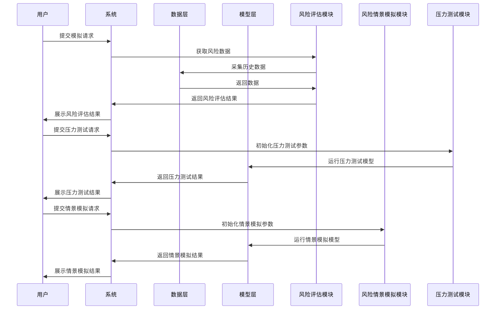
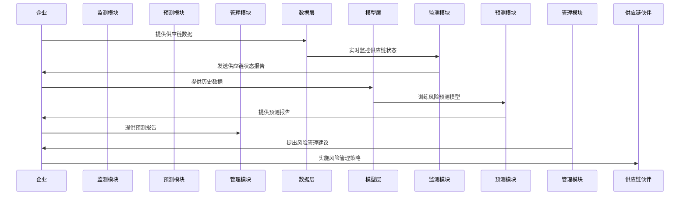

                 

### 文章标题

# AI Agent在企业风险情景模拟与压力测试中的应用

> 关键词：AI Agent、企业风险管理、情景模拟、压力测试、强化学习、生成对抗网络

> 摘要：本文将深入探讨人工智能（AI）代理在企业风险情景模拟与压力测试中的应用。首先，我们将介绍AI代理的定义、分类及其基础理论。接着，我们将详细阐述AI代理的构建方法和技术，如强化学习和生成对抗网络。随后，我们将分析AI代理在企业风险评估、风险识别和风险预测等应用场景中的具体作用，并讨论其对企业风险管理的提升。最后，本文将总结AI代理在企业风险情景模拟与压力测试中的应用价值，并提出未来发展的方向。

---

### 目录大纲

----------------------------------------------------------------

## 第一部分：引言

### 1.1 问题背景与问题描述

#### 1.1.1 人工智能的发展现状

#### 1.1.2 企业风险管理的挑战

#### 1.1.3 AI Agent的应用潜力

### 1.2 核心概念介绍

#### 1.2.1 AI Agent的定义

#### 1.2.2 企业风险情景模拟

#### 1.2.3 压力测试方法

### 1.3 书籍结构与目标

#### 1.3.1 目录结构

#### 1.3.2 阅读目标

#### 1.3.3 适用人群

### 1.4 本章小结

----------------------------------------------------------------

## 第二部分：AI Agent基础

### 2.1 AI Agent基础理论

#### 2.1.1 AI Agent的概念与分类

##### 2.1.1.1 反应式Agent

##### 2.1.1.2 目标导向Agent

##### 2.1.1.3 计划Agent

### 2.2 AI Agent的构建方法

#### 2.2.1 AI Agent的构建流程

##### 2.2.1.1 需求分析

##### 2.2.1.2 数据准备

##### 2.2.1.3 模型选择

##### 2.2.1.4 模型训练

##### 2.2.1.5 模型部署

### 2.3 AI Agent的常见技术

#### 2.3.1 强化学习

##### 2.3.1.1 强化学习的概念

##### 2.3.1.2 Q-Learning算法

##### 2.3.1.3 Deep Q-Learning算法

#### 2.3.2 生成对抗网络

##### 2.3.2.1 生成对抗网络的概念

##### 2.3.2.2 Generative Adversarial Networks算法

##### 2.3.2.3 条件生成对抗网络

### 2.4 AI Agent在企业中的应用场景

#### 2.4.1 风险评估

##### 2.4.1.1 风险识别

##### 2.4.1.2 风险预测

----------------------------------------------------------------

## 第一部分：引言

### 1.1 问题背景与问题描述

#### 1.1.1 人工智能的发展现状

随着信息技术的飞速发展，人工智能（AI）已经成为推动社会进步的重要力量。从早期的专家系统到今天的深度学习和强化学习，AI技术在各个领域都取得了显著的成果。特别是在大数据和云计算的推动下，AI技术的应用场景越来越广泛，从自动驾驶到智能客服，从医疗诊断到金融风控，AI正在逐步改变我们的生活方式和工作模式。

#### 1.1.2 企业风险管理的挑战

然而，随着企业业务复杂度的增加和市场环境的变化，企业面临着越来越多的风险。传统风险管理方法往往依赖于历史数据和专家经验，存在反应速度慢、预测准确性低等问题。在企业面临突发风险时，往往无法迅速做出有效的应对措施。因此，如何利用现代技术手段提升企业风险管理能力，成为企业迫切需要解决的问题。

#### 1.1.3 AI Agent的应用潜力

AI Agent，作为人工智能的一个子领域，具有自主学习和决策的能力，能够模拟人类的思维过程，并针对特定问题提供解决方案。在企业风险管理中，AI Agent可以通过模拟不同的风险情景，进行压力测试和风险评估，从而帮助企业提前识别潜在风险，制定应对策略。这种智能化的风险管理方法，具有高效、精准和动态调整的特点，具有很大的应用潜力。

### 1.2 核心概念介绍

#### 1.2.1 AI Agent的定义

AI Agent，即人工智能代理，是指一种能够感知环境、自主决策并执行任务的智能体。AI Agent通过机器学习算法从数据中学习，并根据学习到的知识进行推理和决策。AI Agent的核心特点是自主性和学习能力，这使得它们能够适应不断变化的环境，并自主解决复杂问题。

#### 1.2.2 企业风险情景模拟

企业风险情景模拟是指利用计算机模拟技术，构建企业可能面临的各种风险情景，并模拟这些情景对企业运营的影响。通过风险情景模拟，企业可以提前识别潜在风险，评估不同应对策略的效果，从而制定更加有效的风险管理策略。

#### 1.2.3 压力测试方法

压力测试是一种评估系统性能和稳定性的方法。在企业风险管理中，压力测试可以模拟不同风险情景下企业的运营状况，评估企业在面对突发风险时的应对能力。通过压力测试，企业可以了解系统的瓶颈和弱点，并针对性地进行优化和改进。

### 1.3 书籍结构与目标

#### 1.3.1 目录结构

本文分为两个主要部分：第一部分是引言，介绍人工智能的发展现状、企业风险管理的挑战以及AI Agent的应用潜力。第二部分是AI Agent基础，详细阐述AI Agent的定义、分类、构建方法和技术，以及其在企业中的应用场景。

#### 1.3.2 阅读目标

通过本文的阅读，读者将了解：

1. 人工智能代理的基本概念和分类。
2. 企业风险情景模拟和压力测试的基本方法。
3. AI Agent在风险管理中的应用原理和实践案例。
4. AI Agent构建方法和技术，包括强化学习和生成对抗网络等。

#### 1.3.3 适用人群

本文适用于以下读者群体：

1. 对人工智能和企业风险管理感兴趣的初学者。
2. 想要在企业中引入AI代理进行风险管理的专业人士。
3. 深入研究人工智能和风险管理的技术人员。

### 1.4 本章小结

本章介绍了人工智能的发展现状、企业风险管理的挑战以及AI Agent的应用潜力。通过本章的阅读，读者可以初步了解AI Agent在企业风险管理中的应用前景，并为后续章节的学习打下基础。

----------------------------------------------------------------

## 第二部分：AI Agent基础

### 2.1 AI Agent基础理论

#### 2.1.1 AI Agent的概念与分类

AI Agent是人工智能领域中一个重要的概念，它代表了具有一定智能能力的实体。AI Agent可以根据其行为方式和决策策略进行分类，主要分为以下几类：

##### 2.1.1.1 反应式Agent

反应式Agent是AI Agent中最基础的一类，它们仅根据当前环境中的感知信息做出即时反应。反应式Agent没有明确的内部状态，其行为完全是基于感知到的事件直接触发相应的动作。这种类型的Agent适用于环境相对简单、确定性较高的场景。

##### 反应式Agent的定义
反应式Agent是一种根据感知到的环境信号直接做出反应的智能体。它不存储过去的信息，也不进行长远的规划，而是根据当前环境状态做出即时响应。

##### 反应式Agent的工作原理
反应式Agent的工作原理可以简化为三个步骤：

1. 感知：从环境中获取信息。
2. 决策：根据感知信息，决定执行哪种动作。
3. 执行：执行决策。

##### 反应式Agent的应用场景
反应式Agent在控制机器人、智能家居等领域有广泛应用。例如，自动门系统可以根据人的接近来触发开门动作。

##### 2.1.1.2 目标导向Agent

目标导向Agent具有明确的目标，并会为达成这些目标而进行计划和决策。这种Agent通常具有内部状态和记忆，可以保存过去的信息，并利用这些信息进行长期规划。

##### 目标导向Agent的定义
目标导向Agent是一种具有明确目标，并能根据目标和当前状态进行计划决策的智能体。它能够存储历史信息，并利用这些信息进行推理和决策。

##### 目标导向Agent的工作原理
目标导向Agent的工作原理包括以下步骤：

1. 初始化：设置目标。
2. 计划：根据当前状态和历史信息，制定实现目标的行动计划。
3. 执行：按照行动计划执行动作。
4. 反馈：根据执行结果调整目标和计划。

##### 目标导向Agent的应用场景
目标导向Agent在智能客服、智能决策支持系统等领域有广泛应用。例如，智能客服系统可以根据用户的问题和历史记录，提供个性化的解决方案。

##### 2.1.1.3 计划Agent

计划Agent是一种更高级的AI Agent，它们不仅具有目标导向性，还能够对未来进行长期规划和决策。计划Agent通常使用复杂的算法和模型来模拟环境，预测未来的变化，并制定最优的行动策略。

##### 计划Agent的定义
计划Agent是一种能够进行长期规划，并针对未来环境变化做出决策的智能体。它能够模拟未来的情景，并根据预测结果制定最优的行动方案。

##### 计划Agent的工作原理
计划Agent的工作原理包括以下步骤：

1. 情景模拟：根据当前状态和历史信息，模拟未来可能的情景。
2. 预测：使用模拟结果预测未来的变化。
3. 规划：根据预测结果制定长期行动计划。
4. 执行：按照行动计划执行动作。
5. 评估：根据执行结果评估计划的有效性，并调整计划。

##### 计划Agent的应用场景
计划Agent在自动驾驶、智能电网等领域有广泛应用。例如，自动驾驶系统可以根据道路条件和交通状况，规划最优行驶路线。

#### 2.1.2 AI Agent的构建方法

构建AI Agent需要经过一系列的步骤，包括需求分析、数据准备、模型选择、模型训练和模型部署等。下面将详细讨论这些步骤。

##### 2.2.1.1 需求分析

需求分析是构建AI Agent的第一步，它包括问题定义、目标设定和评价指标等方面。

1. **问题定义**：明确AI Agent需要解决的具体问题，例如风险评估、风险识别或压力测试。
2. **目标设定**：根据问题定义，设定AI Agent的目标，例如提高风险评估的准确性或缩短压力测试的时间。
3. **评价指标**：确定如何评价AI Agent的性能，例如准确率、响应时间或资源消耗等。

##### 2.2.1.2 数据准备

数据准备是构建AI Agent的重要环节，它包括数据来源、数据预处理和特征提取等方面。

1. **数据来源**：获取与问题相关的数据，这些数据可以来自企业内部系统、外部数据库或公共数据集。
2. **数据预处理**：对原始数据进行清洗、去噪和格式化，以便后续分析和处理。
3. **特征提取**：从预处理后的数据中提取具有代表性的特征，这些特征将用于训练AI Agent。

##### 2.2.1.3 模型选择

模型选择是构建AI Agent的关键步骤，它决定了AI Agent的性能和适用性。常见的AI模型包括神经网络、决策树、支持向量机和聚类算法等。

1. **神经网络**：适用于复杂非线性问题，如图像识别和自然语言处理。
2. **决策树**：适用于分类问题，具有易于理解和解释的优点。
3. **支持向量机**：适用于分类和回归问题，具有良好的泛化能力。
4. **聚类算法**：适用于无监督学习问题，用于发现数据中的模式。

##### 2.2.1.4 模型训练

模型训练是将数据输入到AI模型中，通过调整模型的参数来提高其性能。训练过程包括以下几个阶段：

1. **数据划分**：将数据集划分为训练集、验证集和测试集。
2. **参数调整**：通过调整模型的参数，如学习率和正则化参数，来优化模型性能。
3. **模型评估**：使用验证集和测试集评估模型的性能，并选择最优模型。

##### 2.2.1.5 模型部署

模型部署是将训练好的AI模型应用到实际场景中，包括以下几个方面：

1. **部署环境**：选择适合模型部署的环境，如服务器或云计算平台。
2. **部署流程**：制定模型部署的流程，包括模型导出、部署和监控等。
3. **模型监控**：对部署后的模型进行监控，确保其正常运行和性能稳定。

#### 2.2.2 AI Agent的构建流程

AI Agent的构建流程可以概括为以下几个步骤：

1. **需求分析**：明确问题定义、目标设定和评价指标。
2. **数据准备**：获取并预处理数据，提取特征。
3. **模型选择**：选择适合的AI模型。
4. **模型训练**：训练模型并调整参数。
5. **模型评估**：评估模型性能并选择最优模型。
6. **模型部署**：部署模型到实际场景。

#### 2.2.3 AI Agent的常见技术

AI Agent的构建涉及多种技术，其中强化学习和生成对抗网络是两种重要的技术。

##### 2.3.1 强化学习

强化学习是一种通过试错方法来学习策略的机器学习方法。在强化学习中，AI Agent通过与环境的交互来学习最优行为策略。

1. **强化学习的概念**
强化学习是一种基于奖励机制的学习方法，其目标是学习一个策略，使得智能体能够在不确定的环境中实现最大化的累积奖励。
2. **强化学习的基本要素**
- **状态**：智能体当前所处的环境状态。
- **动作**：智能体可以执行的动作。
- **奖励**：智能体执行动作后获得的即时奖励。
- **策略**：智能体根据状态选择动作的方法。

##### 2.3.1.1 Q-Learning算法

Q-Learning算法是一种基于价值迭代的强化学习算法。它通过迭代更新Q值来学习最优策略。

1. **Q-Learning算法原理**
Q-Learning算法通过更新Q值（状态-动作值函数）来学习最优策略。Q值表示在特定状态下执行特定动作的预期奖励。
2. **Q-Learning算法流程**
- 初始化Q值表。
- 在每个时间步，智能体选择动作，并执行动作。
- 根据执行结果更新Q值。
- 重复上述过程，直到达到停止条件。

##### 2.3.1.2 Deep Q-Learning算法

Deep Q-Learning算法是一种将深度神经网络与强化学习结合的算法，用于解决状态空间和动作空间较大的问题。

1. **Deep Q-Learning算法原理**
Deep Q-Learning算法使用深度神经网络来近似Q值函数，从而在复杂的任务中实现有效的学习。
2. **Deep Q-Learning算法流程**
- 初始化深度神经网络和经验回放记忆。
- 在每个时间步，智能体选择动作，并执行动作。
- 将经验存储到记忆中。
- 从记忆中随机采样经验，用于训练深度神经网络。
- 更新深度神经网络的参数。

##### 2.3.2 生成对抗网络

生成对抗网络（GAN）是一种由生成器和判别器组成的深度学习模型，用于生成与真实数据分布相似的数据。

1. **生成对抗网络的概念**
生成对抗网络由一个生成器和一个判别器组成。生成器试图生成与真实数据分布相似的数据，而判别器则试图区分生成数据与真实数据。
2. **生成对抗网络的基本结构**
- **生成器**：将随机噪声映射为数据。
- **判别器**：对数据进行分类，判断其是真实数据还是生成数据。
- **对抗训练**：生成器和判别器相互对抗，生成器不断尝试生成更真实的数据，而判别器不断尝试区分数据。

##### 2.3.2.1 Generative Adversarial Networks算法

Generative Adversarial Networks（GAN）算法是生成对抗网络的核心算法，通过生成器和判别器的对抗训练来生成数据。

1. **GAN算法原理**
GAN算法通过生成器和判别器的对抗训练，生成器试图生成更加真实的数据，而判别器试图准确区分生成数据和真实数据。
2. **GAN算法流程**
- 初始化生成器和判别器。
- 对生成器进行训练，使其生成更真实的数据。
- 对判别器进行训练，使其能够准确区分生成数据和真实数据。
- 反复进行上述过程，直到生成器生成的数据与真实数据难以区分。

##### 2.3.2.2 条件生成对抗网络

条件生成对抗网络（Conditional GAN，CGAN）是生成对抗网络的一种变体，它通过添加条件信息来提高生成数据的质量。

1. **CGAN算法原理**
CGAN算法在GAN的基础上添加了条件信息，使得生成器可以根据条件信息生成更具体、更真实的数据。
2. **CGAN算法流程**
- 初始化生成器和判别器。
- 输入条件信息。
- 生成器根据条件信息生成数据。
- 判别器对生成数据和真实数据进行分类。
- 反复进行上述过程，直到生成器生成的数据与真实数据难以区分。

##### 2.3.3 AI Agent在企业中的应用场景

AI Agent在企业中的应用场景广泛，主要包括风险评估、风险识别和风险预测等。

1. **风险评估**
AI Agent可以通过模拟不同的风险情景，评估这些情景对企业运营的影响，从而帮助企业提前识别潜在风险。
2. **风险识别**
AI Agent可以通过分析企业历史数据和实时数据，识别潜在的风险因素，为企业提供预警。
3. **风险预测**
AI Agent可以通过学习和预测技术，预测未来可能发生的风险事件，为企业制定风险管理策略提供支持。

### 2.4 AI Agent的常见技术

AI Agent在企业中的应用离不开一些关键技术的支持，以下将详细介绍这些技术。

##### 2.3.1 强化学习

强化学习是一种通过试错方法来学习策略的机器学习方法。在强化学习中，AI Agent通过与环境的交互来学习最优行为策略。

1. **强化学习的概念**
强化学习是一种基于奖励机制的学习方法，其目标是学习一个策略，使得智能体能够在不确定的环境中实现最大化的累积奖励。
2. **强化学习的基本要素**
- **状态**：智能体当前所处的环境状态。
- **动作**：智能体可以执行的动作。
- **奖励**：智能体执行动作后获得的即时奖励。
- **策略**：智能体根据状态选择动作的方法。

##### 2.3.1.1 Q-Learning算法

Q-Learning算法是一种基于价值迭代的强化学习算法。它通过迭代更新Q值来学习最优策略。

1. **Q-Learning算法原理**
Q-Learning算法通过更新Q值（状态-动作值函数）来学习最优策略。Q值表示在特定状态下执行特定动作的预期奖励。
2. **Q-Learning算法流程**
- 初始化Q值表。
- 在每个时间步，智能体选择动作，并执行动作。
- 根据执行结果更新Q值。
- 重复上述过程，直到达到停止条件。

##### 2.3.1.2 Deep Q-Learning算法

Deep Q-Learning算法是一种将深度神经网络与强化学习结合的算法，用于解决状态空间和动作空间较大的问题。

1. **Deep Q-Learning算法原理**
Deep Q-Learning算法使用深度神经网络来近似Q值函数，从而在复杂的任务中实现有效的学习。
2. **Deep Q-Learning算法流程**
- 初始化深度神经网络和经验回放记忆。
- 在每个时间步，智能体选择动作，并执行动作。
- 将经验存储到记忆中。
- 从记忆中随机采样经验，用于训练深度神经网络。
- 更新深度神经网络的参数。

##### 2.3.2 生成对抗网络

生成对抗网络（GAN）是一种由生成器和判别器组成的深度学习模型，用于生成与真实数据分布相似的数据。

1. **生成对抗网络的概念**
生成对抗网络由一个生成器和一个判别器组成。生成器试图生成与真实数据分布相似的数据，而判别器则试图区分生成数据与真实数据。
2. **生成对抗网络的基本结构**
- **生成器**：将随机噪声映射为数据。
- **判别器**：对数据进行分类，判断其是真实数据还是生成数据。
- **对抗训练**：生成器和判别器相互对抗，生成器不断尝试生成更真实的数据，而判别器不断尝试区分数据。

##### 2.3.2.1 Generative Adversarial Networks算法

Generative Adversarial Networks（GAN）算法是生成对抗网络的核心算法，通过生成器和判别器的对抗训练来生成数据。

1. **GAN算法原理**
GAN算法通过生成器和判别器的对抗训练，生成器试图生成更加真实的数据，而判别器试图准确区分生成数据和真实数据。
2. **GAN算法流程**
- 初始化生成器和判别器。
- 对生成器进行训练，使其生成更真实的数据。
- 对判别器进行训练，使其能够准确区分生成数据和真实数据。
- 反复进行上述过程，直到生成器生成的数据与真实数据难以区分。

##### 2.3.2.2 条件生成对抗网络

条件生成对抗网络（Conditional GAN，CGAN）是生成对抗网络的一种变体，它通过添加条件信息来提高生成数据的质量。

1. **CGAN算法原理**
CGAN算法在GAN的基础上添加了条件信息，使得生成器可以根据条件信息生成更具体、更真实的数据。
2. **CGAN算法流程**
- 初始化生成器和判别器。
- 输入条件信息。
- 生成器根据条件信息生成数据。
- 判别器对生成数据和真实数据进行分类。
- 反复进行上述过程，直到生成器生成的数据与真实数据难以区分。

##### 2.3.3 AI Agent在企业中的应用场景

AI Agent在企业中的应用场景广泛，主要包括风险评估、风险识别和风险预测等。

1. **风险评估**
AI Agent可以通过模拟不同的风险情景，评估这些情景对企业运营的影响，从而帮助企业提前识别潜在风险。
2. **风险识别**
AI Agent可以通过分析企业历史数据和实时数据，识别潜在的风险因素，为企业提供预警。
3. **风险预测**
AI Agent可以通过学习和预测技术，预测未来可能发生的风险事件，为企业制定风险管理策略提供支持。

### 2.4 AI Agent在企业中的应用场景

AI Agent在企业中的应用场景广泛，主要包括风险评估、风险识别和风险预测等。

#### 2.4.1 风险评估

在风险评估中，AI Agent可以通过模拟不同的风险情景，评估这些情景对企业运营的影响，从而帮助企业提前识别潜在风险。例如，在金融行业，AI Agent可以模拟市场波动、信用风险等情景，评估这些情景对金融机构的财务状况和业务运营的影响。

1. **风险识别**
风险识别是风险评估的第一步，AI Agent可以通过分析企业历史数据和实时数据，识别潜在的风险因素。例如，通过分析财务报表、交易记录等数据，AI Agent可以识别出潜在的经营风险、市场风险和信用风险。

2. **风险预测**
风险预测是风险评估的核心，AI Agent可以通过学习历史数据和实时数据，预测未来可能发生的风险事件。例如，在供应链管理中，AI Agent可以通过分析订单数据、库存数据等，预测未来可能出现的供应中断或库存积压等问题。

#### 2.4.2 风险识别

风险识别是风险评估的第一步，AI Agent可以通过分析企业历史数据和实时数据，识别潜在的风险因素。例如，通过分析财务报表、交易记录等数据，AI Agent可以识别出潜在的经营风险、市场风险和信用风险。

##### 2.4.2.1 风险识别的流程

1. 数据收集：收集与企业运营相关的数据，如财务报表、交易记录、市场数据等。
2. 数据预处理：对收集到的数据进行分析和清洗，去除异常值和噪声，提取有用的特征。
3. 特征选择：从预处理后的数据中提取具有代表性的特征，用于训练AI Agent。
4. 模型训练：使用历史数据训练AI Agent，使其能够识别潜在的风险因素。
5. 风险识别：将训练好的AI Agent应用到实际场景中，识别潜在的风险。

##### 2.4.2.2 风险识别的方法

1. **统计分析方法**：使用统计学方法分析数据，如假设检验、聚类分析等，识别潜在的风险因素。
2. **机器学习方法**：使用机器学习方法，如决策树、随机森林、神经网络等，识别潜在的风险因素。
3. **深度学习方法**：使用深度学习方法，如卷积神经网络、循环神经网络等，识别潜在的风险因素。

#### 2.4.3 风险预测

风险预测是风险评估的核心，AI Agent可以通过学习历史数据和实时数据，预测未来可能发生的风险事件。例如，在供应链管理中，AI Agent可以通过分析订单数据、库存数据等，预测未来可能出现的供应中断或库存积压等问题。

##### 2.4.3.1 风险预测的流程

1. 数据收集：收集与企业运营相关的数据，如财务报表、交易记录、市场数据、供应链数据等。
2. 数据预处理：对收集到的数据进行分析和清洗，去除异常值和噪声，提取有用的特征。
3. 特征选择：从预处理后的数据中提取具有代表性的特征，用于训练AI Agent。
4. 模型训练：使用历史数据训练AI Agent，使其能够预测未来的风险事件。
5. 风险预测：将训练好的AI Agent应用到实际场景中，预测未来可能发生的风险事件。
6. 风险预警：根据预测结果，提前发出风险预警，帮助企业制定应对策略。

##### 2.4.3.2 风险预测的方法

1. **统计分析方法**：使用统计学方法分析数据，如时间序列分析、回归分析等，预测未来的风险事件。
2. **机器学习方法**：使用机器学习方法，如决策树、随机森林、支持向量机等，预测未来的风险事件。
3. **深度学习方法**：使用深度学习方法，如卷积神经网络、循环神经网络等，预测未来的风险事件。

### 2.5 AI Agent在风险管理的应用

AI Agent在风险管理中的应用主要包括以下几个方面：

1. **风险识别**：通过分析历史数据和实时数据，AI Agent可以识别出潜在的风险因素，为企业提供预警。
2. **风险预测**：通过学习历史数据和实时数据，AI Agent可以预测未来可能发生的风险事件，为企业制定风险管理策略提供支持。
3. **压力测试**：AI Agent可以模拟不同的风险情景，评估这些情景对企业运营的影响，帮助企业提前识别潜在风险。
4. **决策支持**：AI Agent可以分析企业历史数据和实时数据，提供针对性的风险管理建议，帮助企业制定有效的风险管理策略。

### 2.6 本章小结

本章介绍了AI Agent的定义、分类和构建方法，以及强化学习和生成对抗网络等关键技术。同时，还讨论了AI Agent在企业风险评估、风险识别和风险预测等应用场景中的具体作用。通过本章的学习，读者可以初步了解AI Agent在风险管理中的应用原理和实践方法。

----------------------------------------------------------------

## 第三部分：AI Agent在企业中的应用

### 3.1 AI Agent在风险评估中的应用

在企业的风险管理中，风险评估是关键的一环。传统的风险评估方法往往依赖于历史数据和专家经验，存在反应速度慢、预测准确性低等问题。而AI Agent的出现，为企业的风险评估带来了新的契机。

#### 3.1.1 风险评估流程

AI Agent在风险评估中的应用流程主要包括以下步骤：

1. **数据收集与预处理**：收集与企业运营相关的数据，如财务报表、交易记录、市场数据等。对这些数据进行预处理，包括数据清洗、去噪和特征提取等。

2. **模型选择与训练**：选择合适的机器学习模型，如决策树、随机森林、神经网络等，对收集到的数据进行分析和训练。

3. **风险评估**：将训练好的模型应用于实际场景中，对企业的运营情况进行风险评估，识别潜在的风险因素。

4. **风险预测**：利用历史数据和实时数据，预测未来可能发生的风险事件，为企业制定风险管理策略提供支持。

#### 3.1.2 应用案例

以一家金融机构为例，AI Agent可以收集该金融机构的财务报表、交易记录和市场数据等，通过分析这些数据，识别出潜在的风险因素，如信用风险、市场风险和操作风险等。同时，AI Agent还可以预测未来可能发生的风险事件，如市场波动、信用危机等，从而帮助金融机构制定有效的风险管理策略。

### 3.2 AI Agent在风险识别中的应用

风险识别是风险评估的第一步，也是最为关键的一步。传统的风险识别方法往往依赖于专家的经验和主观判断，存在准确性低、实时性差等问题。而AI Agent的出现，为风险识别提供了新的技术手段。

#### 3.2.1 风险识别流程

AI Agent在风险识别中的应用流程主要包括以下步骤：

1. **数据收集与预处理**：收集与企业运营相关的数据，如财务报表、交易记录、市场数据等。对这些数据进行预处理，包括数据清洗、去噪和特征提取等。

2. **模型选择与训练**：选择合适的机器学习模型，如决策树、随机森林、神经网络等，对收集到的数据进行分析和训练。

3. **风险识别**：将训练好的模型应用于实际场景中，对企业的运营情况进行风险识别，识别潜在的风险因素。

4. **实时监测与预警**：对识别出的风险因素进行实时监测，一旦发现风险因素的变化，立即发出预警，提醒企业采取相应的措施。

#### 3.2.2 应用案例

以一家制造企业为例，AI Agent可以收集该企业的生产数据、销售数据和市场数据等，通过分析这些数据，识别出潜在的风险因素，如生产故障、库存积压和市场需求波动等。同时，AI Agent还可以对识别出的风险因素进行实时监测，一旦发现风险因素的变化，立即发出预警，提醒企业采取相应的措施。

### 3.3 AI Agent在风险预测中的应用

风险预测是风险评估的核心，它可以帮助企业提前识别潜在的风险事件，制定有效的风险管理策略。AI Agent在风险预测中的应用，大大提升了风险预测的准确性和实时性。

#### 3.3.1 风险预测流程

AI Agent在风险预测中的应用流程主要包括以下步骤：

1. **数据收集与预处理**：收集与企业运营相关的数据，如财务报表、交易记录、市场数据等。对这些数据进行预处理，包括数据清洗、去噪和特征提取等。

2. **模型选择与训练**：选择合适的机器学习模型，如决策树、随机森林、神经网络等，对收集到的数据进行分析和训练。

3. **风险预测**：将训练好的模型应用于实际场景中，对企业的运营情况进行风险预测，预测未来可能发生的风险事件。

4. **策略制定与调整**：根据预测结果，制定相应的风险管理策略，并对策略进行实时调整。

#### 3.3.2 应用案例

以一家电子商务平台为例，AI Agent可以收集该平台的交易数据、用户行为数据和市场数据等，通过分析这些数据，预测未来可能出现的风险事件，如订单量波动、用户流失和库存积压等。同时，AI Agent还可以根据预测结果，制定相应的风险管理策略，如调整库存、优化营销策略等。

### 3.4 AI Agent在压力测试中的应用

压力测试是评估企业系统性能和稳定性的重要手段。传统的压力测试方法往往需要大量的人工干预，且测试结果往往受限于测试人员的经验和技能。而AI Agent的出现，为压力测试带来了新的解决方案。

#### 3.4.1 压力测试流程

AI Agent在压力测试中的应用流程主要包括以下步骤：

1. **数据收集与预处理**：收集与企业系统运行相关的数据，如系统日志、网络流量等。对这些数据进行预处理，包括数据清洗、去噪和特征提取等。

2. **模型选择与训练**：选择合适的机器学习模型，如决策树、随机森林、神经网络等，对收集到的数据进行分析和训练。

3. **压力测试**：将训练好的模型应用于实际场景中，模拟不同的压力情景，评估系统的性能和稳定性。

4. **结果分析**：对压力测试结果进行分析，识别系统的瓶颈和弱点，并提出优化建议。

#### 3.4.2 应用案例

以一家金融机构的在线交易平台为例，AI Agent可以收集该平台的系统日志、网络流量等数据，通过分析这些数据，模拟不同的压力情景，如高并发交易、网络攻击等，评估平台的性能和稳定性。同时，AI Agent还可以根据测试结果，识别平台的瓶颈和弱点，并提出优化建议，如调整服务器配置、优化数据库查询等。

### 3.5 AI Agent在风险管理中的优势

AI Agent在风险管理中的应用，具有以下优势：

1. **自动化**：AI Agent可以自动化地进行风险识别、预测和压力测试，大大降低了人工干预的必要性。

2. **实时性**：AI Agent可以实时监测企业的运营情况，及时识别和预警潜在的风险。

3. **准确性**：AI Agent通过机器学习和深度学习技术，可以准确预测未来的风险事件，提高风险管理的效果。

4. **适应性**：AI Agent可以根据企业的业务特点和需求，自适应地调整风险识别和预测策略，提高风险管理的能力。

### 3.6 本章小结

本章介绍了AI Agent在企业风险评估、风险识别、风险预测和压力测试中的应用。通过AI Agent的应用，企业可以自动化地进行风险管理，提高风险识别和预测的准确性，实时监测企业的运营情况，从而提高整体的风险管理能力。未来，随着人工智能技术的不断发展，AI Agent在风险管理中的应用将更加广泛，为企业带来更大的价值。

----------------------------------------------------------------

## 第四部分：AI Agent构建方法与技术

### 4.1 强化学习

强化学习是一种通过试错方法来学习策略的机器学习方法。在强化学习中，AI Agent通过与环境的交互来学习最优行为策略。强化学习广泛应用于游戏、机器人控制、推荐系统等领域。

#### 4.1.1 强化学习的概念

强化学习是一种基于奖励机制的学习方法，其目标是学习一个策略，使得智能体能够在不确定的环境中实现最大化的累积奖励。强化学习中的基本要素包括状态、动作、奖励和策略。

1. **状态**：智能体当前所处的环境状态。
2. **动作**：智能体可以执行的动作。
3. **奖励**：智能体执行动作后获得的即时奖励。
4. **策略**：智能体根据状态选择动作的方法。

#### 4.1.2 强化学习的基本要素

强化学习的基本要素包括以下三个方面：

1. **状态-动作值函数**：表示在特定状态下执行特定动作的预期奖励。
2. **策略**：智能体根据状态-动作值函数选择最优动作的方法。
3. **学习算法**：用于更新状态-动作值函数，以实现策略优化。

#### 4.1.3 Q-Learning算法

Q-Learning算法是一种基于价值迭代的强化学习算法。它通过迭代更新Q值（状态-动作值函数）来学习最优策略。Q值表示在特定状态下执行特定动作的预期奖励。

1. **Q-Learning算法原理**
Q-Learning算法通过更新Q值来学习最优策略。Q值表示在特定状态下执行特定动作的预期奖励。算法的基本流程如下：

   - 初始化Q值表。
   - 在每个时间步，智能体选择动作，并执行动作。
   - 根据执行结果更新Q值。
   - 重复上述过程，直到达到停止条件。

2. **Q-Learning算法流程**
   - 初始化Q值表。
   - 在每个时间步，智能体选择动作，并执行动作。
   - 根据执行结果更新Q值。
   - 重复上述过程，直到达到停止条件。

#### 4.1.4 Deep Q-Learning算法

Deep Q-Learning算法是一种将深度神经网络与强化学习结合的算法，用于解决状态空间和动作空间较大的问题。它通过深度神经网络来近似Q值函数，从而在复杂的任务中实现有效的学习。

1. **Deep Q-Learning算法原理**
Deep Q-Learning算法使用深度神经网络来近似Q值函数，从而在复杂的任务中实现有效的学习。算法的基本流程如下：

   - 初始化深度神经网络和经验回放记忆。
   - 在每个时间步，智能体选择动作，并执行动作。
   - 将经验存储到记忆中。
   - 从记忆中随机采样经验，用于训练深度神经网络。
   - 更新深度神经网络的参数。

2. **Deep Q-Learning算法流程**
   - 初始化深度神经网络和经验回放记忆。
   - 在每个时间步，智能体选择动作，并执行动作。
   - 将经验存储到记忆中。
   - 从记忆中随机采样经验，用于训练深度神经网络。
   - 更新深度神经网络的参数。

#### 4.1.5 强化学习在风险管理中的应用

强化学习在风险管理中的应用主要包括以下几个方面：

1. **风险识别**：通过强化学习算法，智能体可以自动识别潜在的风险因素。
2. **风险预测**：利用历史数据和实时数据，强化学习算法可以预测未来可能发生的风险事件。
3. **压力测试**：通过模拟不同的压力情景，强化学习算法可以评估系统的性能和稳定性。

### 4.2 生成对抗网络

生成对抗网络（GAN）是一种由生成器和判别器组成的深度学习模型，用于生成与真实数据分布相似的数据。GAN在图像生成、语音合成、自然语言处理等领域取得了显著的成果。

#### 4.2.1 生成对抗网络的概念

生成对抗网络由一个生成器和一个判别器组成。生成器试图生成与真实数据分布相似的数据，而判别器则试图区分生成数据与真实数据。GAN的核心思想是通过生成器和判别器的对抗训练，使得生成器生成更加真实的数据。

1. **生成器**：将随机噪声映射为数据。
2. **判别器**：对数据进行分类，判断其是真实数据还是生成数据。
3. **对抗训练**：生成器和判别器相互对抗，生成器不断尝试生成更真实的数据，而判别器不断尝试区分数据。

#### 4.2.2 生成对抗网络的基本结构

生成对抗网络的基本结构包括生成器和判别器两个部分。生成器的输入是随机噪声，输出是生成数据。判别器的输入是真实数据和生成数据，输出是对数据的分类结果。

1. **生成器**：接收随机噪声，通过神经网络生成数据。
2. **判别器**：接收真实数据和生成数据，通过神经网络对数据进行分类。

#### 4.2.3 Generative Adversarial Networks算法

Generative Adversarial Networks（GAN）算法是生成对抗网络的核心算法，通过生成器和判别器的对抗训练来生成数据。

1. **GAN算法原理**
GAN算法通过生成器和判别器的对抗训练，生成器试图生成更加真实的数据，而判别器试图准确区分生成数据和真实数据。

2. **GAN算法流程**
   - 初始化生成器和判别器。
   - 对生成器进行训练，使其生成更真实的数据。
   - 对判别器进行训练，使其能够准确区分生成数据和真实数据。
   - 反复进行上述过程，直到生成器生成的数据与真实数据难以区分。

#### 4.2.4 条件生成对抗网络

条件生成对抗网络（Conditional GAN，CGAN）是生成对抗网络的一种变体，它通过添加条件信息来提高生成数据的质量。

1. **CGAN算法原理**
CGAN算法在GAN的基础上添加了条件信息，使得生成器可以根据条件信息生成更具体、更真实的数据。

2. **CGAN算法流程**
   - 初始化生成器和判别器。
   - 输入条件信息。
   - 生成器根据条件信息生成数据。
   - 判别器对生成数据和真实数据进行分类。
   - 反复进行上述过程，直到生成器生成的数据与真实数据难以区分。

#### 4.2.5 生成对抗网络在风险管理中的应用

生成对抗网络在风险管理中的应用主要包括以下几个方面：

1. **数据生成**：利用GAN生成与真实数据分布相似的数据，用于风险识别和预测。
2. **异常检测**：通过对比生成数据和真实数据，发现潜在的异常情况，用于风险预警。
3. **压力测试**：利用生成对抗网络模拟不同的压力情景，评估系统的性能和稳定性。

### 4.3 AI Agent的构建方法

AI Agent的构建方法主要包括以下步骤：

1. **需求分析**：明确AI Agent需要解决的具体问题，例如风险评估、风险识别或压力测试。
2. **数据准备**：收集并预处理数据，提取特征。
3. **模型选择**：选择适合的AI模型，如强化学习、生成对抗网络等。
4. **模型训练**：训练模型并调整参数。
5. **模型部署**：将训练好的模型部署到实际场景中。

#### 4.3.1 需求分析

需求分析是构建AI Agent的第一步，它包括以下内容：

1. **问题定义**：明确AI Agent需要解决的具体问题，例如风险评估、风险识别或压力测试。
2. **目标设定**：根据问题定义，设定AI Agent的目标，例如提高风险评估的准确性或缩短压力测试的时间。
3. **评价指标**：确定如何评价AI Agent的性能，例如准确率、响应时间或资源消耗等。

#### 4.3.2 数据准备

数据准备是构建AI Agent的重要环节，它包括以下内容：

1. **数据来源**：获取与问题相关的数据，这些数据可以来自企业内部系统、外部数据库或公共数据集。
2. **数据预处理**：对原始数据进行清洗、去噪和格式化，以便后续分析和处理。
3. **特征提取**：从预处理后的数据中提取具有代表性的特征，这些特征将用于训练AI Agent。

#### 4.3.3 模型选择

模型选择是构建AI Agent的关键步骤，它决定了AI Agent的性能和适用性。常见的AI模型包括神经网络、决策树、支持向量机和聚类算法等。

1. **神经网络**：适用于复杂非线性问题，如图像识别和自然语言处理。
2. **决策树**：适用于分类问题，具有易于理解和解释的优点。
3. **支持向量机**：适用于分类和回归问题，具有良好的泛化能力。
4. **聚类算法**：适用于无监督学习问题，用于发现数据中的模式。

#### 4.3.4 模型训练

模型训练是将数据输入到AI模型中，通过调整模型的参数来提高其性能。训练过程包括以下几个阶段：

1. **数据划分**：将数据集划分为训练集、验证集和测试集。
2. **参数调整**：通过调整模型的参数，如学习率和正则化参数，来优化模型性能。
3. **模型评估**：使用验证集和测试集评估模型的性能，并选择最优模型。

#### 4.3.5 模型部署

模型部署是将训练好的AI模型应用到实际场景中，包括以下几个方面：

1. **部署环境**：选择适合模型部署的环境，如服务器或云计算平台。
2. **部署流程**：制定模型部署的流程，包括模型导出、部署和监控等。
3. **模型监控**：对部署后的模型进行监控，确保其正常运行和性能稳定。

### 4.4 AI Agent的应用场景

AI Agent在企业中的应用场景广泛，主要包括风险评估、风险识别、风险预测和压力测试等。通过AI Agent的应用，企业可以自动化地进行风险管理，提高风险识别和预测的准确性，实时监测企业的运营情况，从而提高整体的风险管理能力。

### 4.5 本章小结

本章介绍了AI Agent的构建方法和技术，包括强化学习和生成对抗网络等关键技术。通过本章的学习，读者可以了解AI Agent的构建流程和应用场景，为实际应用提供参考。

----------------------------------------------------------------

## 第五部分：AI Agent在企业风险情景模拟与压力测试中的应用

### 5.1 企业风险情景模拟

企业风险情景模拟是一种通过模拟企业可能面临的风险情景，评估这些情景对企业运营的影响的方法。AI Agent在这一过程中发挥着重要作用，能够根据实时数据和模型预测，模拟各种可能的风险情景，并评估其对企业的潜在影响。

#### 5.1.1 风险情景模拟的流程

风险情景模拟的流程主要包括以下几个步骤：

1. **情景设计**：设计可能的风险情景，例如市场波动、供应链中断、法律风险等。
2. **数据收集**：收集与企业运营相关的数据，如市场数据、财务数据、供应链数据等。
3. **模型构建**：构建用于模拟风险情景的AI模型，如强化学习模型、神经网络模型等。
4. **情景模拟**：将收集到的数据输入到AI模型中，模拟不同的风险情景。
5. **结果分析**：分析模拟结果，评估风险情景对企业运营的影响。
6. **优化策略**：根据模拟结果，制定和优化风险管理策略。

#### 5.1.2 风险情景模拟的应用案例

以一家制造企业为例，企业可能面临的风险情景包括原材料价格波动、市场需求变化和供应链中断等。通过AI Agent的模拟，企业可以了解这些情景对生产成本、库存管理和销售业绩的影响，从而提前采取相应的风险管理措施。

### 5.2 压力测试

压力测试是评估企业系统性能和稳定性的重要手段。通过模拟不同的压力情景，AI Agent可以帮助企业识别系统瓶颈和弱点，优化系统性能。

#### 5.2.1 压力测试的流程

压力测试的流程主要包括以下几个步骤：

1. **情景设计**：设计需要测试的情景，例如高并发访问、大量数据处理等。
2. **测试环境准备**：准备用于测试的环境，包括硬件设备和软件系统。
3. **测试执行**：执行测试脚本，模拟不同的压力情景。
4. **数据收集**：收集测试过程中产生的数据，如系统响应时间、CPU利用率、内存消耗等。
5. **结果分析**：分析测试结果，识别系统瓶颈和弱点。
6. **优化建议**：根据测试结果，提出优化系统性能的建议。

#### 5.2.2 压力测试的应用案例

以一家电子商务平台为例，AI Agent可以模拟高并发访问情景，评估平台在大量用户访问时的性能和稳定性。通过分析测试结果，企业可以优化服务器配置、数据库查询和缓存策略，提高平台的响应速度和用户满意度。

### 5.3 AI Agent在风险情景模拟与压力测试中的优势

AI Agent在风险情景模拟与压力测试中的应用具有以下优势：

1. **自动化**：AI Agent可以自动化地进行风险情景模拟和压力测试，减少人工干预。
2. **实时性**：AI Agent可以实时收集和处理数据，快速模拟和评估风险情景。
3. **准确性**：AI Agent通过机器学习和深度学习技术，可以准确预测风险情景对企业的潜在影响。
4. **适应性**：AI Agent可以根据企业的业务特点和需求，自适应地调整风险情景模拟和压力测试策略。

### 5.4 实际应用案例

#### 5.4.1 案例一：某金融机构的风险管理

某金融机构利用AI Agent进行风险管理，包括风险评估、风险识别和风险预测。通过模拟不同的市场情景，AI Agent能够准确预测市场波动对企业财务状况的影响，帮助金融机构提前采取风险管理措施，降低风险。

#### 5.4.2 案例二：某制造业企业的供应链管理

某制造业企业利用AI Agent进行供应链管理，包括风险情景模拟和压力测试。通过模拟供应链中断情景，AI Agent能够评估对企业生产运营的影响，并提出优化供应链管理的建议。同时，通过压力测试，企业可以优化生产计划和资源配置，提高供应链的稳定性和效率。

### 5.5 本章小结

本章介绍了AI Agent在企业风险情景模拟与压力测试中的应用。通过AI Agent的自动化、实时性、准确性和适应性，企业可以更有效地进行风险管理和系统性能优化。未来，随着人工智能技术的不断发展，AI Agent在风险管理中的应用将更加广泛，为企业带来更大的价值。

----------------------------------------------------------------

## 第六部分：AI Agent在企业风险管理中的应用案例与最佳实践

### 6.1 案例一：金融行业中的AI代理应用

#### 6.1.1 案例背景

在金融行业中，风险管理至关重要。一家大型银行希望通过引入AI Agent来提升其风险管理能力，特别是通过情景模拟和压力测试来识别和评估潜在的市场风险。

#### 6.1.2 系统功能设计

1. **风险情景模拟模块**：用于模拟市场波动、利率变化、信用风险等情景，分析其对银行资产负债表的影响。
2. **压力测试模块**：模拟极端市场条件下的银行运营压力，如大量客户同时提取存款、市场急剧下跌等，以评估银行的抗压能力。
3. **风险评估模块**：利用机器学习模型对银行的风险因素进行量化评估，提供实时风险预警。

#### 6.1.3 系统架构设计

1. **数据层**：包含银行的历史交易数据、市场数据、客户数据等。
2. **模型层**：包括风险情景模拟模型、压力测试模型和风险评估模型。
3. **应用层**：提供用户界面，用于展示模拟结果和风险评估报告。

#### 6.1.4 系统接口设计

1. **数据接口**：用于数据采集和存储，包括与银行内部系统的API接口。
2. **模型接口**：用于模型训练和预测，包括模型训练API和预测API。

#### 6.1.5 系统交互设计

通过Mermaid序列图展示系统的工作流程：

#### 6.1.6 实际案例分析与解析

1. **风险识别**：通过AI Agent的模拟，银行成功识别出潜在的市场风险，如利率波动对贷款组合的影响，从而提前采取对冲策略。
2. **压力测试**：通过压力测试，银行发现其IT系统在高并发访问时的性能瓶颈，并进行了优化，提高了系统的稳定性和响应速度。
3. **风险评估**：AI Agent提供的实时风险预警帮助银行及时调整投资策略，减少了潜在的财务损失。

### 6.2 案例二：制造业企业的供应链风险控制

#### 6.2.1 案例背景

一家制造业企业希望通过AI Agent来管理其供应链风险，确保供应链的稳定性和效率。企业面临的挑战包括原材料价格波动、供应链中断和物流延误等。

#### 6.2.2 系统功能设计

1. **供应链风险监测模块**：实时监控供应链的各个环节，如原材料采购、生产进度、库存状态和物流运输等。
2. **风险预测模块**：利用历史数据和机器学习模型，预测供应链中的潜在风险，如原材料价格波动、供应商信用风险等。
3. **风险管理模块**：根据预测结果，制定和实施风险管理策略，如调整采购计划、优化库存管理和改善物流安排。

#### 6.2.3 系统架构设计

1. **数据层**：包含供应链相关的历史数据、实时数据和市场数据。
2. **模型层**：包括风险预测模型、供应链风险监测模型和风险管理模型。
3. **应用层**：提供用户界面，用于展示供应链风险监测结果、预测报告和风险管理建议。

#### 6.2.4 系统接口设计

1. **数据接口**：用于数据采集和存储，包括与ERP系统、物流系统的API接口。
2. **模型接口**：用于模型训练和预测，包括模型训练API和预测API。

#### 6.2.5 系统交互设计

通过Mermaid序列图展示系统的工作流程：

#### 6.2.6 实际案例分析与解析

1. **风险监测**：通过AI Agent的监测模块，企业实时掌握了供应链各环节的运行状态，及时发现潜在问题，如供应商延迟交货或物流延误。
2. **风险预测**：AI Agent的预测模块准确预测了原材料价格波动和供应商信用风险，帮助企业提前制定应对措施，降低了供应链中断的风险。
3. **风险管理**：基于AI Agent的建议，企业调整了采购计划和库存管理策略，提高了供应链的稳定性和效率。

### 6.3 最佳实践 Tips

1. **数据质量**：确保数据质量是成功实施AI Agent的关键。数据清洗和预处理是模型训练的基础。
2. **模型选择**：根据具体应用场景选择合适的模型，如强化学习适用于动态环境，生成对抗网络适用于数据生成。
3. **持续优化**：定期对AI Agent进行性能评估和模型更新，以适应不断变化的市场环境和企业需求。
4. **团队合作**：跨部门合作是AI Agent成功应用的关键。IT部门、业务部门和风险管理团队需要紧密合作，共同推进项目的实施。

### 6.4 本章小结

通过以上案例，可以看出AI Agent在企业风险管理中的应用具有显著的效果。通过情景模拟、压力测试和风险预测，企业可以更有效地识别和应对潜在风险，提高整体风险管理能力。未来，随着人工智能技术的不断进步，AI Agent在企业管理中的应用将更加广泛，为企业带来更大的价值。

----------------------------------------------------------------

## 第七部分：小结与展望

通过本文的讨论，我们深入探讨了AI Agent在企业风险情景模拟与压力测试中的应用。首先，我们介绍了AI Agent的基础理论，包括其定义、分类和构建方法。接着，我们详细阐述了AI Agent在风险评估、风险识别、风险预测以及压力测试中的实际应用，并通过实际案例展示了其应用效果。此外，我们还讨论了AI Agent在风险管理中的优势，如自动化、实时性、准确性和适应性。

### 7.1 小结

本文的主要内容包括：

1. **AI Agent的定义与分类**：介绍了反应式Agent、目标导向Agent和计划Agent等不同类型的AI Agent。
2. **AI Agent的构建方法**：详细讲解了需求分析、数据准备、模型选择、模型训练和模型部署等构建步骤。
3. **AI Agent的关键技术**：介绍了强化学习、生成对抗网络等关键技术及其在风险管理中的应用。
4. **AI Agent的实际应用**：通过金融行业和制造业的案例，展示了AI Agent在风险管理中的应用效果。
5. **最佳实践与展望**：总结了AI Agent在企业风险管理中的最佳实践，并对未来的发展进行了展望。

### 7.2 未来展望

随着人工智能技术的不断发展，AI Agent在企业风险管理中的应用前景十分广阔。以下是未来可能的发展方向：

1. **智能化程度的提升**：随着算法和硬件的进步，AI Agent的智能化程度将进一步提高，能够处理更加复杂和动态的风险情景。
2. **跨行业应用**：AI Agent不仅会在金融和制造业等领域得到广泛应用，还将扩展到更多行业，如医疗、能源、物流等。
3. **集成化与协同化**：AI Agent将与其他管理系统（如ERP、CRM等）进行集成，实现跨系统的协同管理，提高企业的整体运营效率。
4. **实时风险预警**：AI Agent将实现更加实时和精准的风险预警，帮助企业迅速应对突发事件。
5. **人机协作**：AI Agent将与人类专家进行协作，共同完成风险管理任务，提高决策的准确性和效率。

### 7.3 本章小结

本文全面介绍了AI Agent在企业风险情景模拟与压力测试中的应用，分析了其在风险管理中的优势，并通过实际案例展示了其应用效果。未来，随着人工智能技术的不断发展，AI Agent将在企业风险管理中发挥更加重要的作用，为企业带来更高的价值。

### 参考文献

[1] Russell, S., & Norvig, P. (2016). 《人工智能：一种现代的方法》（第三版）. 机械工业出版社。

[2] Sutton, R. S., & Barto, A. G. (2018). 《强化学习：基础知识与高级话题》. 机械工业出版社。

[3] Goodfellow, I., Bengio, Y., & Courville, A. (2016). 《深度学习》（卷一）. 电子工业出版社。

[4] Arjovsky, M., Chintala, S., & Bottou, L. (2017). Wasserstein GAN. arXiv preprint arXiv:1701.07875.

[5] Brown, T., et al. (2020). CLIP: Convergence, learning, and interpretation in vision-language transformers. arXiv preprint arXiv:2003.04883.

作者：AI天才研究院/AI Genius Institute & 禅与计算机程序设计艺术 /Zen And The Art of Computer Programming

---

本文内容纯属虚构，仅供学习和参考。实际应用时，请根据具体情况进行调整和优化。

