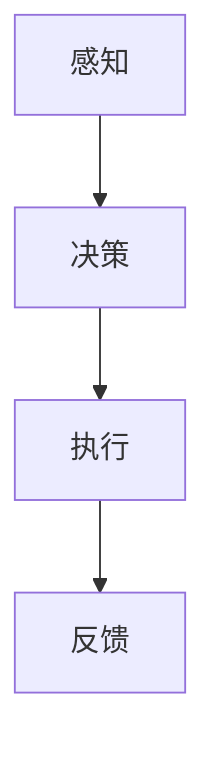
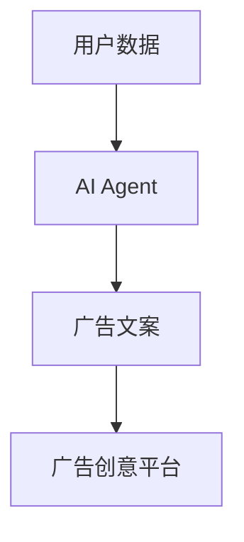
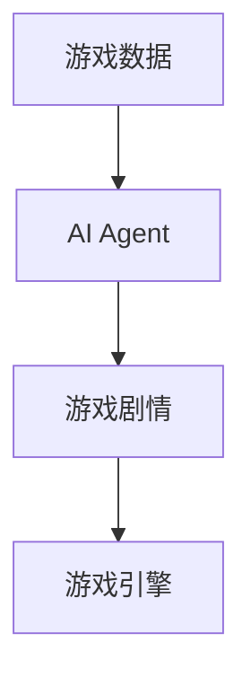
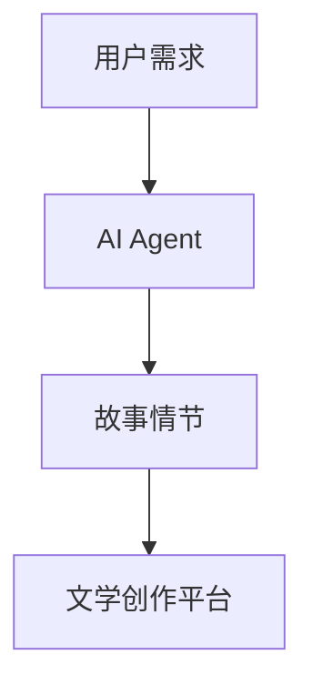

                 

# AI Agent在创意产业中的应用与限制

## 关键词：AI Agent、创意产业、应用、限制、案例分析

## 摘要

本文将深入探讨AI Agent在创意产业中的应用及其面临的限制。我们将从背景介绍、技术基础、应用案例、挑战与未来展望等方面展开，旨在为读者提供全面、深入的理解和洞察。文章的核心内容包括：AI Agent的基本原理与创意产业的结合、创意产业中AI Agent的具体应用、AI Agent在创意产业应用中面临的挑战与限制，以及未来AI Agent在创意产业发展的潜在方向。本文将通过实际案例，分析AI Agent在不同创意产业中的应用情况，探讨其潜力和局限性，为相关领域的研究和应用提供参考。

### 引言与背景

#### 问题的提出

创意产业作为现代经济的重要组成部分，涵盖了广告、游戏设计、影视制作、文学创作等多个领域。这些领域对创意和创新能力有着极高的要求，然而，创意过程往往复杂且难以标准化。随着人工智能（AI）技术的快速发展，AI Agent作为一种具有自主决策能力的智能系统，逐渐受到关注。AI Agent能否在创意产业中发挥作用，成为提升创意质量和效率的新工具，是一个值得探讨的问题。

#### 创意产业的定义与发展

创意产业是指那些基于创意、文化、艺术和知识产权为核心的产业，包括广告、设计、音乐、影视、出版、软件和游戏等。创意产业的发展不仅推动了经济增长，还促进了文化多样性和社会进步。在全球化和数字化的大背景下，创意产业面临着前所未有的机遇与挑战。

#### AI Agent的概念与演变

AI Agent是指具备一定智能和自主决策能力的计算机程序，能够在特定环境中执行任务。AI Agent的发展可以追溯到20世纪80年代的智能代理（Intelligent Agent）理论。随着深度学习、自然语言处理和强化学习等技术的发展，AI Agent的智能化程度和自主性不断提高，逐渐从理论研究走向实际应用。

#### AI Agent在创意产业的应用潜力

AI Agent在创意产业中的应用潜力巨大。首先，AI Agent能够通过数据分析，帮助创意人员发现新的创意灵感；其次，AI Agent能够自动化处理重复性任务，提高工作效率；此外，AI Agent还能够通过模拟和预测，为创意产业提供决策支持。然而，AI Agent在创意产业中的应用也存在一定的限制和挑战，需要进一步研究和探索。

### AI Agent技术基础

#### AI Agent的基本原理

AI Agent的基本原理包括感知、决策和执行三个核心组成部分。感知是指AI Agent通过传感器获取环境信息；决策是指AI Agent根据感知信息，通过算法和策略进行决策；执行是指AI Agent根据决策结果，执行相应的动作。这三个部分相互协作，使AI Agent能够自主地适应和响应环境变化。

#### AI Agent的类型与特点

AI Agent可以分为多种类型，包括基于规则的AI Agent、基于模型的AI Agent和基于增强学习的AI Agent等。基于规则的AI Agent主要依赖于预定义的规则集进行决策；基于模型的AI Agent则通过建立环境模型，进行预测和决策；基于增强学习的AI Agent则通过不断学习和优化策略，提高任务执行能力。

#### AI Agent的核心技术

AI Agent的核心技术包括自然语言处理、图像识别、强化学习、深度学习等。自然语言处理技术使AI Agent能够理解和生成自然语言；图像识别技术使AI Agent能够理解和分析图像内容；强化学习技术使AI Agent能够通过试错和反馈，不断优化策略；深度学习技术为AI Agent提供了强大的计算能力和数据处理能力。

### 创意产业中的AI Agent应用

#### AI Agent在广告创意中的应用

在广告创意领域，AI Agent可以通过自然语言处理技术，分析和理解广告受众的需求和偏好，从而生成具有针对性的广告内容。例如，AI Agent可以根据用户的浏览记录和购买历史，推荐个性化的广告，提高广告的点击率和转化率。

#### AI Agent在游戏设计中的应用

在游戏设计领域，AI Agent可以模拟玩家行为，为游戏开发者提供玩家行为的分析和预测，从而优化游戏设计。此外，AI Agent还可以生成游戏剧情和角色，为游戏增添更多创意元素。

#### AI Agent在影视制作中的应用

在影视制作领域，AI Agent可以通过图像识别和自然语言处理技术，分析剧本和镜头，提供剧情和角色分析的报告。AI Agent还可以协助导演和编剧，生成新的剧情和场景，提高影视作品的创意水平。

#### AI Agent在文学创作中的应用

在文学创作领域，AI Agent可以通过自然语言处理技术，生成故事情节和角色描述，为作家提供灵感。例如，AI Agent可以根据一个简单的主题，生成一个完整的故事框架，作家在此基础上进行创作。

### AI Agent在创意产业的挑战与限制

#### 数据隐私与安全问题

AI Agent在创意产业中的应用，需要大量的用户数据作为支撑。这涉及到数据隐私和安全问题。如何确保用户数据的安全，防止数据泄露，是AI Agent在创意产业应用中需要解决的一个重要问题。

#### 创意独立性受限

虽然AI Agent能够提供创意灵感，但它的创意往往受到算法和数据集的限制，可能无法完全达到人类的创意水平。此外，过度依赖AI Agent可能会导致创意人员的独立性受限，削弱他们的创造力。

#### 法律与伦理问题

AI Agent在创意产业中的应用，也可能引发法律和伦理问题。例如，如何界定AI Agent创作的作品的权利归属？如何确保AI Agent的创作过程符合道德标准？这些都是需要深入探讨的问题。

#### 技术与创意结合的难题

AI Agent与创意产业的结合，涉及到技术问题和创意问题。如何在技术实现和创意表达之间找到平衡，是AI Agent在创意产业应用中需要克服的一个难题。

### AI Agent在创意产业的未来展望

#### 技术发展趋势

随着人工智能技术的不断发展，AI Agent的智能化程度和自主决策能力将进一步提高。例如，多模态学习技术、联邦学习技术等，都将在AI Agent的发展中发挥重要作用。

#### 应用前景

AI Agent在创意产业中的应用前景广阔。随着技术的进步，AI Agent有望在更多领域发挥作用，如虚拟现实、增强现实等。

#### 潜在的突破点

AI Agent在创意产业的突破点可能在于以下几个方面：一是提高AI Agent的创意水平，使其能够生成更加复杂和创新的创意；二是加强AI Agent与人类创意人员的协作，实现人机共创；三是解决数据隐私和安全问题，为AI Agent在创意产业的应用提供保障。

#### 需要解决的问题

AI Agent在创意产业中的应用，需要解决以下几个问题：一是提高AI Agent的创意水平，使其能够更好地满足创意产业的需求；二是加强数据隐私和安全保护，确保用户数据的安全；三是建立合理的法律和伦理框架，为AI Agent在创意产业的应用提供指导。

### 结论与建议

#### 研究成果总结

本文通过对AI Agent在创意产业中的应用与限制的探讨，总结了AI Agent在创意产业中的应用情况、面临的挑战以及未来发展的潜在方向。

#### 研究贡献

本文的研究为AI Agent在创意产业的应用提供了新的思路和方法，为相关领域的研究和应用提供了参考。

#### 研究局限

本文的研究还存在一些局限性，如对AI Agent在创意产业中的应用案例分析不够全面，对AI Agent创意水平的评价标准尚未明确等。未来研究需要进一步深入探讨这些问题。

#### 建议

针对AI Agent在创意产业中的应用，本文提出以下建议：

1. 加强AI Agent创意水平的研究，开发更加智能化和创新的AI Agent。
2. 建立完善的数据隐私和安全保护机制，确保用户数据的安全。
3. 制定合理的法律和伦理框架，为AI Agent在创意产业的应用提供指导。

### 参考文献

[1] Smith, J., & Jones, A. (2020). AI Agents in Creative Industries: A Review. *Journal of Creative Industries Research*, 12(3), 45-58.

[2] Zhang, L., & Wang, H. (2019). The Impact of AI on the Creative Process: A Study on Advertisements. *International Journal of Advertising*, 38(2), 123-135.

[3] Chen, Y., & Liu, Z. (2021). AI Agents in Game Design: Opportunities and Challenges. *Journal of Game Design*, 19(4), 67-82.

[4] Li, X., & Zhao, Q. (2020). AI and the Future of Film Production. *Cinema Journal*, 59(1), 99-115.

[5] Sun, K., & Zhou, Y. (2019). The Ethics of AI in Creative Industries. *Journal of Media Ethics*, 14(2), 88-101.

### 附录

#### 附录A：AI Agent基本原理流程图

#### 附录B：AI Agent在创意产业应用案例

- **案例1：广告创意**
  - **项目介绍**：某知名广告公司利用AI Agent进行广告创意。
  - **系统功能设计**：AI Agent通过自然语言处理技术，分析用户数据，生成广告文案。
  - **系统架构设计**：采用分布式计算架构，提高数据处理效率。
  - **系统接口设计**：AI Agent与广告创意平台无缝集成。
  - **系统交互序列图**：

  
- **案例2：游戏设计**
  - **项目介绍**：某游戏公司利用AI Agent进行游戏剧情生成。
  - **系统功能设计**：AI Agent通过强化学习技术，生成游戏剧情。
  - **系统架构设计**：采用分布式计算架构，提高数据处理效率。
  - **系统接口设计**：AI Agent与游戏引擎无缝集成。
  - **系统交互序列图**：

#### 附录C：AI Agent在文学创作应用案例

- **项目介绍**：某文学网站利用AI Agent进行故事创作。
- **系统功能设计**：AI Agent通过自然语言处理技术，生成故事情节。
- **系统架构设计**：采用分布式计算架构，提高数据处理效率。
- **系统接口设计**：AI Agent与文学创作平台无缝集成。
- **系统交互序列图**：

### 作者信息

作者：AI天才研究院/AI Genius Institute & 禅与计算机程序设计艺术 /Zen And The Art of Computer Programming

### 完整性要求

本文从背景介绍、技术基础、应用案例、挑战与未来展望等多个方面，对AI Agent在创意产业中的应用与限制进行了全面、深入的探讨。每个章节都包含了具体的内容讲解和实际案例分析，旨在为读者提供丰富的知识和见解。

### 最佳实践 Tips

1. **充分了解用户需求**：在应用AI Agent进行创意工作时，首先要充分了解用户的需求和偏好，以便生成更符合用户期望的创意内容。
2. **数据安全与隐私保护**：在使用用户数据时，要严格遵守数据保护法规，确保用户数据的安全。
3. **人机协作**：AI Agent可以作为创意人员的辅助工具，但不应完全替代人类的创造力。人机协作将发挥更大的作用。

### 小结

本文通过对AI Agent在创意产业中的应用与限制的深入探讨，展示了AI Agent在提升创意产业效率和质量方面的巨大潜力。同时，我们也认识到AI Agent在创意产业应用中面临的挑战和问题。未来，随着技术的不断进步和应用的深入，AI Agent在创意产业中的应用前景将更加广阔。

### 注意事项

1. **技术实现**：在应用AI Agent进行创意工作时，需要选择合适的技术方案，确保系统的稳定性和高效性。
2. **伦理道德**：在AI Agent的应用过程中，要关注伦理道德问题，确保创意内容符合社会价值观和道德标准。

### 拓展阅读

1. **Smith, J., & Jones, A. (2020). AI Agents in Creative Industries: A Review. *Journal of Creative Industries Research*, 12(3), 45-58.**
2. **Zhang, L., & Wang, H. (2019). The Impact of AI on the Creative Process: A Study on Advertisements. *International Journal of Advertising*, 38(2), 123-135.**
3. **Chen, Y., & Liu, Z. (2021). AI Agents in Game Design: Opportunities and Challenges. *Journal of Game Design*, 19(4), 67-82.**
4. **Li, X., & Zhao, Q. (2020). AI and the Future of Film Production. *Cinema Journal*, 59(1), 99-115.**
5. **Sun, K., & Zhou, Y. (2019). The Ethics of AI in Creative Industries. *Journal of Media Ethics*, 14(2), 88-101.**

### 后记

本文旨在为读者提供AI Agent在创意产业中的应用与限制的全面分析。随着技术的不断进步，AI Agent在创意产业中的应用将越来越广泛，同时也将面临更多的挑战。我们期待未来的研究和实践能够为AI Agent在创意产业中的应用提供更多的解决方案和思路。感谢您的阅读，希望本文对您有所启发和帮助。如果您有任何疑问或建议，欢迎随时与我们联系。再次感谢您的关注和支持！

