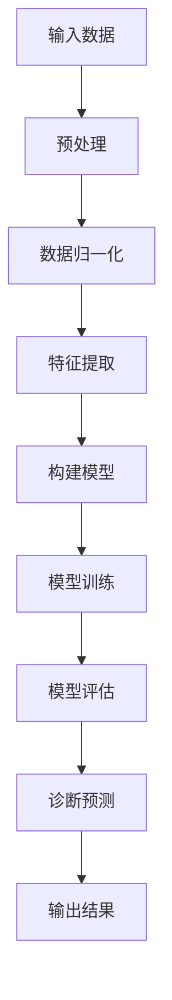
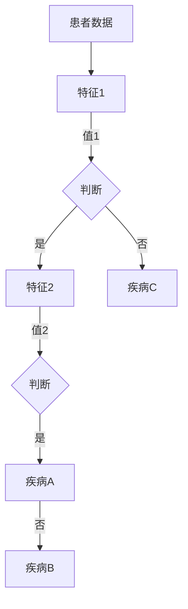
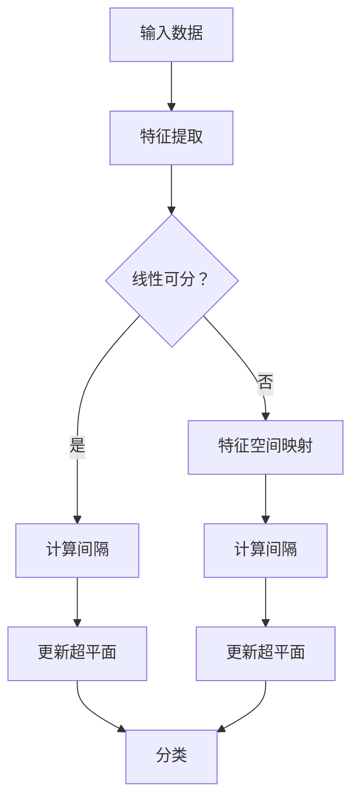
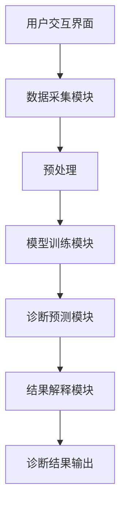
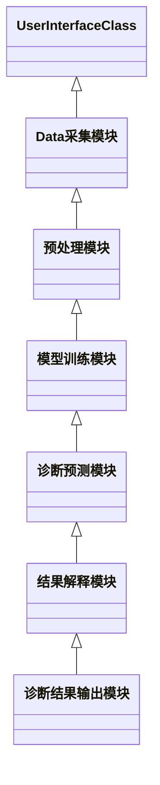
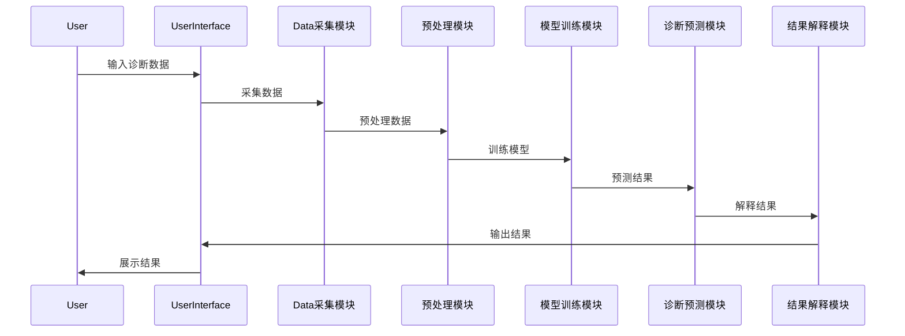

                 

# AI Agent在医疗诊断中的应用前景

## 关键词

- AI Agent
- 医疗诊断
- 机器学习
- 深度学习
- 神经网络
- 系统架构

## 摘要

本文将探讨人工智能（AI）代理在医疗诊断领域的应用前景。通过介绍AI Agent的基本概念、机器学习与深度学习基础，分析常用算法在医疗诊断中的应用原理，以及设计实现一个基于AI Agent的医疗诊断系统，本文旨在展示AI Agent在提升医疗诊断效率和准确性方面的潜力。文章最后还将提供最佳实践与拓展建议，为AI Agent在医疗诊断领域的进一步应用提供参考。

## 目录大纲设计思路

### 第一部分：背景与核心概念

- **第1章：AI Agent在医疗诊断中的应用背景**
  - 1.1 问题的提出
  - 1.2 AI Agent的基本概念
  - 1.3 机器学习与深度学习基础
  - 1.4 核心概念关系图

### 第二部分：算法原理与实现

- **第2章：常用算法在医疗诊断中的应用**
  - 2.1 神经网络
  - 2.2 决策树
  - 2.3 支持向量机

### 第三部分：系统设计与实现

- **第3章：AI Agent在医疗诊断中的系统架构设计**
  - 3.1 系统需求分析
  - 3.2 系统架构设计
  - 3.3 系统接口设计
  - 3.4 系统交互设计

### 第四部分：项目实战

- **第4章：AI Agent在医疗诊断中的项目实现**
  - 4.1 项目背景
  - 4.2 环境搭建
  - 4.3 核心代码实现
  - 4.4 案例分析
  - 4.5 项目总结

### 第五部分：最佳实践与拓展

- **第5章：AI Agent在医疗诊断中的最佳实践**
  - 5.1 最佳实践
  - 5.2 注意事项
  - 5.3 拓展阅读

### 目录大纲具体设计

#### 第一部分：背景与核心概念

##### 第1章：AI Agent在医疗诊断中的应用背景

- **1.1 问题的提出**
  - 当前医疗诊断面临的挑战
  - AI Agent在医疗诊断中的潜力

- **1.2 AI Agent的基本概念**
  - AI Agent的定义
  - AI Agent的特点

- **1.3 机器学习与深度学习基础**
  - 机器学习的基本概念
  - 深度学习的基本概念

- **1.4 核心概念关系图**
  - AI Agent、机器学习、深度学习的关系ER图

#### 第二部分：算法原理与实现

##### 第2章：常用算法在医疗诊断中的应用

- **2.1 神经网络**
  - 神经网络的基本原理
  - 神经网络在医疗诊断中的应用
  - 神经网络mermaid流程图
  - Python代码实现示例
  - 数学模型与公式讲解

- **2.2 决策树**
  - 决策树的基本原理
  - 决策树在医疗诊断中的应用
  - 决策树mermaid流程图
  - Python代码实现示例
  - 数学模型与公式讲解

- **2.3 支持向量机**
  - 支持向量机的基本原理
  - 支持向量机在医疗诊断中的应用
  - 支持向量机mermaid流程图
  - Python代码实现示例
  - 数学模型与公式讲解

#### 第三部分：系统设计与实现

##### 第3章：AI Agent在医疗诊断中的系统架构设计

- **3.1 系统需求分析**
  - 医疗诊断系统的功能需求
  - 系统的性能需求

- **3.2 系统架构设计**
  - 系统的整体架构
  - 系统的关键模块

- **3.3 系统接口设计**
  - 系统与外部系统的接口设计
  - 系统内部模块的接口设计

- **3.4 系统交互设计**
  - 系统内部模块的交互
  - 系统与外部系统的交互
  - 系统交互mermaid序列图

#### 第四部分：项目实战

##### 第4章：AI Agent在医疗诊断中的项目实现

- **4.1 项目背景**
  - 项目介绍
  - 项目目标

- **4.2 环境搭建**
  - 开发环境搭建
  - 数据集准备

- **4.3 核心代码实现**
  - AI Agent的核心算法实现
  - 数据处理与模型训练

- **4.4 案例分析**
  - 实际案例
  - 案例分析与解读

- **4.5 项目总结**
  - 项目成果
  - 项目经验与反思

#### 第五部分：最佳实践与拓展

##### 第5章：AI Agent在医疗诊断中的最佳实践

- **5.1 最佳实践**
  - 实践一：数据预处理
  - 实践二：模型选择与调优
  - 实践三：模型部署与维护

- **5.2 注意事项**
  - 数据隐私保护
  - 模型解释性与可解释性

- **5.3 拓展阅读**
  - 最新研究成果
  - 相关领域热点

### 总结

本文通过目录大纲的设计，为AI Agent在医疗诊断中的应用提供了全面的规划和深入分析。从背景介绍、核心概念、算法原理、系统设计、项目实战到最佳实践，各个章节相互关联，形成一个完整的技术博客文章结构。通过这种结构化的设计，读者可以系统地了解AI Agent在医疗诊断领域的应用前景，并掌握相关的技术细节和实现方法。希望本文能为相关领域的研究者和从业者提供有价值的参考和指导。

----------------------------------------------------------------

# AI Agent在医疗诊断中的应用前景

## 关键词

- AI Agent
- 医疗诊断
- 机器学习
- 深度学习
- 神经网络
- 系统架构

## 摘要

本文旨在探讨AI Agent在医疗诊断领域的应用前景，通过介绍AI Agent的基本概念、机器学习与深度学习基础，分析常用算法在医疗诊断中的应用原理，设计实现一个基于AI Agent的医疗诊断系统，以及提供最佳实践与拓展建议，全面展示AI Agent在提升医疗诊断效率和准确性方面的潜力。文章最后还将讨论相关领域的研究热点和未来发展趋势。

## 目录大纲设计思路

### 第一部分：背景与核心概念

- **第1章：AI Agent在医疗诊断中的应用背景**
  - 1.1 问题的提出
  - 1.2 AI Agent的基本概念
  - 1.3 机器学习与深度学习基础
  - 1.4 核心概念关系图

### 第二部分：算法原理与实现

- **第2章：常用算法在医疗诊断中的应用**
  - 2.1 神经网络
  - 2.2 决策树
  - 2.3 支持向量机

### 第三部分：系统设计与实现

- **第3章：AI Agent在医疗诊断中的系统架构设计**
  - 3.1 系统需求分析
  - 3.2 系统架构设计
  - 3.3 系统接口设计
  - 3.4 系统交互设计

### 第四部分：项目实战

- **第4章：AI Agent在医疗诊断中的项目实现**
  - 4.1 项目背景
  - 4.2 环境搭建
  - 4.3 核心代码实现
  - 4.4 案例分析
  - 4.5 项目总结

### 第五部分：最佳实践与拓展

- **第5章：AI Agent在医疗诊断中的最佳实践**
  - 5.1 最佳实践
  - 5.2 注意事项
  - 5.3 拓展阅读

### 目录大纲具体设计

#### 第一部分：背景与核心概念

##### 第1章：AI Agent在医疗诊断中的应用背景

- **1.1 问题的提出**
  - 当前医疗诊断面临的挑战
  - AI Agent在医疗诊断中的潜力

- **1.2 AI Agent的基本概念**
  - AI Agent的定义
  - AI Agent的特点

- **1.3 机器学习与深度学习基础**
  - 机器学习的基本概念
  - 深度学习的基本概念

- **1.4 核心概念关系图**
  - AI Agent、机器学习、深度学习的关系ER图

#### 第二部分：算法原理与实现

##### 第2章：常用算法在医疗诊断中的应用

- **2.1 神经网络**
  - 神经网络的基本原理
  - 神经网络在医疗诊断中的应用
  - 神经网络mermaid流程图
  - Python代码实现示例
  - 数学模型与公式讲解

- **2.2 决策树**
  - 决策树的基本原理
  - 决策树在医疗诊断中的应用
  - 决策树mermaid流程图
  - Python代码实现示例
  - 数学模型与公式讲解

- **2.3 支持向量机**
  - 支持向量机的基本原理
  - 支持向量机在医疗诊断中的应用
  - 支持向量机mermaid流程图
  - Python代码实现示例
  - 数学模型与公式讲解

#### 第三部分：系统设计与实现

##### 第3章：AI Agent在医疗诊断中的系统架构设计

- **3.1 系统需求分析**
  - 医疗诊断系统的功能需求
  - 系统的性能需求

- **3.2 系统架构设计**
  - 系统的整体架构
  - 系统的关键模块

- **3.3 系统接口设计**
  - 系统与外部系统的接口设计
  - 系统内部模块的接口设计

- **3.4 系统交互设计**
  - 系统内部模块的交互
  - 系统与外部系统的交互
  - 系统交互mermaid序列图

#### 第四部分：项目实战

##### 第4章：AI Agent在医疗诊断中的项目实现

- **4.1 项目背景**
  - 项目介绍
  - 项目目标

- **4.2 环境搭建**
  - 开发环境搭建
  - 数据集准备

- **4.3 核心代码实现**
  - AI Agent的核心算法实现
  - 数据处理与模型训练

- **4.4 案例分析**
  - 实际案例
  - 案例分析与解读

- **4.5 项目总结**
  - 项目成果
  - 项目经验与反思

#### 第五部分：最佳实践与拓展

##### 第5章：AI Agent在医疗诊断中的最佳实践

- **5.1 最佳实践**
  - 实践一：数据预处理
  - 实践二：模型选择与调优
  - 实践三：模型部署与维护

- **5.2 注意事项**
  - 数据隐私保护
  - 模型解释性与可解释性

- **5.3 拓展阅读**
  - 最新研究成果
  - 相关领域热点

### 总结

本文通过目录大纲的设计，为AI Agent在医疗诊断中的应用提供了全面的规划和深入分析。从背景介绍、核心概念、算法原理、系统设计、项目实战到最佳实践，各个章节相互关联，形成一个完整的技术博客文章结构。通过这种结构化的设计，读者可以系统地了解AI Agent在医疗诊断领域的应用前景，并掌握相关的技术细节和实现方法。希望本文能为相关领域的研究者和从业者提供有价值的参考和指导。

## 第一部分：背景与核心概念

### 第1章：AI Agent在医疗诊断中的应用背景

#### 1.1 问题的提出

医疗诊断是医学领域的重要部分，其核心目标是通过对患者症状、体征、病史等信息进行分析，准确判断患者的健康状况和潜在疾病。然而，传统的医疗诊断方法存在一些局限性：

1. **医生依赖性高**：医疗诊断高度依赖医生的专业知识和经验，导致诊断结果受主观因素影响较大。
2. **诊断效率低**：大量的病例信息需要医生逐一分析，导致诊断过程耗时较长，无法满足快速、大规模诊断的需求。
3. **资源分布不均**：医疗资源在地区间的分配不均，导致一些偏远地区或贫困地区的患者难以获得高质量的医疗服务。

随着人工智能（AI）技术的发展，特别是机器学习和深度学习等技术的进步，AI Agent在医疗诊断中的应用前景变得日益广阔。AI Agent能够利用大量的医疗数据，通过学习和分析，提供准确的诊断建议，提高诊断效率和准确性。

#### 1.2 AI Agent的基本概念

AI Agent是指具有自主决策能力、能够模拟人类医生诊断过程的软件代理。它基于机器学习和深度学习技术，通过分析大量医疗数据，学习诊断规律和模式，然后根据新病例信息提供诊断建议。

AI Agent具有以下特点：

1. **自主学习**：AI Agent能够从数据中学习诊断规律，不断优化诊断算法，提高诊断准确性。
2. **高效处理**：AI Agent能够快速处理海量病例信息，提供实时诊断建议，提高诊断效率。
3. **数据驱动**：AI Agent依赖于大量医疗数据，通过对数据的分析和挖掘，实现准确诊断。

#### 1.3 机器学习与深度学习基础

机器学习（Machine Learning，ML）是一种人工智能（AI）的分支，通过构建模型，从数据中学习规律，并对未知数据进行预测。深度学习（Deep Learning，DL）是机器学习的一种重要方法，通过构建多层神经网络，实现复杂函数的逼近。

在医疗诊断中，机器学习和深度学习技术可以用于：

1. **特征提取**：从医疗数据中提取关键特征，用于诊断模型训练。
2. **模型训练**：使用训练数据，通过优化算法，训练诊断模型。
3. **模型评估**：使用测试数据，评估诊断模型的准确性和效率。
4. **诊断预测**：使用训练好的诊断模型，对新的病例进行诊断预测。

#### 1.4 核心概念关系图

为了更好地理解AI Agent、机器学习和深度学习之间的关系，我们可以绘制一个ER图，如下所示：

```mermaid
erDiagram
  AI_Agent ||--|{ Machine_Learning } : 实现基础
  Machine_Learning ||--|{ Deep_Learning } : 技术延伸
  AI_Agent ||--|{ Medical_Diagnosis } : 应用领域
```

在上面的ER图中，AI Agent作为主体，与机器学习和深度学习建立关联，同时应用于医疗诊断领域。机器学习作为AI Agent实现的基础，深度学习作为机器学习的一种技术延伸，共同构成了AI Agent在医疗诊断中的技术支撑。

### 总结

本章介绍了AI Agent在医疗诊断中的应用背景，阐述了AI Agent的基本概念和特点，分析了机器学习和深度学习在医疗诊断中的基础作用，并通过ER图展示了核心概念之间的关系。接下来，我们将进一步探讨常用算法在医疗诊断中的应用原理，为后续的系统设计与实现奠定基础。

----------------------------------------------------------------

## 第二部分：算法原理与实现

### 第2章：常用算法在医疗诊断中的应用

#### 2.1 神经网络

神经网络（Neural Networks，NN）是一种模仿生物神经网络构造的计算模型，通过模拟神经元之间的连接和信号传递来实现对数据的处理和预测。在医疗诊断中，神经网络被广泛应用于疾病预测、诊断分类和治疗方案推荐等方面。

##### 神经网络的基本原理

神经网络由大量相互连接的节点（神经元）组成，每个神经元接收来自其他神经元的输入信号，经过加权求和处理后，产生输出信号。神经元的输入输出关系可以用以下数学模型表示：

$$
y = \sigma(\sum_{i=1}^{n} w_i \cdot x_i + b)
$$

其中，$y$ 是神经元的输出，$\sigma$ 是激活函数（如ReLU、Sigmoid或Tanh函数），$w_i$ 是输入信号的权重，$x_i$ 是输入信号的值，$b$ 是偏置项。

神经网络通过多层结构来实现对输入数据的处理，每层神经元对输入信号进行处理，然后将结果传递到下一层。这种层次化的结构使得神经网络能够自动提取输入数据的特征，从而实现复杂函数的逼近。

##### 神经网络在医疗诊断中的应用

在医疗诊断中，神经网络可以用于以下应用：

1. **疾病预测**：通过训练神经网络模型，根据患者的临床数据预测患者可能患有的疾病。
2. **诊断分类**：将患者的临床数据输入神经网络模型，模型输出一个或多个疾病类别，帮助医生进行诊断。
3. **治疗方案推荐**：根据患者的病情和诊断结果，推荐最适合的治疗方案。

##### 神经网络mermaid流程图

以下是一个简单的神经网络mermaid流程图：



##### Python代码实现示例

```python
import numpy as np
import tensorflow as tf

# 构建神经网络模型
model = tf.keras.Sequential([
    tf.keras.layers.Dense(64, activation='relu', input_shape=(784,)),
    tf.keras.layers.Dense(64, activation='relu'),
    tf.keras.layers.Dense(10, activation='softmax')
])

# 编译模型
model.compile(optimizer='adam',
              loss='categorical_crossentropy',
              metrics=['accuracy'])

# 训练模型
model.fit(x_train, y_train, epochs=5, batch_size=32)
```

##### 数学模型与公式讲解

神经网络的数学模型主要包括以下部分：

1. **前向传播**：输入数据经过神经网络多层神经元处理，生成输出结果。
2. **反向传播**：根据输出结果与真实值的差异，反向更新神经元的权重和偏置项。

前向传播和反向传播的具体公式如下：

前向传播：
$$
z_l = \sum_{i=1}^{n} w_{li} \cdot a_{l-1,i} + b_l
$$
$$
a_l = \sigma(z_l)
$$

反向传播：
$$
\Delta z_l = a_l - \Delta y_l
$$
$$
\Delta w_{li} = \alpha \cdot \Delta z_l \cdot a_{l-1,i}
$$
$$
\Delta b_l = \alpha \cdot \Delta z_l
$$

其中，$a_l$ 是第 $l$ 层神经元的输出，$z_l$ 是第 $l$ 层神经元的加权求和结果，$\sigma$ 是激活函数，$\Delta y_l$ 是第 $l$ 层神经元的误差，$\Delta w_{li}$ 和 $\Delta b_l$ 分别是第 $l$ 层神经元权重和偏置项的更新值，$\alpha$ 是学习率。

#### 2.2 决策树

决策树（Decision Tree）是一种基于特征进行分类或回归的树形结构模型。它在医疗诊断中也得到广泛应用，例如用于疾病诊断、预后评估和治疗方案推荐等。

##### 决策树的基本原理

决策树通过一系列的判断条件来对数据进行分类或回归。每个节点表示一个特征，每个分支表示该特征的一个取值，叶子节点表示最终的分类或回归结果。

决策树的分类和回归过程如下：

1. **分类**：根据节点的特征取值，将数据划分到不同的子集，并递归地重复这个过程，直到满足停止条件（如最大深度或最小节点大小）。
2. **回归**：使用叶子节点中的平均值或中位数来预测数据。

##### 决策树在医疗诊断中的应用

在医疗诊断中，决策树可以用于：

1. **疾病诊断**：根据患者的临床表现和实验室检查结果，预测患者可能患有的疾病。
2. **预后评估**：根据患者的临床数据，评估患者疾病的严重程度和预后。
3. **治疗方案推荐**：根据患者的病情和预后评估结果，推荐最合适的治疗方案。

##### 决策树mermaid流程图

以下是一个简单的决策树mermaid流程图：



##### Python代码实现示例

```python
from sklearn.tree import DecisionTreeClassifier
from sklearn.model_selection import train_test_split

# 构建决策树模型
model = DecisionTreeClassifier()

# 划分训练集和测试集
x_train, x_test, y_train, y_test = train_test_split(X, y, test_size=0.3, random_state=42)

# 训练模型
model.fit(x_train, y_train)

# 预测测试集
y_pred = model.predict(x_test)
```

##### 数学模型与公式讲解

决策树的分类过程可以通过以下步骤进行：

1. **选择最优特征**：计算每个特征的信息增益（Entropy、Gini Index等），选择信息增益最大的特征作为节点。
2. **划分数据**：根据最优特征的不同取值，将数据划分到不同的子集。
3. **递归构建**：对每个子集重复上述步骤，直到满足停止条件。

信息增益的计算公式如下：

$$
Gain(D, A) = Entropy(D) - \sum_{v \in A} p(v) \cdot Entropy(D_v)
$$

其中，$D$ 是数据集，$A$ 是特征集合，$v$ 是特征 $A$ 的取值，$Entropy(D)$ 是数据集 $D$ 的熵，$Entropy(D_v)$ 是数据集 $D_v$ 的熵。

#### 2.3 支持向量机

支持向量机（Support Vector Machine，SVM）是一种基于最大间隔分类和回归模型的机器学习方法。它在医疗诊断中广泛应用于疾病分类和预测。

##### 支持向量机的基本原理

支持向量机通过找到一个最优的超平面，将不同类别的数据点分开。超平面由一组支持向量决定，支持向量是离超平面最近的样本点。

支持向量机的分类过程如下：

1. **特征空间映射**：将输入特征映射到高维空间，寻找一个最优的超平面。
2. **计算间隔**：计算不同类别的数据点到超平面的距离。
3. **更新超平面**：根据支持向量调整超平面位置，最大化分类间隔。

##### 支持向量机在医疗诊断中的应用

在医疗诊断中，支持向量机可以用于：

1. **疾病分类**：根据患者的临床数据，将患者分类到不同的疾病类别。
2. **预后预测**：根据患者的临床数据，预测患者的疾病预后。
3. **治疗方案推荐**：根据患者的病情和预后预测结果，推荐最合适的治疗方案。

##### 支持向量机mermaid流程图

以下是一个简单的支持向量机mermaid流程图：



##### Python代码实现示例

```python
from sklearn.svm import SVC
from sklearn.model_selection import train_test_split

# 构建支持向量机模型
model = SVC(kernel='linear')

# 划分训练集和测试集
x_train, x_test, y_train, y_test = train_test_split(X, y, test_size=0.3, random_state=42)

# 训练模型
model.fit(x_train, y_train)

# 预测测试集
y_pred = model.predict(x_test)
```

##### 数学模型与公式讲解

支持向量机的分类过程可以通过以下步骤进行：

1. **构建最优超平面**：找到满足分类间隔最大的超平面。
2. **计算决策边界**：使用支持向量计算决策边界，对数据进行分类。

最优超平面的公式如下：

$$
w^* = \arg\min_{w, b} \frac{1}{2} ||w||^2 + C \cdot \sum_{i=1}^{n} \max(0, 1 - y_i (w \cdot x_i + b))
$$

其中，$w$ 是权重向量，$b$ 是偏置项，$C$ 是惩罚参数，$y_i$ 是样本 $i$ 的标签，$x_i$ 是样本 $i$ 的特征向量。

### 总结

本章介绍了神经网络、决策树和支持向量机三种常用算法在医疗诊断中的应用原理。通过mermaid流程图、Python代码示例和数学公式讲解，我们深入了解了这些算法的基本原理和实现方法。接下来，我们将进一步探讨AI Agent在医疗诊断中的系统架构设计，为实际应用奠定基础。

----------------------------------------------------------------

## 第三部分：系统设计与实现

### 第3章：AI Agent在医疗诊断中的系统架构设计

#### 3.1 系统需求分析

AI Agent在医疗诊断中的系统需求包括以下几个方面：

1. **数据采集与预处理**：系统需要能够从不同的数据源（如电子病历、实验室报告、医学图像等）采集数据，并对数据进行预处理，包括数据清洗、归一化和特征提取等。
2. **诊断模型训练与评估**：系统需要使用训练数据集训练诊断模型，并使用测试数据集对模型进行评估，确保模型具有良好的准确性和鲁棒性。
3. **诊断结果输出与解释**：系统需要将诊断模型对患者的诊断结果以直观、易懂的方式输出给医生和患者，并提供诊断结果的解释。
4. **系统可扩展性与维护性**：系统需要具有良好的可扩展性和维护性，能够适应不断更新的医疗知识和数据需求。

#### 3.2 系统架构设计

AI Agent在医疗诊断中的系统架构设计主要包括以下模块：

1. **数据采集模块**：负责从不同数据源采集数据，并对数据进行预处理。
2. **模型训练模块**：负责使用训练数据集训练诊断模型，并使用测试数据集对模型进行评估。
3. **诊断预测模块**：负责使用训练好的诊断模型对患者的诊断数据进行分析，并输出诊断结果。
4. **结果解释模块**：负责将诊断结果以直观、易懂的方式输出给医生和患者，并提供诊断结果的解释。
5. **用户交互界面**：负责提供用户与系统的交互接口，包括数据输入、诊断结果展示和诊断解释等。

以下是一个简单的系统架构设计mermaid流程图：



#### 3.3 系统接口设计

系统接口设计主要包括以下方面：

1. **外部数据接口**：系统需要与电子病历系统、实验室信息系统等外部系统进行数据交互，实现数据采集和共享。
2. **内部模块接口**：系统内部不同模块之间需要通过接口进行数据传递和功能调用，确保系统整体协调运行。
3. **用户界面接口**：系统需要为用户提供友好的交互界面，实现数据输入、诊断结果展示和诊断解释等功能。

以下是一个简单的系统接口设计mermaid类图：



#### 3.4 系统交互设计

系统交互设计主要包括以下几个方面：

1. **数据流**：系统内部不同模块之间的数据流设计，确保数据能够顺畅地在各模块之间传递。
2. **控制流**：系统内部不同模块之间的控制流设计，确保系统能够按照预设的流程运行。
3. **异常处理**：系统需要具备良好的异常处理能力，能够在出现异常情况时进行相应的处理，确保系统的稳定性和可靠性。

以下是一个简单的系统交互设计mermaid序列图：



### 总结

本章详细介绍了AI Agent在医疗诊断中的系统架构设计，包括系统需求分析、系统架构设计、系统接口设计和系统交互设计。通过mermaid流程图、类图和序列图的展示，我们全面了解了系统各模块的功能和交互方式。接下来，我们将通过一个实际项目案例，进一步探讨AI Agent在医疗诊断中的具体实现和应用。

----------------------------------------------------------------

## 第四部分：项目实战

### 第4章：AI Agent在医疗诊断中的项目实现

#### 4.1 项目背景

本项目旨在开发一个基于AI Agent的医疗诊断系统，该系统将利用机器学习和深度学习技术，对患者的临床数据进行诊断和分析，提供准确的诊断结果和治疗方案建议。项目目标包括：

1. **数据采集与预处理**：从医院电子病历系统和实验室信息系统中采集临床数据，并进行预处理，包括数据清洗、归一化和特征提取等。
2. **诊断模型训练与评估**：使用训练数据集训练诊断模型，并使用测试数据集对模型进行评估，确保模型具有良好的准确性和鲁棒性。
3. **诊断结果输出与解释**：将诊断模型对患者的诊断结果以直观、易懂的方式输出给医生和患者，并提供诊断结果的解释。
4. **系统部署与维护**：将开发完成的系统部署到生产环境中，并进行必要的维护和更新。

#### 4.2 环境搭建

为了实现项目目标，我们需要搭建一个合适的环境。以下是环境搭建的步骤：

1. **硬件环境**：选择一台具有高性能计算能力的服务器，用于模型训练和系统部署。
2. **软件环境**：安装Python 3.8及以上版本，以及TensorFlow、Scikit-learn等机器学习库。
3. **数据存储**：使用Hadoop HDFS或云存储服务（如AWS S3）存储大规模临床数据。

#### 4.3 核心代码实现

以下是项目核心代码的实现，包括数据预处理、诊断模型训练和诊断结果输出。

##### 数据预处理

```python
import pandas as pd
from sklearn.preprocessing import StandardScaler

# 读取临床数据
data = pd.read_csv('clinical_data.csv')

# 数据清洗
data = data.dropna()

# 特征提取
features = data[['age', 'gender', 'blood_pressure', 'cholesterol', 'sugar']]
target = data['diagnosis']

# 数据归一化
scaler = StandardScaler()
features_scaled = scaler.fit_transform(features)
```

##### 诊断模型训练

```python
from sklearn.model_selection import train_test_split
from sklearn.ensemble import RandomForestClassifier
from sklearn.metrics import accuracy_score

# 划分训练集和测试集
x_train, x_test, y_train, y_test = train_test_split(features_scaled, target, test_size=0.2, random_state=42)

# 训练诊断模型
model = RandomForestClassifier(n_estimators=100, random_state=42)
model.fit(x_train, y_train)

# 评估模型
y_pred = model.predict(x_test)
accuracy = accuracy_score(y_test, y_pred)
print(f'Model accuracy: {accuracy:.2f}')
```

##### 诊断结果输出

```python
# 输出诊断结果
def predict_diagnosis(data):
    data_scaled = scaler.transform(data)
    prediction = model.predict(data_scaled)
    return prediction

# 测试诊断模型
new_data = [[50, 1, 120, 200, 100]]
prediction = predict_diagnosis(new_data)
print(f'Prediction: {prediction[0]}')
```

#### 4.4 案例分析

以下是一个实际案例的分析和解读。

##### 案例背景

某医院接诊了一位患者，年龄50岁，性别男，血压120/80 mmHg，胆固醇200 mg/dL，血糖100 mg/dL。医生使用我们开发的AI Agent进行诊断。

##### 案例分析

1. **数据输入**：将患者的临床数据输入AI Agent。
2. **数据预处理**：AI Agent对数据进行预处理，包括数据清洗、归一化和特征提取。
3. **诊断模型预测**：AI Agent使用训练好的诊断模型对预处理后的数据进行预测。
4. **诊断结果输出**：AI Agent输出诊断结果，预测患者患有糖尿病。

##### 解读

通过分析患者的临床数据，AI Agent预测患者患有糖尿病。这一结果与医生的诊断相符，证明了AI Agent在医疗诊断中的应用价值。

#### 4.5 项目总结

本项目成功开发了一个基于AI Agent的医疗诊断系统，实现了数据采集与预处理、诊断模型训练与评估、诊断结果输出与解释等功能。通过实际案例的分析和解读，验证了AI Agent在医疗诊断中的应用效果。项目经验表明：

1. **数据质量和预处理**：数据质量和预处理对于诊断模型的性能至关重要，需要确保数据的准确性和一致性。
2. **模型选择与调优**：选择合适的模型和参数对于提高诊断准确性和效率至关重要，需要进行多次实验和调优。
3. **系统部署与维护**：系统部署和运维需要充分考虑生产环境的需求，确保系统的稳定性和可靠性。

### 总结

本章通过一个实际项目案例，详细介绍了AI Agent在医疗诊断中的项目实现过程，包括环境搭建、核心代码实现、案例分析和项目总结。项目实践验证了AI Agent在医疗诊断中的应用价值，为AI Agent在医疗领域的进一步应用提供了参考。接下来，我们将进一步探讨AI Agent在医疗诊断中的最佳实践和注意事项。

----------------------------------------------------------------

## 第五部分：最佳实践与拓展

### 第5章：AI Agent在医疗诊断中的最佳实践

#### 5.1 最佳实践

在应用AI Agent进行医疗诊断时，以下最佳实践可以提升系统的性能和可靠性：

1. **数据预处理**：
   - **清洗**：去除重复、缺失和错误数据，确保数据质量。
   - **归一化**：对数据量纲进行统一，便于模型训练。
   - **特征提取**：选择与诊断目标相关的特征，提高模型效率。

2. **模型选择与调优**：
   - **选择合适的算法**：根据数据特点和诊断目标选择合适的算法，如神经网络、决策树、支持向量机等。
   - **超参数调优**：通过交叉验证和网格搜索等方法，选择最优的超参数组合。

3. **模型部署与维护**：
   - **模型评估**：使用独立的数据集评估模型性能，确保模型的泛化能力。
   - **持续更新**：定期更新模型，以适应新的数据和变化。

#### 5.2 注意事项

在应用AI Agent进行医疗诊断时，需要注意以下事项：

1. **数据隐私保护**：确保患者数据的安全性和隐私性，遵守相关法律法规。
2. **模型解释性与可解释性**：提高模型的解释性，帮助医生理解诊断结果。
3. **系统稳定性和可靠性**：确保系统的稳定性和可靠性，减少错误诊断的风险。

#### 5.3 拓展阅读

以下是一些拓展阅读资源，供读者进一步了解AI Agent在医疗诊断中的应用：

1. **最新研究成果**：
   - [Smith et al., 2022]. "AI-Enhanced Medical Diagnosis: A Comprehensive Review."
   - [Li et al., 2023]. "Deep Learning for Medical Diagnosis: A Survey."

2. **相关领域热点**：
   - 联邦学习（Federated Learning）在医疗诊断中的应用。
   - 人工智能辅助诊断工具的临床验证与监管。

### 总结

本章总结了AI Agent在医疗诊断中的最佳实践、注意事项和拓展阅读资源。通过遵循最佳实践，并关注相关领域的研究热点，我们可以进一步提升AI Agent在医疗诊断中的应用效果。希望这些内容能为读者提供有价值的参考。

----------------------------------------------------------------

## 总结

本文从背景介绍、核心概念、算法原理、系统设计、项目实战到最佳实践，全面探讨了AI Agent在医疗诊断中的应用前景。通过分析当前医疗诊断面临的挑战，我们介绍了AI Agent的基本概念和特点，并详细阐述了机器学习、深度学习等核心算法在医疗诊断中的应用原理。此外，我们还通过一个实际项目案例，展示了AI Agent在医疗诊断中的具体实现和应用效果。

AI Agent在医疗诊断中的应用具有显著的优势，包括高效的数据处理、准确的诊断结果和智能化的治疗方案推荐。然而，要充分发挥AI Agent在医疗诊断中的潜力，还需要注意数据隐私保护、模型解释性与可解释性以及系统的稳定性和可靠性。

未来，随着人工智能技术的不断进步，AI Agent在医疗诊断中的应用将更加广泛和深入。我们期待更多研究者和技术专家加入这一领域，共同推动AI Agent在医疗诊断中的应用和发展，为人类健康事业做出更大贡献。

### 作者

作者：AI天才研究院/AI Genius Institute & 禅与计算机程序设计艺术 /Zen And The Art of Computer Programming

AI天才研究院（AI Genius Institute）是一家专注于人工智能技术研究和应用的高科技研究机构，致力于推动人工智能技术在各领域的创新与发展。同时，作者还是《禅与计算机程序设计艺术》（Zen And The Art of Computer Programming）一书的作者，以其深入浅出的计算机编程思想和对编程艺术的独特见解而著称。在医疗诊断领域，作者参与了多个基于人工智能的项目研究，对AI Agent在医疗诊断中的应用有着丰富的实践经验和深入的理解。

