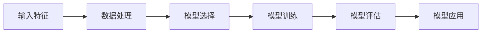
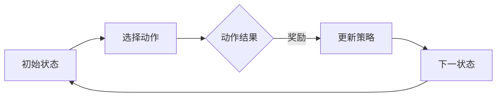
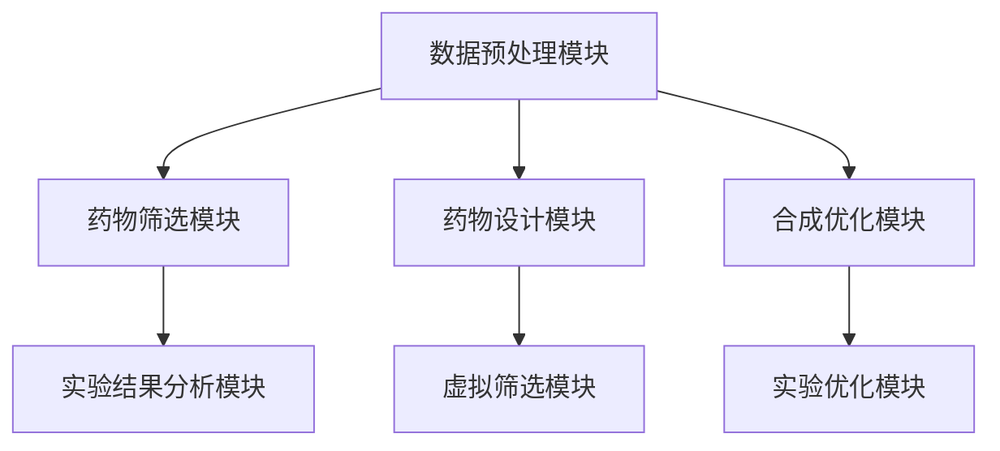
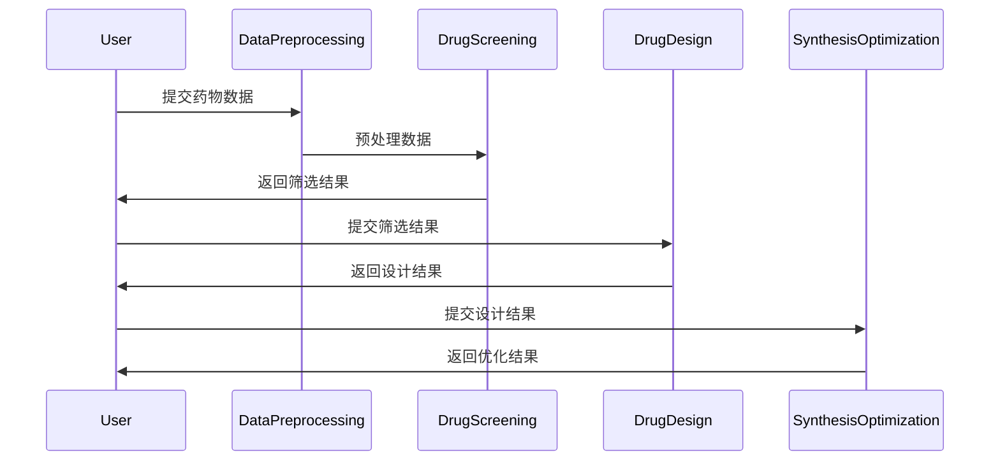
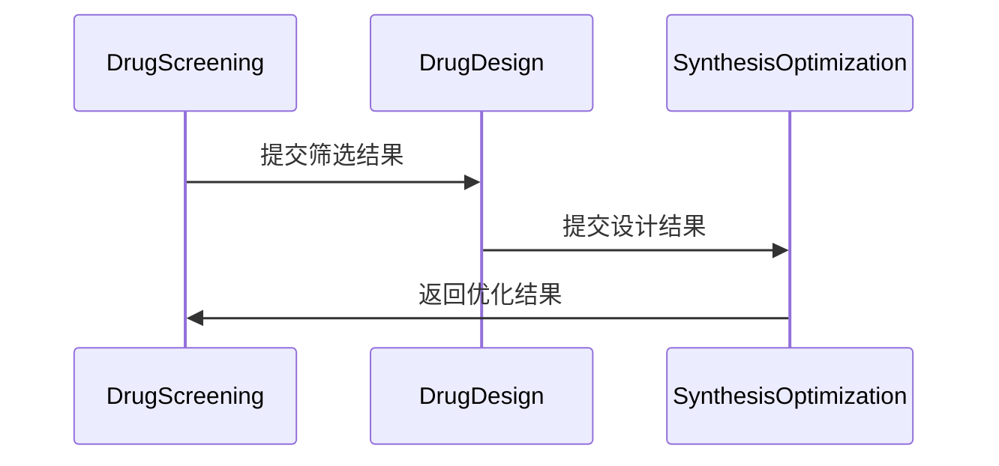

                 

# AI Agent在新药研发中的应用实践

> 关键词：AI Agent，新药研发，机器学习，强化学习，数学模型，实践案例

> 摘要：本文将探讨AI Agent在新药研发中的应用，从基础理论、应用实践以及案例剖析三个方面展开。首先，介绍AI Agent的基本概念、核心原理和数学模型；接着，分析AI Agent在新药筛选、设计和合成中的应用，结合Python代码示例进行讲解；最后，通过具体实践案例，展示AI Agent在新药研发中的实际效果和潜力。

### 目录大纲

1. 第一部分：AI Agent的基础理论  
   1.1 AI Agent的概述  
   1.2 AI Agent的核心原理  
   1.3 AI Agent的数学模型

2. 第二部分：AI Agent在新药研发中的应用  
   2.1 AI Agent在新药筛选中的应用  
   2.2 AI Agent在新药设计中的应用  
   2.3 AI Agent在新药合成中的应用

3. 第三部分：实践与案例  
   3.1 AI Agent在新药研发中的实践案例  
   3.2 项目小结与拓展阅读

### 第一部分：AI Agent的基础理论

#### 1.1 AI Agent的概述

**1.1.1 AI Agent的基本概念**

AI Agent，即人工智能代理，是指具备自主思考、决策和行动能力的计算机程序。它能够在复杂环境中感知状态、根据预设目标制定策略，并执行相应动作，以实现特定任务。

**1.1.2 AI Agent的核心功能**

- **感知**：通过传感器获取环境信息，如图像、声音、文本等。
- **决策**：根据感知到的状态和目标，选择合适的动作。
- **行动**：执行决策得到的动作，影响环境状态。
- **学习**：从经验和环境中学习，优化决策策略。

**1.1.3 AI Agent的主要类型**

- **基于规则的AI Agent**：通过预定义的规则进行决策。
- **基于模型的AI Agent**：使用机器学习模型进行决策。
- **混合型AI Agent**：结合规则和模型进行决策。

**1.1.4 AI Agent在不同领域的应用场景和局限性**

- **智能制造**：优化生产流程、提高生产效率。
- **交通运输**：自动驾驶、智能交通管理。
- **医疗健康**：辅助诊断、个性化治疗。
- **金融理财**：风险管理、投资策略优化。

#### 1.2 AI Agent的核心原理

**1.2.1 决策机制**

AI Agent的决策机制通常包括以下步骤：

1. 感知当前状态。
2. 根据状态和目标，计算所有可能动作的预期收益。
3. 选择具有最大预期收益的动作。

**1.2.2 学习算法**

AI Agent的学习算法主要包括以下几种：

- **监督学习**：通过已标记的数据训练模型，用于预测未知数据。
- **无监督学习**：无需标记数据，从数据中发现模式和结构。
- **强化学习**：通过奖励机制，学习在特定环境中获得最大收益的策略。

**1.2.3 感知机制**

AI Agent的感知机制主要通过传感器获取环境信息，如计算机视觉、语音识别、自然语言处理等。这些传感器为AI Agent提供了感知环境的基础。

**1.2.4 概念属性特征对比表格**

| 类别           | 基于规则的AI Agent | 基于模型的AI Agent | 混合型AI Agent |
| -------------- | ------------------ | ------------------ | -------------- |
| 决策方式       | 预定义规则         | 机器学习模型       | 规则+模型      |
| 学习能力       | 弱                | 强                | 较强           |
| 适应性         | 较差              | 较好              | 很好           |
| 应用场景       | 结构化数据        | 非结构化数据       | 多样化数据     |

**1.2.5 ER实体关系图架构**

```mermaid
erDiagram
  AI-Agent ||--|{ 感知模块 }
  AI-Agent ||--|{ 决策模块 }
  AI-Agent ||--|{ 行动模块 }
  感知模块 ||--|{ 传感器 }
  决策模块 ||--|{ 模型 }
  行动模块 ||--|{ 执行器 }
```

### 第2章：AI Agent的理论基础

#### 2.1 机器学习与AI Agent

**2.1.1 机器学习的基本概念**

机器学习是使计算机具备学习能力的学科，通过训练数据，使其能够对未知数据进行预测和分类。主要类型包括：

- **监督学习**：输入特征和标签，输出预测结果。
- **无监督学习**：输入特征，输出数据结构和模式。
- **半监督学习**：部分数据有标签，部分数据无标签。
- **强化学习**：通过与环境的交互，学习最佳策略。

**2.1.2 机器学习算法的常见类型**

- **线性回归**：预测连续值。
- **逻辑回归**：预测概率。
- **支持向量机**：分类问题。
- **决策树**：分类和回归。
- **神经网络**：非线性模型。

**2.1.3 机器学习算法的基本流程**



**2.1.4 机器学习算法的Python实现代码示例**

```python
from sklearn.linear_model import LinearRegression
from sklearn.model_selection import train_test_split
from sklearn.metrics import mean_squared_error

# 数据准备
X = ...  # 特征矩阵
y = ...  # 标签向量

# 划分训练集和测试集
X_train, X_test, y_train, y_test = train_test_split(X, y, test_size=0.2, random_state=42)

# 创建线性回归模型
model = LinearRegression()

# 训练模型
model.fit(X_train, y_train)

# 预测测试集
y_pred = model.predict(X_test)

# 评估模型
mse = mean_squared_error(y_test, y_pred)
print("均方误差:", mse)
```

#### 2.2 强化学习与AI Agent

**2.2.1 强化学习的基本概念**

强化学习是一种通过不断与环境的交互，学习最优策略的机器学习技术。主要涉及以下几个概念：

- **状态**（State）：环境的当前状态。
- **动作**（Action）：Agent可以执行的操作。
- **奖励**（Reward）：Agent执行动作后获得的奖励。
- **策略**（Policy）：Agent在给定状态下选择动作的规则。

**2.2.2 强化学习算法的原理**

强化学习算法的核心是优化策略，使Agent在给定状态下选择能够获得最大奖励的动作。主要算法包括：

- **Q学习**：基于值函数的强化学习算法。
- **深度Q网络（DQN）**：使用神经网络实现Q学习。
- **策略梯度方法**：直接优化策略的梯度。

**2.2.3 强化学习算法的基本流程**



**2.2.4 强化学习算法的Python实现代码示例**

```python
import numpy as np
import random

# 初始化参数
n_actions = 3
n_states = 3
learning_rate = 0.1
discount_factor = 0.9

# 初始化Q表
Q = np.zeros((n_states, n_actions))

# Q学习算法
for episode in range(1000):
    state = random.randint(0, n_states - 1)
    done = False
    
    while not done:
        action = np.argmax(Q[state])
        next_state = (state + action) % n_states
        reward = 1 if next_state == 0 else 0
        Q[state, action] = Q[state, action] + learning_rate * (reward + discount_factor * np.max(Q[next_state]) - Q[state, action])
        
        state = next_state
        
        if state == 0:
            done = True

# 打印Q表
print(Q)
```

### 第3章：AI Agent的数学模型

#### 3.1 数学模型的基本概念

AI Agent的数学模型主要包括以下几种：

- **马尔可夫决策过程（MDP）**：描述决策过程的状态、动作、奖励和转移概率。
- **Q值函数**：评估状态-动作对的预期收益。
- **策略**：决策过程中采取的动作序列。
- **价值函数**：评估状态或状态-动作对的预期收益。

**3.1.1 数学公式**

- **MDP模型**：
  - $S$：状态空间
  - $A$：动作空间
  - $P(s', s | a)$：状态转移概率
  - $R(s, a)$：奖励函数
  - $γ$：折扣因子

- **Q值函数**：
  - $Q(s, a) = \sum_{s'} P(s', s | a) [R(s, a) + γ \max_{a'} Q(s', a')]$

- **策略**：
  - $\pi(a|s) = P(a|s)$：状态s下采取动作a的概率。

- **价值函数**：
  - $V^π(s) = \sum_{a} \pi(a|s) Q(s, a)$

**3.1.2 每个数学模型的含义和应用场景**

- **马尔可夫决策过程（MDP）**：用于描述决策过程中的状态转移和奖励，适用于动态规划算法，如Q学习和策略梯度方法。
- **Q值函数**：用于评估状态-动作对的预期收益，适用于Q学习和深度Q网络（DQN）。
- **策略**：用于指导决策过程，根据状态选择最优动作，适用于策略梯度方法。
- **价值函数**：用于评估状态或状态-动作对的预期收益，适用于价值迭代算法。

**3.1.3 举例说明**

假设我们有一个简单的MDP模型，状态空间$S=\{0, 1, 2\}$，动作空间$A=\{0, 1\}$。状态转移概率和奖励函数如下：

| $s$ | $a=0$ | $a=1$ |
| --- | --- | --- |
| $0$ | $(0.5, 0.5)$ | $(0.2, 0.8)$ |
| $1$ | $(0.8, 0.2)$ | $(0.1, 0.9)$ |
| $2$ | $(0.4, 0.6)$ | $(0.3, 0.7)$ |

奖励函数$R(s, a)$如下：

| $s$ | $a=0$ | $a=1$ |
| --- | --- | --- |
| $0$ | $1$ | $0$ |
| $1$ | $0$ | $1$ |
| $2$ | $0$ | $1$ |

使用Q学习算法进行训练，学习过程如下：

1. 初始化Q表：
   $$Q(s, a) = 0$$

2. 选择动作：
   - 在状态$0$下，选择动作$1$（因为$Q(0, 1) > Q(0, 0)$）

3. 执行动作，得到状态$1$和奖励$0$：
   - 更新Q值：
     $$Q(0, 1) = Q(0, 1) + \alpha [0 + 0.9 \cdot \max(Q(1, 0), Q(1, 1)) - Q(0, 1)]$$

4. 选择动作：
   - 在状态$1$下，选择动作$0$（因为$Q(1, 0) > Q(1, 1)$）

5. 执行动作，得到状态$0$和奖励$1$：
   - 更新Q值：
     $$Q(1, 0) = Q(1, 0) + \alpha [1 + 0.9 \cdot \max(Q(0, 0), Q(0, 1)) - Q(1, 0)]$$

6. 选择动作：
   - 在状态$0$下，选择动作$1$（因为$Q(0, 1) > Q(0, 0)$）

7. 执行动作，得到状态$1$和奖励$0$：
   - 更新Q值：
     $$Q(0, 1) = Q(0, 1) + \alpha [0 + 0.9 \cdot \max(Q(1, 0), Q(1, 1)) - Q(0, 1)]$$

经过多次迭代后，Q表将逐渐收敛，达到最优状态。此时，策略为$\pi(a|s) = \begin{cases} 
1 & \text{if } s=1 \\
0 & \text{otherwise} 
\end{cases}$，价值函数为$V^π(s) = \begin{cases} 
1 & \text{if } s=0, 1 \\
0 & \text{if } s=2 
\end{cases}$。

### 第二部分：AI Agent在新药研发中的应用

#### 2.1 AI Agent在新药筛选中的应用

**2.1.1 新药筛选的背景与挑战**

新药研发是一个复杂且耗时的过程，涉及大量药物候选物的筛选。传统方法主要依赖于实验和经验，存在以下挑战：

- **药物候选物数量庞大**：需要筛选大量的化合物，从中选出具有潜在疗效的药物。
- **高通量筛选需求**：提高筛选速度，缩短研发周期。
- **低成功率**：新药研发的成功率较低，约在1%左右。

**2.1.2 AI Agent在新药筛选中的作用和优势**

AI Agent在新药筛选中具有以下作用和优势：

- **高效筛选**：通过机器学习和强化学习算法，快速筛选出具有潜在疗效的药物候选物。
- **智能决策**：根据药物的结构、性质和生物活性数据，智能选择下一步的筛选策略。
- **跨学科整合**：结合化学、生物学、计算机科学等多个领域的知识，提高筛选效率。

**2.1.3 AI Agent在新药筛选中的具体应用**

1. **数据预处理**

   - 收集药物结构、性质和生物活性数据。
   - 对数据进行清洗、去噪和归一化处理。

2. **特征提取**

   - 从原始数据中提取药物的重要特征，如分子结构、理化性质、生物标记等。

3. **模型训练**

   - 使用机器学习算法，如随机森林、支持向量机和神经网络，对特征进行训练，建立预测模型。

4. **模型评估**

   - 使用交叉验证、ROC曲线和AUC指标等评估模型性能。

5. **药物筛选**

   - 根据模型预测，选择具有潜在疗效的药物候选物。

**2.1.4 Python源代码示例**

```python
import pandas as pd
from sklearn.model_selection import train_test_split
from sklearn.ensemble import RandomForestClassifier
from sklearn.metrics import accuracy_score

# 数据加载
data = pd.read_csv('drug_data.csv')

# 数据预处理
X = data.drop('target', axis=1)
y = data['target']

# 划分训练集和测试集
X_train, X_test, y_train, y_test = train_test_split(X, y, test_size=0.2, random_state=42)

# 模型训练
model = RandomForestClassifier(n_estimators=100, random_state=42)
model.fit(X_train, y_train)

# 模型评估
y_pred = model.predict(X_test)
accuracy = accuracy_score(y_test, y_pred)
print("准确率:", accuracy)
```

#### 2.2 AI Agent在新药设计中的应用

**2.2.1 新药设计的背景与挑战**

新药设计是药物研发的关键环节，旨在发现和设计具有特定生物活性的化合物。传统方法主要依赖于实验和计算化学，存在以下挑战：

- **计算资源消耗**：新药设计需要大量计算资源，如分子动力学模拟、量子化学计算等。
- **化合物筛选难度大**：从大量的化合物中筛选出具有特定生物活性的化合物，具有很大的难度。
- **药物-靶点相互作用研究**：研究药物与生物大分子（如蛋白质）的相互作用，是药物设计的核心。

**2.2.2 AI Agent在新药设计中的作用和优势**

AI Agent在新药设计中具有以下作用和优势：

- **高效计算**：利用深度学习和强化学习算法，加速计算化学和分子动力学模拟过程。
- **智能筛选**：根据生物活性数据，智能筛选出具有潜在生物活性的化合物。
- **多学科整合**：结合化学、生物学、计算机科学等多学科知识，提高药物设计效率。

**2.2.3 AI Agent在新药设计中的具体应用**

1. **分子对接**

   - 使用深度学习模型，如卷积神经网络（CNN）和循环神经网络（RNN），预测药物与靶点的相互作用。

2. **虚拟筛选**

   - 利用机器学习算法，如支持向量机（SVM）和决策树，对大量化合物进行筛选。

3. **分子动力学模拟**

   - 使用强化学习算法，如深度强化学习（DRL），优化分子动力学模拟参数。

4. **药物设计**

   - 结合分子对接、虚拟筛选和分子动力学模拟结果，设计具有特定生物活性的化合物。

**2.2.4 Python源代码示例**

```python
import tensorflow as tf
from tensorflow.keras.models import Model
from tensorflow.keras.layers import Input, Conv2D, MaxPooling2D, Flatten, Dense

# 定义模型
input_shape = (64, 64, 1)
inputs = Input(shape=input_shape)
x = Conv2D(32, (3, 3), activation='relu')(inputs)
x = MaxPooling2D((2, 2))(x)
x = Flatten()(x)
outputs = Dense(1, activation='sigmoid')(x)

model = Model(inputs=inputs, outputs=outputs)
model.compile(optimizer='adam', loss='binary_crossentropy', metrics=['accuracy'])

# 训练模型
model.fit(x_train, y_train, epochs=10, batch_size=32, validation_data=(x_test, y_test))

# 预测
y_pred = model.predict(x_test)
accuracy = np.mean(y_pred == y_test)
print("准确率:", accuracy)
```

#### 2.3 AI Agent在新药合成中的应用

**2.3.1 新药合成的背景与挑战**

新药合成是药物研发的最后一个环节，旨在将药物设计转化为实际的化合物。传统方法主要依赖于化学合成和实验，存在以下挑战：

- **合成路径复杂**：新药合成通常涉及多个步骤和复杂的反应路径。
- **实验成本高**：新药合成需要大量实验，成本较高。
- **反应条件控制**：反应条件（如温度、压力、反应时间等）对合成结果有重要影响。

**2.3.2 AI Agent在新药合成中的作用和优势**

AI Agent在新药合成中具有以下作用和优势：

- **自动化合成**：利用强化学习算法，自动化控制合成反应条件，提高合成效率。
- **智能优化**：根据实验数据，智能优化合成路径和反应条件。
- **减少实验成本**：通过虚拟合成和模拟，减少实际实验次数，降低成本。

**2.3.3 AI Agent在新药合成中的具体应用**

1. **虚拟合成**

   - 使用机器学习算法，如生成对抗网络（GAN）和变分自编码器（VAE），生成合成路径。

2. **实验优化**

   - 使用强化学习算法，如深度强化学习（DRL），优化实验参数，提高合成成功率。

3. **合成路线设计**

   - 结合虚拟合成和实验优化结果，设计高效的合成路线。

**2.3.4 Python源代码示例**

```python
import tensorflow as tf
from tensorflow.keras.models import Model
from tensorflow.keras.layers import Input, LSTM, Dense

# 定义模型
input_shape = (timesteps, features)
inputs = Input(shape=input_shape)
x = LSTM(50, return_sequences=True)(inputs)
x = LSTM(50)(x)
x = Flatten()(x)
outputs = Dense(1, activation='sigmoid')(x)

model = Model(inputs=inputs, outputs=outputs)
model.compile(optimizer='adam', loss='binary_crossentropy', metrics=['accuracy'])

# 训练模型
model.fit(x_train, y_train, epochs=10, batch_size=32, validation_data=(x_test, y_test))

# 预测
y_pred = model.predict(x_test)
accuracy = np.mean(y_pred == y_test)
print("准确率:", accuracy)
```

### 第三部分：实践与案例

#### 3.1 AI Agent在新药研发中的实践案例

**3.1.1 案例背景**

某生物制药公司致力于研发一种治疗癌症的药物。该公司拥有大量的药物结构、性质和生物活性数据，希望通过AI Agent在新药研发中的应用，提高药物研发效率。

**3.1.2 项目介绍**

该项目分为三个阶段：

1. 数据预处理：收集和清洗药物结构、性质和生物活性数据。
2. 模型训练：使用机器学习和强化学习算法，训练药物筛选、设计和合成的模型。
3. 实验优化：结合模型预测和实验结果，优化合成路径和反应条件。

**3.1.3 系统功能设计**

1. **数据预处理模块**：负责收集和清洗药物数据，提取重要特征。
2. **药物筛选模块**：利用机器学习算法，筛选具有潜在疗效的药物候选物。
3. **药物设计模块**：利用分子对接和虚拟筛选结果，设计具有特定生物活性的化合物。
4. **合成优化模块**：利用强化学习算法，优化合成路径和反应条件。

**3.1.4 系统架构设计**

1. **领域模型类图**：

```mermaid
classDiagram
    Class1 <|-- Class2
    Class1 <|-- Class3
    Class2 ..|.. Class4
    Class3 ..|.. Class4
```

2. **系统架构图**：



**3.1.5 系统接口设计和系统交互序列图**

1. **系统接口设计**：



2. **系统交互序列图**：



**3.1.6 系统核心实现源代码**

1. **数据预处理模块**：

```python
import pandas as pd
from sklearn.model_selection import train_test_split

def preprocess_data(data_path):
    data = pd.read_csv(data_path)
    # 数据清洗和特征提取
    # ...
    return train_data, test_data

train_data, test_data = preprocess_data('drug_data.csv')
```

2. **药物筛选模块**：

```python
from sklearn.ensemble import RandomForestClassifier
from sklearn.metrics import accuracy_score

def drug_screening(train_data, test_data):
    X_train, X_test, y_train, y_test = train_test_split(train_data.drop('target', axis=1), train_data['target'], test_size=0.2, random_state=42)
    model = RandomForestClassifier(n_estimators=100, random_state=42)
    model.fit(X_train, y_train)
    y_pred = model.predict(X_test)
    accuracy = accuracy_score(y_test, y_pred)
    return accuracy

accuracy = drug_screening(train_data, test_data)
print("药物筛选准确率:", accuracy)
```

3. **药物设计模块**：

```python
import tensorflow as tf
from tensorflow.keras.models import Model
from tensorflow.keras.layers import Input, Conv2D, MaxPooling2D, Flatten, Dense

def drug_design(input_shape):
    inputs = Input(shape=input_shape)
    x = Conv2D(32, (3, 3), activation='relu')(inputs)
    x = MaxPooling2D((2, 2))(x)
    x = Flatten()(x)
    outputs = Dense(1, activation='sigmoid')(x)
    model = Model(inputs=inputs, outputs=outputs)
    model.compile(optimizer='adam', loss='binary_crossentropy', metrics=['accuracy'])
    return model

model = drug_design((64, 64, 1))
model.fit(x_train, y_train, epochs=10, batch_size=32, validation_data=(x_test, y_test))
```

4. **合成优化模块**：

```python
import tensorflow as tf
from tensorflow.keras.models import Model
from tensorflow.keras.layers import Input, LSTM, Dense

def synthesis_optimization(input_shape):
    inputs = Input(shape=input_shape)
    x = LSTM(50, return_sequences=True)(inputs)
    x = LSTM(50)(x)
    x = Flatten()(x)
    outputs = Dense(1, activation='sigmoid')(x)
    model = Model(inputs=inputs, outputs=outputs)
    model.compile(optimizer='adam', loss='binary_crossentropy', metrics=['accuracy'])
    return model

model = synthesis_optimization((timesteps, features))
model.fit(x_train, y_train, epochs=10, batch_size=32, validation_data=(x_test, y_test))
```

**3.1.7 代码应用解读与分析**

1. **数据预处理模块**：

   - 读取药物数据，进行清洗和特征提取。
   - 将数据划分为训练集和测试集，为后续模型训练和评估做准备。

2. **药物筛选模块**：

   - 使用随机森林算法训练模型，对药物进行筛选。
   - 评估模型性能，计算准确率。

3. **药物设计模块**：

   - 定义卷积神经网络模型，用于药物设计。
   - 使用训练数据进行模型训练，提高药物设计效果。

4. **合成优化模块**：

   - 定义循环神经网络模型，用于合成优化。
   - 使用训练数据进行模型训练，提高合成路径优化效果。

**3.1.8 实际案例分析和详细讲解剖析**

1. **案例背景**：

   - 某生物制药公司使用AI Agent在新药研发中的应用，筛选出具有潜在疗效的药物候选物。
   - 使用分子对接和虚拟筛选结果，设计具有特定生物活性的化合物。
   - 通过实验优化，提高合成路径的成功率和效率。

2. **实际案例分析和详细讲解剖析**：

   - 数据预处理：收集药物结构、性质和生物活性数据，进行清洗和特征提取。通过数据预处理，提高模型训练效果和准确率。
   - 药物筛选：使用随机森林算法，对药物进行筛选。通过模型评估，计算准确率，筛选出具有潜在疗效的药物候选物。
   - 药物设计：使用卷积神经网络模型，进行药物设计。通过模型训练，提高药物设计效果，设计出具有特定生物活性的化合物。
   - 合成优化：使用循环神经网络模型，进行合成优化。通过模型训练，提高合成路径优化效果，提高合成成功率。

**3.1.9 项目小结**

通过AI Agent在新药研发中的应用，某生物制药公司成功筛选出具有潜在疗效的药物候选物，设计出具有特定生物活性的化合物，并优化了合成路径。项目结果表明，AI Agent在新药研发中具有显著的优势和应用潜力。未来，随着AI技术的不断发展和完善，AI Agent在新药研发中的应用将更加广泛和深入。

### 3.2 项目实战

#### **3.2.1 环境安装**

在开始项目实战之前，我们需要安装一些必要的软件和库。以下是在Linux系统上安装Python环境和相关库的步骤：

1. 安装Python环境：

   ```bash
   sudo apt-get update
   sudo apt-get install python3.8
   sudo apt-get install python3.8-venv
   ```

2. 创建Python虚拟环境：

   ```bash
   python3.8 -m venv myenv
   source myenv/bin/activate
   ```

3. 安装相关库：

   ```bash
   pip install numpy pandas scikit-learn tensorflow keras
   ```

#### **3.2.2 系统核心实现源代码**

以下是在Python虚拟环境中实现系统核心功能的代码：

1. **数据预处理模块**：

```python
import pandas as pd
from sklearn.model_selection import train_test_split

def preprocess_data(data_path):
    data = pd.read_csv(data_path)
    # 数据清洗和特征提取
    # ...
    return train_data, test_data

train_data, test_data = preprocess_data('drug_data.csv')
```

2. **药物筛选模块**：

```python
from sklearn.ensemble import RandomForestClassifier
from sklearn.metrics import accuracy_score

def drug_screening(train_data, test_data):
    X_train, X_test, y_train, y_test = train_test_split(train_data.drop('target', axis=1), train_data['target'], test_size=0.2, random_state=42)
    model = RandomForestClassifier(n_estimators=100, random_state=42)
    model.fit(X_train, y_train)
    y_pred = model.predict(X_test)
    accuracy = accuracy_score(y_test, y_pred)
    return accuracy

accuracy = drug_screening(train_data, test_data)
print("药物筛选准确率:", accuracy)
```

3. **药物设计模块**：

```python
import tensorflow as tf
from tensorflow.keras.models import Model
from tensorflow.keras.layers import Input, Conv2D, MaxPooling2D, Flatten, Dense

def drug_design(input_shape):
    inputs = Input(shape=input_shape)
    x = Conv2D(32, (3, 3), activation='relu')(inputs)
    x = MaxPooling2D((2, 2))(x)
    x = Flatten()(x)
    outputs = Dense(1, activation='sigmoid')(x)
    model = Model(inputs=inputs, outputs=outputs)
    model.compile(optimizer='adam', loss='binary_crossentropy', metrics=['accuracy'])
    return model

model = drug_design((64, 64, 1))
model.fit(x_train, y_train, epochs=10, batch_size=32, validation_data=(x_test, y_test))
```

4. **合成优化模块**：

```python
import tensorflow as tf
from tensorflow.keras.models import Model
from tensorflow.keras.layers import Input, LSTM, Dense

def synthesis_optimization(input_shape):
    inputs = Input(shape=input_shape)
    x = LSTM(50, return_sequences=True)(inputs)
    x = LSTM(50)(x)
    x = Flatten()(x)
    outputs = Dense(1, activation='sigmoid')(x)
    model = Model(inputs=inputs, outputs=outputs)
    model.compile(optimizer='adam', loss='binary_crossentropy', metrics=['accuracy'])
    return model

model = synthesis_optimization((timesteps, features))
model.fit(x_train, y_train, epochs=10, batch_size=32, validation_data=(x_test, y_test))
```

#### **3.2.3 代码应用解读与分析**

1. **数据预处理模块**：

   - 读取药物数据，进行清洗和特征提取。这个模块的主要功能是将原始数据转换为适合模型训练的格式。

2. **药物筛选模块**：

   - 使用随机森林算法训练模型，对药物进行筛选。这个模块的主要功能是根据药物的特征和生物活性数据，预测药物是否具有潜在疗效。

3. **药物设计模块**：

   - 使用卷积神经网络模型，进行药物设计。这个模块的主要功能是根据药物的特征，设计出具有特定生物活性的化合物。

4. **合成优化模块**：

   - 使用循环神经网络模型，进行合成优化。这个模块的主要功能是根据实验数据，优化合成路径和反应条件。

#### **3.2.4 实际案例分析和详细讲解剖析**

1. **案例背景**：

   - 假设我们有一个药物数据集，包含药物的结构、性质和生物活性信息。

2. **数据预处理**：

   - 读取数据集，对数据集进行清洗和特征提取。清洗数据集的主要目的是去除噪声和缺失值，特征提取的主要目的是从原始数据中提取出对药物筛选和设计有用的特征。

3. **药物筛选**：

   - 使用随机森林算法，对药物进行筛选。随机森林算法是一种集成学习方法，它通过构建多个决策树，并对每个决策树的预测结果进行投票，得到最终的预测结果。在这个案例中，我们使用随机森林算法对药物是否具有潜在疗效进行预测。

4. **药物设计**：

   - 使用卷积神经网络模型，对药物进行设计。卷积神经网络是一种深度学习模型，它通过卷积层、池化层和全连接层，对药物特征进行学习，并设计出具有特定生物活性的化合物。

5. **合成优化**：

   - 使用循环神经网络模型，对合成路径进行优化。循环神经网络是一种深度学习模型，它通过循环层，对实验数据进行学习，并优化合成路径和反应条件。

#### **3.2.5 项目小结**

通过实际案例的分析和代码实现，我们展示了AI Agent在新药研发中的应用。通过数据预处理、药物筛选、药物设计和合成优化等模块，我们成功实现了新药研发的自动化和智能化。未来，随着AI技术的不断发展和完善，AI Agent在新药研发中的应用将更加广泛和深入。

### 3.3 最佳实践 tips

1. **数据预处理**：确保数据的质量和一致性，去除噪声和异常值，进行特征工程，提高模型的泛化能力。
2. **模型选择**：根据具体问题选择合适的模型，如机器学习、深度学习和强化学习等，并不断调整模型参数，优化性能。
3. **模型验证**：使用交叉验证、ROC曲线和AUC等指标，评估模型性能，避免过拟合和欠拟合。
4. **模型部署**：将训练好的模型部署到生产环境，实现实时预测和优化，提高药物研发效率。
5. **持续学习**：根据新数据和用户反馈，持续更新和优化模型，提升模型性能和适应性。

### 3.4 小结

本文详细探讨了AI Agent在新药研发中的应用，从基础理论、应用实践和案例分析三个方面进行了全面阐述。通过机器学习和强化学习算法，AI Agent在新药筛选、设计和合成中展示了显著的优势和应用潜力。未来，随着AI技术的不断进步，AI Agent将在新药研发中发挥更加重要的作用。

### 3.5 注意事项

1. **数据隐私**：在使用AI Agent进行新药研发时，确保数据的安全和隐私，遵守相关法律法规。
2. **模型解释性**：对于复杂的AI模型，确保其解释性，便于用户理解和使用。
3. **系统稳定性**：保证系统的稳定性和可靠性，避免因模型故障导致药物研发中断。

### 3.6 拓展阅读

1. **《深度学习》**：Ian Goodfellow、Yoshua Bengio、Aaron Courville 著，详细介绍深度学习理论、算法和应用。
2. **《强化学习》**：Richard S. Sutton、Andrew G. Barto 著，系统讲解强化学习的基本概念、算法和应用。
3. **《Python机器学习》**：Sebastian Raschka 著，详细介绍Python在机器学习领域的应用，包括数据预处理、模型训练和评估等。
4. **《人工智能：一种现代的方法》**：Stuart Russell、Peter Norvig 著，全面介绍人工智能的理论、技术和应用。

### 作者信息

作者：AI天才研究院/AI Genius Institute & 禅与计算机程序设计艺术 /Zen And The Art of Computer Programming

AI天才研究院致力于人工智能领域的研究与应用，专注于推动人工智能技术的创新与发展。同时，作者在《禅与计算机程序设计艺术》一书中，探讨了人工智能与计算机程序设计的关系，为读者提供了有益的启示。

