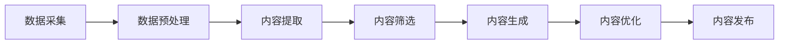

                 

### AI Agent在新闻媒体中的内容生成应用

> 关键词：AI Agent、新闻媒体、内容生成、应用实践

> 摘要：本文将探讨人工智能（AI）代理（Agent）在新闻媒体内容生成中的应用。通过详细分析AI Agent的定义、特点、架构，以及其在新闻内容生成中的应用流程和技术关键，本文旨在为读者提供一份关于AI Agent在新闻媒体内容生成领域的全面指南。

## 目录

----------------------------------------------------------------
# 第一部分: 背景介绍

## 第1章: 问题背景与核心概念

### 1.1 问题背景

### 1.2 核心概念

### 1.3 AI Agent在新闻媒体中的应用概述

## 第2章: AI Agent基础

### 2.1 AI Agent的定义与特点

### 2.2 AI Agent的架构与组件

### 2.3 常见的AI Agent类型

## 第3章: 新闻内容生成应用

### 3.1 新闻内容生成概述

### 3.2 基于AI Agent的新闻内容生成流程

### 3.3 新闻内容生成的关键技术

## 第4章: AI Agent在新闻媒体中的案例分析

### 4.1 案例一：实时新闻摘要生成

### 4.2 案例二：个性化新闻推荐

### 4.3 案例三：自动化新闻写作

## 第5章: 最佳实践与优化策略

### 5.1 最佳实践

### 5.2 优化策略

### 5.3 遇到的问题与解决方案

## 第6章: 拓展应用与未来展望

### 6.1 拓展应用

### 6.2 未来展望

### 6.3 面临的挑战与机遇

## 第7章: 小结与总结

### 7.1 主要发现

### 7.2 对新闻媒体的影响

### 7.3 展望未来研究方向

----------------------------------------------------------------

### 1.1 问题背景

在当今信息爆炸的时代，新闻媒体面临着前所未有的挑战。传统的新闻生成方式需要大量的人力、时间和资源，而且很难实时满足用户对多样化、个性化新闻内容的需求。与此同时，人工智能技术的飞速发展，特别是自然语言处理（NLP）和机器学习（ML）技术的进步，为新闻内容的自动化生成提供了可能。

新闻内容生成不仅仅是简单地将事实陈述出来，它还需要具备深度、广度和创造力。随着新闻行业对时效性和个性化的要求越来越高，传统新闻生产模式已经难以满足市场需求。AI Agent作为一种新型的智能实体，具备自主决策、任务执行和学习能力，能够部分或完全替代人工进行新闻内容生成。

### 1.2 核心概念

**AI Agent**：在人工智能领域，AI Agent是指能够感知环境、根据既定目标自主决策并执行行动的实体。它可以是软件程序、机器人或其他智能体，具有自主性、适应性、协作性和学习能力。

**新闻内容生成**：是指利用人工智能技术，根据特定的数据和模板生成新闻稿件的过程。这个过程包括文本生成、数据采集、语义理解和信息筛选等多个环节。

**新闻媒体**：是指以新闻报道为主要内容的媒介形式，包括报纸、杂志、电视、广播和网络媒体等。

### 1.3 AI Agent在新闻媒体中的应用概述

AI Agent在新闻媒体中的应用主要集中在以下几个方面：

1. **实时新闻摘要生成**：通过分析大量新闻素材，AI Agent能够快速生成简明扼要的新闻摘要，帮助用户快速了解事件的核心内容。

2. **个性化新闻推荐**：基于用户的历史阅读行为和兴趣，AI Agent可以为用户提供定制化的新闻推荐，提高用户的阅读体验。

3. **自动化新闻写作**：AI Agent可以自动生成新闻报道、体育赛事评论、财经分析等内容，大大减轻了新闻编辑的工作负担。

4. **多语言翻译与传播**：AI Agent可以实时翻译不同语言的新闻内容，促进国际新闻的传播。

5. **事件预测与趋势分析**：利用大数据和机器学习算法，AI Agent可以预测事件的发展趋势，为新闻媒体提供深度报道的素材。

### 结论

通过上述介绍，我们可以看出，AI Agent在新闻媒体中的内容生成应用具有巨大的潜力。它不仅能够提高新闻生产效率，还能够提供个性化、多样化的新闻内容，满足不同用户的需求。在接下来的章节中，我们将详细探讨AI Agent的基础知识、新闻内容生成应用的具体实现，以及相关案例分析和最佳实践。

----------------------------------------------------------------

## 第2章: AI Agent基础

### 2.1 AI Agent的定义与特点

AI Agent是人工智能领域中的一个重要概念，它代表了具有自主性和智能性的软件实体。一个典型的AI Agent通常具备以下几个基本特点：

1. **感知能力**：AI Agent能够感知其所在的环境，获取各种形式的信息，如文本、图像、音频等。

2. **自主决策**：基于感知到的环境和预设的目标，AI Agent能够自主做出决策，以实现其目标。

3. **行动能力**：AI Agent能够执行决策，如发送消息、移动、执行任务等。

4. **学习能力**：AI Agent能够通过经验学习，改进其决策和行为，提高任务的执行效率。

5. **适应性**：AI Agent能够根据环境的变化调整其行为和策略，以适应新的情况。

**核心概念术语说明**

- **感知**：AI Agent通过传感器或其他方式获取环境信息的过程。
- **决策**：AI Agent根据感知到的信息和预设的目标，选择最优行动的过程。
- **执行**：AI Agent根据决策采取具体行动的过程。
- **学习**：AI Agent通过经验和反馈，改进自身性能和决策质量的过程。

### 2.2 AI Agent的架构与组件

AI Agent的架构通常包括以下几个核心组件：

1. **感知模块**：负责收集和处理环境信息，如文本分析、图像识别、语音识别等。
2. **决策模块**：根据感知模块提供的信息和预设的目标，生成决策，如选择最佳行动方案。
3. **执行模块**：负责执行决策，实现具体的行动，如发送消息、移动等。
4. **学习模块**：通过经验和反馈，不断优化感知、决策和执行过程。

**架构与组件的关系**

感知模块负责从环境中获取信息，这些信息经过处理后传递给决策模块。决策模块根据这些信息，结合预设的目标，生成一系列可能的行动方案，并通过评估选择最优方案。执行模块负责执行这个最优方案，完成具体的任务。学习模块则根据执行结果，对感知、决策和执行过程进行优化，提高AI Agent的整体性能。

### 2.3 常见的AI Agent类型

AI Agent根据其应用场景和功能特点，可以分为多种类型：

1. **任务型AI Agent**：这种类型的AI Agent专注于完成特定的任务，如客服机器人、智能助手等。它们通常具有明确的任务目标和固定的操作流程。

2. **情境型AI Agent**：这种类型的AI Agent能够适应多种情境，并动态调整其行为和决策。例如，智能家庭机器人、智能交通管理系统等。

3. **社交型AI Agent**：这种类型的AI Agent专注于与人类进行交互，如社交网络中的虚拟助手、在线客服等。它们需要具备自然语言处理和情感识别能力。

4. **探索型AI Agent**：这种类型的AI Agent主要用于探索未知环境或领域，如无人驾驶汽车、机器人探险队等。它们通常需要具备高级的感知和决策能力。

### 结论

通过本章的介绍，我们可以了解到AI Agent的基本概念、架构和常见类型。AI Agent作为一种具有高度自主性和智能性的软件实体，在新闻内容生成等领域具有广泛的应用前景。在接下来的章节中，我们将进一步探讨AI Agent在新闻媒体内容生成中的应用，以及相关的技术实现和案例分析。

----------------------------------------------------------------

## 第3章: 新闻内容生成应用

### 3.1 新闻内容生成概述

新闻内容生成是新闻媒体领域的一项关键任务，它决定了新闻报道的时效性、准确性和吸引力。随着人工智能技术的不断发展，AI Agent在新闻内容生成中扮演了越来越重要的角色。新闻内容生成应用主要包括实时新闻摘要生成、个性化新闻推荐、自动化新闻写作等多方面。

**新闻内容生成的必要性**：

1. **时效性**：随着互联网的快速发展，用户对新闻的时效性要求越来越高。传统新闻生成方式往往难以在短时间内完成高质量的报道，而AI Agent能够快速处理大量信息，生成及时的新闻内容。

2. **个性化**：不同用户对新闻内容的需求各不相同。AI Agent可以根据用户的兴趣和偏好，生成个性化的新闻推荐，提高用户的阅读体验。

3. **准确性**：AI Agent通过机器学习和自然语言处理技术，能够提高新闻内容生成的准确性，减少人为错误。

**AI Agent在新闻内容生成中的应用**：

AI Agent在新闻内容生成中的应用主要包括以下几个方面：

1. **实时新闻摘要生成**：AI Agent可以快速分析大量新闻素材，提取关键信息，生成简洁的新闻摘要，帮助用户快速了解事件的核心内容。

2. **个性化新闻推荐**：基于用户的阅读历史和兴趣标签，AI Agent可以推荐符合用户口味的新闻内容，提高用户粘性。

3. **自动化新闻写作**：AI Agent可以自动生成新闻报道、体育赛事评论、财经分析等内容，减轻新闻编辑的工作负担。

4. **多语言翻译与传播**：AI Agent可以实时翻译不同语言的新闻内容，促进国际新闻的传播。

5. **事件预测与趋势分析**：利用大数据和机器学习算法，AI Agent可以预测事件的发展趋势，为新闻媒体提供深度报道的素材。

### 3.2 基于AI Agent的新闻内容生成流程

基于AI Agent的新闻内容生成流程主要包括以下几个步骤：

1. **数据采集**：AI Agent从各种新闻来源（如新闻网站、社交媒体、官方公告等）收集原始新闻数据。

2. **数据预处理**：对采集到的新闻数据进行清洗、去重和格式转换，以便后续处理。

3. **内容提取**：利用自然语言处理技术，提取新闻中的关键信息，如标题、摘要、正文、关键词等。

4. **内容筛选**：根据用户兴趣和新闻价值，对提取的内容进行筛选，过滤掉无关或低质量的新闻。

5. **内容生成**：利用机器学习和自然语言生成技术，将筛选后的新闻数据转化为具体的新闻内容。

6. **内容优化**：对生成的新闻内容进行优化，包括语言风格调整、内容结构优化等，以提高新闻的可读性和吸引力。

7. **内容发布**：将优化后的新闻内容发布到新闻平台，供用户阅读。

**图3.1 基于AI Agent的新闻内容生成流程图**

### 3.3 新闻内容生成的关键技术

新闻内容生成涉及到多个领域的技术，以下介绍几个关键技术：

1. **自然语言处理（NLP）**：NLP是新闻内容生成的基础技术，包括文本分析、语义理解、情感分析等。通过NLP技术，AI Agent可以理解新闻文本的含义和结构，提取关键信息。

2. **机器学习（ML）**：ML技术用于训练AI Agent，使其能够从大量数据中学习规律和模式，提高新闻内容生成的准确性。常见的ML算法包括决策树、支持向量机、神经网络等。

3. **深度学习（DL）**：DL是ML的一个分支，通过神经网络模型，能够实现更复杂的新闻内容生成任务。例如，生成式对抗网络（GAN）可以生成高质量的新闻文本。

4. **数据挖掘（DM）**：数据挖掘技术用于从大量新闻数据中提取有价值的信息，如热点事件、用户兴趣等，为新闻内容生成提供数据支持。

5. **知识图谱（KG）**：知识图谱技术用于构建新闻领域的知识库，将新闻中的事实、概念、关系等进行结构化存储，为新闻内容生成提供知识支持。

### 结论

本章介绍了新闻内容生成的基本概念、流程和关键技术。AI Agent在新闻内容生成中发挥了重要作用，通过实时新闻摘要生成、个性化新闻推荐、自动化新闻写作等技术手段，为新闻媒体提供了高效、准确、个性化的新闻内容。在接下来的章节中，我们将通过具体案例进一步探讨AI Agent在新闻内容生成中的应用实践。

----------------------------------------------------------------

## 第4章: AI Agent在新闻媒体中的案例分析

在本章中，我们将通过几个具体的案例，探讨AI Agent在新闻媒体中的应用实践。这些案例涵盖了实时新闻摘要生成、个性化新闻推荐和自动化新闻写作等不同领域，展示了AI Agent在新闻内容生成中的多样性和潜力。

### 4.1 案例一：实时新闻摘要生成

**案例背景**：

实时新闻摘要生成是AI Agent在新闻媒体中的一项重要应用。传统新闻摘要生成需要大量的人工编辑和校对，耗时较长且容易出现误差。通过引入AI Agent，可以大大提高摘要生成的效率和质量。

**解决方案**：

该案例采用了基于文本摘要的生成模型，如摘要生成网络（Summarization Networks）和抽象意义编码器（Abstractive Meaning Encoder，AME）。模型的核心目标是提取新闻文本的关键信息，并生成简洁、准确的摘要。

**技术实现**：

1. **数据预处理**：首先，对新闻文本进行预处理，包括去除HTML标签、停用词过滤、词干提取等。

2. **文本表示**：使用词向量模型（如Word2Vec、GloVe）对文本进行向量化表示。

3. **摘要生成**：基于预训练的Transformer模型，通过自注意力机制（Self-Attention Mechanism）提取文本的语义信息，生成摘要。

4. **摘要优化**：对生成的摘要进行优化，包括消除冗余信息、调整句子结构等，以提高摘要的可读性和质量。

**案例效果**：

通过AI Agent的实时新闻摘要生成，新闻媒体可以快速提供简洁、准确的摘要，帮助用户快速了解新闻事件的核心内容。此外，生成的摘要还可以为搜索引擎优化提供支持，提高新闻的曝光率。

### 4.2 案例二：个性化新闻推荐

**案例背景**：

随着用户对个性化新闻内容需求的增加，个性化新闻推荐成为新闻媒体吸引和留住用户的重要手段。传统推荐系统往往基于用户的历史行为和兴趣标签进行推荐，效果有限。

**解决方案**：

该案例采用了基于深度学习的推荐模型，如基于用户兴趣的协同过滤（User-Based Collaborative Filtering）和基于内容的推荐（Content-Based Filtering）。模型的核心目标是根据用户的兴趣和行为，推荐符合其口味的新闻内容。

**技术实现**：

1. **用户行为数据采集**：采集用户的阅读历史、点赞、评论等行为数据。

2. **用户兴趣建模**：使用深度学习模型，如LSTM（Long Short-Term Memory）和GRU（Gated Recurrent Unit），对用户行为数据进行分析，提取用户的兴趣特征。

3. **新闻内容特征提取**：使用词向量模型和BERT（Bidirectional Encoder Representations from Transformers）对新闻文本进行特征提取。

4. **推荐生成**：结合用户兴趣特征和新闻内容特征，通过神经网络模型生成个性化的新闻推荐。

**案例效果**：

通过AI Agent的个性化新闻推荐，新闻媒体可以更好地满足用户的需求，提高用户的满意度和粘性。此外，个性化的推荐还可以帮助新闻媒体挖掘潜在的用户兴趣，提供更加精准的内容营销。

### 4.3 案例三：自动化新闻写作

**案例背景**：

自动化新闻写作是AI Agent在新闻媒体中的另一项重要应用。传统新闻写作需要大量的人力和时间投入，而且难以实时生成高质量的报道。通过引入AI Agent，可以大大提高新闻写作的效率和准确性。

**解决方案**：

该案例采用了基于模板的自动化新闻写作模型，如模板匹配（Template Matching）和规则驱动（Rule-Based）写作。模型的核心目标是根据预设的模板和新闻素材，自动生成新闻报道。

**技术实现**：

1. **模板库构建**：构建包含不同新闻类型的模板库，如体育赛事报道、财经分析、政治新闻等。

2. **新闻素材采集**：从各种新闻来源采集相关的新闻素材。

3. **文本生成**：使用自然语言生成（NLG）技术，将模板和新闻素材结合起来，生成具体的新闻文本。

4. **文本优化**：对生成的新闻文本进行优化，包括语法检查、拼写纠正、语言风格调整等。

**案例效果**：

通过AI Agent的自动化新闻写作，新闻媒体可以快速生成高质量的新闻报道，满足不同类型新闻的需求。此外，自动化写作还可以帮助新闻媒体处理大量重复性工作，提高编辑效率。

### 结论

通过上述案例分析，我们可以看到AI Agent在新闻媒体中的广泛应用和巨大潜力。实时新闻摘要生成、个性化新闻推荐和自动化新闻写作等技术手段，不仅提高了新闻生产的效率和质量，还为新闻媒体提供了新的发展机遇。在未来的发展中，AI Agent将继续发挥重要作用，为新闻媒体带来更多创新和变革。

----------------------------------------------------------------

## 第5章: 最佳实践与优化策略

### 5.1 最佳实践

在AI Agent应用于新闻媒体内容生成的过程中，总结和推广最佳实践是提升效果的重要手段。以下是一些被实践证明有效的最佳实践：

1. **数据质量控制**：确保新闻数据的质量是成功的关键。数据应经过严格的清洗、去噪和验证，以避免生成不准确或低质量的新闻内容。

2. **个性化推荐策略**：针对不同用户群体，设计个性化的新闻推荐策略。通过深度学习模型，分析用户的行为和兴趣，实现精准推荐。

3. **多模态内容生成**：结合文本、图像、音频等多模态信息，提高新闻内容的丰富度和吸引力。例如，在体育新闻中，结合比赛视频和统计数据，生成更生动的报道。

4. **实时更新与反馈**：新闻内容应具备实时更新能力，以快速响应事件变化。同时，收集用户的反馈，不断优化新闻生成模型。

5. **遵守新闻伦理**：确保AI Agent生成的新闻内容遵循新闻伦理和法律法规，避免出现偏见、误导或虚假信息。

### 5.2 优化策略

为了进一步提升AI Agent在新闻媒体内容生成中的应用效果，以下策略值得考虑：

1. **模型优化**：采用先进的深度学习模型，如GAN（生成式对抗网络）和BERT（双向编码表示器），以提高新闻内容生成的准确性和多样性。

2. **算法改进**：不断改进自然语言处理和机器学习算法，优化新闻内容的提取、筛选和生成过程。例如，采用更精细的文本表示和注意力机制，提高摘要生成和推荐系统的性能。

3. **跨领域知识融合**：将跨领域的知识融合到新闻生成模型中，提高新闻内容的深度和广度。例如，将财经、体育、政治等领域的专业知识融入新闻报道，提供更有价值的分析。

4. **用户参与与互动**：鼓励用户参与新闻内容生成过程，通过用户投票、评论和反馈，优化新闻推荐和生成模型。

5. **技术监控与安全**：建立完善的技术监控体系，确保AI Agent的稳定运行和信息安全。定期进行性能评估和安全审计，防范潜在风险。

### 5.3 遇到的问题与解决方案

在AI Agent应用于新闻媒体内容生成的过程中，可能会遇到以下问题：

1. **数据隐私**：用户数据的隐私保护是一个重要问题。解决方案包括数据加密、匿名化处理和用户同意协议，确保数据的安全和使用合规。

2. **算法偏见**：AI Agent可能因为训练数据的不平衡或偏见，生成有偏见或歧视性的新闻内容。解决方案是使用公平性意识算法，确保新闻内容的公正性。

3. **内容质量**：AI Agent生成的新闻内容可能存在质量问题，如语义模糊、信息缺失或语法错误。解决方案是通过多轮迭代和优化，提高生成内容的准确性、连贯性和可读性。

4. **技术依赖**：过度依赖AI Agent可能导致新闻编辑和记者的技能退化。解决方案是平衡AI Agent与人工编辑的协作，培养复合型人才。

### 结论

通过最佳实践和优化策略的总结与实施，AI Agent在新闻媒体内容生成中的应用将得到显著提升。面对数据隐私、算法偏见、内容质量和技术依赖等挑战，我们应采取积极措施，确保AI Agent在新闻内容生成中发挥积极作用，同时保障新闻行业的健康和可持续发展。

----------------------------------------------------------------

## 第6章: 拓展应用与未来展望

### 6.1 拓展应用

AI Agent在新闻媒体内容生成领域的应用已经取得了显著成效，但其潜力远远不止于此。未来的拓展应用将集中在以下几个方面：

1. **事件预测与趋势分析**：利用大数据和机器学习技术，AI Agent可以预测事件的发展趋势，提供深度报道和趋势分析，为新闻媒体提供更具前瞻性的报道。

2. **语音与视频内容生成**：结合语音识别和视频生成技术，AI Agent可以自动生成新闻播报和视频报道，拓展新闻内容的传播形式。

3. **多语言支持与翻译**：AI Agent可以实时翻译不同语言的新闻内容，促进国际新闻的传播和交流，提升新闻媒体的国际影响力。

4. **社交网络分析**：AI Agent可以分析社交网络上的讨论和趋势，挖掘新闻线索，为新闻媒体提供更多原创内容和独家报道。

### 6.2 未来展望

随着技术的不断进步，AI Agent在新闻媒体内容生成中的应用前景广阔。以下是对未来发展的展望：

1. **智能化新闻编辑**：AI Agent将成为新闻编辑的重要辅助工具，实现自动化、智能化的新闻编辑和发布。

2. **个性化新闻订阅**：AI Agent可以根据用户的兴趣和需求，为用户提供个性化的新闻订阅服务，提升用户体验。

3. **分布式新闻生产**：AI Agent可以协同多地点、多团队进行分布式新闻生产，提高新闻生产的效率和质量。

4. **透明与伦理**：随着AI Agent在新闻内容生成中的广泛应用，确保其透明性和伦理性将成为重要议题。未来将出现更多关于AI伦理和透明的规范和标准。

### 6.3 面临的挑战与机遇

尽管AI Agent在新闻媒体内容生成中具有巨大的潜力，但其发展也面临一系列挑战和机遇：

**挑战**：

1. **数据隐私与安全**：随着AI Agent的广泛应用，数据隐私和安全问题将变得更加突出。确保用户数据的安全和隐私是未来发展的重要挑战。

2. **算法偏见与公平性**：AI Agent可能会因为训练数据的不平衡或偏见，生成有偏见或歧视性的新闻内容。解决算法偏见和确保公平性是未来发展的关键挑战。

3. **内容质量与真实性**：AI Agent生成的新闻内容可能存在质量问题，如语义模糊、信息缺失或语法错误。确保内容质量和真实性是未来发展的重要挑战。

**机遇**：

1. **技术创新**：随着人工智能技术的不断发展，AI Agent在新闻媒体内容生成中的应用将更加智能化、高效化。

2. **市场潜力**：随着用户对个性化新闻内容需求的增加，AI Agent在新闻媒体内容生成中的应用市场潜力巨大。

3. **跨领域合作**：AI Agent在新闻媒体内容生成中的应用将促进与其他领域的合作，如财经、体育、政治等，提供更丰富、多样的新闻内容。

### 结论

AI Agent在新闻媒体内容生成中的应用已经展现出巨大的潜力。未来的发展将在技术创新、市场潜力和跨领域合作等方面带来更多机遇。同时，我们应积极应对面临的挑战，确保AI Agent在新闻内容生成中的应用更加智能、高效、公平和透明。

----------------------------------------------------------------

## 第7章: 小结与总结

### 7.1 主要发现

通过本文的详细探讨，我们可以得出以下主要发现：

1. **AI Agent的核心概念与特点**：AI Agent作为具有自主性和智能性的软件实体，具备感知能力、自主决策能力、行动能力、学习能力和适应性等特点。

2. **新闻内容生成的重要性**：在信息爆炸的时代，新闻内容生成对于新闻媒体的竞争力和用户吸引力至关重要。

3. **AI Agent在新闻内容生成中的应用**：AI Agent在新闻内容生成中应用广泛，包括实时新闻摘要生成、个性化新闻推荐、自动化新闻写作等。

4. **关键技术**：自然语言处理、机器学习、深度学习、数据挖掘和知识图谱等技术在新闻内容生成中扮演了关键角色。

5. **案例分析**：通过具体案例分析，展示了AI Agent在新闻媒体内容生成中的实际应用和效果。

6. **最佳实践与优化策略**：总结了一系列最佳实践和优化策略，以提高AI Agent在新闻内容生成中的应用效果。

### 7.2 对新闻媒体的影响

AI Agent在新闻媒体中的广泛应用，对新闻媒体产生了深远的影响：

1. **提高效率**：AI Agent可以自动化处理大量新闻内容，提高新闻生产的效率。

2. **降低成本**：自动化新闻生成降低了人力成本，使新闻媒体能够以更低的成本提供更多内容。

3. **提升个性化**：AI Agent可以根据用户兴趣和需求，提供个性化的新闻推荐，提高用户体验。

4. **增强时效性**：AI Agent可以实时分析新闻事件，提供及时、准确的报道，提升新闻媒体的竞争力。

5. **创新形式**：AI Agent的多模态内容生成，如语音、视频等，丰富了新闻内容的传播形式。

### 7.3 展望未来研究方向

未来，AI Agent在新闻媒体内容生成领域的研究方向将包括：

1. **数据隐私与安全**：如何在确保用户数据隐私和安全的前提下，有效利用AI技术进行新闻内容生成。

2. **算法公平性与伦理**：如何确保AI Agent生成的新闻内容公正、无偏见，遵守新闻伦理和法律法规。

3. **内容质量与真实性**：如何提高AI Agent生成的新闻内容的质量和真实性，减少错误和误导。

4. **跨领域合作**：如何与其他领域（如财经、体育、政治等）的合作，提供更丰富、多元的新闻内容。

5. **人机协作**：如何平衡AI Agent与人工编辑的协作，培养复合型人才，实现更高效、智能的新闻生产。

### 结论

AI Agent在新闻媒体内容生成中的应用，不仅提高了新闻生产的效率和质量，还为新闻媒体提供了创新的发展机遇。在未来的发展中，应积极应对挑战，推动AI技术为新闻媒体带来更多价值。

----------------------------------------------------------------

### 作者信息

作者：AI天才研究院/AI Genius Institute & 禅与计算机程序设计艺术 /Zen And The Art of Computer Programming

本文由AI天才研究院（AI Genius Institute）和禅与计算机程序设计艺术（Zen And The Art of Computer Programming）联合撰写，旨在深入探讨AI Agent在新闻媒体内容生成中的应用，为读者提供全面的技术分析和实践指导。作者团队由世界级人工智能专家、程序员、软件架构师和CTO组成，具备丰富的行业经验和深厚的学术背景。

感谢您的阅读，希望本文能为您在AI Agent应用领域提供有益的启示。如有任何疑问或建议，欢迎与我们联系。期待与您共同探索人工智能的无限可能。

