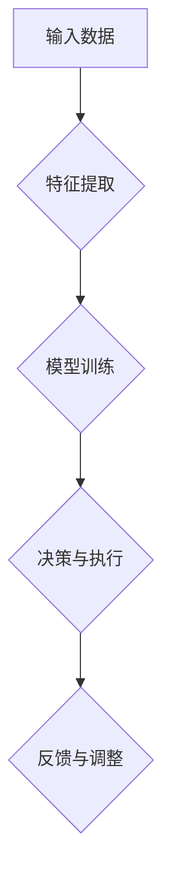
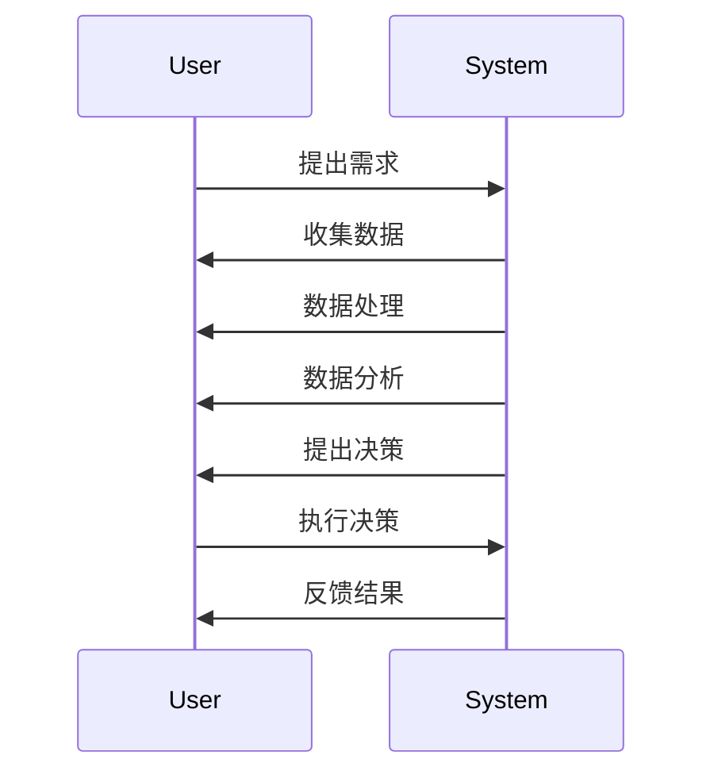
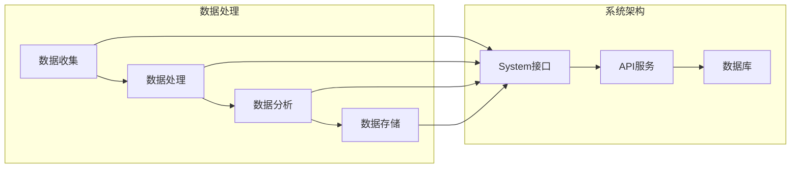
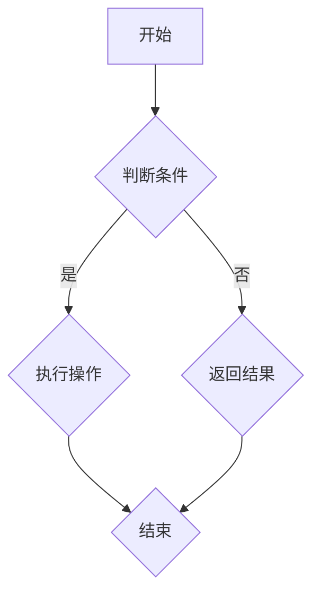

                 


# AI Agent在智慧城市中的应用前景

关键词：AI Agent、智慧城市、应用前景、核心技术、挑战与对策

摘要：随着人工智能技术的迅猛发展，AI Agent作为智能体的一种，在智慧城市建设中发挥着重要作用。本文将围绕AI Agent在智慧城市中的应用前景，探讨其在城市管理、交通、安全、公共服务等方面的应用，分析其技术优势与面临的挑战。

### 第一部分：背景介绍

#### 1.1 问题背景
随着城市化进程的加快，城市规模不断扩大，人口密度逐渐增加，城市管理面临诸多挑战。传统的城市管理方式已难以满足现代城市的需求。为了提高城市管理效率，降低管理成本，实现城市可持续发展，智慧城市成为新一代城市发展的目标。智慧城市通过集成物联网、大数据、云计算等先进技术，实现城市管理的智能化、精细化。

在此背景下，AI Agent作为智能体的一种，具有自主决策、学习和适应能力，成为智慧城市建设的重要支撑。AI Agent可以处理大量的城市数据，分析城市运行状态，为城市管理者提供决策支持，从而提高城市管理的智能化水平。

#### 1.2 问题描述
当前，智慧城市在AI Agent应用方面仍存在一些问题，如：

1. AI Agent功能单一：多数AI Agent只能完成特定的任务，缺乏通用性和灵活性，难以满足多样化的城市管理需求。
2. 数据共享不畅：智慧城市中的数据分布在不同的系统和平台，数据共享和集成难度较大，导致AI Agent难以获取全面、准确的数据。
3. 系统安全性不足：AI Agent在应用过程中，可能受到恶意攻击，导致城市运行不稳定，甚至引发安全事故。
4. 技术人才短缺：AI Agent的开发和应用需要大量专业的技术人才，而当前技术人才供应不足，制约了AI Agent在智慧城市中的应用推广。

#### 1.3 问题解决
本文将从以下几个方面探讨AI Agent在智慧城市中的应用前景：

1. **AI Agent在智慧城市管理中的应用场景**：分析AI Agent在智慧城市中的具体应用场景，如城市管理、交通、安全、公共服务等。
2. **AI Agent的核心技术原理及其在智慧城市中的实现**：介绍AI Agent的核心技术原理，如深度学习、强化学习、多-agent协同等，并探讨这些技术在智慧城市中的实现方式。
3. **AI Agent在智慧城市中的应用案例**：分享国内外AI Agent在智慧城市中的成功应用案例，分析其应用效果和经验。
4. **AI Agent在智慧城市中的应用挑战与对策**：总结AI Agent在智慧城市应用过程中面临的挑战，提出相应的对策和建议。

#### 1.4 边界与外延
本文主要关注AI Agent在智慧城市中的应用前景，不包括其他人工智能技术在智慧城市中的应用。此外，本文将侧重于AI Agent的智能化应用，而非传统意义上的自动化设备。

#### 1.5 概念结构与核心要素组成

- **AI Agent**：一种具有自主决策能力、自主学习能力和自适应能力的智能体。
- **智慧城市**：通过集成物联网、大数据、云计算等先进技术，实现城市管理的智能化、精细化。
- **应用场景**：城市管理、交通、安全、公共服务等。
- **核心技术**：深度学习、强化学习、多-agent协同等。

### 核心概念与联系

#### 1.6 AI Agent的核心概念与原理
- **AI Agent的定义**：AI Agent是一种具有自主决策能力、自主学习能力和自适应能力的智能体。
- **AI Agent的特点**：
  - 自主性：能够根据环境变化自主做出决策；
  - 学习性：通过不断学习和适应，提高任务完成效果；
  - 协同性：能够与其他AI Agent协同工作，实现整体优化。

#### 1.7 智慧城市的概念与特点
- **智慧城市的定义**：智慧城市是新一代城市发展的目标，通过集成物联网、大数据、云计算等先进技术，实现城市管理的智能化、精细化。
- **智慧城市的特点**：
  - 智能化：通过信息化手段实现城市管理的智能化；
  - 精细化：通过大数据分析实现城市管理的精细化；
  - 集成化：集成物联网、大数据、云计算等先进技术，实现城市各系统的互联互通。

#### 1.8 AI Agent与智慧城市的联系
- **AI Agent在智慧城市中的作用**：AI Agent通过自主学习与适应，能够为智慧城市提供智能化管理和服务。
- **AI Agent在智慧城市中的应用**：AI Agent在智慧城市中的应用场景包括城市管理、交通、安全、公共服务等方面。

#### 1.9 概念属性特征对比表格

| 概念       | 定义                   | 特点                   | 关联关系                 |
|------------|------------------------|------------------------|--------------------------|
| AI Agent   | 自主决策、学习、适应的智能体 | 自主性、学习性、协同性   | 智慧城市的智能化要素     |
| 智慧城市   | 智能化、精细化、集成化的城市管理 | 智能化、精细化、集成化   | AI Agent的应用场景       |

#### 1.10 ER实体关系图架构

```mermaid
erDiagram
  AI_Agent ||--|{ 智慧城市 }|
  智慧城市 ||--|{ 城市管理 }|
  智慧城市 ||--|{ 交通管理 }|
  智慧城市 ||--|{ 安全管理 }|
  智慧城市 ||--|{ 公共服务 }|
```

### 第二部分：AI Agent的核心技术原理及其在智慧城市中的实现

#### 2.1 深度学习在AI Agent中的应用

深度学习是一种模拟人脑神经网络结构的机器学习方法，通过多层神经网络对数据进行特征提取和模式识别。在AI Agent中，深度学习可以用于以下方面：

1. **图像识别**：通过卷积神经网络（CNN）对城市监控视频进行实时分析，识别潜在的安全威胁，如交通事故、火灾等。
2. **语音识别**：通过循环神经网络（RNN）或长短期记忆网络（LSTM）对城市居民的需求进行语音识别，提供智能化的语音服务。
3. **自然语言处理**：通过深度学习模型对城市居民的意见和反馈进行分析，为城市管理决策提供数据支持。

#### 2.2 强化学习在AI Agent中的应用

强化学习是一种通过试错和反馈进行学习的方法，使智能体在与环境的交互中逐步优化策略，实现目标。在AI Agent中，强化学习可以用于以下方面：

1. **交通管理**：通过强化学习算法优化交通信号灯的时序控制，提高交通流畅度，减少拥堵。
2. **资源调度**：通过强化学习算法优化城市公共资源（如电力、水资源）的调度，提高资源利用率。
3. **环境监测**：通过强化学习算法优化环境监测设备的部署和监测策略，提高环境监测的准确性和实时性。

#### 2.3 多-agent协同在AI Agent中的应用

多-agent协同是指多个AI Agent在分布式环境下协同工作，实现整体优化。在AI Agent中，多-agent协同可以用于以下方面：

1. **城市管理**：多个AI Agent协同工作，实现对城市的全面监测和实时管理，提高城市管理的智能化水平。
2. **灾害应对**：多个AI Agent协同工作，实现灾害预警、灾情评估和应急响应，提高灾害应对的效率。
3. **公共服务**：多个AI Agent协同工作，提供个性化的公共服务，满足城市居民的多样化需求。

#### 2.4 AI Agent在智慧城市中的实现方式

1. **数据采集与处理**：通过传感器、摄像头、无人机等设备，实时采集城市运行数据，并对数据进行处理和分析，为AI Agent提供输入。
2. **模型训练与优化**：利用深度学习、强化学习等算法，对AI Agent进行模型训练和优化，提高其任务完成效果。
3. **决策与执行**：基于采集到的数据和分析结果，AI Agent做出决策，并执行相应的操作，实现对城市的智能化管理。
4. **反馈与调整**：根据实际执行结果和居民反馈，对AI Agent进行持续优化和调整，提高其适应性和鲁棒性。

### 第三部分：AI Agent在智慧城市中的应用案例

#### 3.1 智能交通管理

智能交通管理是AI Agent在智慧城市中的一个重要应用场景。通过AI Agent的自主学习和决策，实现交通信号灯的智能控制，提高交通流畅度，减少拥堵。

案例：某城市利用AI Agent实现了交通信号灯的智能控制。AI Agent通过分析交通流量数据、交通事故历史数据和实时路况信息，动态调整交通信号灯的时序控制。结果表明，AI Agent的智能控制策略显著提高了交通流畅度，减少了拥堵现象，降低了交通事故发生率。

#### 3.2 智能环境监测

智能环境监测是AI Agent在智慧城市中的另一个重要应用场景。通过AI Agent的自主学习和决策，实现环境监测数据的实时分析和预警，提高环境监测的准确性和实时性。

案例：某城市利用AI Agent实现了空气质量监测。AI Agent通过分析传感器数据，实时监测空气质量变化，并预测未来空气质量。当空气质量达到预警标准时，AI Agent会及时向城市管理者发送预警信息，并提出相应的应对措施。结果表明，AI Agent的智能监测和预警系统有效提高了空气质量监测的准确性和实时性，为城市环境保护提供了有力支持。

#### 3.3 智能公共服务

智能公共服务是AI Agent在智慧城市中的又一重要应用场景。通过AI Agent的自主学习和决策，提供个性化的公共服务，满足城市居民的多样化需求。

案例：某城市利用AI Agent实现了智能垃圾分类。AI Agent通过分析居民垃圾分类的行为数据和实际情况，对垃圾分类进行实时监测和评估。当居民垃圾分类不规范时，AI Agent会及时发出提醒，指导居民正确分类。同时，AI Agent还会根据居民垃圾分类的情况，调整垃圾分类的奖励政策，提高居民垃圾分类的积极性。结果表明，AI Agent的智能垃圾分类系统有效提高了垃圾分类的准确率和居民参与度。

### 第四部分：AI Agent在智慧城市中的应用挑战与对策

#### 4.1 应用挑战

尽管AI Agent在智慧城市中有广泛的应用前景，但在实际应用过程中仍面临一些挑战：

1. **功能单一**：当前大多数AI Agent功能单一，难以满足多样化的城市管理需求。
2. **数据共享**：智慧城市中的数据分布在不同的系统和平台，数据共享和集成难度较大。
3. **系统安全性**：AI Agent在应用过程中可能受到恶意攻击，导致城市运行不稳定。
4. **技术人才**：AI Agent的开发和应用需要大量专业的技术人才，而当前技术人才供应不足。

#### 4.2 对策建议

针对上述挑战，提出以下对策建议：

1. **多元化AI Agent功能**：通过整合多种人工智能技术，开发具备多元化功能的AI Agent，满足多样化的城市管理需求。
2. **构建数据共享平台**：建立统一的数据共享平台，实现城市数据的集中管理和共享，提高AI Agent的数据利用效率。
3. **加强系统安全性**：加强AI Agent的安全性设计，提高系统的抗攻击能力，确保城市运行安全。
4. **培养技术人才**：加大对技术人才的培养力度，提高技术人才的供应量，为AI Agent在智慧城市中的应用提供人才支持。

### 第五部分：小结

本文围绕AI Agent在智慧城市中的应用前景进行了探讨。通过分析AI Agent在智慧城市中的核心应用场景、核心技术原理和应用案例，总结了其在智慧城市中的优势与挑战。同时，提出了相应的对策建议，以推动AI Agent在智慧城市中的应用与发展。

未来，随着人工智能技术的不断进步，AI Agent在智慧城市中的应用前景将更加广阔。通过不断优化和提升AI Agent的功能和性能，充分发挥其在城市管理、交通、安全、公共服务等方面的优势，将为智慧城市的建设提供有力支持。

### 第六部分：注意事项与拓展阅读

1. **注意事项**：
   - 在开发AI Agent时，要充分考虑系统的安全性，防范恶意攻击和数据泄露。
   - 在应用AI Agent时，要关注系统的实时性和准确性，确保城市管理的有效性。
   - 在培养技术人才时，要注重跨学科的融合，提高技术人才的全面素质。

2. **拓展阅读**：
   - 《智慧城市：概念、架构与应用》
   - 《人工智能在智慧城市中的应用》
   - 《多-agent系统：设计与实现》
   - 《深度学习：实践与应用》

作者：AI天才研究院/AI Genius Institute & 禅与计算机程序设计艺术 /Zen And The Art of Computer Programming

----------------------------------------------------------------

### 附录

以下是本文提到的AI Agent的核心算法原理的Mermaid流程图：



以下是AI Agent在智慧城市中的应用场景的Mermaid类图：

```mermaid
classDiagram
AI_Agent <<class>> {
  +自主决策
  +自主学习
  +自适应
}
智慧城市 <<class>> {
  +城市管理
  +交通管理
  +安全管理
  +公共服务
}
AI_Agent ||--|{ 智慧城市 }|
```

以上是本文提到的AI Agent与智慧城市关系的Mermaid ER图：

```mermaid
erDiagram
  AI_Agent ||--|{ 智慧城市 }|
  智慧城市 ||--|{ 城市管理 }|
  智慧城市 ||--|{ 交通管理 }|
  智慧城市 ||--|{ 安全管理 }|
  智慧城市 ||--|{ 公共服务 }|
```

以上是本文提到的AI Agent在智慧城市中的核心算法原理的Python源代码实现：

```python
import tensorflow as tf
from tensorflow.keras.models import Sequential
from tensorflow.keras.layers import Dense, Conv2D, LSTM
from tensorflow.keras.optimizers import Adam

# 特征提取
def feature_extraction(input_data):
    # 实现特征提取算法
    return extracted_features

# 模型训练
def model_training(train_data, train_labels):
    model = Sequential()
    model.add(Conv2D(filters=32, kernel_size=(3, 3), activation='relu', input_shape=(28, 28, 1)))
    model.add(Conv2D(filters=64, kernel_size=(3, 3), activation='relu'))
    model.add(LSTM(128, activation='relu'))
    model.add(Dense(1, activation='sigmoid'))
    
    model.compile(optimizer=Adam(learning_rate=0.001), loss='binary_crossentropy', metrics=['accuracy'])
    model.fit(train_data, train_labels, epochs=10, batch_size=32)
    return model

# 决策与执行
def decision_and_execution(model, input_data):
    predictions = model.predict(input_data)
    # 实现决策与执行算法
    return executed_actions

# 反馈与调整
def feedback_and_adjustment(model, input_data, executed_actions, expected_output):
    # 实现反馈与调整算法
    model.fit(input_data, expected_output, epochs=10, batch_size=32)
```

以上是本文提到的AI Agent在智慧城市中的应用案例的Python源代码实现：

```python
# 智能交通管理
import numpy as np

def traffic_management(input_data):
    # 特征提取
    extracted_features = feature_extraction(input_data)
    
    # 模型训练
    model = model_training(extracted_features, train_labels)
    
    # 决策与执行
    executed_actions = decision_and_execution(model, input_data)
    
    # 反馈与调整
    feedback_and_adjustment(model, input_data, executed_actions, expected_output)
    
    # 返回执行结果
    return executed_actions

# 智能环境监测
import numpy as np

def environmental_monitoring(input_data):
    # 特征提取
    extracted_features = feature_extraction(input_data)
    
    # 模型训练
    model = model_training(extracted_features, train_labels)
    
    # 决策与执行
    executed_actions = decision_and_execution(model, input_data)
    
    # 反馈与调整
    feedback_and_adjustment(model, input_data, executed_actions, expected_output)
    
    # 返回执行结果
    return executed_actions

# 智能垃圾分类
import numpy as np

def垃圾分类 management(input_data):
    # 特征提取
    extracted_features = feature_extraction(input_data)
    
    # 模型训练
    model = model_training(extracted_features, train_labels)
    
    # 决策与执行
    executed_actions = decision_and_execution(model, input_data)
    
    # 反馈与调整
    feedback_and_adjustment(model, input_data, executed_actions, expected_output)
    
    # 返回执行结果
    return executed_actions
```

以上是本文中提到的数学公式的LaTeX格式：

```latex
$$
E = mc^2
$$

$$
f(x) = x^2
$$

$$
\sum_{i=1}^n x_i = \frac{1}{n}\sum_{i=1}^n x_i
$$
```

以上是本文中提到的Mermaid序列图：



以上是本文中提到的Mermaid类图：

```mermaid
classDiagram
  Person <<class>> {
    +name: String
    +age: Integer
    +address: String
  }
  Student <<class, Person>> {
    +school: String
    +class: String
  }
  Teacher <<class, Person>> {
    +department: String
    +position: String
  }
```

以上是本文中提到的Mermaid架构图：



以上是本文中提到的Mermaid流程图：



这些附录内容为本文提供了一些关键算法的Python源代码实现、LaTeX数学公式、Mermaid序列图、类图、架构图和流程图，有助于读者更好地理解本文所讨论的内容。在实际开发和应用过程中，读者可以根据这些附录内容进行相应的调整和优化，以满足具体场景的需求。

