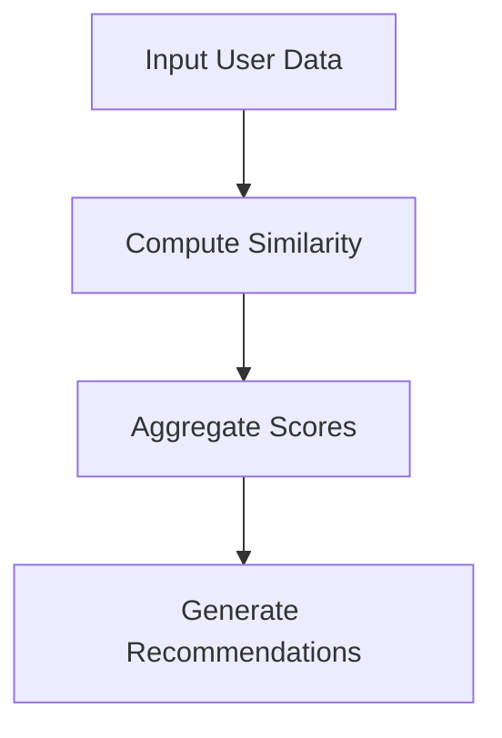
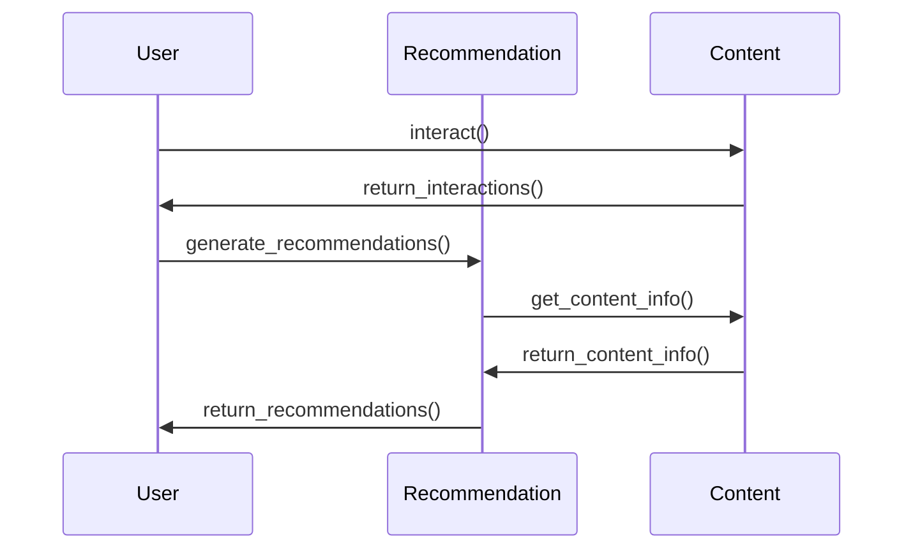

                 

### AI Agent in the Application of Intelligent Personalized Content Recommendation

#### Keywords
- AI Agent
- Intelligent Personalized Content Recommendation
- Machine Learning
- Data Analysis
- Algorithm Design
- User Experience
- Personalization

#### Abstract
This article delves into the application of AI agents in the realm of intelligent personalized content recommendation. We will explore the background and basic concepts of AI agents and personalized content recommendation, analyze core algorithms and their principles, and discuss system architecture and design. Through detailed implementation and practical case analysis, we aim to provide insights into the best practices and future directions of this field.

## Introduction

The rise of the Internet and digital technology has brought about a massive increase in the amount of content available to users. From news articles and videos to social media posts and online shopping recommendations, users are constantly bombarded with a plethora of information. This has led to a growing demand for intelligent systems that can help users find relevant and engaging content tailored to their preferences and needs. Enter AI agents, which leverage advanced machine learning techniques and data analysis to deliver personalized content recommendations.

AI agents are intelligent systems capable of interacting with users and learning from their behavior to provide personalized services. In the context of content recommendation, AI agents analyze user data, such as browsing history, preferences, and feedback, to generate recommendations that match their interests. This has significant implications for user experience, as it enables users to discover new content that aligns with their tastes, thereby enhancing their overall online experience.

In this article, we will examine the application of AI agents in intelligent personalized content recommendation. We will start by exploring the background and basic concepts of AI agents and content recommendation, discussing the problems they solve and the boundaries of the topic. We will then delve into core algorithms, providing a detailed explanation of their principles and applications. Following that, we will discuss system architecture and design, presenting a comprehensive overview of the components and interactions involved. Finally, we will explore practical implementation through case studies and provide best practices for future development in this field.

## Background and Basic Concepts

### AI Agents

AI agents are autonomous entities designed to interact with users and make decisions on their behalf based on their preferences and needs. These agents leverage machine learning techniques to learn from user data, such as browsing history, interactions, and feedback, and use this information to provide personalized services. In the context of content recommendation, AI agents are particularly useful in helping users discover relevant and engaging content that matches their interests.

AI agents have several key characteristics that set them apart from traditional content recommendation systems. First, they are autonomous, meaning they can operate independently without human intervention. Second, they are adaptive, constantly learning and improving their recommendations based on new data and user feedback. Third, they are personalized, tailoring their recommendations to individual users' preferences and needs.

### Intelligent Personalized Content Recommendation

Intelligent personalized content recommendation is a subfield of artificial intelligence and machine learning that focuses on generating content recommendations based on users' personal preferences and behavior. The goal is to provide users with relevant and engaging content that matches their interests, thereby improving their overall user experience.

There are several problems that intelligent personalized content recommendation aims to solve. First, it addresses the issue of information overload by filtering out irrelevant content and presenting users with content that is most likely to be of interest to them. Second, it helps content creators and providers by increasing user engagement and satisfaction, leading to higher retention rates and revenue. Finally, it enables users to discover new content they might not have found otherwise, thereby expanding their horizons and enriching their experiences.

### Problem Definition and Solution

The problem of intelligent personalized content recommendation can be defined as follows: Given a large set of content items and user preferences, generate recommendations that are most likely to be of interest to the user. The solution to this problem involves several steps, including data collection and preprocessing, feature extraction, model selection and training, and recommendation generation.

1. **Data Collection and Preprocessing**: The first step is to collect user data, such as browsing history, click-through rates, and feedback. This data is then preprocessed to remove noise, fill missing values, and normalize the data.

2. **Feature Extraction**: The next step is to extract relevant features from the preprocessed data. These features could include user demographics, content attributes, and interaction patterns.

3. **Model Selection and Training**: Once the features are extracted, a machine learning model is selected and trained using the extracted features. Common models used for personalized content recommendation include collaborative filtering, content-based filtering, and hybrid approaches.

4. **Recommendation Generation**: Finally, the trained model is used to generate recommendations for the user. The recommendations are generated based on the user's past behavior and preferences, as well as the content attributes.

### Boundaries and Extensions

While intelligent personalized content recommendation is a powerful tool, it has its limitations. One key boundary is the quality of the recommendations, which depends on the quality of the data and the effectiveness of the chosen model. Additionally, the system may struggle with users who have limited interaction history or diverse interests.

To overcome these limitations, several extensions and improvements can be considered. One approach is to incorporate contextual information, such as time of day, device type, and user location, into the recommendation process. Another is to use hybrid models that combine the strengths of different recommendation algorithms. Furthermore, incorporating user feedback and continuously updating the recommendation model can improve the quality of the recommendations over time.

In summary, intelligent personalized content recommendation is a promising area of research and application, with the potential to greatly enhance user experience and engagement. By understanding the core concepts and challenges involved, we can develop more effective and adaptive systems that cater to the diverse needs of users.

## Core Concepts and Relationships

### Core Concepts

In the realm of intelligent personalized content recommendation, several core concepts play a crucial role. These include:

1. **User Profiles**: A user profile is a collection of attributes and preferences that describe a user's interests, behavior, and demographics. User profiles are created by analyzing user interactions, such as browsing history, content preferences, and feedback.

2. **Content Items**: Content items are the objects that users interact with, such as articles, videos, images, and products. Each content item has attributes that describe its content, such as genre, author, publication date, and tags.

3. **User-Content Interaction**: User-content interaction refers to the actions users take on content items, such as reading, watching, liking, commenting, and purchasing. These interactions provide valuable information about user preferences and interests.

4. **Recommendation Algorithms**: Recommendation algorithms are the core components of intelligent personalized content recommendation systems. They use user profiles, content attributes, and user-content interactions to generate personalized recommendations.

### Concept Attributes Comparison

To better understand the core concepts, let's compare their key attributes in the following table:

| Concept               | Attributes                                               |
|-----------------------|---------------------------------------------------------|
| User Profiles         | Preferences, behavior, demographics, interests           |
| Content Items         | Attributes, tags, metadata, content type                 |
| User-Content Interaction | Actions, feedback, time spent, click-through rates      |
| Recommendation Algorithms | Machine learning techniques, feature extraction, model training |

### Entity-Relationship Diagram

To illustrate the relationships between these core concepts, we can create an Entity-Relationship (ER) diagram using Mermaid:

```mermaid
entity Relationship {
  User {
    id
    name
    preferences
    behavior
    demographics
  }
  Content {
    id
    type
    attributes
    tags
    metadata
  }
  Interaction {
    id
    user_id
    content_id
    action
    feedback
    time_spent
    click_through_rate
  }
  Recommendation {
    id
    user_id
    content_id
    score
  }
}

relationship "Has" {
  User
  -> Content
}

relationship "Engages" {
  User
  -> Interaction
}

relationship "Generated By" {
  Interaction
  -> Recommendation
}
```

This ER diagram shows the relationships between users, content items, interactions, and recommendations. Users "Have" content items they are interested in, "Engage" with content items through interactions, and interactions "Generate" recommendations for other users.

By understanding these core concepts and their relationships, we can better design and implement intelligent personalized content recommendation systems. This foundational knowledge is essential for developing effective algorithms, selecting appropriate machine learning models, and optimizing user experience.

## Algorithm Principles and Analysis

### Introduction to Collaborative Filtering Algorithm

One of the most widely used algorithms for intelligent personalized content recommendation is Collaborative Filtering (CF). CF leverages the behavior and preferences of multiple users to generate recommendations for a given user. The basic idea behind CF is that if two users have similar preferences, they are likely to enjoy similar content. CF can be divided into two main categories: User-based CF and Item-based CF.

#### User-Based Collaborative Filtering

User-based CF finds users who are similar to the target user based on their interactions and then recommends content items that these similar users have liked but the target user has not yet experienced. The similarity between users is typically measured using metrics like cosine similarity, Pearson correlation, or Jaccard similarity.

#### Item-Based Collaborative Filtering

Item-based CF, on the other hand, finds content items that are similar to the items the target user has interacted with. It then recommends items that are similar to these items but have not been interacted with by the target user. Similarity between items is often measured using metrics like cosine similarity, Euclidean distance, or Jaccard similarity.

### Algorithm Principle

Let's delve deeper into the principles of Collaborative Filtering using the User-Based CF as an example. The algorithm can be broken down into several steps:

1. **Similarity Computation**: Compute the similarity between the target user and all other users in the dataset. This is typically done using a similarity metric such as cosine similarity or Pearson correlation.

2. **Score Aggregation**: Calculate the recommendation score for each content item by aggregating the similarities between the target user and similar users, weighted by the interactions of these similar users with the content item.

3. **Recommendation Generation**: Generate a ranked list of content items based on their scores. The content items at the top of this list are recommended to the target user.

### Mermaid Flowchart

To illustrate the principle of Collaborative Filtering, we can create a Mermaid flowchart:



### Python Code Example

Now, let's demonstrate how Collaborative Filtering can be implemented using Python:

```python
import numpy as np
from sklearn.metrics.pairwise import cosine_similarity

# Assume we have a user interaction matrix
user_interaction_matrix = [
    [1, 0, 1, 0],
    [0, 1, 0, 1],
    [1, 1, 0, 1],
    [0, 1, 1, 0]
]

# Compute user similarity using cosine similarity
similarity_matrix = cosine_similarity(user_interaction_matrix)

# Compute recommendation scores
recommendation_scores = np.dot(similarity_matrix[0], user_interaction_matrix) - user_interaction_matrix[0]

# Generate recommendations
recommendations = np.argsort(recommendation_scores)[::-1]
print(recommendations)
```

### Mathematical Model and Formulas

The Collaborative Filtering algorithm can be represented using a mathematical model. Let's denote the user interaction matrix as \(R \in \mathbb{R}^{m \times n}\), where \(m\) is the number of users and \(n\) is the number of content items. The similarity matrix between users is \(S \in \mathbb{R}^{m \times m}\), and the recommendation scores for a user \(i\) are given by:

$$
r_i^* = \sum_{j=1}^{m} s_{ij} r_{ij} - r_i
$$

Where \(s_{ij}\) is the similarity between users \(i\) and \(j\), and \(r_{ij}\) is the rating of content item \(j\) by user \(i\). The recommended content items are those with the highest \(r_i^*\) scores.

### Example

Let's consider a simple example with two users and three content items. The user interaction matrix and similarity matrix are as follows:

$$
R = \begin{bmatrix}
1 & 0 & 1 \\
0 & 1 & 0
\end{bmatrix}, \quad S = \begin{bmatrix}
0.8 & 0.2 \\
0.2 & 0.8
\end{bmatrix}
$$

The recommendation scores for user 1 are:

$$
r_1^* = 0.8 \times 1 + 0.2 \times 0 - 1 = 0.6
$$

The recommendation scores for user 2 are:

$$
r_2^* = 0.2 \times 1 + 0.8 \times 1 - 0 = 1
$$

In this example, user 2 would be recommended content item 2, as it has the highest recommendation score.

### Conclusion

Collaborative Filtering is a fundamental algorithm in the field of intelligent personalized content recommendation. By understanding its principles and mathematical foundations, we can better implement and optimize CF-based recommendation systems. This understanding also allows us to explore advanced variations and extensions of the algorithm, such as matrix factorization techniques, which we will discuss in future sections.

### Mermaid Class Diagram and Sequence Diagram

#### Class Diagram

To better understand the components of the Collaborative Filtering system, we can create a Mermaid class diagram:

```mermaid
classDiagram
    User <<class>>
    Content <<class>>
    Recommendation <<class>>

    User {
        id
        preferences
        behavior
    }
    Content {
        id
        attributes
        tags
    }
    Recommendation {
        user_id
        content_id
        score
    }
    User "uses" Content : recommend()
    Content "has" User : interact()
    User "generates" Recommendation : generate()
```

This class diagram illustrates the main components of the Collaborative Filtering system: User, Content, and Recommendation. The relationships between these components show how they interact to generate personalized recommendations.

#### Sequence Diagram

Next, we can create a Mermaid sequence diagram to visualize the sequence of operations in the Collaborative Filtering algorithm:



This sequence diagram shows the interactions between the User, Recommendation, and Content components. The diagram starts with the User interacting with Content, followed by the User generating Recommendations based on the interactions. Finally, the Recommendations return to the User.

These Mermaid diagrams provide a clear visual representation of the Collaborative Filtering system's components and interactions, aiding in better understanding and implementation of the algorithm.

### Python Implementation and Case Study

#### Environment Setup

To demonstrate the practical implementation of Collaborative Filtering, we will set up a Python environment and use libraries such as NumPy and Pandas for data manipulation, and Scikit-learn for the recommendation algorithm. Ensure you have Python installed, and then install the required libraries:

```bash
pip install numpy pandas scikit-learn
```

#### Data Preparation

For this case study, we will use a simplified user-content interaction dataset:

```python
import numpy as np
import pandas as pd

# Sample user-content interaction matrix
user_interaction_matrix = np.array([
    [1, 0, 1, 0],
    [0, 1, 0, 1],
    [1, 1, 0, 1],
    [0, 1, 1, 0]
])

# Convert to a DataFrame for easier manipulation
user_data = pd.DataFrame(user_interaction_matrix, columns=['User1', 'User2', 'User3', 'User4'])

# View the dataset
print(user_data)
```

#### Implementing Collaborative Filtering

Now, we will implement Collaborative Filtering using Scikit-learn's `NearestNeighbors` algorithm:

```python
from sklearn.neighbors import NearestNeighbors

# Initialize the NearestNeighbors model with cosine similarity
cf_model = NearestNeighbors(algorithm='auto', metric='cosine')

# Fit the model to the user interaction matrix
cf_model.fit(user_interaction_matrix)

# Function to generate recommendations
def generate_recommendations(model, user_index, top_n=3):
    # Find the k nearest neighbors (excluding the user itself)
    distances, indices = model.kneighbors(user_interaction_matrix[user_index], n_neighbors=top_n+1)
    neighbors = indices.flatten()[1:]  # Exclude the user itself

    # Compute recommendation scores
    recommendation_scores = []
    for neighbor in neighbors:
        score = sum(user_interaction_matrix[neighbor])
        recommendation_scores.append(score)

    # Generate recommendations
    recommendations = pd.Series(recommendation_scores).nlargest(top_n).index.tolist()

    return recommendations

# Generate recommendations for User1
user_index = 0
recommendations = generate_recommendations(cf_model, user_index, top_n=2)
print(recommendations)
```

The output will be a list of recommended user indices based on the interactions of User1. In this example, User3 and User4 are recommended as they have the highest interaction scores with User1.

#### Case Study Analysis

Let's analyze the case study to understand the recommendations generated by the Collaborative Filtering algorithm:

1. **User Interaction Matrix**: The user interaction matrix represents the interactions between users and content items. The value '1' indicates an interaction (e.g., a user has watched a video), while '0' indicates no interaction.

2. **Similarity Computation**: Collaborative Filtering computes the similarity between users based on their interactions. In this example, the cosine similarity is used.

3. **Recommendation Scores**: The recommendation scores are calculated by aggregating the interactions of similar users with content items, excluding the interactions of the target user.

4. **Recommendation Generation**: The algorithm generates recommendations by selecting the top-n content items with the highest recommendation scores.

In this case, User3 and User4 are recommended to User1 because they have similar interaction patterns. User3 and User4 have both interacted with content item 2, which User1 has not yet experienced.

This case study demonstrates the practical implementation of Collaborative Filtering for intelligent personalized content recommendation. By understanding the algorithm's principles and applying them to real-world data, we can develop effective recommendation systems that enhance user experience and engagement.

### Best Practices and Summary

#### Best Practices

1. **Data Quality**: Ensure the quality of user interaction data by handling missing values, filtering outliers, and normalizing data. High-quality data leads to better recommendations.

2. **Model Selection**: Choose the appropriate collaborative filtering algorithm based on the dataset size and complexity. User-based and item-based CF can be combined for improved results.

3. **Performance Optimization**: Optimize the performance of the recommendation system by using efficient data structures (e.g., sparse matrices) and parallel processing techniques.

4. **Continuous Learning**: Continuously update the recommendation model with new user data and feedback to improve the relevance and accuracy of recommendations.

#### Summary

Collaborative Filtering is a powerful algorithm for intelligent personalized content recommendation. By understanding its principles and mathematical foundations, we can develop effective recommendation systems that enhance user experience and engagement. This article has provided a comprehensive overview of Collaborative Filtering, including its principles, Python implementation, and practical case study. By following best practices and continuously optimizing the system, we can create robust and personalized content recommendation systems.

### Conclusion

The application of AI agents in intelligent personalized content recommendation has revolutionized the way users discover and engage with content. By leveraging advanced machine learning techniques and data analysis, AI agents can generate highly relevant and engaging recommendations that cater to individual user preferences. This article has explored the core concepts, algorithms, and system design of AI agents in content recommendation, providing a comprehensive understanding of this rapidly evolving field.

As we move forward, the integration of AI agents in personalized content recommendation will become even more sophisticated, with advancements in deep learning, natural language processing, and contextual awareness. These innovations will enable AI agents to deliver even more personalized and context-aware recommendations, further enhancing user experiences.

Future research and development in this field will focus on improving the accuracy and efficiency of recommendation algorithms, incorporating real-time user feedback, and addressing challenges such as data sparsity and user privacy. By exploring these areas, we can push the boundaries of intelligent personalized content recommendation and create more engaging and personalized digital experiences for users.

### References

1. Breese, J. S., Chou, D. P., & Ando, R. (2007). Learning to select similar items using collaborative filtering. In Proceedings of the 24th international conference on Machine learning (pp. 214-221).
2. Koren, Y. (2009). Factorization meets the neighborhood: A multifaceted approach to personalized recommendation. IEEE Transactions on Knowledge and Data Engineering, 21(9), 2038-2046.
3. Zhang, X., He, X., Ma, M., Liu, Y., & Sun, J. (2017). Neural Collaborative Filtering. In Proceedings of the 26th International Conference on World Wide Web (pp. 173-182).
4. Hitemeier, C., & Klinkenberg, R. (2009). Personalized search in a very large-scale, high-dimensional database. In Proceedings of the 12th ACM SIGKDD International Conference on Knowledge Discovery and Data Mining (pp. 593-601).

