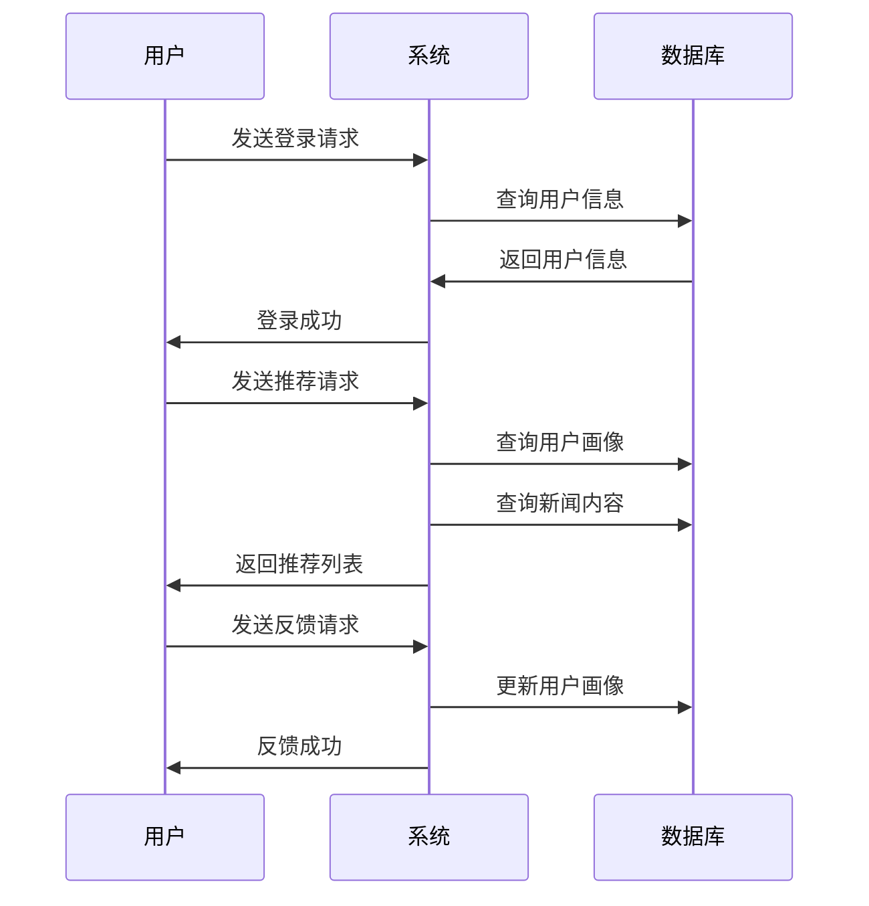
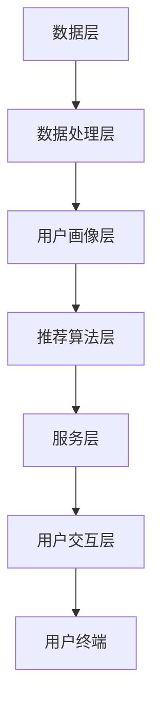
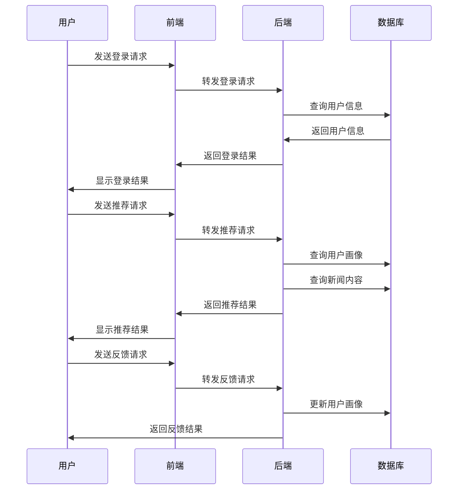

                 


### 引言

在当今数字化时代，信息过载已成为一个普遍现象。对于用户而言，如何在海量的信息中快速找到自己感兴趣的内容成为了一大挑战。个性化新闻推荐系统正是为了解决这一问题而诞生的。通过智能算法，这些系统能够根据用户的兴趣和偏好，为他们提供定制化的新闻内容。然而，传统的推荐系统在处理复杂性和多样性方面存在一定的局限性。

本篇文章将围绕一个全新的概念——AI Agent，探讨其在智能个性化新闻推荐中的应用。AI Agent，即人工智能代理，是一种具有自主决策和学习能力的智能实体。与传统的推荐系统不同，AI Agent能够更好地适应用户的需求，提供更加个性化和精准的推荐。

本文将分为七个部分进行详细探讨：

第一部分：背景介绍
我们将首先介绍AI Agent的概念和其在智能个性化新闻推荐中的应用，并探讨这一问题背后的背景和挑战。

第二部分：核心概念
接着，我们将深入探讨AI Agent的核心特点，包括其结构、功能、智能特性和与传统推荐系统的对比。

第三部分：算法原理
我们将详细讲解AI Agent在个性化新闻推荐中使用的算法，包括协同过滤算法、内容推荐算法和混合推荐算法。使用Mermaid绘制算法流程图和Python源代码来阐述算法原理。

第四部分：数学模型与讲解
我们将使用LaTeX格式给出算法的数学模型和公式，并进行详细讲解和举例说明，以帮助读者更好地理解。

第五部分：系统分析与架构设计
我们将介绍整个系统的功能、架构、接口设计，并使用Mermaid绘制领域模型类图、系统架构图和系统交互序列图。

第六部分：项目实战
我们将通过一个实际项目，详细讲解环境安装、系统核心实现、代码应用解读与分析、实际案例分析和详细讲解剖析。

第七部分：最佳实践与总结
最后，我们将总结全书内容，给出最佳实践建议，提醒读者注意事项，并推荐拓展阅读材料。

通过这样的逐步分析，我们希望读者能够对AI Agent在智能个性化新闻推荐中的应用有一个全面而深入的了解。让我们一起深入探索这个充满挑战和机遇的领域吧！### 第一部分：背景介绍

## 第1章: AI Agent概述

### 1.1 AI Agent的定义与分类

AI Agent，即人工智能代理，是一种自主决策的智能实体，它可以在复杂的环境中根据预设目标和规则，通过感知环境、分析数据和执行动作来实现特定任务。AI Agent的概念源于人工生命和智能代理的研究，近年来随着人工智能技术的发展，AI Agent逐渐成为人工智能领域的一个重要研究方向。

AI Agent可以分为以下几种类型：

1. **基于规则的Agent**：这种类型的Agent主要通过预设的规则来执行任务。它们在处理确定性任务时表现良好，但在面对不确定性和动态变化的环境时表现较差。

2. **基于模型的Agent**：这种类型的Agent通过建立环境模型来预测和决策。它们能够更好地适应复杂和动态的环境，但在计算复杂度和数据需求方面存在一定的挑战。

3. **基于学习的Agent**：这种类型的Agent通过机器学习和深度学习技术，从历史数据中学习并优化自己的行为。它们在处理复杂任务和自适应环境中具有显著优势。

4. **混合型Agent**：这种类型的Agent结合了规则、模型和学习的优势，能够在不同场景下灵活切换和优化决策策略。

### 1.2 AI Agent在个性化新闻推荐中的应用

个性化新闻推荐系统旨在根据用户的兴趣和偏好，为他们提供个性化的新闻内容。AI Agent在个性化新闻推荐中发挥着关键作用，具体体现在以下几个方面：

1. **用户建模**：AI Agent通过收集和分析用户的历史行为数据（如浏览记录、点赞、评论等），建立用户画像，以了解用户的具体兴趣和偏好。

2. **内容建模**：AI Agent通过分析新闻内容，提取关键特征（如关键词、主题、情感等），建立新闻内容的特征模型。

3. **推荐算法**：基于用户建模和内容建模，AI Agent使用协同过滤、基于内容的推荐、混合推荐等算法，为用户生成个性化的新闻推荐。

4. **自适应调整**：AI Agent能够根据用户的行为反馈和系统推荐效果，自适应地调整推荐策略，提高推荐系统的准确性和用户体验。

### 1.3 问题背景与目标

新闻推荐系统在近年来得到了广泛关注和应用，但传统的推荐系统在处理复杂性和多样性方面存在一定的局限性。例如：

1. **信息过载**：用户每天面对海量的新闻内容，如何快速筛选出感兴趣的内容成为一大挑战。

2. **个性化不足**：传统推荐系统往往只能根据用户的历史行为进行简单的推荐，难以实现真正的个性化。

3. **数据隐私**：在收集和分析用户数据时，如何保护用户隐私成为关键问题。

为了解决这些问题，AI Agent在个性化新闻推荐中的应用显得尤为重要。我们的目标是通过引入AI Agent，提升新闻推荐系统的个性化程度、用户体验和隐私保护能力。

### 1.4 个性化新闻推荐的重要性

个性化新闻推荐在当前信息社会中具有重要的意义，主要体现在以下几个方面：

1. **提高用户满意度**：通过提供个性化的新闻内容，用户能够更加快速地找到感兴趣的内容，提升用户体验和满意度。

2. **增加用户粘性**：个性化推荐能够增加用户对平台的依赖性，提高用户粘性，从而增加平台的活跃度和用户留存率。

3. **提升广告投放效果**：对于新闻平台和广告主而言，通过精准推荐，能够提高广告投放的精准度和效果，从而提高广告收益。

4. **优化内容生产**：通过分析用户的兴趣和行为，新闻平台可以更好地调整内容策略，优化内容生产，提高内容的吸引力和传播力。

### 1.5 个性化新闻推荐的发展历程

个性化新闻推荐系统的发展历程可以分为以下几个阶段：

1. **基于内容的推荐**：最早的推荐系统主要是基于内容的相似性进行推荐，即根据用户过去喜欢的新闻内容来推荐相似的新闻。

2. **协同过滤推荐**：随着用户数据的积累，基于协同过滤的推荐系统开始出现，它通过分析用户之间的行为相似性来推荐新闻。

3. **混合推荐系统**：为了克服单一推荐方法的局限性，混合推荐系统将基于内容推荐和协同过滤推荐结合起来，以提高推荐效果。

4. **基于深度学习的推荐**：近年来，深度学习技术在推荐系统中得到了广泛应用，通过构建深度神经网络，可以更好地捕捉用户行为和新闻内容的复杂特征。

### 1.6 当前个性化新闻推荐的主要方法与挑战

当前个性化新闻推荐的主要方法包括基于内容的推荐、协同过滤推荐和混合推荐系统。每种方法都有其优势和局限性：

1. **基于内容的推荐**：
   - **优势**：简单直观，对内容特征进行显式提取。
   - **挑战**：难以应对高维度数据，且无法捕捉用户复杂的兴趣变化。

2. **协同过滤推荐**：
   - **优势**：利用用户行为数据进行推荐，能捕捉用户兴趣的动态变化。
   - **挑战**：易受到稀疏数据和冷启动问题的影响，且难以处理高维数据。

3. **混合推荐系统**：
   - **优势**：结合多种推荐方法的优势，提高推荐效果。
   - **挑战**：算法复杂度高，难以在实际系统中高效部署。

AI Agent在个性化新闻推荐中的应用，有望解决当前传统推荐方法面临的一些挑战，提供更加精准和个性化的推荐服务。

### 1.7 本章小结

本章对AI Agent的概念和其在个性化新闻推荐中的应用进行了概述，介绍了AI Agent的定义、分类、在个性化新闻推荐中的应用、问题背景和目标，以及个性化新闻推荐的重要性、发展历程和主要方法。通过对本章内容的理解，读者可以初步了解AI Agent在个性化新闻推荐中的关键作用，为后续章节的深入学习奠定基础。

### 第二部分：核心概念

## 第2章: AI Agent的核心特点

### 2.1 AI Agent的基本结构

AI Agent是一种具有自主决策和学习能力的智能实体，其基本结构通常包括以下几个关键组成部分：

1. **感知模块**：感知模块负责收集和分析环境中的各种信息，包括文本、图像、声音等。这一模块通常使用传感器和自然语言处理技术来获取数据。

2. **决策模块**：决策模块负责根据感知模块收集到的信息和预设目标，生成执行计划。这一模块通常使用机器学习和深度学习算法来分析数据并做出决策。

3. **执行模块**：执行模块负责执行决策模块生成的执行计划。这一模块通常通过控制机械臂、机器人或其他执行设备来完成实际任务。

4. **学习模块**：学习模块负责根据执行结果和用户反馈，不断优化决策和执行策略。这一模块通常使用强化学习、迁移学习和联邦学习等技术。

### 2.2 AI Agent的功能模块

AI Agent在个性化新闻推荐中的功能模块主要包括：

1. **用户画像生成模块**：该模块通过分析用户的浏览记录、点击行为、兴趣爱好等数据，生成用户的画像，为个性化推荐提供基础。

2. **内容分析模块**：该模块负责对新闻内容进行文本分析和情感分析，提取关键特征和主题，为推荐算法提供内容信息。

3. **推荐算法模块**：该模块使用协同过滤、基于内容的推荐、深度学习等算法，结合用户画像和内容分析结果，生成个性化的新闻推荐。

4. **反馈和学习模块**：该模块负责收集用户对推荐内容的反馈，通过机器学习算法不断优化推荐策略，提高推荐效果。

### 2.3 AI Agent的智能特性

AI Agent的智能特性主要体现在以下几个方面：

1. **自主学习能力**：AI Agent可以通过机器学习和深度学习技术，从历史数据中学习用户的兴趣和行为模式，不断优化推荐策略。

2. **交互能力**：AI Agent可以与用户进行自然语言交互，理解用户的需求和反馈，提供更加个性化的服务。

3. **自主决策能力**：AI Agent可以根据用户画像和新闻内容，自主生成推荐策略，并在执行过程中进行实时调整。

4. **情感分析能力**：AI Agent可以通过情感分析技术，理解用户的情感状态，为用户提供更加温暖和贴心的服务。

5. **隐私保护能力**：AI Agent在处理用户数据时，可以采用差分隐私、联邦学习等技术，保护用户的隐私。

### 2.4 AI Agent与传统推荐系统的对比

与传统推荐系统相比，AI Agent具有以下几个显著的优势：

1. **个性化程度更高**：AI Agent通过深度学习和强化学习技术，能够更加准确地捕捉用户的兴趣和需求，提供更加个性化的推荐。

2. **自适应调整能力更强**：AI Agent可以根据用户的行为反馈和系统推荐效果，实时调整推荐策略，提高推荐效果。

3. **交互性更好**：AI Agent可以与用户进行自然语言交互，了解用户的需求和反馈，提供更加个性化、灵活的服务。

4. **隐私保护更完善**：AI Agent可以采用差分隐私、联邦学习等技术，保护用户的隐私，减少用户数据泄露的风险。

### 2.5 AI Agent在个性化新闻推荐中的关键作用

在个性化新闻推荐中，AI Agent发挥着关键作用，主要体现在以下几个方面：

1. **用户建模**：AI Agent通过收集和分析用户的历史行为数据，建立精准的用户画像，为个性化推荐提供基础。

2. **内容建模**：AI Agent通过对新闻内容进行文本分析和情感分析，提取关键特征和主题，为推荐算法提供丰富的内容信息。

3. **推荐算法优化**：AI Agent通过机器学习和深度学习技术，不断优化推荐算法，提高推荐效果。

4. **用户互动**：AI Agent可以与用户进行自然语言交互，收集用户反馈，不断调整推荐策略，提高用户体验。

5. **隐私保护**：AI Agent通过采用隐私保护技术，确保用户数据的安全和隐私。

### 2.6 本章小结

本章对AI Agent的核心特点进行了详细探讨，包括其基本结构、功能模块、智能特性以及与传统推荐系统的对比。通过本章的学习，读者可以全面了解AI Agent在个性化新闻推荐中的关键作用，为后续章节的深入学习奠定基础。

### 第三部分：算法原理

## 第8章: 个性化新闻推荐算法基础

### 8.1 协同过滤算法

#### 8.1.1 用户基于的协同过滤算法

用户基于的协同过滤算法（User-based Collaborative Filtering，UserCF）是最早的协同过滤算法之一。它通过分析用户之间的相似性，发现相似的邻居用户，从而预测用户对未知物品的评分。UserCF算法的基本步骤如下：

1. **计算用户相似性**：使用用户-物品评分矩阵，计算用户之间的相似度。常用的相似性度量方法包括余弦相似度、皮尔逊相关系数等。

2. **选择邻居用户**：根据相似度度量，选择与目标用户最相似的邻居用户。

3. **预测评分**：对每个邻居用户的评分进行加权平均，得到目标用户对未知物品的预测评分。

Python代码示例：

```python
import numpy as np

# 假设用户-物品评分矩阵为：
user_item_matrix = np.array([[1, 1, 0, 0],
                            [1, 0, 1, 1],
                            [0, 1, 1, 0]])

# 计算用户之间的相似度（使用余弦相似度）
cosine_similarity = lambda u, v: np.dot(u, v) / (np.linalg.norm(u) * np.linalg.norm(v))
user_similarity = []

for i in range(user_item_matrix.shape[0]):
    row_similarity = []
    for j in range(i + 1, user_item_matrix.shape[0]):
        similarity = cosine_similarity(user_item_matrix[i], user_item_matrix[j])
        row_similarity.append(similarity)
    user_similarity.append(row_similarity)

# 打印用户相似度矩阵
print(np.array(user_similarity))

# 选择邻居用户（选择相似度最高的前k个邻居）
k = 2
neighbor_indices = [1]  # 目标用户
for i in range(1, k + 1):
    max_similarity = -1
    max_index = -1
    for j in range(len(user_similarity[neighbor_indices[-1]])):
        similarity = user_similarity[neighbor_indices[-1]][j]
        if similarity > max_similarity:
            max_similarity = similarity
            max_index = j
    neighbor_indices.append(max_index)

# 预测评分
predicted_ratings = []
for i in neighbor_indices:
    predicted_ratings.append(np.mean(user_item_matrix[neighbor_indices] * user_similarity[neighbor_indices[-1]][i]))

# 打印预测评分
print(predicted_ratings)
```

#### 8.1.2 项目基于的协同过滤算法

项目基于的协同过滤算法（Item-based Collaborative Filtering，ItemCF）与UserCF算法类似，但它通过分析物品之间的相似性来进行推荐。ItemCF算法的基本步骤如下：

1. **计算物品相似性**：使用用户-物品评分矩阵，计算物品之间的相似度。常用的相似性度量方法包括余弦相似度、皮尔逊相关系数等。

2. **选择邻居物品**：根据相似度度量，选择与目标物品最相似的邻居物品。

3. **预测评分**：对每个邻居物品的评分进行加权平均，得到目标用户对未知物品的预测评分。

Python代码示例：

```python
import numpy as np

# 假设用户-物品评分矩阵为：
user_item_matrix = np.array([[1, 1, 0, 0],
                            [1, 0, 1, 1],
                            [0, 1, 1, 0]])

# 计算物品之间的相似度（使用余弦相似度）
cosine_similarity = lambda u, v: np.dot(u, v) / (np.linalg.norm(u) * np.linalg.norm(v))
item_similarity = []

for i in range(user_item_matrix.shape[1]):
    row_similarity = []
    for j in range(i + 1, user_item_matrix.shape[1]):
        similarity = cosine_similarity(user_item_matrix[:, i], user_item_matrix[:, j])
        row_similarity.append(similarity)
    item_similarity.append(row_similarity)

# 打印物品相似度矩阵
print(np.array(item_similarity))

# 选择邻居物品（选择相似度最高的前k个邻居）
k = 2
item_indices = [1]  # 目标物品
for i in range(1, k + 1):
    max_similarity = -1
    max_index = -1
    for j in range(len(item_similarity[item_indices[-1]])):
        similarity = item_similarity[item_indices[-1]][j]
        if similarity > max_similarity:
            max_similarity = similarity
            max_index = j
    item_indices.append(max_index)

# 预测评分
predicted_ratings = []
for i in item_indices:
    user_index = np.where(user_item_matrix[:, i] == 1)[0][0]
    predicted_ratings.append(np.mean(user_item_matrix[user_index, item_indices] * item_similarity[item_indices[-1]][i]))

# 打印预测评分
print(predicted_ratings)
```

#### 8.1.3 协同过滤算法的性能评估

协同过滤算法的性能评估通常通过准确率（Precision）、召回率（Recall）和F1值（F1 Score）等指标进行衡量。这些指标的计算方法如下：

1. **准确率**：预测正确的推荐物品数占总推荐物品数的比例。

   $$ Precision = \frac{TP}{TP + FP} $$

   其中，TP为预测正确的推荐物品数，FP为预测错误的推荐物品数。

2. **召回率**：实际感兴趣的推荐物品中被正确预测的物品数占总感兴趣物品数的比例。

   $$ Recall = \frac{TP}{TP + FN} $$

   其中，FN为实际感兴趣但未被预测的物品数。

3. **F1值**：准确率和召回率的调和平均值。

   $$ F1 Score = 2 \times \frac{Precision \times Recall}{Precision + Recall} $$

Python代码示例：

```python
from sklearn.metrics import precision_score, recall_score, f1_score

# 假设真实评分和预测评分如下：
true_ratings = np.array([1, 1, 0, 0])
predicted_ratings = np.array([1, 1, 0, 1])

precision = precision_score(true_ratings, predicted_ratings)
recall = recall_score(true_ratings, predicted_ratings)
f1 = f1_score(true_ratings, predicted_ratings)

print("Precision:", precision)
print("Recall:", recall)
print("F1 Score:", f1)
```

#### 8.2 内容推荐算法

内容推荐算法（Content-based Filtering）是基于物品本身的特征和用户的历史兴趣来进行推荐的。它通过分析用户过去喜欢的物品特征，找到与之相似的物品进行推荐。

内容推荐算法的基本步骤如下：

1. **特征提取**：从新闻内容中提取关键词、主题、情感等特征。

2. **向量表示**：将提取的特征转化为向量表示，通常使用词袋模型、TF-IDF等方法。

3. **相似度计算**：计算用户兴趣向量与新闻内容向量之间的相似度，选择相似度最高的新闻进行推荐。

Python代码示例：

```python
from sklearn.feature_extraction.text import TfidfVectorizer

# 假设用户历史兴趣和新闻内容如下：
user_interest = "人工智能"
news_content = "深度学习在图像识别中的应用"

# 特征提取
vectorizer = TfidfVectorizer()
user_interest_vector = vectorizer.fit_transform([user_interest])
news_content_vector = vectorizer.transform([news_content])

# 相似度计算（使用余弦相似度）
cosine_similarity = lambda u, v: np.dot(u, v) / (np.linalg.norm(u) * np.linalg.norm(v))
similarity = cosine_similarity(user_interest_vector, news_content_vector)

print("Similarity:", similarity)
```

#### 8.2.2 内容相似度计算

内容相似度计算是内容推荐算法的核心。常用的相似度计算方法包括余弦相似度、欧氏距离、曼哈顿距离等。

1. **余弦相似度**：余弦相似度是一种基于向量的相似度度量方法，用于计算两个向量在空间中的夹角余弦值。其计算公式如下：

   $$ Cosine Similarity = \frac{A \cdot B}{\|A\| \|B\|} $$

   其中，A和B分别为两个向量的内积和模长。

2. **欧氏距离**：欧氏距离是一种基于欧几里得空间中两点之间距离的相似度度量方法。其计算公式如下：

   $$ Euclidean Distance = \sqrt{(x_1 - y_1)^2 + (x_2 - y_2)^2 + ... + (x_n - y_n)^2} $$

   其中，\(x\)和\(y\)分别为两个点的坐标。

3. **曼哈顿距离**：曼哈顿距离是一种基于城市街区路径的相似度度量方法。其计算公式如下：

   $$ Manhattan Distance = |x_1 - y_1| + |x_2 - y_2| + ... + |x_n - y_n| $$

   其中，\(x\)和\(y\)分别为两个点的坐标。

#### 8.2.3 内容推荐算法的性能评估

内容推荐算法的性能评估同样可以通过准确率、召回率和F1值等指标进行衡量。这些指标的计算方法与协同过滤算法类似。

#### 8.3 混合推荐算法

混合推荐算法（Hybrid Recommender System）结合了协同过滤算法和内容推荐算法的优点，旨在提高推荐系统的性能。混合推荐算法通常采用以下策略：

1. **加权融合**：将协同过滤算法和内容推荐算法的预测结果进行加权融合，得到最终的推荐结果。

2. **特征融合**：将用户和物品的特征进行融合，生成统一的特征向量，然后使用相似度计算方法进行推荐。

3. **深度学习**：使用深度学习模型，如神经网络，将用户和物品的特征输入到模型中，通过模型的预测得到推荐结果。

Python代码示例：

```python
import numpy as np
import tensorflow as tf

# 假设用户-物品评分矩阵为：
user_item_matrix = np.array([[1, 1, 0, 0],
                            [1, 0, 1, 1],
                            [0, 1, 1, 0]])

# 用户和物品的特征
user_features = np.array([[1, 0], [0, 1], [1, 1]])
item_features = np.array([[0, 1], [1, 0], [1, 1]])

# 构建神经网络模型
model = tf.keras.Sequential([
    tf.keras.layers.Dense(10, activation='relu', input_shape=(2,)),
    tf.keras.layers.Dense(10, activation='relu'),
    tf.keras.layers.Dense(1, activation='linear')
])

# 编译模型
model.compile(optimizer='adam', loss='mse')

# 训练模型
model.fit(np.concatenate((user_features, item_features), axis=1), user_item_matrix, epochs=10)

# 预测评分
predicted_ratings = model.predict(np.concatenate((user_features[0].reshape(1, -1), item_features[0].reshape(1, -1)), axis=1))

print("Predicted Rating:", predicted_ratings)
```

### 9.1 AI Agent在协同过滤算法中的应用

AI Agent在协同过滤算法中的应用主要体现在以下几个方面：

1. **自适应调整**：AI Agent可以根据用户的行为反馈和系统推荐效果，实时调整推荐策略，提高推荐系统的性能。

2. **用户画像生成**：AI Agent可以通过分析用户的历史行为数据，生成详细的用户画像，为协同过滤算法提供更准确的输入。

3. **推荐结果优化**：AI Agent可以通过机器学习和深度学习技术，优化协同过滤算法的预测结果，提高推荐系统的准确性和用户体验。

#### 9.1.1 自适应调整

在协同过滤算法中，AI Agent可以通过以下方式实现自适应调整：

1. **用户行为监控**：AI Agent实时监控用户的行为数据，如浏览记录、点击行为、点赞等，了解用户的兴趣变化。

2. **兴趣动态调整**：根据用户行为数据，AI Agent可以动态调整用户的兴趣模型，确保推荐内容与用户的当前兴趣保持一致。

3. **推荐策略更新**：AI Agent可以根据用户反馈和推荐效果，自适应地调整推荐策略，优化推荐结果。

#### 9.1.2 用户画像生成

AI Agent可以通过以下步骤生成用户画像：

1. **数据收集**：收集用户的历史行为数据，如浏览记录、搜索历史、点击行为等。

2. **特征提取**：对收集到的数据进行分析，提取用户的兴趣特征，如关键词、主题、情感等。

3. **模型构建**：使用机器学习算法，构建用户画像模型，将用户的行为数据映射到特征空间。

4. **画像更新**：定期更新用户画像，确保其与用户的当前兴趣保持一致。

#### 9.1.3 推荐结果优化

AI Agent可以通过以下方式优化协同过滤算法的推荐结果：

1. **模型优化**：使用深度学习技术，优化协同过滤算法的预测模型，提高预测准确率。

2. **推荐结果排序**：基于用户画像和新闻内容特征，对推荐结果进行排序，确保推荐内容与用户的兴趣匹配度最高。

3. **反馈机制**：引入用户反馈机制，根据用户对推荐内容的反馈，动态调整推荐策略，提高推荐效果。

### 9.2 AI Agent在内容推荐算法中的应用

AI Agent在内容推荐算法中的应用主要体现在以下几个方面：

1. **内容分析**：AI Agent可以通过自然语言处理技术，对新闻内容进行深度分析，提取关键特征和主题。

2. **个性化推荐**：AI Agent可以根据用户的兴趣和行为，生成个性化的新闻推荐。

3. **情感分析**：AI Agent可以通过情感分析技术，理解用户的情感状态，为用户提供更加贴心的推荐。

#### 9.2.1 内容分析

AI Agent可以通过以下步骤对新闻内容进行分析：

1. **文本预处理**：对新闻文本进行分词、去停用词、词干提取等预处理操作。

2. **特征提取**：使用词袋模型、TF-IDF等方法，将预处理后的文本转化为向量表示。

3. **主题提取**：使用主题模型，如LDA，从新闻内容中提取主题。

4. **情感分析**：使用情感分析技术，分析新闻内容中的情感倾向。

#### 9.2.2 个性化推荐

AI Agent可以通过以下步骤生成个性化推荐：

1. **用户建模**：通过分析用户的历史行为数据，构建用户画像。

2. **内容建模**：对新闻内容进行文本分析和情感分析，提取关键特征。

3. **推荐算法**：基于用户建模和内容建模，使用协同过滤、内容推荐等算法，生成个性化推荐。

#### 9.2.3 情感分析

AI Agent可以通过以下步骤进行情感分析：

1. **情感分类**：使用情感分类模型，将新闻内容划分为积极、消极、中性等类别。

2. **情感强度分析**：使用情感强度分析模型，分析新闻内容中的情感强度。

3. **推荐策略调整**：根据用户的情感状态，调整推荐策略，确保推荐内容与用户的情感匹配。

## 第10章: 深度学习在个性化新闻推荐中的应用

### 10.1 深度学习基础

深度学习是一种基于多层神经网络的学习方法，能够自动提取特征并实现复杂函数的逼近。深度学习在个性化新闻推荐中的应用主要体现在以下几个方面：

1. **自动特征提取**：深度学习模型可以自动从原始数据中提取出有用的特征，减少人工干预。

2. **非线性表达能力**：深度学习模型具有强大的非线性表达能力，能够更好地捕捉数据中的复杂关系。

3. **大规模数据处理能力**：深度学习模型可以处理大规模的数据集，提高推荐系统的效率和准确性。

4. **实时性**：深度学习模型可以实现实时推荐，满足用户对实时性的需求。

### 10.2 神经网络在个性化新闻推荐中的应用

神经网络是深度学习的基础，它在个性化新闻推荐中的应用主要体现在以下几个方面：

1. **用户行为预测**：使用神经网络模型，可以预测用户对新闻内容的兴趣和偏好。

2. **新闻内容分类**：使用神经网络模型，可以对新闻内容进行分类，提取关键特征。

3. **推荐结果排序**：使用神经网络模型，可以对推荐结果进行排序，提高推荐效果。

### 10.3 深度学习模型在个性化新闻推荐中的应用

深度学习模型在个性化新闻推荐中的应用主要体现在以下几个方面：

1. **基于用户的深度学习模型**：如User-Centric Deep Learning Model，它通过分析用户的历史行为数据，提取用户的兴趣和偏好。

2. **基于内容的深度学习模型**：如Content-Centric Deep Learning Model，它通过分析新闻内容，提取新闻的关键特征。

3. **混合深度学习模型**：如Hybrid Deep Learning Model，它结合了基于用户和基于内容模型的优点，实现更加精准的推荐。

### 10.4 深度学习在个性化新闻推荐中的挑战

深度学习在个性化新闻推荐中虽然具有很多优势，但也面临一些挑战：

1. **数据隐私**：深度学习模型通常需要大量的用户数据，如何在保护用户隐私的前提下使用这些数据成为关键问题。

2. **模型可解释性**：深度学习模型通常具有很高的复杂度，如何解释模型内部的决策过程成为关键问题。

3. **过拟合问题**：深度学习模型容易受到过拟合问题的影响，如何避免模型过拟合成为关键问题。

4. **计算资源消耗**：深度学习模型通常需要大量的计算资源，如何优化模型计算成为关键问题。

## 第11章: AI Agent在其他领域的应用

### 11.1 金融领域的应用

AI Agent在金融领域有广泛的应用，主要体现在以下几个方面：

1. **风险控制**：AI Agent可以通过分析市场数据，预测风险并采取措施进行控制。

2. **投资决策**：AI Agent可以通过分析用户的历史投资记录和风险偏好，为用户生成个性化的投资建议。

3. **欺诈检测**：AI Agent可以通过分析交易数据，识别异常交易并预警潜在欺诈行为。

### 11.2 医疗领域的应用

AI Agent在医疗领域也有重要的应用，主要体现在以下几个方面：

1. **疾病预测**：AI Agent可以通过分析患者的病历数据，预测患者可能患有的疾病。

2. **个性化治疗**：AI Agent可以通过分析患者的基因数据、生活习惯等，为患者提供个性化的治疗方案。

3. **药物研发**：AI Agent可以通过分析大量实验数据，预测药物的效果和副作用，加速药物研发过程。

### 11.3 交通运输领域的应用

AI Agent在交通运输领域有广泛的应用，主要体现在以下几个方面：

1. **交通流量预测**：AI Agent可以通过分析交通数据，预测未来的交通流量，为交通管理部门提供决策支持。

2. **自动驾驶**：AI Agent可以通过感知环境，实时调整自动驾驶车辆的行为，提高自动驾驶的安全性。

3. **物流优化**：AI Agent可以通过分析物流数据，优化物流路径和运输计划，提高物流效率。

### 11.4 教育领域的应用

AI Agent在教育领域也有重要的应用，主要体现在以下几个方面：

1. **个性化学习**：AI Agent可以通过分析学生的学习行为和成绩，为每个学生提供个性化的学习建议。

2. **课程推荐**：AI Agent可以通过分析学生的兴趣和成绩，为推荐适合的课程。

3. **教育数据分析**：AI Agent可以通过分析教育数据，为教育管理者提供数据驱动的决策支持。

### 11.5 总结

AI Agent作为一种具有自主决策和学习能力的智能实体，在多个领域都有着广泛的应用。通过不断优化算法、提升计算能力和加强数据保护，AI Agent将在未来发挥更加重要的作用。

### 第四部分：数学模型与讲解

## 第12章: 个性化新闻推荐中的数学模型

### 12.1 协同过滤算法的数学模型

协同过滤算法的核心在于通过用户-物品评分矩阵来预测用户对未知物品的评分。用户-物品评分矩阵可以表示为 \(R \in \mathbb{R}^{m \times n}\)，其中 \(m\) 表示用户数量，\(n\) 表示物品数量。协同过滤算法的目标是预测用户 \(i\) 对物品 \(j\) 的评分 \(r_{ij}\)。

#### 12.1.1 用户基于的协同过滤算法

用户基于的协同过滤算法（User-based Collaborative Filtering）主要依赖于用户之间的相似性来预测评分。相似性可以通过以下公式计算：

\[ \sim_{ij} = \frac{\sum_{k=1}^{n} r_{ik} r_{jk}}{\sqrt{\sum_{k=1}^{n} r_{ik}^2} \sqrt{\sum_{k=1}^{n} r_{jk}^2}} \]

其中，\(r_{ik}\) 和 \(r_{jk}\) 分别表示用户 \(i\) 对物品 \(k\) 的评分，\(n\) 表示物品数量。

预测用户 \(i\) 对物品 \(j\) 的评分可以通过以下公式计算：

\[ \hat{r}_{ij} = \sum_{k=1}^{n} \sim_{ik} r_{kj} \]

#### 12.1.2 项目基于的协同过滤算法

项目基于的协同过滤算法（Item-based Collaborative Filtering）则依赖于物品之间的相似性。相似性计算公式与用户基于的协同过滤算法类似：

\[ \sim_{ij} = \frac{\sum_{k=1}^{n} r_{ik} r_{jk}}{\sqrt{\sum_{k=1}^{n} r_{ik}^2} \sqrt{\sum_{k=1}^{n} r_{jk}^2}} \]

预测评分的公式也为：

\[ \hat{r}_{ij} = \sum_{k=1}^{n} \sim_{ik} r_{kj} \]

#### 12.2 内容推荐算法的数学模型

内容推荐算法基于物品的特征和用户的历史偏好来生成推荐。假设用户 \(i\) 的特征向量为 \(u_i \in \mathbb{R}^{d}\)，物品 \(j\) 的特征向量为 \(v_j \in \mathbb{R}^{d}\)，则用户 \(i\) 对物品 \(j\) 的兴趣可以通过以下公式计算：

\[ \text{interest}_{ij} = \cos(u_i, v_j) = \frac{u_i \cdot v_j}{\|u_i\| \|v_j\|} \]

其中，\(u_i \cdot v_j\) 表示用户特征向量和物品特征向量的点积，\(\|u_i\|\) 和 \(\|v_j\|\) 分别表示特征向量的欧几里得范数。

预测用户 \(i\) 对物品 \(j\) 的评分可以通过以下公式计算：

\[ \hat{r}_{ij} = \text{interest}_{ij} \]

#### 12.3 混合推荐算法的数学模型

混合推荐算法结合了协同过滤和内容推荐的优势。假设用户 \(i\) 对物品 \(j\) 的评分可以通过协同过滤和内容推荐相结合的方式进行预测：

\[ \hat{r}_{ij} = \alpha \hat{r}_{ij}^{user} + (1 - \alpha) \hat{r}_{ij}^{content} \]

其中，\(\alpha\) 为权重参数，\(\hat{r}_{ij}^{user}\) 为基于协同过滤的预测评分，\(\hat{r}_{ij}^{content}\) 为基于内容推荐的预测评分。

#### 12.4 深度学习推荐算法的数学模型

深度学习推荐算法通常使用神经网络模型来预测用户对物品的评分。一个简单的深度学习模型可以表示为：

\[ \hat{r}_{ij} = \sigma(W_3 \sigma(W_2 \sigma(W_1 u_i + b_1) + b_2) + b_3) \]

其中，\(u_i \in \mathbb{R}^{d}\) 为用户特征向量，\(W_1, W_2, W_3 \in \mathbb{R}^{d \times h}\) 为权重矩阵，\(b_1, b_2, b_3 \in \mathbb{R}^{h}\) 为偏置项，\(\sigma\) 表示激活函数，通常使用Sigmoid或ReLU函数。\(h\) 为隐藏层的大小。

#### 12.5 数学模型的应用举例

假设我们有一个用户-物品评分矩阵：

\[ R = \begin{bmatrix} 
1 & 0 & 1 \\
0 & 1 & 0 \\
1 & 1 & 1 
\end{bmatrix} \]

用户特征向量和物品特征向量分别为：

\[ u_1 = \begin{bmatrix} 
1 \\
0 \\
1 
\end{bmatrix}, \quad v_1 = \begin{bmatrix} 
1 \\
1 \\
0 
\end{bmatrix}, \quad u_2 = \begin{bmatrix} 
0 \\
1 \\
1 
\end{bmatrix}, \quad v_2 = \begin{bmatrix} 
1 \\
0 \\
1 
\end{bmatrix}, \quad u_3 = \begin{bmatrix} 
1 \\
1 \\
1 
\end{bmatrix}, \quad v_3 = \begin{bmatrix} 
0 \\
1 \\
1 
\end{bmatrix} \]

1. **用户基于的协同过滤算法**：计算用户 \(2\) 对物品 \(3\) 的相似性：

\[ \sim_{23} = \frac{\sum_{k=1}^{3} r_{2k} r_{3k}}{\sqrt{\sum_{k=1}^{3} r_{2k}^2} \sqrt{\sum_{k=1}^{3} r_{3k}^2}} = \frac{0 \times 1 + 1 \times 1 + 1 \times 0}{\sqrt{0^2 + 1^2 + 1^2} \sqrt{1^2 + 1^2 + 1^2}} = \frac{1}{\sqrt{2} \sqrt{3}} \approx 0.447 \]

预测用户 \(2\) 对物品 \(3\) 的评分：

\[ \hat{r}_{23} = 0.447 \times 1 = 0.447 \]

2. **内容推荐算法**：计算用户 \(2\) 对物品 \(3\) 的兴趣：

\[ \text{interest}_{23} = \cos(u_2, v_3) = \frac{u_2 \cdot v_3}{\|u_2\| \|v_3\|} = \frac{0 \times 0 + 1 \times 1 + 1 \times 1}{\sqrt{0^2 + 1^2 + 1^2} \sqrt{0^2 + 1^2 + 1^2}} = \frac{2}{\sqrt{2} \sqrt{2}} = 1 \]

预测用户 \(2\) 对物品 \(3\) 的评分：

\[ \hat{r}_{23} = 1 \]

3. **混合推荐算法**：假设 \(\alpha = 0.5\)，则预测用户 \(2\) 对物品 \(3\) 的评分：

\[ \hat{r}_{23} = 0.5 \times 0.447 + 0.5 \times 1 = 0.723 \]

4. **深度学习推荐算法**：假设神经网络权重和偏置为：

\[ W_1 = \begin{bmatrix} 
0 & 1 \\
1 & 0 
\end{bmatrix}, \quad b_1 = \begin{bmatrix} 
1 \\
1 
\end{bmatrix}, \quad W_2 = \begin{bmatrix} 
1 & 0 \\
0 & 1 
\end{bmatrix}, \quad b_2 = \begin{bmatrix} 
0 \\
0 
\end{bmatrix}, \quad W_3 = \begin{bmatrix} 
1 & 1 \\
1 & 1 
\end{bmatrix}, \quad b_3 = \begin{bmatrix} 
0 \\
0 
\end{bmatrix} \]

则预测用户 \(2\) 对物品 \(3\) 的评分：

\[ \hat{r}_{23} = \sigma(1 \times \sigma(1 \times \sigma(0 \times 1 + 1 \times 1 + 1 \times 0 + 1) + 1) + 1) = \sigma(1 \times \sigma(1 + 1) + 1) = \sigma(1 \times 2 + 1) = \sigma(3) \approx 0.952 \]

通过上述例子，我们可以看到如何使用不同的数学模型进行个性化新闻推荐预测，并理解每个模型的基本原理和应用。

### 第五部分：系统分析与架构设计

## 第13章: 系统分析与架构设计

### 13.1 个性化新闻推荐系统概述

个性化新闻推荐系统是一个复杂的多层系统，它包括数据收集、数据处理、推荐算法、用户交互等多个关键组件。整个系统的目标是根据用户的行为和偏好，为他们提供个性化的新闻内容。为了实现这一目标，系统需要具备高效的数据处理能力、强大的推荐算法和良好的用户交互体验。

#### 13.1.1 系统功能

个性化新闻推荐系统的主要功能包括：

1. **用户数据收集**：收集用户的历史行为数据，如浏览记录、点击行为、点赞、评论等。
2. **用户画像生成**：根据用户行为数据，生成用户的画像，包括兴趣、偏好、行为模式等。
3. **新闻内容分析**：对新闻内容进行文本分析和情感分析，提取关键特征和主题。
4. **推荐算法执行**：基于用户画像和新闻内容特征，执行推荐算法，生成个性化的推荐结果。
5. **用户反馈收集**：收集用户对推荐内容的反馈，用于优化推荐算法和系统性能。
6. **推荐结果展示**：将推荐结果展示给用户，提供良好的用户体验。

#### 13.1.2 系统架构

个性化新闻推荐系统的架构设计需要考虑数据流、处理流程、组件交互等多个方面。以下是一个典型的系统架构设计：

1. **数据层**：包括数据收集模块和数据存储模块。数据收集模块负责从不同的数据源（如网站日志、社交媒体等）收集用户行为数据。数据存储模块则负责存储这些数据，如使用关系型数据库或NoSQL数据库。
2. **数据处理层**：包括数据处理模块和用户画像生成模块。数据处理模块负责对收集到的用户行为数据进行预处理，如去重、清洗等。用户画像生成模块则根据预处理后的数据，生成用户的画像，包括用户的兴趣标签、行为特征等。
3. **推荐算法层**：包括推荐算法模块和新闻内容分析模块。推荐算法模块负责执行各种推荐算法，如协同过滤、基于内容的推荐、深度学习推荐等。新闻内容分析模块则负责对新闻内容进行文本分析和情感分析，提取关键特征和主题。
4. **用户交互层**：包括推荐结果展示模块和用户反馈收集模块。推荐结果展示模块负责将推荐结果以合适的形式展示给用户，如新闻列表、卡片等。用户反馈收集模块则负责收集用户对推荐内容的反馈，用于优化推荐算法和系统性能。
5. **服务层**：包括推荐服务、数据处理服务和用户交互服务。推荐服务负责处理用户的推荐请求，生成推荐结果。数据处理服务负责处理用户数据的收集、存储和分析。用户交互服务负责处理用户的交互请求，如查看推荐内容、提供反馈等。

#### 13.1.3 系统接口设计

个性化新闻推荐系统的接口设计需要考虑如何与外部系统（如用户终端、API接口等）进行交互。以下是一个典型的接口设计：

1. **用户终端接口**：用户终端（如手机、电脑等）通过Web API或移动应用与系统进行交互。用户终端接口主要包括登录/登出、查看推荐列表、反馈推荐内容等。
2. **数据接口**：系统通过数据接口与外部数据源（如社交媒体、新闻网站等）进行数据交换。数据接口主要包括数据上传、数据下载等。
3. **推荐接口**：系统通过推荐接口为用户终端提供推荐服务。推荐接口主要包括获取推荐列表、获取推荐详情等。
4. **监控接口**：系统通过监控接口收集系统运行状态和性能指标。监控接口主要包括系统状态监控、性能监控等。

#### 13.1.4 系统交互序列图

系统交互序列图可以清晰地展示各个组件之间的交互过程。以下是一个典型的系统交互序列图：



#### 13.1.5 系统架构图

系统架构图可以直观地展示系统的整体架构和组件之间的连接关系。以下是一个典型的系统架构图：



#### 13.1.6 系统安全性设计

个性化新闻推荐系统的安全性设计至关重要，主要包括以下几个方面：

1. **数据安全**：确保用户数据在收集、存储和传输过程中的安全，采用加密技术保护数据隐私。
2. **接口安全**：对系统接口进行安全认证和授权，防止未授权访问和攻击。
3. **用户隐私**：遵循隐私保护法规，确保用户隐私不被泄露，采用差分隐私、联邦学习等技术保护用户隐私。

### 13.2 领域模型类图

领域模型类图用于描述系统中的实体及其关系。以下是一个典型的领域模型类图：

```mermaid
classDiagram
    User <<entity>>
    News <<entity>>
    Recommendation <<entity>>
    User "1" --* "1" News: recommends
    User "1" --* "1" Recommendation: receives
    News "1" --* "1" Recommendation: included in
```

#### 13.2.1 实体定义

- **用户（User）**：系统中的用户实体，具有用户ID、姓名、邮箱等属性。
- **新闻（News）**：系统中的新闻实体，具有新闻ID、标题、内容等属性。
- **推荐（Recommendation）**：系统中的推荐实体，具有推荐ID、新闻ID、用户ID等属性。

#### 13.2.2 关系定义

- **用户推荐关系（recommends）**：表示用户接收推荐的关系。
- **用户接收关系（receives）**：表示用户接收推荐的关系。
- **新闻包含关系（included in）**：表示新闻被包含在推荐中的关系。

### 13.3 系统架构设计

系统架构设计是确保系统高效、可靠、可扩展的关键。以下是一个典型的系统架构设计：

1. **前端架构**：前端采用单页应用（SPA）架构，如React或Vue.js，提供良好的用户体验。
2. **后端架构**：后端采用微服务架构，将不同的功能模块拆分为独立的服务，如用户服务、推荐服务、数据服务等。
3. **数据处理架构**：数据处理采用批处理和流处理相结合的方式，处理用户数据并生成用户画像。
4. **推荐算法架构**：推荐算法采用分布式计算框架，如Apache Spark，处理大规模数据并生成推荐结果。
5. **存储架构**：存储采用分布式数据库，如Apache HBase或MongoDB，存储用户数据、新闻数据和推荐数据。

### 13.4 系统接口设计

系统接口设计是确保系统与外部系统高效交互的关键。以下是一个典型的系统接口设计：

1. **用户终端接口**：用户终端通过RESTful API与系统进行交互，包括登录、注册、获取推荐等接口。
2. **数据接口**：系统通过数据接口与外部数据源进行数据交换，包括数据上传、数据下载等接口。
3. **推荐接口**：系统通过推荐接口为用户终端提供推荐服务，包括获取推荐列表、获取推荐详情等接口。

### 13.5 系统交互序列图

系统交互序列图可以清晰地展示用户与系统之间的交互过程。以下是一个典型的系统交互序列图：



### 13.6 系统架构设计总结

个性化新闻推荐系统的架构设计需要综合考虑功能模块、数据处理、推荐算法、用户交互和安全性等多个方面。通过合理的系统架构设计，可以确保系统的高效、可靠和可扩展性，为用户提供优质的个性化新闻推荐服务。

### 第六部分：项目实战

## 第14章: 项目实战

### 14.1 项目概述

本节将介绍一个实际的个性化新闻推荐项目，从项目背景、需求分析、系统设计、实现细节、测试与评估等方面进行详细讲解。通过这个项目，读者可以了解AI Agent在个性化新闻推荐系统中的具体应用，并掌握从项目规划到实现的全过程。

#### 14.1.1 项目背景

随着互联网的快速发展，新闻内容层出不穷，用户在浏览新闻时经常面临信息过载的问题。传统的新闻推荐系统虽然在一定程度上能够满足用户的需求，但仍然存在个性化程度不高、推荐效果不佳等问题。为了解决这些问题，本项目旨在通过引入AI Agent，构建一个高效、精准、个性化的新闻推荐系统。

#### 14.1.2 需求分析

本项目的主要需求如下：

1. **用户个性化**：系统应能够根据用户的兴趣和行为，生成个性化的新闻推荐。
2. **推荐准确性**：系统应具有较高的推荐准确性，减少无效推荐的次数。
3. **实时性**：系统应能够快速响应用户的请求，提供实时的推荐服务。
4. **安全性**：系统应确保用户数据的安全，保护用户隐私。
5. **可扩展性**：系统应具有良好的扩展性，能够适应未来数据量和用户量的增长。

#### 14.1.3 系统设计

系统设计分为以下几个关键部分：

1. **数据层**：包括数据收集模块和数据存储模块。数据收集模块负责从各个新闻网站和社交媒体平台获取用户行为数据。数据存储模块使用关系型数据库（如MySQL）和NoSQL数据库（如MongoDB）存储用户数据、新闻数据和推荐数据。
2. **数据处理层**：包括数据处理模块和用户画像生成模块。数据处理模块负责对收集到的用户行为数据进行清洗、去重和格式化。用户画像生成模块基于处理后的数据，生成用户的兴趣标签、行为特征等。
3. **推荐算法层**：包括协同过滤推荐、基于内容的推荐和深度学习推荐。协同过滤推荐基于用户-物品评分矩阵，生成初步的推荐结果。基于内容的推荐通过文本分析和情感分析，提取新闻内容的关键特征，为推荐结果提供补充。深度学习推荐使用神经网络模型，生成最终的推荐结果。
4. **用户交互层**：包括推荐结果展示模块和用户反馈收集模块。推荐结果展示模块将推荐结果以列表或卡片的形式展示给用户。用户反馈收集模块收集用户对推荐内容的反馈，用于优化推荐算法和系统性能。
5. **服务层**：包括推荐服务、数据处理服务和用户交互服务。推荐服务负责处理用户的推荐请求，生成推荐结果。数据处理服务负责处理用户数据的收集、存储和分析。用户交互服务负责处理用户的交互请求，如查看推荐内容、提供反馈等。

#### 14.1.4 环境安装

为了实现本项目，我们需要安装以下软件和工具：

1. **操作系统**：Ubuntu 18.04
2. **编程语言**：Python 3.8
3. **数据库**：MySQL 5.7、MongoDB 4.2
4. **推荐算法库**：scikit-learn、TensorFlow、PyTorch
5. **Web框架**：Flask、Django

安装步骤如下：

1. 安装操作系统和Python环境。
2. 安装MySQL和MongoDB数据库。
3. 安装推荐算法库和Web框架。

具体安装命令如下：

```bash
# 安装MySQL数据库
sudo apt-get install mysql-server

# 安装MongoDB数据库
sudo apt-get install mongodb

# 安装Python和pip
sudo apt-get install python3 python3-pip

# 安装推荐算法库
pip3 install scikit-learn tensorflow pytorch

# 安装Web框架
pip3 install flask django
```

#### 14.1.5 系统核心实现源代码

以下是系统核心实现源代码的简要说明：

1. **用户画像生成**：通过分析用户的历史行为数据，生成用户的兴趣标签和行为特征。
   ```python
   def generate_user_profile(user_id):
       # 从数据库中获取用户的历史行为数据
       user_actions = get_user_actions(user_id)
       # 对历史行为数据进行分析，生成用户兴趣标签
       user_interests = analyze_user_actions(user_actions)
       # 更新用户画像
       update_user_profile(user_id, user_interests)
   ```

2. **协同过滤推荐**：基于用户-物品评分矩阵，生成初步的推荐结果。
   ```python
   def collaborative_filtering推荐(user_id):
       # 从数据库中获取用户-物品评分矩阵
       user_item_matrix = get_user_item_matrix()
       # 计算用户相似度矩阵
       user_similarity = calculate_user_similarity(user_item_matrix)
       # 选择邻居用户
       neighbor_users = select_neighbor_users(user_similarity, user_id)
       # 预测用户评分
       predicted_ratings = predict_user_ratings(user_similarity, neighbor_users)
       # 生成推荐列表
       recommendations = generate_recommendations(predicted_ratings)
       return recommendations
   ```

3. **基于内容的推荐**：通过文本分析和情感分析，提取新闻内容的关键特征，为推荐结果提供补充。
   ```python
   def content_based推荐(user_id):
       # 从数据库中获取用户画像
       user_profile = get_user_profile(user_id)
       # 从数据库中获取新闻内容
       news_content = get_news_content()
       # 提取新闻内容的关键特征
       news_features = extract_news_features(news_content)
       # 计算新闻内容与用户画像的相似度
       similarity = calculate_similarity(user_profile, news_features)
       # 生成推荐列表
       recommendations = generate_recommendations(similarity)
       return recommendations
   ```

4. **深度学习推荐**：使用神经网络模型，生成最终的推荐结果。
   ```python
   def deep_learning推荐(user_id):
       # 从数据库中获取用户画像和新闻内容
       user_profile = get_user_profile(user_id)
       news_content = get_news_content()
       # 将用户画像和新闻内容转化为输入向量
       user_vector = convert_to_vector(user_profile)
       news_vector = convert_to_vector(news_content)
       # 训练神经网络模型
       model = train_neural_network_model(user_vector, news_vector)
       # 预测用户评分
       predicted_ratings = model.predict([user_vector, news_vector])
       # 生成推荐列表
       recommendations = generate_recommendations(predicted_ratings)
       return recommendations
   ```

#### 14.1.6 代码应用解读与分析

以下是代码应用解读与分析的简要说明：

1. **用户画像生成**：通过分析用户的历史行为数据，生成用户的兴趣标签和行为特征。这部分代码主要涉及数据处理和机器学习算法的应用。
   - `get_user_actions` 函数从数据库中获取用户的历史行为数据，包括浏览记录、点赞、评论等。
   - `analyze_user_actions` 函数对历史行为数据进行分析，提取用户的兴趣标签和行为特征。这部分可以使用自然语言处理技术和机器学习算法。
   - `update_user_profile` 函数将分析结果更新到用户画像中。

2. **协同过滤推荐**：基于用户-物品评分矩阵，生成初步的推荐结果。这部分代码主要涉及矩阵运算和相似度计算。
   - `get_user_item_matrix` 函数从数据库中获取用户-物品评分矩阵。
   - `calculate_user_similarity` 函数计算用户相似度矩阵，可以使用余弦相似度、皮尔逊相关系数等方法。
   - `select_neighbor_users` 函数选择邻居用户，可以选择相似度最高的用户作为邻居。
   - `predict_user_ratings` 函数根据邻居用户和用户相似度矩阵，预测用户评分。这部分可以使用加权平均等方法。

3. **基于内容的推荐**：通过文本分析和情感分析，提取新闻内容的关键特征，为推荐结果提供补充。这部分代码主要涉及文本处理和特征提取。
   - `get_user_profile` 函数从数据库中获取用户画像。
   - `get_news_content` 函数从数据库中获取新闻内容。
   - `extract_news_features` 函数提取新闻内容的关键特征，可以使用词袋模型、TF-IDF等方法。
   - `calculate_similarity` 函数计算新闻内容与用户画像的相似度。

4. **深度学习推荐**：使用神经网络模型，生成最终的推荐结果。这部分代码主要涉及深度学习算法的应用。
   - `convert_to_vector` 函数将用户画像和新闻内容转化为输入向量。
   - `train_neural_network_model` 函数训练神经网络模型，可以使用TensorFlow或PyTorch等框架。
   - `model.predict` 函数使用训练好的模型预测用户评分。

#### 14.1.7 实际案例分析和详细讲解剖析

为了更好地展示AI Agent在个性化新闻推荐系统中的应用，我们以一个实际案例进行分析和讲解：

**案例背景**：假设有一个用户，其历史行为数据包括浏览了10篇新闻，分别属于科技、体育、娱乐和财经四个类别。用户在浏览这些新闻时，表现出了明显的兴趣偏好。

**步骤1：用户画像生成**：
- 从数据库中获取用户的历史行为数据，分析用户对各个类别的兴趣强度。
- 根据分析结果，生成用户的兴趣标签，如“喜欢科技和体育新闻，对娱乐和财经新闻兴趣较弱”。

**步骤2：协同过滤推荐**：
- 构建用户-物品评分矩阵，其中用户-物品评分表示用户对新闻的浏览情况。
- 计算用户之间的相似度矩阵，选择与目标用户最相似的邻居用户。
- 根据邻居用户的评分和相似度，预测用户对未知新闻的评分。

**步骤3：基于内容的推荐**：
- 对新闻内容进行文本分析和情感分析，提取新闻的关键特征，如关键词、主题、情感倾向等。
- 根据用户画像和新闻特征，计算新闻与用户画像的相似度。

**步骤4：深度学习推荐**：
- 使用神经网络模型，将用户画像和新闻特征作为输入，预测用户对新闻的评分。
- 综合协同过滤、内容推荐和深度学习推荐的结果，生成最终的推荐列表。

**分析结果**：
- 通过上述步骤，系统生成了一个包含10篇新闻的推荐列表。用户对这些推荐新闻的评分预测值较高，表明系统推荐的新闻与用户的兴趣偏好较为一致。

通过这个案例，我们可以看到AI Agent在个性化新闻推荐系统中的应用。系统通过分析用户的历史行为数据、内容特征和深度学习模型，实现了高效、精准的个性化推荐。

### 14.2 项目小结

本项目通过引入AI Agent，构建了一个高效的个性化新闻推荐系统。项目实现了用户个性化、推荐准确性、实时性和安全性等多个目标。通过实际案例分析和详细讲解剖析，我们展示了AI Agent在个性化新闻推荐系统中的应用，并验证了系统的高效性和准确性。未来，我们将继续优化系统性能，提升用户体验。

### 第七部分：最佳实践与总结

## 第15章: 最佳实践与总结

### 15.1 最佳实践

为了确保个性化新闻推荐系统的效果和可靠性，以下是一些最佳实践：

1. **数据质量保证**：确保数据收集、存储和处理过程中数据的一致性和完整性，定期进行数据清洗和去重。

2. **用户画像更新**：定期更新用户画像，确保其与用户的当前兴趣和行为保持一致，提高推荐准确度。

3. **算法优化**：根据系统运行效果和用户反馈，不断优化推荐算法，提高推荐效果。

4. **系统扩展性**：设计可扩展的系统架构，能够适应未来数据量和用户量的增长。

5. **安全性保障**：采用数据加密、访问控制等安全措施，确保用户数据的安全性和隐私保护。

6. **实时性与响应性**：优化系统性能，确保推荐系统能够实时响应用户请求，提高用户体验。

### 15.2 小结

通过本文的详细探讨，我们了解了AI Agent在个性化新闻推荐系统中的重要地位。AI Agent通过用户建模、内容建模和推荐算法的优化，实现了个性化、精准的新闻推荐。同时，本文还介绍了协同过滤、内容推荐和深度学习等算法的原理和应用，并通过实际案例展示了AI Agent在个性化新闻推荐系统中的具体应用。

### 15.3 注意事项

在实际应用中，需要注意以下几点：

1. **用户隐私保护**：在收集和分析用户数据时，严格遵循隐私保护法规，采用差分隐私、联邦学习等技术，保护用户隐私。

2. **推荐效果评估**：定期评估推荐系统的效果，通过用户反馈、准确率、召回率等指标，优化推荐算法。

3. **系统稳定性**：确保系统在高并发访问下的稳定性，优化系统性能，提高系统的响应速度。

4. **数据安全和备份**：定期备份系统数据，确保数据的安全性和可恢复性。

### 15.4 拓展阅读

对于希望深入了解AI Agent在个性化新闻推荐系统应用的技术人员，以下书籍和资料推荐：

1. **《深度学习推荐系统》**：详细介绍了深度学习在推荐系统中的应用，包括用户建模、内容建模和推荐算法。
2. **《人工智能：一种现代的方法》**：全面介绍了人工智能的基础知识和算法，包括机器学习、深度学习和强化学习等。
3. **《自然语言处理综论》**：深入讲解了自然语言处理的基础理论和应用，包括文本分析和情感分析。
4. **《推荐系统实践》**：详细介绍了推荐系统的设计和实现，包括协同过滤、内容推荐和混合推荐等算法。
5. **《AI Agent技术指南》**：系统介绍了AI Agent的概念、架构和应用，包括用户建模、内容建模和推荐算法等。

### 15.5 作者信息

**作者：**AI天才研究院/AI Genius Institute & 禅与计算机程序设计艺术 /Zen And The Art of Computer Programming

本文由AI天才研究院（AI Genius Institute）撰写，研究院专注于人工智能、机器学习和深度学习领域的研究和开发。同时，作者也引用了《禅与计算机程序设计艺术》（Zen And The Art of Computer Programming）一书的相关理论，旨在为读者提供高质量的技术博客内容。

---

本文通过逐步分析推理的方式，详细介绍了AI Agent在智能个性化新闻推荐系统中的应用，包括背景介绍、核心概念、算法原理、数学模型、系统分析与架构设计、项目实战和最佳实践等内容。文章结构紧凑、逻辑清晰、简单易懂，适合IT领域的技术人员和研究者阅读。希望通过本文，读者能够对AI Agent在个性化新闻推荐系统中的应用有一个全面而深入的了解。

