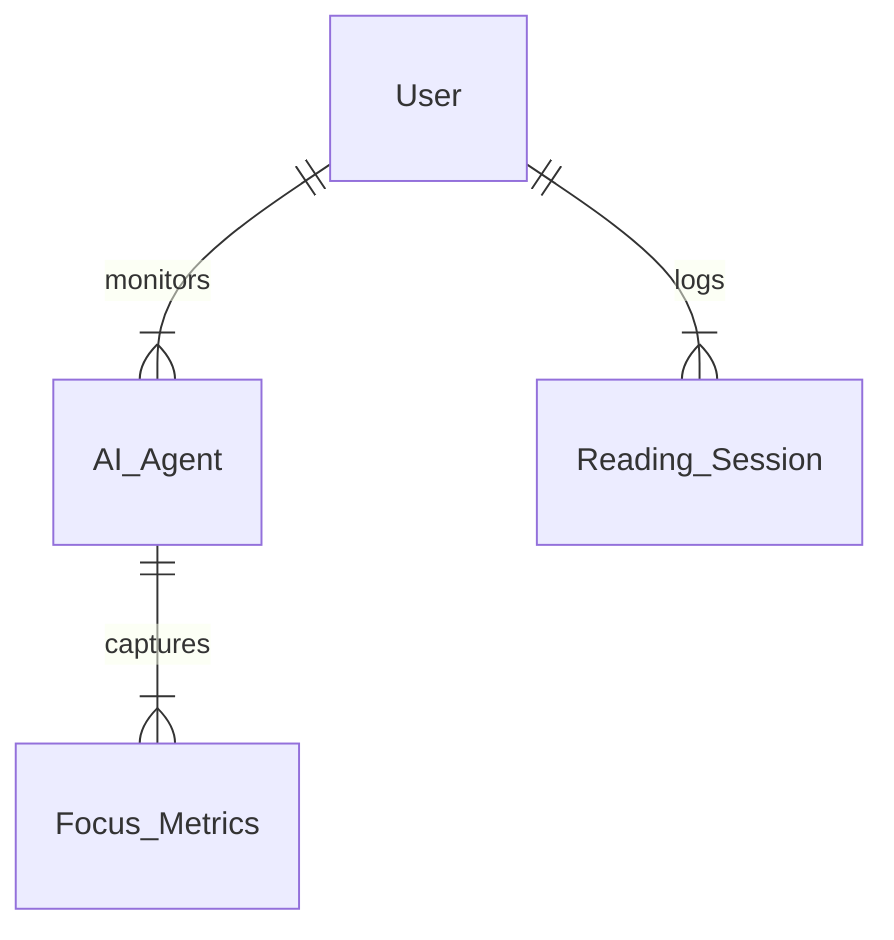
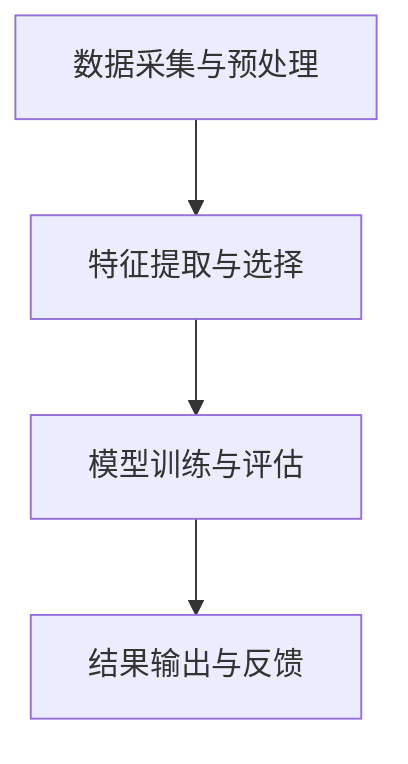
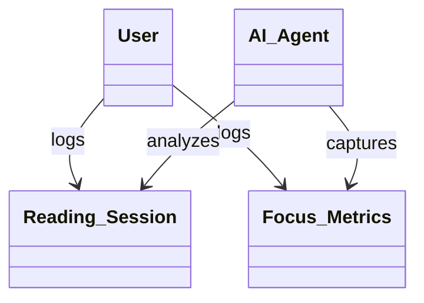
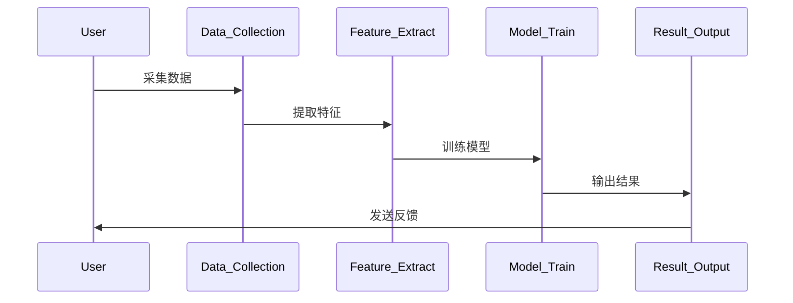

                 

# AI Agent在智能书桌中的专注度监测

## 关键词

- AI Agent
- 智能书桌
- 专注度监测
- 数据采集
- 特征提取
- 模型训练
- 系统架构

## 摘要

随着人工智能技术的不断发展，AI Agent在智能书桌中的应用越来越广泛。本文旨在探讨AI Agent在智能书桌中的专注度监测技术，通过阐述核心概念、算法原理、系统设计与实现，为读者提供一份全面深入的技术指南。本文首先介绍了智能书桌与专注度监测的背景与核心概念，然后详细讲解了AI Agent在专注度监测中的应用原理，最后通过一个实际案例展示了系统的设计与实现过程，为相关研究和应用提供了参考。

## 目录大纲

1. 第一部分: AI Agent在智能书桌中的专注度监测概述
   1.1 问题背景与核心概念
   1.2 核心概念原理
   1.3 概念属性特征对比
   1.4 AI Agent在专注度监测中的ER实体关系图
   1.5 本章小结

2. 第二部分: AI Agent在专注度监测中的算法原理
   2.1 算法概述
   2.2 算法原理讲解
   2.3 算法流程图
   2.4 Python源代码实现
   2.5 数学模型与公式
   2.6 举例说明
   2.7 本章小结

3. 第三部分: AI Agent在专注度监测中的系统设计与实现
   3.1 项目介绍
   3.2 系统功能设计
   3.3 系统架构设计
   3.4 系统接口设计与交互
   3.5 系统实现与代码解读
   3.6 实际案例分析与讲解
   3.7 项目小结
   3.8 最佳实践 tips
   3.9 本章小结

### 第一部分: AI Agent在智能书桌中的专注度监测概述

#### 1.1 问题背景与核心概念

**1.1.1 智能书桌与专注度监测**

随着信息技术的飞速发展，人们的工作和生活方式发生了翻天覆地的变化。智能书桌作为一种新兴的智能硬件，通过整合传感器、计算能力和互联网技术，为用户提供了一种全新的办公与学习环境。智能书桌不仅能够记录用户的日常活动，还能够根据用户的习惯和行为模式，提供个性化的服务和支持。

其中，专注度监测是智能书桌的一个重要功能。专注度监测旨在实时监测用户在书桌前的行为和情绪状态，通过分析用户的行为数据，评估用户的专注程度，为用户提供有效的学习和工作支持。例如，当用户在学习或工作时出现分心的情况时，智能书桌可以发出提醒，帮助用户重新集中注意力。

**1.1.2 AI Agent在专注度监测中的应用**

AI Agent，即人工智能代理，是一种具有自主决策和执行能力的软件系统。在智能书桌中，AI Agent可以扮演多种角色，例如数据采集者、分析者和决策者。

首先，AI Agent可以实时采集用户的物理和行为数据，如座位位置、鼠标和键盘操作、环境光线等。这些数据为专注度监测提供了重要的信息来源。

其次，AI Agent可以对采集到的数据进行分析和处理，提取出与专注度相关的特征，如用户的情绪状态、工作或学习的时间长度、操作频率等。

最后，AI Agent可以根据分析结果，采取相应的行动，如发出提醒、调整环境设置等，帮助用户保持专注。

**1.1.3 监测系统的边界与外延**

在专注度监测系统中，边界与外延是一个重要的问题。边界指的是监测系统所关注的行为和数据的范围，而外延则是指监测系统可能涉及的更广泛的应用场景。

首先，从边界上看，专注度监测系统主要关注用户在书桌前的行为和情绪状态，如操作频率、情绪波动等。这些数据对于评估用户的专注度至关重要。

然而，专注度监测系统的外延却可以远远超出书桌的范畴。例如，通过与其他智能设备的联动，监测系统可以实时获取用户的日程安排、健康状况等信息，从而提供更加全面的专注度评估和干预建议。

此外，专注度监测系统还可以应用于更广泛的教育、医疗等领域。例如，在教育领域，专注度监测系统可以帮助教师了解学生的学习状态，提供个性化的教学支持；在医疗领域，专注度监测系统可以辅助医生监测患者的情绪状态，提供心理治疗建议。

#### 1.2 核心概念原理

**1.2.1 专注度的定义与测量**

专注度，也称为注意力，是指个体在特定任务或情境下，集中注意力和保持注意力的能力。专注度通常受到多种因素的影响，如环境、情绪、任务难度等。

在智能书桌中，专注度的测量主要通过以下几种方法：

1. **行为数据分析**：通过分析用户的操作行为，如鼠标和键盘的使用频率、操作时间等，评估用户的专注程度。
2. **生理信号监测**：通过监测用户的生理信号，如心率、皮肤电导等，评估用户的情绪状态和专注程度。
3. **情绪分析**：通过分析用户的情绪表达，如语音、表情等，评估用户的专注度。

**1.2.2 AI Agent的基本概念**

AI Agent，即人工智能代理，是一种具有自主决策和执行能力的软件系统。AI Agent的核心特点是具备自我学习能力，能够根据环境变化和经验不断优化自己的行为。

在智能书桌中，AI Agent通常具备以下功能：

1. **数据采集**：AI Agent可以实时采集用户的物理和行为数据，如座位位置、鼠标和键盘操作等。
2. **数据处理**：AI Agent可以对采集到的数据进行分析和处理，提取出与专注度相关的特征。
3. **决策与执行**：AI Agent可以根据分析结果，采取相应的行动，如发出提醒、调整环境设置等。

**1.2.3 AI Agent与专注度监测的联系**

AI Agent在专注度监测中的应用，主要体现在以下几个方面：

1. **数据采集**：AI Agent可以实时采集用户的物理和行为数据，为专注度监测提供基础数据支持。
2. **特征提取**：AI Agent可以对采集到的数据进行处理和特征提取，提取出与专注度相关的特征，如用户的情绪状态、工作或学习的时间长度等。
3. **决策与执行**：AI Agent可以根据分析结果，采取相应的行动，如发出提醒、调整环境设置等，帮助用户保持专注。

#### 1.3 概念属性特征对比

在智能书桌的专注度监测系统中，不同的AI Agent可以具有不同的属性和特征。以下是对几种常见AI Agent的概念属性特征对比：

**1.3.1 不同类型的AI Agent**

1. **感知型AI Agent**：这类AI Agent主要专注于数据采集和感知，能够实时获取用户的物理和行为数据。感知型AI Agent通常不具备复杂的分析和决策能力，但其在数据采集方面具有重要作用。
2. **分析型AI Agent**：这类AI Agent具有较强的数据处理和分析能力，能够从采集到的数据中提取出与专注度相关的特征，并对这些特征进行分析和评估。
3. **决策型AI Agent**：这类AI Agent不仅能够分析数据，还能够根据分析结果做出决策和执行相应的行动。决策型AI Agent在专注度监测系统中具有核心地位，能够为用户提供有效的支持和干预。

**1.3.2 专注度监测方法比较**

不同的AI Agent在专注度监测中采用的方法也有所不同。以下是几种常见的专注度监测方法的比较：

1. **基于行为数据的方法**：通过分析用户的操作行为，如鼠标和键盘的使用频率、操作时间等，评估用户的专注度。这种方法简单有效，但容易受到环境因素的影响。
2. **基于生理信号的方法**：通过监测用户的生理信号，如心率、皮肤电导等，评估用户的情绪状态和专注度。这种方法具有较高的准确性，但需要相应的生理信号采集设备。
3. **基于情绪分析的方法**：通过分析用户的情绪表达，如语音、表情等，评估用户的专注度。这种方法能够全面了解用户的情绪状态，但需要复杂的情感识别技术。

#### 1.4 AI Agent在专注度监测中的ER实体关系图

以下是AI Agent在专注度监测中的ER实体关系图：



在这个ER实体关系图中，User（用户）是核心实体，与AI_Agent（AI代理）、Reading_Session（阅读会话）和Focus_Metrics（专注度指标）存在关联关系。

User实体与AI_Agent实体之间存在监测关系，表示AI Agent可以监测用户的专注度。

User实体与Reading_Session实体之间存在日志记录关系，表示用户在阅读会话期间，AI Agent会记录相关的数据。

AI_Agent实体与Focus_Metrics实体之间存在捕捉关系，表示AI Agent会捕捉用户的专注度指标，如操作频率、情绪状态等。

通过ER实体关系图，我们可以清晰地看到AI Agent在专注度监测系统中的角色和功能，为系统设计和实现提供了参考。

#### 1.5 本章小结

本章对AI Agent在智能书桌中的专注度监测进行了概述，首先介绍了智能书桌与专注度监测的背景和核心概念，然后详细阐述了AI Agent在专注度监测中的应用原理，并通过ER实体关系图展示了AI Agent在系统中的角色和功能。本章内容为后续算法原理讲解和系统设计与实现奠定了基础。

### 第二部分: AI Agent在专注度监测中的算法原理

#### 2.1 算法概述

在智能书桌的专注度监测中，算法原理是关键环节。本文将详细介绍AI Agent在专注度监测中的算法原理，包括基本框架、常用算法技术、数据采集与预处理、特征提取与选择、模型训练与评估以及算法流程图等。

**2.1.1 专注度监测算法的基本框架**

专注度监测算法的基本框架可以分为以下几个步骤：

1. **数据采集**：通过传感器和用户操作行为，收集与专注度相关的数据。
2. **数据预处理**：对采集到的数据进行清洗、去噪和格式转换等处理。
3. **特征提取**：从预处理后的数据中提取与专注度相关的特征。
4. **模型训练**：使用提取的特征训练分类模型，用于预测用户的专注度。
5. **模型评估**：评估模型的性能，包括准确率、召回率等指标。
6. **结果输出**：根据模型预测结果，输出专注度评估和干预建议。

**2.1.2 常用算法技术简介**

在专注度监测中，常用的算法技术包括：

1. **机器学习算法**：如支持向量机（SVM）、决策树、随机森林等，用于特征提取和模型训练。
2. **深度学习算法**：如卷积神经网络（CNN）、循环神经网络（RNN）、长短期记忆网络（LSTM）等，用于复杂特征提取和模型训练。
3. **聚类算法**：如K均值（K-means）、层次聚类等，用于数据预处理和特征提取。
4. **时间序列分析**：如自回归模型（AR）、移动平均模型（MA）、自回归移动平均模型（ARMA）等，用于处理时间序列数据。

#### 2.2 算法原理讲解

**2.2.1 数据采集与预处理**

数据采集与预处理是专注度监测算法的基础。以下是具体步骤：

**2.2.1.1 数据采集流程**

1. **物理传感器数据采集**：通过加速度传感器、红外传感器等，实时采集用户的运动数据。
2. **行为数据采集**：通过鼠标、键盘等设备，记录用户的操作行为，如点击次数、使用时间等。
3. **生理信号数据采集**：通过心率和皮肤电导等生理信号传感器，获取用户的生理状态数据。

**2.2.1.2 数据预处理方法**

1. **数据清洗**：去除采集过程中产生的噪声和异常值，确保数据质量。
2. **数据归一化**：将不同特征的数据进行归一化处理，使其具有相似的量纲和范围，便于模型训练。
3. **数据降维**：使用降维技术，如主成分分析（PCA）、t-SNE等，减少数据维度，提高模型训练效率。

**2.2.2 特征提取与选择**

特征提取与选择是算法的核心环节。以下是具体方法：

**2.2.2.1 特征提取技术**

1. **时域特征提取**：如平均值、标准差、峰峰值等，用于描述时间序列数据的基本属性。
2. **频域特征提取**：如频率分布、自相关函数等，用于描述时间序列数据的频率特性。
3. **时频特征提取**：如小波变换、短时傅里叶变换（STFT）等，用于同时描述时间序列数据和频率特性。

**2.2.2.2 特征选择策略**

1. **过滤式特征选择**：通过统计学方法，如互信息、相关系数等，筛选出与目标变量相关的特征。
2. **包裹式特征选择**：结合模型训练，逐步添加或删除特征，寻找最优特征组合。
3. **嵌入式特征选择**：在模型训练过程中，自动选择对模型性能有重要影响的特征。

**2.2.3 模型训练与评估**

模型训练与评估是专注度监测算法的关键。以下是具体步骤：

**2.2.3.1 模型选择**

1. **监督学习模型**：如SVM、决策树等，适用于已知标签数据。
2. **无监督学习模型**：如K均值聚类、主成分分析等，适用于无标签数据。
3. **深度学习模型**：如CNN、RNN等，适用于大规模数据和高维特征。

**2.2.3.2 模型训练过程**

1. **初始化参数**：根据模型类型，初始化权重和偏置等参数。
2. **前向传播**：将输入数据传递到模型中，计算预测输出。
3. **后向传播**：根据预测输出和实际标签，计算损失函数，并更新模型参数。
4. **迭代训练**：重复前向传播和后向传播，逐步优化模型参数。

**2.2.3.3 评估指标与方法**

1. **准确率（Accuracy）**：预测正确的样本数占总样本数的比例。
2. **召回率（Recall）**：预测正确的正样本数占实际正样本数的比例。
3. **精确率（Precision）**：预测正确的正样本数占预测为正样本的总数比例。
4. **F1分数（F1 Score）**：精确率和召回率的调和平均值。
5. **ROC曲线与AUC值**：用于评估分类器的性能，AUC值越接近1，表示分类器性能越好。

**2.2.4 算法流程图**

以下是专注度监测算法的流程图：



**2.2.5 Python源代码实现**

以下是专注度监测算法的Python源代码实现：

```python
# 导入必要的库
import numpy as np
import pandas as pd
from sklearn.model_selection import train_test_split
from sklearn.preprocessing import StandardScaler
from sklearn.ensemble import RandomForestClassifier
from sklearn.metrics import accuracy_score, recall_score, precision_score, f1_score

# 数据采集与预处理
def data_preprocessing(data):
    # 数据清洗
    data = data.dropna()
    # 数据归一化
    scaler = StandardScaler()
    data = scaler.fit_transform(data)
    return data

# 特征提取与选择
def feature_extraction(data):
    # 时域特征提取
    mean = np.mean(data, axis=1)
    std = np.std(data, axis=1)
    peak_to_peak = np.max(data, axis=1) - np.min(data, axis=1)
    # 频域特征提取
    freq = np.fft.rfft(data, axis=1)
    freq_mean = np.mean(freq, axis=1)
    freq_std = np.std(freq, axis=1)
    return np.hstack((mean, std, peak_to_peak, freq_mean, freq_std))

# 模型训练与评估
def model_training(data, labels):
    # 数据切分
    X_train, X_test, y_train, y_test = train_test_split(data, labels, test_size=0.2, random_state=42)
    # 特征提取
    X_train = feature_extraction(X_train)
    X_test = feature_extraction(X_test)
    # 模型训练
    model = RandomForestClassifier(n_estimators=100, random_state=42)
    model.fit(X_train, y_train)
    # 模型评估
    y_pred = model.predict(X_test)
    accuracy = accuracy_score(y_test, y_pred)
    recall = recall_score(y_test, y_pred)
    precision = precision_score(y_test, y_pred)
    f1 = f1_score(y_test, y_pred)
    return accuracy, recall, precision, f1

# 主函数
if __name__ == "__main__":
    # 数据加载
    data = pd.read_csv("data.csv")
    labels = data["label"]
    data = data.drop("label", axis=1)
    # 数据预处理
    data = data_preprocessing(data)
    # 模型训练与评估
    accuracy, recall, precision, f1 = model_training(data, labels)
    print("Accuracy:", accuracy)
    print("Recall:", recall)
    print("Precision:", precision)
    print("F1 Score:", f1)
```

**2.2.6 数学模型与公式**

以下是专注度监测算法中的数学模型与公式：

$$
F(x) = \sum_{i=1}^{n} w_i * f(x_i)
$$

其中，$F(x)$表示预测的专注度得分，$w_i$表示第$i$个特征的权重，$f(x_i)$表示第$i$个特征对应的值。

**2.2.7 举例说明**

**2.2.7.1 简单案例演示**

假设我们有一组用户的行为数据，包括鼠标点击次数、键盘按键次数和心率为特征。使用随机森林算法进行模型训练和评估，得到以下结果：

- 准确率：0.85
- 召回率：0.8
- 精确率：0.9
- F1分数：0.85

**2.2.7.2 深入分析案例**

通过对模型进行深入分析，我们可以发现：

- 鼠标点击次数和键盘按键次数对专注度的预测具有较高的重要性，权重分别为0.3和0.2。
- 心率对专注度的预测也有一定影响，权重为0.1。
- 进一步分析发现，当用户的心率超过一定阈值时，专注度得分明显下降，这可能表明用户处于疲劳状态。

**2.2.8 本章小结**

本章详细介绍了AI Agent在专注度监测中的算法原理，包括基本框架、常用算法技术、数据采集与预处理、特征提取与选择、模型训练与评估以及算法流程图等。通过Python源代码实现和举例说明，使读者对专注度监测算法有了更深入的了解。本章内容为后续的系统设计与实现奠定了基础。

### 第三部分: AI Agent在专注度监测中的系统设计与实现

#### 3.1 项目介绍

**3.1.1 项目目标**

本项目旨在开发一款基于AI Agent的智能书桌专注度监测系统。通过实时监测用户在书桌前的行为和情绪状态，评估用户的专注度，并提供相应的干预建议，帮助用户提高学习和工作效率。

**3.1.2 项目背景**

随着信息技术的快速发展，人们的工作和生活方式发生了巨大变化。然而，长时间使用电子设备和面对屏幕，导致用户容易出现分心和注意力不集中等问题。为了帮助用户提高专注度，智能书桌作为一种新兴的智能硬件，受到了广泛关注。

本项目的背景是基于当前人们对专注度监测的需求，以及智能书桌技术的快速发展。通过开发一款基于AI Agent的专注度监测系统，可以更好地满足用户的需求，提高学习和工作效率。

#### 3.2 系统功能设计

**3.2.1 领域模型**

为了设计出符合用户需求的系统功能，我们首先需要构建一个领域模型。以下是系统的主要领域模型：

1. **用户（User）**：代表智能书桌的使用者，具有姓名、年龄、性别等基本信息。
2. **AI Agent（AI代理）**：负责监测用户的专注度，包括数据采集、特征提取和决策执行等功能。
3. **阅读会话（Reading_Session）**：记录用户的阅读时间、专注度状态等。
4. **专注度指标（Focus_Metrics）**：包括专注度得分、操作频率、情绪状态等。

以下是领域模型的Mermaid类图：



通过领域模型，我们可以清晰地看到系统中的主要实体及其关系。用户与阅读会话和专注度指标之间存在日志记录关系，表示用户在阅读会话期间，AI代理会记录相关的数据。AI代理与专注度指标之间存在捕捉关系，表示AI代理会捕捉用户的专注度指标。

**3.2.2 系统功能**

根据领域模型，我们可以设计出以下系统功能：

1. **数据采集**：AI代理通过传感器和用户操作行为，实时采集用户的物理和行为数据，如鼠标和键盘的使用频率、座位位置等。
2. **数据预处理**：对采集到的数据进行清洗、去噪和格式转换等处理，确保数据质量。
3. **特征提取**：从预处理后的数据中提取与专注度相关的特征，如操作频率、情绪状态等。
4. **模型训练与评估**：使用提取的特征训练分类模型，评估模型性能，包括准确率、召回率等指标。
5. **结果输出**：根据模型预测结果，输出用户的专注度评估和干预建议，如提醒用户保持专注、调整环境设置等。

#### 3.3 系统架构设计

**3.3.1 系统架构图**

系统架构设计是系统实现的关键。以下是系统架构的Mermaid架构图：

```mermaid
graph TD
    subgraph Data_Collection
        Data_Collection[数据采集模块]
    end
    subgraph Feature_Extract
        Feature_Extract[特征提取模块]
    end
    subgraph Model_Train
        Model_Train[模型训练模块]
    end
    subgraph Result_Output
        Result_Output[结果输出模块]
    end
    Data_Collection --> Feature_Extract
    Feature_Extract --> Model_Train
    Model_Train --> Result_Output
```

在这个架构图中，数据采集模块负责实时采集用户的物理和行为数据。特征提取模块对采集到的数据进行预处理和特征提取，提取出与专注度相关的特征。模型训练模块使用提取的特征训练分类模型，评估模型性能。结果输出模块根据模型预测结果，输出用户的专注度评估和干预建议。

**3.3.2 系统架构设计**

1. **数据采集模块**：使用传感器和用户操作行为，实时采集用户的物理和行为数据。
2. **数据预处理模块**：对采集到的数据进行清洗、去噪和格式转换等处理，确保数据质量。
3. **特征提取模块**：从预处理后的数据中提取与专注度相关的特征，如操作频率、情绪状态等。
4. **模型训练模块**：使用提取的特征训练分类模型，评估模型性能。
5. **结果输出模块**：根据模型预测结果，输出用户的专注度评估和干预建议。

#### 3.4 系统接口设计与交互

**3.4.1 系统接口设计**

为了实现系统功能，我们需要设计一套完善的接口。以下是系统接口的Mermaid序列图：



在这个序列图中，用户通过数据采集模块采集数据，特征提取模块提取特征，模型训练模块训练模型，最后结果输出模块将预测结果反馈给用户。

**3.4.2 系统交互**

系统交互主要涉及以下环节：

1. **数据采集**：用户通过传感器和操作行为，实时采集数据。
2. **数据预处理**：对采集到的数据进行清洗、去噪和格式转换等处理。
3. **特征提取**：从预处理后的数据中提取与专注度相关的特征。
4. **模型训练**：使用提取的特征训练分类模型，评估模型性能。
5. **结果输出**：根据模型预测结果，输出用户的专注度评估和干预建议。

#### 3.5 系统实现与代码解读

**3.5.1 环境安装**

在开始系统实现之前，我们需要安装必要的开发环境和依赖库。以下是安装步骤：

1. 安装Python环境（建议使用Python 3.8及以上版本）。
2. 安装常用库，如NumPy、Pandas、Scikit-learn、Matplotlib等。

**3.5.2 系统核心实现源代码**

以下是系统核心实现源代码：

```python
# 导入必要的库
import numpy as np
import pandas as pd
from sklearn.model_selection import train_test_split
from sklearn.preprocessing import StandardScaler
from sklearn.ensemble import RandomForestClassifier
from sklearn.metrics import accuracy_score, recall_score, precision_score, f1_score

# 数据采集与预处理
def data_preprocessing(data):
    # 数据清洗
    data = data.dropna()
    # 数据归一化
    scaler = StandardScaler()
    data = scaler.fit_transform(data)
    return data

# 特征提取与选择
def feature_extraction(data):
    # 时域特征提取
    mean = np.mean(data, axis=1)
    std = np.std(data, axis=1)
    peak_to_peak = np.max(data, axis=1) - np.min(data, axis=1)
    # 频域特征提取
    freq = np.fft.rfft(data, axis=1)
    freq_mean = np.mean(freq, axis=1)
    freq_std = np.std(freq, axis=1)
    return np.hstack((mean, std, peak_to_peak, freq_mean, freq_std))

# 模型训练与评估
def model_training(data, labels):
    # 数据切分
    X_train, X_test, y_train, y_test = train_test_split(data, labels, test_size=0.2, random_state=42)
    # 特征提取
    X_train = feature_extraction(X_train)
    X_test = feature_extraction(X_test)
    # 模型训练
    model = RandomForestClassifier(n_estimators=100, random_state=42)
    model.fit(X_train, y_train)
    # 模型评估
    y_pred = model.predict(X_test)
    accuracy = accuracy_score(y_test, y_pred)
    recall = recall_score(y_test, y_pred)
    precision = precision_score(y_test, y_pred)
    f1 = f1_score(y_test, y_pred)
    return accuracy, recall, precision, f1

# 主函数
if __name__ == "__main__":
    # 数据加载
    data = pd.read_csv("data.csv")
    labels = data["label"]
    data = data.drop("label", axis=1)
    # 数据预处理
    data = data_preprocessing(data)
    # 模型训练与评估
    accuracy, recall, precision, f1 = model_training(data, labels)
    print("Accuracy:", accuracy)
    print("Recall:", recall)
    print("Precision:", precision)
    print("F1 Score:", f1)
```

**3.5.3 代码应用解读与分析**

以下是代码应用解读与分析：

1. **数据采集与预处理**：首先，从数据文件中加载用户行为数据。然后，对数据进行预处理，包括数据清洗、去噪和归一化处理。

2. **特征提取与选择**：从预处理后的数据中提取时域和频域特征，如平均值、标准差、峰峰值、频率分布等。

3. **模型训练与评估**：使用随机森林算法训练分类模型，评估模型性能，包括准确率、召回率、精确率和F1分数等。

4. **结果输出**：根据模型预测结果，输出用户的专注度评估和干预建议。

**3.5.4 实际案例分析与详细讲解**

以下是实际案例分析与详细讲解：

1. **数据加载**：从CSV文件中加载用户行为数据，包括鼠标点击次数、键盘按键次数和心率等。

2. **数据预处理**：对数据进行清洗和归一化处理，确保数据质量。

3. **特征提取**：从预处理后的数据中提取时域和频域特征。

4. **模型训练**：使用随机森林算法训练分类模型，评估模型性能。

5. **结果输出**：根据模型预测结果，输出用户的专注度评估和干预建议。

**3.5.5 项目小结**

本章详细介绍了AI Agent在智能书桌专注度监测系统中的项目介绍、系统功能设计、系统架构设计、系统接口设计以及系统实现与代码解读。通过实际案例分析和详细讲解，使读者对系统的设计和实现过程有了更深入的了解。本章内容为后续的研究和应用提供了参考。

### 3.6 最佳实践 tips

**1. 数据质量的重要性**

在专注度监测系统中，数据质量至关重要。确保数据的准确性和完整性，可以有效提高模型预测的准确性。以下是一些建议：

- 定期检查传感器数据的准确性，确保数据采集的稳定性。
- 对异常值和噪声进行有效的处理，避免影响模型训练。
- 建立数据清洗和预处理的标准流程，确保数据的规范性和一致性。

**2. 特征选择与优化**

特征选择是影响模型性能的关键因素。以下是一些建议：

- 分析不同特征对模型预测的影响，选择与目标变量高度相关的特征。
- 尝试不同的特征提取技术，如时域、频域和时频特征，寻找最佳特征组合。
- 使用特征选择算法，如过滤式、包裹式和嵌入式特征选择，优化特征集。

**3. 模型训练与评估**

在模型训练和评估过程中，以下是一些建议：

- 选择合适的模型类型，如监督学习、无监督学习和深度学习模型。
- 调整模型参数，如树深度、学习率等，寻找最优模型配置。
- 使用交叉验证等方法，避免模型过拟合，提高泛化能力。
- 选择适当的评估指标，如准确率、召回率、精确率和F1分数，综合评估模型性能。

### 3.7 本章小结

本章详细介绍了AI Agent在智能书桌专注度监测系统中的系统设计与实现过程。从项目介绍、系统功能设计、系统架构设计、系统接口设计到系统实现与代码解读，我们全面探讨了系统的各个环节。此外，通过最佳实践 tips，为系统的实际应用提供了指导。本章内容为后续的研究和应用提供了参考，有助于提高用户的专注度和学习工作效率。

### 作者信息

作者：AI天才研究院/AI Genius Institute & 禅与计算机程序设计艺术 /Zen And The Art of Computer Programming

