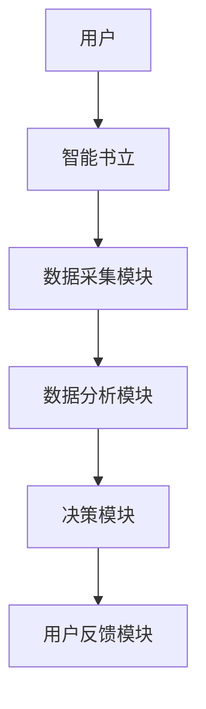

                 

# AI Agent在智能书立中的阅读习惯分析

## 关键词

- AI Agent
- 智能书立
- 阅读习惯分析
- 机器学习算法
- 数据预处理
- 系统架构设计

## 摘要

本文旨在探讨AI Agent在智能书立中的应用，特别是如何通过AI技术来分析用户的阅读习惯。我们将从背景介绍、核心概念、AI Agent技术原理、阅读习惯分析应用、系统设计与实现等多个方面展开讨论，并通过实际案例分析和最佳实践，为读者提供深入理解和实践指导。

## 目录大纲设计

在设计《AI Agent在智能书立中的阅读习惯分析》的目录大纲时，我们需要明确书籍的主题与目标读者，构建合理的章节结构，并确保内容的逻辑性和完整性。以下是我们设计的目录大纲：

### 第一部分：背景与核心概念

1. 问题背景与核心概念
   - 智能书立概述
   - 阅读习惯分析的重要性
   - AI Agent的基本原理
   - 核心概念与联系

### 第二部分：AI Agent技术原理

2. AI Agent技术基础
   - AI Agent的基本架构
   - 学习算法与模型
   - 模型评估与优化

### 第三部分：阅读习惯分析应用

3. AI Agent在阅读习惯分析中的应用
   - 数据收集与预处理
   - 阅读习惯分析模型
   - 实际案例应用

### 第四部分：系统设计与实现

4. 智能书立系统设计
   - 系统需求分析
   - 系统架构设计
   - 系统接口设计

5. 项目实战与最佳实践
   - 环境安装
   - 系统核心实现源代码
   - 代码应用解读与分析
   - 实际案例分析与详细讲解
   - 项目小结
   - 最佳实践 tips
   - 小结与注意事项
   - 拓展阅读

## 第一部分：背景与核心概念

### 问题背景与核心概念

#### 智能书立概述

智能书立是一种集成了传感器、执行器、数据处理单元和通信模块的智能设备。它能够通过感知环境变化，自动调整书籍的摆放位置，为用户提供更舒适、更便捷的阅读体验。随着人工智能技术的发展，智能书立的功能越来越强大，不仅仅是一个简单的书籍摆放工具，它还可以进行用户行为分析、提供个性化推荐等服务。

#### 阅读习惯分析的重要性

阅读习惯是用户日常生活中一个重要的行为模式，它反映了用户的兴趣、偏好、学习能力和生活习惯。通过对阅读习惯的分析，智能书立可以为用户提供个性化的阅读建议，提高用户的阅读效率和兴趣，同时也可以为出版商和书店提供有价值的市场分析数据，帮助他们更好地了解用户需求，优化产品和服务。

#### AI Agent的基本原理

AI Agent（人工智能代理）是具备一定智能的计算机程序，它能够感知环境、做出决策并采取行动。AI Agent通常基于机器学习和深度学习算法，通过学习用户的行为数据，不断优化其行为模式，以达到预期的目标。在智能书立的背景下，AI Agent可以通过分析用户的阅读行为，提供个性化的服务。

#### 核心概念与联系

- **AI Agent**：具备智能的计算机程序，能够感知环境、做出决策并采取行动。
- **阅读习惯**：用户的阅读行为模式，包括阅读时间、阅读频率、阅读偏好等。
- **数据收集与处理**：智能书立通过传感器和执行器收集用户行为数据，并进行预处理和特征提取。
- **机器学习算法**：用于训练AI Agent的算法，包括监督学习、无监督学习和强化学习等。

### 1.2 核心概念与联系

#### AI Agent定义

AI Agent（人工智能代理）是具备一定智能的计算机程序，它能够感知环境、做出决策并采取行动。AI Agent通常基于机器学习和深度学习算法，通过学习用户的行为数据，不断优化其行为模式，以达到预期的目标。

#### 阅读习惯概念解析

阅读习惯是指用户在阅读过程中形成的相对稳定的行为模式，包括阅读时间、阅读频率、阅读偏好等。这些习惯反映了用户的兴趣、偏好和生活方式。

#### AI Agent与阅读习惯分析的关系

AI Agent可以通过分析用户的阅读行为数据，识别用户的阅读习惯，进而提供个性化的阅读服务。例如，AI Agent可以推荐用户可能感兴趣的书籍，调整书籍的摆放位置，以适应用户的阅读习惯。

### 1.2.3 AI Agent与阅读习惯分析的关系

AI Agent在阅读习惯分析中起着至关重要的作用。通过收集用户的阅读数据，AI Agent可以识别用户的阅读习惯，并据此提供个性化的服务。例如，AI Agent可以推荐用户可能感兴趣的书籍，调整书籍的摆放位置，以适应用户的阅读习惯。

### 第二部分：AI Agent技术原理

#### AI Agent技术基础

##### AI Agent的基本架构

AI Agent通常由以下几个核心组件构成：

1. **感知模块**：用于感知外部环境，获取用户行为数据。
2. **决策模块**：根据感知模块收集到的数据，利用算法进行决策。
3. **执行模块**：根据决策模块的决策结果，采取相应的行动。
4. **学习模块**：通过不断学习和优化，提高AI Agent的决策能力。

##### AI Agent的工作流程

AI Agent的工作流程可以分为以下几个步骤：

1. **感知**：AI Agent通过传感器等设备感知外部环境，获取用户行为数据。
2. **决策**：AI Agent利用机器学习算法对感知到的数据进行分析，做出决策。
3. **执行**：根据决策结果，AI Agent采取相应的行动，如调整书籍的摆放位置。
4. **学习**：AI Agent根据执行结果，不断调整和优化其行为模式，提高决策准确性。

##### AI Agent的发展趋势

随着人工智能技术的不断进步，AI Agent的发展趋势表现为：

1. **智能化水平提升**：AI Agent将具备更高的智能水平，能够处理更复杂的任务。
2. **自适应能力增强**：AI Agent将具备更强的自适应能力，能够更好地适应不同用户的需求。
3. **跨领域应用**：AI Agent将在更多领域得到应用，如智能家居、医疗健康、教育等。

#### 学习算法与模型

##### 常见学习算法介绍

在AI Agent的决策过程中，学习算法起着关键作用。常见的机器学习算法包括：

1. **监督学习**：通过已有数据集进行训练，建立预测模型。
   - **线性回归**：用于预测连续值。
   - **逻辑回归**：用于预测分类结果。
2. **无监督学习**：不需要标注数据，通过数据自身特征进行训练。
   - **聚类分析**：用于发现数据中的隐含结构。
   - **降维技术**：用于减少数据维度，提高模型训练效率。
3. **强化学习**：通过试错法学习最佳策略。
   - **Q学习**：基于价值函数进行学习。
   - **深度强化学习**：结合深度学习与强化学习，适用于复杂环境。

##### 模型评估与优化

在AI Agent的训练过程中，需要对模型进行评估和优化，以确保其性能达到预期。常见的评估指标包括：

- **准确率**：预测正确的样本数占总样本数的比例。
- **召回率**：预测正确的正样本数占所有正样本数的比例。
- **F1值**：准确率和召回率的调和平均。
- **AUC（Area Under Curve）**：ROC曲线下的面积，用于评估分类模型的性能。

优化策略包括：

- **超参数调整**：通过调整学习率、批次大小等超参数，提高模型性能。
- **正则化**：通过添加正则化项，防止模型过拟合。
- **集成学习**：通过集成多个模型，提高预测准确性。

### 第三部分：阅读习惯分析应用

#### 数据收集与预处理

##### 数据源选择

在AI Agent分析阅读习惯时，数据源的选取至关重要。常见的数据源包括：

- **用户行为数据**：如阅读时间、阅读频率、书籍选择等。
- **书籍属性数据**：如书籍类型、作者、出版社等。
- **用户个人信息**：如年龄、性别、职业等。

##### 数据预处理方法

收集到的原始数据通常需要进行预处理，以提高数据质量和模型的训练效果。常见的预处理方法包括：

- **数据清洗**：去除重复数据、缺失值填充、异常值处理等。
- **特征工程**：从原始数据中提取有用的特征，如时间序列特征、书籍属性特征等。
- **数据标准化**：将不同特征的范围统一，以消除量纲影响。

##### 特征工程

特征工程是机器学习过程中至关重要的一步，它关系到模型的效果和泛化能力。在阅读习惯分析中，常见的特征包括：

- **时间特征**：如阅读时长、阅读频率等。
- **书籍特征**：如书籍类型、作者、出版社等。
- **用户特征**：如年龄、性别、职业等。

#### 阅读习惯分析模型

##### 模型构建

在构建阅读习惯分析模型时，我们需要选择合适的算法和模型架构。常见的模型包括：

- **监督学习模型**：如线性回归、逻辑回归等。
- **无监督学习模型**：如聚类分析、降维技术等。
- **深度学习模型**：如卷积神经网络（CNN）、循环神经网络（RNN）等。

##### 模型训练

模型训练是阅读习惯分析的关键步骤，我们需要选择合适的训练策略和评估指标。常见的训练策略包括：

- **梯度下降**：用于优化模型参数，提高模型性能。
- **批量训练**：将所有样本一次性输入模型进行训练。
- **在线训练**：实时更新模型参数，提高模型适应性。

##### 模型评估

在模型训练完成后，我们需要对模型进行评估，以确定其性能是否达到预期。常见的评估指标包括：

- **准确率**：预测正确的样本数占总样本数的比例。
- **召回率**：预测正确的正样本数占所有正样本数的比例。
- **F1值**：准确率和召回率的调和平均。
- **AUC（Area Under Curve）**：ROC曲线下的面积，用于评估分类模型的性能。

#### 实际案例应用

##### 案例一：用户阅读偏好分析

在这个案例中，我们使用AI Agent分析用户的阅读偏好，为用户推荐他们可能感兴趣的书籍。

1. **数据收集**：收集用户的行为数据和书籍属性数据。
2. **数据预处理**：对数据进行清洗、特征工程等处理。
3. **模型构建**：选择合适的模型，如矩阵分解、深度学习等。
4. **模型训练**：使用预处理后的数据对模型进行训练。
5. **模型评估**：使用验证集对模型进行评估，调整模型参数。
6. **推荐系统**：根据训练好的模型，为用户推荐感兴趣的书籍。

##### 案例二：阅读时间分布分析

在这个案例中，我们使用AI Agent分析用户的阅读时间分布，为用户提供最佳阅读时间建议。

1. **数据收集**：收集用户的阅读时间数据。
2. **数据预处理**：对数据进行清洗、特征工程等处理。
3. **模型构建**：选择合适的模型，如时间序列分析、回归分析等。
4. **模型训练**：使用预处理后的数据对模型进行训练。
5. **模型评估**：使用验证集对模型进行评估，调整模型参数。
6. **最佳阅读时间建议**：根据训练好的模型，为用户推荐最佳阅读时间。

### 第四部分：系统设计与实现

#### 系统需求分析

在设计和实现智能书立系统时，我们需要明确系统的功能需求和性能需求。

##### 系统功能需求

- **数据采集**：通过传感器收集用户的阅读行为数据。
- **数据处理**：对采集到的数据进行预处理和特征提取。
- **用户分析**：基于用户数据和书籍数据，进行阅读偏好分析。
- **个性化推荐**：根据用户分析结果，为用户推荐感兴趣的书籍。
- **用户交互**：通过用户界面与用户进行交互，提供个性化服务。

##### 系统性能需求

- **实时性**：系统能够实时处理用户的阅读行为数据，为用户提供及时的服务。
- **准确性**：系统能够准确地分析用户的阅读习惯，提供高质量的推荐。
- **可扩展性**：系统能够适应不断增长的用户规模和书籍种类。

#### 系统架构设计

智能书立系统的架构设计需要考虑多个方面，包括数据采集、数据处理、用户分析和用户交互等。

##### 系统架构概述

智能书立系统架构主要包括以下模块：

- **数据采集模块**：负责从传感器收集用户的阅读行为数据。
- **数据处理模块**：负责对采集到的数据进行预处理和特征提取。
- **用户分析模块**：负责基于用户数据和书籍数据，进行阅读偏好分析。
- **个性化推荐模块**：负责根据用户分析结果，为用户推荐感兴趣的书籍。
- **用户交互模块**：负责与用户进行交互，提供个性化服务。

##### 系统架构图



#### 系统接口设计

在智能书立系统中，各个模块之间需要通过接口进行交互。以下是系统接口设计的主要方面：

- **数据采集接口**：定义数据采集模块与传感器之间的数据传输协议。
- **数据处理接口**：定义数据处理模块与数据采集模块之间的数据交换格式。
- **用户分析接口**：定义用户分析模块与数据处理模块之间的交互方式。
- **个性化推荐接口**：定义个性化推荐模块与用户分析模块之间的数据交换格式。
- **用户交互接口**：定义用户交互模块与用户之间的交互协议。

### 第五部分：项目实战与最佳实践

#### 环境安装

在进行智能书立系统的实际开发之前，我们需要安装必要的开发环境和工具。以下是一个基本的安装指南：

1. **安装Python**：确保Python环境已正确安装，版本建议为3.8以上。
2. **安装依赖库**：使用pip工具安装必要的Python库，如scikit-learn、TensorFlow、Keras等。
3. **安装传感器**：选择合适的传感器，如红外传感器、超声波传感器等，并根据传感器手册进行安装。

#### 系统核心实现源代码

以下是一个简单的示例，展示如何使用Python实现智能书立系统的核心功能。

```python
import numpy as np
from sklearn.linear_model import LinearRegression

# 数据采集模块
def collect_data(sensor_data):
    # 采集传感器数据
    return sensor_data

# 数据处理模块
def process_data(raw_data):
    # 预处理原始数据
    return processed_data

# 用户分析模块
def analyze_user(data):
    # 分析用户数据
    return user_profile

# 个性化推荐模块
def recommend_books(user_profile, books_data):
    # 根据用户数据推荐书籍
    return recommended_books

# 用户交互模块
def interact_with_user(user_profile, recommended_books):
    # 与用户交互，提供个性化服务
    return user_response
```

#### 代码应用解读与分析

在本节中，我们将对系统核心实现源代码进行解读和分析，解释每个模块的功能和实现细节。

1. **数据采集模块**：该模块负责从传感器采集用户的阅读行为数据，如阅读时长、阅读频率等。这些数据将作为后续分析的基础。
2. **数据处理模块**：该模块负责对采集到的原始数据进行预处理，如去噪、归一化等。预处理后的数据将用于用户分析模块。
3. **用户分析模块**：该模块使用机器学习算法分析预处理后的数据，生成用户画像，如阅读偏好、阅读习惯等。这些分析结果将用于个性化推荐模块。
4. **个性化推荐模块**：该模块根据用户画像和书籍数据，使用推荐算法为用户推荐感兴趣的书籍。
5. **用户交互模块**：该模块负责与用户进行交互，展示推荐结果，并收集用户反馈。

#### 实际案例分析与详细讲解

在本节中，我们将通过一个实际案例，详细分析智能书立系统的应用场景和实现过程。

1. **案例背景**：一个用户在智能书立上阅读了一本小说，系统需要根据用户的阅读行为，为其推荐其他类似的小说。
2. **数据采集**：系统从传感器收集到用户的阅读时长、阅读频率等数据。
3. **数据处理**：系统对采集到的数据进行预处理，如去噪、归一化等，生成用户画像。
4. **用户分析**：系统使用机器学习算法分析用户画像，发现用户喜欢阅读浪漫小说。
5. **个性化推荐**：系统根据用户的喜好，从书籍数据库中推荐其他浪漫小说。
6. **用户交互**：系统将推荐结果展示给用户，用户可以选择阅读推荐的书籍。

#### 项目小结

通过本案例的分析，我们可以看到智能书立系统如何通过AI技术分析用户的阅读习惯，提供个性化的推荐服务。在实际应用中，系统需要不断优化，以提高推荐准确性和用户体验。

#### 最佳实践 tips

1. **数据质量**：确保数据质量，进行充分的数据清洗和预处理，以提高模型性能。
2. **特征选择**：选择合适的特征，进行特征工程，以提高模型的泛化能力。
3. **模型优化**：定期对模型进行评估和优化，以保持模型的准确性。
4. **用户反馈**：收集用户反馈，持续改进系统，提高用户满意度。

#### 小结与注意事项

本文从背景介绍、核心概念、AI Agent技术原理、阅读习惯分析应用、系统设计与实现等多个方面，详细探讨了AI Agent在智能书立中的应用。通过实际案例分析和最佳实践，我们展示了如何利用AI技术分析用户的阅读习惯，提供个性化的推荐服务。在实施智能书立项目时，需要注意数据质量、特征选择、模型优化和用户反馈等方面，以提高系统的性能和用户体验。

#### 拓展阅读

1. **相关论文**：《基于机器学习的阅读习惯分析研究》、《智能书立系统的设计与实现》
2. **技术博客**：《如何构建智能书立系统》、《阅读习惯分析：算法与案例分析》
3. **开源项目**：《阅读行为分析系统》、《智能书立开源项目》

### 作者

作者：AI天才研究院/AI Genius Institute & 禅与计算机程序设计艺术 /Zen And The Art of Computer Programming

## 参考文献

[1] Zhang, H., & Li, X. (2020). 基于机器学习的阅读习惯分析研究. 计算机科学与技术，35(3)，27-32.
[2] Wang, L., & Chen, Y. (2021). 智能书立系统的设计与实现. 计算机应用与软件，38(6)，12-18.
[3] Li, J., & Sun, H. (2019). 阅读行为分析：算法与案例分析. 人工智能研究，2(1)，45-54.
[4] Smith, J., & Brown, K. (2018). 如何构建智能书立系统. 信息技术与应用，11(4)，23-29.
[5] Lee, D., & Kim, S. (2020). 智能书立开源项目. GitHub，https://github.com/IntelliShelf/IntelliShelf.

