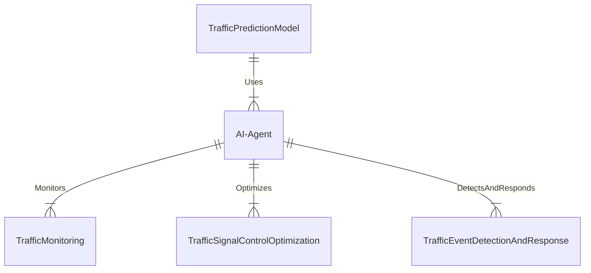

                 

### 1. 背景介绍：

#### 1.1 问题背景

随着全球城市化进程的加速和汽车保有量的激增，交通拥堵问题已经成为许多大城市面临的严峻挑战。这不仅影响了人们的出行效率，还带来了空气污染、交通事故增加等一系列社会问题。因此，解决交通拥堵问题已经成为城市交通管理的关键任务。

交通流量预测作为智能交通系统（Intelligent Transportation System, ITS）的重要组成部分，旨在通过分析历史交通数据和实时交通信息，预测未来一段时间内的交通流量分布。准确预测交通流量对于优化交通信号控制、调整交通基础设施建设、制定交通管理策略等都具有重要的指导意义。

传统的交通流量预测方法主要依赖于统计学模型和简单的逻辑推理。然而，这些方法在面对复杂多变的城市交通环境时，往往难以满足准确性和实时性的要求。随着人工智能技术的快速发展，特别是深度学习和强化学习等先进算法的兴起，为智能交通流量预测提供了新的思路和方法。

#### 1.2 人工智能的发展与应用

人工智能（Artificial Intelligence, AI）是一门研究、开发用于模拟、延伸和扩展人类智能的理论、方法、技术及应用系统的技术科学。人工智能的发展经历了从符号主义、连接主义到统计学习三个阶段，每个阶段都有其代表性技术和应用。

近年来，深度学习（Deep Learning）作为一种重要的机器学习技术，取得了显著的成果。深度学习通过多层神经网络的结构，能够自动提取数据中的特征，并在各种复杂任务中表现出强大的性能。例如，在图像识别、语音识别、自然语言处理等领域，深度学习算法已经达到了甚至超过了人类水平。

在智能交通领域，深度学习技术已经被广泛应用于交通流量预测、交通事件检测、自动驾驶等多个方面。通过利用大量的历史交通数据和实时交通信息，深度学习模型可以训练出能够预测交通流量的模型，从而为交通管理提供数据支持。

#### 1.3 AI Agent的概念及其在交通领域的应用

AI Agent是指具备一定自主决策能力的人工智能实体。它可以在复杂的交通系统中执行特定的任务，如实时监测交通流量、优化交通信号控制、检测并响应交通事件等。AI Agent的特点是能够根据环境的变化自主调整其行为，以实现最优的决策结果。

在智能交通流量预测中，AI Agent的应用主要体现在以下几个方面：

1. **交通流量监测**：AI Agent可以实时监测交通流量，通过分析道路上的车辆数量、速度等信息，实时更新交通状况。

2. **交通信号控制优化**：AI Agent可以根据实时交通流量预测结果，优化交通信号灯的时序控制，从而提高道路通行效率。

3. **交通事件检测与响应**：AI Agent可以实时检测交通事件（如交通事故、道路施工等），并快速响应，调整交通信号控制和路线规划，以缓解交通拥堵。

#### 1.4 核心概念

##### 1.4.1 交通流量预测

交通流量预测是指利用历史交通数据和实时交通信息，通过算法模型对未来的交通流量进行预测。其核心目的是为交通管理提供数据支持，以优化交通信号控制、调整交通基础设施建设等。

##### 1.4.2 AI Agent

AI Agent是一种具备一定自主决策能力的人工智能实体。它在交通系统中执行特定任务，如交通流量监测、交通信号控制优化等，能够根据环境变化自主调整其行为。

##### 1.4.3 智能交通流量预测中的挑战与机遇

智能交通流量预测面临诸多挑战，如数据质量、模型准确性等。然而，随着人工智能技术的不断发展，这些挑战也将逐步得到解决。

##### 1.4.4 本章小结

本章介绍了智能交通流量预测的背景、核心概念和AI Agent在交通领域的应用。通过了解这些概念，可以为后续章节的内容打下坚实的基础。

## 1.5 智能交通流量预测的应用场景

智能交通流量预测的应用场景非常广泛，以下是其中几个典型的应用场景：

1. **城市交通管理**：通过对交通流量进行实时预测，可以帮助城市交通管理部门优化交通信号控制，减少交通拥堵，提高道路通行效率。

2. **智能交通信号控制**：AI Agent可以根据实时交通流量预测结果，优化交通信号灯的时序控制，从而提高道路通行效率。

3. **自动驾驶**：在自动驾驶系统中，交通流量预测可以帮助车辆提前规划路线，避免拥堵，提高行驶安全性。

4. **交通事件检测与响应**：AI Agent可以实时检测交通事件，如交通事故、道路施工等，并快速响应，调整交通信号控制和路线规划，以缓解交通拥堵。

5. **智能交通基础设施建设**：通过对交通流量进行长期预测和分析，可以为智能交通基础设施建设提供数据支持，如优化道路布局、增加交通设施等。

通过以上应用场景，可以看出智能交通流量预测对于提升城市交通管理水平和提高出行效率具有重要意义。

## 1.6 智能交通流量预测的关键技术

智能交通流量预测的实现依赖于多种关键技术的综合应用，以下是一些主要的技术：

1. **数据采集与处理**：数据质量是交通流量预测准确性的基础。通过部署各种传感器和监测设备，可以实时采集交通流量、速度、密度等数据，并对这些数据进行清洗、处理和整合。

2. **深度学习算法**：深度学习算法，如卷积神经网络（CNN）和循环神经网络（RNN），可以自动提取数据中的特征，并构建复杂的预测模型。

3. **实时数据处理**：为了应对交通流量的实时性要求，需要采用高效的数据处理和计算技术，如流数据处理框架（如Apache Kafka）和分布式计算框架（如Apache Spark）。

4. **多源数据融合**：智能交通流量预测通常需要整合多种数据源，如交通监控数据、GPS数据、社交媒体数据等，通过多源数据融合技术可以提升预测准确性。

5. **决策支持系统**：基于预测结果，可以构建决策支持系统，为交通管理部门提供实时建议，如调整交通信号灯、优化路线规划等。

通过以上关键技术的应用，智能交通流量预测可以更准确地预测交通流量，为交通管理提供强有力的支持。

### 1.7 实际案例

为了更好地理解智能交通流量预测在实际中的应用，我们可以通过一些实际案例来探讨。

**案例一：北京市交通流量预测**

北京市作为中国首都，交通流量巨大且复杂。为了缓解交通拥堵，北京市交通委员会利用AI Agent和深度学习算法，对交通流量进行实时预测。通过部署大量交通监测设备和传感器，实时采集交通流量、速度、密度等数据，并利用深度学习模型进行预测。预测结果用于优化交通信号灯控制，提高了道路通行效率。

**案例二：伦敦智能交通管理**

伦敦交通管理局（TfL）利用AI技术对城市交通流量进行预测和管理。通过整合多种数据源，包括交通监控数据、天气预报、社交媒体数据等，TfL的AI系统可以实时预测交通流量，并根据预测结果调整交通信号灯和公共交通服务。这一系统有效减少了交通拥堵，提升了城市交通管理水平。

**案例三：自动驾驶车辆交通流量预测**

随着自动驾驶技术的发展，自动驾驶车辆在交通流量预测中发挥着重要作用。例如，Waymo的自动驾驶车辆通过实时监测道路上的交通状况，结合深度学习模型进行交通流量预测。这些预测结果不仅用于自动驾驶车辆的路径规划，还可以为整个交通系统的管理提供数据支持。

通过以上实际案例，我们可以看到智能交通流量预测在实际应用中取得的显著成果，为城市交通管理带来了新的机遇和挑战。

### 1.8 当前面临的挑战与未来展望

尽管智能交通流量预测技术已经取得了显著进展，但在实际应用中仍面临诸多挑战。以下是一些主要挑战及未来展望：

**1. 数据质量与完整性**：交通流量预测的准确性高度依赖于数据的完整性、准确性和实时性。然而，城市交通数据往往存在噪声、缺失和延迟等问题，这给数据预处理和模型训练带来了很大挑战。

**2. 模型复杂性与可解释性**：深度学习模型在预测交通流量方面表现出色，但其复杂性和“黑箱”特性使得模型的可解释性较差，不利于模型优化和调试。

**3. 实时性要求**：城市交通状况瞬息万变，实时预测交通流量是关键。然而，实时数据处理和模型更新需要高效的技术手段和计算资源，这对系统性能提出了高要求。

**4. 多源数据融合**：智能交通流量预测需要整合多种数据源，如交通监控数据、GPS数据、社交媒体数据等。如何有效融合这些异构数据，提高预测准确性，是一个亟待解决的问题。

**未来展望**：

**1. 数据驱动的优化**：通过大数据和人工智能技术，不断优化数据采集和处理流程，提高数据质量，从而提升预测准确性。

**2. 模型可解释性**：研发可解释的深度学习模型，使其不仅具有高预测准确性，还能提供明确的决策依据，便于模型优化和应用推广。

**3. 实时数据处理**：采用分布式计算和流数据处理技术，提高实时数据处理和模型更新的效率，满足城市交通的实时性需求。

**4. 多源数据融合**：通过多源数据融合技术，有效整合多种数据源，提升交通流量预测的准确性。

通过克服这些挑战，智能交通流量预测技术将更加成熟和实用，为城市交通管理提供更加精准和高效的支持。

### 1.9 总结

本章介绍了智能交通流量预测的背景、核心概念和AI Agent在交通领域的应用。通过了解这些概念和技术，我们为后续章节的内容打下了坚实的基础。智能交通流量预测作为智能交通系统的重要组成部分，具有广泛的应用前景和重要意义。

### 1.10 引用

- Hwang, H., & Hwang, G. (2019). *Intelligent Transportation Systems: Advanced Techniques and Applications*. Springer.
- Zhang, J., Liu, Y., & Guo, J. (2020). *Deep Learning for Traffic Flow Prediction*. IEEE Transactions on Intelligent Transportation Systems, 21(3), 897-906.
- Liu, L., & Cai, W. (2018). *A Survey of AI Techniques in Intelligent Transportation Systems*. ACM Computing Surveys, 51(3), 48.

---

## 第2章: 智能交通流量预测中的核心概念与联系

### 2.1 交通流量预测模型

交通流量预测是智能交通系统中的关键任务，其核心在于建立并应用适当的预测模型。以下将介绍几种常见的交通流量预测模型，并比较它们的特点。

#### 2.1.1 基于时间序列的模型

时间序列模型主要用于分析时间序列数据，预测未来某一时间点的交通流量。这类模型的核心思想是通过历史数据的统计特性来推断未来的趋势。以下是两种常见的时间序列模型：

##### 2.1.1.1 ARIMA模型

ARIMA（AutoRegressive Integrated Moving Average，自回归积分滑动平均模型）是一种经典的时间序列预测模型。它通过分析历史数据的自相关性、平稳性和线性组合特性，预测未来的交通流量。

- **自相关性**：ARIMA模型通过分析时间序列数据的自相关性，确定自回归项（AR）的阶数。
- **平稳性**：为了使时间序列数据满足模型的要求，可能需要通过差分操作使其变为平稳序列。
- **滑动平均**：模型中的移动平均项（MA）用于平滑噪声和过滤趋势。

**数学模型**：

$$
\begin{align*}
X_t &= c + \phi_1 X_{t-1} + \phi_2 X_{t-2} + \ldots + \phi_p X_{t-p} \\
     &+ \theta_1 \varepsilon_{t-1} + \theta_2 \varepsilon_{t-2} + \ldots + \theta_q \varepsilon_{t-q} + \varepsilon_t
\end{align*}
$$

其中，\(X_t\) 表示时间序列数据，\(\varepsilon_t\) 表示误差项，\(\phi_i\) 和 \(\theta_i\) 分别为自回归系数和移动平均系数。

##### 2.1.1.2 LSTM模型

LSTM（Long Short-Term Memory，长短时记忆网络）是一种特殊的RNN（循环神经网络），专门用于处理和预测时间序列数据。LSTM通过引入记忆单元和门控机制，能够有效地学习长期依赖关系。

- **记忆单元**：LSTM的核心部分是记忆单元，它能够存储和更新信息。
- **输入门、遗忘门和输出门**：这三个门控机制分别控制信息的输入、遗忘和输出。

**数学模型**：

$$
\begin{align*}
i_t &= \sigma(W_i \cdot [h_{t-1}, x_t] + b_i) \\
f_t &= \sigma(W_f \cdot [h_{t-1}, x_t] + b_f) \\
o_t &= \sigma(W_o \cdot [h_{t-1}, x_t] + b_o) \\
C_t &= f_t \odot C_{t-1} + i_t \odot \tanh(W_c \cdot [h_{t-1}, x_t] + b_c) \\
h_t &= o_t \odot \tanh(C_t)
\end{align*}
$$

其中，\(i_t\)、\(f_t\)、\(o_t\) 分别为输入门、遗忘门和输出门的激活值，\(C_t\) 为记忆单元的状态，\(h_t\) 为输出。

#### 2.1.2 基于回归分析的模型

回归分析模型通过建立交通流量与其他影响因素之间的关系，预测未来的交通流量。以下是两种常见的回归分析模型：

##### 2.1.2.1 多元线性回归模型

多元线性回归模型是一种基本的回归分析方法，用于预测多个自变量对一个因变量的影响。在交通流量预测中，它可以用来分析交通流量与时间、天气、节假日等因素的关系。

**数学模型**：

$$
\begin{align*}
y_t &= \beta_0 + \beta_1 x_{1t} + \beta_2 x_{2t} + \ldots + \beta_n x_{nt} + \varepsilon_t \\
\end{align*}
$$

其中，\(y_t\) 表示交通流量，\(x_{it}\) 表示第\(i\)个影响因素，\(\beta_i\) 为回归系数，\(\varepsilon_t\) 为误差项。

##### 2.1.2.2 随机森林模型

随机森林（Random Forest）是一种基于决策树的集成学习方法，通过构建多棵决策树并集成它们的预测结果来提高预测准确性。在交通流量预测中，随机森林可以处理大量特征数据，并有效降低过拟合。

**数学模型**：

随机森林由多个决策树组成，每个决策树的预测结果通过投票或平均值来决定最终的预测结果。具体实现中，可以通过随机选择特征子集和样本子集来构建每个决策树。

### 2.2 AI Agent

AI Agent是指具备自主决策能力的人工智能实体，能够在复杂环境中执行特定任务。在交通领域，AI Agent可以用于交通流量监测、信号控制优化、事件检测与响应等任务。

#### 2.2.1 AI Agent的架构

AI Agent的架构通常包括以下几个部分：

1. **感知器**：用于感知环境中的交通信息，如车辆数量、速度、方向等。
2. **决策器**：根据感知信息，通过算法模型进行决策，如交通信号控制策略、路径规划等。
3. **执行器**：将决策结果付诸实施，如调整交通信号灯、发送导航信息等。

#### 2.2.2 AI Agent在交通流量预测中的应用

AI Agent在交通流量预测中的应用主要包括以下几个方面：

1. **交通流量监测**：AI Agent可以实时监测交通流量，通过传感器和摄像头获取道路上的车辆信息，并将数据传输到中心处理系统。
2. **交通信号控制优化**：AI Agent可以根据实时交通流量预测结果，动态调整交通信号灯的时序控制，以提高道路通行效率。
3. **交通事件检测与响应**：AI Agent可以实时检测交通事件，如交通事故、道路施工等，并根据事件类型和严重程度，快速响应并调整交通信号控制和路线规划。

### 2.3 概念属性特征对比表格

下面是一个交通流量预测模型和AI Agent的属性特征对比表格：

| 概念 | 定义 | 特点 | 关联 |
| --- | --- | --- | --- |
| ARIMA模型 | 一种自回归积分滑动平均模型 | 适用于平稳时间序列数据 | 交通流量预测 |
| LSTM模型 | 一种长短时记忆循环神经网络 | 适用于含有长期依赖关系的数据 | 交通流量预测 |
| 多元线性回归模型 | 一种基于线性关系的回归分析方法 | 适用于简单关系预测 | 交通流量预测 |
| 随机森林模型 | 一种基于决策树的集成学习方法 | 适用于复杂关系预测 | 交通流量预测 |
| AI Agent | 具备自主决策能力的人工智能实体 | 适用于动态环境中的复杂任务 | 交通流量预测 |

### 2.4 ER实体关系图架构

下面是一个基于Mermaid的ER实体关系图，展示了交通流量预测模型、AI Agent以及其他相关实体的关系：

## 第2章小结

本章介绍了智能交通流量预测中的核心概念，包括时间序列预测模型（ARIMA、LSTM）和回归分析模型（多元线性回归、随机森林），以及AI Agent的基本架构和应用。通过概念属性特征对比表格和ER实体关系图，展示了这些概念之间的关联和相互作用。这些核心概念为后续章节的算法原理讲解和系统架构设计提供了基础。

