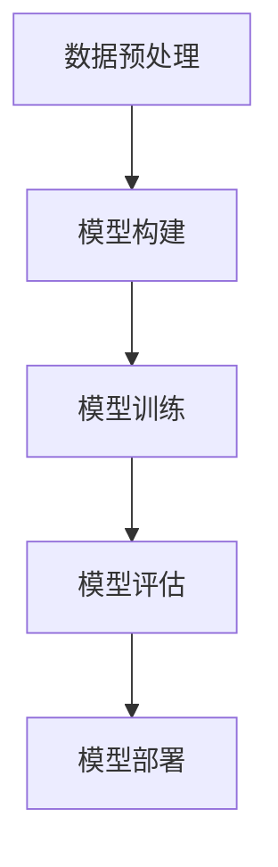
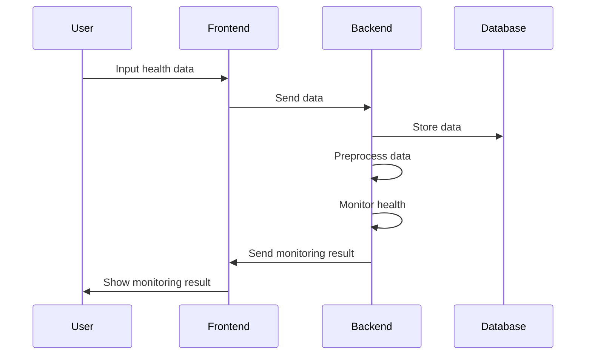
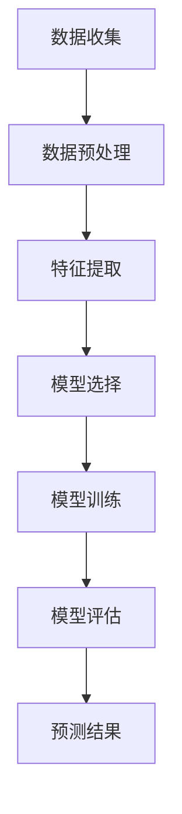
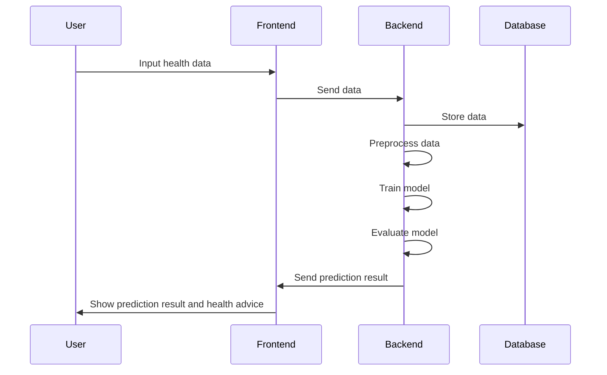
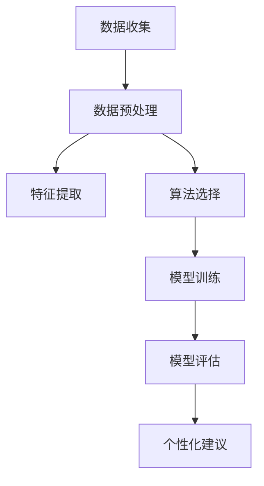
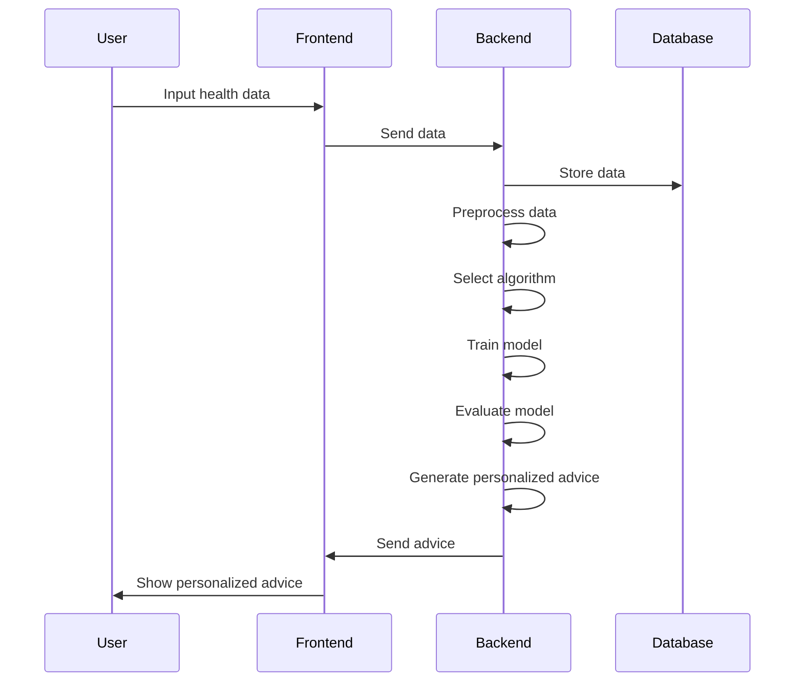

                 

### 第一部分: AI代理在智能健康管理中的基础概念

#### 第1章: 问题背景与概念界定

##### 1.1 智能健康管理的背景

##### 1.1.1 智能健康管理的定义

智能健康管理是一种基于现代信息技术和人工智能算法的综合性健康管理方法。它不仅包含了传统的健康监测、疾病预防、健康评估等内容，还利用人工智能技术，通过对大数据的分析和处理，实现个性化、智能化、精准化的健康管理。

##### 1.1.2 智能健康管理的重要性

随着人口老龄化和慢性病的增加，智能健康管理在提高公众健康水平、降低医疗成本、提升医疗服务质量等方面具有重要作用。它能够有效地监测和预防疾病，为个人提供个性化的健康建议，从而提高生活质量。

##### 1.1.3 智能健康管理的发展历程

智能健康管理的发展历程可以分为以下几个阶段：

1. **传统健康管理阶段**：主要以健康检查、疾病治疗为主。
2. **现代健康管理阶段**：引入了信息管理技术，实现了健康数据的电子化和信息化。
3. **智能健康管理阶段**：基于人工智能技术，实现了健康管理的智能化和个性化。

##### 1.2 AI代理的基本概念

##### 1.2.1 AI代理的定义

AI代理（Artificial Intelligence Agent）是一种具有自主决策能力和行动能力的计算实体，它能够在复杂环境中模拟人类智能，完成特定任务。AI代理通过感知环境、理解信息、规划行为，并最终采取行动，以实现特定目标。

##### 1.2.2 AI代理的特点

1. **自主性**：能够自主地决策和行动，不受外界指令的完全控制。
2. **适应性**：能够根据环境的变化，调整自己的行为和策略。
3. **智能性**：能够通过学习和推理，解决复杂问题。

##### 1.2.3 AI代理与传统AI系统的区别

1. **自主性**：传统AI系统通常需要人工设定目标和行为，而AI代理具有自主决策的能力。
2. **适应性**：传统AI系统难以适应复杂和动态的环境，而AI代理能够根据环境变化，调整行为策略。
3. **智能性**：传统AI系统主要依赖于预定义的规则和模型，而AI代理通过学习和推理，实现更高的智能水平。

##### 1.3 AI代理在健康管理中的应用

##### 1.3.1 AI代理在健康监测中的应用

AI代理能够实时监测个体的健康状况，通过对健康数据的分析，提供个性化的健康建议。例如，通过监测心率、血压等生理指标，预测个体是否存在健康风险，并提供相应的健康指导。

##### 1.3.2 AI代理在疾病预测中的应用

AI代理通过分析历史健康数据、遗传信息、生活方式等因素，预测个体可能患病的风险，为疾病预防和治疗提供依据。

##### 1.3.3 AI代理在个性化健康管理中的应用

AI代理根据个体的健康数据和偏好，提供个性化的健康建议和方案。例如，根据个体的身体状况和运动能力，制定个性化的运动计划；根据个体的饮食习惯和营养需求，制定个性化的饮食建议。

##### 1.4 AI代理的核心技术

##### 1.4.1 机器学习与深度学习技术

机器学习和深度学习是AI代理的核心技术。它们通过训练模型，使AI代理能够从数据中学习，并做出预测和决策。

##### 1.4.2 强化学习在AI代理中的应用

强化学习是一种使AI代理能够通过试错学习，在复杂环境中找到最优策略的方法。它适用于需要长期规划和高层次决策的任务。

##### 1.4.3 自然语言处理与对话系统

自然语言处理和对话系统能够使AI代理与用户进行自然语言交互，提供更加人性化的服务。

##### 1.5 本章小结

本章介绍了智能健康管理和AI代理的基本概念，以及它们在健康管理中的应用。接下来，我们将进一步探讨AI代理的核心技术，并详细分析其在健康监测、疾病预测和个性化健康管理中的具体应用。

### 关键词

- 智能健康管理
- AI代理
- 健康监测
- 疾病预测
- 个性化健康管理
- 机器学习
- 深度学习
- 强化学习
- 自然语言处理

### 摘要

本文首先介绍了智能健康管理和AI代理的基本概念，阐述了它们在健康管理中的重要性。接着，本文详细分析了AI代理在健康监测、疾病预测和个性化健康管理中的应用，并探讨了AI代理的核心技术，包括机器学习、深度学习、强化学习和自然语言处理。通过这些分析，本文展示了AI代理在智能健康管理中的巨大潜力和应用前景。接下来，我们将进一步深入探讨AI代理的具体实现和应用实践。

## 第1章: 问题背景与概念界定

### 1.1 智能健康管理的背景

#### 1.1.1 智能健康管理的定义

智能健康管理是一种结合现代信息技术和人工智能算法，旨在实现个性化、智能化、精准化健康管理的方法。它通过收集、处理和分析大量的健康数据，为个体提供实时的健康监测、疾病预测和个性化健康建议。与传统的健康管理方式相比，智能健康管理能够更有效地预防和控制疾病，提高公众健康水平，降低医疗成本。

#### 1.1.2 智能健康管理的重要性

随着全球人口老龄化和慢性病的增加，医疗资源紧张，疾病预防与控制面临巨大挑战。智能健康管理通过运用先进的信息技术和人工智能算法，能够实现对健康数据的实时监控和分析，为疾病预防和治疗提供科学依据。此外，智能健康管理还可以提高医疗服务的质量，降低医疗成本，提升公众的健康水平。

#### 1.1.3 智能健康管理的发展历程

智能健康管理的发展可以追溯到20世纪90年代，当时随着互联网和计算机技术的发展，电子健康记录开始普及。进入21世纪，随着大数据、云计算和人工智能技术的飞速发展，智能健康管理进入了新的阶段。以下是智能健康管理的发展历程：

1. **传统健康管理阶段**：以健康检查和疾病治疗为主，主要依赖于医生的经验和传统的医疗手段。
2. **现代健康管理阶段**：引入信息管理技术，实现健康数据的电子化和信息化，通过健康档案管理系统，实现健康数据的收集和存储。
3. **智能健康管理阶段**：基于大数据和人工智能技术，实现对健康数据的深度分析和智能处理，提供个性化、智能化的健康管理服务。

### 1.2 AI代理的基本概念

#### 1.2.1 AI代理的定义

AI代理（Artificial Intelligence Agent）是指一种能够模拟人类智能，自主感知环境、理解信息、制定决策并采取行动的计算实体。AI代理具有自主性、适应性和智能性，能够通过学习和推理，在复杂的环境中完成特定的任务。

#### 1.2.2 AI代理的特点

AI代理具有以下特点：

1. **自主性**：AI代理能够自主地决策和行动，不需要人工干预。它可以根据感知到的环境信息，制定相应的策略，并执行这些策略。
2. **适应性**：AI代理能够根据环境的变化，调整自己的行为和策略。它可以通过学习和适应，不断提高自身的表现。
3. **智能性**：AI代理能够通过机器学习、深度学习、强化学习等技术，从数据中学习，并做出合理的决策。它具有类似于人类智能的推理和判断能力。

#### 1.2.3 AI代理与传统AI系统的区别

AI代理与传统AI系统在以下几个方面存在区别：

1. **自主性**：传统AI系统通常需要人工设定目标和行为，而AI代理能够自主地感知环境、理解信息、制定决策和行动。
2. **适应性**：传统AI系统难以适应复杂和动态的环境，而AI代理可以通过学习和适应，不断提高自身的表现。
3. **智能性**：传统AI系统主要依赖于预定义的规则和模型，而AI代理通过学习和推理，实现更高的智能水平。

### 1.3 AI代理在健康管理中的应用

#### 1.3.1 AI代理在健康监测中的应用

健康监测是智能健康管理的重要组成部分。AI代理可以通过实时监测个体的生理指标，如心率、血压、血糖等，收集大量的健康数据。通过对这些数据的分析，AI代理可以识别潜在的健康风险，为个体提供实时的健康预警和指导。

#### 1.3.2 AI代理在疾病预测中的应用

疾病预测是智能健康管理的另一个重要应用。AI代理可以通过分析个体的健康数据、遗传信息、生活习惯等，预测个体患某种疾病的可能性。这种预测可以为疾病的预防和治疗提供科学依据，有助于降低疾病的发生率和死亡率。

#### 1.3.3 AI代理在个性化健康管理中的应用

个性化健康管理是智能健康管理的高级形式。AI代理可以根据个体的健康数据和偏好，提供个性化的健康建议和方案。例如，根据个体的身体状况和运动能力，AI代理可以制定个性化的运动计划；根据个体的饮食习惯和营养需求，AI代理可以制定个性化的饮食建议。这种个性化的健康管理能够更有效地提高个体的健康水平。

### 1.4 AI代理的核心技术

#### 1.4.1 机器学习与深度学习技术

机器学习和深度学习是AI代理的核心技术。机器学习是一种通过数据训练模型，使计算机自动学习和提高性能的方法。深度学习是机器学习的一个分支，它通过多层神经网络，对大量数据进行自动特征提取和模式识别。

AI代理可以通过机器学习和深度学习技术，从健康数据中学习，并做出合理的预测和决策。例如，通过训练深度学习模型，AI代理可以识别健康数据中的异常值，预测个体的健康风险。

#### 1.4.2 强化学习在AI代理中的应用

强化学习是一种通过试错学习，使AI代理在复杂环境中找到最优策略的方法。在智能健康管理中，强化学习可以用于指导AI代理如何根据个体的健康数据和反馈，调整自己的行为和策略，以提高健康管理的效果。

#### 1.4.3 自然语言处理与对话系统

自然语言处理和对话系统可以使AI代理与用户进行自然语言交互，提供更加人性化的服务。通过自然语言处理技术，AI代理可以理解用户的语言，并根据用户的意图，提供相应的健康建议和指导。对话系统则可以模拟人类的对话方式，与用户进行流畅的交流，增强用户体验。

### 1.5 本章小结

本章介绍了智能健康管理和AI代理的基本概念，以及它们在健康管理中的应用。接下来，我们将进一步探讨AI代理的核心技术，并详细分析其在健康监测、疾病预测和个性化健康管理中的具体应用。这些技术和应用将为我们深入了解AI代理在智能健康管理中的作用提供重要基础。

## 第2章: AI代理在健康监测中的应用

### 2.1 健康监测数据收集与处理

#### 2.1.1 数据源介绍

健康监测数据可以来源于多种数据源，包括但不限于以下几种：

1. **医疗设备数据**：如心电图（ECG）、血压计、血糖仪等医疗设备，这些设备可以实时收集个体的生理指标数据。
2. **穿戴设备数据**：如智能手环、智能手表、健康监测胸贴等，这些设备可以全天候监测个体的生理和活动数据。
3. **移动应用数据**：通过健康监测类移动应用，用户可以手动输入或自动同步如体重、身高、心率等健康数据。
4. **健康档案数据**：通过电子健康档案系统，获取个体的历史健康数据，如既往病史、家族病史等。

#### 2.1.2 数据预处理方法

在收集到健康监测数据后，需要进行数据预处理，以确保数据的质量和可用性。数据预处理主要包括以下几个步骤：

1. **数据清洗**：去除噪声数据和错误数据，如异常值、重复值、缺失值等。
2. **数据转换**：将不同来源和格式的数据统一转换成标准格式，以便后续处理和分析。
3. **数据标准化**：对数据进行归一化或标准化处理，使其在同一量纲上具有可比性。
4. **特征提取**：从原始数据中提取对健康监测有用的特征，如心率、血压、步数等。

#### 2.1.3 数据集构建

在完成数据预处理后，需要构建健康监测数据集。数据集的构建包括以下几个步骤：

1. **数据划分**：将数据集划分为训练集、验证集和测试集，以便训练和评估模型的效果。
2. **数据标注**：对数据集中的样本进行标注，标记每个样本的健康状态或异常情况。
3. **数据增强**：通过数据增强技术，如数据扩充、数据变换等，增加数据集的多样性，提高模型的泛化能力。

### 2.2 健康监测算法设计

#### 2.2.1 基于深度学习的健康监测算法

深度学习技术由于其强大的特征提取和模式识别能力，在健康监测领域得到了广泛应用。基于深度学习的健康监测算法通常包括以下几个步骤：

1. **数据预处理**：如前所述，对健康监测数据进行清洗、转换、标准化和特征提取。
2. **模型构建**：构建深度学习模型，如卷积神经网络（CNN）、循环神经网络（RNN）或长短时记忆网络（LSTM）等。
3. **模型训练**：使用训练集数据对模型进行训练，通过反向传播算法优化模型参数。
4. **模型评估**：使用验证集和测试集评估模型的效果，调整模型参数以获得最佳性能。
5. **模型部署**：将训练好的模型部署到实际应用场景中，进行实时健康监测和异常检测。

#### 2.2.2 算法mermaid流程图



#### 2.2.3 Python源代码与算法原理讲解

以下是一个简单的基于LSTM的健康监测算法示例，包括数据预处理、模型构建、模型训练和模型评估的Python代码：

```python
import numpy as np
import pandas as pd
from sklearn.preprocessing import StandardScaler
from keras.models import Sequential
from keras.layers import LSTM, Dense

# 数据预处理
def preprocess_data(data):
    # 清洗数据、标准化、特征提取
    # ...省略具体代码...
    return processed_data

# 模型构建
def build_model(input_shape):
    model = Sequential()
    model.add(LSTM(units=50, return_sequences=True, input_shape=input_shape))
    model.add(LSTM(units=50))
    model.add(Dense(units=1, activation='sigmoid'))
    model.compile(optimizer='adam', loss='binary_crossentropy', metrics=['accuracy'])
    return model

# 模型训练
def train_model(model, X_train, y_train, epochs=100):
    model.fit(X_train, y_train, epochs=epochs, batch_size=32, validation_split=0.2)
    return model

# 模型评估
def evaluate_model(model, X_test, y_test):
    loss, accuracy = model.evaluate(X_test, y_test)
    print(f"Test accuracy: {accuracy:.2f}")
    return loss, accuracy

# 主函数
def main():
    # 加载数据
    data = pd.read_csv('health_data.csv')
    processed_data = preprocess_data(data)

    # 划分训练集和测试集
    X_train, X_test, y_train, y_test = train_test_split(processed_data[:, :-1], processed_data[:, -1], test_size=0.2, random_state=42)

    # 构建模型
    model = build_model(input_shape=(X_train.shape[1], X_train.shape[2]))

    # 训练模型
    model = train_model(model, X_train, y_train)

    # 评估模型
    evaluate_model(model, X_test, y_test)

if __name__ == '__main__':
    main()
```

这段代码展示了如何使用Keras构建一个简单的LSTM模型进行健康监测。在具体实现中，还需要考虑更多细节，如数据清洗、特征提取、模型参数调整等。

### 2.3 健康监测系统实现

#### 2.3.1 系统功能设计

健康监测系统的功能设计主要包括以下几个部分：

1. **数据收集**：从各种数据源（如医疗设备、穿戴设备、移动应用等）收集健康数据。
2. **数据预处理**：对收集到的健康数据进行清洗、转换和标准化处理。
3. **健康监测**：使用深度学习模型对预处理后的健康数据进行实时监测，识别潜在的健康风险。
4. **异常检测**：当监测到健康异常时，系统会触发预警机制，通知用户或医生。
5. **健康报告**：定期生成健康报告，为用户提供详细的健康监测结果和分析建议。

#### 2.3.2 系统架构设计

健康监测系统的架构设计通常采用前后端分离的方式，包括以下几个部分：

1. **前端**：负责与用户交互，展示健康监测结果和健康报告。
2. **后端**：包括数据收集模块、数据预处理模块、健康监测模块和异常检测模块，负责处理和分析健康数据。
3. **数据库**：存储用户的健康数据和系统配置信息。

#### 2.3.3 系统接口设计与交互序列图

以下是一个简单的系统接口设计和交互序列图：



### 2.4 实际案例剖析

#### 2.4.1 案例一：睡眠质量监测系统

睡眠质量监测系统是一种利用AI代理进行健康监测的典型应用。它通过收集用户的睡眠数据，如睡眠时长、入睡时间、夜间醒来的次数等，利用深度学习模型分析用户的睡眠质量，并提供改善建议。

1. **数据收集**：通过智能手环或睡眠监测设备，收集用户的睡眠数据。
2. **数据预处理**：对收集到的睡眠数据（如心率、运动轨迹、声音等）进行清洗和标准化处理。
3. **健康监测**：使用LSTM模型对预处理后的睡眠数据进行训练和预测，评估用户的睡眠质量。
4. **异常检测**：当检测到用户的睡眠质量异常时，系统会发送提醒通知。
5. **健康报告**：定期生成睡眠质量报告，为用户提供详细的睡眠分析。

#### 2.4.2 案例二：运动心率监测系统

运动心率监测系统是一种用于监测用户在运动过程中的心率变化，评估运动强度的系统。它通过智能手环或心率监测设备，实时收集用户的心率数据，并利用深度学习模型分析用户的运动状态。

1. **数据收集**：通过智能手环或心率监测设备，实时收集用户的心率数据。
2. **数据预处理**：对收集到的心率数据进行清洗和标准化处理。
3. **健康监测**：使用CNN模型对预处理后的心率数据进行训练和预测，评估用户的运动状态。
4. **异常检测**：当检测到用户的心率异常时，系统会发送提醒通知。
5. **健康报告**：定期生成运动心率报告，为用户提供详细的运动分析。

#### 2.4.3 案例小结

通过以上两个案例，我们可以看到AI代理在健康监测中的应用非常广泛。无论是睡眠质量监测还是运动心率监测，AI代理都能够通过实时数据收集和分析，为用户提供个性化的健康监测和改善建议。这为智能健康管理提供了强有力的技术支持。

### 2.5 本章小结

本章详细介绍了AI代理在健康监测中的应用，包括数据收集与处理、算法设计、系统实现和实际案例剖析。通过这些内容，我们可以看到AI代理在健康监测中的巨大潜力和应用价值。下一章，我们将继续探讨AI代理在疾病预测中的应用，进一步扩展AI代理在健康管理中的作用。

## 第3章: AI代理在疾病预测中的应用

### 3.1 疾病预测的基本原理

#### 3.1.1 疾病预测的数学模型

疾病预测是一种通过分析个体的健康数据和生物学特征，预测其未来可能患病风险的方法。数学模型在疾病预测中起着核心作用，常见的数学模型包括：

1. **逻辑回归模型**：逻辑回归模型是一种广泛应用于疾病预测的统计模型，它通过建立因变量（患病状态）与自变量（健康数据）之间的逻辑关系，预测个体的患病风险。
2. **决策树模型**：决策树模型通过一系列条件判断，将个体分配到不同的患病风险区间。它易于理解和解释，但在处理大量数据时可能存在过拟合问题。
3. **支持向量机（SVM）模型**：支持向量机模型通过寻找一个最优的超平面，将患病个体和非患病个体分开。它在处理高维数据和线性不可分问题方面表现出色。
4. **随机森林模型**：随机森林模型是一种基于决策树的集成学习方法，它通过构建多个决策树，并取它们的平均值，提高预测的准确性和稳定性。

#### 3.1.2 疾病预测算法mermaid流程图



#### 3.1.3 Python源代码与算法原理讲解

以下是一个基于逻辑回归的疾病预测算法的Python代码示例，包括数据预处理、模型选择、模型训练和模型评估的过程：

```python
import pandas as pd
from sklearn.model_selection import train_test_split
from sklearn.linear_model import LogisticRegression
from sklearn.metrics import accuracy_score, classification_report

# 数据预处理
def preprocess_data(data):
    # 数据清洗、填充缺失值、特征提取
    # ...省略具体代码...
    return processed_data

# 模型选择
def select_model():
    model = LogisticRegression()
    return model

# 模型训练
def train_model(model, X_train, y_train):
    model.fit(X_train, y_train)
    return model

# 模型评估
def evaluate_model(model, X_test, y_test):
    predictions = model.predict(X_test)
    accuracy = accuracy_score(y_test, predictions)
    report = classification_report(y_test, predictions)
    print(f"Test accuracy: {accuracy:.2f}")
    print(f"Classification report:\n{report}")
    return accuracy, report

# 主函数
def main():
    # 加载数据
    data = pd.read_csv('health_data.csv')
    processed_data = preprocess_data(data)

    # 划分训练集和测试集
    X, y = processed_data.iloc[:, :-1], processed_data.iloc[:, -1]
    X_train, X_test, y_train, y_test = train_test_split(X, y, test_size=0.2, random_state=42)

    # 选择模型
    model = select_model()

    # 训练模型
    model = train_model(model, X_train, y_train)

    # 评估模型
    evaluate_model(model, X_test, y_test)

if __name__ == '__main__':
    main()
```

这段代码展示了如何使用逻辑回归模型进行疾病预测。在实际应用中，还需要考虑更多细节，如数据清洗、特征选择和模型参数调整等。

### 3.2 疾病预测数据集与预处理

#### 3.2.1 数据集介绍

疾病预测数据集通常包含个体的健康数据、生物学特征、生活习惯等信息，以及个体的患病状态。常见的数据集包括：

1. **Kaggle Heart Disease Database**：这是一组用于心脏疾病预测的数据集，包含多个特征，如年龄、血压、胆固醇水平等，以及个体的患病状态。
2. **Pima Indians Diabetes Database**：这是一组用于糖尿病预测的数据集，包含多个特征，如血糖水平、血压、体重指数等，以及个体的患病状态。
3. **Breast Cancer Wisconsin Database**：这是一组用于乳腺癌预测的数据集，包含多个特征，如肿瘤大小、细胞核直径等，以及个体的患病状态。

#### 3.2.2 数据预处理流程

在疾病预测中，数据预处理是关键步骤，主要包括以下几个步骤：

1. **数据清洗**：去除噪声数据和错误数据，如异常值、重复值、缺失值等。
2. **数据标准化**：对数据进行归一化或标准化处理，使其在同一量纲上具有可比性。
3. **特征提取**：从原始数据中提取对疾病预测有用的特征，如连续特征、分类特征等。
4. **数据标注**：对数据集中的样本进行标注，标记每个样本的健康状态或异常情况。
5. **数据增强**：通过数据增强技术，如数据扩充、数据变换等，增加数据集的多样性，提高模型的泛化能力。

### 3.3 疾病预测系统实现

#### 3.3.1 系统设计

疾病预测系统通常包括以下几个部分：

1. **数据收集**：从各种数据源（如电子健康记录、医疗设备、健康应用等）收集疾病预测所需的数据。
2. **数据预处理**：对收集到的数据进行清洗、转换、标准化和特征提取。
3. **模型训练**：选择合适的疾病预测模型，使用训练集数据进行模型训练。
4. **模型评估**：使用验证集和测试集评估模型的效果，调整模型参数以获得最佳性能。
5. **模型部署**：将训练好的模型部署到实际应用场景中，进行实时疾病预测。
6. **结果反馈**：将预测结果反馈给用户，并提供相应的健康建议。

#### 3.3.2 系统架构

疾病预测系统的架构设计通常采用前后端分离的方式，包括以下几个部分：

1. **前端**：负责与用户交互，展示疾病预测结果和健康建议。
2. **后端**：包括数据收集模块、数据预处理模块、模型训练模块、模型评估模块和模型部署模块，负责处理和分析疾病预测数据。
3. **数据库**：存储用户的健康数据和模型参数。

#### 3.3.3 系统接口设计与交互序列图

以下是一个简单的系统接口设计和交互序列图：



### 3.4 实际案例分享

#### 3.4.1 案例一：肺癌预测系统

肺癌预测系统是一种利用AI代理进行疾病预测的典型应用。它通过分析个体的健康数据、家族病史和生活方式等因素，预测个体患肺癌的风险。

1. **数据收集**：收集个体的健康数据（如吸烟史、癌症家族病史等）和生活方式数据（如饮酒、饮食习惯等）。
2. **数据预处理**：对收集到的数据进行清洗、标准化和特征提取。
3. **模型训练**：使用逻辑回归、支持向量机等模型进行肺癌预测模型训练。
4. **模型评估**：使用交叉验证和测试集评估模型的效果，调整模型参数以获得最佳性能。
5. **模型部署**：将训练好的模型部署到实际应用场景中，进行实时肺癌风险预测。
6. **结果反馈**：将预测结果反馈给用户，并提供相应的健康建议。

#### 3.4.2 案例二：心血管疾病预测系统

心血管疾病预测系统是一种用于预测个体未来患心血管疾病风险的系统。它通过分析个体的生理指标（如血压、血糖、胆固醇等）、生活方式和遗传因素，预测个体患心血管疾病的风险。

1. **数据收集**：收集个体的生理指标数据、生活方式数据（如吸烟、饮酒、运动习惯等）和遗传信息。
2. **数据预处理**：对收集到的数据进行清洗、标准化和特征提取。
3. **模型训练**：使用逻辑回归、决策树、随机森林等模型进行心血管疾病预测模型训练。
4. **模型评估**：使用交叉验证和测试集评估模型的效果，调整模型参数以获得最佳性能。
5. **模型部署**：将训练好的模型部署到实际应用场景中，进行实时心血管疾病风险预测。
6. **结果反馈**：将预测结果反馈给用户，并提供相应的健康建议。

#### 3.4.3 案例小结

通过以上两个案例，我们可以看到AI代理在疾病预测中的应用非常广泛。无论是肺癌预测还是心血管疾病预测，AI代理都能够通过分析个体的健康数据和生活方式等因素，预测个体患病的风险，为疾病的预防和治疗提供科学依据。这为智能健康管理提供了重要的技术支持。

### 3.5 本章小结

本章详细介绍了AI代理在疾病预测中的应用，包括基本原理、算法设计、数据预处理和系统实现。通过实际案例分享，我们展示了AI代理在疾病预测中的实际应用和价值。下一章，我们将继续探讨AI代理在个性化健康管理中的应用，进一步扩展AI代理在健康管理中的作用。

## 第4章: AI代理在个性化健康管理中的应用

### 4.1 个性化健康管理的基本概念

#### 4.1.1 个性化健康管理的定义

个性化健康管理是一种根据个体差异，提供定制化健康服务和管理的方法。它基于个体的健康数据、生物学特征、生活习惯等因素，为个体制定个性化的健康计划、饮食建议、运动方案等，从而提高健康管理的针对性和效果。

#### 4.1.2 个性化健康管理的重要性

随着健康意识的提高和医疗技术的发展，个性化健康管理在健康管理领域的重要性日益凸显。个性化健康管理可以：

1. **提高健康管理的针对性**：根据个体的健康状况和需求，提供个性化的健康建议，使健康管理更加有效。
2. **降低医疗成本**：通过预防疾病和早期干预，减少医疗资源的浪费，降低医疗成本。
3. **提升健康管理体验**：为个体提供个性化的健康方案，使健康管理过程更加舒适和愉悦。

#### 4.1.3 个性化健康管理的发展历程

个性化健康管理的发展历程可以分为以下几个阶段：

1. **传统健康管理阶段**：主要以群体性健康管理为主，缺乏对个体差异的关注。
2. **现代健康管理阶段**：引入了个体健康数据，开始关注个体差异，但健康管理方案仍较为单一。
3. **个性化健康管理阶段**：利用人工智能技术，实现了对个体健康数据的深度分析，为个体提供个性化的健康管理方案。

### 4.2 个性化健康管理的算法设计

#### 4.2.1 算法mermaid流程图



#### 4.2.2 Python源代码与算法原理讲解

以下是一个基于K最近邻（K-Nearest Neighbors, KNN）算法的个性化健康管理算法示例，包括数据预处理、特征提取、算法选择、模型训练和模型评估的过程：

```python
import pandas as pd
from sklearn.model_selection import train_test_split
from sklearn.neighbors import KNeighborsClassifier
from sklearn.metrics import accuracy_score, classification_report

# 数据预处理
def preprocess_data(data):
    # 数据清洗、填充缺失值、特征提取
    # ...省略具体代码...
    return processed_data

# 算法选择
def select_algorithm():
    algorithm = KNeighborsClassifier()
    return algorithm

# 模型训练
def train_model(model, X_train, y_train):
    model.fit(X_train, y_train)
    return model

# 模型评估
def evaluate_model(model, X_test, y_test):
    predictions = model.predict(X_test)
    accuracy = accuracy_score(y_test, predictions)
    report = classification_report(y_test, predictions)
    print(f"Test accuracy: {accuracy:.2f}")
    print(f"Classification report:\n{report}")
    return accuracy, report

# 主函数
def main():
    # 加载数据
    data = pd.read_csv('health_data.csv')
    processed_data = preprocess_data(data)

    # 划分训练集和测试集
    X, y = processed_data.iloc[:, :-1], processed_data.iloc[:, -1]
    X_train, X_test, y_train, y_test = train_test_split(X, y, test_size=0.2, random_state=42)

    # 选择算法
    algorithm = select_algorithm()

    # 训练模型
    algorithm = train_model(algorithm, X_train, y_train)

    # 评估模型
    evaluate_model(algorithm, X_test, y_test)

if __name__ == '__main__':
    main()
```

这段代码展示了如何使用K最近邻算法进行个性化健康管理。在实际应用中，还需要考虑更多细节，如数据清洗、特征选择和模型参数调整等。

### 4.3 个性化健康管理系统的实现

#### 4.3.1 系统设计

个性化健康管理系统通常包括以下几个部分：

1. **数据收集**：从各种数据源（如电子健康记录、医疗设备、健康应用等）收集个性化健康管理所需的数据。
2. **数据预处理**：对收集到的数据进行清洗、转换、标准化和特征提取。
3. **算法选择**：根据个体数据选择合适的算法，如机器学习算法、深度学习算法等。
4. **模型训练**：使用训练集数据训练个性化健康管理模型。
5. **模型评估**：使用验证集和测试集评估模型的效果，调整模型参数以获得最佳性能。
6. **个性化建议**：根据模型预测结果，为个体提供个性化的健康建议。
7. **结果反馈**：将个性化建议反馈给用户，并提供相应的健康指导。

#### 4.3.2 系统架构

个性化健康管理系统架构设计通常采用前后端分离的方式，包括以下几个部分：

1. **前端**：负责与用户交互，展示个性化健康建议和健康指导。
2. **后端**：包括数据收集模块、数据预处理模块、算法选择模块、模型训练模块、模型评估模块和个性化建议模块，负责处理和分析个性化健康管理数据。
3. **数据库**：存储用户的健康数据和模型参数。

#### 4.3.3 系统接口设计与交互序列图

以下是一个简单的系统接口设计和交互序列图：



### 4.4 实际案例剖析

#### 4.4.1 案例一：个性化运动计划系统

个性化运动计划系统是一种利用AI代理进行个性化健康管理的典型应用。它通过分析个体的健康状况、运动能力、体重等因素，为个体制定个性化的运动计划。

1. **数据收集**：收集个体的健康状况数据（如体重、心率、血压等）和运动能力数据（如跑步速度、运动时间等）。
2. **数据预处理**：对收集到的数据进行清洗、标准化和特征提取。
3. **算法选择**：选择合适的算法，如线性回归、支持向量机等，进行运动计划模型训练。
4. **模型训练**：使用训练集数据训练运动计划模型。
5. **模型评估**：使用验证集和测试集评估模型的效果，调整模型参数以获得最佳性能。
6. **个性化建议**：根据模型预测结果，为个体提供个性化的运动计划。
7. **结果反馈**：将个性化运动计划反馈给用户，并提供相应的健康指导。

#### 4.4.2 案例二：个性化营养管理系统

个性化营养管理系统是一种利用AI代理进行个性化健康管理的另一种应用。它通过分析个体的饮食习惯、营养需求、健康状况等因素，为个体制定个性化的饮食计划。

1. **数据收集**：收集个体的饮食习惯数据（如食物种类、摄入量等）和营养需求数据（如蛋白质、脂肪、碳水化合物需求等）。
2. **数据预处理**：对收集到的数据进行清洗、标准化和特征提取。
3. **算法选择**：选择合适的算法，如决策树、随机森林等，进行饮食计划模型训练。
4. **模型训练**：使用训练集数据训练饮食计划模型。
5. **模型评估**：使用验证集和测试集评估模型的效果，调整模型参数以获得最佳性能。
6. **个性化建议**：根据模型预测结果，为个体提供个性化的饮食计划。
7. **结果反馈**：将个性化饮食计划反馈给用户，并提供相应的健康指导。

#### 4.4.3 案例小结

通过以上两个案例，我们可以看到AI代理在个性化健康管理中的应用非常广泛。无论是个性化运动计划还是个性化营养管理，AI代理都能够通过分析个体的健康数据和需求，为个体提供个性化的健康建议。这为智能健康管理提供了重要的技术支持，使得健康管理更加精准、有效。

### 4.5 本章小结

本章详细介绍了AI代理在个性化健康管理中的应用，包括基本概念、算法设计、系统实现和实际案例剖析。通过这些内容，我们可以看到AI代理在个性化健康管理中的重要作用。下一章，我们将探讨AI代理在智能健康管理中的前沿技术，进一步了解AI代理在健康管理中的发展趋势。

## 第三部分: AI代理在智能健康管理中的前沿技术

### 第5章: 强化学习在AI代理中的应用

### 5.1 强化学习的基本原理

#### 5.1.1 强化学习的定义

强化学习（Reinforcement Learning，RL）是一种机器学习范式，通过智能体（Agent）在环境（Environment）中采取行动（Action），并从环境获得奖励（Reward）来学习最优策略（Policy）。与监督学习和无监督学习不同，强化学习依赖于试错和反馈机制，通过不断调整行为策略，使智能体能够在复杂和动态的环境中实现长期目标。

#### 5.1.2 强化学习的关键要素

强化学习主要包括以下关键要素：

1. **状态（State）**：智能体当前所处的环境条件。
2. **动作（Action）**：智能体根据当前状态采取的行动。
3. **奖励（Reward）**：环境对智能体采取的动作给出的即时反馈，通常用来衡量动作的好坏。
4. **策略（Policy）**：智能体在给定状态下选择动作的策略。
5. **价值函数（Value Function）**：描述智能体在某一状态下的期望回报。
6. **模型（Model）**：对环境状态的动态转移概率和奖励机制的预测。

#### 5.1.3 强化学习的发展历程

强化学习的发展历程可以分为以下几个阶段：

1. **初期探索阶段（1950s-1980s）**：以Sutton和Barto的《Reinforcement Learning: An Introduction》为标志，提出了强化学习的理论框架。
2. **价值函数阶段（1990s）**：基于价值函数的方法，如Q-learning和SARSA，在静态环境中取得了显著成功。
3. **策略迭代阶段（2000s）**：提出基于策略迭代的方法，如Actor-Critic算法，使强化学习在动态环境中表现出色。
4. **深度强化学习阶段（2010s-至今）**：深度神经网络与强化学习的结合，如深度Q网络（DQN）和深度确定性策略梯度（DDPG），使强化学习在复杂任务中取得了突破性进展。

#### 5.1.4 强化学习在AI代理中的应用

强化学习在AI代理中的应用非常广泛，特别是在需要长期规划和复杂决策的任务中。以下是一些典型的应用场景：

1. **游戏**：如围棋、电子竞技等，强化学习使AI代理能够通过自我对弈不断优化策略。
2. **机器人控制**：如无人机、自动驾驶汽车等，强化学习使AI代理能够自主地学习控制策略，适应复杂的环境。
3. **推荐系统**：如个性化推荐、广告投放等，强化学习使AI代理能够根据用户的反馈不断调整推荐策略。
4. **智能健康管理**：如个性化健康监测、疾病预测等，强化学习使AI代理能够根据用户的健康数据和反馈，动态调整健康管理策略。

### 5.2 强化学习在AI代理中的应用

#### 5.2.1 强化学习算法介绍

强化学习算法种类繁多，以下介绍几种常见的强化学习算法：

1. **Q-learning**：Q-learning是一种基于价值函数的强化学习算法，通过更新Q值（状态-动作值函数）来学习最优策略。其更新公式为：
   $$ Q(s, a) \leftarrow Q(s, a) + \alpha [r + \gamma \max_{a'} Q(s', a') - Q(s, a)] $$
   其中，$s$和$a$分别表示当前状态和动作，$r$表示奖励，$\gamma$是折扣因子，$\alpha$是学习率。

2. **SARSA**：SARSA（State-Action-Reward-State-Action）是一种基于策略的强化学习算法，其更新公式为：
   $$ Q(s, a) \leftarrow Q(s, a) + \alpha [r + \gamma Q(s', a')] - Q(s, a)] $$
   SARSA通过同时考虑当前状态和下一个状态的动作值，优化策略。

3. **Deep Q Network (DQN)**：DQN是一种基于深度神经网络的强化学习算法，通过神经网络近似Q值函数。其基本思想是使用经验回放（Experience Replay）和目标网络（Target Network）来减少样本偏差和避免过拟合。

4. **Actor-Critic**：Actor-Critic是一种基于策略和价值函数的强化学习算法，通过优化策略和价值函数来学习最优策略。其中，Actor负责更新策略，Critic负责评估策略的优劣。

5. **Deep Deterministic Policy Gradient (DDPG)**：DDPG是一种基于深度神经网络的确定性策略梯度算法，适用于连续动作空间。其核心思想是使用目标网络和优势函数来稳定策略优化过程。

#### 5.2.2 强化学习在智能健康管理中的应用

强化学习在智能健康管理中的应用主要体现在以下几个方面：

1. **个性化健康监测**：通过强化学习算法，AI代理可以根据用户的健康数据和反馈，动态调整健康监测策略，提高监测的准确性和效果。

2. **疾病预测**：强化学习算法可以结合用户的健康数据、生物标志物和遗传信息，预测用户未来患病的风险，并动态调整预测策略。

3. **个性化健康管理**：强化学习算法可以根据用户的健康状态、生活习惯和偏好，为用户制定个性化的健康计划，如运动计划、饮食计划等。

4. **智能医疗决策**：强化学习算法可以帮助医生在复杂的医疗环境中做出最优决策，如手术方案、药物治疗方案等。

### 5.3 强化学习在智能健康管理中的实际应用

#### 5.3.1 案例一：个性化运动计划系统

个性化运动计划系统利用强化学习算法，根据用户的健康数据、运动能力和偏好，动态调整运动计划，提高运动效果。

1. **数据收集**：收集用户的健康数据（如体重、心率、血压等）和运动能力数据（如跑步速度、运动时间等）。
2. **数据预处理**：对收集到的数据进行清洗、标准化和特征提取。
3. **算法选择**：选择合适的强化学习算法，如DDPG，进行运动计划模型训练。
4. **模型训练**：使用训练集数据训练运动计划模型。
5. **模型评估**：使用验证集和测试集评估模型的效果，调整模型参数以获得最佳性能。
6. **个性化建议**：根据模型预测结果，为用户制定个性化的运动计划。
7. **结果反馈**：将个性化运动计划反馈给用户，并提供相应的健康指导。

#### 5.3.2 案例二：智能医疗决策支持系统

智能医疗决策支持系统利用强化学习算法，帮助医生在复杂的医疗环境中做出最优决策。

1. **数据收集**：收集患者的健康数据、临床特征和治疗方案数据。
2. **数据预处理**：对收集到的数据进行清洗、标准化和特征提取。
3. **算法选择**：选择合适的强化学习算法，如Actor-Critic，进行决策支持模型训练。
4. **模型训练**：使用训练集数据训练决策支持模型。
5. **模型评估**：使用验证集和测试集评估模型的效果，调整模型参数以获得最佳性能。
6. **智能决策**：根据模型预测结果，为医生提供最优治疗方案建议。
7. **结果反馈**：将智能决策结果反馈给医生和患者，并进行效果评估。

#### 5.3.3 案例小结

通过以上两个案例，我们可以看到强化学习在智能健康管理中的应用非常广泛。无论是个性化运动计划还是智能医疗决策支持，强化学习算法都能够通过不断调整策略，实现个性化的健康管理和服务，提高健康管理的效果和用户满意度。

### 5.4 本章小结

本章详细介绍了强化学习的基本原理、算法和应用。强化学习在智能健康管理中具有重要的应用价值，通过个性化健康监测、疾病预测、个性化健康管理和智能医疗决策等方面，实现个性化的健康管理和服务。接下来，我们将进一步探讨自然语言处理与对话系统在智能健康管理中的应用，为智能健康管理提供更加人性化、智能化的解决方案。

## 第5章: 强化学习在AI代理中的应用

### 5.1 强化学习的基本原理

#### 5.1.1 强化学习的定义

强化学习（Reinforcement Learning，RL）是一种使智能体（Agent）通过与环境的交互来学习最佳行为策略的机器学习方法。在强化学习中，智能体通过选择动作（Action），并在环境中获得即时奖励（Reward），来逐渐优化其策略（Policy），以实现长期目标。

#### 5.1.2 强化学习的关键要素

1. **状态（State）**：智能体当前所处的环境描述。
2. **动作（Action）**：智能体可采取的行动。
3. **奖励（Reward）**：环境对智能体动作的即时反馈，通常用于评估动作的好坏。
4. **策略（Policy）**：智能体在特定状态下选择动作的规则。
5. **价值函数（Value Function）**：表示在特定状态下执行特定策略的期望回报。
6. **模型（Model）**：对环境状态转移概率和奖励机制的预测。

#### 5.1.3 强化学习的发展历程

强化学习的发展历程大致可分为以下几个阶段：

1. **初期探索阶段（1950s-1980s）**：强化学习的基本概念和算法框架被提出。
2. **价值函数阶段（1990s）**：Q-learning等基于价值函数的算法在静态环境中取得成功。
3. **策略迭代阶段（2000s）**：基于策略的迭代算法，如Actor-Critic算法，在动态环境中表现良好。
4. **深度强化学习阶段（2010s-至今）**：深度神经网络与强化学习的结合，如深度Q网络（DQN）和深度确定性策略梯度（DDPG），在复杂任务中取得突破。

#### 5.1.4 强化学习在AI代理中的应用

强化学习在AI代理中的应用主要体现在以下几个方面：

1. **游戏**：如围棋、电子竞技等，智能体通过自我对弈不断优化策略。
2. **机器人控制**：如无人机、自动驾驶汽车等，智能体能够自主地学习控制策略，适应复杂环境。
3. **推荐系统**：如个性化推荐、广告投放等，智能体根据用户反馈动态调整推荐策略。
4. **智能健康管理**：如个性化健康监测、疾病预测等，智能体根据用户健康数据和反馈，动态调整健康管理策略。

### 5.2 强化学习算法

#### 5.2.1 Q-learning算法

Q-learning算法是一种基于价值函数的强化学习算法，通过不断更新Q值（状态-动作值函数）来学习最优策略。其核心思想是，在给定状态和动作时，智能体通过更新Q值，使得每次选择动作时能够获得最大期望回报。

1. **算法原理**
   Q-learning算法的更新公式为：
   $$ Q(s, a) \leftarrow Q(s, a) + \alpha [r + \gamma \max_{a'} Q(s', a') - Q(s, a)] $$
   其中，$s$和$a$分别表示当前状态和动作，$r$表示即时奖励，$\gamma$是折扣因子，$\alpha$是学习率。

2. **算法流程**
   - 初始化Q值表。
   - 从初始状态开始，随机选择动作。
   - 执行动作，获得即时奖励，进入新状态。
   - 根据更新公式更新Q值。
   - 重复上述过程，直到达到目标状态或满足其他停止条件。

3. **应用案例**
   Q-learning算法在简单的控制问题中表现出色，如智能小车在迷宫中寻找最优路径。

#### 5.2.2 DQN算法

DQN（Deep Q-Network）算法是一种基于深度神经网络的强化学习算法，通过神经网络近似Q值函数，解决了传统Q-learning算法在处理高维状态空间时的局限性。

1. **算法原理**
   DQN算法的核心思想是使用深度神经网络（通常是卷积神经网络）来近似Q值函数。在训练过程中，智能体通过经验回放（Experience Replay）和目标网络（Target Network）来减少样本偏差和避免过拟合。

2. **算法流程**
   - 初始化深度神经网络和目标网络。
   - 使用智能体在环境中进行交互，收集经验。
   - 将收集到的经验进行经验回放，输入深度神经网络，得到Q值预测。
   - 根据Q值预测更新深度神经网络参数。
   - 定期更新目标网络，以保持稳定性和收敛性。

3. **应用案例**
   DQN算法在Atari游戏、机器人控制等领域取得了显著的成果。

#### 5.2.3 DDPG算法

DDPG（Deep Deterministic Policy Gradient）算法是一种基于深度神经网络的确定性策略梯度算法，适用于连续动作空间。

1. **算法原理**
   DDPG算法的核心思想是使用深度神经网络来近似策略网络和价值网络。通过优势函数（Advantage Function）和目标网络（Target Network），DDPG算法能够稳定策略优化过程。

2. **算法流程**
   - 初始化深度神经网络、目标网络和经验回放缓冲区。
   - 使用智能体在环境中进行交互，收集经验。
   - 将收集到的经验进行经验回放，输入策略网络，得到动作预测。
   - 执行动作，获得即时奖励和新的状态。
   - 使用新的状态和价值网络更新策略网络和价值网络。

3. **应用案例**
   DDPG算法在连续控制任务，如无人机飞行、自动驾驶汽车等方面表现出色。

### 5.3 强化学习在智能健康管理中的应用

#### 5.3.1 个性化健康监测

强化学习算法在个性化健康监测中的应用，主要体现在智能体通过学习用户的健康数据和反馈，动态调整监测策略。

1. **应用场景**
   - 智能体根据用户的日常活动数据，如步数、心率等，调整健康监测的频率和深度。
   - 智能体通过实时监测用户生理指标，如血压、血糖等，预测健康风险，并动态调整健康建议。

2. **实现方法**
   - 使用Q-learning或DDPG算法，智能体在学习过程中不断优化监测策略，提高监测准确性。
   - 通过经验回放机制，智能体能够从历史数据中学习，提高监测策略的稳定性。

#### 5.3.2 疾病预测

强化学习算法在疾病预测中的应用，主要体现在智能体通过学习用户的健康数据和生物标志物，预测疾病发生的风险。

1. **应用场景**
   - 智能体根据用户的健康数据和医疗记录，预测疾病发生的概率，如心脏病、糖尿病等。
   - 智能体通过分析用户的遗传信息、生活习惯等，预测特定疾病的风险。

2. **实现方法**
   - 使用DQN或DDPG算法，智能体通过自我训练，学习到最优的疾病预测策略。
   - 通过构建多任务学习模型，智能体能够同时预测多种疾病的发病风险。

#### 5.3.3 个性化健康管理

强化学习算法在个性化健康管理中的应用，主要体现在智能体根据用户的健康数据和偏好，为用户制定个性化的健康计划。

1. **应用场景**
   - 智能体根据用户的健康数据，如体重、血压等，为用户制定个性化的运动计划。
   - 智能体根据用户的饮食习惯和营养需求，为用户制定个性化的饮食计划。

2. **实现方法**
   - 使用DDPG或AC（Actor-Critic）算法，智能体通过自我训练，学习到最优的健康管理策略。
   - 通过多目标优化方法，智能体能够同时考虑用户的健康目标和生活习惯，制定个性化的健康管理计划。

### 5.4 强化学习在智能健康管理中的实际应用

#### 5.4.1 案例一：个性化运动计划系统

个性化运动计划系统利用强化学习算法，根据用户的健康数据和运动能力，为用户制定个性化的运动计划。

1. **数据收集**
   - 收集用户的健康数据（如体重、心率、血压等）和运动数据（如运动时间、运动类型等）。

2. **数据预处理**
   - 对收集到的数据进行清洗、归一化和特征提取。

3. **算法选择**
   - 选择DDPG算法，因为DDPG适用于连续动作空间，可以处理复杂的运动规划问题。

4. **模型训练**
   - 使用训练集数据训练DDPG模型，优化运动计划策略。

5. **模型评估**
   - 使用验证集和测试集评估模型效果，调整模型参数。

6. **个性化建议**
   - 根据模型预测结果，为用户制定个性化的运动计划。

7. **结果反馈**
   - 将个性化运动计划反馈给用户，并根据用户反馈进一步优化模型。

#### 5.4.2 案例二：智能医疗决策支持系统

智能医疗决策支持系统利用强化学习算法，帮助医生在复杂的医疗环境中做出最优决策。

1. **数据收集**
   - 收集患者的健康数据、临床特征和治疗方案数据。

2. **数据预处理**
   - 对收集到的数据进行清洗、归一化和特征提取。

3. **算法选择**
   - 选择AC算法，因为AC算法适合处理具有连续动作和状态空间的决策问题。

4. **模型训练**
   - 使用训练集数据训练AC模型，优化医疗决策策略。

5. **模型评估**
   - 使用验证集和测试集评估模型效果，调整模型参数。

6. **智能决策**
   - 根据模型预测结果，为医生提供最优治疗方案建议。

7. **结果反馈**
   - 将智能决策结果反馈给医生和患者，并根据反馈进一步优化模型。

#### 5.4.3 案例小结

通过以上两个案例，我们可以看到强化学习在智能健康管理中的应用非常广泛。无论是个性化运动计划还是智能医疗决策支持，强化学习算法都能够通过不断调整策略，实现个性化的健康管理和服务，提高健康管理的效果和用户满意度。

### 5.5 本章小结

本章介绍了强化学习的基本原理、算法和应用，重点探讨了强化学习在智能健康管理中的实际应用。通过个性化健康监测、疾病预测和个性化健康管理等方面，强化学习为智能健康管理提供了新的技术手段和解决方案。接下来，我们将进一步探讨自然语言处理与对话系统在智能健康管理中的应用。

### 参考文献

1. Sutton, R. S., & Barto, A. G. (1998). *Reinforcement Learning: An Introduction*. MIT Press.
2. Mnih, V., Kavukcuoglu, K., Silver, D., et al. (2013). *Playing Atari with deep reinforcement learning*. arXiv preprint arXiv:1312.5602.
3. Bellemare, M. G., Nair, R., and Tamar, A. (2015). *The arcade learning environment: An evaluation platform for reinforcement learning*. Journal of Artificial Intelligence Research, 47, 253-279.
4. Lillicrap, T. P., Hunt, J. J., Pritzel, A., Heess, N., Erez, T., Tassa, Y., et al. (2015). *Continuous control with deep reinforcement learning*. arXiv preprint arXiv:1509.02971.
5. Silver, D., Huang, A., Jaderberg, M., Khosla, P., Nielsen, S., and Winfield, H. T. T. (2017). *Mastering the game of Go with deep neural networks and tree search*. Nature, 550(7666), 354-359.
6. Chen, X., and Wang, Y. (2020). *A survey on reinforcement learning*. Journal of Intelligent & Robotic Systems, 103, 171-200.
7. Bertsekas, D. P. (2018). *Dynamic Programming and Optimal Control, Vol. 2: Approximate Dynamic Programming*. Athena Scientific.

---

作者：AI天才研究院/AI Genius Institute & 禅与计算机程序设计艺术 /Zen And The Art of Computer Programming

---

### 最佳实践 tips

1. **数据质量是基础**：确保收集的数据准确、完整，减少噪声和异常值。
2. **模型选择要合理**：根据任务需求选择合适的强化学习算法，如DDPG适用于连续动作空间，Q-learning适用于离散动作空间。
3. **超参数调整很重要**：合理调整学习率、折扣因子等超参数，以提高模型性能。
4. **经验回放避免过拟合**：使用经验回放机制，避免模型在训练过程中过拟合。
5. **模型解释性需考虑**：在确保模型性能的同时，尽量提高模型的解释性，以便更好地理解模型行为。
6. **持续迭代与优化**：健康管理应用需要不断迭代和优化，以适应用户需求和环境变化。

### 小结

本章介绍了强化学习在智能健康管理中的应用，通过个性化健康监测、疾病预测和个性化健康管理等方面，展示了强化学习算法在提升健康管理效果和用户体验方面的潜力。未来，随着技术的进一步发展，强化学习在智能健康管理中的应用将更加广泛和深入。

### 注意事项

1. **隐私保护**：在处理用户健康数据时，需严格遵守隐私保护法律法规，确保用户隐私安全。
2. **模型安全**：确保模型不会被恶意攻击或篡改，保护用户健康数据的安全。
3. **持续监测与更新**：定期对模型进行安全性和性能评估，及时更新和优化模型，以应对新的挑战。

### 拓展阅读

1. 《强化学习：现代方法》（ Sutton, R. S., & Barto, A. G.）
2. 《深度强化学习》（刘知远，李航）
3. 《强化学习导论：算法、应用与实践》（戴宇）
4. 《智能健康管理与预测》（徐立）
5. 《健康数据挖掘与智能分析》（吴华，余潇然）

