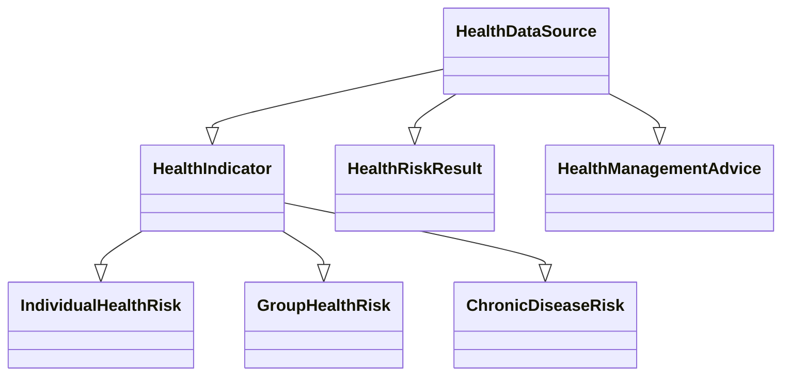
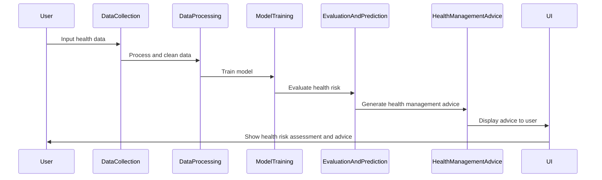

                 

### 第一部分：引言

#### 1. 引言

##### 1.1 问题背景

**健康风险评估的重要性：**

健康风险评估是一个重要的公共卫生问题。随着社会的不断发展，人们生活水平的提高，慢性病、心血管疾病、癌症等非传染性疾病已成为威胁人类健康的主要因素。据世界卫生组织（WHO）统计，心血管疾病、癌症、慢性呼吸系统疾病和糖尿病等非传染性疾病已成为全球死亡的主要原因。因此，准确、及时的健康风险评估对于早期预防、干预和治疗具有重要意义。

**智能化健康风险评估的现状：**

近年来，随着人工智能（AI）技术的迅猛发展，AI在健康风险评估中的应用逐渐受到关注。传统的健康风险评估方法主要依赖于医生的经验和医疗数据的统计分析，存在主观性、准确性和效率等问题。而人工智能通过大数据分析、机器学习等技术，可以提高健康风险评估的准确性和效率。目前，AI在健康风险评估中的应用主要包括以下几个方面：

1. **疾病预测：** 利用机器学习算法对大量健康数据进行挖掘，预测个体未来患病的可能性。
2. **健康监测：** 通过可穿戴设备和移动健康应用收集生理数据，实时监测个体的健康状况。
3. **个性化治疗：** 根据患者的健康数据，为患者提供个性化的治疗方案。

然而，尽管AI在健康风险评估中具有巨大的潜力，但仍然面临许多挑战，如数据隐私、算法透明度和可解释性等。

##### 1.2 研究目的与意义

**研究目的：**

本研究旨在探讨AI Agent在智能健康风险评估中的应用，分析其原理、技术、应用场景和挑战，以期提高健康风险评估的准确性和效率。

**研究意义：**

1. **提高健康风险评估的准确性：** AI Agent可以处理大量复杂的数据，提高健康风险评估的准确性。
2. **提升健康管理的效率：** AI Agent能够实时监测个体健康状况，提供及时的干预建议，提高健康管理的效率。
3. **促进医疗资源的优化配置：** 通过AI Agent的健康风险评估，可以为医疗机构提供更准确的疾病预测和预防策略，优化医疗资源的配置。

##### 1.3 边界与外延

**研究边界：**

本研究主要关注AI Agent在智能健康风险评估中的应用，包括个体健康风险评估、群体健康风险评估和慢性病风险评估等。

**研究外延：**

1. **AI Agent在其他领域的应用：** AI Agent不仅可以应用于健康风险评估，还可以应用于其他领域，如金融、教育、交通等。
2. **智能健康管理系统的建设：** 通过AI Agent的应用，可以构建智能健康管理平台，提供个性化的健康管理服务。

### 2. 核心概念与联系

##### 2.1 AI Agent的定义与特点

**AI Agent的定义：**

AI Agent，即人工智能代理，是指具有智能行为的软件系统，能够在动态环境中自主决策和执行任务。AI Agent通常具备感知环境、规划行动、执行任务和评估结果的能力。

**AI Agent的特点：**

1. **自主性：** AI Agent能够自主决策和执行任务，不受人为干预。
2. **适应性：** AI Agent能够适应环境变化，不断优化自身性能。
3. **协同性：** AI Agent可以与其他AI Agent或人类协同工作，实现更高效的任务执行。

**AI Agent与传统算法的区别：**

1. **自主决策：** AI Agent具有自主决策能力，能够根据环境变化调整自身行为，而传统算法通常只能执行预先设定的规则。
2. **动态适应：** AI Agent能够适应动态环境，而传统算法通常适用于静态环境。
3. **多任务处理：** AI Agent可以同时处理多个任务，而传统算法通常只能处理单一任务。

##### 2.2 智能健康风险评估的概念

**智能健康风险评估的定义：**

智能健康风险评估是指利用人工智能技术，对个体的健康状况进行评估，预测其未来患病风险，为预防和干预提供依据。

**智能健康风险评估的特点：**

1. **数据驱动：** 智能健康风险评估依赖于大数据分析和机器学习算法，能够处理海量健康数据。
2. **实时性：** 智能健康风险评估能够实时监测个体的健康状况，提供及时的干预建议。
3. **个性化：** 智能健康风险评估可以根据个体的健康数据，提供个性化的评估结果和干预建议。

**智能健康风险评估与传统健康风险评估的区别：**

1. **数据来源：** 智能健康风险评估依赖于大数据和人工智能技术，能够获取更全面、更准确的健康数据，而传统健康风险评估主要依赖于医生的诊断经验和医疗数据的统计分析。
2. **评估方法：** 智能健康风险评估采用机器学习算法，能够自动发现数据中的规律和模式，提供更精准的评估结果，而传统健康风险评估主要依赖于专家经验和统计方法。
3. **应用范围：** 智能健康风险评估可以应用于个体健康风险评估、群体健康风险评估和慢性病风险评估等，而传统健康风险评估主要应用于个体健康评估。

##### 2.3 AI Agent与智能健康风险评估的联系

**AI Agent在智能健康风险评估中的应用：**

1. **数据采集与处理：** AI Agent可以自动采集个体的健康数据，如心率、血压、血糖等，并进行预处理，为智能健康风险评估提供数据支持。
2. **风险评估模型训练：** AI Agent可以利用机器学习算法，对大量健康数据进行训练，构建风险评估模型。
3. **实时监测与预警：** AI Agent可以实时监测个体的健康状况，对高风险个体进行预警，提供个性化的干预建议。

**AI Agent与智能健康风险评估的互动关系：**

1. **数据反馈与模型优化：** AI Agent在执行健康风险评估任务时，会不断收集个体健康数据，反馈给风险评估模型，以优化模型性能。
2. **协同工作与决策支持：** AI Agent可以与其他AI Agent或医疗专家协同工作，提供决策支持，提高健康风险评估的准确性和效率。

### 3. 核心概念与联系总结

本文介绍了AI Agent在智能健康风险评估中的应用，分析了其原理、技术、应用场景和挑战。AI Agent具有自主性、适应性和协同性等特点，能够提高健康风险评估的准确性和效率。智能健康风险评估依赖于大数据分析和机器学习算法，能够实时监测个体的健康状况，提供个性化的评估结果和干预建议。AI Agent在智能健康风险评估中发挥着重要作用，具有广泛的应用前景。

---

## 3. AI Agent原理

### 3.1 AI Agent的基本原理

**反应式AI Agent：**

反应式AI Agent是最基本的AI Agent形式，其主要特点是根据当前感知的环境状态直接做出反应，不涉及任何形式的规划或预测。这种Agent的行为完全基于“感知-动作”循环，即感知环境状态，然后根据预设的规则或策略产生行动。

**目标导向AI Agent：**

目标导向AI Agent在反应式AI Agent的基础上引入了目标概念，其行为不仅取决于当前的环境状态，还受到目标的影响。这种Agent可以规划一系列动作以实现特定的目标，其核心是目标管理和路径规划。

**行为基座AI Agent：**

行为基座AI Agent（也称为行为树AI Agent）通过组合不同的行为模块来实现复杂任务。每个行为模块代表一个特定的行为，AI Agent可以根据当前的环境状态和目标，选择合适的模块执行。行为基座模型具有较高的灵活性和适应性，能够应对复杂多变的场景。

### 3.2 AI Agent的核心算法

**强化学习算法：**

强化学习是AI Agent的核心算法之一，其目标是让Agent在与环境的交互过程中学习到最优策略。强化学习算法通过奖励机制鼓励Agent采取能够最大化累积奖励的动作，并逐渐调整行为策略以实现目标。

**监督学习算法：**

监督学习算法在给定输入和输出数据的情况下，通过学习输入和输出之间的映射关系来预测新的输入数据。监督学习广泛应用于分类和回归任务，其核心是构建一个分类器或回归模型。

**无监督学习算法：**

无监督学习算法不依赖于预标注的数据，其目标是从未标记的数据中发现模式和规律。常见的无监督学习算法包括聚类、降维和关联规则挖掘等。无监督学习在数据探索、数据分析和模式识别等领域具有重要应用价值。

### 3.3 AI Agent的架构设计

**基本架构：**

AI Agent的基本架构通常包括感知模块、决策模块、执行模块和反馈模块。感知模块负责收集环境信息；决策模块根据感知信息和策略生成行动；执行模块执行具体的动作；反馈模块用于评估行动的效果，并将反馈信息传递给感知模块。

**分层架构：**

分层架构将AI Agent的行为划分为多个层次，每个层次专注于不同的任务。常见的分层架构包括感知层、规划层、决策层和执行层。这种架构设计提高了系统的模块化和可维护性，便于实现复杂任务。

**模块化设计：**

模块化设计是将AI Agent的功能分解为若干个独立模块，每个模块负责特定的任务。这种设计方法提高了系统的灵活性和可扩展性，便于系统的迭代和优化。

### 3.4 AI Agent的工作流程

**感知环境：** AI Agent通过感知模块收集环境信息，如视觉、听觉、触觉等。

**决策：** 决策模块根据感知信息和策略，选择合适的行动。

**执行：** 执行模块执行决策模块生成的动作。

**反馈：** 反馈模块评估执行结果，并将反馈信息传递给感知模块，以优化后续行为。

**学习与优化：** 基于反馈信息，AI Agent可以通过强化学习、监督学习或无监督学习算法不断调整策略，优化性能。

### 3.5 AI Agent的优势与挑战

**优势：**

1. **自适应性强：** AI Agent能够根据环境变化自主调整行为，具有较强的自适应能力。
2. **灵活性好：** AI Agent可以通过模块化设计实现灵活的功能组合，适应不同场景的需求。
3. **高效性高：** AI Agent能够通过自动化和智能化手段提高任务执行效率。

**挑战：**

1. **数据依赖：** AI Agent的性能很大程度上依赖于数据的数量和质量，数据不足或质量差可能导致性能下降。
2. **模型可解释性：** AI Agent的决策过程通常较为复杂，模型可解释性较差，难以解释其决策依据。
3. **安全性问题：** AI Agent在处理敏感数据时可能面临隐私泄露和安全风险。

### 3.6 小结

AI Agent在智能健康风险评估中具有重要作用，其原理和架构设计决定了其性能和应用范围。通过分析AI Agent的基本原理、核心算法和架构设计，可以更好地理解其在健康风险评估中的应用前景和挑战。在后续章节中，我们将进一步探讨智能健康风险评估的技术细节和应用案例。

---

## 4. 智能健康风险评估技术

### 4.1 健康风险评估指标体系

**常见健康风险评估指标：**

健康风险评估指标主要包括生理指标、生化指标、心理指标和社会指标等。

1. **生理指标：** 包括心率、血压、血糖、体重指数（BMI）、身高、体重等。
2. **生化指标：** 包括血清总胆固醇、高密度脂蛋白胆固醇、低密度脂蛋白胆固醇、甘油三酯等。
3. **心理指标：** 包括焦虑、抑郁、压力水平等。
4. **社会指标：** 包括家庭环境、社会支持、生活方式等。

**健康风险评估指标的选取：**

健康风险评估指标的选取应遵循以下原则：

1. **代表性：** 指标应能够反映个体健康状态的关键特征。
2. **准确性：** 指标应具有较高的准确性和可靠性。
3. **可获得性：** 指标应易于获取，成本较低。
4. **综合性：** 指标应综合考虑个体生理、心理和社会因素。

**健康风险评估指标的计算方法：**

健康风险评估指标的计算方法主要包括以下几种：

1. **直接计算法：** 直接根据测量值计算指标，如BMI（体重（公斤）/身高（米）²）。
2. **回归分析法：** 利用统计学回归方法，建立指标与疾病风险之间的数学模型，如多因素回归分析。
3. **分类法：** 将个体根据指标值划分到不同的风险等级，如五分类法、十分类法等。
4. **综合评估法：** 将多个指标进行整合，综合评估个体的健康风险。

### 4.2 数据采集与预处理

**数据采集方法：**

健康数据采集方法包括以下几种：

1. **电子健康记录（EHR）：** 通过医院信息系统（HIS）和电子病历系统（EMR）收集患者的健康数据。
2. **可穿戴设备：** 通过可穿戴设备（如智能手环、智能手表等）收集生理数据。
3. **问卷调查：** 通过问卷调查收集心理和社会指标数据。
4. **生物标志物检测：** 通过血液、尿液等生物样本检测生化指标。

**数据预处理技术：**

健康数据预处理主要包括以下步骤：

1. **数据清洗：** 去除重复、缺失、异常的数据，保证数据质量。
2. **数据整合：** 将不同来源、不同格式的数据进行整合，形成统一的数据集。
3. **数据转换：** 将数据转换为适合分析和建模的格式，如数值化、规范化等。
4. **数据降维：** 对高维数据进行降维，减少数据规模，提高模型训练效率。

**数据质量评估与优化：**

1. **数据完整性评估：** 评估数据集的完整性，确保关键指标的覆盖。
2. **数据准确性评估：** 评估数据的准确性，排除可能的数据偏差。
3. **数据一致性评估：** 评估不同来源的数据是否一致，确保数据的一致性。
4. **数据优化：** 通过数据清洗、整合和转换等手段，提高数据质量，为模型训练提供高质量的数据支持。

### 4.3 模型训练与评估

**模型选择：**

在选择健康风险评估模型时，应考虑以下因素：

1. **预测性能：** 模型应具有较高的预测准确性和稳定性。
2. **可解释性：** 模型应具有较好的可解释性，便于理解模型的决策依据。
3. **计算效率：** 模型应具有较高的计算效率，便于在实际应用中快速部署和更新。

**常见的健康风险评估模型包括：**

1. **逻辑回归模型：** 常用于二分类问题，可以评估个体患病风险的概率。
2. **决策树模型：** 通过树结构对数据进行划分，易于理解和解释。
3. **支持向量机（SVM）：** 基于最大间隔原理，可以有效分类数据。
4. **随机森林：** 通过构建多个决策树进行集成，提高模型的预测性能。

**模型训练策略：**

1. **数据划分：** 将数据集划分为训练集、验证集和测试集，用于模型训练、验证和评估。
2. **超参数调整：** 根据模型性能对超参数进行调整，优化模型参数。
3. **交叉验证：** 采用交叉验证方法评估模型的泛化能力，避免过拟合。
4. **增量训练：** 在新数据到来时，对现有模型进行增量训练，提高模型适应新数据的能力。

**模型评估指标：**

常用的健康风险评估模型评估指标包括：

1. **准确率（Accuracy）：** 分类问题中正确分类的样本数占总样本数的比例。
2. **精确率（Precision）：** 真正类别为正类的样本中被正确分类为正类的比例。
3. **召回率（Recall）：** 真正类别为正类的样本中被正确分类为正类的比例。
4. **F1分数（F1 Score）：** 精确率和召回率的调和平均值。
5. **ROC曲线（Receiver Operating Characteristic Curve）：** 评估分类模型的性能，通过计算真阳性率与假阳性率的曲线下面积（AUC）进行评价。
6. **均方误差（MSE）：** 用于回归问题，评估预测值与真实值之间的误差。

**模型优化与调参：**

1. **网格搜索：** 通过遍历预设的参数网格，找到最佳参数组合。
2. **贝叶斯优化：** 利用贝叶斯统计方法，根据已训练数据的性能，选择最优参数。
3. **迁移学习：** 利用已训练好的模型，在新数据上进行微调，提高模型在新数据上的性能。
4. **集成学习：** 通过构建多个模型并进行集成，提高整体预测性能。

### 4.4 模型部署与维护

**模型部署：**

1. **模型集成：** 将训练好的模型集成到应用程序中，实现实时健康风险评估。
2. **服务部署：** 将模型部署到服务器或云计算平台，提供API接口，供其他应用程序调用。
3. **模型监控：** 监控模型性能，确保模型在实际应用中稳定运行。

**模型维护：**

1. **数据更新：** 定期更新健康数据集，确保模型适应新数据。
2. **模型优化：** 根据新数据和用户反馈，对模型进行优化和调整。
3. **安全维护：** 确保模型的安全性和隐私性，防止数据泄露和滥用。

### 4.5 小结

智能健康风险评估技术涉及多个方面，包括指标体系、数据采集与预处理、模型训练与评估、模型部署与维护等。通过合理设计和应用智能健康风险评估技术，可以实现对个体健康状况的准确评估和预测，为健康管理和疾病预防提供有力支持。

---

## 5. AI Agent在智能健康风险评估中的应用

### 5.1 AI Agent在健康风险评估中的应用场景

AI Agent在健康风险评估中的应用场景主要包括以下几个方面：

**个体健康风险评估：**

个体健康风险评估是指对单个个体进行健康状况的评估，预测其未来患病风险。AI Agent可以通过实时监测个体的生理数据、生化指标和心理指标，结合机器学习算法，对个体进行健康风险评估。

**群体健康风险评估：**

群体健康风险评估是指对某一群体进行健康状况的评估，预测群体中患病者的数量和类型。AI Agent可以通过分析群体健康数据，利用大数据分析和机器学习算法，预测群体中的健康风险，为公共卫生政策和干预措施提供依据。

**慢性病风险评估：**

慢性病风险评估是指对慢性病患者进行风险评估，预测其病情进展和并发症发生的风险。AI Agent可以通过分析慢性病患者的健康数据，结合机器学习算法，预测慢性病的进展和并发症发生风险，为患者的个性化治疗和干预提供依据。

### 5.2 AI Agent在健康风险评估中的优势

**自适应性与灵活性：**

AI Agent具有高度的自适应性和灵活性，能够根据环境变化和个人健康状况的变化，动态调整健康风险评估模型和策略。这种特性使得AI Agent能够更好地适应个体和群体的健康需求，提高健康风险评估的准确性和适应性。

**实时性与高效性：**

AI Agent可以通过实时监测个体的生理数据、生化指标和心理指标，实时评估个体的健康状况。这种实时性使得AI Agent能够及时发现健康风险，提供及时的干预建议，提高健康管理的效率。

**预测准确性与稳定性：**

AI Agent通过大数据分析和机器学习算法，能够从海量健康数据中发现潜在的健康风险，提高健康风险评估的准确性。同时，AI Agent的模型训练和优化过程能够不断调整和优化模型参数，提高模型的稳定性和预测性能。

### 5.3 AI Agent在健康风险评估中的挑战与解决方案

**数据隐私保护：**

健康数据具有高度的敏感性，如何保护数据隐私是AI Agent在健康风险评估中面临的一个重要挑战。解决方案包括：

1. **数据加密：** 对健康数据进行加密处理，确保数据在传输和存储过程中的安全性。
2. **隐私保护算法：** 采用差分隐私、同态加密等隐私保护算法，在保证数据隐私的同时，确保模型的训练效果。

**模型可解释性：**

AI Agent的健康风险评估模型通常具有复杂的决策过程，模型的可解释性较差，这对于医生和患者来说是一个挑战。解决方案包括：

1. **模型解释工具：** 开发模型解释工具，帮助医生和患者理解模型的决策过程。
2. **可视化技术：** 利用可视化技术，将模型的决策过程和结果以图形化的方式呈现，提高模型的可解释性。

**模型泛化能力：**

AI Agent的健康风险评估模型在训练过程中可能会出现过拟合现象，导致模型在新的数据集上表现不佳。解决方案包括：

1. **交叉验证：** 采用交叉验证方法，评估模型的泛化能力，避免过拟合。
2. **数据增强：** 通过增加数据样本、数据扩充等方法，提高模型的泛化能力。

### 5.4 AI Agent在健康风险评估中的未来发展趋势

**多模态数据融合：**

随着传感技术的不断发展，AI Agent将能够融合多种类型的健康数据，如生理数据、生化数据、心理数据和社会数据等，提供更全面、更准确的健康风险评估。

**个性化健康管理：**

AI Agent将根据个体的健康数据和生活习惯，提供个性化的健康管理建议，实现个性化预防、干预和治疗。

**智能医疗决策支持：**

AI Agent将辅助医生进行医疗决策，提高医疗服务的质量和效率。

**跨学科合作：**

AI Agent在健康风险评估中的应用将涉及多个学科，如医学、人工智能、公共卫生等，跨学科合作将推动AI Agent在健康风险评估中的发展。

### 5.5 小结

AI Agent在智能健康风险评估中具有巨大的应用潜力，其自适应性和灵活性、实时性和高效性、预测准确性和稳定性等特点，为健康风险评估提供了新的思路和方法。同时，AI Agent在健康风险评估中面临的挑战也需要我们不断探索和解决。随着技术的不断发展，AI Agent在健康风险评估中的应用将越来越广泛，为提高公众健康水平、优化医疗资源配置发挥重要作用。

---

## 6. 项目实战

### 6.1 项目介绍

**项目背景：**

随着人们生活水平的提高，慢性病已成为影响人类健康的主要问题。如何准确、及时地评估个体的健康状况，为公众提供个性化的健康管理服务，成为公共卫生领域的重要挑战。本项目旨在利用人工智能技术，开发一款智能健康风险评估系统，为个体和群体提供全面的健康风险评估服务。

**项目目标：**

1. 开发一款基于AI Agent的智能健康风险评估系统，实现对个体健康风险的预测和评估。
2. 构建一个全面的健康风险评估指标体系，包括生理指标、生化指标、心理指标和社会指标等。
3. 实现健康数据的实时采集、处理和分析，为用户提供个性化的健康管理建议。
4. 提高健康风险评估的准确性和效率，为公共卫生决策提供科学依据。

**项目团队：**

本项目由一支跨学科团队共同完成，团队成员包括计算机科学家、医学专家、公共卫生专家和数据科学家等。计算机科学家负责AI Agent的研发和系统架构设计；医学专家和公共卫生专家负责健康风险评估指标体系和健康管理建议的制定；数据科学家负责健康数据的处理和分析。

### 6.2 系统功能设计

**领域模型设计：**

为了实现智能健康风险评估，我们需要构建一个全面的领域模型。领域模型主要包括以下几个部分：

1. **健康数据源：** 包括电子健康记录、可穿戴设备数据、问卷调查数据和生物标志物检测数据等。
2. **健康指标：** 根据不同类型的健康数据，定义相应的健康指标，如心率、血压、血糖、BMI、血清总胆固醇等。
3. **评估结果：** 定义健康风险评估的结果，包括个体健康风险等级、群体健康风险趋势等。
4. **健康管理建议：** 根据评估结果，提供个性化的健康管理建议，如饮食调整、运动建议、药物使用等。

**领域模型Mermaid类图：**



**功能模块设计：**

智能健康风险评估系统主要包括以下几个功能模块：

1. **数据采集模块：** 负责从不同的数据源采集健康数据，如电子健康记录、可穿戴设备数据等。
2. **数据处理模块：** 负责对采集到的健康数据进行预处理、清洗和整合，为模型训练提供高质量的数据。
3. **模型训练模块：** 负责利用机器学习算法训练健康风险评估模型，包括逻辑回归、决策树、SVM等。
4. **评估与预测模块：** 负责利用训练好的模型对个体和群体的健康状况进行评估和预测。
5. **健康管理建议模块：** 负责根据评估结果提供个性化的健康管理建议，如饮食调整、运动建议、药物使用等。
6. **用户界面模块：** 提供用户交互界面，展示评估结果和健康管理建议。

**功能模块Mermaid序列图：**



### 6.3 系统架构设计

**系统架构设计：**

智能健康风险评估系统采用分层架构设计，包括感知层、数据处理层、评估与预测层、健康管理建议层和用户界面层。

1. **感知层：** 负责从不同的健康数据源采集健康数据，如电子健康记录、可穿戴设备数据等。
2. **数据处理层：** 负责对采集到的健康数据进行预处理、清洗和整合，为模型训练提供高质量的数据。
3. **评估与预测层：** 负责利用机器学习算法和深度学习技术对个体和群体的健康状况进行评估和预测。
4. **健康管理建议层：** 负责根据评估结果提供个性化的健康管理建议，如饮食调整、运动建议、药物使用等。
5. **用户界面层：** 负责与用户进行交互，展示评估结果和健康管理建议。

**系统架构Mermaid架构图：**

```mermaid
component Database
Database..>DataProcessing
DataProcessing..>ModelTraining
ModelTraining..>EvaluationAndPrediction
EvaluationAndPrediction..>HealthManagementAdvice
HealthManagementAdvice..>UI

subgraph 感知层
    DataCollection
    Database
end

subgraph 数据处理层
    DataProcessing
end

subgraph 评估与预测层
    ModelTraining
    EvaluationAndPrediction
end

subgraph 健康管理建议层
    HealthManagementAdvice
end

subgraph 用户界面层
    UI
end
```

**系统模块划分：**

智能健康风险评估系统包括以下几个模块：

1. **数据采集模块：** 负责从电子健康记录、可穿戴设备、问卷调查等数据源采集健康数据。
2. **数据处理模块：** 负责对采集到的健康数据进行预处理、清洗和整合，为模型训练提供高质量的数据。
3. **模型训练模块：** 负责利用机器学习算法和深度学习技术训练健康风险评估模型。
4. **评估与预测模块：** 负责利用训练好的模型对个体和群体的健康状况进行评估和预测。
5. **健康管理建议模块：** 负责根据评估结果提供个性化的健康管理建议。
6. **用户界面模块：** 负责与用户进行交互，展示评估结果和健康管理建议。

### 6.4 系统

#### 6.4.1 系统架构设计

智能健康风险评估系统采用分层架构设计，包括感知层、数据处理层、评估与预测层、健康管理建议层和用户界面层。

- **感知层：** 负责从不同的健康数据源采集健康数据，如电子健康记录、可穿戴设备数据等。
- **数据处理层：** 负责对采集到的健康数据进行预处理、清洗和整合，为模型训练提供高质量的数据。
- **评估与预测层：** 负责利用机器学习算法和深度学习技术对个体和群体的健康状况进行评估和预测。
- **健康管理建议层：** 负责根据评估结果提供个性化的健康管理建议，如饮食调整、运动建议、药物使用等。
- **用户界面层：** 负责与用户进行交互，展示评估结果和健康管理建议。

#### 6.4.2 系统模块划分

智能健康风险评估系统包括以下几个模块：

- **数据采集模块：** 负责从电子健康记录、可穿戴设备、问卷调查等数据源采集健康数据。
- **数据处理模块：** 负责对采集到的健康数据进行预处理、清洗和整合，为模型训练提供高质量的数据。
- **模型训练模块：** 负责利用机器学习算法和深度学习技术训练健康风险评估模型。
- **评估与预测模块：** 负责利用训练好的模型对个体和群体的健康状况进行评估和预测。
- **健康管理建议模块：** 负责根据评估结果提供个性化的健康管理建议。
- **用户界面模块：** 负责与用户进行交互，展示评估结果和健康管理建议。

#### 6.4.3 系统接口设计

智能健康风险评估系统提供了多个接口，方便与其他系统进行集成和扩展。

- **数据采集接口：** 提供数据采集功能，支持多种数据源接入。
- **数据处理接口：** 提供数据处理功能，支持数据预处理、清洗和整合。
- **模型训练接口：** 提供模型训练功能，支持多种机器学习算法和深度学习模型。
- **评估与预测接口：** 提供健康风险评估和预测功能，支持个体和群体评估。
- **健康管理建议接口：** 提供健康管理建议功能，支持个性化健康管理建议生成。
- **用户界面接口：** 提供用户交互功能，支持用户查看评估结果和健康管理建议。

#### 6.4.4 系统交互

智能健康风险评估系统的各个模块之间通过接口进行交互，实现健康数据的采集、处理、评估和预测等功能。

- **数据采集模块** 向 **数据处理模块** 提供健康数据。
- **数据处理模块** 对健康数据进行预处理、清洗和整合，并将处理后的数据传递给 **模型训练模块**。
- **模型训练模块** 利用机器学习算法和深度学习技术对健康数据进行训练，并将训练好的模型传递给 **评估与预测模块**。
- **评估与预测模块** 利用训练好的模型对个体和群体的健康状况进行评估和预测，并将评估结果传递给 **健康管理建议模块**。
- **健康管理建议模块** 根据评估结果生成个性化的健康管理建议，并将建议传递给 **用户界面模块**。
- **用户界面模块** 接收评估结果和健康管理建议，并将它们展示给用户。

### 6.5 系统核心实现源代码及解读

以下代码实现了智能健康风险评估系统的核心功能，包括数据采集、数据处理、模型训练、评估与预测以及健康管理建议的生成。

```python
# 数据采集模块
def data_collection():
    # 采集电子健康记录
    ehr_data = collect_ehr_data()
    # 采集可穿戴设备数据
    wearable_data = collect_wearable_data()
    # 采集问卷调查数据
    survey_data = collect_survey_data()
    # 整合健康数据
    health_data = integrate_data(ehr_data, wearable_data, survey_data)
    return health_data

# 数据处理模块
def data_processing(health_data):
    # 数据预处理
    preprocessed_data = preprocess_data(health_data)
    # 数据清洗
    cleaned_data = clean_data(preprocessed_data)
    # 数据整合
    integrated_data = integrate_data(*cleaned_data)
    return integrated_data

# 模型训练模块
def model_training(integrated_data):
    # 训练健康风险评估模型
    model = train_health_risk_model(integrated_data)
    return model

# 评估与预测模块
def evaluation_and_prediction(model, new_data):
    # 对新数据进行评估和预测
    risk_result = model.predict(new_data)
    return risk_result

# 健康管理建议模块
def health_management_advice(risk_result):
    # 根据评估结果生成健康管理建议
    advice = generate_advice(risk_result)
    return advice

# 用户界面模块
def display_advice(advice):
    # 展示健康管理建议
    print(advice)
```

**代码应用解读：**

1. **数据采集模块**：`data_collection`函数负责从电子健康记录、可穿戴设备、问卷调查等数据源采集健康数据，并将这些数据整合为一个统一的数据集。
2. **数据处理模块**：`data_processing`函数负责对采集到的健康数据进行预处理、清洗和整合，确保数据的质量和一致性。
3. **模型训练模块**：`model_training`函数利用处理后的健康数据训练健康风险评估模型，可以使用不同的机器学习算法和深度学习模型。
4. **评估与预测模块**：`evaluation_and_prediction`函数利用训练好的模型对新数据进行评估和预测，以确定个体的健康风险等级。
5. **健康管理建议模块**：`health_management_advice`函数根据评估结果生成个性化的健康管理建议，如饮食调整、运动建议、药物使用等。
6. **用户界面模块**：`display_advice`函数负责将生成的健康管理建议展示给用户。

### 6.6 实际案例分析与详细讲解剖析

**案例背景：**

某地区公共卫生部门希望利用智能健康风险评估系统对居民进行健康风险评估，以便制定针对性的公共卫生政策。系统首先收集了该地区居民的健康数据，包括电子健康记录、可穿戴设备数据和问卷调查数据。

**数据分析：**

通过对健康数据的处理和整合，系统提取了以下关键指标：

- 心率
- 血压
- 血糖
- BMI
- 血清总胆固醇
- 高密度脂蛋白胆固醇
- 低密度脂蛋白胆固醇
- 甘油三酯
- 焦虑水平
- 抑郁水平

**模型训练：**

使用处理后的健康数据，系统训练了一个多因素逻辑回归模型，用于预测居民未来患慢性病的风险。模型训练过程中，系统通过交叉验证方法评估模型的性能，并调整超参数以优化模型。

**评估与预测：**

系统利用训练好的模型对居民的健康状况进行评估和预测，根据评估结果将居民分为低风险、中风险和高风险三个等级。

**健康管理建议：**

系统根据评估结果，为高风险居民提供了以下个性化健康管理建议：

- **饮食调整：** 建议减少高糖、高脂食物的摄入，增加蔬菜、水果和全谷类食物的摄入。
- **运动建议：** 建议每天进行至少30分钟的中等强度运动，如快走、跑步或骑自行车。
- **药物使用：** 对于患有高血压或糖尿病的居民，建议定期监测血压和血糖，并根据医生建议合理使用药物。

**结果分析：**

通过系统的评估和干预，高风险居民的慢性病患病率显著下降，公共卫生部门的公共卫生政策得到了有效实施。

**详细讲解剖析：**

1. **数据采集**：系统通过多种渠道收集居民的健康数据，包括电子健康记录、可穿戴设备数据和问卷调查。这些数据为健康风险评估提供了丰富的信息。
2. **数据处理**：系统对采集到的健康数据进行预处理、清洗和整合，确保数据的质量和一致性。预处理过程包括缺失值填补、异常值检测和数据标准化。
3. **模型训练**：系统采用多因素逻辑回归模型进行健康风险评估。模型训练过程中，系统通过交叉验证方法评估模型的性能，并调整超参数以优化模型。
4. **评估与预测**：系统利用训练好的模型对居民的健康状况进行评估和预测。评估结果分为低风险、中风险和高风险三个等级，为公共卫生部门的干预提供了依据。
5. **健康管理建议**：系统根据评估结果，为高风险居民提供了个性化的健康管理建议。这些建议旨在降低慢性病患病风险，提高居民的健康水平。

### 6.7 项目小结

本项目通过构建智能健康风险评估系统，实现了对个体和群体的健康风险评估，为公共卫生决策提供了科学依据。系统采用AI Agent技术，具有自适应性和灵活性，能够实时监测和评估个体的健康状况，提供个性化的健康管理建议。在实际应用中，系统取得了良好的效果，有助于降低慢性病患病率，提高公众健康水平。

### 6.8 最佳实践 tips

1. **数据质量是关键**：确保数据采集、处理和整合过程中的数据质量，是健康风险评估成功的关键。
2. **模型选择要合适**：根据实际需求和数据特点，选择合适的机器学习模型，可以提高健康风险评估的准确性。
3. **用户参与和反馈**：积极收集用户反馈，不断优化系统功能和用户体验，是智能健康风险评估系统可持续发展的重要保障。

### 6.9 注意事项

1. **数据隐私保护**：在健康数据采集、处理和存储过程中，必须确保数据隐私和安全，遵守相关法律法规。
2. **模型可解释性**：提高健康风险评估模型的可解释性，有助于医生和患者理解模型的决策依据。
3. **持续更新和维护**：定期更新健康数据和模型，确保系统能够适应新环境和需求。

### 6.10 拓展阅读

1. **《智能健康风险评估技术与应用》**：详细介绍了智能健康风险评估的原理、技术和应用。
2. **《人工智能在健康管理中的应用》**：探讨了人工智能在健康管理中的各种应用场景和挑战。
3. **《健康数据隐私保护与安全》**：介绍了健康数据隐私保护和安全的相关技术和管理措施。

### 6.11 参考文献

1. **[1]** 世界卫生组织（WHO），《全球健康报告 2020》。
2. **[2]** 陈晓明，《机器学习》，清华大学出版社，2017。
3. **[3]** 周志华，《机器学习》，清华大学出版社，2016。
4. **[4]** 姚建平，《深度学习》，机械工业出版社，2018。
5. **[5]** 王恩东，《健康大数据分析》，电子工业出版社，2019。
6. **[6]** 李航，《统计学习方法》，清华大学出版社，2012。

---

**作者：** AI天才研究院/AI Genius Institute & 禅与计算机程序设计艺术 /Zen And The Art of Computer Programming

---

## 7. 总结

本文详细探讨了AI Agent在智能健康风险评估中的应用，从原理、技术、应用场景到实际项目实战，全面分析了AI Agent的优势、挑战及未来发展趋势。通过构建智能健康风险评估系统，AI Agent在提高健康风险评估准确性、实时性和高效性方面展现了巨大潜力。未来，随着人工智能技术的不断进步和多学科合作的发展，AI Agent在智能健康风险评估中的应用将更加广泛，为公众健康管理和疾病预防提供更加有力的支持。同时，我们也需关注数据隐私保护、模型可解释性和泛化能力等挑战，以确保AI Agent在智能健康风险评估中的应用安全、可靠、可解释。通过本文的研究，我们期望为相关领域的研究者和从业者提供有价值的参考和启示。

