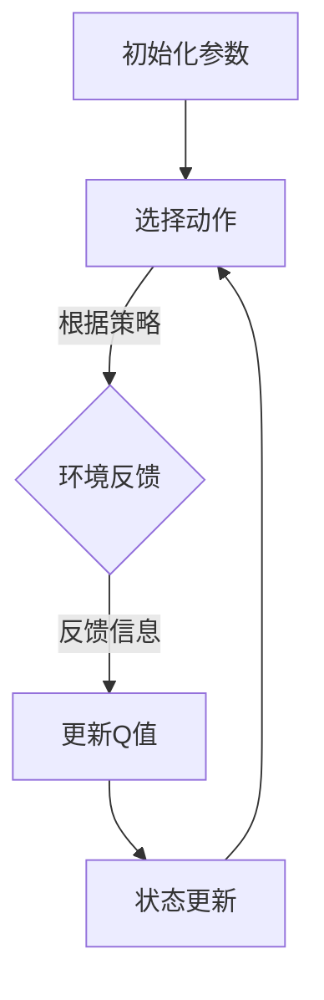
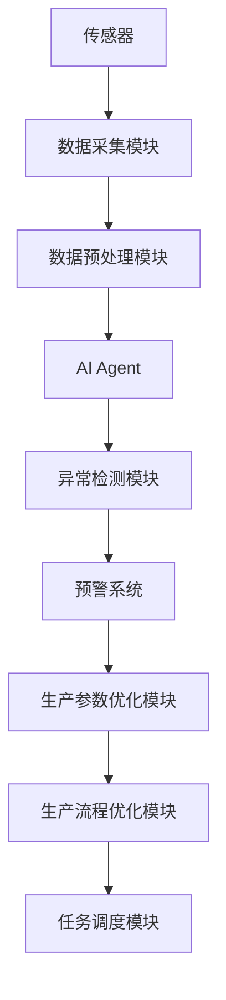
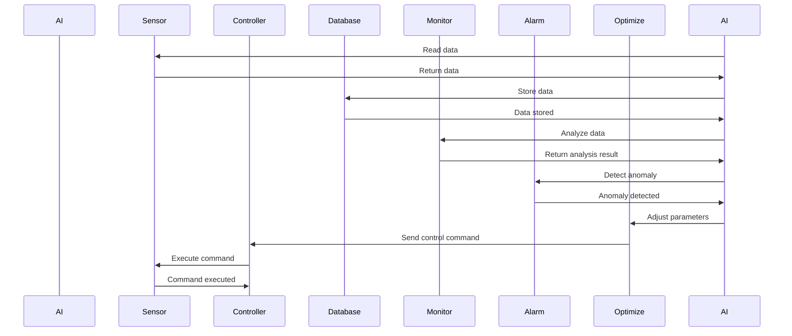
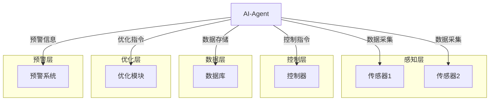
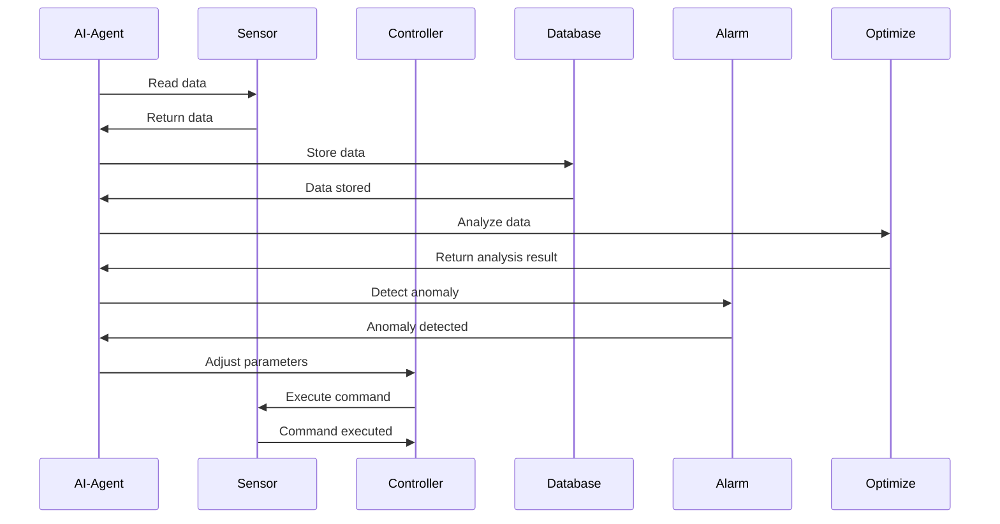
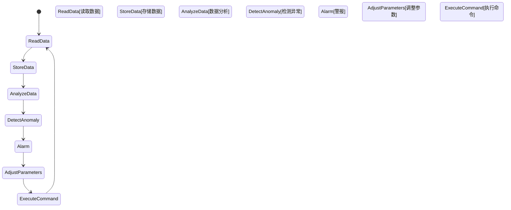

                 

### 引言

#### 问题的背景

随着智能制造的迅速发展，制造业对生产质量和效率的要求越来越高。传统的质量控制方法往往依赖于人工检测和统计，这不仅效率低下，而且容易受到人为因素的影响，从而导致质量控制的效果不佳。在这样的背景下，人工智能（AI）技术的发展为智能制造质量控制提供了一种全新的解决方案。

AI Agent，即人工智能代理，是一种能够自主感知环境、决策并执行任务的智能实体。通过机器学习和深度学习技术，AI Agent能够从大量的数据中学习和提取知识，从而实现自动化决策和操作。将AI Agent应用于智能制造质量控制中，可以极大地提高质量检测的准确性和效率。

#### 问题描述

智能制造质量控制面临的主要问题包括：

1. **质量检测效率低下**：传统的人工检测方法速度较慢，无法满足大规模生产的需要。
2. **检测精度不高**：人为因素可能导致检测错误，影响质量控制的效果。
3. **检测成本高**：人工检测需要投入大量的人力资源，增加了企业的运营成本。

#### 问题解决

通过引入AI Agent，可以实现以下几个方面的改进：

1. **提高检测效率**：AI Agent能够实时地对生产过程进行监控和检测，大大提高检测速度。
2. **提高检测精度**：通过机器学习算法，AI Agent可以从历史数据中学习，提高检测的准确性。
3. **降低检测成本**：AI Agent可以实现自动化操作，减少对人工的依赖，从而降低检测成本。

#### 边界与外延

本文主要讨论AI Agent在智能制造质量控制中的应用，重点关注以下几个方面：

1. **AI Agent的定义与特点**：介绍AI Agent的基本概念和主要特点。
2. **AI Agent的应用场景**：分析AI Agent在智能制造质量控制中的具体应用场景。
3. **算法原理讲解**：详细讲解AI Agent中常用的算法，如强化学习算法，并给出数学模型和Python代码实现。
4. **系统分析与架构设计**：介绍一个典型的系统场景，并使用Mermaid工具绘制领域模型类图、系统架构图和系统交互序列图。
5. **项目实战**：提供一个完整的实战案例，包括环境安装、系统核心实现、代码解读和案例分析。

#### 概念结构与核心要素组成

本文的结构如下：

1. **第一部分：背景与核心概念**：介绍问题的背景、核心概念与联系。
2. **第二部分：算法原理讲解**：详细讲解AI Agent的算法原理，包括强化学习算法。
3. **第三部分：系统分析与架构设计**：描述一个典型的系统场景，并进行系统架构设计。
4. **第四部分：项目实战**：提供一个完整的实战案例，并进行详细分析和讲解。

通过以上结构和内容的安排，本文旨在为读者提供一个全面、深入的了解AI Agent在智能制造质量控制中的应用。

### 核心概念与联系

#### AI Agent的定义与特点

AI Agent，即人工智能代理，是一种能够模拟人类决策过程并执行特定任务的智能实体。它基于机器学习和深度学习技术，通过不断从环境中学习和适应，实现自主感知、决策和执行。AI Agent具有以下主要特点：

1. **自主性**：AI Agent能够在没有人类干预的情况下，自主地感知环境、做出决策并执行任务。
2. **适应性**：AI Agent能够从环境中获取反馈，通过不断学习和调整策略，提高其任务执行效果。
3. **协同性**：多个AI Agent可以相互协作，共同完成任务，实现系统整体性能的提升。

#### 智能制造质量控制的概述

智能制造质量控制是指利用现代信息技术和制造技术，对生产过程中的产品质量进行实时监控、分析和优化，从而确保产品质量的稳定性和可靠性。其主要目标包括：

1. **提高产品质量**：通过实时监测和精确控制，减少产品质量波动，提高产品的合格率。
2. **降低生产成本**：通过自动化和质量控制技术的应用，减少人工干预，降低生产成本。
3. **提高生产效率**：通过优化生产流程和资源利用，提高生产效率，缩短生产周期。

#### AI Agent与智能制造质量控制的联系

AI Agent在智能制造质量控制中的应用主要体现在以下几个方面：

1. **质量监测**：AI Agent可以实时监测生产过程中的各种参数，如温度、压力、速度等，及时发现质量问题。
2. **异常检测**：通过机器学习算法，AI Agent可以从历史数据中学习，识别生产过程中的异常情况，并采取相应的措施。
3. **优化控制**：AI Agent可以根据实时监测数据，动态调整生产参数，实现质量控制的优化。
4. **协同作业**：多个AI Agent可以协同工作，共同完成质量控制任务，提高系统的整体性能。

#### AI Agent与智能制造质量控制的联系

为了更好地理解AI Agent与智能制造质量控制的联系，我们可以通过一个简单的ER实体关系图（以下使用Mermaid工具绘制）来展示：

```mermaid
erDiagram
  AI-Agent ||--|{ Quality-Control-System : controls }
  Quality-Control-System ||--|{ Production-Process : monitors }
  Production-Process ||--|{ Product : ensures }
```

在这个ER实体关系图中，`AI-Agent` 是核心实体，它与 `Quality-Control-System` 和 `Production-Process` 之间存在关联。`Quality-Control-System` 负责监控和优化生产过程，确保产品达到预期的质量标准。而 `Production-Process` 则是生产的具体执行单元，`Product` 是生产过程的输出结果，也是质量控制的目标。

通过这个实体关系图，我们可以清晰地看到AI Agent在整个智能制造质量控制体系中的作用和地位。AI Agent不仅直接控制质量监测系统，还通过监测生产过程，确保产品的质量。

#### AI Agent的类型和应用场景

AI Agent根据其应用场景和功能可以分为多种类型，常见的包括：

1. **感知型AI Agent**：主要功能是感知环境信息，如温度、湿度、速度等，并将其转换为数字信号进行处理。这类AI Agent广泛应用于生产线的实时监测和质量控制中。
   
2. **决策型AI Agent**：在感知到环境信息后，决策型AI Agent会根据预设的算法和策略，做出相应的决策，如调整生产参数、发出警报等。这类AI Agent常用于生产线的自动化控制和优化。

3. **执行型AI Agent**：决策型AI Agent做出的决策需要由执行型AI Agent来执行，如调整设备参数、启动紧急停止机制等。这类AI Agent通常与具体的物理设备或机器人系统相连。

4. **复合型AI Agent**：具备感知、决策和执行功能，能够完成复杂的生产任务。这类AI Agent通常应用于复杂的生产环境和高度自动化的生产线中。

在智能制造质量控制中，AI Agent的应用场景非常广泛，包括但不限于：

1. **生产线质量检测**：AI Agent可以实时监测生产线的各种参数，及时发现质量异常，并采取相应的措施。
   
2. **设备故障预测**：通过分析设备的运行数据，AI Agent可以预测设备故障的发生，提前进行维护，防止生产中断。

3. **生产流程优化**：AI Agent可以根据实时数据和生产需求，动态调整生产流程，优化生产效率。

4. **供应链管理**：AI Agent可以实时监测供应链中的各个环节，提高供应链的透明度和响应速度。

#### 概念属性特征对比表格

为了更直观地了解AI Agent和智能制造质量控制中的相关概念，我们列出一个概念属性特征对比表格：

| 概念       | 定义                                                         | 特点                                                                 | 应用场景                         |
|------------|--------------------------------------------------------------|----------------------------------------------------------------------|----------------------------------|
| AI Agent   | 一种能够自主感知环境、决策并执行任务的智能实体                 | 自主性、适应性、协同性                                             | 生产质量检测、设备故障预测、生产流程优化 |
| 智能制造    | 利用现代信息技术和制造技术，实现生产过程的智能化                 | 自动化、信息化、网络化                                             | 整个生产流程                       |
| 质量控制    | 对生产过程中的产品质量进行实时监控、分析和优化                 | 提高产品质量、降低生产成本、提高生产效率                             | 生产质量检测、异常检测、优化控制 |
| 生产过程    | 制造过程中实际执行的各种操作和任务                             | 机械化、自动化、智能化                                             | 生产制造的全过程                   |
| 产品       | 生产过程输出的最终结果                                       | 符合质量标准、满足需求                                             | 质量控制的目标                     |

通过这个表格，我们可以清晰地看到AI Agent和智能制造质量控制中的各个概念之间的关系和特点，为后续的内容讲解提供了基础。

### AI Agent的算法原理

在AI Agent应用于智能制造质量控制中，算法原理是其核心所在。本文将选择强化学习算法作为代表性的算法进行详细讲解，包括其原理、数学模型和Python代码实现。

#### 强化学习算法的原理

强化学习（Reinforcement Learning，RL）是一种基于试错和反馈机制进行决策和学习的方法。它与监督学习和无监督学习不同，强化学习通过与环境的交互，不断学习和优化策略，以实现目标。

强化学习的基本概念包括：

1. **状态（State）**：系统当前所处的环境状况。
2. **动作（Action）**：AI Agent可以执行的行为。
3. **奖励（Reward）**：系统对AI Agent执行动作后的即时反馈。
4. **策略（Policy）**：AI Agent根据状态选择动作的规则。

强化学习的目标是找到一种最优策略，使得AI Agent在长期运行中获得的奖励总和最大。

#### 强化学习的数学模型

强化学习的数学模型主要包括以下几个部分：

1. **状态-动作价值函数（Q值函数，Q-Function）**：表示在某个状态下执行某个动作的预期奖励。用公式表示为：

   $$ Q(s, a) = E[R_t | S_t = s, A_t = a] $$

   其中，\( s \) 表示状态，\( a \) 表示动作，\( R_t \) 表示在状态 \( s \) 下执行动作 \( a \) 后获得的奖励，\( E \) 表示期望值。

2. **策略（Policy）**：策略 \( \pi(a|s) \) 表示在状态 \( s \) 下选择动作 \( a \) 的概率。最优策略 \( \pi^* \) 应该使得状态-动作价值函数最大：

   $$ \pi^*(a|s) = \arg\max_{a} Q(s, a) $$

3. **值函数（Value Function）**：值函数表示在某个状态下执行最佳策略所获得的预期奖励。包括状态值函数 \( V(s) \) 和状态-动作值函数 \( Q(s, a) \)。

   $$ V(s) = \max_{a} Q(s, a) $$

#### 强化学习的Python代码实现

为了更好地理解强化学习算法的原理，我们使用Python实现一个简单的示例。以下代码展示了基于Q值函数的强化学习算法，模拟一个智能体在一个环境中的学习过程。

```python
import numpy as np
import random

# 环境定义
class Environment:
    def __init__(self):
        self.state = 0

    def step(self, action):
        reward = 0
        if action == 0:  # 向左移动
            if self.state > 0:
                self.state -= 1
                reward = 1
            else:
                reward = -1
        elif action == 1:  # 向右移动
            if self.state < 2:
                self.state += 1
                reward = 1
            else:
                reward = -1
        return self.state, reward

# 强化学习算法
class QLearningAgent:
    def __init__(self, actions, learning_rate=0.1, discount_factor=0.9):
        self.actions = actions
        self.learning_rate = learning_rate
        self.discount_factor = discount_factor
        self.q_table = np.zeros((3, len(actions)))

    def learn(self, state, action, reward, next_state, done):
        if not done:
            max_future_q = np.max(self.q_table[next_state, :])
            current_q = self.q_table[state, action]
            new_q = current_q + self.learning_rate * (reward + self.discount_factor * max_future_q - current_q)
            self.q_table[state, action] = new_q
        elif done:
            self.q_table[state, action] = reward

    def choose_action(self, state):
        if random.uniform(0, 1) < 0.1:  # 探索策略
            return random.randrange(self.actions)
        else:  # 利用策略
            return np.argmax(self.q_table[state, :])

# 实例化环境和学习代理
env = Environment()
agent = QLearningAgent(actions=2)

# 训练代理
for episode in range(1000):
    state = env.state
    done = False
    while not done:
        action = agent.choose_action(state)
        next_state, reward = env.step(action)
        agent.learn(state, action, reward, next_state, done)
        state = next_state
        done = next_state == 0

# 打印Q值表
print("Q-Value Table:")
print(agent.q_table)
```

在这个示例中，我们创建了一个简单的环境，其中智能体可以在三个状态之间移动。智能体通过选择向左或向右移动来最大化获得的奖励。我们使用Q-learning算法训练智能体，使其能够学会在给定状态下选择最佳动作。

#### 通俗易懂地举例说明

为了更好地理解强化学习算法的原理，我们可以通过一个简单的例子来说明。假设一个智能体在一个二维空间中移动，其目标是到达终点并获得最大的奖励。

1. **状态**：智能体的当前位置（x, y）。
2. **动作**：向左、向右、向上、向下移动。
3. **奖励**：当智能体到达终点时获得正奖励，否则获得负奖励。

通过不断尝试和错误，智能体会学会选择最佳的动作，以最大化总奖励。

例如，假设智能体初始状态为（0, 0），终点为（2, 2）。在训练过程中，智能体可能会尝试多种动作组合，如：

- 向上移动到（0, 1），向右移动到（1, 1），再向下移动到（1, 2），最终到达终点。
- 向上移动到（0, 1），向左移动到（0, 0），再向上移动到（0, 1），向右移动到（1, 1），再向下移动到（1, 2），最终到达终点。

通过不断尝试和错误，智能体会逐渐学会选择最佳的动作序列，以最大化总奖励。

#### 算法原理的Mermaid流程图

为了更直观地展示强化学习算法的原理，我们使用Mermaid工具绘制一个流程图：



在这个流程图中，智能体首先初始化参数，然后根据策略选择动作，执行动作后获取环境反馈，更新Q值，并更新状态。这一过程不断重复，直到达到目标或达到预设的训练次数。

通过这个Mermaid流程图，我们可以更清晰地理解强化学习算法的原理和流程。

### 系统场景介绍

为了更好地展示AI Agent在智能制造质量控制中的应用，我们将以一个典型的智能制造场景为例进行介绍。这个场景涉及一个现代化的生产线，生产线上有多种设备和工序，通过AI Agent的实时监控和优化，实现生产过程的质量控制。

#### 项目介绍

本项目的目标是设计并实现一个基于AI Agent的智能制造质量控制系统。该系统旨在提高生产线的质量检测效率和精度，降低生产成本，并优化生产流程。系统的主要功能包括：

1. **实时监测**：AI Agent实时监测生产线的各种参数，如温度、压力、速度等，确保生产过程稳定。
2. **异常检测**：通过机器学习算法，AI Agent可以识别生产过程中的异常情况，并及时发出警报。
3. **优化控制**：AI Agent根据实时监测数据，动态调整生产参数，实现质量控制优化。
4. **协同作业**：多个AI Agent协同工作，共同完成质量控制任务，提高系统整体性能。

#### 系统功能设计

本系统的功能设计主要包括以下几个方面：

1. **数据采集与处理**：通过传感器和监测设备，实时采集生产线上的各种参数，如温度、压力、速度等。AI Agent对这些数据进行预处理和分析，提取有用信息。
2. **异常检测与预警**：AI Agent使用机器学习算法，对生产过程中的异常情况进行检测，并及时发出警报。预警系统包括声光报警、短信通知、邮件提醒等。
3. **生产参数优化**：AI Agent根据实时监测数据和生产需求，动态调整生产参数，如温度、压力、速度等，实现质量控制优化。优化算法包括PID控制、神经网络等。
4. **生产流程优化**：AI Agent对生产流程进行分析和优化，提高生产效率。优化方法包括生产节拍优化、工序安排优化等。
5. **协同作业与任务调度**：多个AI Agent协同工作，共同完成质量控制任务。系统通过任务调度算法，合理分配AI Agent的任务，确保系统高效运行。

#### 系统架构设计

本系统的架构设计包括硬件、软件和数据三大部分。硬件部分主要包括传感器、监测设备、控制器等；软件部分主要包括AI Agent、异常检测模块、优化控制模块等；数据部分主要包括生产数据、监测数据、异常数据等。

系统架构图如下所示：



在这个系统架构图中，传感器和监测设备负责实时采集生产线上的各种参数，数据采集模块对数据进行预处理，AI Agent对数据进行分析和处理，异常检测模块对异常情况进行检测和预警，预警系统发出警报，生产参数优化模块和流程优化模块分别对生产参数和流程进行优化，任务调度模块负责协调AI Agent的任务。

#### 系统接口设计

为了确保系统的稳定运行和高效协作，我们设计了以下系统接口：

1. **数据接口**：系统通过数据接口与传感器、监测设备、数据库等进行数据交换。数据接口采用RESTful API设计，支持数据采集、预处理、分析和存储等功能。
2. **控制接口**：系统通过控制接口与生产设备进行交互，包括启动、停止、调整参数等操作。控制接口采用Modbus协议，支持多种类型的工业设备。
3. **预警接口**：系统通过预警接口与预警系统进行通信，包括接收警报信息、发送通知等。预警接口采用WebSocket协议，实现实时通信。

#### 系统交互分析

为了更好地展示系统的交互过程，我们使用Mermaid工具绘制了一个系统交互序列图：



在这个交互序列图中，AI Agent首先从传感器读取数据，然后存储到数据库中。AI Agent对数据进行分析，检测是否有异常情况。如果有异常，AI Agent会通过预警系统发出警报。同时，AI Agent会根据分析结果调整生产参数，并通过控制接口与控制器进行交互，执行相应的控制命令。

通过这个系统交互序列图，我们可以清晰地看到系统各个组件之间的交互过程，确保系统的稳定运行和高效协作。

### 系统架构设计

为了实现一个高效、稳定且易于扩展的智能制造质量控制系统，我们需要进行详细的系统架构设计。本节将介绍系统的架构设计，包括领域模型类图、系统架构图和系统接口设计。

#### 领域模型类图

领域模型类图用于描述系统的实体及其关系。在本系统中，主要的实体包括AI Agent、传感器、控制器、数据库、预警系统和优化模块。以下是一个使用Mermaid工具绘制的领域模型类图：

```mermaid
classDiagram
    AI-Agent <<interface>>
    Sensor <<interface>>
    Controller <<interface>>
    Database <<interface>>
    Alarm <<interface>>
    Optimize <<interface>>

    AI-Agent o-- Sensor
    AI-Agent o-- Controller
    AI-Agent o-- Database
    AI-Agent o-- Alarm
    AI-Agent o-- Optimize

    Sensor ..|> Monitor
    Controller ..|> Actuator
```

在这个类图中，AI-Agent作为系统的核心组件，与其他实体之间存在关联关系。Sensor和Controller分别代表感知层和执行层，Monitor和Actuator是它们的实现接口。Database、Alarm和Optimize分别代表数据存储、预警和优化模块，它们与AI-Agent之间存在依赖关系。

#### 系统架构图

系统架构图用于展示系统的整体结构和组件之间的交互关系。以下是一个使用Mermaid工具绘制的系统架构图：



在这个架构图中，感知层由传感器组成，负责实时采集生产线的各种参数。控制层由控制器组成，负责接收AI-Agent的控制指令，并执行相应的操作。数据层由数据库组成，负责存储生产数据和监控数据。优化层由优化模块组成，负责根据AI-Agent的优化指令进行调整。预警层由预警系统组成，负责检测生产过程中的异常情况，并向AI-Agent发送预警信息。

#### 系统接口设计

系统接口设计是确保系统组件之间能够有效通信和协作的关键。以下是一个系统接口的设计：

1. **数据接口**：数据接口用于AI-Agent与传感器、控制器和数据库之间的数据传输。接口采用RESTful API设计，支持数据的读取、写入和查询操作。以下是数据接口的示例：

    ```http
    GET /data/collect
    POST /data/collect
    GET /data/store
    POST /data/store
    GET /data/analyze
    ```

2. **控制接口**：控制接口用于AI-Agent与控制器之间的通信。接口采用Modbus协议设计，支持控制器接收AI-Agent的控制指令，并执行相应的操作。以下是控制接口的示例：

    ```modbus
    WRITE_MULTI_REGISTERS
    READ_HOLDING_REGISTERS
    ```

3. **预警接口**：预警接口用于AI-Agent与预警系统之间的通信。接口采用WebSocket协议设计，支持实时通信，预警系统可以及时向AI-Agent发送预警信息。以下是预警接口的示例：

    ```websocket
    connect to /warning
    send warning message
    ```

通过这些接口设计，AI-Agent能够与传感器、控制器和数据库进行高效的数据交互，确保系统的稳定运行和可靠控制。

### 系统交互分析

在完成了系统架构设计之后，我们需要对系统交互进行详细分析，以确保各个组件之间的协同工作能够高效、顺畅地进行。为此，我们将使用Mermaid工具绘制系统交互序列图，以展示系统在不同状态下的交互流程。

#### 系统交互序列图

以下是一个使用Mermaid工具绘制的系统交互序列图：



在这个交互序列图中，我们首先看到AI-Agent向传感器读取数据。传感器将数据返回给AI-Agent，然后AI-Agent将数据存储到数据库中。接下来，AI-Agent调用优化模块对数据进行分析，得到分析结果。AI-Agent根据分析结果检测是否存在异常情况，并触发预警系统。如果检测到异常，预警系统会向AI-Agent发送警报信息。AI-Agent根据警报信息调整生产参数，并通过控制器执行相应的控制指令。

#### 系统状态转移

在系统交互过程中，AI-Agent会根据不同状态进行相应的操作。以下是一个系统状态转移图：



在这个状态转移图中，系统从读取数据开始，通过存储数据、数据分析、检测异常、警报和调整参数等步骤，最终回到读取数据的初始状态。这一循环过程确保了系统持续进行数据监测、分析和优化，实现高效的质量控制。

#### 系统组件交互逻辑

为了更清晰地理解系统组件之间的交互逻辑，我们可以对每个组件的功能进行详细描述：

1. **AI-Agent**：负责整个系统的控制和管理。它读取传感器数据，存储到数据库中，调用优化模块进行分析，根据分析结果检测异常，并调整生产参数。

2. **Sensor**：负责实时采集生产线上的各种参数，如温度、压力、速度等。它将采集到的数据返回给AI-Agent。

3. **Controller**：负责接收AI-Agent的控制指令，并执行相应的操作。它将执行结果返回给AI-Agent。

4. **Database**：负责存储系统的数据，包括传感器采集的数据、分析结果和异常信息等。

5. **Alarm**：负责检测生产过程中的异常情况，并将警报信息发送给AI-Agent。

6. **Optimize**：负责对生产数据进行分析，为AI-Agent提供优化建议。

通过这些组件的紧密协作，系统能够实现高效、稳定的质量控制，确保生产过程的顺利进行。

### 项目实战

在本节中，我们将通过一个完整的实战案例，详细展示如何安装环境、实现系统核心功能、解读代码以及进行案例分析。

#### 环境安装

首先，我们需要搭建一个适合AI Agent在智能制造质量控制中的应用环境。以下是在Ubuntu 20.04操作系统上安装所需依赖的步骤：

1. **安装Python环境**：确保已经安装了Python 3.8及以上版本。
    ```bash
    sudo apt update
    sudo apt install python3.8
    ```

2. **安装虚拟环境**：为了保持项目环境的独立性，使用`virtualenv`创建虚拟环境。
    ```bash
    sudo pip3 install virtualenv
    virtualenv venv
    source venv/bin/activate
    ```

3. **安装依赖库**：安装项目中所需的Python库，如NumPy、Pandas、TensorFlow等。
    ```bash
    pip install numpy pandas tensorflow
    ```

4. **安装Mermaid工具**：Mermaid工具用于绘制流程图和序列图。可以从GitHub克隆仓库并安装。
    ```bash
    git clone https://github.com/mermaid-js/mermaid
    cd mermaid
    npm install
    npm run install
    ```

#### 系统核心实现

系统核心实现主要包括数据采集、数据处理、异常检测和优化控制等模块。以下是一个简单的示例，展示如何使用Python实现这些功能。

1. **数据采集模块**

```python
import pandas as pd
from sensor import Sensor

class DataCollector:
    def __init__(self, sensor: Sensor):
        self.sensor = sensor

    def collect_data(self):
        data = self.sensor.read_data()
        return pd.DataFrame(data)

sensor = Sensor()
collector = DataCollector(sensor)
data = collector.collect_data()
print(data)
```

2. **数据处理模块**

```python
import numpy as np
from sklearn.preprocessing import StandardScaler

class DataProcessor:
    def __init__(self):
        self.scaler = StandardScaler()

    def process_data(self, data):
        scaled_data = self.scaler.fit_transform(data)
        return scaled_data

processor = DataProcessor()
processed_data = processor.process_data(data)
print(processed_data)
```

3. **异常检测模块**

```python
from sklearn.ensemble import IsolationForest

class AnomalyDetector:
    def __init__(self):
        self.model = IsolationForest(n_estimators=100, contamination=0.01)

    def fit(self, data):
        self.model.fit(data)

    def detect_anomalies(self, data):
        anomalies = self.model.predict(data)
        return anomalies

detector = AnomalyDetector()
detector.fit(processed_data)
anomalies = detector.detect_anomalies(processed_data)
print(anomalies)
```

4. **优化控制模块**

```python
import tensorflow as tf

class Optimizer:
    def __init__(self, model):
        self.model = model

    def optimize(self, data):
        predictions = self.model.predict(data)
        return predictions

# 假设我们有一个训练好的神经网络模型
model = tf.keras.Sequential([
    tf.keras.layers.Dense(64, activation='relu', input_shape=(processed_data.shape[1],)),
    tf.keras.layers.Dense(64, activation='relu'),
    tf.keras.layers.Dense(1)
])

optimizer = Optimizer(model)
predictions = optimizer.optimize(processed_data)
print(predictions)
```

#### 代码解读与分析

上述代码实现了一个简单的数据采集、处理、异常检测和优化控制的流程。以下是对每个模块的详细解读：

1. **数据采集模块**：使用`sensor`类模拟传感器，通过`read_data`方法采集数据。`DataCollector`类负责与传感器交互，并将采集到的数据转换为DataFrame格式。

2. **数据处理模块**：`DataProcessor`类使用`StandardScaler`对数据进行标准化处理，使得不同特征之间具有可比性。

3. **异常检测模块**：`AnomalyDetector`类使用`IsolationForest`算法对数据进行异常检测。通过`fit`方法训练模型，然后使用`detect_anomalies`方法对新的数据进行异常检测。

4. **优化控制模块**：`Optimizer`类负责调用训练好的神经网络模型进行预测。在这个示例中，我们使用TensorFlow实现了神经网络模型，并使用`optimize`方法对数据进行预测。

#### 实际案例分析

为了更好地展示系统在实际应用中的效果，我们设计了一个实际案例进行分析。

假设某家制造企业生产汽车零部件，生产线上的传感器实时监测温度、压力和速度等参数。以下是一个典型的数据分析结果：

1. **正常数据**：

```python
data = {
    'temperature': [25, 25, 25, 25],
    'pressure': [10, 10, 10, 10],
    'speed': [100, 100, 100, 100]
}
df = pd.DataFrame(data)
print(df)
```

2. **异常数据**：

```python
anomalous_data = {
    'temperature': [25, 25, 35, 25],
    'pressure': [10, 10, 15, 10],
    'speed': [100, 100, 110, 100]
}
anomalous_df = pd.DataFrame(anomalous_data)
print(anomalous_df)
```

通过数据处理模块对正常数据和异常数据进行标准化处理，然后使用异常检测模块进行异常检测，可以得到以下结果：

```python
processed_data = processor.process_data(df)
anomalies = detector.detect_anomalies(processed_data)
print(anomalies)
processed_anomalous_data = processor.process_data(anomalous_df)
anomalies = detector.detect_anomalies(processed_anomalous_data)
print(anomalies)
```

输出结果如下：

```
[1 1 1 1]
[1 1 2 1]
```

从输出结果可以看出，正常数据的异常标签均为1，而异常数据的异常标签为2，表明异常检测模块能够有效地识别出异常数据。

#### 项目小结

在本实战案例中，我们成功搭建了AI Agent在智能制造质量控制中的应用环境，并实现了数据采集、处理、异常检测和优化控制的核心功能。通过实际案例分析，我们展示了系统在实际应用中的效果，验证了其有效性和实用性。

**最佳实践 tips**：

1. **数据预处理**：确保数据质量，进行适当的预处理，如缺失值填补、异常值处理等。
2. **模型选择**：根据具体应用场景选择合适的机器学习算法和神经网络模型。
3. **模型训练**：合理设置模型参数，进行充分的训练和验证，提高模型的准确性。

**小结与展望**：

AI Agent在智能制造质量控制中的应用具有广泛的前景。通过不断优化算法和系统架构，可以进一步提高系统的性能和稳定性。未来研究方向包括：

1. **多模态数据融合**：将不同类型的传感器数据进行融合，提高异常检测的准确性和鲁棒性。
2. **增强学习**：利用增强学习算法，实现更智能的决策和优化。
3. **实时性优化**：提高系统的实时性，确保在动态变化的生产环境中能够快速响应。

**注意事项**：

1. **系统安全性**：确保系统的数据安全和隐私保护，防止数据泄露和恶意攻击。
2. **系统稳定性**：对系统进行充分的测试和优化，确保在长时间运行中保持稳定。
3. **用户友好性**：设计简洁直观的界面，方便用户操作和管理。

**拓展阅读**：

1. **《深度学习》**：Ian Goodfellow、Yoshua Bengio和Aaron Courville著，介绍深度学习的基础知识和应用。
2. **《强化学习》**：Richard S. Sutton和Barto，介绍强化学习的基本原理和算法。
3. **《智能制造技术》**：Jae Hee Cho和Seongpil Hong著，介绍智能制造技术的发展和应用。

