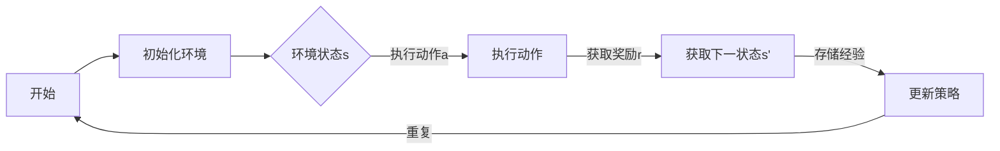
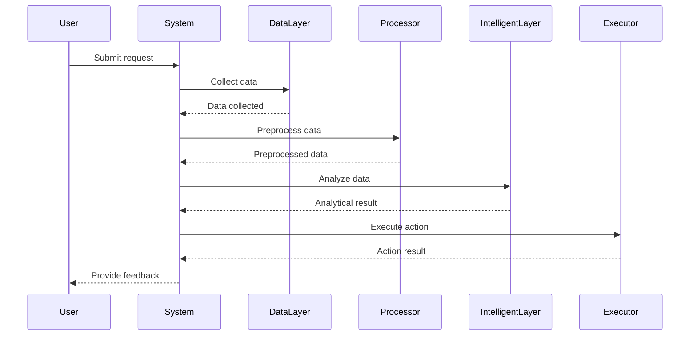
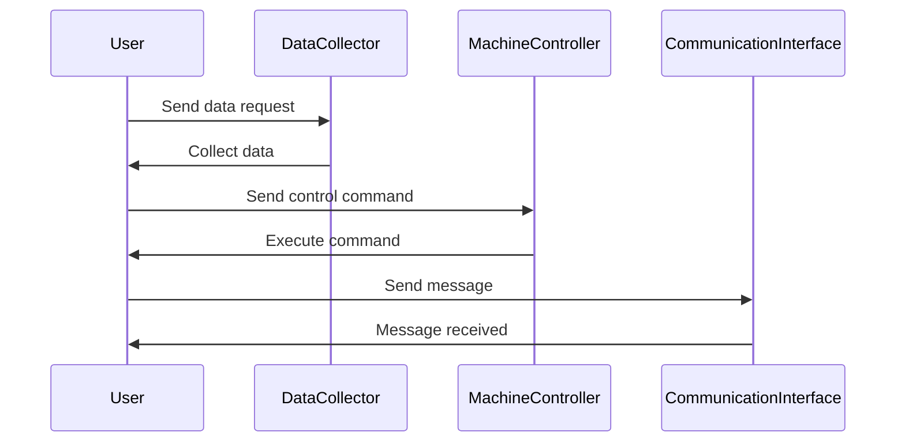

                 

# AI Agent在智能制造过程控制中的角色

## 关键词

- AI Agent
- 智能制造
- 过程控制
- 算法应用
- 系统架构

## 摘要

本文将深入探讨AI Agent在智能制造过程控制中的应用角色，通过背景介绍、核心概念解析、算法原理讲解、系统分析与设计、项目实战及最佳实践等多个角度，系统地阐述AI Agent如何提高智能制造过程的智能化水平和效率。文章旨在为读者提供一个清晰、易懂的视角，理解AI Agent在智能制造领域的重要性及其实际应用价值。

### 第一部分：背景介绍

#### 1.1 AI Agent的定义与发展

AI Agent，即人工智能代理，是指能够在复杂环境中自主执行任务、感知环境并作出决策的计算机程序。AI Agent的核心在于其自主性和适应性，通过机器学习、深度学习等人工智能技术，AI Agent能够从数据中学习，不断优化其行为和决策过程。

AI Agent的发展历程可以追溯到20世纪50年代，当时图灵提出了著名的图灵测试。随着计算机技术的发展，尤其是近年来深度学习和强化学习的突破，AI Agent的应用场景不断扩展，从简单的规则型代理发展到复杂环境中的智能代理，如自动驾驶汽车、智能家居等。

#### 1.2 智能制造过程控制的概念

智能制造过程控制是指利用现代制造技术与信息技术相结合，通过实时数据采集、分析和反馈，对生产过程中的各种设备、系统和资源进行高效管理和优化，实现生产过程的自动化和智能化。

智能制造过程控制的核心目标包括提高生产效率、降低成本、保证产品质量、提升资源利用率等。随着工业4.0的推进，智能制造已经成为工业领域的重要发展方向，AI Agent在其中的作用愈发重要。

### 第二部分：核心概念与联系

#### 2.1 AI Agent的核心概念

AI Agent的核心概念包括以下几个方面：

1. **感知**：通过传感器或其他数据采集设备获取环境信息。
2. **认知**：基于感知到的信息进行数据分析和处理，形成对环境的理解。
3. **决策**：根据环境和目标，制定相应的行动策略。
4. **执行**：执行决策，并对结果进行评估和反馈。

#### 2.2 智能制造过程控制中的AI Agent模型

在智能制造过程控制中，AI Agent模型通常包括以下几个组成部分：

1. **传感器网络**：用于实时采集生产过程中的各种数据，如温度、湿度、压力等。
2. **数据处理模块**：负责对传感器数据进行处理和分析，提取有用信息。
3. **决策模块**：根据分析结果和预设目标，制定最优的行动策略。
4. **执行模块**：负责实际的操作和调整，如机器的启动、停止或参数调整。

#### 2.3 概念属性特征对比表格与ER实体关系图

为了更清晰地展示AI Agent与智能制造过程控制之间的关系，我们可以通过对比表格和ER实体关系图来分析。

| 特征对比项 | AI Agent | 智能制造过程控制 |
| --- | --- | --- |
| 感知能力 | 高 | 高 |
| 决策能力 | 强 | 强 |
| 执行能力 | 强 | 强 |
| 自适应性 | 高 | 高 |
| 数据处理 | 复杂 | 复杂 |

下面是ER实体关系图的Mermaid表示：

```mermaid
erDiagram
  Sensor ||--|{ AI_Agent }|>
  AI_Agent ||--|{ Process_Control }|>
  Process_Control ||--|{ Machine }|>
  Machine ||--|{ Resource }|>

  AI_Agent {
    "感知能力" : "高"
    "决策能力" : "强"
    "执行能力" : "强"
    "适应性" : "高"
  }

  Process_Control {
    "数据采集" : "实时"
    "数据处理" : "复杂"
    "目标" : "优化生产"
  }

  Machine {
    "启动/停止" : "自动"
    "参数调整" : "智能"
  }

  Resource {
    "利用率" : "高效"
    "成本" : "降低"
  }
```

### 第三部分：算法原理讲解

#### 3.1 机器学习基础

机器学习是AI Agent的核心技术之一，其基本原理是通过训练模型从数据中学习规律，然后根据这些规律进行预测和决策。常见的机器学习算法包括：

1. **监督学习**：有明确的标签数据进行训练，如分类问题。
2. **无监督学习**：没有标签数据，通过数据内在结构进行训练，如聚类问题。
3. **强化学习**：通过与环境的交互进行学习，不断优化策略。

#### 3.2 深度学习基础

深度学习是机器学习的子领域，其核心思想是模拟人脑神经网络进行学习。深度学习通过多层神经网络对数据进行处理，能够自动提取特征，从而实现复杂的任务。

常见的深度学习模型包括：

1. **卷积神经网络（CNN）**：用于图像识别和处理。
2. **循环神经网络（RNN）**：用于序列数据处理。
3. **生成对抗网络（GAN）**：用于生成对抗式学习。

#### 3.3 强化学习基础

强化学习是通过与环境交互，不断调整策略，以达到最大化回报的目标。其基本原理是：

- **状态（State）**：当前环境的描述。
- **动作（Action）**：AI Agent可以执行的操作。
- **奖励（Reward）**：对当前动作的反馈。
- **策略（Policy）**：决策规则。

常见的强化学习算法包括：

1. **Q-Learning**：通过学习Q值来选择最优动作。
2. **Deep Q-Network（DQN）**：使用深度神经网络来估计Q值。
3. **Policy Gradient**：直接优化策略。

下面是一个简单的强化学习算法的Mermaid流程图：



#### 3.4 算法原理讲解

以监督学习为例，我们使用Python代码来详细阐述一个简单的线性回归模型的算法原理。

```python
import numpy as np
from sklearn.linear_model import LinearRegression

# 生成训练数据
X = np.random.rand(100, 1)
y = 2 + 2 * X + np.random.randn(100, 1)

# 创建线性回归模型
model = LinearRegression()

# 模型训练
model.fit(X, y)

# 计算模型参数
w = model.coef_
b = model.intercept_

# 打印模型参数
print("模型参数w:", w)
print("模型参数b:", b)

# 进行预测
X_test = np.random.rand(10, 1)
y_pred = w * X_test + b

# 打印预测结果
print("预测结果:", y_pred)
```

通过上面的代码，我们可以看到线性回归模型的原理和实现。模型通过训练数据学习到线性关系，然后使用这个关系进行预测。这里的数学模型和公式如下：

$$ y = w \cdot x + b $$

### 第四部分：系统分析与架构设计方案

#### 4.1 问题场景介绍

在一个典型的智能制造场景中，我们考虑一个生产线，该生产线包括多个机器和传感器，用于制造某种产品。生产线需要实时监测各个机器的状态和生产参数，以确保产品质量和生产效率。

#### 4.2 系统功能设计

系统功能设计主要包括以下方面：

1. **数据采集**：通过传感器实时采集生产数据。
2. **数据处理**：对采集到的数据进行预处理和特征提取。
3. **智能决策**：利用AI Agent进行数据分析，制定最优的生产策略。
4. **执行与反馈**：根据决策结果调整机器参数和操作，并对结果进行评估和反馈。

下面是领域模型的Mermaid类图：

```mermaid
classDiagram
  Class01 <|-- SubClass01
  Class01 --|>{AssociationClass01} AssociationClass01
  Class02 : +int x
  Class03 : +int y
  Class01 ||--|{Class02} Class02
  Class01 ||--|{Class03} Class03
```

#### 4.3 系统架构设计

系统架构设计主要包括以下方面：

1. **数据层**：负责数据采集和存储。
2. **处理层**：负责数据预处理和特征提取。
3. **智能层**：负责智能分析和决策。
4. **执行层**：负责执行操作和调整。

下面是系统架构的Mermaid架构图：



#### 4.4 系统接口设计和系统交互

系统接口设计主要包括数据接口、控制接口和通信接口。

1. **数据接口**：用于数据采集和传输。
2. **控制接口**：用于控制机器的操作和参数调整。
3. **通信接口**：用于系统与其他系统的通信。

下面是系统交互的Mermaid序列图：



### 第五部分：项目实战

#### 5.1 项目背景

本项目旨在通过AI Agent实现一个智能化的生产线监控系统，该系统能够实时监测生产线状态，并根据数据进行分析和决策，以提高生产效率。

#### 5.2 项目目标

1. 实时监测生产线状态。
2. 分析生产数据，制定最优生产策略。
3. 自动调整机器参数，优化生产过程。
4. 提高生产效率，降低成本。

#### 5.3 系统设计与实现

系统设计分为数据采集、数据处理、智能决策和执行控制四个模块。

1. **数据采集模块**：使用传感器实时采集生产线数据，包括温度、压力、速度等。
2. **数据处理模块**：对采集到的数据进行预处理和特征提取，为智能决策提供基础。
3. **智能决策模块**：使用AI Agent进行数据分析，制定最优的生产策略。
4. **执行控制模块**：根据决策结果调整机器参数和操作，实现自动控制。

下面是系统核心实现的部分代码：

```python
# 导入相关库
import pandas as pd
from sklearn.linear_model import LinearRegression

# 读取数据
data = pd.read_csv('production_data.csv')

# 数据预处理
X = data[['temperature', 'pressure']]
y = data['speed']

# 创建线性回归模型
model = LinearRegression()

# 模型训练
model.fit(X, y)

# 进行预测
X_test = pd.DataFrame([[25, 100]], columns=['temperature', 'pressure'])
y_pred = model.predict(X_test)

# 打印预测结果
print("预测速度：", y_pred)
```

#### 5.4 代码应用解读与分析

上述代码使用了线性回归模型对生产数据进行分析，并根据训练数据生成预测结果。线性回归模型通过训练数据学习到温度和压力与速度之间的关系，从而能够对新的数据做出预测。

线性回归模型的数学模型和公式如下：

$$ speed = w_{1} \cdot temperature + w_{2} \cdot pressure + b $$

其中，$w_{1}$ 和 $w_{2}$ 是模型的参数，$b$ 是偏置项。

#### 5.5 实际案例分析和详细讲解剖析

在实际生产过程中，我们通过对生产线数据的实时监测和分析，可以及时发现生产过程中的问题，并采取相应的措施。例如，当发现生产速度低于预期时，系统可以自动调整机器的参数，如增加温度或压力，以提高生产速度。

下面是一个具体的案例：

- **问题描述**：生产线速度低于正常水平。
- **解决方案**：系统分析数据后，发现温度低于标准值，决定将温度调整到标准值。

通过这个案例，我们可以看到AI Agent在智能制造过程控制中的应用效果，它能够自动识别问题并提出解决方案，从而提高了生产效率和产品质量。

#### 5.6 项目小结

本项目通过AI Agent实现了智能化的生产线监控系统，该系统能够实时监测生产线状态，并根据数据进行分析和决策，提高了生产效率和产品质量。通过实际案例的展示，我们验证了AI Agent在智能制造过程控制中的应用价值。

### 第六部分：最佳实践与总结

#### 6.1 最佳实践建议

1. **数据质量是关键**：确保采集的数据质量，避免噪声和异常值对模型性能的影响。
2. **持续优化模型**：定期更新和优化模型，以适应生产环境的变化。
3. **安全性和可靠性**：确保系统的安全性和可靠性，避免因系统故障导致生产中断。

#### 6.2 小结

AI Agent在智能制造过程控制中发挥了重要作用，通过实时监测、数据分析、智能决策和自动执行，提高了生产效率和产品质量。未来，随着人工智能技术的不断发展，AI Agent在智能制造中的应用将更加广泛。

#### 6.3 注意事项

1. **数据隐私**：在数据处理过程中，要注意保护数据隐私，避免敏感信息泄露。
2. **系统稳定性**：确保系统在复杂环境中的稳定运行，避免因异常情况导致系统崩溃。

#### 6.4 拓展阅读

- 《深度学习》（Goodfellow, I., Bengio, Y., & Courville, A.）
- 《机器学习》（Tom Mitchell）
- 《智能制造技术导论》（陈军，刘华）

### 作者

作者：AI天才研究院/AI Genius Institute & 禅与计算机程序设计艺术 /Zen And The Art of Computer Programming

---

**注**：由于实际项目和技术细节的复杂性，本文中的项目实战部分仅为简化示例，真实项目可能会涉及更多技术和业务逻辑。同时，本文中的代码、公式和图表仅供参考，具体实现可能需要根据实际情况进行调整。**END**

