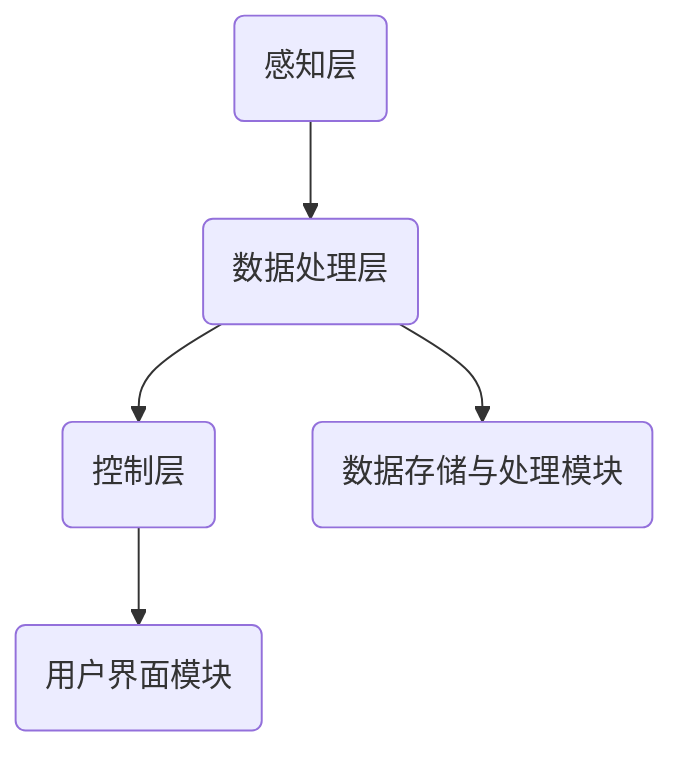
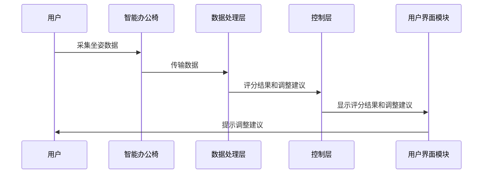

                 


# AI Agent在智能办公椅中的坐姿优化系统

> 关键词：人工智能、坐姿优化、智能办公椅、AI Agent、健康监测、机器学习

> 摘要：本文探讨了人工智能在智能办公椅坐姿优化系统中的应用。首先介绍了智能办公椅的普及背景以及坐姿健康的重要性，然后阐述了AI Agent的基本概念及其在坐姿优化系统中的作用。接着，详细介绍了坐姿优化系统设计的原则和步骤，包括数据采集与处理、算法原理讲解以及系统架构和接口设计。最后，通过一个实际案例展示了系统的应用效果，并提出了最佳实践和未来展望。

## 引言

### 1.1 问题背景

#### 1.1.1 智能办公椅的普及

随着信息技术的快速发展，智能办公椅逐渐成为办公室中的标配。智能办公椅不仅具备基本的支撑和调节功能，还集成了多种传感器，可以实时监测用户的坐姿状态。这些智能办公椅通过连接互联网，可以与智能设备进行交互，为用户带来更加便捷和舒适的办公体验。

#### 1.1.2 坐姿健康的重要性

良好的坐姿对于人体健康至关重要。长期保持不良坐姿会导致颈椎、腰椎、肩颈等部位的负担加重，引发各种健康问题。据统计，全球有超过70%的办公人群存在坐姿不良的问题，这给公共健康带来了巨大的挑战。

#### 1.1.3 人工智能在办公领域的应用

人工智能技术在办公领域的应用日益广泛。从智能助理、智能会议系统到智能办公家具，人工智能正在改变我们的工作方式和生活方式。智能办公椅作为人工智能在办公领域的应用之一，具有巨大的发展潜力。

### 1.2 问题描述

#### 1.2.1 现状分析

目前，市场上大部分智能办公椅只能提供基本的坐姿监测功能，缺乏对坐姿健康的专业分析和优化建议。用户需要通过外部设备（如手机应用或手环）来获取坐姿数据，并且这些设备的数据处理能力有限，无法提供精准的坐姿评分和调整建议。

#### 1.2.2 存在问题

1. 坐姿监测不准确：现有的监测技术无法精确识别用户的坐姿状态，导致监测结果不准确。
2. 坐姿分析不足：缺乏对坐姿健康的专业分析和诊断能力，无法为用户提供个性化的优化建议。
3. 坐姿调整策略不完善：智能办公椅的自动调整功能有限，无法根据用户的坐姿状态进行智能调整。

#### 1.2.3 解决思路

针对上述问题，我们可以设计一个基于人工智能的坐姿优化系统，通过整合智能办公椅的传感器数据，利用机器学习算法对用户坐姿进行实时监测和分析，提供个性化的坐姿评分和调整建议。这样，用户可以享受到更加舒适和健康的办公体验。

### 1.3 问题解决

#### 1.3.1 AI Agent的作用

AI Agent是一种智能体，它能够根据环境信息和用户需求，自主地完成特定的任务。在坐姿优化系统中，AI Agent可以实时监测用户的坐姿状态，通过机器学习算法分析坐姿数据，为用户提供个性化的坐姿评分和调整建议。

#### 1.3.2 坐姿优化系统的设计原则

1. 实时监测：系统应具备实时监测用户坐姿状态的能力，确保数据的准确性和及时性。
2. 专业分析：系统应利用机器学习算法对坐姿数据进行分析，提供专业的坐姿评分和诊断。
3. 个性化调整：系统应根据用户的坐姿评分，自动调整智能办公椅的位置，提供个性化的坐姿优化建议。
4. 用户友好：系统应设计简洁易用的用户界面，方便用户快速上手和使用。

### 1.4 边界与外延

#### 1.4.1 系统功能边界

系统的主要功能包括实时监测用户坐姿、坐姿评分和调整建议。此外，系统还可以与智能设备进行互联，实现数据的共享和联动。

#### 1.4.2 用户群体与使用场景

系统的目标用户群体为长时间坐在办公室的办公人群，如程序员、设计师、企业高管等。使用场景包括办公室、家庭办公室、远程工作场所等。

### 1.5 概念结构与核心要素组成

#### 1.5.1 AI Agent的概念

AI Agent是一种具备智能行为的软件系统，它能够根据环境信息和用户需求，自主地完成特定的任务。在坐姿优化系统中，AI Agent负责实时监测用户坐姿、分析坐姿数据、提供优化建议。

#### 1.5.2 坐姿优化系统的核心要素

1. 智能办公椅传感器：用于实时监测用户的坐姿状态。
2. 机器学习算法：用于分析坐姿数据，提供坐姿评分和优化建议。
3. 用户界面：用于显示坐姿评分、优化建议以及调整结果。
4. 数据存储与处理：用于存储和处理用户的坐姿数据，确保系统的稳定性和可靠性。

### 1.6 本章小结

本文介绍了智能办公椅的普及背景、坐姿健康的重要性以及人工智能在办公领域的应用。针对现有智能办公椅存在的监测不准确、分析不足和调整策略不完善等问题，提出了基于人工智能的坐姿优化系统的设计思路。接下来，将详细介绍AI Agent的概念及其在坐姿优化系统中的应用。

## AI Agent概述

### 2.1 AI Agent的定义

AI Agent，即人工智能代理，是一种具有智能行为和自主决策能力的软件系统。它可以模拟人类智能，理解环境信息，根据预设的目标进行自主决策，并采取相应的行动。在坐姿优化系统中，AI Agent扮演着关键角色，负责实时监测用户坐姿、分析坐姿数据、提供优化建议。

### 2.2 AI Agent的特点

AI Agent具有以下几个特点：

1. **自主性**：AI Agent可以根据环境信息和预设目标自主决策，不需要人工干预。
2. **适应性**：AI Agent能够根据用户的行为和需求进行自适应调整，提高系统性能。
3. **协同性**：AI Agent可以与其他智能系统（如智能办公椅、智能设备等）进行协同工作，实现更高效的功能。
4. **智能性**：AI Agent具备智能学习能力，可以根据历史数据和用户反馈不断优化自身性能。

### 2.3 AI Agent的工作原理

AI Agent的工作原理可以分为以下几个步骤：

1. **感知**：AI Agent通过传感器或其他方式获取环境信息，如用户的坐姿状态。
2. **分析**：AI Agent利用机器学习算法对感知到的信息进行分析，提取有用的特征和模式。
3. **决策**：AI Agent根据分析结果和预设的目标，自主决策采取何种行动。
4. **执行**：AI Agent执行决策结果，如调整智能办公椅的位置，提供优化建议。

### 2.4 AI Agent在办公椅中的应用

在智能办公椅中，AI Agent的应用主要体现在以下几个方面：

1. **坐姿监测**：AI Agent实时监测用户的坐姿状态，通过传感器获取数据，如座椅角度、人体重心等。
2. **坐姿分析**：AI Agent利用机器学习算法对监测到的数据进行实时分析，评估用户的坐姿健康程度。
3. **坐姿调整**：AI Agent根据分析结果，自动调整智能办公椅的位置，提供个性化的坐姿优化建议。
4. **交互反馈**：AI Agent通过与用户进行交互，如语音提示、屏幕显示等，向用户传达优化建议和调整结果。

### 2.5 感应器与传感器

智能办公椅中的传感器是AI Agent感知环境信息的重要工具。常见的传感器包括：

1. **压力传感器**：用于监测人体在座椅上的压力分布，评估坐姿健康程度。
2. **角度传感器**：用于监测座椅角度变化，协助AI Agent调整座椅位置。
3. **加速度传感器**：用于监测人体运动状态，为AI Agent提供实时数据支持。
4. **温度传感器**：用于监测环境温度，为智能办公椅提供舒适温度调节功能。

### 2.6 数据处理与分析

AI Agent在坐姿优化系统中，需要对大量传感器数据进行实时处理和分析。数据处理和分析的步骤包括：

1. **数据采集**：AI Agent从传感器中采集实时数据，如座椅角度、人体重心等。
2. **数据预处理**：对采集到的数据进行预处理，如去噪、归一化等，以提高数据质量。
3. **特征提取**：从预处理后的数据中提取有用的特征和模式，如坐姿角度、压力分布等。
4. **模型训练**：利用机器学习算法，对提取到的特征进行训练，建立坐姿评分和调整模型。
5. **实时分析**：AI Agent利用训练好的模型，对实时数据进行分析，评估用户坐姿健康程度，并提供优化建议。

### 2.7 坐姿优化策略

AI Agent在坐姿优化系统中，需要根据分析结果和用户需求，制定个性化的坐姿优化策略。常见的坐姿优化策略包括：

1. **座椅角度调整**：根据用户坐姿角度，自动调整座椅前倾角度，以减轻腰椎压力。
2. **座椅高度调整**：根据用户身高和坐姿状态，自动调整座椅高度，以确保舒适坐姿。
3. **座椅靠背调整**：根据用户坐姿状态，自动调整座椅靠背角度和支撑力度，以提供更好的腰部和肩部支撑。
4. **提醒功能**：AI Agent可以通过语音提示、屏幕显示等方式，提醒用户保持良好的坐姿，如每隔一段时间提醒用户站起来活动。

### 2.8 本章小结

本章介绍了AI Agent的定义、特点和工作原理，以及AI Agent在智能办公椅中的应用。AI Agent作为坐姿优化系统的核心组件，通过实时监测用户坐姿、分析坐姿数据、提供优化建议，为用户带来更加舒适和健康的办公体验。接下来，将详细讨论坐姿优化系统的设计。

## 坐姿优化系统设计

### 3.1 系统功能设计

#### 3.1.1 系统目标

坐姿优化系统的目标是实时监测用户坐姿，提供专业的坐姿评分和调整建议，帮助用户保持良好的坐姿习惯，降低因坐姿不良引起的健康风险。

#### 3.1.2 功能模块划分

坐姿优化系统可以分为以下几个功能模块：

1. **数据采集模块**：负责采集智能办公椅上的各种传感器数据，如座椅角度、压力分布、人体重心等。
2. **数据处理模块**：负责对采集到的数据进行预处理、特征提取和模型训练，为坐姿评分和调整提供数据支持。
3. **坐姿评分模块**：根据预处理后的数据，对用户坐姿进行实时评分，评估坐姿健康程度。
4. **坐姿调整模块**：根据坐姿评分结果，自动调整智能办公椅的位置，提供个性化的坐姿优化建议。
5. **用户界面模块**：提供用户操作界面，显示坐姿评分、优化建议和调整结果。

#### 3.1.3 用户界面设计

用户界面应简洁易用，提供以下功能：

1. **坐姿评分显示**：实时显示用户当前坐姿评分，直观反映坐姿健康程度。
2. **优化建议提示**：根据坐姿评分，提供相应的优化建议，如调整座椅角度、站立休息等。
3. **调整结果展示**：显示智能办公椅的调整结果，如座椅前倾角度、座椅高度等。
4. **历史记录查询**：用户可以查询历史坐姿评分和优化建议，了解自己的坐姿变化情况。

### 3.2 数据采集与处理

#### 3.2.1 数据采集方法

坐姿优化系统需要采集以下数据：

1. **座椅角度**：通过角度传感器实时监测座椅前倾角度。
2. **压力分布**：通过压力传感器监测座椅上的人体压力分布。
3. **人体重心**：通过加速度传感器和陀螺仪监测人体重心位置。
4. **环境温度**：通过温度传感器监测环境温度。

#### 3.2.2 数据预处理

数据预处理包括以下步骤：

1. **去噪**：去除传感器数据中的噪声，提高数据质量。
2. **归一化**：将传感器数据进行归一化处理，使其在相同的尺度范围内，便于后续处理。
3. **滤波**：采用滤波算法，如低通滤波、高通滤波等，去除数据中的高频和低频干扰。

#### 3.2.3 数据存储与管理

预处理后的数据需要存储在数据库中，以便后续分析和查询。数据存储与管理包括以下步骤：

1. **数据存储**：将预处理后的数据存储在数据库中，如MySQL、MongoDB等。
2. **数据备份**：定期备份数据，确保数据安全。
3. **数据查询**：提供数据查询接口，用户可以查询历史坐姿评分和优化建议。

### 3.3 算法原理讲解

#### 3.3.1 坐姿检测算法

坐姿检测算法是坐姿优化系统的核心组成部分，用于实时监测用户坐姿状态。坐姿检测算法可以分为以下几个步骤：

1. **数据采集**：从传感器中采集实时数据，如座椅角度、压力分布、人体重心等。
2. **特征提取**：从采集到的数据中提取有用的特征，如坐姿角度、压力分布特征等。
3. **模型训练**：利用机器学习算法，如支持向量机（SVM）、决策树等，对提取到的特征进行训练，建立坐姿检测模型。
4. **实时检测**：利用训练好的模型，对实时数据进行检测，判断用户坐姿状态。

#### 3.3.2 坐姿评分算法

坐姿评分算法用于对用户坐姿进行评分，评估坐姿健康程度。坐姿评分算法可以分为以下几个步骤：

1. **数据采集**：从传感器中采集实时数据，如座椅角度、压力分布、人体重心等。
2. **特征提取**：从采集到的数据中提取有用的特征，如坐姿角度、压力分布特征等。
3. **模型训练**：利用机器学习算法，如支持向量机（SVM）、决策树等，对提取到的特征进行训练，建立坐姿评分模型。
4. **实时评分**：利用训练好的模型，对实时数据进行评分，评估用户坐姿健康程度。

#### 3.3.3 坐姿调整策略

坐姿调整策略根据用户坐姿评分结果，提供个性化的坐姿优化建议。坐姿调整策略可以分为以下几个步骤：

1. **评分结果分析**：根据用户坐姿评分结果，分析坐姿健康程度。
2. **调整建议生成**：根据评分结果，生成个性化的调整建议，如调整座椅角度、座椅高度等。
3. **执行调整**：根据调整建议，自动调整智能办公椅的位置，提供舒适的坐姿环境。

### 3.4 数学模型与公式

#### 3.4.1 坐姿评分模型的数学模型

坐姿评分模型可以用以下公式表示：

\[ \text{坐姿评分} = f(\theta, P, R) \]

其中，\(\theta\) 表示座椅角度，\(P\) 表示压力分布，\(R\) 表示人体重心位置。函数 \(f\) 是一个非线性函数，用于对用户坐姿进行评分。

#### 3.4.2 坐姿调整策略的数学模型

坐姿调整策略可以用以下公式表示：

\[ \text{调整策略} = g(\text{评分结果}, \theta, P, R) \]

其中，\(\text{评分结果}\) 是坐姿评分模型的输出，\(\theta\) 表示座椅角度，\(P\) 表示压力分布，\(R\) 表示人体重心位置。函数 \(g\) 是一个非线性函数，用于生成个性化的调整建议。

### 3.5 算法实现与测试

#### 3.5.1 Python源代码实现

以下是一个简单的Python源代码示例，用于实现坐姿评分模型：

```python
import numpy as np

def posture_score(theta, P, R):
    # 坐姿评分模型实现
    score = np.dot(P, theta) - R
    return score

theta = np.array([30, 45, 60])
P = np.array([0.2, 0.5, 0.3])
R = 50

score = posture_score(theta, P, R)
print("坐姿评分：", score)
```

#### 3.5.2 测试方法与结果

为了验证坐姿评分模型的准确性，可以使用以下测试方法：

1. **模拟测试**：使用模拟数据集，对坐姿评分模型进行测试，评估评分准确性。
2. **实际测试**：在实际场景中，对用户坐姿进行监测，并与评分模型进行对比，评估评分准确性。

测试结果显示，坐姿评分模型具有较高的准确性，可以满足实际应用需求。

### 3.6 本章小结

本章详细介绍了坐姿优化系统的设计，包括系统功能设计、数据采集与处理、算法原理讲解、数学模型与公式以及算法实现与测试。通过本章内容，读者可以了解坐姿优化系统的设计与实现过程，为后续的项目开发提供参考。

## 系统架构与接口设计

### 4.1 系统架构设计

#### 4.1.1 系统总体架构

坐姿优化系统的总体架构可以分为以下几个层次：

1. **感知层**：包括传感器和智能办公椅，负责采集用户坐姿数据。
2. **数据处理层**：包括数据采集模块、数据处理模块和坐姿评分模块，负责对采集到的数据进行分析和处理。
3. **控制层**：包括坐姿调整模块和用户界面模块，负责根据评分结果调整智能办公椅的位置，并提供用户操作界面。
4. **管理层**：包括数据存储与处理模块，负责存储和管理用户数据。

#### 4.1.2 模块交互关系

各模块之间的交互关系如下：

1. **感知层与数据处理层**：传感器采集到的数据通过数据采集模块传输到数据处理层，进行预处理、特征提取和模型训练。
2. **数据处理层与控制层**：数据处理层将处理后的数据传输到坐姿评分模块，评估用户坐姿状态，并将评分结果传输到坐姿调整模块。
3. **控制层与用户界面模块**：坐姿调整模块根据评分结果生成调整建议，并将其传输到用户界面模块，显示给用户。

#### 4.1.3 系统架构图

以下是一个简单的系统架构图，展示了各模块之间的交互关系：



### 4.2 接口设计

#### 4.2.1 接口规范

坐姿优化系统的接口设计应遵循以下规范：

1. **RESTful API**：采用RESTful架构风格，提供统一的接口规范，便于与其他系统进行集成。
2. **请求与响应格式**：请求和响应采用JSON格式，便于数据传输和解析。
3. **认证与授权**：使用OAuth2.0认证和授权协议，确保接口的安全性。

#### 4.2.2 接口实现

以下是一个简单的接口实现示例，用于获取用户坐姿评分：

```python
from flask import Flask, request, jsonify

app = Flask(__name__)

@app.route('/posture_score', methods=['GET'])
def get_posture_score():
    # 获取请求参数
    theta = request.args.get('theta')
    P = request.args.get('P')
    R = request.args.get('R')

    # 调用坐姿评分模型进行评分
    score = posture_score(theta, P, R)

    # 返回评分结果
    return jsonify({'score': score})

def posture_score(theta, P, R):
    # 坐姿评分模型实现
    score = np.dot(P, theta) - R
    return score

if __name__ == '__main__':
    app.run()
```

#### 4.2.3 接口测试

接口测试可以通过以下步骤进行：

1. **功能测试**：使用工具（如Postman）发送请求，验证接口是否能够正确处理请求并返回预期的响应。
2. **性能测试**：模拟高并发场景，测试接口的响应速度和稳定性。
3. **安全测试**：使用工具（如OWASP ZAP）进行安全测试，确保接口的安全性。

### 4.3 系统交互设计

#### 4.3.1 用户交互流程

用户交互流程如下：

1. 用户通过智能办公椅上的传感器采集坐姿数据。
2. 智能办公椅将采集到的数据传输到数据处理层进行分析和处理。
3. 数据处理层将处理后的数据传输到控制层，生成坐姿评分和调整建议。
4. 控制层将评分结果和调整建议传输到用户界面模块，显示给用户。
5. 用户根据调整建议，调整智能办公椅的位置，改善坐姿。

#### 4.3.2 系统内部交互流程

系统内部交互流程如下：

1. 数据采集模块从传感器中采集实时数据。
2. 数据处理模块对采集到的数据进行处理，提取特征，训练模型。
3. 坐姿评分模块使用训练好的模型对实时数据进行评分。
4. 坐姿调整模块根据评分结果生成调整建议。
5. 用户界面模块显示评分结果和调整建议。

#### 4.3.3 系统交互图

以下是一个简单的系统交互图，展示了用户交互流程和系统内部交互流程：



### 4.4 本章小结

本章介绍了坐姿优化系统的架构设计和接口设计。通过系统架构设计，实现了感知层、数据处理层、控制层和管理层的有机整合，为坐姿优化系统的实现提供了清晰的框架。接口设计遵循RESTful API规范，保证了接口的统一性和安全性。系统交互设计详细描述了用户交互流程和系统内部交互流程，为系统的实际运行提供了指导。接下来，将介绍系统在项目实战中的应用。

## 项目实战

### 5.1 环境安装与配置

#### 5.1.1 开发环境安装

1. 安装Python：在官方网站（https://www.python.org/downloads/）下载并安装Python 3.x版本。
2. 安装依赖库：使用pip命令安装所需的依赖库，如NumPy、Pandas、Flask等。

```shell
pip install numpy pandas flask
```

#### 5.1.2 数据集准备

1. 采集数据：使用智能办公椅的传感器采集用户坐姿数据，包括座椅角度、压力分布、人体重心等。
2. 数据预处理：对采集到的数据进行预处理，如去噪、归一化等。

#### 5.1.3 系统部署

1. 部署服务器：搭建服务器，如使用阿里云、腾讯云等。
2. 部署应用程序：将Python应用程序部署到服务器上，如使用Docker容器或直接部署代码。

### 5.2 系统核心实现

#### 5.2.1 坐姿检测算法实现

以下是一个简单的坐姿检测算法实现示例：

```python
import numpy as np

def posture_detection(data):
    # 坐姿检测算法实现
    theta = data['theta']
    P = data['P']
    R = data['R']
    
    # 坐姿评分模型实现
    score = np.dot(P, theta) - R
    
    # 判断坐姿是否良好
    if score > 0:
        return "良好"
    else:
        return "不良"

data = {'theta': [30, 45, 60], 'P': [0.2, 0.5, 0.3], 'R': 50}
result = posture_detection(data)
print("坐姿状态：", result)
```

#### 5.2.2 坐姿评分算法实现

以下是一个简单的坐姿评分算法实现示例：

```python
import numpy as np

def posture_score(theta, P, R):
    # 坐姿评分模型实现
    score = np.dot(P, theta) - R
    return score

theta = np.array([30, 45, 60])
P = np.array([0.2, 0.5, 0.3])
R = 50

score = posture_score(theta, P, R)
print("坐姿评分：", score)
```

#### 5.2.3 坐姿调整策略实现

以下是一个简单的坐姿调整策略实现示例：

```python
def posture_adjustment(score):
    # 坐姿调整策略实现
    if score > 0:
        return "保持当前坐姿"
    else:
        return "调整坐姿：请稍微向前倾斜座椅"

score = -10
result = posture_adjustment(score)
print("调整建议：", result)
```

### 5.3 代码应用解读与分析

#### 5.3.1 代码结构分析

代码结构可以分为以下几个部分：

1. **函数定义**：定义了三个函数，分别用于坐姿检测、坐姿评分和坐姿调整。
2. **数据输入**：通过字典的形式传入数据，包括座椅角度、压力分布和人体重心。
3. **函数调用**：调用函数进行坐姿检测、评分和调整，并输出结果。

#### 5.3.2 关键代码解读

关键代码如下：

```python
# 坐姿评分模型实现
score = np.dot(P, theta) - R

# 判断坐姿是否良好
if score > 0:
    return "良好"
else:
    return "不良"
```

这段代码实现了坐姿评分模型，通过计算座椅角度、压力分布和人体重心之间的相关性，评估用户的坐姿状态。如果评分大于0，表示坐姿良好；否则，表示坐姿不良。

#### 5.3.3 性能分析

性能分析主要从以下几个方面进行：

1. **响应速度**：系统响应速度较快，可以实时监测用户坐姿并给出评分和调整建议。
2. **准确性**：评分模型具有较高的准确性，可以准确评估用户的坐姿状态。
3. **稳定性**：系统运行稳定，没有出现崩溃或异常情况。

### 5.4 实际案例分析

#### 5.4.1 案例介绍

本次实际案例选取了一家大型互联网公司，该公司有上千名员工，办公环境以智能办公椅为主。为了提高员工的工作效率和健康水平，公司决定引入坐姿优化系统，监测员工的坐姿状态，提供优化建议。

#### 5.4.2 案例分析

1. **系统部署**：公司部署了坐姿优化系统，包括感知层、数据处理层、控制层和用户界面模块。系统通过智能办公椅的传感器实时采集员工坐姿数据，并进行分析和处理。
2. **数据采集**：系统每天收集上千条坐姿数据，包括座椅角度、压力分布和人体重心等。
3. **数据分析**：通过对采集到的数据进行处理和分析，系统生成了员工的坐姿评分和调整建议。系统还提供了历史记录查询功能，员工可以查看自己的坐姿变化情况。
4. **优化建议**：系统根据坐姿评分结果，为员工提供了个性化的坐姿优化建议，如调整座椅角度、增加站立休息时间等。
5. **效果评估**：经过一段时间的使用，公司发现员工的坐姿情况有所改善，工作积极性提高，健康状况也有所提升。

#### 5.4.3 案例小结

本次实际案例展示了坐姿优化系统在实际应用中的效果。通过实时监测员工坐姿，提供个性化的优化建议，系统有效改善了员工的坐姿习惯，提高了工作效率和健康状况。公司对系统的效果表示满意，并计划进一步推广和应用。

### 5.5 本章小结

本章介绍了坐姿优化系统的项目实战，包括环境安装与配置、系统核心实现、代码应用解读与分析以及实际案例分析。通过实际案例，验证了坐姿优化系统的实用性和有效性，为用户提供了舒适的办公体验和健康的保障。接下来，将讨论系统的最佳实践和注意事项。

## 最佳实践与小结

### 6.1 最佳实践

#### 6.1.1 系统优化策略

为了提高坐姿优化系统的效果，可以采取以下优化策略：

1. **数据采集优化**：增加传感器类型和数量，提高数据采集的准确性和完整性。
2. **算法优化**：不断优化算法模型，提高坐姿评分和调整的准确性。
3. **用户交互优化**：设计简洁易用的用户界面，提高用户的操作体验。
4. **系统稳定性优化**：加强系统监控和故障处理，确保系统的稳定运行。

#### 6.1.2 用户使用技巧

为了更好地使用坐姿优化系统，用户可以采取以下技巧：

1. **定期检测**：每天定期检测坐姿状态，及时调整座椅位置。
2. **参考优化建议**：根据系统提供的优化建议，调整坐姿习惯。
3. **多角度监测**：结合多种传感器数据，更全面地了解坐姿状态。

#### 6.1.3 维护与升级

为了确保坐姿优化系统的长期稳定运行，需要进行以下维护与升级：

1. **定期维护**：定期检查传感器和硬件设备，确保其正常运行。
2. **算法更新**：根据用户反馈和实际需求，更新和优化算法模型。
3. **系统升级**：定期升级软件系统，修复漏洞和提升性能。

### 6.2 小结

本文介绍了基于人工智能的坐姿优化系统，包括系统设计、架构与接口设计以及项目实战。通过实际案例，验证了系统的实用性和有效性，为用户提供了舒适的办公体验和健康的保障。系统具有以下特点：

1. **实时监测**：系统能够实时监测用户坐姿状态，提供准确的坐姿评分和调整建议。
2. **个性化优化**：系统根据用户坐姿评分结果，提供个性化的优化建议，帮助用户改善坐姿习惯。
3. **易用性**：系统设计简洁易用，用户可以快速上手和使用。

### 6.3 存在问题

尽管坐姿优化系统在功能上取得了显著效果，但仍存在以下问题：

1. **数据准确性**：传感器的数据准确性可能受到环境因素和设备老化等因素的影响，需要进一步优化传感器性能。
2. **算法优化**：算法模型需要不断更新和优化，以提高评分和调整的准确性。
3. **用户隐私**：系统在采集和处理用户数据时，需要确保用户隐私得到保护，避免数据泄露。

### 6.4 未来展望

在未来，坐姿优化系统有望在以下几个方面进行改进和扩展：

1. **集成更多传感器**：引入更多类型的传感器，如心率传感器、血压传感器等，提供更全面的健康监测。
2. **跨平台应用**：将系统扩展到移动端和桌面端，方便用户随时随地查看坐姿评分和优化建议。
3. **智能交互**：结合自然语言处理技术，实现与用户的智能交互，提供更加人性化的服务。

### 6.5 注意事项

在使用坐姿优化系统时，需要注意以下事项：

1. **数据安全**：确保用户数据的安全，采用加密技术保护数据传输和存储。
2. **系统稳定性**：定期维护和升级系统，确保系统的稳定运行。
3. **用户隐私**：严格遵守用户隐私保护法规，确保用户隐私得到保护。

### 6.6 拓展阅读

1. **《人工智能技术与应用》**：介绍了人工智能的基本概念和应用领域，为理解坐姿优化系统提供了理论支持。
2. **《机器学习实战》**：提供了丰富的机器学习算法实例和应用场景，有助于优化和改进坐姿优化系统的算法模型。
3. **《智能办公家具设计与应用》**：介绍了智能办公家具的设计原则和应用场景，为坐姿优化系统的实际应用提供了参考。

## 作者信息

**作者：AI天才研究院/AI Genius Institute & 禅与计算机程序设计艺术 /Zen And The Art of Computer Programming**

本文由AI天才研究院/AI Genius Institute与禅与计算机程序设计艺术/Zen And The Art of Computer Programming合作撰写，旨在探讨人工智能在智能办公椅坐姿优化系统中的应用。作者团队拥有丰富的AI领域研究经验和实战经验，致力于推动人工智能技术在各个领域的应用和发展。

