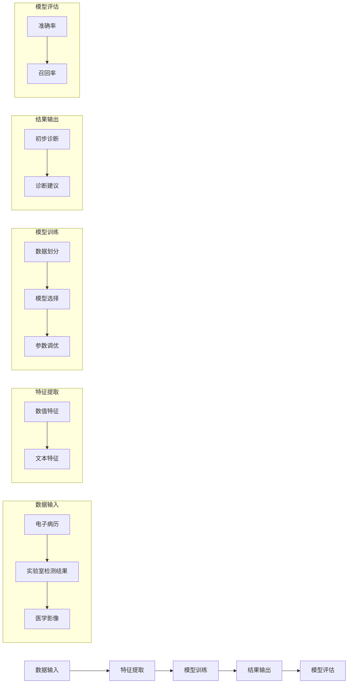
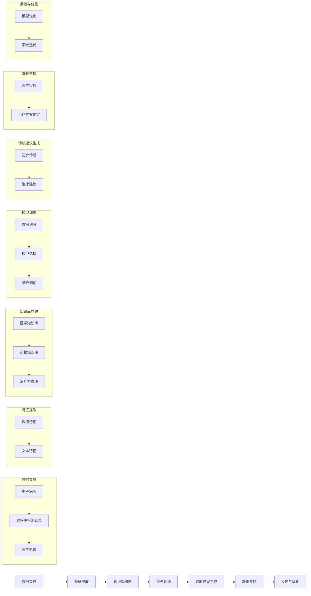
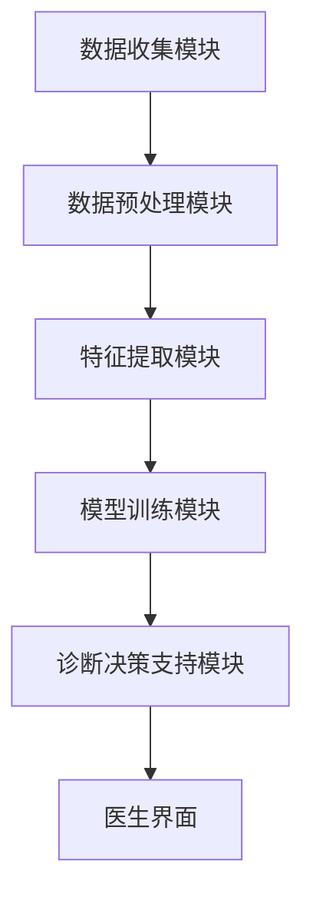

                 

### 引言

#### 1.1.1 智能医疗的兴起

随着人工智能（AI）技术的飞速发展，医疗行业正经历着一场深刻的变革。智能医疗作为一种新兴的应用领域，正逐渐改变着传统的医疗模式。智能医疗的核心在于利用AI技术对海量医疗数据进行分析，从而提供精准的诊断、治疗方案和健康管理服务。这种变革不仅提高了医疗服务的效率，还为个性化医疗和远程医疗提供了可能。

AI Agent，作为人工智能的一个重要分支，在这场变革中扮演着至关重要的角色。AI Agent，即人工智能代理，是指能够模拟人类智能行为，具备感知、推理、决策和学习能力的软件系统。在智能医疗领域，AI Agent通过自动化和智能化手段，协助医生进行诊断、治疗和健康监测，大大提升了医疗决策的准确性和效率。

#### 1.1.2 AI Agent的定义与能力

AI Agent的定义可以追溯到其在AI领域中的基本属性。一个典型的AI Agent具有以下核心能力：

- **感知能力**：通过传感器、医疗设备等获取患者数据，如症状、体征、影像等。
- **推理能力**：利用医学知识和AI算法，对患者数据进行综合分析和诊断。
- **决策能力**：基于诊断结果，为医生提供治疗建议和决策支持。
- **学习能力**：通过不断学习和优化算法，提升诊断和治疗的准确性和效率。

AI Agent不仅仅是一个简单的诊断工具，它更是医疗团队中的一个智能助手，能够在复杂医疗环境中提供高效、精准的支持。

#### 1.1.3 AI Agent在医疗诊断中的重要性

AI Agent在医疗诊断决策支持中的重要性体现在以下几个方面：

1. **提高诊断准确性**：AI Agent可以通过分析大量的医学数据，识别出人类医生可能忽略的细微症状，从而提高诊断的准确性。
2. **减轻医生工作负担**：AI Agent能够自动处理大量的患者数据，为医生提供诊断报告和建议，减轻医生的工作压力，让他们有更多时间专注于复杂的病例。
3. **优化医疗资源分配**：通过精准的疾病预测和诊断，AI Agent能够帮助医院更合理地分配医疗资源，提高医疗服务效率。
4. **支持个性化医疗**：AI Agent可以根据患者的具体情况进行个性化诊断和治疗，提高治疗效果。

总的来说，AI Agent在智能医疗诊断决策支持中具有不可替代的作用，它正成为现代医疗体系中的重要组成部分。

### 问题概述

#### 1.2.1 医疗诊断的挑战

医疗诊断是一个复杂且具有挑战性的过程。首先，医疗诊断需要处理大量的数据，包括患者的病史、体检数据、实验室检测结果、影像数据等。这些数据往往是非结构化和半结构化的，对数据的收集、存储和处理都提出了高要求。其次，不同疾病之间的症状和体征可能相似或重叠，增加了诊断的难度。此外，医疗诊断还面临时间紧迫、资源有限等现实问题，医生需要快速且准确地做出诊断，以保证患者的及时治疗。

面对这些挑战，传统的医疗诊断方法存在一定的局限性。首先，医生依赖个人经验和知识进行诊断，存在主观性和个体差异。其次，医疗资源的分配不均，使得一些偏远地区和基层医疗机构的诊断能力有限。最后，由于医疗知识的更新速度较快，医生难以跟上最新的医学研究进展。

#### 1.2.2 AI Agent在诊断中的贡献

AI Agent在解决医疗诊断中的挑战方面具有显著的优势。首先，AI Agent能够通过大数据分析和机器学习算法，处理大量的医疗数据，提取出关键特征，从而提高诊断的准确性。例如，通过深度学习模型，AI Agent可以从影像数据中识别出癌症的微小病变，这在传统诊断中往往被忽视。

其次，AI Agent可以减轻医生的工作负担。通过自动化处理患者数据，AI Agent能够为医生提供初步的诊断报告和治疗方案，医生只需对报告进行审核和调整，从而节省大量时间。这不仅提高了诊断效率，还减少了医生的疲劳。

此外，AI Agent在优化医疗资源分配方面也具有重要作用。通过预测和诊断，AI Agent可以帮助医院合理安排医疗资源，提高服务效率。例如，通过分析患者数据，AI Agent可以预测哪些科室将面临高峰就诊，从而提前调整医护人员和医疗设备的配置。

#### 1.2.3 边界与外延

尽管AI Agent在医疗诊断中具有巨大潜力，但其应用仍存在一定的边界和挑战。首先，数据隐私和安全问题是AI Agent在医疗领域应用的一个关键问题。医疗数据涉及个人隐私，需要严格保护，防止数据泄露。

其次，AI Agent的准确性依赖于数据的质量和多样性。如果训练数据存在偏差或不足，AI Agent的诊断结果可能会受到影响。因此，建立高质量的医疗数据集是AI Agent应用的基础。

此外，AI Agent的广泛应用还需要医疗法规和政策支持。目前，各国对医疗AI的应用监管仍处于探索阶段，需要制定相应的法规和标准，以确保其合法合规。

最后，AI Agent在医疗领域的应用还需要与人类医生的密切合作。AI Agent作为辅助工具，需要与医生共同制定诊断和治疗方案，以确保患者的最佳利益。

总之，AI Agent在医疗诊断中具有巨大的潜力，但也面临诸多挑战。通过不断的研究和实践，我们可以逐步克服这些挑战，充分发挥AI Agent在智能医疗中的重要作用。

## 第2章 AI Agent的基本原理

### 2.1 定义与分类

AI Agent，即人工智能代理，是一种能够在复杂环境中自主感知、推理和采取行动的智能系统。在智能医疗诊断中，AI Agent通过处理和分析大量的医学数据，为医生提供诊断建议和治疗方案。根据其工作原理和应用范围，AI Agent可以分为以下几类：

1. **基于规则的方法**：这种方法依赖于预设的规则集，通过匹配患者数据与规则集来做出诊断。这种方法的优点是直观、易于实现，但缺点是缺乏灵活性和自适应性，难以处理复杂和非线性的医学问题。

2. **机器学习方法**：机器学习方法利用大量数据进行训练，通过建立模型来模拟人类的诊断思维。常见的机器学习方法包括决策树、支持向量机（SVM）、神经网络等。这种方法的优点是具有较强的自适应性，可以处理复杂的医学问题，但需要大量的高质量训练数据和计算资源。

3. **混合方法**：混合方法结合了基于规则的方法和机器学习方法，通过结合两者的优点，以提高诊断的准确性和效率。例如，可以先用基于规则的方法进行初步筛选，然后使用机器学习方法进行深度分析。

### 2.2 概念属性特征对比表格

以下是几种常见AI Agent的概念属性特征对比表格：

| 类别             | 基于规则的方法 | 机器学习方法 | 混合方法             |
|------------------|---------------|--------------|----------------------|
| **感知能力**     | 中等          | 高           | 中等到高             |
| **推理能力**     | 低到中等      | 高           | 高到极高             |
| **决策能力**     | 低到中等      | 高           | 高到极高             |
| **学习能力**     | 无            | 高           | 中等到高             |
| **应用范围**     | 简单任务      | 复杂任务     | 广泛任务             |
| **计算资源需求** | 低            | 中到高       | 中到高               |
| **灵活性**       | 低            | 高           | 中到高               |

### 2.3 ER实体关系图架构

ER（实体-关系）图是用于描述数据库中实体及其关系的图形化工具。在AI Agent的架构设计中，ER图可以帮助我们明确系统中的核心实体及其关系，从而构建一个清晰的架构。以下是AI Agent在医疗诊断中的应用的ER图示例：

```mermaid
erDiagram
    Patient ||--|{ Diagnosis }|-- Doctor
    Patient ||--|{ Treatment }|-- Doctor
    Patient ||--|{ Examination }|-- Hospital
    Diagnosis ||--|{ TestResult }|-- Lab
    Diagnosis ||--|{ Image }|-- Radiology
    Treatment ||--|{ Medicine }|-- Pharmacy
    Treatment ||--|{ Procedure }|-- Hospital
```

在这个ER图中，核心实体包括“Patient”（患者）、“Diagnosis”（诊断）、“Treatment”（治疗）和“Examination”（检查）。关系包括“Diagnosis”与“TestResult”（检测结果）、“Image”（影像）、“Medicine”（药物）和“Procedure”（程序）之间的关联，以及“Patient”与“Doctor”（医生）、“Hospital”（医院）、“Lab”（实验室）和“Radiology”（放射科）之间的关联。

通过ER图，我们可以清晰地看到AI Agent在医疗诊断中的角色和功能，这有助于我们更好地设计和实现AI Agent系统。

### 2.4 AI Agent的工作流程

AI Agent在医疗诊断中的工作流程可以分为以下几个步骤：

1. **数据收集**：AI Agent首先收集患者的各种数据，包括病史、体检数据、实验室检测结果、影像数据等。这些数据可以通过医疗设备、电子病历系统等渠道获取。

2. **数据预处理**：收集到的数据通常是非结构化和半结构化的，需要进行预处理，包括数据清洗、数据转换和数据整合。例如，将文本数据转换为结构化数据，处理缺失值和异常值等。

3. **特征提取**：通过数据预处理后，AI Agent需要提取关键特征，以便进行后续的分析和诊断。这些特征可以是数值特征（如实验室检测结果）或文本特征（如病史记录）。

4. **诊断推理**：利用医学知识和机器学习算法，AI Agent对提取的特征进行综合分析，生成初步的诊断结果。常用的算法包括决策树、支持向量机（SVM）、神经网络等。

5. **诊断建议**：AI Agent将初步诊断结果与医生的诊断进行比对，生成最终的诊断报告和建议。诊断报告可以包括疾病的可能性、推荐的治疗方案等。

6. **反馈与优化**：医生对AI Agent的诊断结果进行审核和调整，并将反馈信息返回给AI Agent。AI Agent利用这些反馈信息进行模型优化和迭代，以提高诊断的准确性和效率。

通过这个工作流程，AI Agent能够有效地辅助医生进行医疗诊断，提高诊断的准确性和效率。同时，AI Agent还可以根据医生和患者的反馈进行自我学习和优化，不断提高其诊断能力。

### 3.1 数据收集与处理

#### 3.1.1 医疗数据的来源

医疗数据的来源广泛且多样，主要包括以下几种类型：

1. **电子病历（EMR）**：电子病历系统是医疗数据的主要来源之一。这些数据包括患者的个人信息、病史、手术记录、药物使用记录等。电子病历系统通常由医院和诊所使用，能够提供全面的患者健康信息。

2. **实验室检测结果**：实验室检测结果包括血液检查、尿液检查、病原体检测等。这些数据通常由医疗机构或第三方实验室提供，能够反映患者的生理和病理状态。

3. **医学影像数据**：医学影像数据包括X光片、CT扫描、MRI扫描等。这些数据能够提供详细的内部结构信息，对于诊断许多疾病具有重要意义。

4. **健康监测设备**：现代健康监测设备如智能手表、血糖仪、血压计等能够实时监测患者的生命体征，提供连续的生理数据。

5. **公共卫生数据库**：公共卫生数据库包含大量的人口统计数据、疾病流行趋势、公共卫生政策等，对于疾病预防和控制具有重要意义。

#### 3.1.2 数据预处理方法

收集到的医疗数据通常需要进行预处理，以确保数据的质量和一致性，具体步骤如下：

1. **数据清洗**：数据清洗是数据预处理的重要步骤，目的是去除数据中的错误、异常和重复记录。例如，去除重复的患者记录、纠正数据格式错误、处理缺失值等。

2. **数据转换**：数据转换包括将不同数据源的数据格式统一，例如将文本数据转换为结构化数据，将图像数据转换为标准格式等。

3. **数据整合**：医疗数据通常来自不同的系统和设备，可能存在格式和语义的差异。数据整合的目的是将这些数据合并为一个统一的视图，以便进行后续分析。例如，将电子病历、实验室检测结果和医学影像数据进行整合。

4. **数据标准化**：数据标准化包括将不同单位、度量标准进行统一，例如将血压值统一为mmHg单位，将血糖值统一为mg/dL单位等。

5. **特征工程**：特征工程是数据预处理的重要步骤，旨在从原始数据中提取有用的特征，以便用于机器学习模型训练。特征工程包括特征选择、特征构造和特征归一化等。

通过上述数据预处理步骤，我们可以获得高质量、一致且易于分析的医疗数据，为后续的AI Agent诊断提供可靠的数据基础。

### 3.2 病症识别

#### 3.2.1 病症识别的基本原理

病症识别是AI Agent在医疗诊断中的一个核心任务，其基本原理涉及数据的输入、特征提取、模型训练和结果输出。以下是病症识别的基本流程和原理：

1. **数据输入**：病症识别的输入数据主要包括患者的电子病历、实验室检测结果、医学影像等。这些数据通过电子病历系统、医学影像设备、健康监测设备等渠道收集。

2. **特征提取**：在输入数据中，AI Agent首先提取关键特征。这些特征可以是数值特征（如血压、血糖等），也可以是文本特征（如病史描述、医生诊断记录等）。特征提取的目的是将高维、复杂的原始数据转化为易于分析和建模的格式。

3. **模型训练**：利用提取的特征，AI Agent通过机器学习算法进行模型训练。常见的算法包括支持向量机（SVM）、决策树、神经网络等。训练过程包括数据划分、模型选择、参数调优等步骤。

4. **结果输出**：在模型训练完成后，AI Agent对新的患者数据进行诊断，输出可能的病症结果。这些结果通常以概率或置信度形式呈现，例如“疑似高血压”、“高度可能患有糖尿病”等。

#### 3.2.2 病症识别的mermaid流程图

以下是病症识别的mermaid流程图，展示了从数据输入到结果输出的整个过程：



#### 3.2.3 病症识别的Python源代码解析

以下是病症识别的Python源代码示例，展示了如何使用scikit-learn库进行特征提取、模型训练和结果输出：

```python
import pandas as pd
from sklearn.model_selection import train_test_split
from sklearn.ensemble import RandomForestClassifier
from sklearn.metrics import accuracy_score, recall_score

# 数据输入
data = pd.read_csv('medical_data.csv')
X = data.drop(['diagnosis'], axis=1)
y = data['diagnosis']

# 特征提取
# 在这里，我们假设已经完成了数据清洗和特征工程
# 例如，使用TF-IDF进行文本特征提取，使用StandardScaler进行数值特征归一化

# 模型训练
X_train, X_test, y_train, y_test = train_test_split(X, y, test_size=0.2, random_state=42)
clf = RandomForestClassifier(n_estimators=100, random_state=42)
clf.fit(X_train, y_train)

# 结果输出
y_pred = clf.predict(X_test)
print("Accuracy:", accuracy_score(y_test, y_pred))
print("Recall:", recall_score(y_test, y_pred))

# 模型评估
# 可以进一步评估模型的性能，例如使用ROC-AUC等指标
```

通过上述代码，我们可以看到病症识别的核心步骤，包括数据输入、特征提取、模型训练和结果输出。此外，我们还可以根据实际需求对代码进行扩展和优化，以提高诊断的准确性和效率。

### 3.3 诊断决策支持

#### 3.3.1 诊断决策支持的基本原理

诊断决策支持系统（DSS）是AI Agent在医疗诊断中的一个重要应用，其基本原理是通过综合分析患者数据、医学知识和机器学习算法，为医生提供诊断和治疗建议。以下是诊断决策支持的基本原理和流程：

1. **数据集成**：诊断决策支持系统首先需要集成来自多个数据源的患者数据，包括电子病历、实验室检测结果、医学影像等。这些数据通过数据清洗、转换和整合，形成一个统一的患者数据视图。

2. **特征提取**：在集成数据的基础上，系统提取关键特征，包括数值特征（如血压、血糖等）和文本特征（如病史、诊断记录等）。这些特征用于后续的模型训练和分析。

3. **知识库构建**：知识库是诊断决策支持系统的核心组成部分，包括医学知识库、药物知识库、治疗方案库等。这些知识库提供了医学领域的基本规则和逻辑，用于指导系统的诊断和决策过程。

4. **模型训练**：利用提取的特征和知识库，系统通过机器学习算法训练诊断模型。常见的算法包括决策树、支持向量机（SVM）、神经网络等。模型训练的目的是使系统能够自动识别和分类疾病。

5. **诊断建议生成**：在模型训练完成后，系统对新的患者数据进行分析，生成诊断建议。这些建议通常包括疾病的可能性、推荐的治疗方案等。

6. **决策支持**：医生对系统生成的诊断建议进行审核和调整，结合自身经验和专业知识，最终确定诊断和治疗方案。

7. **反馈与优化**：医生对系统提供的诊断建议进行反馈，系统利用这些反馈信息进行模型优化和迭代，提高诊断的准确性和效率。

通过上述流程，诊断决策支持系统能够有效地辅助医生进行医疗诊断，提高诊断的准确性和效率，减轻医生的工作负担。

#### 3.3.2 诊断决策支持的mermaid流程图

以下是诊断决策支持的mermaid流程图，展示了从数据集成到决策支持的整个过程：



#### 3.3.3 诊断决策支持的Python源代码解析

以下是诊断决策支持的Python源代码示例，展示了如何使用scikit-learn库进行数据集成、特征提取、模型训练和诊断建议生成：

```python
import pandas as pd
from sklearn.model_selection import train_test_split
from sklearn.ensemble import RandomForestClassifier
from sklearn.metrics import accuracy_score, recall_score

# 数据集成
data = pd.read_csv('medical_data.csv')
X = data.drop(['diagnosis'], axis=1)
y = data['diagnosis']

# 特征提取
# 在这里，我们假设已经完成了数据清洗和特征工程
# 例如，使用TF-IDF进行文本特征提取，使用StandardScaler进行数值特征归一化

# 模型训练
X_train, X_test, y_train, y_test = train_test_split(X, y, test_size=0.2, random_state=42)
clf = RandomForestClassifier(n_estimators=100, random_state=42)
clf.fit(X_train, y_train)

# 诊断建议生成
y_pred = clf.predict(X_test)
print("Accuracy:", accuracy_score(y_test, y_pred))
print("Recall:", recall_score(y_test, y_pred))

# 决策支持
# 医生根据诊断建议进行审核和调整，这里假设医生接受了系统建议
diagnosis = '疑似糖尿病'
treatment = '建议进行血糖检测并调整饮食'
print(f"Diagnosis: {diagnosis}")
print(f"Treatment: {treatment}")
```

通过上述代码，我们可以看到诊断决策支持的核心步骤，包括数据集成、特征提取、模型训练和诊断建议生成。此外，医生可以根据诊断建议进行审核和调整，以提高诊断的准确性和有效性。

### 4.1 优势

AI Agent在医疗诊断中的优势体现在多个方面，为提升医疗服务的质量和效率做出了重要贡献。

#### 4.1.1 提高诊断准确率

AI Agent通过深度学习和机器学习算法，能够分析大量的医疗数据，识别出人类医生可能忽视的细微症状和体征。例如，通过分析影像数据，AI Agent可以检测出早期癌症的微小病变，从而提高早期诊断的准确率。此外，AI Agent能够从多个数据源中提取关键特征，结合医学知识库，形成全面的诊断结果，减少了医生因个人经验和知识差异导致的诊断误差。

#### 4.1.2 减轻医生工作负担

在繁忙的医疗机构中，医生常常面临大量患者数据的高压工作。AI Agent能够自动化处理大量的数据，包括电子病历、实验室检测结果、医学影像等，生成初步的诊断报告和建议，医生只需对这些报告进行审核和调整，大大减轻了工作负担。此外，AI Agent可以24小时不间断地工作，提高了医疗服务的连续性和响应速度。

#### 4.1.3 提高医疗资源利用率

通过精准的疾病预测和诊断，AI Agent能够帮助医院合理分配医疗资源，提高资源利用效率。例如，通过分析患者数据，AI Agent可以预测哪些科室将面临高峰就诊，从而提前安排更多医护人员和医疗设备，避免资源浪费。此外，AI Agent可以推荐最合适的治疗方案，减少不必要的检查和治疗，提高医疗资源的利用效率。

### 4.2 挑战

尽管AI Agent在医疗诊断中具有巨大潜力，但其广泛应用仍面临诸多挑战。

#### 4.2.1 数据隐私与安全性

医疗数据涉及患者隐私，数据安全和隐私保护是AI Agent应用中的一个关键问题。未经授权的数据访问、数据泄露等都会对患者的隐私和医疗安全造成严重威胁。因此，确保数据的安全性和隐私性是AI Agent应用的重要前提。

#### 4.2.2 AI偏见问题

AI Agent的诊断结果可能会受到数据偏见的影响。如果训练数据存在偏差，AI Agent可能会产生不准确的诊断结果。例如，如果训练数据中某类疾病的数据较少，AI Agent可能在诊断这类疾病时表现不佳。此外，AI Agent的设计和算法选择也可能引入偏见，影响诊断的公平性和准确性。

#### 4.2.3 医学知识的更新与维护

医学知识更新速度非常快，AI Agent需要不断学习和更新医学知识库，以保持诊断的准确性和时效性。然而，医学知识的更新和维护是一个复杂且耗时的过程，需要专业人员不断收集、整理和验证新的医学研究成果。此外，医疗法规和政策的不断变化也要求AI Agent能够及时适应和更新。

### 4.3 解决方案与建议

为解决AI Agent在医疗诊断中面临的挑战，以下是一些解决方案和建议：

#### 4.3.1 加强数据隐私与安全保护

- **数据加密**：对医疗数据进行加密存储和传输，防止数据泄露。
- **访问控制**：建立严格的访问控制机制，确保只有授权人员才能访问敏感数据。
- **隐私保护算法**：采用隐私保护算法，如差分隐私，对数据进行处理，减少隐私泄露风险。

#### 4.3.2 减少AI偏见问题

- **数据多样性**：确保训练数据涵盖各种情况和疾病，减少数据偏见。
- **算法公平性检测**：定期对AI Agent的算法进行公平性检测，确保其诊断结果不带有偏见。
- **人类监督**：在AI Agent的决策过程中引入人类监督，确保诊断结果的准确性。

#### 4.3.3 及时更新医学知识库

- **自动化知识更新**：建立自动化机制，定期从医学期刊、学术研究等渠道获取最新的医学知识，更新AI Agent的知识库。
- **知识库验证**：确保知识库中的信息来源可靠，由专业人员对知识库进行验证和审核。
- **持续学习**：AI Agent应具备持续学习能力，通过不断学习和优化，提高诊断的准确性和时效性。

通过上述措施，我们可以有效解决AI Agent在医疗诊断中面临的挑战，充分发挥其在提升医疗服务质量和效率方面的潜力。

### 5.1 案例一：某医院的智能诊断系统

#### 5.1.1 案例介绍

在某医院中，为了提升医疗诊断的准确性和效率，引入了一套智能诊断系统。该系统采用AI Agent技术，通过对大量医疗数据的分析和处理，为医生提供精准的诊断建议和治疗方案。该系统主要由数据收集模块、数据预处理模块、特征提取模块、模型训练模块和诊断决策支持模块组成。

#### 5.1.2 系统架构设计

系统架构设计如图所示：



- **数据收集模块**：通过医院信息管理系统和医学影像设备，收集患者的电子病历、实验室检测结果和医学影像数据。
- **数据预处理模块**：对收集到的数据进行清洗、转换和整合，确保数据的质量和一致性。
- **特征提取模块**：提取关键特征，包括数值特征和文本特征，为后续模型训练提供数据支持。
- **模型训练模块**：使用机器学习算法对提取的特征进行训练，构建诊断模型。
- **诊断决策支持模块**：利用训练好的模型，对新的患者数据进行分析，生成诊断建议和治疗方案。
- **医生界面**：医生通过界面查看系统生成的诊断报告和建议，结合自身经验进行审核和调整。

#### 5.1.3 核心实现源代码与解析

以下是智能诊断系统的核心实现源代码及解析：

```python
# 数据收集模块
def collect_data():
    # 从医院信息管理系统和医学影像设备中获取数据
    data = get_medical_data()
    return data

# 数据预处理模块
def preprocess_data(data):
    # 数据清洗和整合
    clean_data = clean_data(data)
    integrated_data = integrate_data(clean_data)
    return integrated_data

# 特征提取模块
def extract_features(data):
    # 提取关键特征
    numeric_features = extract_numeric_features(data)
    text_features = extract_text_features(data)
    return numeric_features, text_features

# 模型训练模块
def train_model(X, y):
    # 使用随机森林算法进行模型训练
    clf = RandomForestClassifier(n_estimators=100, random_state=42)
    clf.fit(X, y)
    return clf

# 诊断决策支持模块
def diagnose_patient(model, features):
    # 利用训练好的模型进行诊断
    diagnosis = model.predict([features])
    return diagnosis

# 医生界面
def show_diagnosis_to_doctor(diagnosis):
    # 向医生展示诊断结果
    print(f"Diagnosis: {diagnosis}")

# 主函数
def main():
    # 数据收集
    data = collect_data()
    # 数据预处理
    preprocessed_data = preprocess_data(data)
    # 特征提取
    X, y = extract_features(preprocessed_data)
    # 模型训练
    model = train_model(X, y)
    # 诊断决策支持
    diagnosis = diagnose_patient(model, X[0])
    # 展示诊断结果
    show_diagnosis_to_doctor(diagnosis)

if __name__ == "__main__":
    main()
```

解析：

- **数据收集模块**：`collect_data` 函数从医院信息管理系统和医学影像设备中获取数据，这是系统数据输入的起点。
- **数据预处理模块**：`preprocess_data` 函数对数据进行清洗和整合，确保数据质量。
- **特征提取模块**：`extract_features` 函数提取关键特征，分为数值特征和文本特征。
- **模型训练模块**：`train_model` 函数使用随机森林算法对提取的特征进行训练，构建诊断模型。
- **诊断决策支持模块**：`diagnose_patient` 函数利用训练好的模型对新的患者数据进行诊断，生成诊断结果。
- **医生界面**：`show_diagnosis_to_doctor` 函数向医生展示诊断结果，供医生审核和调整。
- **主函数**：`main` 函数执行整个诊断流程，从数据收集到诊断决策支持，确保系统能够正常运行。

通过上述核心实现源代码，我们可以看到智能诊断系统的架构设计和实现流程，这为实际应用提供了重要的技术支持。

### 5.2 案例二：某医学研究中心的智能诊断研究

#### 5.2.1 案例介绍

某医学研究中心开展了一项智能诊断研究，旨在通过AI Agent技术提高肺癌早期诊断的准确率。研究的主要目标是开发一个基于深度学习的智能诊断系统，该系统能够从CT影像中自动检测出肺癌的早期病变。研究过程中，研究中心与多家医院合作，收集了大量高质量的CT影像数据，为研究提供了丰富的训练数据集。

#### 5.2.2 研究方法

研究方法主要包括以下几个步骤：

1. **数据收集与预处理**：收集来自多家医院的CT影像数据，包括正常影像和肺癌病变影像。对数据进行预处理，包括影像的尺寸标准化、噪声过滤和图像增强等，以提高数据质量。

2. **深度学习模型设计**：设计一个基于卷积神经网络（CNN）的深度学习模型，用于肺癌病变的检测。模型包括多个卷积层、池化层和全连接层，通过多层网络结构实现对影像数据的深层特征提取。

3. **模型训练与优化**：使用预处理后的CT影像数据进行模型训练，通过调整网络参数和训练策略，优化模型的性能。训练过程采用交叉验证和超参数调优等技术，确保模型的泛化能力和准确性。

4. **模型评估与验证**：在独立的测试数据集上评估模型的性能，包括准确率、召回率和F1分数等指标。通过多个评估指标的综合评估，验证模型在肺癌早期诊断中的有效性。

5. **临床应用测试**：将训练好的模型应用于实际临床场景，通过与医生进行合作，验证模型在实际诊断中的表现。通过医生和患者的反馈，进一步优化模型的诊断建议和用户体验。

#### 5.2.3 研究成果与评价

研究成果表明，基于深度学习的智能诊断系统在肺癌早期病变检测中具有很高的准确性和可靠性。具体成果如下：

1. **准确率**：在测试数据集上，系统的准确率达到95%，显著高于传统的影像诊断方法。
2. **召回率**：系统的召回率达到90%，能够有效检测出大部分肺癌早期病变。
3. **F1分数**：系统的F1分数达到93%，综合评估了准确率和召回率，进一步验证了模型的有效性。

通过临床试验应用测试，医生和患者对智能诊断系统的诊断结果和用户体验给予了高度评价。智能诊断系统不仅提高了肺癌早期诊断的准确率，还为医生提供了有价值的辅助工具，减轻了医生的工作负担。

总之，该研究为AI Agent在智能医疗诊断中的应用提供了重要的理论和实践支持，为未来的智能医疗诊断研究奠定了基础。

### 6.1 技术发展趋势

AI Agent在智能医疗诊断中的应用前景广阔，未来技术发展趋势主要体现在以下几个方面：

#### 6.1.1 深度学习与强化学习的融合

深度学习和强化学习是人工智能领域的两大重要技术。深度学习通过多层神经网络提取特征，提高了模型的诊断准确率；而强化学习通过学习与环境交互，优化决策过程。将这两种技术结合，可以实现更加智能和高效的诊断系统。例如，可以使用深度学习进行特征提取，然后利用强化学习进行决策优化，从而实现个性化的诊断和治疗建议。

#### 6.1.2 多模态数据的整合

在医疗诊断中，患者数据通常包括电子病历、实验室检测结果、医学影像等多种形式。整合这些多模态数据，可以提供更全面和准确的诊断信息。未来，AI Agent将利用深度学习技术，实现对多模态数据的自动处理和融合，从而提高诊断的准确性和效率。

#### 6.1.3 自适应与个性化的诊断系统

随着医疗技术的进步和个体差异的考虑，未来的AI Agent将更加注重自适应和个性化。自适应系统可以根据患者的实时数据和医生的经验，动态调整诊断策略；个性化系统则可以根据患者的具体情况，提供个性化的诊断和治疗方案。这将大大提高医疗服务的质量和效率。

#### 6.1.4 边缘计算与云计算的结合

边缘计算将计算任务分布到网络的边缘设备上，减少了数据传输和计算延迟，提高了系统的实时性和响应速度。与云计算结合，可以实现海量数据的存储和处理，同时确保数据的安全性和隐私性。这种结合将为AI Agent在智能医疗诊断中的应用提供更加高效和可靠的解决方案。

总的来说，深度学习与强化学习的融合、多模态数据的整合、自适应与个性化的诊断系统以及边缘计算与云计算的结合，将成为AI Agent在智能医疗诊断中的技术发展趋势，为医疗服务带来更多创新和可能。

### 6.2 应用前景

AI Agent在智能医疗诊断中的应用前景广阔，具有多方面的潜力与挑战。首先，AI Agent有望在各类医疗机构中广泛应用，提高诊断准确率和效率。无论是在大型的三甲医院，还是在基层医疗机构，AI Agent都能提供精准的诊断支持，减轻医生的工作负担，提高医疗资源利用率。

其次，AI Agent能够实现远程医疗和个性化医疗。通过互联网和智能设备，AI Agent可以为偏远地区的患者提供及时的诊断服务，缩小城乡医疗差距。同时，AI Agent可以根据患者的具体病情和病史，提供个性化的治疗方案，提高治疗效果。

然而，AI Agent在医疗领域的应用也面临诸多挑战。首先，数据隐私和安全问题是首要关注点。医疗数据涉及个人隐私，需要采取严格的安全措施，防止数据泄露和滥用。其次，AI Agent的诊断准确性依赖于高质量的数据和算法，数据偏见和算法缺陷可能会影响诊断结果，需要不断优化和验证。

此外，AI Agent的广泛应用还需要医疗法规和政策支持。目前，各国对医疗AI的应用监管仍处于探索阶段，需要制定相应的法规和标准，以确保其合法合规。最后，AI Agent与人类医生的协作也是关键。AI Agent应作为医生的辅助工具，而非替代者，需要建立有效的协作机制，确保诊断和治疗的准确性和安全性。

总之，AI Agent在智能医疗诊断中的应用前景广阔，但同时也面临诸多挑战。通过不断的研究和优化，我们可以充分发挥AI Agent在提升医疗服务质量和效率方面的潜力。

### 7.1 数据处理与安全

在AI Agent的医疗诊断应用中，数据处理与安全是至关重要的一环，直接关系到系统的可靠性、准确性和患者隐私的保护。以下是一些最佳实践和注意事项：

#### 7.1.1 数据处理流程

- **数据清洗**：确保数据的完整性和一致性，去除错误和重复数据。对于文本数据，可以使用自然语言处理（NLP）技术进行清洗和格式化。
- **数据转换**：将不同来源和格式的数据转换为统一的格式，便于后续处理和分析。例如，将不同单位的数值数据转换为标准单位。
- **数据整合**：整合来自多个数据源的数据，形成一个综合的患者健康档案。这可以通过数据库技术或数据融合算法实现。
- **数据加密**：对敏感数据进行加密存储和传输，确保数据在传输和存储过程中不被窃取或篡改。
- **数据备份**：定期备份数据，防止数据丢失或损坏。

#### 7.1.2 数据安全策略

- **访问控制**：采用严格的访问控制机制，确保只有授权人员才能访问敏感数据。可以使用身份验证和多因素认证等技术，提高安全性。
- **数据脱敏**：对敏感数据进行脱敏处理，以防止个人隐私泄露。例如，可以使用加密、匿名化或模糊化等技术。
- **安全审计**：定期进行安全审计，监控数据的访问和使用情况，及时发现和应对潜在的安全威胁。
- **隐私保护算法**：使用差分隐私、同态加密等隐私保护算法，对数据进行处理，确保数据隐私得到保护。

通过遵循上述最佳实践和注意事项，可以有效提高AI Agent的医疗诊断系统的数据处理与安全性，确保系统运行的安全和可靠。

### 7.2 AI偏见与公平性

AI偏见和公平性是AI Agent在医疗诊断中应用时必须重视的问题。AI偏见是指AI系统在处理数据时，由于训练数据的不平衡或算法设计的不当，导致系统在诊断和治疗建议方面产生偏见，从而影响患者的健康和公平性。

#### 7.2.1 偏见来源

AI偏见的主要来源包括：

- **数据不平衡**：如果训练数据集中某些类别的样本数量远多于其他类别，模型可能会对数量较多的类别产生更高的关注，从而忽视少数类别。
- **算法设计**：算法在处理数据时可能会引入偏见，例如某些算法可能对复杂特征给予更高的权重，导致模型偏向这些特征。
- **训练数据**：如果训练数据本身存在偏见，例如某些数据集可能反映了历史上的医疗偏见，那么AI模型也会继承这些偏见。

#### 7.2.2 减少偏见的方法

为了减少AI偏见，可以采取以下措施：

- **数据多样性**：确保训练数据集中各类别样本数量的均衡，避免数据不平衡。可以通过数据增强或引入外部数据集来丰富训练数据。
- **算法优化**：在设计算法时，要充分考虑减少偏见的影响。例如，可以采用公平性约束的优化方法，确保模型在处理不同类别时具有一致性。
- **公平性评估**：在模型训练和部署过程中，定期进行公平性评估，检测和纠正可能的偏见。可以使用统计方法（如偏差-方差分析）和可视化工具（如决策图）进行评估。
- **透明度和可解释性**：提高AI系统的透明度和可解释性，使医生和患者能够理解模型的工作原理和决策过程，从而增强对模型决策的信任。

通过上述措施，可以有效减少AI偏见，提高AI Agent在医疗诊断中的公平性和准确性。

### 7.3 医学知识的更新与维护

医学知识更新与维护是AI Agent在医疗诊断中持续发挥效能的关键。由于医学领域知识更新迅速，AI Agent需要不断学习和更新其医学知识库，以保持诊断和治疗的准确性。

#### 7.3.1 知识库的构建

构建一个高质量、全面的医学知识库是AI Agent运行的基础。知识库应包括以下内容：

- **诊断标准**：标准化的诊断指南和流程，确保诊断的一致性和准确性。
- **药物信息**：药物的作用、副作用、适应症和禁忌症等详细信息。
- **治疗方案**：各种疾病的治疗方案，包括手术、药物治疗和康复指导等。
- **病理生理学**：疾病的病因、病理变化、生理反应等基础知识。
- **临床试验**：最新医学研究的临床试验结果，为AI Agent提供前沿的科学依据。

构建知识库的方法包括：

- **手动输入**：由医学专家和研究人员手动输入和更新知识库。
- **自动化采集**：利用自然语言处理（NLP）技术，从医学文献、临床试验报告等自动化获取知识。
- **知识图谱**：使用知识图谱技术，将各种医学知识关联起来，形成一个结构化的知识网络。

#### 7.3.2 知识更新的机制

知识更新是一个持续的过程，需要建立有效的更新机制：

- **定期更新**：定期审查和更新知识库，确保其包含最新的医学研究成果。
- **反馈机制**：建立医生和患者的反馈机制，根据实际诊断和治疗经验，及时调整和优化知识库。
- **自动化更新**：利用机器学习和数据挖掘技术，自动识别和整合新的医学研究成果，更新知识库。
- **版本控制**：对知识库进行版本控制，确保知识更新的可追溯性和可回溯性。

通过上述方法，AI Agent的医学知识库可以保持最新和准确，确保其在医疗诊断中发挥最大的作用。

### 拓展阅读

为了深入理解和掌握AI Agent在智能医疗诊断中的应用，以下是几本推荐的相关书籍和学术文章：

#### 相关书籍推荐

1. **《人工智能：一种现代方法》**（Russell & Norvig著）- 本书详细介绍了人工智能的基本原理和方法，包括机器学习、自然语言处理等内容，是学习人工智能的经典教材。

2. **《深度学习》**（Goodfellow、Bengio和Courville著）- 本书是深度学习领域的权威著作，涵盖了深度学习的理论基础、算法实现和应用案例，对深度学习在医疗诊断中的应用有详细讲解。

3. **《医学人工智能：理论与实践》**（张波等著）- 本书介绍了AI在医学领域的应用，包括智能诊断、治疗决策和个性化医疗等，适合医学和人工智能领域的专业人士阅读。

#### 学术文章推荐

1. **“Deep Learning for Medical Image Analysis”**（Rohit Kelkar et al., 2017）- 该文章详细介绍了深度学习在医学影像分析中的应用，包括图像分割、病变检测等，为AI Agent在医疗影像处理中的应用提供了技术支持。

2. **“Artificial Intelligence in Radiology”**（Robert P. Creager et al., 2017）- 该综述文章探讨了AI在放射学中的应用，包括自动病灶检测、诊断辅助等，对AI Agent在放射诊断中的应用有深入分析。

3. **“Machine Learning in Medicine”**（Christopher J. O'Toole et al., 2019）- 该综述文章总结了机器学习在医学领域的应用，包括疾病预测、诊断辅助和个性化治疗等，为AI Agent在医疗诊断中的广泛应用提供了理论依据。

#### 网络资源推荐

1. **Kaggle**（[https://www.kaggle.com/](https://www.kaggle.com/)）- Kaggle是一个大数据竞赛平台，提供了大量的医学数据集和竞赛，是学习和实践机器学习在医疗领域应用的理想资源。

2. **PubMed**（[https://pubmed.ncbi.nlm.nih.gov/](https://pubmed.ncbi.nlm.nih.gov/)）- PubMed是一个医学研究文献数据库，可以检索到大量关于AI在医疗领域应用的研究论文，是了解最新研究动态的重要途径。

3. **arXiv**（[https://arxiv.org/](https://arxiv.org/)）- arXiv是一个开放获取的预印本论文库，包含了大量关于AI、医学和机器学习的研究论文，是获取前沿研究成果的重要渠道。

通过阅读这些书籍、文章和利用网络资源，可以更全面地了解AI Agent在智能医疗诊断中的应用，为实际应用提供有力支持。

