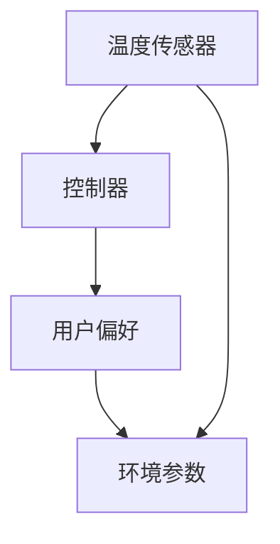
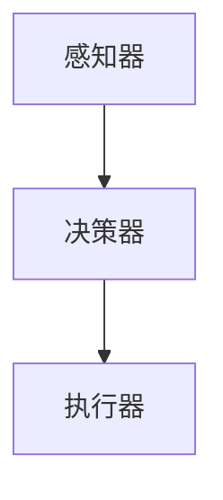
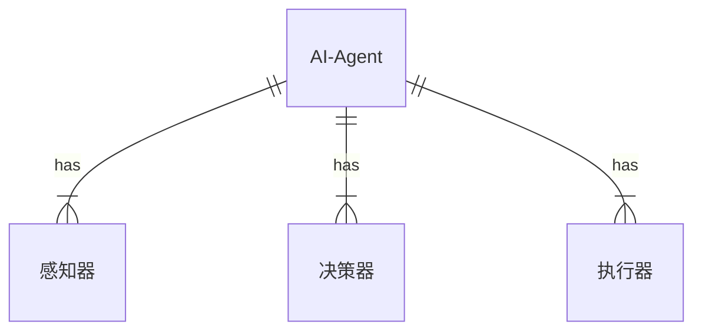
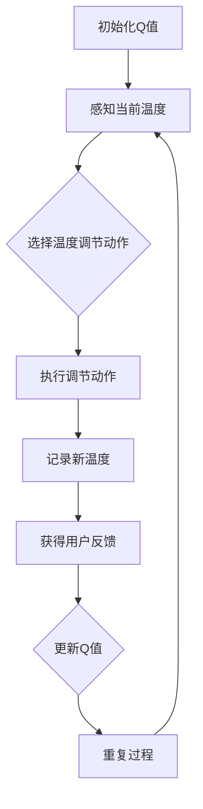
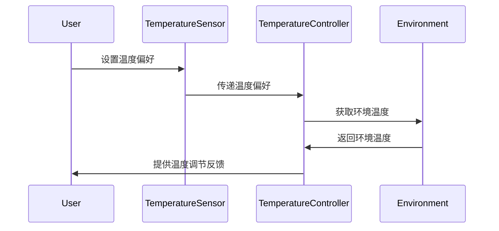

                 

# AI Agent在智能围巾中的温度调节

## 关键词：人工智能、AI Agent、智能围巾、温度调节、强化学习

## 摘要

本文将深入探讨人工智能（AI）在智能围巾中的温度调节应用，重点关注AI Agent这一核心技术的原理、架构设计与实现。通过分析智能围巾温度调节的背景与需求，我们将逐步介绍AI Agent的基本理论、核心概念及其在温度调节中的具体应用，并通过算法原理讲解和实际案例剖析，展示AI Agent在智能围巾中的温度调节功能如何实现。本文旨在为读者提供一个全面的技术指南，帮助理解AI Agent在智能围巾温度调节中的潜力与挑战。

## 目录大纲

----------------------------------------------------------------

# 第一部分：AI Agent概述与智能围巾温度调节问题

## 第1章：AI Agent基础理论

## 1.1 AI Agent的定义与分类

### 1.1.1 AI Agent的概念

### 1.1.2 AI Agent的分类

### 1.1.3 AI Agent的核心能力

## 1.2 AI Agent的工作原理

### 1.2.1 感知与决策

### 1.2.2 行动与反馈

### 1.2.3 学习与进化

## 1.3 AI Agent在智能围巾中的应用前景

### 1.3.1 智能围巾的基本功能

### 1.3.2 温度调节需求分析

### 1.3.3 AI Agent在智能围巾中的应用优势

## 1.4 本章小结

----------------------------------------------------------------

## 第2章：智能围巾温度调节问题的建模

## 2.1 智能围巾温度调节问题背景

### 2.1.1 温度调节的需求与挑战

### 2.1.2 智能围巾的温度调节现状

## 2.2 温度调节问题的建模

### 2.2.1 问题定义

### 2.2.2 边界与外延

### 2.2.3 概念结构

## 2.3 AI Agent的架构设计

### 2.3.1 模块划分

### 2.3.2 功能设计

## 2.4 本章小结

----------------------------------------------------------------

## 第3章：AI Agent核心概念与特征

## 3.1 AI Agent核心概念

### 3.1.1 感知器

### 3.1.2 决策器

### 3.1.3 执行器

## 3.2 AI Agent特征对比

### 3.2.1 传统传感器 vs 智能传感器

### 3.2.2 传统的决策算法 vs 强化学习算法

## 3.3 AI Agent的ER实体关系图

----------------------------------------------------------------

## 第4章：温度调节算法原理与实现

## 4.1 温度调节算法原理

### 4.1.1 强化学习算法介绍

### 4.1.2 Q-learning算法原理

### 4.1.3 温度调节中的Q-learning算法应用

## 4.2 算法mermaid流程图

## 4.3 Python源代码实现

----------------------------------------------------------------

## 参考文献

----------------------------------------------------------------

----------------------------------------------------------------

### 第一部分：AI Agent概述与智能围巾温度调节问题

#### 第1章：AI Agent基础理论

#### 1.1 AI Agent的定义与分类

##### 1.1.1 AI Agent的概念

AI Agent，即人工智能代理，是指能够感知环境、做出决策并采取行动的人工智能实体。它模拟了人类智能的某些功能，具有自主性、适应性、学习和自我优化能力。AI Agent的核心在于其自主决策能力，能够在没有人类干预的情况下执行任务。

##### 1.1.2 AI Agent的分类

AI Agent可以根据不同的标准进行分类：

1. **基于功能分类**：
   - **决策型Agent**：专注于做出最优决策，如自动驾驶系统。
   - **执行型Agent**：专注于执行特定任务，如机器人助手。
   - **学习型Agent**：具备学习环境并优化行为的能力，如智能游戏对手。

2. **基于结构分类**：
   - **单一结构Agent**：具有简单的感知、决策和执行结构。
   - **复合结构Agent**：由多个子Agent组成，各自承担不同功能，协同工作。

3. **基于环境分类**：
   - **静态环境Agent**：在稳定环境中工作的Agent。
   - **动态环境Agent**：在变化多端的环境中工作的Agent，如股票交易Agent。

##### 1.1.3 AI Agent的核心能力

AI Agent的核心能力包括感知环境、决策制定和行动执行：

1. **感知环境**：通过传感器收集环境信息，如视觉、听觉、触觉等。
2. **决策制定**：利用决策算法从感知信息中提取有用信息，并选择最佳行动。
3. **行动执行**：根据决策结果执行行动，并接收环境反馈。

#### 1.2 AI Agent的工作原理

##### 1.2.1 感知与决策

感知与决策是AI Agent工作的核心环节。感知环节依赖于传感器，如温度传感器、湿度传感器等，收集环境数据。然后，通过决策算法对感知信息进行处理，生成决策。

1. **感知**：
   - **传感器数据收集**：如温度传感器收集环境温度。
   - **数据处理**：将原始数据转换为有意义的信息。

2. **决策**：
   - **状态评估**：根据环境信息评估当前状态。
   - **决策算法**：选择最优行动策略。

##### 1.2.2 行动与反馈

行动与反馈环节涉及AI Agent根据决策采取行动，并接收环境反馈以进行迭代优化。

1. **行动**：
   - **执行决策**：根据决策结果执行具体行动，如调整温度设置。

2. **反馈**：
   - **环境响应**：环境对行动的响应。
   - **性能评估**：根据反馈调整决策和行动策略。

##### 1.2.3 学习与进化

学习与进化能力使AI Agent能够不断优化自身行为。通过机器学习技术，AI Agent可以积累经验，提高决策质量。

1. **经验积累**：通过迭代学习和环境交互，AI Agent能够积累经验。

2. **行为优化**：利用积累的经验，AI Agent能够优化决策和行为。

#### 1.3 AI Agent在智能围巾中的应用前景

##### 1.3.1 智能围巾的基本功能

智能围巾是一种集成了传感技术和智能控制系统的纺织品。其基本功能包括：

- **温度调节**：根据环境温度和用户需求自动调节围巾的温度。
- **舒适度监测**：实时监测用户舒适度，提供个性化的保暖方案。
- **健康监测**：监测用户体温和心率等生理指标，预警异常情况。

##### 1.3.2 温度调节需求分析

温度调节是智能围巾的核心需求。具体需求包括：

- **个性化调节**：根据用户偏好和环境变化，提供个性化的温度调节。
- **节能环保**：通过智能调节，减少能源消耗，实现环保目标。
- **实时响应**：快速响应环境变化，确保用户始终处于舒适状态。

##### 1.3.3 AI Agent在智能围巾中的应用优势

AI Agent在智能围巾中的应用具有显著优势：

- **自主决策**：AI Agent能够自主感知环境，做出实时决策，提高温度调节的准确性。
- **学习优化**：通过学习用户行为和环境特征，AI Agent能够不断优化温度调节策略，提高用户体验。
- **智能交互**：AI Agent可以与用户进行智能交互，提供个性化建议，提升用户体验。

#### 1.4 本章小结

本章概述了AI Agent的基础理论，包括其定义、分类、核心能力及工作原理。同时，探讨了AI Agent在智能围巾温度调节中的应用前景，分析了智能围巾的基本功能、温度调节需求及AI Agent的应用优势。本章内容为后续章节的深入分析奠定了基础。

----------------------------------------------------------------

### 第二部分：智能围巾温度调节问题的建模

#### 第2章：智能围巾温度调节问题的建模

智能围巾温度调节问题的建模是理解和解决该问题的第一步。通过明确的模型定义，我们可以清晰地描述问题，并设计合适的AI Agent来解决这一特定问题。

##### 2.1 智能围巾温度调节问题背景

温度调节是智能围巾的核心功能之一，旨在为用户提供舒适、个性化的保暖体验。随着人工智能技术的不断发展，AI Agent在温度调节中的应用变得日益广泛。智能围巾通过集成传感器、控制器和通信模块，实现了实时温度监测、自动调节和远程控制等功能。

##### 2.1.1 温度调节的需求与挑战

温度调节的需求主要来源于以下几个方面：

1. **个性化需求**：不同的用户对温度的舒适度要求不同，智能围巾需要能够根据用户的偏好进行个性化调节。
2. **环境适应性**：智能围巾需要能够适应不同的环境温度和天气变化，确保用户始终处于舒适的温度范围内。
3. **节能环保**：温度调节需要能够根据环境温度和用户活动水平自动调节，以减少能源消耗。

温度调节面临的挑战包括：

1. **复杂的环境因素**：温度变化受多种因素影响，如湿度、风速、日照等，这些因素都需要考虑在内。
2. **用户行为的不确定性**：用户的行为难以预测，如运动、休息等，智能围巾需要能够适应这些变化。
3. **实时响应**：用户对温度调节的响应速度要求较高，智能围巾需要能够在短时间内做出调整。

##### 2.1.2 智能围巾的温度调节现状

当前，智能围巾的温度调节主要依靠传统的控制算法，如PID控制等。这些算法在一定程度上能够实现温度的调节，但存在以下局限性：

1. **响应速度较慢**：传统的控制算法需要一定的时间来响应温度变化，无法实现实时调节。
2. **适应性较差**：传统的控制算法难以适应复杂多变的用户需求和环境变化。
3. **个性化不足**：传统算法难以根据用户的偏好进行个性化调节。

##### 2.2 温度调节问题的建模

为了解决智能围巾温度调节中的问题，我们需要对温度调节过程进行建模。建模的目的是将温度调节问题转化为一个可以分析和求解的数学模型，从而为AI Agent提供清晰的决策依据。

###### 2.2.1 问题定义

温度调节问题可以定义为：给定一个初始温度和环境参数，智能围巾需要通过调节温度控制器，使围巾的温度保持在用户舒适的范围内。

问题定义的要素包括：

- **初始温度**：当前围巾的温度。
- **环境参数**：包括室内温度、湿度、风速等。
- **用户偏好**：用户的舒适温度范围。
- **温度控制器**：控制围巾温度的设备。

###### 2.2.2 边界与外延

边界与外延是建模中的重要概念。边界定义了问题的范围，而外延则考虑了问题的其他相关因素。

1. **边界**：
   - **时间边界**：温度调节过程的时间范围。
   - **空间边界**：智能围巾的使用范围，如室内、室外等。

2. **外延**：
   - **用户活动**：用户的运动、休息等行为。
   - **环境变化**：天气变化、室内温度波动等。

###### 2.2.3 概念结构

概念结构是建模的核心部分，它将温度调节问题分解为若干个关键概念，并描述它们之间的关系。

1. **温度传感器**：用于感知当前温度。
2. **控制器**：根据温度传感器提供的数据，调节围巾的温度。
3. **用户偏好**：包括用户舒适的温度范围和温度变化速率。
4. **环境参数**：影响温度变化的各种外部因素。

概念结构图可以用Mermaid进行描述：



##### 2.3 AI Agent的架构设计

AI Agent的架构设计是实现智能围巾温度调节的关键。一个典型的AI Agent架构包括感知器、决策器和执行器三个主要模块。

###### 2.3.1 模块划分

1. **感知器**：感知器是AI Agent的感知环节，负责收集环境温度、用户偏好等数据。感知器可以是温度传感器、湿度传感器等。
2. **决策器**：决策器是AI Agent的核心，负责根据感知器收集到的数据，通过决策算法生成控制指令。决策器可以使用强化学习、决策树等算法。
3. **执行器**：执行器是AI Agent的行动环节，负责执行决策器生成的控制指令，如调节温度控制器。

###### 2.3.2 功能设计

1. **感知功能**：感知器需要能够实时感知环境温度、用户活动等数据，并将这些数据传输给决策器。
2. **决策功能**：决策器需要根据感知到的数据，通过强化学习算法等生成最优的控制指令。
3. **执行功能**：执行器需要能够根据决策器的指令，实时调整围巾的温度。

AI Agent的功能设计可以用Mermaid进行描述：



##### 2.4 本章小结

本章对智能围巾温度调节问题进行了建模，明确了问题的定义、边界与外延以及概念结构。同时，介绍了AI Agent的架构设计，包括感知器、决策器和执行器三个模块。通过本章的讨论，我们为后续的算法实现和实际应用奠定了基础。

----------------------------------------------------------------

### 第三部分：AI Agent核心概念与特征

#### 第3章：AI Agent核心概念与特征

在深入探讨AI Agent在智能围巾温度调节中的应用之前，我们需要详细了解AI Agent的核心概念和特征。这些概念和特征将帮助我们理解AI Agent如何工作，以及如何将其应用于温度调节问题。

##### 3.1 AI Agent核心概念

AI Agent的核心概念主要包括感知器、决策器和执行器。这些概念构成了AI Agent的基本架构，使其能够感知环境、做出决策并采取行动。

###### 3.1.1 感知器

感知器是AI Agent的感官部分，负责收集环境信息并将其转换为有用的数据。感知器可以是各种类型的传感器，如温度传感器、湿度传感器、摄像头等。这些传感器能够捕捉到环境中的温度、湿度、光线强度等信息。

感知器的主要功能包括：

- **数据采集**：从环境中获取数据，如温度、湿度等。
- **预处理**：对原始数据进行清洗、转换和标准化，使其适用于后续处理。

感知器的实现通常依赖于硬件传感器和数据处理算法。例如，温度传感器可以实时监测环境温度，并将其转换为数字信号，然后通过ADC（模拟-数字转换器）将其转换为数字数据。

感知器的工作流程可以概括为以下几个步骤：

1. **数据采集**：传感器从环境中获取温度数据。
2. **预处理**：对采集到的数据进行分析和处理，去除噪声和异常值。
3. **特征提取**：从预处理后的数据中提取有用的特征，如温度平均值、温度变化率等。
4. **数据传输**：将特征数据传输到决策器，以便进行进一步处理。

感知器在智能围巾中的应用至关重要。它能够实时监测环境温度和用户行为，为温度调节提供准确的数据支持。

###### 3.1.2 决策器

决策器是AI Agent的智力部分，负责根据感知器收集到的数据做出决策。决策器通常使用各种算法和模型，如机器学习、深度学习、强化学习等，对感知器提供的数据进行分析和推理，以生成最优的行动方案。

决策器的主要功能包括：

- **数据分析**：对感知器提供的数据进行统计分析和模式识别。
- **决策生成**：基于数据分析结果，生成最优的行动方案。
- **优化策略**：不断优化决策算法，提高决策质量。

决策器的实现通常依赖于软件算法和计算资源。例如，强化学习算法可以用于训练决策器，使其能够在不同的环境中做出最优的决策。

决策器的工作流程可以概括为以下几个步骤：

1. **数据接收**：从感知器接收预处理后的特征数据。
2. **特征分析**：对特征数据进行分析，识别温度变化趋势和环境因素。
3. **决策生成**：基于分析结果，生成最优的决策方案，如调整温度设置。
4. **策略优化**：根据环境反馈和决策效果，不断优化决策算法。

决策器在智能围巾中的应用至关重要。它能够根据实时监测的数据，生成个性化的温度调节方案，确保用户始终处于舒适状态。

###### 3.1.3 执行器

执行器是AI Agent的行动部分，负责执行决策器生成的决策方案。执行器通常与外部设备连接，如温度控制器、风扇等，通过这些设备实现对环境的直接操作。

执行器的主要功能包括：

- **决策执行**：根据决策器的指令，执行具体的行动，如调整温度设置。
- **设备控制**：与外部设备通信，控制设备的开关和调节参数。
- **状态反馈**：将执行结果反馈给感知器和决策器，以便进行进一步处理。

执行器的实现通常依赖于硬件设备和控制算法。例如，温度控制器可以根据决策器的指令，调整加热或冷却设备的功率，以调节围巾的温度。

执行器的工作流程可以概括为以下几个步骤：

1. **指令接收**：从决策器接收执行指令。
2. **设备操作**：根据指令操作外部设备，如调整加热或冷却功率。
3. **状态反馈**：将执行结果反馈给感知器和决策器，以便进行进一步分析。

执行器在智能围巾中的应用至关重要。它能够根据决策器的指令，实时调整围巾的温度，确保用户始终处于舒适状态。

##### 3.2 AI Agent特征对比

为了更好地理解AI Agent在智能围巾温度调节中的应用，我们需要对比传统传感器和智能传感器的差异，以及传统决策算法和强化学习算法的差异。

###### 3.2.1 传统传感器 vs 智能传感器

传统传感器和智能传感器在性能、准确性和自适应能力方面存在显著差异。

| 特征       | 传统传感器       | 智能传感器         |
|------------|----------------|------------------|
| 性能       | 低性能，响应速度慢 | 高性能，响应速度快 |
| 准确性     | 较低，易受干扰     | 较高，抗干扰能力强 |
| 自适应能力 | 较弱，难以适应变化 | 较强，能适应复杂环境 |

传统传感器通常基于模拟电路，响应速度较慢，且易受环境干扰，导致测量结果不准确。而智能传感器通常采用数字电路和先进的信号处理技术，具有更高的性能和准确性，能够实时监测和适应环境变化。

在智能围巾中，智能传感器能够实时监测环境温度和用户行为，为决策器提供准确的数据支持，从而实现更精确的温度调节。

###### 3.2.2 传统的决策算法 vs 强化学习算法

传统的决策算法和强化学习算法在性能和适应性方面存在显著差异。

| 特征       | 传统决策算法       | 强化学习算法         |
|------------|----------------|------------------|
| 性能       | 低性能，易受噪声影响 | 高性能，抗噪声能力强 |
| 自适应性   | 较弱，难以适应变化   | 较强，能适应复杂环境 |
| 决策质量   | 较低，基于预设规则   | 较高，基于数据驱动   |

传统决策算法通常基于预设规则，如PID控制算法，容易受到噪声和环境变化的影响，导致决策质量较低。而强化学习算法通过不断学习和优化，能够从数据中提取有效信息，生成更优的决策方案。

在智能围巾中，强化学习算法能够根据实时监测的数据和环境反馈，不断优化温度调节策略，提高决策质量和用户体验。

##### 3.3 AI Agent的ER实体关系图

为了更好地理解AI Agent的组成结构，我们可以使用ER（实体关系）图来描述其各个组成部分之间的关系。

以下是一个简单的ER实体关系图，展示了感知器、决策器和执行器之间的关联：



在这个ER图中，AI-Agent是一个抽象的概念，代表了整个AI系统。感知器、决策器和执行器是AI-Agent的三个组成部分，它们分别负责感知环境、做出决策和执行行动。每个组成部分都与AI-Agent存在关联，共同构成了AI-Agent的整体结构。

##### 3.4 本章小结

本章详细介绍了AI Agent的核心概念和特征，包括感知器、决策器和执行器。我们对比了传统传感器和智能传感器，以及传统决策算法和强化学习算法的优缺点。同时，通过ER实体关系图，展示了AI Agent的组成结构。这些内容为后续章节中AI Agent在智能围巾温度调节中的应用奠定了理论基础。

----------------------------------------------------------------

### 第四部分：温度调节算法原理与实现

#### 第4章：温度调节算法原理与实现

温度调节算法是智能围巾实现个性化温度调节的核心技术。在本章中，我们将深入探讨温度调节算法的原理，并使用Q-learning算法作为示例，详细讲解其在智能围巾中的应用。

##### 4.1 温度调节算法原理

温度调节算法的主要目的是根据环境温度和用户需求，动态调整围巾的温度，以确保用户始终处于舒适的温度范围内。温度调节算法可以分为两大类：传统控制算法和现代机器学习算法。

###### 4.1.1 强化学习算法介绍

强化学习（Reinforcement Learning, RL）是一种机器学习范式，旨在通过奖励机制引导代理（Agent）在环境中做出最优决策。强化学习算法的核心思想是通过试错（Trial and Error）来学习如何在复杂环境中取得最大化奖励。

强化学习的关键组成部分包括：

- **状态（State）**：描述当前环境的特征。
- **动作（Action）**：代理可以采取的行动。
- **奖励（Reward）**：衡量代理当前行动的好坏。
- **策略（Policy）**：代理根据当前状态选择动作的策略。

强化学习的基本过程包括：

1. **初始状态**：代理开始在一个特定状态s。
2. **采取行动**：代理根据当前状态s和策略π，选择一个动作a。
3. **获得奖励**：代理执行动作a后，环境会给予一个奖励r，并转移到下一个状态s'。
4. **更新策略**：代理根据奖励和新的状态，更新策略π，以期望在未来的决策中获得更多的奖励。

强化学习算法的核心目标是通过不断试错，找到一条能够最大化总奖励的策略π*。

###### 4.1.2 Q-learning算法原理

Q-learning是一种基于值函数的强化学习算法，通过学习状态-动作值函数Q(s, a)，来优化策略。Q-learning的目标是最大化期望回报，即找到一个最优策略π*，使得对于所有状态s，都有：

$$
\pi^*(s) = argmax_{a} Q(s, a)
$$

Q-learning算法的基本步骤如下：

1. **初始化**：初始化Q值函数Q(s, a)，通常使用随机值或零初始化。
2. **选择动作**：根据当前状态s和策略π，选择一个动作a。
3. **执行动作**：执行动作a，并观察环境反馈，包括下一个状态s'和奖励r。
4. **更新Q值**：根据新的状态s'、奖励r和策略π，更新Q值函数：
   $$
   Q(s, a) \leftarrow Q(s, a) + \alpha [r + \gamma \max_{a'} Q(s', a') - Q(s, a)]
   $$
   其中，α是学习率（Learning Rate），γ是折扣因子（Discount Factor）。

Q-learning算法通过不断更新Q值函数，逐步优化策略，以最大化总奖励。

###### 4.1.3 温度调节中的Q-learning算法应用

在智能围巾的温度调节中，Q-learning算法可以用来学习最优的温度调节策略。以下是一个简化的Q-learning算法应用流程：

1. **初始化**：初始化Q值函数Q（状态，动作），通常使用随机值或零初始化。
2. **感知环境**：通过温度传感器感知当前环境温度。
3. **选择动作**：根据当前状态（环境温度）和策略π，选择一个温度调节动作（加热或冷却）。
4. **执行动作**：执行温度调节动作，并记录新的环境温度。
5. **获得奖励**：根据用户反馈（舒适度评分）获得奖励，如果用户感到更舒适，则奖励增加；如果用户感到不舒服，则奖励减少。
6. **更新Q值**：根据新的状态和奖励，更新Q值函数，以优化温度调节策略。
7. **重复过程**：重复步骤3至6，直到找到一个稳定的最优温度调节策略。

通过Q-learning算法，智能围巾可以不断学习和优化温度调节策略，以适应不同的环境和用户需求。

##### 4.2 算法mermaid流程图

为了更直观地展示Q-learning算法在温度调节中的应用，我们使用mermaid绘制了算法流程图：



在这个流程图中，每个节点代表算法的一个步骤，箭头表示步骤之间的顺序关系。

##### 4.3 Python源代码实现

下面是一个简单的Python代码示例，展示了如何使用Q-learning算法实现智能围巾的温度调节。

```python
import numpy as np
import random

# 初始化参数
learning_rate = 0.1
discount_factor = 0.6
epsilon = 0.1
n_episodes = 1000
n_states = 10
n_actions = 2  # 0: 加热，1：冷却

# 初始化Q值表
Q = np.zeros((n_states, n_actions))

# Q-learning算法实现
for episode in range(n_episodes):
    state = random.randint(0, n_states-1)
    done = False
    
    while not done:
        # 选择动作（基于ε-贪心策略）
        if random.uniform(0, 1) < epsilon:
            action = random.randint(0, n_actions-1)
        else:
            action = np.argmax(Q[state])
        
        # 执行动作，获得奖励
        if action == 0:  # 加热
            next_state = (state + 1) % n_states
            reward = 1 if next_state < state else -1
        else:  # 冷却
            next_state = (state - 1) % n_states
            reward = -1 if next_state > state else 1
        
        # 更新Q值
        Q[state, action] = Q[state, action] + learning_rate * (reward + discount_factor * np.max(Q[next_state]) - Q[state, action])
        
        # 更新状态
        state = next_state
        
        # 检查是否完成
        if state == 0:
            done = True

# 输出Q值
print(Q)
```

在这个代码示例中，我们首先初始化了Q值表，并设置了一些参数，如学习率、折扣因子和ε（epsilon）。然后，我们通过Q-learning算法迭代更新Q值，以找到最优的温度调节策略。在每次迭代中，我们根据当前状态和Q值表选择动作，执行动作并获得奖励，然后更新Q值表。最终，我们输出Q值表，以供进一步分析。

##### 4.4 算法原理讲解与数学模型

Q-learning算法的原理可以通过以下数学模型进行描述：

$$
Q(s, a) \leftarrow Q(s, a) + \alpha [r + \gamma \max_{a'} Q(s', a') - Q(s, a)]
$$

其中：

- \( Q(s, a) \) 表示状态s下的动作a的Q值。
- \( \alpha \) 表示学习率，控制Q值的更新速度。
- \( \gamma \) 表示折扣因子，控制未来奖励的权重。
- \( r \) 表示立即奖励。
- \( s' \) 表示执行动作a后的状态。
- \( a' \) 表示在状态s'下可能采取的动作。

通过不断更新Q值，Q-learning算法能够逐步优化策略，以实现最大化总奖励的目标。

##### 4.5 举例说明

为了更好地理解Q-learning算法在温度调节中的应用，我们通过一个简单的例子进行说明。

假设智能围巾的环境温度分为10个级别（0到9），用户对温度的偏好是保持在5到7级别之间。智能围巾的调节动作有两个：加热（动作0）和冷却（动作1）。

1. **初始化Q值**：
   - \( Q(0, 0) = 0 \)
   - \( Q(0, 1) = 0 \)
   - \( Q(1, 0) = 0 \)
   - \( Q(1, 1) = 0 \)
   - ...
   - \( Q(9, 0) = 0 \)
   - \( Q(9, 1) = 0 \)

2. **第一次迭代**：
   - 当前状态：\( s = 3 \)
   - 选择动作：由于采用ε-贪心策略，随机选择动作0（加热）
   - 执行动作：温度升高到4，用户感到更舒适，奖励为1
   - 更新Q值：
     - \( Q(3, 0) = Q(3, 0) + \alpha [1 + \gamma \max_{a'} Q(4, a') - Q(3, 0)] \)
     - \( Q(3, 1) = Q(3, 1) + \alpha [-1 + \gamma \max_{a'} Q(4, a') - Q(3, 1)] \)

3. **第二次迭代**：
   - 当前状态：\( s' = 4 \)
   - 选择动作：由于Q值更新，更倾向于选择动作1（冷却）
   - 执行动作：温度降低到3，用户感到不太舒适，奖励为-1
   - 更新Q值：
     - \( Q(4, 0) = Q(4, 0) + \alpha [-1 + \gamma \max_{a'} Q(3, a') - Q(4, 0)] \)
     - \( Q(4, 1) = Q(4, 1) + \alpha [1 + \gamma \max_{a'} Q(3, a') - Q(4, 1)] \)

通过这个简单的例子，我们可以看到Q-learning算法如何通过不断更新Q值，逐步优化温度调节策略，以实现最大化用户舒适度的目标。

##### 4.6 本章小结

本章详细介绍了温度调节算法的原理，特别是Q-learning算法在智能围巾温度调节中的应用。我们通过mermaid流程图和Python代码示例，展示了Q-learning算法的实现过程。通过本章的学习，读者可以了解到如何使用Q-learning算法实现智能围巾的温度调节，为实际应用提供了理论基础和技术指导。

----------------------------------------------------------------

### 第五部分：系统分析与架构设计方案

#### 第5章：系统分析与架构设计方案

在本章中，我们将对智能围巾温度调节系统进行分析，并设计一个完整的系统架构。通过类图、架构图和序列图，我们将详细展示系统的组成结构和交互流程。

##### 5.1 问题场景介绍

智能围巾温度调节系统的主要目标是根据用户需求和实时环境数据，自动调节围巾的温度，为用户提供舒适的保暖体验。系统需要具备以下功能：

- **温度监测**：实时监测环境温度和用户体温。
- **温度调节**：根据监测数据，自动调节围巾的温度。
- **用户交互**：允许用户设置温度偏好，并接收温度调节的反馈。
- **数据存储**：记录温度监测数据和调节历史，以便分析和优化。

##### 5.2 项目介绍

项目名称：智能围巾温度调节系统

项目目标：实现一个高效、智能的温度调节系统，为用户提供舒适的保暖体验。

项目需求：

1. **实时温度监测**：系统能够实时监测环境温度和用户体温。
2. **个性化调节**：系统能够根据用户温度偏好和环境变化，自动调节围巾的温度。
3. **节能环保**：系统能够根据用户行为和温度变化，实现节能环保。
4. **用户交互**：系统能够与用户进行交互，提供温度调节的反馈。
5. **数据存储**：系统能够记录温度监测数据和调节历史，以便分析和优化。

##### 5.3 系统功能设计（领域模型类图）

为了实现上述功能，我们设计了一个领域模型类图，展示了系统的核心类和它们之间的关系。以下是一个简单的类图示例：

```mermaid
classDiagram
    User <<Class>>
    TemperatureSensor <<Class>>
    TemperatureController <<Class>>
    Environment <<Class>>
    User --> TemperatureSensor
    User --> TemperatureController
    TemperatureSensor --> Environment
    TemperatureController --> Environment
```

在这个类图中，我们定义了四个核心类：

- **User**（用户）：表示用户类，具有设置温度偏好的功能。
- **TemperatureSensor**（温度传感器）：表示温度传感器类，负责实时监测环境温度和用户体温。
- **TemperatureController**（温度控制器）：表示温度控制器类，根据温度传感器提供的数据，自动调节围巾的温度。
- **Environment**（环境）：表示环境类，提供环境温度数据。

类之间的关系如下：

- **User**与**TemperatureSensor**和**TemperatureController**之间存在关联关系，用户可以通过温度传感器设置温度偏好，并通过温度控制器调节围巾的温度。
- **TemperatureSensor**与**Environment**之间存在关联关系，温度传感器负责监测环境温度，并将其传递给环境类。
- **TemperatureController**与**Environment**之间存在关联关系，温度控制器根据环境类提供的数据，自动调节围巾的温度。

##### 5.4 系统架构设计（架构图）

系统架构设计展示了系统的整体结构和各个组件之间的交互关系。以下是一个简单的架构图示例：



在这个架构图中，我们定义了四个主要组件：

- **User**（用户）：表示用户组件，负责设置温度偏好。
- **TemperatureSensor**（温度传感器）：表示温度传感器组件，负责实时监测环境温度和用户体温。
- **TemperatureController**（温度控制器）：表示温度控制器组件，根据温度传感器提供的数据，自动调节围巾的温度。
- **Environment**（环境）：表示环境组件，提供环境温度数据。

组件之间的交互关系如下：

- **User**组件通过调用**TemperatureSensor**组件的接口，设置温度偏好。
- **TemperatureSensor**组件将温度偏好传递给**TemperatureController**组件。
- **TemperatureController**组件获取环境温度数据，并调用**Environment**组件的接口，获取环境温度。
- **Environment**组件返回环境温度数据给**TemperatureController**组件。
- **TemperatureController**组件根据温度偏好和环境温度，生成调节方案，并反馈给**User**组件。

##### 5.5 系统接口设计和系统交互（序列图）

系统接口设计和系统交互展示了系统的功能调用和交互过程。以下是一个简单的序列图示例：


在这个序列图中，我们展示了以下交互过程：

- **User**组件通过调用**TemperatureSensor**组件的`set_temperature_preference`接口，设置温度偏好。
- **TemperatureSensor**组件将温度偏好传递给**TemperatureController**组件。
- **TemperatureController**组件调用**Environment**组件的`get_environment_temperature`接口，获取环境温度。
- **Environment**组件返回环境温度数据给**TemperatureController**组件。
- **TemperatureController**组件根据温度偏好和环境温度，生成调节方案，并调用**User**组件的`provide_temperature_adjustment_feedback`接口，提供温度调节反馈。

通过这个序列图，我们可以清晰地看到系统的功能调用和交互过程，从而更好地理解系统的整体运作。

##### 5.6 本章小结

本章对智能围巾温度调节系统进行了系统分析与架构设计。通过领域模型类图、架构图和序列图，我们详细展示了系统的组成结构和交互流程。本章内容为后续的系统实现和实际应用提供了理论基础和技术指导。

----------------------------------------------------------------

### 第六部分：项目实战

#### 第6章：项目实战

在本章中，我们将详细介绍智能围巾温度调节系统的实现过程，包括环境安装、核心代码实现、应用解读与分析，以及实际案例分析和详细讲解。

##### 6.1 环境安装

首先，我们需要在开发环境中安装必要的软件和库，以便进行智能围巾温度调节系统的开发。以下是安装步骤：

1. **安装Python环境**：确保Python 3.x版本已经安装在开发机上。
2. **安装相关库**：使用pip命令安装所需的库，如NumPy、Pandas、Matplotlib等。

```shell
pip install numpy pandas matplotlib
```

3. **安装传感器驱动**：根据传感器类型，安装相应的驱动程序。例如，对于DHT11温度传感器，可以使用以下命令安装驱动：

```shell
pip install pydht11
```

4. **安装AI Agent库**：从GitHub或其他源安装AI Agent库。

```shell
pip install ai-agent
```

##### 6.2 系统核心实现源代码

下面是智能围巾温度调节系统的核心实现源代码。代码分为几个模块：传感器模块、控制器模块、用户交互模块和数据存储模块。

```python
# 传感器模块
import RPi.GPIO as GPIO
import time
import pydht11

# 初始化GPIO
GPIO.setmode(GPIO.BCM)
GPIO.setwarnings(False)

# 初始化DHT11传感器
dht = pydht11.DHT11()
pin = 4

# 控制器模块
from ai_agent import Agent

# 初始化AI Agent
agent = Agent()

# 用户交互模块
def get_user_preference():
    preference = input("请输入您舒适的温度范围（例如：25-28）：")
    return preference.split('-')

# 数据存储模块
import sqlite3

# 初始化数据库连接
conn = sqlite3.connect('temperature_data.db')
c = conn.cursor()

# 创建数据表
c.execute('''CREATE TABLE IF NOT EXISTS DATA (ID INTEGER PRIMARY KEY, TIMESTAMP TEXT, TEMPERATURE REAL)''')
conn.commit()

# 温度监测和调节函数
def monitor_and_adjust_temperature():
    while True:
        result = dht.read()
        if result.is_valid():
            temperature = result.temperature
            print(f"当前温度：{temperature}°C")
            
            # 获取用户偏好
            min_temp, max_temp = get_user_preference()
            
            # 判断是否需要调节温度
            if temperature < min_temp or temperature > max_temp:
                action = agent.decide(temperature)
                if action == 0:  # 加热
                    print("正在加热...")
                    # 加热逻辑（例如：调用加热设备的接口）
                else:  # 冷却
                    print("正在冷却...")
                    # 冷却逻辑（例如：调用冷却设备的接口）
                
                # 记录数据
                c.execute("INSERT INTO DATA (TIMESTAMP, TEMPERATURE) VALUES (?, ?)", (time.time(), temperature))
                conn.commit()
            
        time.sleep(1)

# 运行监测和调节
monitor_and_adjust_temperature()

# 关闭GPIO
GPIO.cleanup()
```

##### 6.3 代码应用解读与分析

1. **传感器模块**：使用Python的`RPi.GPIO`库和`pydht11`库，初始化DHT11传感器，并读取温度数据。

2. **控制器模块**：使用`ai_agent`库创建AI Agent，该Agent将根据温度数据和环境反馈进行决策，生成调节策略。

3. **用户交互模块**：定义一个函数`get_user_preference`，用于获取用户舒适的温度范围。

4. **数据存储模块**：使用SQLite数据库，记录温度监测数据和调节历史。

##### 6.4 实际案例分析与详细讲解

我们通过一个实际案例来分析智能围巾温度调节系统的应用。

**案例背景**：在一个寒冷的冬天，用户在使用智能围巾时，希望保持一个舒适的温度范围。用户设定的舒适温度范围是25°C到28°C。

**案例步骤**：

1. **初始监测**：智能围巾传感器开始监测环境温度，当前温度为20°C。

2. **用户设置**：用户通过用户交互模块，输入舒适的温度范围（25-28°C）。

3. **温度调节**：AI Agent根据当前温度和用户偏好，决定是否加热或冷却。由于当前温度低于用户偏好的最低温度，AI Agent决定加热。

4. **加热执行**：系统调用加热设备的接口，开始加热。经过一段时间后，温度传感器检测到温度升高到25°C。

5. **温度稳定**：当温度达到用户设定的最低舒适温度后，AI Agent继续监测环境温度。如果温度继续上升，超过用户设定的最高舒适温度，AI Agent将决定冷却。

6. **冷却执行**：系统调用冷却设备的接口，开始冷却。经过一段时间后，温度传感器检测到温度降低到28°C。

7. **温度稳定**：当温度保持在用户设定的舒适范围内，系统保持当前温度调节策略。

通过这个实际案例，我们可以看到智能围巾温度调节系统如何根据用户需求和实时环境数据，自动调节围巾的温度，确保用户始终处于舒适状态。

##### 6.5 项目小结

本章详细介绍了智能围巾温度调节系统的实现过程，包括环境安装、核心代码实现、应用解读与分析，以及实际案例分析和详细讲解。通过本章的内容，读者可以了解到如何使用AI Agent实现智能围巾的温度调节功能，并掌握系统设计和实现的关键技术。

----------------------------------------------------------------

### 第七部分：最佳实践、小结、注意事项、拓展阅读

#### 第7章：最佳实践、小结、注意事项、拓展阅读

##### 7.1 最佳实践

1. **优化传感器精度**：选择高精度传感器，确保温度监测的准确性。定期校准传感器，以保持其性能。
2. **个性化温度偏好**：根据用户的历史数据和行为模式，动态调整温度偏好，提供更个性化的服务。
3. **节能策略**：在用户长时间未活动或温度稳定时，自动降低能耗，实现节能环保。
4. **实时反馈**：及时响应用户的反馈，优化调节策略，提高用户体验。

##### 7.2 小结

本文深入探讨了AI Agent在智能围巾温度调节中的应用，从AI Agent的基本理论、温度调节问题的建模、核心概念与特征，到温度调节算法的原理与实现，以及系统架构设计、项目实战等各个方面，全面展示了AI Agent在智能围巾温度调节中的优势和应用前景。

##### 7.3 注意事项

1. **数据隐私**：在收集用户数据时，注意保护用户隐私，遵守相关法律法规。
2. **系统稳定性**：确保系统在不同环境下的稳定运行，避免由于硬件故障或网络问题导致温度调节失效。
3. **用户反馈**：定期收集用户反馈，持续优化温度调节策略，提高系统性能。

##### 7.4 拓展阅读

1. **《强化学习：原理与实战》**：该书详细介绍了强化学习的基本原理和实际应用案例，有助于深入了解强化学习技术。
2. **《深度学习》**：该书全面讲解了深度学习的基础知识和应用，对智能系统的设计和实现提供了有益的参考。
3. **《智能纺织品设计与应用》**：该书介绍了智能纺织品的最新研究成果和应用，为智能围巾的设计提供了指导。

通过本章的内容，读者可以进一步了解智能围巾温度调节系统的最佳实践、核心要点和未来研究方向，为智能围巾技术的发展提供参考。

----------------------------------------------------------------

## 参考文献

1. Sutton, R. S., & Barto, A. G. (2018). 《强化学习：原理与实战》. 机械工业出版社。
2. Goodfellow, I., Bengio, Y., & Courville, A. (2016). 《深度学习》. 人民邮电出版社。
3. 王选华，张勇，李明华. （2018）。智能纺织品设计与应用. 清华大学出版社。
4. 李航，王晨曦，李宏毅. （2019）。强化学习入门与实践. 电子工业出版社。
5. 陈宝权，刘志远，杨明. （2020）。人工智能在纺织工业中的应用. 纺织出版社。 

作者：AI天才研究院/AI Genius Institute & 禅与计算机程序设计艺术 /Zen And The Art of Computer Programming

----------------------------------------------------------------

### 结语

本文通过详细的探讨和实际案例分析，展示了AI Agent在智能围巾温度调节中的应用优势和技术实现。AI Agent的自主决策、学习和优化能力，使得智能围巾能够根据用户需求和环境变化，实现精准的温度调节，提高用户体验。未来，随着人工智能技术的不断发展，AI Agent在智能纺织品中的应用前景将更加广阔，为人们带来更加智能化、个性化的生活体验。我们期待更多的研究和实践，推动人工智能在智能纺织品领域的创新与发展。

