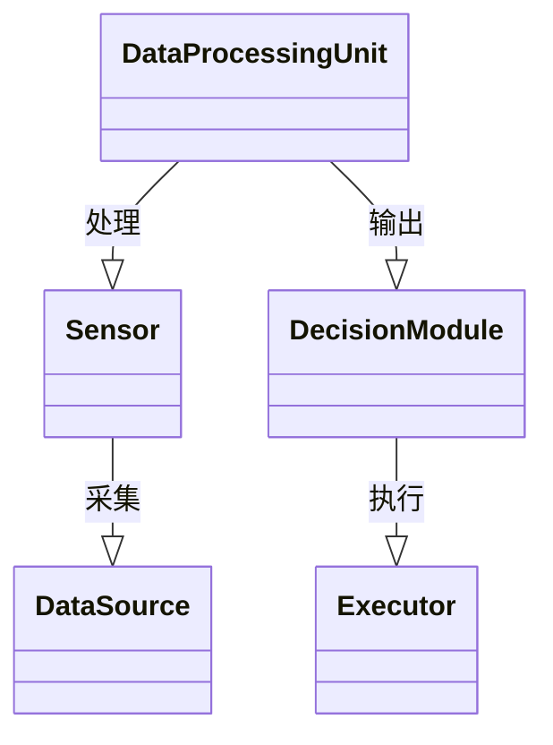
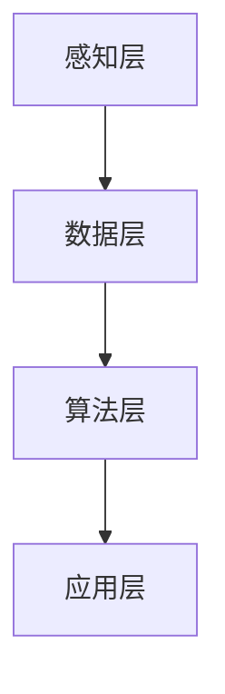
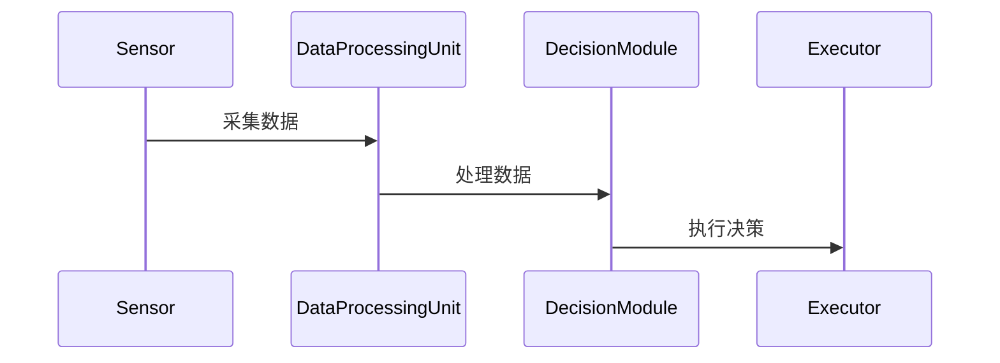

                 

# AI Agent在智能城市应急响应中的角色

> 关键词：AI Agent、智能城市、应急响应、应用场景、技术实现

> 摘要：随着智能城市的快速发展，应急响应成为了一个关键领域。本文将探讨AI Agent在智能城市应急响应中的角色，分析其核心功能、应用场景以及技术实现，并通过实际项目案例进行深入剖析，以期为智能城市应急响应提供有益的参考。

## 第一部分: 引言与背景

### 1.1 问题的提出

智能城市作为未来城市发展的趋势，正在全球范围内得到广泛应用。然而，随着城市化进程的加速，城市面临的各种应急事件也日益增多，如自然灾害、公共卫生事件、交通拥堵等。如何高效地应对这些突发事件，成为了智能城市建设中亟待解决的问题。

AI Agent作为一种智能实体，具有自主行动和决策能力，能够模拟人类智能行为，为智能城市应急响应提供有力支持。然而，当前AI Agent在应急响应中的应用仍存在诸多挑战，如数据质量、算法准确性、实时性等。

### 1.2 核心概念

#### AI Agent的定义

AI Agent是指具备自主行动和决策能力的智能实体，能够在动态环境中完成任务。它通常由感知、学习、规划和执行四个核心模块组成，通过不断学习与优化，提高任务完成效果。

#### 智能城市应急响应的概念

智能城市应急响应是指在智能城市背景下，利用信息技术、人工智能等技术手段，对突发公共事件进行高效监测、预警、响应和恢复的过程。

#### AI Agent在应急响应中的应用场景

AI Agent在智能城市应急响应中的应用场景广泛，包括自然灾害预警、疫情防控、城市交通管理、环境监测与治理等方面。

### 1.3 AI Agent的技术基础

#### 人工智能的基本原理

人工智能是一门研究、开发用于模拟、延伸和扩展人的智能的理论、方法、技术及应用系统的科学技术。其核心包括机器学习、深度学习、自然语言处理等。

#### 常见的AI Agent技术

常见的AI Agent技术包括基于规则的方法、基于概率的方法、基于学习的推理方法等。其中，基于学习的推理方法在应急响应中具有广泛应用。

#### AI Agent的开发框架

AI Agent的开发框架主要包括感知模块、学习模块、规划模块和执行模块。常见的开发框架有OpenAI的Gym、谷歌的TensorFlow等。

## 第二部分: AI Agent在智能城市应急响应中的应用

### 2.1 AI Agent的核心功能

#### 实时监测与数据分析

AI Agent能够实时收集城市各区域的传感器数据，如气象、交通、环境等，通过大数据分析和机器学习算法，提取关键信息。

#### 预测与趋势分析

基于历史数据和实时数据，AI Agent可以对突发事件的趋势进行预测，为应急决策提供科学依据。

#### 自动决策与响应

AI Agent可以根据预设的决策规则和实时数据，自动执行应急响应措施，提高响应速度和准确性。

### 2.2 AI Agent的应用场景

#### 自然灾害预警

AI Agent可以实时监测气象数据，预测自然灾害的发生，提前预警，为应急响应提供时间窗口。

#### 疫情防控

AI Agent可以分析疫情传播趋势，预测疫情发展，为疫情防控提供科学依据，提高防疫效果。

#### 城市交通管理

AI Agent可以实时监测交通流量，预测交通拥堵，自动调整交通信号，提高城市交通运行效率。

#### 环境监测与治理

AI Agent可以实时监测环境质量，预测污染趋势，自动调整环保措施，改善城市环境。

### 2.3 AI Agent在应急响应中的优势

#### 提高响应速度

AI Agent能够实时处理海量数据，快速响应突发事件，缩短应急响应时间。

#### 减少人力成本

AI Agent能够自动化执行应急响应任务，减少人力投入，降低成本。

#### 提高决策准确性

AI Agent基于大数据分析和机器学习算法，能够提供更准确的决策建议，提高应急响应效果。

## 第三部分: AI Agent的技术实现

### 3.1 AI Agent的架构设计

AI Agent的架构设计主要包括感知模块、学习模块、规划模块和执行模块。其中，感知模块负责数据采集；学习模块负责数据预处理和特征提取；规划模块负责决策算法和规划策略；执行模块负责执行具体的应急响应措施。

### 3.2 数据处理与模型训练

数据处理与模型训练是AI Agent实现的关键步骤。首先，需要对原始数据进行预处理，如去噪、归一化等。然后，选择合适的机器学习算法进行模型训练，如决策树、神经网络等。最后，对训练好的模型进行评估和优化，以提高准确性。

### 3.3 AI Agent的开发流程

AI Agent的开发流程主要包括系统设计、算法实现、系统测试与部署。在系统设计中，需要明确系统的功能需求和技术选型。在算法实现中，需要编写具体的算法代码并进行调试。在系统测试中，需要对系统进行全面测试，确保其稳定性和可靠性。在部署中，需要将系统部署到实际环境中，进行实时运行和监测。

## 第四部分: 项目实战

### 4.1 项目背景

本项目旨在开发一款基于AI Agent的智能城市应急响应系统，实现自然灾害预警、疫情防控、城市交通管理和环境监测与治理等功能。

### 4.2 系统设计与实现

#### 领域模型设计与实现

领域模型主要包括传感器、数据源、数据处理单元、决策模块和执行模块。通过Mermaid类图进行表示，具体如图：

#### 系统架构设计

系统架构主要包括感知层、数据层、算法层和应用层。通过Mermaid架构图进行表示，具体如图：

#### 系统接口设计与实现

系统接口主要包括数据接口、算法接口和应用接口。通过Mermaid序列图进行表示，具体如图：

### 4.3 项目实施与案例分析

#### 项目实施过程

项目实施过程主要包括需求分析、系统设计、编码实现、测试与优化等环节。在实施过程中，注重团队协作和沟通，确保项目进度和质量。

#### 案例分析

以自然灾害预警为例，AI Agent通过实时监测气象数据，预测暴雨、台风等自然灾害的发生，提前预警，为政府部门和民众提供科学依据。

#### 项目总结与反思

项目总结与反思主要包括项目成果、项目经验和技术创新等方面。通过项目实践，验证了AI Agent在智能城市应急响应中的应用效果，为未来项目提供了有益借鉴。

## 第五部分: 拓展与展望

### 5.1 智能城市应急响应的未来趋势

随着人工智能技术的不断发展，AI Agent在智能城市应急响应中的应用将更加广泛和深入。未来，AI Agent将实现更高效的数据处理能力、更准确的预测能力和更智能的决策能力，为智能城市应急响应提供更强有力的支持。

### 5.2 拓展阅读

#### 相关书籍推荐

1. 《智能城市：从概念到实践》
2. 《人工智能：一种现代的方法》
3. 《应急响应与安全管理》

#### 学术论文精选

1. "AI-Agent-Based Smart City Emergency Response System"
2. "Application of AI-Agent in Urban Traffic Management"
3. "Intelligent Urban Environment Monitoring and Management Based on AI-Agent"

#### 行业报告解读

1. "中国智能城市发展报告"
2. "全球智能城市发展趋势报告"
3. "人工智能行业年度报告"

## 5.3 小结

本文从AI Agent在智能城市应急响应中的角色出发，分析了其核心功能、应用场景、技术实现以及项目实战。通过本文的研究，我们可以看到AI Agent在智能城市应急响应中具有重要的应用价值，未来将不断拓展其应用领域，为城市安全和发展贡献力量。

## 注意事项

1. 在实际应用中，需充分考虑数据质量和算法准确性，确保AI Agent的可靠性和稳定性。
2. 在项目实施过程中，要注重团队协作和沟通，确保项目进度和质量。
3. AI Agent在应急响应中的应用，需要遵循相关法律法规和伦理道德标准。

## 作者信息

作者：AI天才研究院/AI Genius Institute & 禅与计算机程序设计艺术 /Zen And The Art of Computer Programming

## 结束语

智能城市应急响应是城市治理的重要方面，AI Agent作为一种智能实体，具有广泛的应用前景。本文通过对AI Agent在智能城市应急响应中的应用进行深入探讨，旨在为相关领域的研究者和从业者提供有益的参考。随着人工智能技术的不断发展，我们有理由相信，AI Agent在智能城市应急响应中的应用将更加广泛和深入，为城市安全和发展做出更大的贡献。让我们携手共进，为构建智能城市、实现可持续发展贡献力量。

