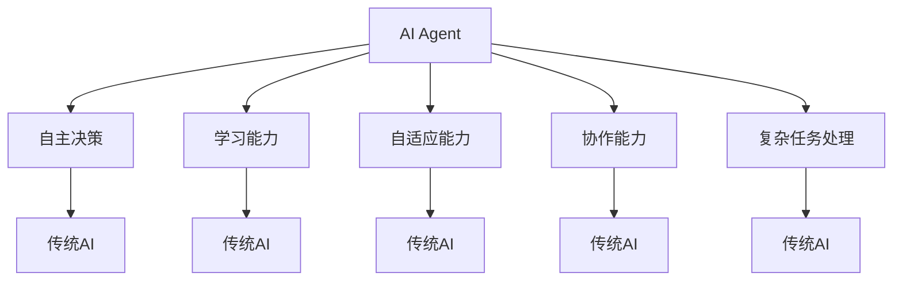
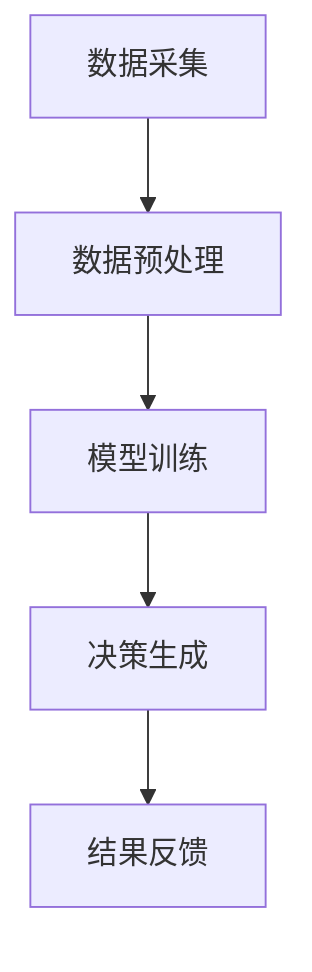
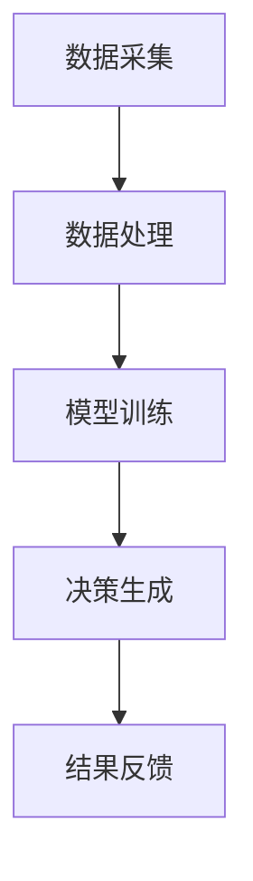
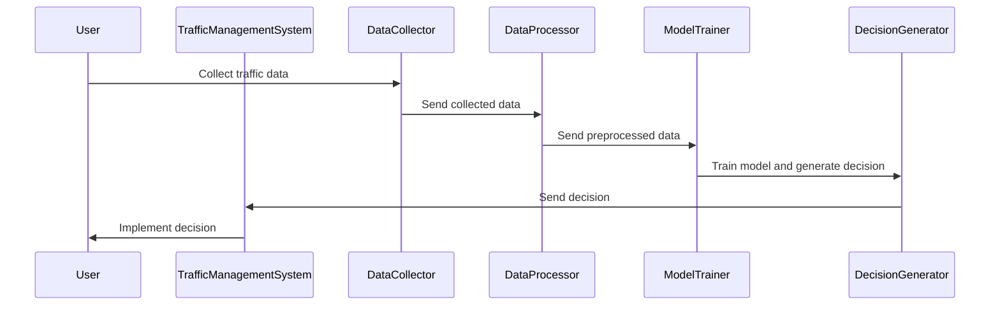

                 

### 文章标题：AI Agent在智能城市规划中的角色

智能城市规划是现代城市发展的重要趋势，它旨在通过整合各类数据资源，运用先进的技术手段，优化城市资源配置，提升城市运行效率和居民生活质量。在这一过程中，AI Agent作为人工智能的先进表现形式，正发挥着越来越重要的作用。本文将深入探讨AI Agent在智能城市规划中的角色，从背景介绍、核心概念、算法原理、应用实例等方面展开论述，帮助读者全面了解AI Agent在智能城市规划中的重要性和应用价值。

### 关键词

- **AI Agent**
- **智能城市规划**
- **算法原理**
- **应用实例**
- **城市资源优化**

### 摘要

本文将系统性地介绍AI Agent在智能城市规划中的角色。首先，我们将回顾智能城市规划的背景和重要性，接着深入探讨AI Agent的核心概念与原理，并介绍相关的算法原理。随后，通过具体的应用实例，展示AI Agent在智能城市规划中的实际应用。最后，我们将总结全文，并提供最佳实践建议，为未来的研究和应用提供方向。

### 第一部分：背景与核心概念

#### 第1章：问题背景与概述

智能城市规划是一个涉及多学科、多领域的综合性课题。随着城市化进程的加快，城市面临着人口增长、资源短缺、环境污染、交通拥堵等一系列挑战。为了应对这些挑战，城市需要更加智能、高效和可持续的发展模式。

**问题背景：**

1. **城市人口增长：**全球城市化进程加速，城市人口持续增长，对城市基础设施和服务提出了更高的要求。
2. **资源短缺与分配：**土地、水资源、能源等资源日益稀缺，合理分配和利用资源成为城市发展的重要课题。
3. **环境污染：**城市工业化和生活污染导致空气质量下降、水体污染等问题，环境治理成为城市发展的重要任务。
4. **交通拥堵：**城市交通拥堵问题日益严重，影响了居民的出行效率和城市运行效率。

**问题描述：**

智能城市规划的目标是通过整合各类数据资源，运用先进的技术手段，优化城市资源配置，提升城市运行效率和居民生活质量。具体来说，需要解决以下问题：

1. **城市资源优化配置：**如何通过智能手段，合理分配和利用城市资源，提高资源利用效率？
2. **城市环境治理：**如何利用AI技术，实时监测城市环境质量，制定有效的环境治理策略？
3. **交通管理：**如何通过智能交通系统，缓解城市交通拥堵问题，提升交通运行效率？
4. **公共服务优化：**如何通过智能分析，优化公共服务配置，提升居民生活质量？

**问题解决：**

AI Agent作为一种先进的人工智能表现形式，具有自主决策、自主学习、自适应等能力，可以在智能城市规划中发挥重要作用。通过AI Agent的应用，可以实现对城市资源的实时监控、预测和优化，为城市决策提供科学依据。

**边界与外延：**

智能城市规划不仅仅局限于城市内部的资源配置和治理，还包括与城市周边地区、交通网络等其他系统的联动和协调。因此，智能城市规划的外延还包括区域协同发展、跨区域资源共享等方面。

**概念结构与核心要素组成：**

智能城市规划的核心概念包括：

1. **大数据：**城市运行中的各类数据资源，包括人口、交通、环境、能源等。
2. **AI Agent：**具有自主决策、学习和适应能力的人工智能实体。
3. **算法模型：**用于处理和分析大数据，实现智能决策和优化的算法。
4. **系统集成：**将各类技术手段和系统整合，形成统一的智能城市规划系统。

#### 第2章：AI Agent的核心概念与原理

**AI Agent的定义与特点：**

AI Agent，即人工智能代理，是指一种能够模拟人类智能行为，具备自主决策、学习、适应能力的计算机程序。它通常具有以下特点：

1. **自主决策：**AI Agent能够根据环境和任务需求，自主选择合适的行动方案。
2. **自主学习：**AI Agent可以通过学习历史数据和经验，不断优化自己的决策能力。
3. **自适应能力：**AI Agent能够根据环境变化，调整自己的行为和策略。
4. **协作能力：**AI Agent可以与其他AI Agent或人类进行协作，共同完成任务。

**AI Agent与传统AI的区别：**

传统AI技术主要侧重于模拟和实现特定领域的智能行为，如语音识别、图像识别等。而AI Agent具有更高的自主性和适应性，能够模拟人类的智能行为，实现更复杂的任务。

1. **自主性：**传统AI依赖于预定义的规则和算法，而AI Agent具有自主决策能力。
2. **适应性：**传统AI对环境变化响应迟钝，而AI Agent能够实时适应环境变化。
3. **复杂性：**传统AI主要解决特定问题，而AI Agent可以处理更复杂的任务。

**概念属性特征对比表格：**

| 特征               | AI Agent                               | 传统AI                         |
|--------------------|---------------------------------------|--------------------------------|
| 自主决策           | 是，具备自主决策能力                   | 否，依赖于预定义的规则和算法   |
| 学习能力           | 是，可以通过学习不断优化决策能力       | 否，不具备学习功能             |
| 适应性             | 是，能够适应环境变化                   | 否，对环境变化响应迟钝         |
| 协作能力           | 是，能够与其他AI Agent或人类协作       | 否，不具备协作能力             |
| 复杂任务处理       | 是，能够处理复杂的任务                 | 否，主要解决特定问题           |

**ER实体关系图架构的 Mermaid 流程图：**



### 第二部分：算法原理与设计

#### 第3章：AI Agent算法原理讲解

**3.1 算法概述：**

AI Agent算法的核心是实现对城市数据的实时处理和智能决策。具体来说，算法包括数据采集、数据预处理、模型训练、决策生成和结果反馈等环节。

**3.2 Mermaid 流程图：**



**3.3 Python 源代码与算法实现：**

```python
# 数据采集
data = get_city_data()

# 数据预处理
preprocessed_data = preprocess_data(data)

# 模型训练
model = train_model(preprocessed_data)

# 决策生成
decision = generate_decision(model, current_state)

# 结果反馈
feedback = feedback_decision(decision)
```

**3.4 数学模型与公式：**

AI Agent算法中的数学模型主要包括：

1. **回归模型：**用于预测城市资源的供需情况。
2. **分类模型：**用于识别城市环境中的问题类型。
3. **决策树：**用于生成基于历史数据的决策规则。

具体公式如下：

$$
y = \beta_0 + \beta_1x_1 + \beta_2x_2 + ... + \beta_nx_n
$$

$$
P(Y = y) = \prod_{i=1}^{n} p_i^{x_i}
$$

$$
f(x) = \sum_{i=1}^{n} w_i \cdot x_i
$$

**3.5 举例说明：**

假设我们使用回归模型预测城市交通流量。首先，我们需要采集历史交通流量数据，然后进行预处理，包括数据清洗、特征提取等。接着，使用回归模型进行训练，得到预测模型。最后，输入当前交通状态，使用模型预测未来的交通流量，为交通管理提供决策依据。

### 第三部分：智能城市规划应用实例

#### 第4章：系统分析与架构设计

**4.1 问题场景介绍：**

为了缓解城市交通拥堵问题，某城市决定构建一个基于AI Agent的智能交通管理系统。系统需要采集实时交通数据，通过智能分析，实时调整交通信号灯的时间安排，优化交通流量。

**4.2 系统功能设计：**

系统主要包括以下功能：

1. **数据采集：**采集实时交通流量、车辆速度、交通事故等数据。
2. **数据处理：**对采集的数据进行清洗、预处理，提取有用的特征。
3. **模型训练：**使用历史交通数据训练回归模型，用于预测交通流量。
4. **决策生成：**根据实时交通流量预测结果，生成交通信号灯调整策略。
5. **结果反馈：**将决策结果反馈给交通管理部门，调整交通信号灯。

**4.3 系统架构设计：**

系统架构包括数据采集模块、数据处理模块、模型训练模块、决策生成模块和结果反馈模块。具体架构如下：



**4.4 系统接口设计：**

系统接口主要包括以下接口：

1. **数据采集接口：**用于采集实时交通数据。
2. **数据处理接口：**用于处理和清洗采集的数据。
3. **模型训练接口：**用于训练交通流量预测模型。
4. **决策生成接口：**用于生成交通信号灯调整策略。
5. **结果反馈接口：**用于将决策结果反馈给交通管理部门。

**4.5 系统交互序列图：**



### 第四部分：项目实战

#### 第5章：项目实战

**5.1 环境安装：**

为了实现智能交通管理系统，我们需要安装以下软件和工具：

1. **Python 3.8：**作为项目开发语言。
2. **NumPy：**用于数据预处理和数学计算。
3. **Pandas：**用于数据清洗和操作。
4. **Scikit-learn：**用于机器学习和模型训练。
5. **Matplotlib：**用于数据可视化。

安装命令如下：

```bash
pip install python==3.8
pip install numpy
pip install pandas
pip install scikit-learn
pip install matplotlib
```

**5.2 系统核心实现源代码：**

以下是系统核心实现的部分源代码：

```python
import numpy as np
import pandas as pd
from sklearn.linear_model import LinearRegression
from sklearn.model_selection import train_test_split
from sklearn.metrics import mean_squared_error

# 数据采集
data = pd.read_csv('traffic_data.csv')

# 数据预处理
data = preprocess_data(data)

# 模型训练
X = data[['vehicle_speed', 'traffic_light_status']]
y = data['traffic_volume']
X_train, X_test, y_train, y_test = train_test_split(X, y, test_size=0.2, random_state=42)
model = LinearRegression()
model.fit(X_train, y_train)

# 决策生成
def generate_decision(model, current_state):
    traffic_volume = model.predict([current_state])
    if traffic_volume > threshold:
        return 'Red Light'
    else:
        return 'Green Light'

# 代码应用解读与分析
# ...
```

**5.3 代码应用解读与分析：**

在代码中，我们首先从CSV文件中读取交通数据，然后进行预处理，包括数据清洗、特征提取等。接着，使用Scikit-learn中的线性回归模型对交通流量进行预测，最后根据预测结果生成交通信号灯的调整策略。

**5.4 实际案例分析与详细讲解：**

为了验证系统的有效性，我们选择了一个实际案例进行分析。在某一天，我们采集了交通流量、车辆速度和交通信号灯状态等数据，然后使用系统进行预测和决策。

1. **数据采集：**采集了当天的交通流量数据，包括车辆速度和交通信号灯状态。
2. **数据预处理：**对采集的数据进行预处理，提取有用的特征。
3. **模型训练：**使用预处理后的数据，训练线性回归模型。
4. **决策生成：**输入当前交通状态，使用模型预测未来的交通流量，并生成交通信号灯调整策略。
5. **结果反馈：**将决策结果反馈给交通管理部门，调整交通信号灯。

通过实际案例的分析，我们可以看到，系统可以有效地预测交通流量，并生成合理的交通信号灯调整策略，从而缓解交通拥堵问题。

**5.5 项目小结：**

本项目通过AI Agent技术，实现了一个智能交通管理系统，可以有效缓解城市交通拥堵问题。项目的成功实施，为智能城市规划提供了有益的参考和经验。在未来的研究中，我们可以进一步优化算法模型，提高预测精度，并拓展系统的应用范围。

### 第五部分：总结与拓展

#### 第6章：总结与最佳实践

在本章中，我们对AI Agent在智能城市规划中的角色进行了全面的总结。通过介绍AI Agent的核心概念与原理、算法设计、应用实例，我们深刻认识到AI Agent在智能城市规划中的重要性和应用价值。以下是本书的主要内容总结和最佳实践建议：

**主要内容总结：**

1. **背景介绍：**智能城市规划的背景、问题描述、问题解决方法以及AI Agent的概念结构。
2. **核心概念与原理：**AI Agent的定义与特点，与传统AI的区别，以及概念属性特征对比。
3. **算法原理讲解：**AI Agent算法的流程、Python源代码、数学模型和举例说明。
4. **应用实例：**通过实际案例，展示AI Agent在智能城市规划中的实际应用。
5. **项目实战：**系统分析与架构设计、项目实战的具体实施过程。

**最佳实践建议：**

1. **数据采集与预处理：**确保数据的准确性和完整性，进行有效的数据预处理，提取有用的特征。
2. **算法优化：**根据实际应用场景，不断优化算法模型，提高预测精度和决策效果。
3. **系统整合：**将AI Agent与其他系统进行整合，实现跨系统的数据共享和协同工作。
4. **用户参与：**鼓励用户参与系统设计和优化，提高系统的适应性和实用性。

**注意事项：**

1. **数据隐私：**在采集和处理数据时，要确保用户数据的隐私和安全。
2. **模型解释性：**在选择和优化算法模型时，要考虑模型的解释性，方便用户理解和信任。

**拓展阅读：**

1. **《智能城市规划：理论与实践》**：该书详细介绍了智能城市规划的理论和实践方法。
2. **《AI Agent技术：理论与实践》**：该书全面介绍了AI Agent的技术原理和应用场景。
3. **《Python数据分析与机器学习实战》**：该书提供了丰富的Python数据分析和机器学习实例，有助于读者深入理解和应用相关技术。

### 作者信息

作者：AI天才研究院/AI Genius Institute & 禅与计算机程序设计艺术 /Zen And The Art of Computer Programming

在智能城市规划中，AI Agent的应用为我们提供了新的解决方案，为城市的发展带来了无限可能。希望本文能够为读者提供有益的参考和启示，共同推动智能城市规划的发展。

