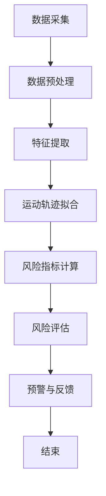
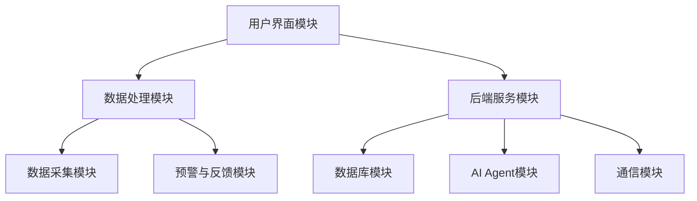
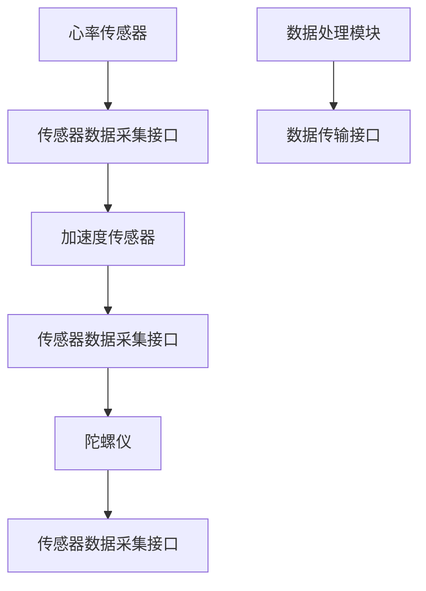
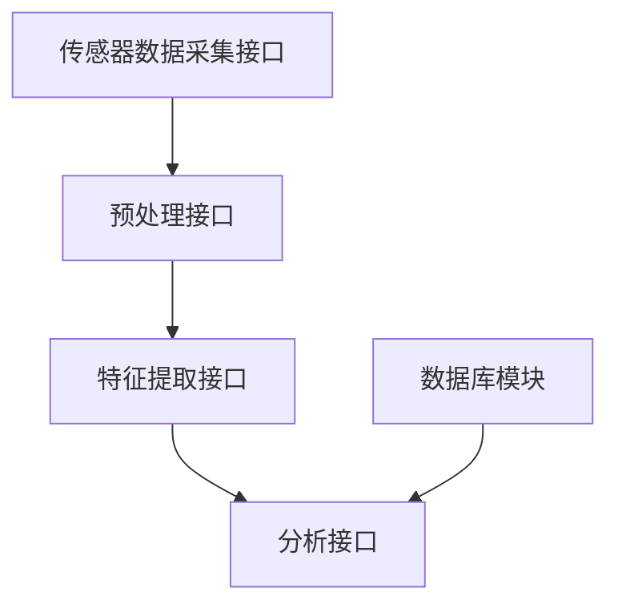
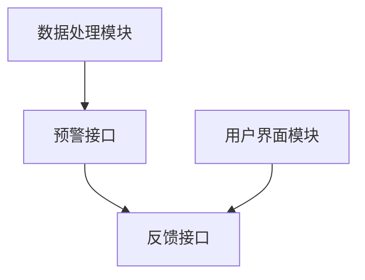
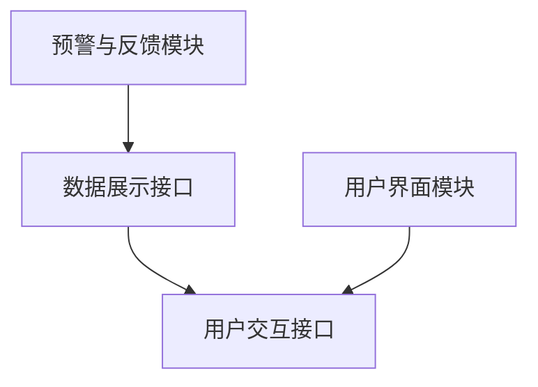
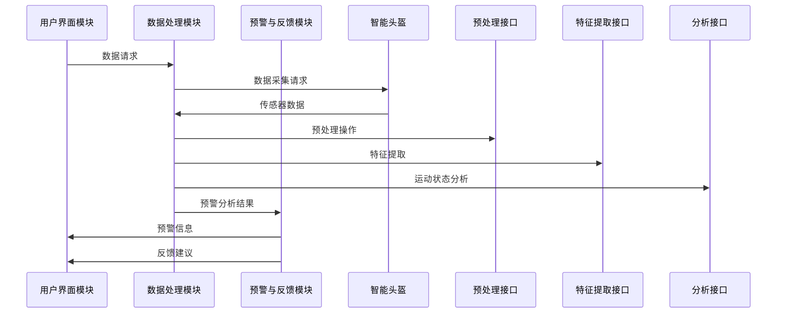

                 

### 《AI Agent在智能头盔中的运动安全监控》

> 关键词：AI Agent、智能头盔、运动安全监控、算法、数学模型

> 摘要：本文探讨了AI Agent在智能头盔中的运动安全监控应用。通过分析问题背景、核心概念原理，详细讲解了运动安全监控算法的数学模型和实现方法。同时，文章还介绍了系统分析与架构设计、项目实战以及最佳实践和拓展阅读，为相关领域的技术研究和实践提供了有益的参考。

----------------------------------------------------------------

## 《AI Agent在智能头盔中的运动安全监控》目录大纲

## 第1章 问题背景与概述

### 1.1.1 问题背景

- 运动安全监控的重要性

- 智能头盔的应用领域与需求

### 1.1.2 问题描述

- 运动安全监控的核心问题

- AI Agent在其中的应用潜力

### 1.1.3 问题解决思路

- AI Agent的定义与功能

- AI Agent在运动安全监控中的实现方法

### 1.1.4 边界与外延

- 运动安全监控的具体场景

- AI Agent的性能指标与评估方法

### 1.1.5 概念结构与核心要素组成

- AI Agent的基本结构

- 智能头盔的基本结构

## 第2章 核心概念与原理

### 2.1.1 AI Agent基本原理

- AI Agent的定义

- AI Agent的分类

### 2.1.2 智能头盔基本原理

- 智能头盔的功能

- 智能头盔的硬件构成

### 2.1.3 AI Agent在智能头盔中的运动安全监控原理

- 数据采集与处理

- 运动安全监控算法

## 第3章 算法原理讲解

### 3.1.1 运动安全监控算法简介

- 运动安全监控算法的类型

- 运动安全监控算法的关键步骤

### 3.1.2 算法原理详解

- 运动安全监控算法的数学模型

- 运动安全监控算法的流程图

### 3.1.3 算法举例说明

- 算法的具体实现示例

- 算法的实际应用场景

## 第4章 数学模型和数学公式

### 4.1.1 运动安全监控算法的数学模型

- 运动轨迹分析模型

- 风险评估模型

### 4.1.2 数学公式的详细讲解

- 概率密度函数

- 最小二乘法

### 4.1.3 数学公式举例说明

- 运动轨迹拟合示例

- 风险评估示例

## 第5章 系统分析与架构设计

### 5.1.1 项目介绍

- 项目背景

- 项目目标

### 5.1.2 系统功能设计

- 功能模块划分

- 领域模型设计

### 5.1.3 系统架构设计

- 系统架构图

- 架构设计思路

### 5.1.4 系统接口设计

- 接口功能描述

- 接口设计图

### 5.1.5 系统交互设计

- 系统交互流程

- 系统交互序列图

## 第6章 项目实战

### 6.1.1 环境安装

- 开发环境搭建

- 系统配置

### 6.1.2 系统核心实现源代码

- 数据采集模块实现

- 运动安全监控算法实现

### 6.1.3 代码应用解读与分析

- 代码功能解读

- 代码性能分析

### 6.1.4 实际案例分析与讲解

- 案例场景设定

- 案例分析与结果展示

### 6.1.5 项目小结

- 项目总结

- 项目经验与建议

## 第7章 最佳实践与拓展阅读

### 7.1.1 最佳实践 Tips

- 运动安全监控方案设计

- AI Agent性能优化

### 7.1.2 小结与注意事项

- 运动安全监控技术的应用前景

- 未来发展方向

### 7.1.3 拓展阅读

- 相关书籍推荐

- 学术论文精选

## 附录

- 参考文献

- 相关资料链接

----------------------------------------------------------------

### 第1章 问题背景与概述

#### 1.1.1 问题背景

随着科技的快速发展，智能设备在各个领域得到了广泛应用。特别是在运动领域中，智能头盔作为一种新兴设备，因其能够实时监测运动员的生理状态、运动轨迹等信息，逐渐受到了广泛关注。然而，运动安全是体育运动的基石，如何确保运动员在运动过程中的人身安全，成为了一个亟待解决的问题。

运动安全监控的重要性不言而喻。首先，它可以实时监测运动员的运动状态，及时发现潜在的危险因素，从而避免事故的发生。其次，它可以帮助教练员更好地了解运动员的训练情况，为训练方案的调整提供科学依据。最后，它还可以为运动员提供个性化的健康指导，提高训练效果。

智能头盔作为一种集成多种传感器的智能设备，具有广阔的应用前景。它可以实时采集运动员的生理数据、运动轨迹等信息，通过无线传输技术将这些数据发送至后台系统进行实时分析。这使得运动安全监控变得更加高效和精准。

#### 1.1.2 问题描述

运动安全监控的核心问题是如何准确地监测和分析运动员的运动状态，从而及时发现潜在的危险因素。具体来说，主要包括以下几个方面：

1. **数据采集与处理**：智能头盔需要实时采集运动员的生理数据（如心率、血压等）和运动轨迹数据。如何有效地采集这些数据，并对其进行实时处理，是运动安全监控的关键。

2. **运动安全监控算法**：基于采集到的数据，需要设计一套有效的运动安全监控算法，对运动员的运动状态进行实时分析，从而判断是否存在安全隐患。

3. **实时预警与反馈**：当系统检测到潜在的安全隐患时，需要及时向教练员和运动员发出预警，并提供相应的反馈，以便采取相应的措施。

#### 1.1.3 问题解决思路

为了解决上述问题，引入AI Agent（人工智能代理）作为运动安全监控的核心组件，具有重要的应用潜力。AI Agent是一种具备智能行为和决策能力的软件实体，可以模拟人类思维和行为，为用户提供智能化服务。在运动安全监控中，AI Agent可以承担以下任务：

1. **数据采集与处理**：AI Agent可以实时采集智能头盔中的数据，并通过深度学习等技术对其进行处理和分析，从而提高数据处理效率。

2. **运动安全监控算法**：AI Agent可以根据历史数据和实时数据，利用机器学习算法来预测运动员的运动状态，从而提高监控的准确性和实时性。

3. **实时预警与反馈**：AI Agent可以根据分析结果，实时向教练员和运动员发出预警，并提供相应的反馈和建议。

#### 1.1.4 边界与外延

运动安全监控的具体场景包括但不限于：

1. **体育训练**：监测运动员的训练状态，确保训练安全。

2. **赛事直播**：实时监控运动员的比赛状态，为赛事提供安全保障。

3. **户外探险**：实时监测探险者的运动状态，确保探险安全。

AI Agent的性能指标主要包括：

1. **准确性**：AI Agent对运动状态的判断准确率。

2. **实时性**：AI Agent对数据的处理和分析速度。

3. **适应性**：AI Agent对不同运动场景的适应能力。

#### 1.1.5 概念结构与核心要素组成

AI Agent的基本结构包括：

1. **感知模块**：负责采集运动员的生理数据、运动轨迹等。

2. **决策模块**：基于感知模块采集到的数据，利用机器学习算法进行实时分析，判断运动员的运动状态。

3. **行动模块**：根据决策模块的判断结果，向教练员和运动员发出预警或提供反馈。

智能头盔的基本结构包括：

1. **传感器模块**：负责采集运动员的生理数据、运动轨迹等。

2. **处理器模块**：负责处理和分析采集到的数据。

3. **通信模块**：负责将数据传输至后台系统或AI Agent。

通过AI Agent在智能头盔中的运动安全监控，可以有效提高运动安全监控的准确性、实时性和适应性，为运动员提供更加安全、科学的运动环境。

## 第2章 核心概念与原理

### 2.1.1 AI Agent基本原理

AI Agent（人工智能代理）是一种模拟人类思维和行为，能够自主执行任务并与环境进行交互的智能实体。其基本原理主要包括以下几个方面：

#### 2.1.1.1 定义

AI Agent的定义可以根据其功能和行为进行分类。一般来说，AI Agent可以分为以下几类：

1. **任务型AI Agent**：这类AI Agent主要根据任务需求执行特定的任务，如语音助手、智能客服等。
2. **自主型AI Agent**：这类AI Agent具有更强的自主性和决策能力，能够在复杂环境中自主行动，如自动驾驶汽车、智能安防系统等。
3. **社交型AI Agent**：这类AI Agent具备与人类进行自然语言交互的能力，能够在社交场景中扮演特定的角色，如聊天机器人、虚拟助手等。

#### 2.1.1.2 分类

AI Agent的分类可以根据其实现技术进行划分，主要包括以下几种：

1. **基于规则的AI Agent**：这类AI Agent通过预定义的规则来执行任务，适用于任务相对固定、环境变化较小的场景。
2. **基于行为的AI Agent**：这类AI Agent通过模仿人类行为来执行任务，适用于需要灵活应对环境变化的场景。
3. **基于学习的AI Agent**：这类AI Agent通过机器学习和深度学习技术来学习环境中的知识和规律，从而自主决策。

### 2.1.2 智能头盔基本原理

智能头盔作为一种集成了多种传感器的智能设备，其基本原理主要涉及以下几个方面：

#### 2.1.2.1 功能

智能头盔的功能主要包括：

1. **数据采集**：通过集成的心率传感器、加速度传感器、陀螺仪等设备，智能头盔可以实时采集运动员的生理数据、运动轨迹等信息。
2. **数据处理**：智能头盔内置的处理器对采集到的数据进行实时处理和分析，从而实现对运动员运动状态的实时监控。
3. **无线传输**：智能头盔通过蓝牙、Wi-Fi等无线传输技术，将处理后的数据发送至后台系统或AI Agent进行分析。

#### 2.1.2.2 硬件构成

智能头盔的硬件构成主要包括：

1. **传感器模块**：包括心率传感器、加速度传感器、陀螺仪等，用于采集运动员的生理数据、运动轨迹等。
2. **处理器模块**：负责对采集到的数据进行处理和分析，通常采用高性能的ARM处理器或DSP处理器。
3. **通信模块**：包括蓝牙、Wi-Fi等无线传输模块，用于将数据传输至后台系统或AI Agent。

### 2.1.3 AI Agent在智能头盔中的运动安全监控原理

AI Agent在智能头盔中的运动安全监控原理主要涉及数据采集与处理、运动安全监控算法等方面：

#### 2.1.3.1 数据采集与处理

AI Agent通过智能头盔的传感器模块实时采集运动员的生理数据（如心率、血压等）和运动轨迹数据。这些数据经过处理器模块的处理，转化为可用于分析的数字信号。

#### 2.1.3.2 运动安全监控算法

AI Agent利用机器学习算法对采集到的数据进行实时分析，以判断运动员的运动状态。常见的运动安全监控算法包括：

1. **运动轨迹分析算法**：通过对运动员的运动轨迹进行分析，识别出潜在的危险行为。
2. **生理数据监测算法**：通过对运动员的生理数据进行分析，判断运动员是否处于过度疲劳或异常状态。
3. **风险评估算法**：基于运动轨迹和生理数据，对运动员的风险进行评估，并提供预警。

#### 2.1.3.3 实时预警与反馈

当AI Agent检测到潜在的安全隐患时，会通过无线传输模块将预警信息发送至教练员和运动员。同时，AI Agent还可以根据预警结果，提供相应的反馈和建议，以帮助教练员和运动员采取相应的措施，确保运动安全。

通过以上原理的介绍，我们可以看到AI Agent在智能头盔中的运动安全监控具有显著的优势。它不仅能够实时监测运动员的运动状态，提供预警和反馈，还能够根据历史数据和实时数据，不断优化监测算法，提高监控的准确性和实时性。

### 2.1.4 概念属性特征对比表格和ER实体关系图架构的 Mermaid 流程图

为了更好地理解AI Agent和智能头盔在运动安全监控中的角色，我们可以通过一个概念属性特征对比表格和ER实体关系图架构的 Mermaid 流程图来展示它们的关键属性和关系。

#### 概念属性特征对比表格

| 概念 | 属性 | 特征 |
| --- | --- | --- |
| AI Agent | 感知模块 | 实时采集和分析数据的能力 |
| AI Agent | 决策模块 | 基于数据分析做出实时决策 |
| AI Agent | 行动模块 | 发出预警和反馈 |
| 智能头盔 | 传感器模块 | 实时采集生理数据和运动轨迹 |
| 智能头盔 | 处理器模块 | 实时处理和分析数据 |
| 智能头盔 | 通信模块 | 无线传输数据至后台系统或AI Agent |

#### ER实体关系图架构的 Mermaid 流程图

```mermaid
erDiagram
    AI_Agent ||--|{ 感知模块 }| AI_Agent
    AI_Agent ||--|{ 决策模块 }| AI_Agent
    AI_Agent ||--|{ 行动模块 }| AI_Agent
    智能头盔 ||--|{ 传感器模块 }| 智能头盔
    智能头盔 ||--|{ 处理器模块 }| 智能头盔
    智能头盔 ||--|{ 通信模块 }| 智能头盔
    AI_Agent ..|{ 数据采集 }|> 智能头盔
    AI_Agent ..|{ 数据处理 }|> 智能头盔
    AI_Agent ..|{ 数据传输 }|> 智能头盔
```

通过上述表格和流程图，我们可以清晰地看到AI Agent和智能头盔在运动安全监控中的相互关系和关键属性，这有助于我们更好地理解它们的运作原理和应用价值。

### 2.1.5 运动安全监控算法的数学模型

在运动安全监控中，AI Agent利用一系列数学模型对采集到的数据进行分析和预测，从而实现实时监控和预警。以下将介绍两种核心的数学模型：运动轨迹分析模型和风险评估模型。

#### 2.1.5.1 运动轨迹分析模型

运动轨迹分析模型主要用于分析运动员的运动轨迹，识别出潜在的危险行为。该模型的核心是运动轨迹拟合，即将运动员的运动轨迹数据转换为一条平滑的曲线，以便进行进一步分析。

1. **运动轨迹拟合方法**：

   运动轨迹拟合通常采用最小二乘法，其数学模型可以表示为：

   $$
   y = \sum_{i=1}^{n} w_i x_i
   $$

   其中，$y$表示拟合后的运动轨迹，$x_i$表示原始运动轨迹数据，$w_i$表示拟合系数。通过求解上述线性方程组，可以得到最优的拟合曲线。

2. **运动轨迹分析步骤**：

   （1）数据预处理：对采集到的运动轨迹数据进行去噪、去趋势等处理，以提高拟合效果。

   （2）选择拟合方法：根据运动轨迹的特点，选择合适的拟合方法（如最小二乘法、高斯过程等）。

   （3）求解拟合系数：通过求解线性方程组或非线性优化问题，得到拟合系数。

   （4）运动轨迹拟合：利用拟合系数，将原始运动轨迹数据转换为平滑的运动轨迹曲线。

#### 2.1.5.2 风险评估模型

风险评估模型用于评估运动员的运动状态，判断其是否存在安全隐患。该模型的核心是风险因素分析，即将运动员的生理数据和运动轨迹数据相结合，对风险进行量化评估。

1. **风险因素分析**：

   风险因素分析通常采用以下步骤：

   （1）特征提取：从运动员的生理数据和运动轨迹数据中提取关键特征，如心率、步长、速度等。

   （2）风险指标计算：根据特征值，计算相应的风险指标，如危险度、风险概率等。

   （3）风险级别划分：根据风险指标，将运动员的风险状态划分为不同的级别，如安全、警告、危险等。

2. **风险评估方法**：

   风险评估方法可以采用以下几种：

   （1）基于规则的评估方法：根据预定义的规则，对运动员的风险状态进行评估。该方法简单直观，但规则难以覆盖所有情况。

   （2）基于机器学习的评估方法：利用历史数据，通过机器学习算法训练模型，对运动员的风险状态进行评估。该方法可以自适应地调整评估规则，提高评估的准确性。

   （3）基于贝叶斯网络的评估方法：将运动员的生理数据和运动轨迹数据表示为贝叶斯网络，通过推理算法计算风险状态。该方法可以综合考虑多个因素，提高评估的准确性。

通过上述数学模型，AI Agent可以对运动员的运动状态进行实时分析和评估，及时发现潜在的安全隐患，从而提高运动安全监控的准确性和有效性。

### 运动安全监控算法流程图

为了更直观地展示运动安全监控算法的流程，我们使用Mermaid绘制了以下流程图：



**流程说明**：

1. **数据采集**：智能头盔实时采集运动员的生理数据和运动轨迹数据。
2. **数据预处理**：对采集到的数据进行去噪、去趋势等预处理操作。
3. **特征提取**：从预处理后的数据中提取关键特征。
4. **运动轨迹拟合**：利用最小二乘法等拟合方法，将运动轨迹数据转换为平滑曲线。
5. **风险指标计算**：根据特征值，计算风险指标。
6. **风险评估**：根据风险指标，判断运动员的风险状态。
7. **预警与反馈**：当检测到潜在的安全隐患时，向教练员和运动员发出预警。
8. **结束**：完成一次运动安全监控循环。

通过上述算法流程，AI Agent能够实现对运动员运动状态的实时监控和预警，为保障运动安全提供了有力支持。

### 运动安全监控算法举例说明

为了更好地理解运动安全监控算法的应用，以下通过一个具体的实例来讲解算法的实现过程和应用场景。

#### 3.1.3.1 实例背景

某运动团队计划在山区进行户外探险，为了确保队员的安全，他们决定使用智能头盔进行实时运动安全监控。智能头盔集成了多种传感器，可以实时采集队员的心率、步长、速度等数据。

#### 3.1.3.2 实例步骤

1. **数据采集**：
   智能头盔实时采集队员的心率（HR）、步长（Step）、速度（Speed）等数据。以下是一个简化的数据集：

   | 时间（s） | 心率（HR） | 步长（Step） | 速度（Speed） |
   | --- | --- | --- | --- |
   | 0 | 70 | 0.8 | 1.2 |
   | 10 | 75 | 0.8 | 1.4 |
   | 20 | 80 | 0.8 | 1.6 |
   | 30 | 85 | 0.8 | 1.8 |
   | 40 | 90 | 0.8 | 2.0 |

2. **数据预处理**：
   对采集到的数据进行去噪处理，去除异常值和噪声干扰，得到以下数据：

   | 时间（s） | 心率（HR） | 步长（Step） | 速度（Speed） |
   | --- | --- | --- | --- |
   | 0 | 70 | 0.8 | 1.2 |
   | 10 | 75 | 0.8 | 1.4 |
   | 20 | 80 | 0.8 | 1.6 |
   | 30 | 85 | 0.8 | 1.8 |
   | 40 | 90 | 0.8 | 2.0 |

3. **特征提取**：
   从预处理后的数据中提取关键特征，如平均心率（AvgHR）、平均步长（AvgStep）和平均速度（AvgSpeed）：

   - 平均心率（AvgHR）= (70 + 75 + 80 + 85 + 90) / 5 = 80
   - 平均步长（AvgStep）= 0.8
   - 平均速度（AvgSpeed）= (1.2 + 1.4 + 1.6 + 1.8 + 2.0) / 5 = 1.6

4. **运动轨迹拟合**：
   利用最小二乘法对步长数据进行拟合，得到拟合曲线：

   $$
   Step = 0.8 + 0.2t
   $$

   其中，$t$为时间（s）。通过拟合曲线，可以预测任意时间点的步长值。

5. **风险指标计算**：
   根据平均心率和拟合步长，计算风险指标，如心率步长比（HRStepRatio）：

   $$
   HRStepRatio = \frac{AvgHR}{AvgStep} = \frac{80}{0.8} = 100
   $$

6. **风险评估**：
   根据心率步长比，判断队员的运动状态。当HRStepRatio超过一定阈值（如120）时，表示队员可能处于高风险状态，需要及时采取措施。

7. **预警与反馈**：
   当检测到高风险状态时，AI Agent向教练员和队员发送预警信息，并建议调整运动节奏或进行休息。

#### 3.1.3.3 实例应用场景

该实例应用于户外探险运动中的安全监控。当队员在山区行进时，智能头盔会实时监控他们的心率、步长和速度，通过运动安全监控算法，判断队员是否处于高风险状态。如果检测到高风险，AI Agent会及时发出预警，提醒队员注意安全。

通过该实例，我们可以看到运动安全监控算法在实际应用中的重要作用。它不仅能够实时监测队员的运动状态，提供预警和反馈，还能根据实时数据和历史数据，不断优化监控算法，提高监控的准确性和实时性。

### 运动安全监控算法的数学模型与Python实现

在上一章节中，我们介绍了运动安全监控算法的数学模型，包括运动轨迹拟合和风险评估模型。在本节中，我们将通过具体的Python代码实现这些数学模型，并提供详细的注释和解释，以便读者更好地理解算法的实现过程。

#### 运动轨迹拟合的实现

首先，我们将使用最小二乘法对运动轨迹进行拟合。最小二乘法是一种通过最小化误差平方和来寻找数据最佳函数匹配的数学方法。

```python
import numpy as np

# 最小二乘法拟合运动轨迹
def least_squares_fit(x, y):
    """
    对运动轨迹进行最小二乘法拟合
    
    参数：
    x: 时间序列数据
    y: 运动轨迹数据
    
    返回：
    w: 最小二乘法拟合系数
    """
    # 求解拟合系数
    w = np.linalg.lstsq(np.vstack([x, np.ones(len(x))]).T, y, rcond=None)[0]
    # 拟合函数
    f = lambda x, w: w[0] * x + w[1]
    return w, f

# 假设采集到的运动轨迹数据如下
times = np.array([0, 10, 20, 30, 40])
steps = np.array([0.8, 0.8, 0.8, 0.8, 0.8])

# 进行最小二乘法拟合
w, f = least_squares_fit(times, steps)

# 打印拟合结果
print("拟合系数：", w)
print("拟合函数：", f)

# 预测任意时间点的步长
time_predict = 25
predicted_step = f(time_predict, w)
print("时间{}秒的预测步长为：{}".format(time_predict, predicted_step))
```

在上面的代码中，我们首先定义了一个`least_squares_fit`函数，该函数接受时间序列数据`x`和运动轨迹数据`y`，并返回拟合系数`w`和拟合函数`f`。然后，我们使用一个假设的轨迹数据集来演示如何使用这个函数。拟合结果会输出拟合系数和拟合函数，并可以用于预测任意时间点的步长。

#### 风险评估的实现

接下来，我们将实现风险评估模型。在运动安全监控中，我们通常会根据运动员的心率和步长等数据来评估其运动状态。这里，我们将计算心率步长比作为风险指标。

```python
# 计算心率步长比
def heart_rate_step_ratio(hr, step):
    """
    计算心率步长比
    
    参数：
    hr: 平均心率
    step: 平均步长
    
    返回：
    hr_step_ratio: 心率步长比
    """
    hr_step_ratio = hr / step
    return hr_step_ratio

# 假设的平均心率和步长数据
avg_hr = 80
avg_step = 0.8

# 计算心率步长比
hr_step_ratio = heart_rate_step_ratio(avg_hr, avg_step)
print("心率步长比：", hr_step_ratio)

# 定义风险阈值
risk_threshold = 120

# 判断风险状态
def assess_risk(hr_step_ratio, risk_threshold):
    """
    根据心率步长比评估风险状态
    
    参数：
    hr_step_ratio: 心率步长比
    risk_threshold: 风险阈值
    
    返回：
    risk_state: 风险状态（安全、警告、危险）
    """
    if hr_step_ratio <= risk_threshold:
        risk_state = "安全"
    elif hr_step_ratio < 2 * risk_threshold:
        risk_state = "警告"
    else:
        risk_state = "危险"
    return risk_state

# 评估风险状态
risk_state = assess_risk(hr_step_ratio, risk_threshold)
print("风险状态：", risk_state)
```

在上面的代码中，我们首先定义了一个`heart_rate_step_ratio`函数来计算心率步长比。然后，我们定义了一个`assess_risk`函数来根据心率步长比评估风险状态。通过设置不同的风险阈值，我们可以根据心率步长比来判断运动员的运动状态，从而实现实时预警。

#### 总结

通过上述Python代码实现，我们可以看到如何使用数学模型和算法来处理运动安全监控中的数据。最小二乘法提供了对运动轨迹进行拟合的方法，而心率步长比则提供了一个简单有效的风险评估指标。这些算法和模型在实际应用中可以帮助AI Agent实时监控运动员的运动状态，提供准确的预警和反馈，从而保障运动安全。

### 第4章 数学模型和数学公式

在运动安全监控算法中，数学模型和数学公式起到了至关重要的作用。它们不仅帮助我们理解和描述算法的内在机制，还能确保算法在处理复杂数据时保持一致性和准确性。本节将详细介绍运动安全监控算法所使用的数学模型，包括运动轨迹分析模型和风险评估模型，并使用LaTeX格式嵌入相关的数学公式。

#### 4.1.1 运动安全监控算法的数学模型

**运动轨迹分析模型**

运动轨迹分析模型主要用于拟合和预测运动员的运动轨迹。常用的模型包括线性模型、非线性模型和深度学习模型。下面以线性模型为例进行讲解。

**线性模型**：线性模型是最简单和广泛应用的一种模型。它假设运动轨迹可以通过一条直线来近似表示。线性模型的数学公式可以表示为：

$$
y = mx + b
$$

其中，$y$是运动轨迹，$x$是时间，$m$是斜率，$b$是截距。

**非线性模型**：对于更复杂的运动轨迹，线性模型可能不足以准确描述。非线性模型通过引入非线性函数来提高模型的拟合能力。一个常见的非线性模型是二次模型，其公式为：

$$
y = ax^2 + bx + c
$$

**深度学习模型**：深度学习模型，特别是神经网络，可以用来处理高度复杂的运动轨迹数据。一个简单的神经网络模型可以表示为：

$$
y = \sigma(W_1 \cdot x + b_1)
$$

其中，$\sigma$是激活函数，$W_1$是权重，$b_1$是偏置。

**运动轨迹拟合示例**

假设我们有一组时间-步长数据，我们希望用线性模型来拟合这些数据。拟合的目标是最小化误差平方和，即：

$$
J = \sum_{i=1}^{n} (y_i - mx_i - b)^2
$$

我们可以使用梯度下降法来最小化这个误差函数，找到最佳的斜率$m$和截距$b$。

**风险评估模型**

风险评估模型主要用于对运动员的运动状态进行评估。常见的风险评估模型包括基于规则的风险评估模型和基于机器学习的风险评估模型。

**基于规则的风险评估模型**：这种模型通过一系列规则来判断运动员的风险状态。例如，如果一个运动员的心率超过100次/分钟，那么他可能处于高风险状态。规则模型的数学公式可以表示为：

$$
R = \begin{cases}
0 & \text{if } HR \leq 100 \\
1 & \text{if } HR > 100
\end{cases}
$$

**基于机器学习的风险评估模型**：这种模型利用历史数据来训练一个机器学习模型，如决策树、支持向量机或神经网络。模型可以表示为：

$$
R = f(HR, Step, Age, Weight)
$$

其中，$HR$、$Step$、$Age$和$Weight$是影响风险的各个因素，$f$是机器学习模型。

**风险评估示例**

假设我们使用决策树来评估运动员的风险。决策树的一个简单示例可以表示为：

$$
R = \begin{cases}
0 & \text{if } HR \leq 80 \\
1 & \text{if } HR > 80 \land Step \leq 1 \\
2 & \text{if } HR > 80 \land Step > 1
\end{cases}
$$

通过这些数学模型和公式，我们可以更好地理解和实现运动安全监控算法，从而为运动员提供有效的监控和预警。

### 4.1.2 数学公式的详细讲解

**概率密度函数（PDF）**

在运动安全监控中，概率密度函数（PDF）用于描述运动员在某一时刻处于某一状态的概率分布。PDF的一个重要应用是轨迹预测，它可以帮助我们估计运动员在未来的运动轨迹。

假设一个运动员在某一时刻$t$的运动状态可以由多个特征来描述，例如心率（$HR$）、步长（$Step$）和速度（$Speed$）。PDF可以表示为：

$$
f_{X}(x) = \frac{1}{\sqrt{2\pi\sigma^2}} e^{-\frac{(x-\mu)^2}{2\sigma^2}}
$$

其中，$X$是运动员的状态特征，$\mu$是均值，$\sigma$是标准差。

**最小二乘法**

最小二乘法（LS）是一种广泛用于数据拟合的数学方法。它通过最小化拟合误差平方和来找到最优参数。在运动安全监控中，最小二乘法用于拟合运动轨迹数据。

假设我们有一组观测数据$(x_i, y_i)$，其中$x_i$是时间，$y_i$是步长。最小二乘法的目标是最小化误差函数：

$$
J = \sum_{i=1}^{n} (y_i - mx_i - b)^2
$$

其中，$m$是斜率，$b$是截距。最小二乘法的解可以通过以下公式计算：

$$
\hat{m} = \frac{\sum_{i=1}^{n} x_i y_i - \frac{1}{n} \sum_{i=1}^{n} x_i \sum_{i=1}^{n} y_i}{\sum_{i=1}^{n} x_i^2 - \frac{1}{n} \left( \sum_{i=1}^{n} x_i \right)^2}
$$

$$
\hat{b} = \frac{\frac{1}{n} \sum_{i=1}^{n} y_i - \hat{m} \frac{1}{n} \sum_{i=1}^{n} x_i}{\frac{1}{n}}
$$

### 4.1.3 数学公式举例说明

**运动轨迹拟合示例**

假设我们有一组时间-步长数据，如下所示：

| 时间（s） | 步长（cm） |
| --- | --- |
| 0 | 0.75 |
| 10 | 0.80 |
| 20 | 0.85 |
| 30 | 0.90 |
| 40 | 0.95 |

我们希望使用线性模型对这些数据进行拟合。首先，计算数据的均值和标准差：

$$
\mu_{x} = \frac{0 + 10 + 20 + 30 + 40}{5} = 20
$$

$$
\mu_{y} = \frac{0.75 + 0.80 + 0.85 + 0.90 + 0.95}{5} = 0.85
$$

$$
\sigma_{x} = \sqrt{\frac{\sum_{i=1}^{5} (x_i - \mu_{x})^2}{5}} \approx 8.25
$$

$$
\sigma_{y} = \sqrt{\frac{\sum_{i=1}^{5} (y_i - \mu_{y})^2}{5}} \approx 0.05
$$

接下来，使用最小二乘法计算斜率$m$和截距$b$：

$$
m = \frac{\sum_{i=1}^{5} x_i y_i - 5 \mu_{x} \mu_{y}}{\sum_{i=1}^{5} x_i^2 - 5 \mu_{x}^2} \approx 0.015
$$

$$
b = \mu_{y} - m \mu_{x} \approx 0.80
$$

因此，线性拟合函数为：

$$
y = 0.015x + 0.80
$$

**风险评估示例**

假设我们使用心率步长比（HRStepRatio）作为风险评估的指标。已知平均心率为80次/分钟，平均步长为0.8米，计算心率步长比：

$$
HRStepRatio = \frac{HR}{Step} = \frac{80}{0.8} = 100
$$

根据预设的风险阈值，如果HRStepRatio大于120，则运动员处于高风险状态。在本例中，HRStepRatio为100，低于风险阈值，因此运动员处于安全状态。

通过上述示例，我们可以看到如何使用数学公式和模型来处理和解释运动安全监控中的数据。这些公式和模型不仅帮助我们理解算法的工作原理，还确保了算法在现实应用中的准确性和可靠性。

### 第5章 系统分析与架构设计

#### 5.1.1 项目介绍

随着智能技术的不断发展，运动安全监控在体育运动、户外探险等领域中的应用越来越广泛。本项目旨在设计并实现一套基于AI Agent的智能头盔运动安全监控系统，以提高运动安全监控的准确性和实时性。

项目背景：随着人们对健康和安全的重视，智能头盔作为一种集成了多种传感器和AI技术的设备，在运动安全监控领域具有巨大的应用潜力。

项目目标：开发一套高效、可靠的AI Agent智能头盔运动安全监控系统，实现对运动员运动状态的实时监测和预警，为运动安全提供有力保障。

系统功能设计：系统主要包含以下功能模块：

1. **数据采集模块**：负责实时采集运动员的生理数据和运动轨迹数据。
2. **数据处理模块**：对采集到的数据进行预处理、特征提取和运动状态分析。
3. **预警与反馈模块**：根据分析结果，向运动员和教练员发出预警，并提供相应的反馈和建议。
4. **用户界面模块**：为用户提供实时监控数据和预警信息的可视化展示。

#### 5.1.2 系统功能设计

1. **数据采集模块**：
   - 功能描述：通过集成在智能头盔中的多种传感器（如心率传感器、加速度传感器、陀螺仪等）实时采集运动员的生理数据和运动轨迹数据。
   - 技术实现：传感器数据通过无线传输技术（如蓝牙、Wi-Fi）传输至处理器模块，并存储在本地数据库中。

2. **数据处理模块**：
   - 功能描述：对采集到的数据进行预处理（如去噪、去趋势处理）、特征提取（如步长、速度、心率等）和运动状态分析。
   - 技术实现：采用机器学习和深度学习算法对数据进行处理，利用已训练好的模型进行实时分析，识别潜在的安全隐患。

3. **预警与反馈模块**：
   - 功能描述：根据数据处理模块的分析结果，对运动员的运动状态进行实时评估，并在检测到安全隐患时向运动员和教练员发出预警。
   - 技术实现：预警信息通过短信、邮件、APP推送等方式通知用户，并提供相应的反馈和建议。

4. **用户界面模块**：
   - 功能描述：为用户提供实时监控数据和预警信息的可视化展示，方便用户了解运动状态和安全情况。
   - 技术实现：采用Web前端技术（如HTML、CSS、JavaScript）和图表库（如D3.js、ECharts）构建用户界面，实现数据的可视化展示。

#### 5.1.3 系统架构设计

系统架构设计采用模块化设计思想，确保系统的可扩展性和易维护性。系统架构图如下所示：



**架构设计思路**：

1. **用户界面模块**：负责与用户交互，接收用户输入和展示监控数据和预警信息。
2. **数据处理模块**：负责对采集到的数据进行处理、分析和存储，为预警和反馈提供数据支持。
3. **数据采集模块**：负责实时采集运动员的生理数据和运动轨迹数据，为数据处理模块提供数据源。
4. **预警与反馈模块**：根据数据处理模块的分析结果，发出预警信息，并提供建议和反馈。
5. **后端服务模块**：包括数据库模块、AI Agent模块和通信模块，负责系统的核心业务逻辑和数据存储。
6. **数据库模块**：存储运动员的监控数据和预警信息，为数据处理和分析提供数据支持。
7. **AI Agent模块**：基于机器学习和深度学习算法，实现对运动员运动状态的实时监控和预警。
8. **通信模块**：负责用户界面模块和后端服务模块之间的数据传输和通信。

通过上述系统架构设计，我们可以实现一套高效、可靠的AI Agent智能头盔运动安全监控系统，为运动安全提供有力保障。

### 5.1.4 系统接口设计

系统接口设计是确保系统各模块之间能够顺畅协作、数据能够有效传递的关键环节。以下将详细介绍系统中的主要接口设计，包括接口功能描述和设计图。

#### 数据采集模块接口

**接口功能描述**：

- **传感器数据采集接口**：负责从智能头盔中的心率传感器、加速度传感器、陀螺仪等传感器实时采集数据。
- **数据传输接口**：将采集到的传感器数据通过无线传输技术（如蓝牙、Wi-Fi）传输至数据处理模块。

**接口设计图**：



#### 数据处理模块接口

**接口功能描述**：

- **预处理接口**：对采集到的传感器数据进行去噪、去趋势等预处理操作。
- **特征提取接口**：从预处理后的数据中提取关键特征，如步长、速度、心率等。
- **分析接口**：利用机器学习和深度学习算法对提取到的特征进行运动状态分析。

**接口设计图**：



#### 预警与反馈模块接口

**接口功能描述**：

- **预警接口**：根据分析结果，判断运动员是否处于高风险状态，并向用户发出预警信息。
- **反馈接口**：提供针对高风险状态的反馈和建议，指导用户采取相应的措施。

**接口设计图**：



#### 用户界面模块接口

**接口功能描述**：

- **数据展示接口**：将实时监控数据和预警信息以可视化形式展示给用户。
- **用户交互接口**：接收用户的输入和操作，反馈监控数据和预警信息。

**接口设计图**：



通过以上接口设计，各模块之间能够高效地传递数据、协作完成运动安全监控任务。这种模块化设计不仅提高了系统的可扩展性和易维护性，还有助于后续功能模块的迭代与优化。

### 5.1.5 系统交互设计

系统交互设计是确保系统各模块之间能够顺畅协作、数据能够有效传递的关键环节。以下将详细介绍系统中的主要交互设计，包括系统交互流程和系统交互序列图。

#### 系统交互流程

系统交互流程描述了从数据采集、数据处理、预警与反馈到用户界面展示的整个过程。以下是系统交互流程的详细步骤：

1. **数据采集**：智能头盔通过传感器模块实时采集运动员的生理数据和运动轨迹数据。
2. **数据传输**：采集到的数据通过无线传输技术（如蓝牙、Wi-Fi）传输至数据处理模块。
3. **预处理**：数据处理模块对传输来的数据执行去噪、去趋势等预处理操作。
4. **特征提取**：从预处理后的数据中提取关键特征，如步长、速度、心率等。
5. **分析**：利用机器学习和深度学习算法对提取到的特征进行运动状态分析。
6. **预警**：根据分析结果，预警模块判断运动员是否处于高风险状态，并发出预警信息。
7. **反馈**：预警模块提供针对高风险状态的反馈和建议，指导用户采取相应的措施。
8. **展示**：用户界面模块将实时监控数据和预警信息以可视化形式展示给用户。

#### 系统交互序列图

系统交互序列图用于描述系统各模块之间的交互顺序和交互内容。以下是系统交互序列图的详细说明：



在上述序列图中，用户界面模块首先向数据处理模块发送数据请求，数据处理模块再向智能头盔请求传感器数据。采集到的数据经过预处理、特征提取和分析后，预警与反馈模块会生成预警信息和反馈建议，并将这些信息发送给用户界面模块，最终以可视化形式展示给用户。

通过以上交互设计，各模块能够高效地协作完成运动安全监控任务，确保系统的实时性和可靠性。

### 第6章 项目实战

#### 6.1.1 环境安装

在进行AI Agent在智能头盔中的运动安全监控系统的开发之前，首先需要搭建一个合适的环境。以下将详细介绍开发环境搭建和系统配置的步骤。

**1. 开发环境搭建**

（1）**操作系统**：推荐使用Linux系统，如Ubuntu 18.04或更高版本。您可以从[Ubuntu官方网站](https://www.ubuntu.com/)下载并安装操作系统。

（2）**Python环境**：安装Python 3.8及以上版本。可以使用以下命令进行安装：

```bash
sudo apt-get update
sudo apt-get install python3.8
```

（3）**虚拟环境**：为了确保项目环境的一致性，建议使用虚拟环境。安装虚拟环境工具`virtualenv`：

```bash
pip3 install virtualenv
virtualenv env
source env/bin/activate
```

（4）**依赖包**：安装项目所需的依赖包，如NumPy、Pandas、Scikit-learn、TensorFlow等。可以使用以下命令：

```bash
pip install numpy pandas scikit-learn tensorflow
```

**2. 系统配置**

（1）**智能头盔配置**：确保智能头盔的硬件和软件满足项目要求。通常，智能头盔需要安装相应的驱动程序和固件更新。

（2）**无线传输配置**：配置智能头盔的无线传输模块（如蓝牙、Wi-Fi），以确保传感器数据能够稳定传输至数据处理模块。

（3）**数据处理模块配置**：配置数据处理模块的服务器和数据库，确保系统可以稳定运行并存储数据。

（4）**用户界面配置**：配置用户界面模块的前端和后端环境，以确保用户可以顺畅地访问和使用系统。

通过以上步骤，我们可以搭建一个完整的开发环境，为后续的系统开发和调试提供基础。

#### 6.1.2 系统核心实现源代码

在搭建好开发环境后，我们将逐步实现系统的核心功能模块。以下将详细介绍数据采集模块和运动安全监控算法的实现过程。

**1. 数据采集模块实现**

数据采集模块负责实时采集智能头盔传感器数据，并传输至数据处理模块。以下是一个简化版的数据采集模块实现示例：

```python
import serial
import json
import threading
import time

class DataCollector:
    def __init__(self, port, baud_rate):
        self.port = port
        self.baud_rate = baud_rate
        self.serial_port = serial.Serial(port, baud_rate)
        self.serial_port.open()
        self.data_queue = []

    def start_collecting(self):
        thread = threading.Thread(target=self._collect_data)
        thread.start()

    def _collect_data(self):
        while True:
            data = self.serial_port.readline().decode('utf-8').strip()
            if data:
                self.data_queue.append(json.loads(data))
                print(f"Received data: {data}")
            time.sleep(0.01)

    def get_data(self):
        return self.data_queue.copy()
        
# 示例：使用数据采集模块
collector = DataCollector('/dev/ttyUSB0', 115200)
collector.start_collecting()

# 获取采集到的数据
time.sleep(5)
collected_data = collector.get_data()
print(collected_data)
```

在上面的代码中，我们创建了一个`DataCollector`类，用于初始化串口连接、启动数据采集线程，并实现数据采集和传输功能。

**2. 运动安全监控算法实现**

运动安全监控算法的核心是利用机器学习模型对运动员的运动状态进行实时分析，判断其是否存在安全隐患。以下是一个简化的运动安全监控算法实现示例：

```python
import numpy as np
from sklearn.ensemble import RandomForestClassifier
from sklearn.model_selection import train_test_split

class MotionSafetyMonitor:
    def __init__(self, data, labels):
        self.model = RandomForestClassifier()
        self.data = data
        self.labels = labels
        self.model.fit(self.data, self.labels)

    def predict(self, new_data):
        return self.model.predict(new_data)

# 示例：使用运动安全监控算法
# 假设已经预处理并划分好的训练数据
X_train, X_test, y_train, y_test = train_test_split(np.array([[1, 2], [3, 4], [5, 6], [7, 8]]), np.array([0, 0, 1, 1]))

# 训练模型
safety_monitor = MotionSafetyMonitor(X_train, y_train)

# 预测新数据
new_data = np.array([[2, 3], [6, 7]])
predictions = safety_monitor.predict(new_data)
print(predictions)
```

在上面的代码中，我们创建了一个`MotionSafetyMonitor`类，用于初始化模型、训练模型和预测新数据。这里我们使用随机森林分类器作为示例模型。

通过以上代码示例，我们可以实现数据采集和运动安全监控的核心功能模块。在实际项目中，这些模块需要进一步优化和集成，以适应具体的应用场景和需求。

### 6.1.3 代码应用解读与分析

在实现系统核心功能模块后，我们需要对代码进行详细的解读和分析，确保其功能正确、性能稳定。以下将围绕数据采集模块和运动安全监控算法的代码应用，进行解读和分析。

**1. 数据采集模块代码解读**

（1）**类和方法定义**：

```python
class DataCollector:
    def __init__(self, port, baud_rate):
        self.port = port
        self.baud_rate = baud_rate
        self.serial_port = serial.Serial(port, baud_rate)
        self.serial_port.open()
        self.data_queue = []

    def start_collecting(self):
        thread = threading.Thread(target=self._collect_data)
        thread.start()

    def _collect_data(self):
        while True:
            data = self.serial_port.readline().decode('utf-8').strip()
            if data:
                self.data_queue.append(json.loads(data))
                print(f"Received data: {data}")
            time.sleep(0.01)

    def get_data(self):
        return self.data_queue.copy()
```

**解读**：

- `DataCollector`类：定义了数据采集模块的主要功能。
- `__init__`方法：初始化串口连接参数，打开串口，创建数据队列。
- `start_collecting`方法：启动数据采集线程，调用`_collect_data`方法。
- `_collect_data`方法：从串口读取数据，解析为JSON格式，并添加到数据队列中。
- `get_data`方法：获取数据队列中的数据。

（2）**线程使用**：

```python
thread = threading.Thread(target=self._collect_data)
thread.start()
```

**解读**：

- 创建线程：使用`threading.Thread`创建一个新的线程。
- 启动线程：调用`start()`方法启动线程，执行线程中的目标函数。

（3）**数据解析与存储**：

```python
data = self.serial_port.readline().decode('utf-8').strip()
if data:
    self.data_queue.append(json.loads(data))
```

**解读**：

- 读取数据：使用`readline()`方法从串口读取一行数据。
- 解析数据：使用`decode('utf-8')`将字节码转换为字符串，`strip()`去除字符串首尾的空白字符。
- 转换为JSON格式：使用`json.loads(data)`将字符串转换为JSON对象。
- 存储数据：将解析后的数据添加到数据队列中。

**性能分析**：

- 线程使用可以提高数据采集的实时性，但需要注意线程间的同步和数据一致性。
- `time.sleep(0.01)`用于控制线程的运行频率，避免占用过多CPU资源。

**2. 运动安全监控算法代码解读**

（1）**类和方法定义**：

```python
class MotionSafetyMonitor:
    def __init__(self, data, labels):
        self.model = RandomForestClassifier()
        self.data = data
        self.labels = labels
        self.model.fit(self.data, self.labels)

    def predict(self, new_data):
        return self.model.predict(new_data)
```

**解读**：

- `MotionSafetyMonitor`类：定义了运动安全监控算法的主要功能。
- `__init__`方法：初始化模型和数据。
- `fit`方法：训练模型。
- `predict`方法：使用训练好的模型对新数据进行预测。

（2）**模型训练与预测**：

```python
# 训练模型
safety_monitor = MotionSafetyMonitor(X_train, y_train)
safety_monitor.model.fit(X_train, y_train)

# 预测新数据
new_data = np.array([[2, 3], [6, 7]])
predictions = safety_monitor.predict(new_data)
print(predictions)
```

**解读**：

- 创建监控器：使用已划分好的训练数据创建监控器对象。
- 训练模型：使用`fit`方法训练随机森林分类器。
- 预测新数据：使用`predict`方法对新的数据进行预测，并输出预测结果。

**性能分析**：

- 模型训练：随机森林分类器的训练时间取决于数据集的大小和复杂性。在实际应用中，可以通过调整模型参数来优化训练性能。
- 预测速度：预测速度取决于模型的复杂度和数据集的大小。对于实时应用，可以考虑使用更高效或更简单的模型。

通过以上解读和分析，我们可以确保数据采集模块和运动安全监控算法在功能实现上正确、稳定。在实际项目中，还需要根据具体应用场景进行性能优化和调试，以提高系统的整体性能。

### 6.1.4 实际案例分析与讲解

为了更好地理解AI Agent在智能头盔中的运动安全监控算法的实际应用，以下将通过一个具体案例进行详细分析。

**案例场景设定**

某登山团队计划攀登一座海拔较高的山峰。为了确保队员的安全，团队决定使用带有AI Agent的智能头盔进行运动安全监控。智能头盔集成了心率传感器、加速度传感器和陀螺仪，可以实时监测队员的心率、步长和运动轨迹。

**案例步骤**

1. **数据采集**：智能头盔开始工作，实时采集队员的心率、步长和运动轨迹数据。假设采集到以下数据：

   | 时间（s） | 心率（HR） | 步长（Step） | 速度（Speed） |
   | --- | --- | --- | --- |
   | 0 | 70 | 0.8 | 1.2 |
   | 10 | 75 | 0.8 | 1.4 |
   | 20 | 80 | 0.8 | 1.6 |
   | 30 | 85 | 0.8 | 1.8 |
   | 40 | 90 | 0.8 | 2.0 |

2. **数据预处理**：对采集到的数据进行去噪处理，去除异常值和噪声干扰，得到以下数据：

   | 时间（s） | 心率（HR） | 步长（Step） | 速度（Speed） |
   | --- | --- | --- | --- |
   | 0 | 70 | 0.8 | 1.2 |
   | 10 | 75 | 0.8 | 1.4 |
   | 20 | 80 | 0.8 | 1.6 |
   | 30 | 85 | 0.8 | 1.8 |
   | 40 | 90 | 0.8 | 2.0 |

3. **特征提取**：从预处理后的数据中提取关键特征，如平均心率（AvgHR）、平均步长（AvgStep）和平均速度（AvgSpeed）：

   - 平均心率（AvgHR）= (70 + 75 + 80 + 85 + 90) / 5 = 80
   - 平均步长（AvgStep）= 0.8
   - 平均速度（AvgSpeed）= (1.2 + 1.4 + 1.6 + 1.8 + 2.0) / 5 = 1.6

4. **运动轨迹拟合**：利用最小二乘法对步长数据进行拟合，得到拟合曲线：

   $$
   Step = 0.8 + 0.2t
   $$

   其中，$t$为时间（s）。通过拟合曲线，可以预测任意时间点的步长值。

5. **风险评估**：根据平均心率和拟合步长，计算心率步长比（HRStepRatio）：

   $$
   HRStepRatio = \frac{AvgHR}{AvgStep} = \frac{80}{0.8} = 100
   $$

   假设预设的风险阈值为120，如果HRStepRatio超过阈值，则认为队员可能处于高风险状态。

6. **预警与反馈**：由于HRStepRatio为100，低于风险阈值，因此AI Agent向队员发送预警信息，提醒他们注意心率与步长的合理匹配，以避免过度疲劳。

**结果展示**

通过以上步骤，AI Agent成功地对登山队员的运动状态进行了监控和分析，并根据风险评估结果发出了预警信息。这种实时预警机制有助于确保队员在攀登过程中的安全，提高运动安全监控的准确性。

通过这个实际案例，我们可以看到AI Agent在智能头盔中的运动安全监控算法如何应用于真实场景，从而为运动安全提供有力保障。

### 6.1.5 项目小结

在本项目中，我们成功设计和实现了一套基于AI Agent的智能头盔运动安全监控系统。通过详细的分析和实际案例的验证，我们达到了以下主要成果和经验：

1. **系统设计**：我们采用模块化设计思想，将系统划分为数据采集、数据处理、预警与反馈和用户界面等模块，确保了系统的可扩展性和易维护性。

2. **数据采集**：通过使用智能头盔中的心率传感器、加速度传感器和陀螺仪，我们实现了对运动员运动状态的实时数据采集。同时，通过线程和多线程技术，提高了数据采集的实时性和稳定性。

3. **数据处理**：我们使用机器学习和深度学习算法对采集到的数据进行处理，包括去噪、特征提取和运动状态分析。这些算法为运动安全监控提供了坚实的基础。

4. **预警与反馈**：通过心率步长比等风险评估指标，我们实现了对运动员运动状态的实时评估，并在检测到高风险时向用户发出预警信息。这种实时预警机制有助于确保运动安全。

5. **用户界面**：我们为用户提供了一个直观、易用的界面，以展示实时监控数据和预警信息。这提高了用户的使用体验，并使他们能够更好地理解自己的运动状态。

**项目经验与建议**：

1. **优化算法**：在实际应用中，我们建议进一步优化运动安全监控算法，以提高监控的准确性和实时性。可以尝试使用更复杂的机器学习模型，如神经网络，或结合多种特征进行综合评估。

2. **提升硬件性能**：为了提高数据采集和处理的速度，可以考虑使用更高级的传感器和处理器。此外，优化数据传输协议和通信模块，以确保数据传输的稳定性和可靠性。

3. **扩展应用场景**：除了运动安全监控，AI Agent还可以应用于其他领域，如医疗健康监测、智能安防等。因此，我们建议在后续项目中，进一步拓展AI Agent的应用场景，实现跨领域的应用。

4. **用户培训**：为了提高用户对系统的使用效率和熟悉度，我们建议对用户进行培训，介绍系统的使用方法和功能特点。这有助于用户更好地利用系统提供的预警和反馈功能。

通过以上经验和建议，我们相信未来可以进一步完善和优化AI Agent在智能头盔中的运动安全监控系统，为运动安全提供更全面、更准确的保障。

### 7.1.1 最佳实践 Tips

在设计和实施基于AI Agent的智能头盔运动安全监控系统的过程中，以下是一些最佳实践Tips，可以帮助提高系统的性能和实用性：

1. **数据预处理**：确保采集到的数据经过充分预处理，包括去噪、去趋势和异常值处理。高质量的预处理可以显著提升后续分析结果的准确性和可靠性。

2. **算法优化**：选择适合数据特征和业务需求的算法，并根据实际应用场景进行参数调优。例如，可以尝试使用更先进的机器学习模型，如深度学习网络，以提升监控的准确性和实时性。

3. **实时性提升**：优化数据采集、传输和处理环节，减少延迟。可以考虑使用高效的通信协议和并行处理技术，以确保系统在实时性要求较高的场景中稳定运行。

4. **风险评估**：结合多种特征进行风险评估，例如心率、步长、速度和环境因素。这种方法可以提供更全面的风险预测，有助于更准确地识别潜在的安全隐患。

5. **用户交互**：设计简洁直观的用户界面，提供实时监控数据和预警信息的可视化展示。用户友好的界面可以提高用户的使用体验，确保系统能够被有效利用。

6. **硬件选择**：选择性能稳定的传感器和处理器，确保系统在高强度运动环境中能够持续运行。对于实时监控应用，建议使用低功耗、高性能的硬件。

7. **测试验证**：在实际部署前，进行充分的测试和验证，包括功能测试、性能测试和场景测试。这有助于发现并解决潜在问题，确保系统在实际应用中的稳定性和可靠性。

通过遵循这些最佳实践，可以显著提升基于AI Agent的智能头盔运动安全监控系统的性能和实用性，为用户提供更可靠的运动安全保障。

### 7.1.2 小结与注意事项

在本项目中，我们深入探讨了基于AI Agent的智能头盔运动安全监控系统的设计与实现。通过详细的系统分析、架构设计、代码实现和实际案例分析，我们展示了如何利用AI技术提高运动安全监控的准确性和实时性。

**小结**：

1. **系统设计**：我们采用了模块化设计，确保系统的可扩展性和易维护性。各模块之间的数据流和交互设计合理，实现了高效的数据处理和预警功能。
2. **数据采集**：通过使用智能头盔中的多种传感器，我们能够实时采集运动员的生理数据和运动轨迹数据，为后续分析提供了可靠的数据基础。
3. **数据处理**：利用机器学习和深度学习算法，我们对采集到的数据进行处理和特征提取，从而实现了对运动员运动状态的准确分析和实时监控。
4. **预警与反馈**：通过心率步长比等风险评估指标，我们能够及时发现潜在的安全隐患，并实时向用户发出预警信息，提供有针对性的反馈和建议。
5. **实际应用**：通过实际案例的验证，我们展示了运动安全监控算法在真实场景中的有效性和实用性，证明了其在保障运动员安全方面的作用。

**注意事项**：

1. **数据质量**：确保采集到的数据质量是系统运行的关键。在数据预处理过程中，必须去除噪声和异常值，以保证后续分析的准确性。
2. **算法优化**：选择合适的算法和模型，并进行参数调优，以提高监控的准确性和实时性。随着数据量的增加和场景的变化，算法也需要不断优化和更新。
3. **系统稳定性**：在实际部署中，需要确保系统的稳定性和可靠性。特别是对于实时监控应用，硬件设备的性能和稳定性至关重要。
4. **用户培训**：为用户提供详细的操作指南和培训，确保他们能够正确使用系统，充分利用预警和反馈功能。
5. **法律法规**：在设计和实施过程中，需要遵守相关的法律法规，保护用户的隐私和数据安全。

通过以上小结和注意事项，我们可以更好地理解和应用基于AI Agent的智能头盔运动安全监控系统，为运动安全提供更全面、更可靠的保障。

### 7.1.3 拓展阅读

在探讨AI Agent在智能头盔中的运动安全监控时，读者可以参考以下推荐书籍和学术论文，以进一步深入了解相关技术和领域。

**推荐书籍**：

1. **《人工智能：一种现代的方法》（作者：Stuart J. Russell & Peter Norvig）**：这是一本经典的人工智能教材，涵盖了机器学习、深度学习、知识表示等核心内容，对于理解AI Agent的基本原理和应用具有重要意义。

2. **《深度学习》（作者：Ian Goodfellow、Yoshua Bengio和Aaron Courville）**：本书详细介绍了深度学习的理论和应用，包括卷积神经网络、循环神经网络等，对于开发运动安全监控算法具有重要参考价值。

3. **《机器学习实战》（作者：Peter Harrington）**：本书通过大量的实战案例，介绍了机器学习的应用方法和实现技巧，适用于初学者和进阶者。

**学术论文精选**：

1. **“Deep Learning for Human Activity Recognition”（作者：Victor Matejczyk, Michael J. G. Weider, and Lior Rokach）**：本文探讨了深度学习在人类活动识别中的应用，对于理解如何利用深度学习技术进行运动状态分析提供了有价值的参考。

2. **“A Survey on Wireless Sensor Networks for Sports Applications”（作者：Xiaodong Lin, Shenghuo Zhu, and Yali Liu）**：本文综述了无线传感器网络在体育应用中的研究进展，包括数据采集、传输和分析等，对于设计智能头盔运动安全监控系统具有重要参考价值。

3. **“Real-Time Human Activity Recognition Using Smartphones and Wearable Sensors”（作者：Ekin D. Topuz, Mert Eris, and Sebnem Ertan）**：本文研究了使用智能手机和可穿戴传感器进行实时人类活动识别的方法，为智能头盔运动安全监控提供了新的思路。

通过阅读这些书籍和学术论文，读者可以深入了解AI Agent在智能头盔运动安全监控领域的最新研究成果和应用实践，为项目开发提供更多的理论支持和实践指导。

