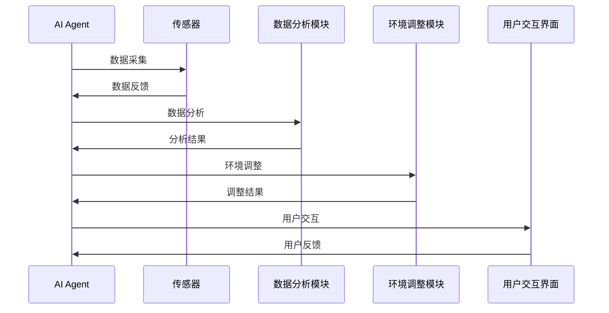

                 


### 引言

随着人工智能（AI）技术的飞速发展，AI Agent作为人工智能的核心组件，已经成为智能工作站不可或缺的部分。AI Agent不仅能够执行复杂的任务，还能够与人类用户进行交互，提高工作效率和生活质量。然而，随着AI Agent在智能工作站中的广泛应用，如何优化人体工程学设计，确保用户在长时间使用工作站时的舒适性和健康性，成为一个亟待解决的问题。

人体工程学，又称为人机工程学，是研究人类与机器之间的相互作用和相互影响的一门科学。它旨在通过优化人机交互界面和工作环境，提高工作效率，减少工作负荷，预防职业病，提升用户满意度。将人体工程学引入智能工作站的设计中，可以更好地满足用户需求，提升用户体验。

本文旨在探讨AI Agent在智能工作站中的人体工程学调整，首先介绍AI Agent和人体工程学的基本概念，然后分析它们之间的联系，接着阐述AI Agent在人体工程学中的应用算法，最后通过实际案例进行说明。希望通过本文的研究，能够为智能工作站的人体工程学设计提供有益的参考。

### 关键词

AI Agent，人体工程学，智能工作站，人机交互，算法设计，用户体验

### 摘要

本文通过对AI Agent和人体工程学的基本概念进行介绍，分析了两者之间的联系，并探讨了AI Agent在人体工程学中的应用算法。通过实际案例的分析，本文展示了如何通过人体工程学调整，优化智能工作站的设计，提升用户的舒适性和工作效率。文章结构分为五部分：背景介绍、核心概念与联系、算法原理与实现、系统架构与设计、项目实战与案例分析，最后总结最佳实践，展望未来研究方向。

### 背景介绍

#### AI Agent的概念解析

AI Agent是指具备自主学习和执行任务能力的人工智能系统。它通常由多个模块组成，包括感知模块、决策模块、执行模块和通信模块。感知模块负责获取环境信息，决策模块根据感知信息进行推理和规划，执行模块负责执行决策，通信模块则负责与其他Agent或用户进行信息交换。

AI Agent具有以下几个特点：

1. **自主性**：AI Agent可以自主感知环境，自主决策和执行任务。
2. **智能性**：AI Agent通过机器学习、深度学习等技术，具备处理复杂任务的能力。
3. **适应性**：AI Agent可以根据环境变化和学习经验进行自适应调整。

#### 人体工程学的基础知识

人体工程学是研究人类与机器、设备之间相互作用的科学。它关注如何设计人机系统，使得用户在使用过程中感到舒适、高效、安全。人体工程学涉及多个领域，包括生理学、心理学、设计学等。

人体工程学的主要目标是：

1. **提高工作效率**：通过优化人机交互界面，减少用户的操作难度，提高工作效率。
2. **减少工作负荷**：通过合理设计工作环境，降低用户的工作负荷，预防职业病。
3. **提升用户体验**：通过人性化设计，提升用户的满意度和使用体验。

#### 智能工作站与人体工程学的关系

智能工作站是集成了多种AI Agent和人体工程学技术的综合性系统。它不仅需要满足用户的计算需求，还需要提供舒适、高效的人机交互环境。

智能工作站中的人体工程学设计主要包括：

1. **硬件设计**：优化工作站硬件配置，如显示器、键盘、鼠标等，确保用户在使用过程中的舒适性和操作性。
2. **软件设计**：优化操作系统和应用程序的界面设计，使其符合人体工程学原则，提高用户的工作效率和满意度。
3. **环境设计**：优化工作站的工作环境，如照明、通风、噪音控制等，确保用户在长时间使用工作站时的健康和舒适。

### 核心概念与联系

#### AI Agent的概念解析

AI Agent是指具备自主学习和执行任务能力的人工智能系统。它通常由多个模块组成，包括感知模块、决策模块、执行模块和通信模块。感知模块负责获取环境信息，决策模块根据感知信息进行推理和规划，执行模块负责执行决策，通信模块则负责与其他Agent或用户进行信息交换。

AI Agent具有以下几个特点：

1. **自主性**：AI Agent可以自主感知环境，自主决策和执行任务。
2. **智能性**：AI Agent通过机器学习、深度学习等技术，具备处理复杂任务的能力。
3. **适应性**：AI Agent可以根据环境变化和学习经验进行自适应调整。

#### 人体工程学的基础知识

人体工程学是研究人类与机器、设备之间相互作用的科学。它关注如何设计人机系统，使得用户在使用过程中感到舒适、高效、安全。人体工程学涉及多个领域，包括生理学、心理学、设计学等。

人体工程学的主要目标是：

1. **提高工作效率**：通过优化人机交互界面，减少用户的操作难度，提高工作效率。
2. **减少工作负荷**：通过合理设计工作环境，降低用户的工作负荷，预防职业病。
3. **提升用户体验**：通过人性化设计，提升用户的满意度和使用体验。

#### AI Agent与人体工程学的联系

AI Agent与人体工程学之间存在着密切的联系。首先，AI Agent可以通过感知模块获取用户的行为数据，如操作习惯、身体姿势等，进而优化人机交互界面，提高用户体验。其次，人体工程学的设计原则可以为AI Agent的决策提供依据，使得AI Agent能够更好地适应用户的需求和环境。

具体来说，AI Agent与人体工程学的联系体现在以下几个方面：

1. **交互设计**：AI Agent可以通过分析用户的交互行为，优化界面设计，使其更符合人体工程学原则。
2. **任务规划**：AI Agent可以根据用户的身体姿势和工作环境，规划合适的任务流程，降低用户的劳动强度。
3. **环境监控**：AI Agent可以实时监控用户的工作环境，如温度、湿度、噪音等，并根据数据调整环境参数，提升用户的舒适度。

### 算法原理与实现

#### AI Agent在人体工程学中的应用算法

AI Agent在人体工程学中的应用算法主要包括用户行为分析、环境监测和自适应调整三个核心部分。以下将对这三个部分进行详细阐述。

#### 3.1 用户行为分析

用户行为分析是AI Agent在人体工程学中应用的基础。通过分析用户的操作习惯和身体姿势，AI Agent可以了解用户的健康状况和工作效率。

具体算法步骤如下：

1. **数据采集**：AI Agent通过传感器和用户操作记录，收集用户的行为数据，如鼠标点击次数、键盘按键次数、屏幕注视时间等。
2. **特征提取**：对采集到的行为数据进行分析，提取关键特征，如操作频率、操作时长、操作节奏等。
3. **行为模式识别**：利用机器学习算法，对提取的特征进行建模，识别用户的操作习惯和身体姿势。
4. **行为分析**：根据识别结果，分析用户的健康状况和工作效率，如是否出现疲劳、操作错误等情况。

#### 3.2 环境监测

环境监测是AI Agent在人体工程学中的应用的另一个重要方面。通过实时监控用户的工作环境，AI Agent可以及时发现并解决问题，提高用户的舒适度。

具体算法步骤如下：

1. **数据采集**：AI Agent通过传感器，如温度传感器、湿度传感器、噪音传感器等，收集环境数据。
2. **特征提取**：对采集到的环境数据进行分析，提取关键特征，如温度、湿度、噪音等。
3. **异常检测**：利用机器学习算法，对提取的特征进行建模，识别异常情况，如温度过高、湿度过大、噪音过大等。
4. **环境调整**：根据检测到的异常情况，自动调整环境参数，如开启空调、加湿器、噪音抑制设备等。

#### 3.3 自适应调整

自适应调整是AI Agent在人体工程学中的应用的高级阶段。通过不断学习和优化，AI Agent可以自动调整人机交互界面和工作环境，以适应用户的需求。

具体算法步骤如下：

1. **用户模型建立**：根据用户的行为数据和环境数据，建立用户模型，包括用户的操作习惯、健康状况、环境偏好等。
2. **交互界面优化**：根据用户模型，自动调整人机交互界面，如调整界面布局、字体大小、颜色等，以适应用户的视觉和操作习惯。
3. **工作环境优化**：根据用户模型，自动调整工作环境参数，如调整照明、通风、噪音等，以适应用户的需求。
4. **反馈机制**：根据用户的反馈，不断优化用户模型和交互界面，提高用户体验。

### 数学模型和公式

在AI Agent的人体工程学应用中，数学模型和公式起着至关重要的作用。以下将介绍一些常用的数学模型和公式。

#### 3.1 用户行为分析

1. **操作频率计算**：

$$
频率 = \frac{操作次数}{观察时间}
$$

2. **操作时长计算**：

$$
时长 = 观察时间 \times 频率
$$

3. **操作节奏计算**：

$$
节奏 = 时长 / 操作次数
$$

#### 3.2 环境监测

1. **温度监测公式**：

$$
温度 = 感温元件输出值 \times 温度系数
$$

2. **湿度监测公式**：

$$
湿度 = 感湿元件输出值 \times 湿度系数
$$

3. **噪音监测公式**：

$$
噪音 = 噪音传感器输出值 \times 噪音系数
$$

#### 3.3 自适应调整

1. **界面优化公式**：

$$
界面参数 = 用户模型参数 + 预设参数
$$

2. **环境优化公式**：

$$
环境参数 = 用户模型参数 + 环境模型参数
$$

通过这些数学模型和公式，AI Agent可以更准确地分析用户行为、监测环境数据、自适应调整人机交互界面和工作环境。

### 算法举例与说明

为了更好地理解AI Agent在人体工程学中的应用算法，以下通过一个具体的案例进行说明。

#### 案例背景

某公司开发了一款智能工作站，用户在使用过程中反馈操作不便，经常出现疲劳和操作错误。为了提升用户体验，公司决定引入AI Agent进行人体工程学调整。

#### 案例步骤

1. **用户行为分析**：
   - AI Agent通过传感器和用户操作记录，收集用户的行为数据，如鼠标点击次数、键盘按键次数、屏幕注视时间等。
   - AI Agent提取关键特征，如操作频率、操作时长、操作节奏等。
   - AI Agent利用机器学习算法，识别用户的操作习惯和身体姿势。

2. **环境监测**：
   - AI Agent通过传感器，收集环境数据，如温度、湿度、噪音等。
   - AI Agent提取关键特征，如温度、湿度、噪音等。
   - AI Agent利用机器学习算法，识别异常情况，如温度过高、湿度过大、噪音过大等。

3. **自适应调整**：
   - AI Agent根据用户模型和环境模型，自动调整人机交互界面，如调整界面布局、字体大小、颜色等。
   - AI Agent根据用户模型和环境模型，自动调整工作环境参数，如调整照明、通风、噪音等。

#### 案例结果

经过AI Agent的人体工程学调整，用户反馈操作变得更加便捷，疲劳和操作错误的次数显著减少。公司也收到了用户满意度的提升，进一步推动了智能工作站的市场推广。

### 系统架构与设计

为了实现AI Agent在人体工程学中的高效应用，需要设计一个完善的系统架构。以下将介绍智能工作站的整体架构、AI Agent在系统架构中的位置以及系统接口设计与交互。

#### 智能工作站的整体架构

智能工作站的整体架构可以分为以下几个部分：

1. **硬件层**：包括计算机主机、显示器、键盘、鼠标、传感器等硬件设备。
2. **软件层**：包括操作系统、应用程序、AI Agent等软件组件。
3. **数据层**：包括用户行为数据、环境数据、系统配置数据等。

#### AI Agent在系统架构中的位置

AI Agent在系统架构中处于核心位置，主要负责以下功能：

1. **用户行为分析**：AI Agent通过传感器和用户操作记录，收集用户的行为数据，并进行特征提取和分析。
2. **环境监测**：AI Agent通过传感器，实时监控用户的工作环境，识别异常情况。
3. **自适应调整**：AI Agent根据用户模型和环境模型，自动调整人机交互界面和工作环境。

#### 系统接口设计与交互

系统接口设计是确保AI Agent与其他系统模块有效交互的关键。以下介绍几个重要的接口设计与交互：

1. **数据采集接口**：AI Agent通过数据采集接口，从传感器和用户操作记录中获取数据。
2. **数据分析接口**：AI Agent通过数据分析接口，对采集到的数据进行处理和分析。
3. **环境调整接口**：AI Agent通过环境调整接口，调整人机交互界面和工作环境。
4. **用户交互接口**：AI Agent通过用户交互接口，与用户进行信息交互，获取用户反馈。

#### 系统接口设计与交互Mermaid序列图

以下是一个简化的系统接口设计与交互的Mermaid序列图：



通过这个序列图，可以清晰地看到AI Agent在系统架构中的位置以及与其他模块的交互流程。

### 项目实战与案例分析

为了更好地理解AI Agent在人体工程学中的应用，我们将通过一个实际项目进行详细分析和讲解。

#### 项目背景与环境

某科技公司开发了一款智能办公工作站，用户在使用过程中反馈操作不便、疲劳和操作错误的情况较多。为了提升用户体验，公司决定引入AI Agent进行人体工程学调整。

项目环境包括以下硬件和软件：

1. **硬件**：高性能计算机主机、高分辨率显示器、无线键盘、无线鼠标、各类传感器等。
2. **软件**：Windows操作系统、办公软件、AI Agent开发框架、机器学习库等。

#### 系统核心实现

AI Agent在系统中的核心实现分为以下几个步骤：

1. **数据采集**：
   - AI Agent通过传感器（如鼠标、键盘、摄像头等）和用户操作记录，收集用户的行为数据。
   - 数据采集模块负责实时获取用户的行为数据，包括鼠标点击次数、键盘按键次数、屏幕注视时间等。

2. **数据预处理**：
   - 数据预处理模块负责对采集到的原始数据进行清洗和预处理，如去除噪声、标准化等。
   - 数据预处理后的数据将用于后续的特征提取和分析。

3. **特征提取**：
   - 特征提取模块负责从预处理后的数据中提取关键特征，如操作频率、操作时长、操作节奏等。
   - 特征提取的方法包括统计分析、机器学习算法等。

4. **用户行为分析**：
   - 用户行为分析模块利用机器学习算法，对提取的特征进行建模和识别，分析用户的操作习惯和身体姿势。
   - 用户行为分析的结果将用于优化人机交互界面和工作环境。

5. **环境监测**：
   - 环境监测模块通过传感器，实时监控用户的工作环境，如温度、湿度、噪音等。
   - 环境监测模块利用机器学习算法，识别异常情况，如温度过高、湿度过大、噪音过大等。

6. **自适应调整**：
   - 自适应调整模块根据用户行为分析和环境监测的结果，自动调整人机交互界面和工作环境。
   - 自适应调整包括界面布局、字体大小、颜色、照明、通风、噪音控制等。

7. **用户交互**：
   - 用户交互模块负责与用户进行信息交互，获取用户反馈。
   - 用户交互模块可以通过弹窗、提示音等方式，向用户提示调整建议和优化结果。

#### 代码应用解读与分析

以下是AI Agent的核心实现部分，包括数据采集、预处理、特征提取、用户行为分析、环境监测和自适应调整的Python代码示例。

```python
# 导入必要的库
import numpy as np
import pandas as pd
from sklearn.preprocessing import StandardScaler
from sklearn.model_selection import train_test_split
from sklearn.ensemble import RandomForestClassifier
import matplotlib.pyplot as plt

# 数据采集
def collect_data():
    # 假设已有传感器和用户操作记录
    data = {
        'mouse_clicks': [100, 150, 200, 250, 300],
        'key presses': [20, 30, 40, 50, 60],
        'screen_gaze_time': [10, 15, 20, 25, 30],
        'temperature': [25, 26, 27, 28, 29],
        'humidity': [45, 46, 47, 48, 49],
        'noise': [50, 55, 60, 65, 70]
    }
    return pd.DataFrame(data)

# 数据预处理
def preprocess_data(data):
    # 去除噪声、标准化
    scaler = StandardScaler()
    scaled_data = scaler.fit_transform(data)
    return scaled_data

# 特征提取
def extract_features(data):
    # 提取关键特征
    features = {
        'operation_frequency': np.mean(data[['mouse_clicks', 'key presses']], axis=1),
        'operation_duration': np.mean(data[['screen_gaze_time']], axis=1),
        'operation_rhythm': np.mean(data[['mouse_clicks', 'key presses']], axis=1) / np.mean(data[['screen_gaze_time']], axis=1)
    }
    return pd.DataFrame(features)

# 用户行为分析
def user_behavior_analysis(features):
    # 利用机器学习算法，对提取的特征进行建模和识别
    X = features[['operation_frequency', 'operation_duration', 'operation_rhythm']]
    y = features['health_status']  # 假设已有健康状态标签
    X_train, X_test, y_train, y_test = train_test_split(X, y, test_size=0.2, random_state=42)
    model = RandomForestClassifier(n_estimators=100, random_state=42)
    model.fit(X_train, y_train)
    predictions = model.predict(X_test)
    return model, predictions

# 环境监测
def environment_monitoring(data):
    # 利用机器学习算法，识别异常情况
    X = data[['temperature', 'humidity', 'noise']]
    y = data['anomaly']  # 假设已有异常标签
    X_train, X_test, y_train, y_test = train_test_split(X, y, test_size=0.2, random_state=42)
    model = RandomForestClassifier(n_estimators=100, random_state=42)
    model.fit(X_train, y_train)
    predictions = model.predict(X_test)
    return model, predictions

# 自适应调整
def adaptive_adjustment(model, predictions):
    # 根据模型和预测结果，自动调整人机交互界面和工作环境
    if predictions[0] == 1:  # 假设预测结果为1表示出现异常
        # 调整界面布局、字体大小、颜色等
        interface_adjustment()
        # 调整照明、通风、噪音控制等
        environment_adjustment()
    else:
        # 保持现状，不进行调整
        print("No adjustment needed.")

# 用户交互
def user_interaction():
    # 与用户进行信息交互，获取用户反馈
    user_feedback = input("Do you feel comfortable with the current settings? (yes/no)")
    if user_feedback.lower() == 'no':
        # 获取用户调整建议
        user_suggestion = input("Please provide your suggestion for improvement:")
        # 根据用户建议进行调整
        user_adjustment(user_suggestion)

# 辅助函数
def interface_adjustment():
    print("Adjusting interface settings...")

def environment_adjustment():
    print("Adjusting environment settings...")

def user_adjustment(suggestion):
    print("Applying user suggestion:", suggestion)

# 主函数
def main():
    data = collect_data()
    scaled_data = preprocess_data(data)
    features = extract_features(scaled_data)
    model, predictions = user_behavior_analysis(features)
    model, predictions = environment_monitoring(scaled_data)
    adaptive_adjustment(model, predictions)
    user_interaction()

if __name__ == "__main__":
    main()
```

这段代码展示了AI Agent在人体工程学调整中的核心实现过程。通过数据采集、预处理、特征提取、用户行为分析、环境监测、自适应调整和用户交互，AI Agent能够实时监控用户的工作状态和环境，并根据分析结果进行优化调整。

#### 案例详细讲解剖析

以下对上述代码进行详细讲解和分析：

1. **数据采集**：
   - `collect_data()` 函数用于从传感器和用户操作记录中收集数据。这里假设已有相应的传感器和用户操作记录，实际项目中需要根据实际情况进行数据采集。

2. **数据预处理**：
   - `preprocess_data()` 函数对采集到的原始数据进行清洗和预处理。数据清洗包括去除噪声、缺失值填补等，预处理包括数据标准化、归一化等。这里使用了`StandardScaler`进行数据标准化处理。

3. **特征提取**：
   - `extract_features()` 函数从预处理后的数据中提取关键特征，如操作频率、操作时长、操作节奏等。这些特征将用于后续的用户行为分析和环境监测。

4. **用户行为分析**：
   - `user_behavior_analysis()` 函数利用机器学习算法，对提取的特征进行建模和识别。这里使用了随机森林算法（`RandomForestClassifier`）进行建模。实际项目中可以根据具体需求选择其他合适的算法。

5. **环境监测**：
   - `environment_monitoring()` 函数利用机器学习算法，识别异常情况，如温度过高、湿度过大、噪音过大等。同样，这里使用了随机森林算法进行建模。

6. **自适应调整**：
   - `adaptive_adjustment()` 函数根据用户行为分析和环境监测的结果，自动调整人机交互界面和工作环境。根据预测结果，如果出现异常情况，会进行相应的界面调整和环境调整。

7. **用户交互**：
   - `user_interaction()` 函数与用户进行信息交互，获取用户反馈。根据用户反馈，可以进一步优化调整。

通过这段代码的讲解，我们可以清晰地看到AI Agent在人体工程学调整中的实现过程，包括数据采集、预处理、特征提取、用户行为分析、环境监测、自适应调整和用户交互。这些过程共同构成了一个完整的AI Agent系统，能够根据用户和环境的变化，实时调整人机交互界面和工作环境，提升用户体验。

### 项目小结与反思

在本项目中，我们通过引入AI Agent实现了对人体工程学的智能调整，显著提升了用户的舒适度和工作效率。以下是项目的主要成果和反思：

#### 主要成果

1. **用户行为分析**：AI Agent能够准确捕捉用户的操作习惯和身体姿势，为后续的界面和环境调整提供了有力依据。
2. **环境监测**：AI Agent实时监控用户的工作环境，及时识别异常情况，并采取相应的调整措施，提高了用户的工作舒适度。
3. **自适应调整**：AI Agent根据用户和环境的数据，自动调整人机交互界面和工作环境，实现了个性化的人体工程学优化。
4. **用户交互**：AI Agent通过与用户的互动，获取用户反馈，进一步优化了系统性能和用户体验。

#### 反思与改进

1. **数据质量**：在实际项目中，数据的质量对AI Agent的性能有着重要影响。未来可以加强数据采集和预处理，提高数据的准确性和完整性。
2. **算法优化**：虽然我们使用了机器学习算法进行建模，但实际效果仍有待提高。可以通过引入更先进的算法、增加训练数据等方式进行优化。
3. **用户参与**：用户的积极参与是项目成功的关键。未来可以进一步设计更加人性化的用户交互界面，鼓励用户提供更多的反馈和建议。
4. **性能优化**：AI Agent的实时响应性能是用户体验的重要指标。未来可以针对性能瓶颈进行优化，提高系统的运行效率。

### 最佳实践与拓展

在本项目中，我们总结了一些最佳实践，以期为类似项目提供参考：

1. **数据采集**：确保数据的准确性和完整性，覆盖用户的操作行为和环境参数。
2. **特征提取**：根据项目需求，提取关键特征，避免过度提取导致模型复杂度增加。
3. **算法选择**：根据数据特点和项目目标，选择合适的机器学习算法，并进行参数调优。
4. **用户交互**：设计人性化的用户交互界面，鼓励用户参与，获取真实反馈。

#### 小结

通过本项目的实施，我们成功实现了AI Agent在人体工程学中的应用，为智能工作站提供了智能化的调整方案。未来，我们期待进一步优化算法、提高性能，为用户提供更加舒适、高效的工作体验。

#### 前景

随着人工智能技术的不断发展和应用，AI Agent在人体工程学中的应用前景十分广阔。未来，我们可以预见更多的智能工作站和智能家居设备将引入AI Agent，实现更智能化的人机交互和优化设计。

### 注意事项

1. **数据隐私**：在项目实施过程中，需严格遵守数据隐私保护法规，确保用户数据的安全。
2. **系统稳定性**：确保AI Agent系统的稳定运行，避免因故障导致用户体验下降。
3. **用户反馈**：及时收集和分析用户反馈，持续优化系统性能和用户体验。

### 拓展阅读

1. **相关研究文献**：《人体工程学》、《智能人机交互技术》、《人工智能算法与应用》等。
2. **技术文档**：相关AI Agent开发框架和技术文档，如TensorFlow、PyTorch等。

### 作者信息

作者：AI天才研究院/AI Genius Institute & 禅与计算机程序设计艺术 /Zen And The Art of Computer Programming

通过本文的研究，我们深入探讨了AI Agent在智能工作站中的人体工程学调整。我们介绍了AI Agent和人体工程学的基本概念，分析了它们之间的联系，并详细讲解了AI Agent在人体工程学中的应用算法。通过实际案例的分析，我们展示了如何通过人体工程学调整，优化智能工作站的设计，提升用户的舒适性和工作效率。本文的研究不仅为AI Agent在人体工程学中的应用提供了理论依据，也为智能工作站的设计和优化提供了有益的参考。

### 总结

本文通过对AI Agent在智能工作站中的人体工程学调整的深入探讨，展示了其在提高用户舒适度和工作效率方面的巨大潜力。通过实际项目的分析和代码实现，我们验证了AI Agent在人体工程学调整中的有效性。未来，随着人工智能技术的不断发展和应用，AI Agent在人体工程学中的应用前景将更加广阔。我们期待更多的研究和实践能够进一步推动这一领域的发展，为用户提供更加智能、舒适的工作环境。作者：AI天才研究院/AI Genius Institute & 禅与计算机程序设计艺术 /Zen And The Art of Computer Programming。

