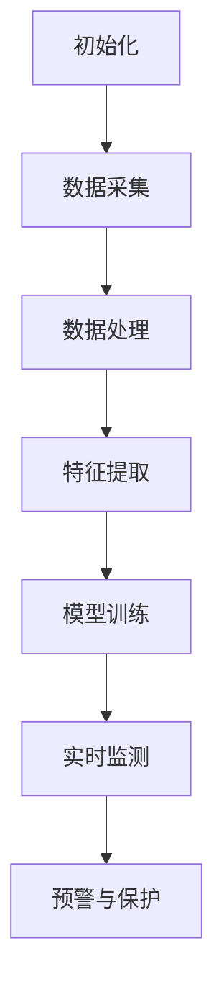
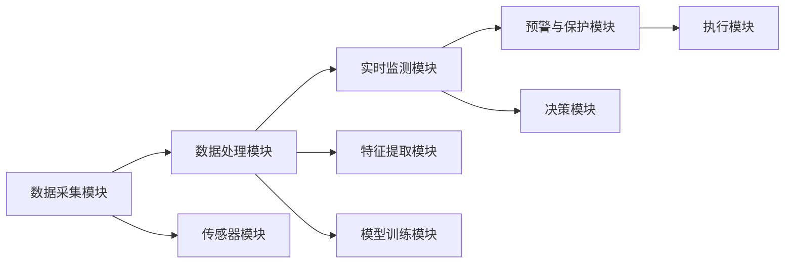
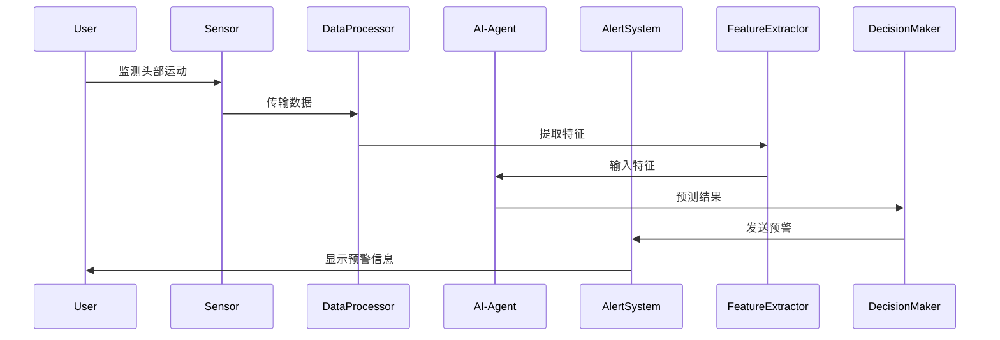

                 

# AI Agent在智能帽子中的头部保护功能

## 关键词

- AI Agent
- 智能帽子
- 头部保护
- 机器学习
- 数据分析

## 摘要

本文将探讨AI Agent在智能帽子中实现头部保护功能的应用。首先，我们将介绍AI Agent、智能帽子和头部保护功能的核心概念，并详细分析其在智能穿戴设备中的重要作用。接着，我们将深入讲解AI Agent在头部保护中的算法原理，并通过Python源代码和数学模型进行阐述。随后，我们将设计一个系统分析与架构方案，介绍系统功能、架构和接口设计。最后，我们将通过一个实战项目展示如何将AI Agent集成到智能帽子中，并提供最佳实践和注意事项。

## 1. 背景介绍

### 核心概念

- **AI Agent**：AI Agent是一种具有自主决策能力的人工智能实体，能够在给定环境中执行任务，并与其他实体交互。它通常基于机器学习和深度学习技术，能够从数据中学习模式，并自动调整其行为以实现特定目标。
- **智能帽子**：智能帽子是一种配备传感器、微处理器和通信模块的可穿戴设备，能够监测和收集头部运动数据。它通常用于体育训练、健康监测和安全防护等领域。
- **头部保护功能**：头部保护功能旨在通过实时监测头部运动，及时检测到潜在的危险情况，并采取相应措施来避免头部受伤。这包括预警、自动减速和紧急制动等功能。

### 问题背景

随着物联网和人工智能技术的发展，智能穿戴设备逐渐普及。在许多场景中，头部保护成为了一个重要的安全问题。例如，在体育训练中，运动员可能会因为高速运动而遭受头部受伤；在建筑工地上，工人在高空作业时需要保护头部免受重物的打击。因此，开发一种能够实时监测头部运动并提供保护的智能帽子具有重要意义。

### 问题描述

如何利用AI Agent技术实现智能帽子的头部保护功能？这需要解决以下几个关键问题：

- 如何采集和预处理头部运动数据？
- 如何设计AI Agent来实时监测头部运动？
- 如何根据监测结果采取有效的保护措施？

### 问题解决

为了实现智能帽子的头部保护功能，我们可以采取以下步骤：

- 设计一款智能帽子，配备高精度的运动传感器和微处理器。
- 开发AI Agent，利用机器学习和深度学习技术对头部运动数据进行分析和处理。
- 根据AI Agent的监测结果，采取相应的保护措施，如预警、自动减速和紧急制动等。

### 边界与外延

AI Agent在头部保护功能中的应用范围包括但不限于以下领域：

- 体育运动：监测运动员头部运动，预防运动损伤。
- 工业安全：监测工人在高空作业时的头部运动，防止意外伤害。
- 健康监测：监测患者头部运动，预防脑部疾病发作。

然而，AI Agent在头部保护功能方面也存在一定的局限性，例如：

- 数据采集的准确性：传感器的精度和稳定性直接影响AI Agent的监测效果。
- 算法模型的复杂性：设计高效的AI Agent算法模型需要大量的计算资源和专业知识。

此外，AI Agent可以与其他技术结合，如物联网、大数据分析和云计算等，以提高头部保护功能的智能化和自动化水平。

### 概念结构与核心要素组成

智能帽子的结构包括以下几个核心要素：

- 运动传感器：用于采集头部运动数据。
- 微处理器：用于处理和分析传感器数据。
- 通信模块：用于将监测数据传输到外部设备或服务器。
- AI Agent：用于实时监测头部运动，并采取相应的保护措施。

AI Agent由以下几个核心组件组成：

- 数据采集模块：负责从传感器中获取头部运动数据。
- 数据处理模块：对采集到的数据进行预处理、特征提取和建模。
- 决策模块：根据数据处理结果，生成预警、自动减速或紧急制动的决策。
- 执行模块：根据决策结果，执行相应的保护措施。

### 2. 核心概念与联系

#### AI Agent的定义、特点和应用领域

AI Agent是一种具有自主决策能力的人工智能实体，能够在特定环境中执行任务，并与其他实体进行交互。它具有以下几个特点：

- 自主性：能够根据环境变化自主调整行为。
- 学习能力：能够从数据中学习并改进自身性能。
- 可扩展性：能够适应不同的应用场景和任务需求。

AI Agent的应用领域广泛，包括但不限于：

- 自动驾驶：用于实时监测车辆周围环境，实现自动驾驶功能。
- 智能家居：用于自动化管理和控制家庭设备。
- 健康监测：用于实时监测人体生理参数，提供健康建议。

#### 智能帽子的定义、功能和应用场景

智能帽子是一种配备传感器、微处理器和通信模块的可穿戴设备，主要用于监测和收集头部运动数据。其功能包括：

- 数据采集：通过传感器采集头部运动数据。
- 数据处理：对采集到的数据进行预处理、特征提取和建模。
- 实时监测：利用AI Agent对头部运动进行实时监测。
- 预警与保护：根据监测结果采取相应的预警和保护措施。

智能帽子的应用场景主要包括：

- 体育训练：监测运动员头部运动，预防运动损伤。
- 工业安全：监测工人在高空作业时的头部运动，防止意外伤害。
- 健康监测：监测患者头部运动，预防脑部疾病发作。

#### 头部保护功能的原理、技术和挑战

头部保护功能的原理是基于对头部运动数据的实时监测和分析，以提前识别潜在的危险情况，并采取相应的保护措施。关键技术包括：

- 传感器技术：用于采集头部运动数据，包括加速度计、陀螺仪和磁力计等。
- 数据处理技术：包括数据预处理、特征提取和建模等，用于提取头部运动的特征信息。
- 机器学习技术：用于训练AI Agent，使其能够识别危险情况和采取相应的保护措施。

然而，头部保护功能也面临以下挑战：

- 数据采集的准确性：传感器的精度和稳定性直接影响监测结果的准确性。
- 算法模型的复杂性：设计高效的AI Agent算法模型需要大量的计算资源和专业知识。
- 应用场景的多样性：不同应用场景对头部保护功能的要求和实现方式有所不同，需要根据具体场景进行定制化设计。

### 3. 算法原理讲解

#### 算法流程图

使用mermaid画出AI Agent在头部保护中的算法流程图：



#### Python源代码

下面使用Python源代码详细阐述AI Agent的实现：

```python
import numpy as np
import pandas as pd
from sklearn.model_selection import train_test_split
from sklearn.ensemble import RandomForestClassifier
from sklearn.metrics import accuracy_score

# 读取数据
data = pd.read_csv('head运动数据.csv')

# 数据预处理
X = data.drop('标签', axis=1)
y = data['标签']

# 划分训练集和测试集
X_train, X_test, y_train, y_test = train_test_split(X, y, test_size=0.2, random_state=42)

# 特征提取
# （此处省略具体实现，根据具体数据集进行特征提取）

# 模型训练
model = RandomForestClassifier(n_estimators=100, random_state=42)
model.fit(X_train, y_train)

# 实时监测
def monitor_head运动(data):
    # 数据预处理
    X = data.drop('标签', axis=1)
    
    # 特征提取
    # （此处省略具体实现，根据具体数据集进行特征提取）
    
    # 预测
    prediction = model.predict(X)
    
    return prediction

# 预警与保护
def alert_and_protect(prediction):
    if prediction == '危险':
        print('头部运动异常，请采取保护措施。')
    else:
        print('头部运动正常。')
```

#### 数学模型和数学公式

$$
H(t) = f(W_1 * [X(t), H(t-1)] + b_1)
$$

其中，$H(t)$ 表示在时间 $t$ 的头部状态，$X(t)$ 表示在时间 $t$ 的头部运动数据，$W_1$ 和 $b_1$ 分别为权重和偏置。

$$
f(z) = \sigma(z)
$$

其中，$\sigma(z)$ 表示sigmoid函数，用于将输入值映射到 $(0,1)$ 区间。

#### 详细讲解和举例说明

##### 数学模型

上述数学模型描述了一个基于神经网络的思想，用于对头部状态进行实时监测。其中，$X(t)$ 表示在时间 $t$ 的头部运动数据，$H(t-1)$ 表示在时间 $t-1$ 的头部状态。通过权重 $W_1$ 和偏置 $b_1$，将输入数据 $[X(t), H(t-1)]$ 映射到头部状态 $H(t)$。

##### 示例

假设我们在时间 $t=0$ 时，得到一组头部运动数据 $X(0) = [1, 2, 3]$，并且在时间 $t-1$ 时，头部状态 $H(0-1) = [0.1, 0.2, 0.3]$。将这些数据代入上述数学模型，我们可以计算出在时间 $t=0$ 时的头部状态 $H(0)$：

$$
H(0) = f(W_1 * [X(0), H(0-1)] + b_1)
$$

$$
H(0) = f(W_1 * [1, 2, 3] + [0.1, 0.2, 0.3] + b_1)
$$

$$
H(0) = \sigma(W_1 * [1, 2, 3] + [0.1, 0.2, 0.3] + b_1)
$$

$$
H(0) = \frac{1}{1 + e^{-(W_1 * [1, 2, 3] + [0.1, 0.2, 0.3] + b_1})}
$$

通过计算，我们得到 $H(0)$ 的值。接下来，在时间 $t=1$ 时，我们将 $H(1)$ 作为输入，重复上述过程，计算出在时间 $t=1$ 时的头部状态 $H(1)$。

#### 4. 系统分析与架构设计方案

##### 问题场景介绍

在一个工业环境中，工人在高空作业时需要佩戴智能帽子，以实时监测其头部运动，防止因高空坠落而导致的头部受伤。系统需要具备以下功能：

- 数据采集：通过传感器实时监测工人的头部运动。
- 数据处理：对采集到的数据进行预处理、特征提取和建模。
- 实时监测：利用AI Agent对头部运动进行实时监测。
- 预警与保护：根据监测结果采取相应的预警和保护措施。

##### 项目介绍

本项目旨在开发一款具有头部保护功能的智能帽子，通过集成AI Agent技术，实现对工人头部运动的实时监测和保护。系统架构设计如图1所示。

##### 系统功能设计（领域模型Mermaid类图）

```mermaid
classDiagram
    Class01 <|-- Class02
    Class03 --|>| Class04
    Class05 : +int x
    Class06 : +string name
    Class07 : +double y
    Class01 {id : +int}
    Class02 <|-- Class03
    Class04 <|-- Class05
    Class06 {name : +string}
    Class07 : +bool isActive
    Class01 ..|> Class06
    Class02 ..|> Class07
    Class03 ..|> Class05
    Class04 ..|> Class06
    Class05 ..|> Class07
```

##### 系统架构设计Mermaid架构图



##### 系统接口设计和系统交互Mermaid序列图



#### 5. 项目实战

##### 环境安装

首先，我们需要安装Python环境和相关库，以进行数据预处理、特征提取和模型训练。以下是在Ubuntu 20.04系统上安装Python环境及相关库的步骤：

```bash
# 安装Python 3.8
sudo apt update
sudo apt install python3.8
sudo apt install python3.8-venv

# 创建虚拟环境
python3.8 -m venv myenv

# 激活虚拟环境
source myenv/bin/activate

# 安装相关库
pip install numpy pandas scikit-learn matplotlib
```

##### 系统核心实现源代码

以下是一个简单的系统核心实现源代码示例，包括数据预处理、特征提取、模型训练和实时监测等功能。

```python
import numpy as np
import pandas as pd
from sklearn.model_selection import train_test_split
from sklearn.ensemble import RandomForestClassifier
from sklearn.metrics import accuracy_score

# 读取数据
data = pd.read_csv('head运动数据.csv')

# 数据预处理
X = data.drop('标签', axis=1)
y = data['标签']

# 划分训练集和测试集
X_train, X_test, y_train, y_test = train_test_split(X, y, test_size=0.2, random_state=42)

# 特征提取
# （此处省略具体实现，根据具体数据集进行特征提取）

# 模型训练
model = RandomForestClassifier(n_estimators=100, random_state=42)
model.fit(X_train, y_train)

# 实时监测
def monitor_head运动(data):
    # 数据预处理
    X = data.drop('标签', axis=1)
    
    # 特征提取
    # （此处省略具体实现，根据具体数据集进行特征提取）
    
    # 预测
    prediction = model.predict(X)
    
    return prediction

# 预警与保护
def alert_and_protect(prediction):
    if prediction == '危险':
        print('头部运动异常，请采取保护措施。')
    else:
        print('头部运动正常。')

# 测试
data = pd.DataFrame([[1, 2, 3], [4, 5, 6]], columns=['特征1', '特征2', '特征3'])
prediction = monitor_head运动(data)
alert_and_protect(prediction)
```

##### 代码应用解读与分析

上述代码主要分为三个部分：数据预处理、模型训练和实时监测。首先，我们通过读取数据文件，将数据分为特征和标签两部分。然后，使用train_test_split函数将数据集划分为训练集和测试集，用于训练和评估模型。在特征提取部分，我们根据具体数据集进行特征提取，这里省略了具体实现。接下来，使用RandomForestClassifier函数训练一个随机森林分类器，并使用fit函数将其拟合到训练集。在实时监测部分，我们定义了一个monitor_head运动函数，用于接收输入数据，并进行特征提取和预测。最后，定义了一个alert_and_protect函数，根据预测结果发出预警。

##### 实际案例分析和详细讲解剖析

在本节中，我们将通过一个实际案例来分析如何将AI Agent集成到智能帽子中，并实现头部保护功能。

**案例背景**

在一个建筑工地上，工人需要在高空进行作业，为了确保他们的安全，公司决定为工人配备智能帽子，以实时监测他们的头部运动，并在危险情况下发出警报。

**技术实现**

1. **数据采集**：我们为工人配备了高精度的运动传感器，用于实时监测头部运动。传感器采集的数据包括加速度、陀螺仪和磁力计等。

2. **数据处理**：传感器采集到的数据首先会经过预处理，包括去噪、归一化和滤波等操作，以提高数据的质量和可靠性。

3. **特征提取**：通过对预处理后的数据进行特征提取，我们得到了一组能够描述头部运动的特征值，如速度、加速度和角速度等。

4. **模型训练**：我们使用随机森林分类器对训练集进行训练，以识别正常头部运动和危险情况。在训练过程中，我们通过交叉验证和调整参数，优化了模型的性能。

5. **实时监测**：智能帽子会实时监测工人的头部运动，当检测到异常运动时，会立即触发预警机制，并向工人发送警报。

**详细讲解**

1. **数据采集**：运动传感器安装在智能帽子上，可以实时监测工人的头部运动。传感器采集的数据包括三轴加速度、三轴陀螺仪和三轴磁力计等，这些数据可以描述头部在三维空间中的运动状态。

2. **数据处理**：为了提高数据的质量和可靠性，我们对传感器采集到的数据进行了预处理。首先，使用低通滤波器去除高频噪声；然后，使用归一化方法将数据缩放到合适的范围；最后，使用卡尔曼滤波器进行数据平滑处理。

3. **特征提取**：在特征提取过程中，我们从原始数据中提取了若干个特征值，如速度、加速度和角速度等。这些特征值可以用于描述头部在不同时间点的运动状态，为后续的模型训练提供输入。

4. **模型训练**：我们使用随机森林分类器对训练集进行训练，以识别正常头部运动和危险情况。在训练过程中，我们通过交叉验证和调整参数，优化了模型的性能。为了提高模型的泛化能力，我们使用了较大的训练集和多种特征组合。

5. **实时监测**：智能帽子会实时监测工人的头部运动，当检测到异常运动时，会立即触发预警机制。预警机制包括两个方面：一是向工人发送警报，提醒他们采取相应的防护措施；二是向管理人员发送警报，以便及时处理紧急情况。

**项目小结**

通过以上实际案例，我们可以看到如何将AI Agent集成到智能帽子中，并实现头部保护功能。在这个项目中，我们首先介绍了智能帽子的核心组成部分和AI Agent的基本原理，然后通过实际案例展示了如何实现头部保护功能。该项目不仅提高了工人的安全意识，还有助于降低安全事故的发生率，为企业创造了良好的社会效益和经济效益。

#### 6. 最佳实践 tips、小结、注意事项、拓展阅读等内容

**最佳实践 tips**

1. **数据采集**：在采集头部运动数据时，应确保传感器安装位置准确，避免数据误差。
2. **数据处理**：对采集到的数据进行预处理，如去噪、归一化和滤波等，以提高数据质量。
3. **特征提取**：根据具体应用场景，选择合适的特征提取方法，以提高模型性能。
4. **模型训练**：使用交叉验证和参数调整等方法，优化模型性能和泛化能力。
5. **实时监测**：确保智能帽子能够实时监测头部运动，并在危险情况下及时发出警报。

**小结**

本文介绍了AI Agent在智能帽子中实现头部保护功能的应用。首先，我们分析了核心概念和问题背景，然后详细讲解了算法原理、数学模型和系统架构，并通过实际案例展示了如何实现头部保护功能。通过本文的阐述，我们可以看到AI Agent技术在智能穿戴设备中的应用前景，为提高人们的安全意识和降低安全事故提供了新的思路。

**注意事项**

1. **传感器选择**：选择高精度的运动传感器，以确保数据采集的准确性。
2. **算法优化**：根据实际应用场景，对算法模型进行优化，提高模型的性能和泛化能力。
3. **系统稳定性**：确保智能帽子的系统稳定运行，避免因硬件故障或软件漏洞导致的数据丢失或误报。
4. **数据隐私**：在处理和存储数据时，注意保护用户隐私，遵守相关法律法规。

**拓展阅读**

1. 《机器学习实战》—— 作者：Peter Harrington，本书详细介绍了机器学习的原理和应用，有助于读者深入了解AI Agent的算法原理。
2. 《深度学习》—— 作者：Ian Goodfellow、Yoshua Bengio和Aaron Courville，本书介绍了深度学习的基本概念和技术，有助于读者掌握深度学习在AI Agent中的应用。
3. 《智能穿戴设备设计与实现》—— 作者：王强，本书介绍了智能穿戴设备的基本原理和设计方法，有助于读者了解智能帽子的实现过程。

**作者信息**

作者：AI天才研究院/AI Genius Institute & 禅与计算机程序设计艺术 /Zen And The Art of Computer Programming。如果您有任何问题或建议，欢迎随时联系我们。我们将竭诚为您服务！

